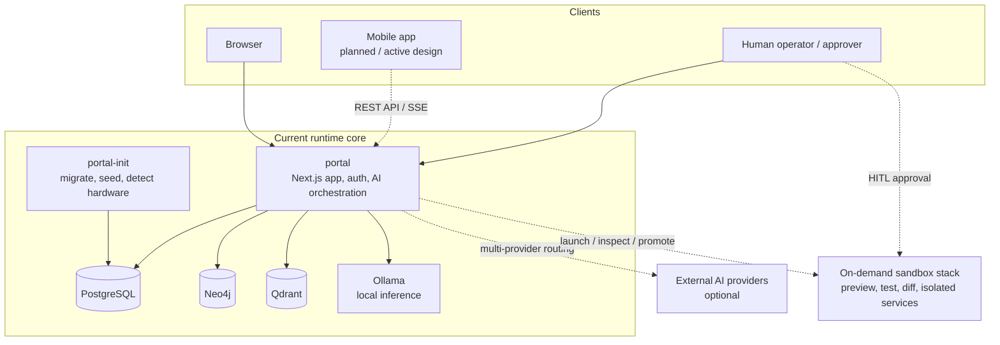
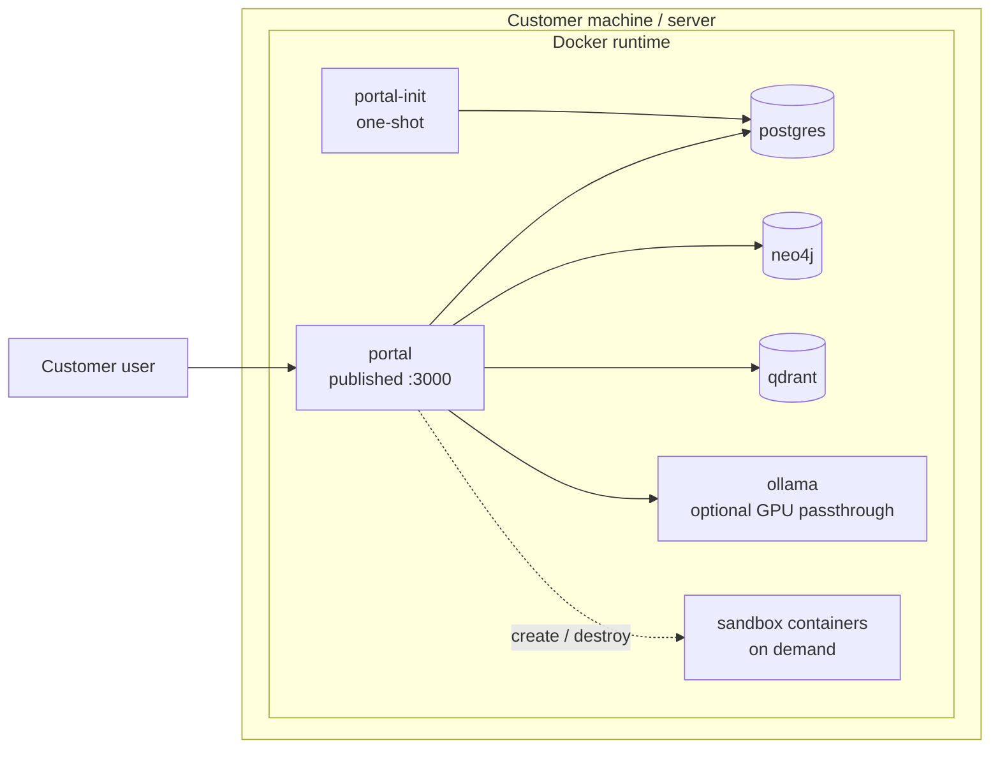
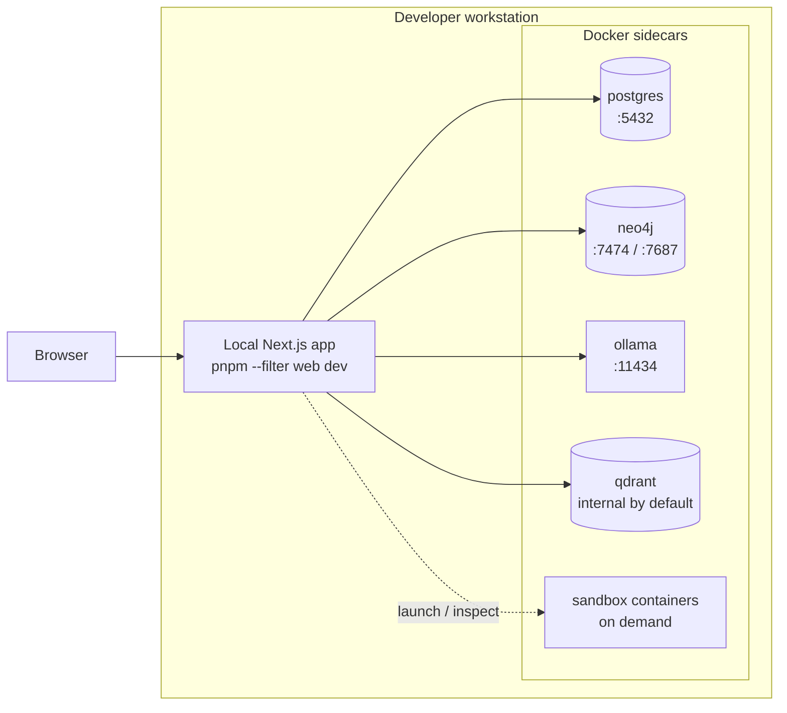
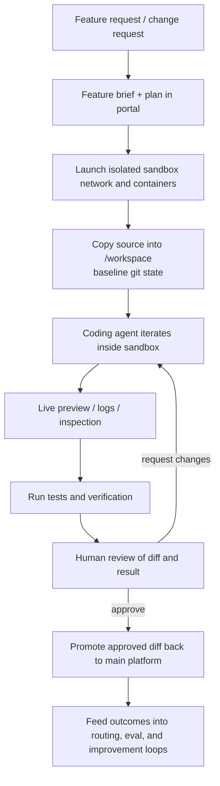

# Open Digital Product Factory

**The platform that builds itself.**

An open-source, AI-native digital product management platform that gives any organization — from a 5-person startup to a regulated enterprise — the same capabilities that only the largest tech companies have today. Built-in AI agents don't just answer questions: they manage your portfolio, model your architecture, execute your backlog, and eventually write the features you need — all with human approval at every step.

No vendor lock-in. No consultants. No million-dollar license. One click to install. Your AI workforce starts working immediately.

---

## Why It Exists

I have been in the enterprise software business for many years, and with the advent of AI it's clear that anyone can take advantage of enterprise grade software and processes, with little to no experience. The know-how and experiences of the professionals is now commoditized in a limitless workforce, we just need to get it started in the right way, and this is my vision for that future. Portfolio management, enterprise architecture, backlog tracking, lifecycle governance — these are locked behind expensive platforms that require specialized teams to operate. This built from scratch platform does this at a basic level, and can grow as your needs grow. Virtually limitless.

**What if the platform could operate itself?**

The Open Digital Product Factory is built on a radical premise: **AI agents should be first-class participants in the work**, not bolt-on assistants. Every screen has a context-aware AI co-worker. Every action an agent proposes goes through human-in-the-loop governance. Every decision is audit-logged. The platform knows what hardware it's running on, what models are available, and how to optimize its own AI workforce.

And because it's open source and self-contained (runs entirely on your hardware or in the cloud with a built in, local AI engine), there are **no data privacy concerns, no cloud dependency, and no subscription fees** unless you want take it to that next level.

### The Vision: A Self-Evolving Platform

Today, this platform manages your digital products. Tomorrow, it writes new features that you need — in a governed, professional manner without needing to be a developer. There is a sandbox, design and user experience is reviewed by humans, deployed when approved automatically. A single, small business owner can describe what they need in plain language, the system steps through the processes of creating it. On your hardware, the way you want. The AI can help every step of the way, builds it, deploys it, manages it. The platform grows from within.

Your data stays on your hardware. The AI agents are there to help you grow and use the features you want, but they maintain their distance. AI co-workers are yours to command and controls for them is built in. No worrying about the data leaking out, and the AI hackers getting in.

> **Hive Mind:** Optional, you may opt-in to share what you develop with the community. Each installation is a node, extended locally for your use. But, you can choose to contribute your extensions back to the community too. The community grows the platform from within — humans and AI agents working together, helping people work together.

---

## Who This Is For

- **Small business owners** who need enterprise-grade digital product management without enterprise-grade budgets or teams
- **Regulated industries** (healthcare, finance, insurance) that need audit trails, human approval chains, and compliance evidence — built in, not bolted on
- **IT leaders** who want to model their architecture, manage their portfolio, and track their backlog in one governed platform
- **Concerned citizens** who want to use AI without the AI platforms owning you and your business outright
- **Developers and architects** who want to extend and contribute to an open platform that treats AI as a core capability, not a chatbot sidebar

---

## Installation

There are two ways to install, depending on your situation:

| Path | Who it's for | What it does |
|------|-------------|--------------|
| **[User Install](#user-install-windows)** | Business users, non-technical | Everything runs inside Docker. One script, no coding tools needed. |
| **[Developer Setup](#developer-setup)** | Developers contributing to the platform | Databases in Docker with ports exposed to the host. Next.js runs locally so you can use your IDE, debugger, and hot-reload. |

---

### User Install (Windows)

No technical experience needed. The installer handles everything automatically.

1. Download both files into the same folder (right-click each link -> "Save link as..."):
   - [`install-dpf.bat`](https://raw.githubusercontent.com/markdbodman/opendigitalproductfactory/main/install-dpf.bat)
   - [`install-dpf.ps1`](https://raw.githubusercontent.com/markdbodman/opendigitalproductfactory/main/install-dpf.ps1)
2. Double-click **`install-dpf.bat`** to start the installer
3. Choose install location if needed (from a terminal):
   - `install-dpf.bat` (default `C:\DPF`)
   - `install-dpf.bat -InstallDir D:\DPF`
4. Follow the guided steps (5-10 minutes)

The installer will:
- Set up Docker Desktop and WSL2 (if not already installed)
- Download and build the platform — everything runs inside containers
- Detect your hardware and select an appropriate local AI model
- Generate secure credentials (random passwords, encryption keys)
- Start everything and open your browser — ready to use
- Configure automatic startup on Windows logon via a scheduled task (`DPF-AutoStart`)

**After installation:**
- **Start the platform:** `dpf-start`
- **Stop the platform:** `dpf-stop`
- **Uninstall everything:** Double-click [`uninstall-dpf.bat`](https://raw.githubusercontent.com/markdbodman/opendigitalproductfactory/main/uninstall-dpf.bat) (or right-click `uninstall-dpf.ps1` -> Run with PowerShell)

#### Startup behavior

The installer creates a scheduled task named `DPF-AutoStart` to launch `dpf-start.ps1` at user logon without opening a browser.

- To disable auto-start, open **Task Scheduler** -> **Task Scheduler Library** -> **DPF-AutoStart** -> **Disable**.
- To re-enable, set it back to **Enable** (or run `dpf-start` manually).
- Uninstall removes this scheduled task.

---

### Developer Setup

For developers who want to run Next.js locally with IDE integration, debugging, and hot-reload. Databases and AI run in Docker with ports exposed to your host machine.

#### Prerequisites

| Tool | Version |
|------|---------|
| [Git](https://git-scm.com/download/win) | Latest |
| [Docker Desktop](https://www.docker.com/products/docker-desktop/) | Latest |
| [Node.js](https://nodejs.org/) | 20+ |
| [pnpm](https://pnpm.io/) | 9+ |

#### Option A: Automated script

```powershell
git clone https://github.com/markdbodman/opendigitalproductfactory.git
cd opendigitalproductfactory
.\scripts\fresh-install.bat -InstallDrive H    # or C, D, etc.
```

The script will:
- Install pnpm dependencies (`node_modules`)
- Create all `.env` files (Docker + app-level) with working defaults
- Start Docker containers with **ports exposed** to the host (5432, 7474, 7687, 11434)
- Run database migrations and seed data

Then start the dev server:

```powershell
pnpm --filter web dev      # http://localhost:3000
```

#### Option B: Manual setup

```bash
git clone https://github.com/markdbodman/opendigitalproductfactory.git
cd opendigitalproductfactory
pnpm install
```

**Create environment files** — the project needs two levels of config:

```bash
# 1. Root .env — used by Docker Compose for container credentials
cp .env.docker.example .env

# 2. App-level .env files — used by Next.js and Prisma for local dev
cp .env.example apps/web/.env.local
cp .env.example packages/db/.env
```

> **Note:** The root `.env` provides `POSTGRES_PASSWORD`, `NEO4J_AUTH`, etc. to Docker.
> The app-level files (`.env.local`, `packages/db/.env`) point at `localhost` for local dev.
> Both are git-ignored. The defaults work out of the box — edit them later as needed.

**Start databases with ports exposed** to the host (the dev overlay adds port mappings):

```bash
docker compose -f docker-compose.yml -f docker-compose.dev.yml up -d postgres neo4j ollama
```

**Run migrations and seed:**

```bash
pnpm --filter @dpf/db exec prisma generate       # Generate Prisma client
pnpm --filter @dpf/db exec prisma migrate deploy  # Apply all migrations
pnpm --filter @dpf/db seed                        # Seed roles, agents, taxonomy, admin user
```

**Start the dev server:**

```bash
pnpm --filter web dev      # http://localhost:3000
```

Login: `admin@dpf.local` / `changeme123`

#### What's different between User and Developer mode?

| | User Install | Developer Setup |
|---|---|---|
| **Next.js** | Runs inside Docker container | Runs locally via `pnpm dev` |
| **Database ports** | Internal only (not exposed) | Exposed to host (5432, 7687, 7474) |
| **Credentials** | Random, secure passwords | Dev defaults (`dpf_dev`) |
| **AI model** | Auto-selected for your hardware | Same, or configure your own |
| **Hot-reload** | No (production build) | Yes |
| **IDE debugging** | No | Yes |

---

## What's Inside

### Core Platform

| Area | What It Does |
|------|-------------|
| **Portfolio Management** | 4-portfolio hierarchy with 481-node DPPM taxonomy, health metrics, budget tracking, agent assignments |
| **EA Modeler** | Enterprise architecture canvas with ArchiMate 4 notation — models that are implementable, not whiteboards. Viewpoints enforce discipline. Governance keeps humans accountable. |
| **Inventory** | Digital product lifecycle management (plan -> design -> build -> production -> retirement) with portfolio attribution |
| **Backlog & Ops** | Epic grouping, portfolio and product backlog items, priority management — the platform manages its own backlog too |
| **Employee & Roles** | 6 IT4IT human roles (HR-000 through HR-500) with HITL tier assignments, SLA tracking, and delegation grants |
| **Platform Admin** | Branding, user management, credential encryption, governance controls |

### AI Workforce

This isn't a chatbot bolted onto a dashboard. AI is a core architectural layer.

| Capability | Description |
|-----------|-------------|
| **AI Co-worker Panel** | Floating, semi-transparent assistant on every screen. Context-aware — knows which page you're on and what you can do. |
| **9 Specialist Agents** | Portfolio Advisor, EA Architect, Ops Coordinator, Platform Engineer, and more — each with domain expertise and role-specific skills |
| **Skills Dropdown** | Each agent offers context-relevant actions filtered by your role. Higher authority = more capabilities. |
| **17 Provider Registry** | Anthropic, OpenAI, Azure, Gemini, Ollama, Groq, Together, and 10 more — cloud or local, your choice |
| **Automatic Failover** | Priority-ranked providers. If one fails, the next takes over. Local AI is always the safety net. |
| **Weekly Optimization** | Scheduled job ranks providers by capability tier and cost. The platform optimizes its own AI spending. |
| **Token Spend Tracking** | Per-provider, per-agent cost monitoring. Know exactly what your AI workforce costs. |
| **Local-First AI** | Runs Ollama out of the box. No API keys needed. No data leaves your machine. |

### Governance & Compliance

Built for regulated industries from day one — not retrofitted.

- **Human-in-the-Loop (HITL)** — AI agents propose actions; humans approve before execution. Non-negotiable.
- **Audit Trail** — every governance decision records WHO approved, WHEN, and WHAT. Queryable. Exportable. Evidence for regulators.
- **Role-Based Access** — 18 capabilities across 6 roles. Each user sees only what their role permits.
- **Credential Encryption** — AES-256-GCM for all provider secrets at rest.
- **EA Governance** — architecture models go through draft -> submitted -> approved workflows. Models drive decisions; governance ensures accountability.

---

## Architecture

The platform has two deployment models and one shared architectural core:

- **Customer mode** - the full platform runs inside Docker with one exposed web port
- **Native developer mode** - the databases and local AI run in Docker, while the app runs locally via `pnpm dev`
- **Sandbox build loop** - isolated, on-demand containers support governed feature generation, preview, and testing

For a deeper architecture walkthrough, see [docs/architecture/platform-overview.md](h:\OpenDigitalProductFactory\docs\architecture\platform-overview.md).

### Platform Overview



**Current runtime:** `portal`, `portal-init`, `postgres`, `neo4j`, `qdrant`, and `ollama` are defined in `docker-compose.yml`. Sandbox containers are launched on demand from the `dpf-sandbox` image and are not part of the always-on runtime.

### Deployment Model 1: Customer Mode

This is the target end-user install. Everything runs in Docker. Only the web app is exposed on port `3000`. Databases and local AI remain internal to the stack.



**Use this mode when:** you want the simplest install, local data ownership, internal-only infrastructure services, and minimal setup overhead.

### Deployment Model 2: Native Developer Mode

This is the contributor and advanced operator workflow. The app runs locally for hot reload and IDE debugging, while the stateful services stay in Docker.



**Use this mode when:** you need local IDE integration, debugging, hot reload, direct access to Dockerized stateful services, or frequent development work.

### Sandbox and Iterative Build Loop

The platform is evolving toward a governed self-improvement loop. Some pieces exist today: sandbox image creation, isolated source/workspace setup, dev-server preview, diff extraction, and optional isolated Postgres/Neo4j/Qdrant sandbox services. The full autonomous iterative flow is a target architecture and should be read as directional.



### Hardware Recommendations

The installer already detects host CPU, RAM, and GPU/VRAM and picks a local default model accordingly. These tiers are the practical guidance for choosing hardware.

| Tier | CPU | RAM | Storage | GPU | Best for |
|------|-----|-----|---------|-----|----------|
| **Minimum viable local run** | Modern 4 cores | 16 GB | 50-100 GB SSD | None required | Evaluation, admin use, external-provider-first usage, light local AI |
| **Recommended for serious use** | 8+ cores | 32 GB | 100-200 GB NVMe SSD | Optional, 8-12 GB VRAM recommended | Small teams, local-first AI, better responsiveness, moderate sandbox iteration |
| **Best for self-building / sandbox-heavy use** | 12+ cores | 64 GB+ | 200+ GB NVMe SSD | 16 GB+ VRAM recommended | Frequent sandbox launches, heavier local models, preview/test loops, future self-improvement workflows |

**Current local model auto-selection:** the platform chooses a default Ollama model based on detected RAM and VRAM. On constrained CPU-only systems it falls back to smaller Qwen variants; on stronger GPU-backed systems it selects larger defaults automatically.

---

## Docker Deployment

### Current Compose Stack

| Service | Purpose |
|---------|---------|
| `portal-init` | One-shot bootstrap job that waits for infrastructure, runs migrations, and prepares the runtime |
| `portal` | Main Next.js standalone application, published on port `3000` in customer mode |
| `postgres` | PostgreSQL 16 for transactional and application data |
| `neo4j` | Neo4j 5 Community for graph and relationship-heavy workloads |
| `qdrant` | Vector store for semantic retrieval, embeddings, and memory-style search |
| `ollama` | Local AI inference runtime with automatic default-model selection |
| `sandbox-image` | Build target for the on-demand sandbox image used by iterative build workflows |
| `playwright` | Optional tooling image used in the `build-images` profile |

In customer mode, only `portal` is exposed. In native developer mode, `docker-compose.dev.yml` publishes host ports for `postgres`, `neo4j`, and `ollama` so the app can run locally while the stateful services remain containerized.

```bash
docker compose up -d       # Start everything
docker compose ps          # Check health
docker compose logs -f     # View logs
docker compose down        # Stop
```

---

## Roadmap

### What's Working Now

| Epic | Description |
|------|-------------|
| Portal Foundation | Shell, 8 route areas, workspace tiles, portfolio tree with health/budget metrics |
| Backlog & Epics | Backlog CRUD, epic grouping, ops panel, DPF self-registration |
| EA Modeling | ArchiMate 4 canvas, viewpoints, relationship rules, structured value streams |
| AI Provider Registry | 17 providers, credential management, model discovery, profiling, cost tracking |
| AI Co-worker | Live LLM conversations, automatic failover, context-aware skills dropdown |
| Docker Deployment | Zero-prerequisites Windows installer, hardware detection, Ollama auto-setup |

### What's Coming

| Epic | Description |
|------|-------------|
| **Agent Task Execution** | Agents propose real actions (create backlog items, modify products, update EA models). Humans approve. Every action audit-logged. |
| **Platform Self-Development** | Agents write new features in a sandboxed environment. Humans review diffs and approve. The platform extends itself. |
| **AI-Guided Setup Wizard** | On first install, the AI Co-worker walks you through company setup conversationally — no forms, just a conversation. |
| **Ollama Management UI** | Pull models, manage containers, detect hardware — all from the platform, no terminal needed. |
| **Web-Hosted SaaS** | Cloud deployment option for organizations that prefer managed hosting. |
| **Theme & Branding** | Configurable visual presets. AI-assisted branding from a URL or description. |
| **Mac & Linux Installers** | Extend the one-click install experience to all platforms. |

---

## Project Structure

```
opendigitalproductfactory/
├── apps/web/                    # Next.js 14 App Router
│   ├── app/(shell)/             # 8 authenticated route areas
│   ├── components/agent/        # AI Coworker panel + skills
│   ├── lib/                     # Auth, permissions, inference, routing
│   └── lib/actions/             # Server actions
├── packages/db/                 # Prisma schema (42 models) + seed data
├── scripts/                     # Convenience + hardware detection
│   └── fresh-install.ps1        # Developer setup script
├── install-dpf.bat              # User installer launcher (double-click this)
├── install-dpf.ps1              # User installer (PowerShell)
├── uninstall-dpf.bat            # User uninstaller launcher
├── uninstall-dpf.ps1            # User uninstaller (PowerShell)
├── Dockerfile                   # Multi-stage (init + runner)
├── docker-compose.yml           # Full stack — self-contained (no exposed ports)
├── docker-compose.dev.yml       # Developer overlay — exposes ports to host
├── .env.docker.example          # Template: Docker Compose credentials
└── .env.example                 # Template: App-level config (Next.js + Prisma)
```

### Extension Points

| What | Where |
|------|-------|
| New workspace tile | `lib/permissions.ts` -> `ALL_TILES` |
| New role | `PERMISSIONS` in `lib/permissions.ts` |
| New route | Page under `app/(shell)/` + register capability |
| New data model | `packages/db/prisma/schema.prisma` + migration |
| New AI agent | `ROUTE_AGENT_MAP` in `lib/agent-routing.ts` |
| New agent skill | Agent's `skills` array in the route map |

---

## Contributing

Everyone is welcome. This is a platform built by its community — humans and AI working together.

### The Hive Mind Model

1. Install and run your own instance
2. Add capabilities for your context
3. Share back what's useful to others

The platform is designed so that every extension — a new role, a new route, a new agent skill — follows the same pattern. No special access needed. Fork, build, contribute.

### Code Standards

- TypeScript strict mode (`noUncheckedIndexedAccess`, `exactOptionalPropertyTypes`)
- `pnpm typecheck && pnpm test` must pass before any PR
- All new features need Vitest tests
- Follow existing patterns (server actions, React cache, auth gates)

---

## License

[MIT](LICENSE)

---

*Built with the belief that every organization deserves enterprise-grade tools — and that AI should work for you, not the other way around.*
