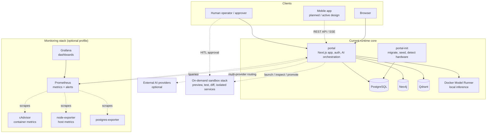
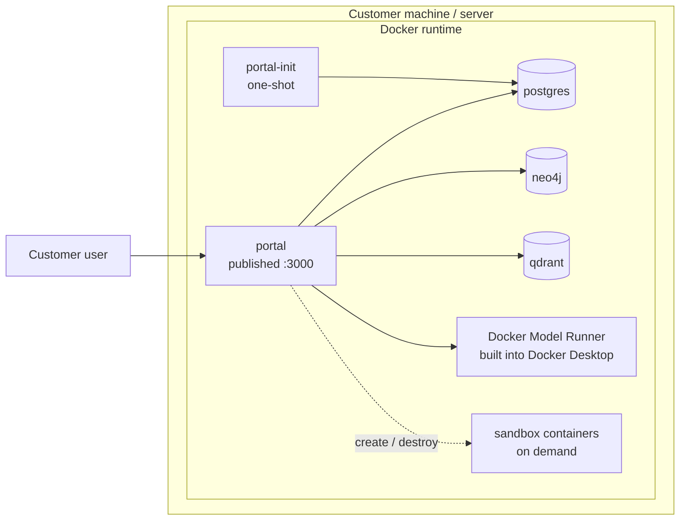
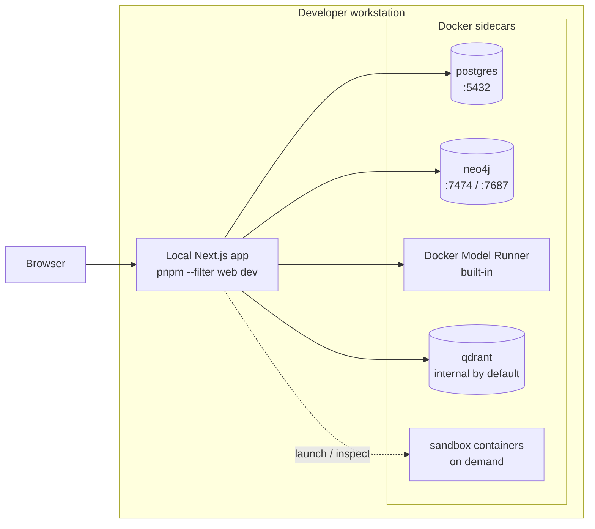
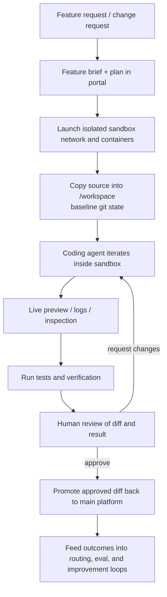

# Open Digital Product Factory

**The platform that builds itself.**

An open-source, AI-native digital product management platform that gives any organization — from a 5-person startup to a regulated enterprise — the same capabilities that only the largest tech companies have today. Built-in AI agents don't just answer questions: they manage your portfolio, model your architecture, execute your backlog, and eventually write the features you need — all with human approval at every step.

No vendor lock-in. No consultants. No million-dollar license. One click to install. Your AI workforce starts working immediately.

---

## Why It Exists

I have been in the enterprise software business for many years, and with the advent of AI it's clear that anyone can take advantage of enterprise grade software and processes, with little to no experience. The know-how and experiences of the professionals is now commoditized in a limitless workforce, we just need to get it started in the right way, and this is my vision for that future. Portfolio management, enterprise architecture, backlog tracking, lifecycle governance — these are locked behind expensive platforms that require specialized teams to operate. This built from scratch platform does this at a basic level, and can grow as your needs grow. Virtually limitless.

**What if the platform could operate itself?**

The Open Digital Product Factory is built on a radical premise: **AI agents should be first-class participants in the work**, not bolt-on assistants. Every screen has a context-aware AI co-worker. Every action an agent proposes goes through human-in-the-loop governance. Every decision is audit-logged. The platform knows what hardware it's running on, what models are available, and how to optimize its own AI workforce.

And because it's open source and self-contained (runs entirely on your hardware or in the cloud with a built in, local AI engine), there are **no data privacy concerns, no cloud dependency, and no subscription fees** unless you want take it to that next level.

### The Vision: A Self-Evolving Platform

Today, this platform manages your digital products. Tomorrow, it writes new features that you need — in a governed, professional manner without needing to be a developer. There is a sandbox, design and user experience is reviewed by humans, deployed when approved automatically. A single, small business owner can describe what they need in plain language, the system steps through the processes of creating it. On your hardware, the way you want. The AI can help every step of the way, builds it, deploys it, manages it. The platform grows from within.

Your data stays on your hardware. The AI agents are there to help you grow and use the features you want, but they maintain their distance. AI co-workers are yours to command and controls for them is built in. No worrying about the data leaking out, and the AI hackers getting in.

> **Hive Mind:** Optional, you may opt-in to share what you develop with the community. Each installation is a node, extended locally for your use. But, you can choose to contribute your extensions back to the community too. The community grows the platform from within — humans and AI agents working together, helping people work together.

---

## Who This Is For

- **Small business owners** who need enterprise-grade digital product management without enterprise-grade budgets or teams
- **Regulated industries** (healthcare, finance, insurance) that need audit trails, human approval chains, and compliance evidence — built in, not bolted on
- **IT leaders** who want to model their architecture, manage their portfolio, and track their backlog in one governed platform
- **Concerned citizens** who want to use AI without the AI platforms owning you and your business outright
- **Developers and architects** who want to extend and contribute to an open platform that treats AI as a core capability, not a chatbot sidebar

---

## Installation

The installer asks one question: **Ready to go** or **Customizable**.

| Mode | Who it's for | What happens |
|------|-------------|--------------|
| **Ready to go** | Business users, anyone who wants to run it | Pulls pre-built images. Build Studio is the guided interface for extending the platform. |
| **Customizable** | Developers, power users who want to modify the platform | Clones the full source and builds locally. Build Studio and VS Code use the same shared workspace. |

Both modes include the full platform with AI co-workers, Build Studio sandbox, and all features. The difference is whether direct VS Code access is part of the supported workflow. Contribution policy is configured later in the portal for both modes.

### Quick Start (Windows)

Open PowerShell and paste:

```powershell
gh api repos/markdbodman/opendigitalproductfactory/contents/install-dpf.ps1 -H "Accept: application/vnd.github.raw" > install-dpf.ps1
powershell -ExecutionPolicy Bypass -File install-dpf.ps1
```

> **Note:** Requires the [GitHub CLI](https://cli.github.com/) (`gh`) with access to this repo. The installer is self-contained — no source code download needed for "Ready to go" mode. If you choose "Customizable", the installer handles the clone for you.

Choose your mode when prompted. The installer handles Docker Desktop, WSL2, hardware detection, AI model selection, credential generation, and auto-start. 5-10 minutes.

That's it. The installer handles Docker Desktop, WSL2, hardware detection, AI model selection, credential generation, and auto-start configuration.

**Login credentials** are shown at the end of installation and saved to `.admin-credentials` in your install directory. The email is always `admin@dpf.local` — the password is randomly generated and unique to your install. Change it after first login.

**After installation:**
- **Start:** `dpf-start`
- **Stop:** `dpf-stop`
- **Uninstall:** `powershell -ExecutionPolicy Bypass -File uninstall-dpf.ps1` (from your install directory)

#### What each mode installs

| | Ready to go | Customizable |
|---|---|---|
| **Shared workspace** | Yes, used through Build Studio | Yes, used through Build Studio and VS Code |
| **Source code checkout** | No local checkout required | Yes (full git clone) |
| **Docker build** | No (`docker compose pull`) | Yes (`docker compose build`) |
| **Git required** | No | Yes |
| **Modify the platform** | Via Build Studio (in-app) | Build Studio + direct code changes in the same workspace |
| **Contribution setup** | Configured later in the portal | Configured later in the portal |
| **Install time** | ~5 minutes (mostly download) | ~10 minutes (includes build) |
| **Disk footprint** | ~2 GB (images only) | ~5 GB (source + images) |

### Shared Workspace Model

Self-developing installs use one shared workspace per install.

- Build Studio always works from that workspace
- in customizable installs, VS Code works from that same workspace too
- production promotion remains governed through the portal
- contribution mode is introduced during install but configured later in the portal

See [docs/user-guide/development-workspace.md](docs/user-guide/development-workspace.md) for the full operating model.

---

### Developer Setup (IDE + Hot-Reload)

For developers who want to run Next.js locally with IDE integration, debugging, and hot-reload. Databases run in Docker with ports exposed to your host machine. This is separate from the installer — it's for development on the platform itself.

#### Prerequisites

| Tool | Version |
|------|---------|
| [Git](https://git-scm.com/download/win) | Latest |
| [Docker Desktop](https://www.docker.com/products/docker-desktop/) | 4.40+ |
| [Node.js](https://nodejs.org/) | 20+ |
| [pnpm](https://pnpm.io/) | 9+ |

#### Option A: Automated script

```powershell
git clone https://github.com/markdbodman/opendigitalproductfactory.git
cd opendigitalproductfactory
.\scripts\fresh-install.bat
```

The script will:
- Install pnpm dependencies (`node_modules`)
- Create all `.env` files (Docker + app-level) with generated secrets
- Start Docker containers with **ports exposed** to the host (5432, 7474, 7687, 6333)
- Run database migrations and seed data (including all epic/backlog SQL scripts)

Then start the dev server:

```powershell
pnpm --filter web dev      # http://localhost:3000
```

#### Option B: Manual setup

```bash
git clone https://github.com/markdbodman/opendigitalproductfactory.git
cd opendigitalproductfactory
pnpm install
```

**Create environment files:**

```bash
# 1. Root .env — used by Docker Compose for container credentials
cp .env.docker.example .env

# 2. App-level .env files — used by Next.js and Prisma for local dev
cp .env.example apps/web/.env.local
cp .env.example packages/db/.env
```

Then edit `.env`, `apps/web/.env.local`, and `packages/db/.env` to replace the `<generate with: ...>` placeholders with real values. On Windows PowerShell:

```powershell
# Generate AUTH_SECRET (base64)
[Convert]::ToBase64String((1..32 | ForEach-Object { [byte](Get-Random -Max 256) }))
# Generate CREDENTIAL_ENCRYPTION_KEY (hex)
-join ((1..32) | ForEach-Object { "{0:x2}" -f (Get-Random -Max 256) })
```

Or use the automated script (Option A) which handles this automatically.

**Start databases (with ports exposed to host):**

```bash
docker compose -f docker-compose.yml -f docker-compose.dev.yml up -d postgres neo4j qdrant
```

> This exposes PostgreSQL (5432), Neo4j (7687, 7474), and Qdrant (6333) to your host machine.

**Run migrations and seed:**

```bash
pnpm --filter @dpf/db exec prisma generate       # Generate Prisma client
pnpm --filter @dpf/db exec prisma migrate deploy  # Apply all migrations
pnpm --filter @dpf/db seed                        # Seed roles, agents, taxonomy, admin user
```

**Build the promoter image** (required for Build Studio feature deployment):

```bash
docker build -f Dockerfile.promoter -t dpf-promoter .
```

**Start the dev server:**

```bash
pnpm --filter web dev      # http://localhost:3000
```

Login: `admin@dpf.local` / `changeme123`

### Dev Container Setup (VS Code)

For developers who want a fully containerized development environment. Everything runs inside Docker -- no local Node.js or pnpm required.

#### Prerequisites

| Tool | Version |
|------|---------|
| [Docker Desktop](https://www.docker.com/products/docker-desktop/) | 4.40+ |
| [VS Code](https://code.visualstudio.com/) | Latest |
| [Dev Containers extension](https://marketplace.visualstudio.com/items?itemName=ms-vscode-remote.remote-containers) | Latest |

#### First-Time Setup

1. Clone the repo and ensure the production stack is running (`docker compose up -d`)
2. Open the repo folder in VS Code
3. Press `F1` and select **Dev Containers: Reopen in Container**
4. Wait for the dev databases to start, migrations to run, and sanitized data to populate

The dev server starts automatically on port 3001. Open `http://localhost:3001` in your browser. Production remains on port 3000.

Login: `admin@dpf.local` / `changeme123`

#### What the Dev Container Provides

- Isolated PostgreSQL, Neo4j, and Qdrant databases (separate from production)
- Sanitized copy of production data (PII obfuscated, credentials replaced)
- Shared LLM inference via Docker Model Runner (no duplication)
- Pre-installed extensions: ESLint, Prisma, Tailwind CSS, Prettier
- Hot-reload Next.js dev server

#### Important Notes

- Build Studio and VS Code should be treated as complementary interfaces, not separate source trees
- Production promotion still belongs to the portal's governed workflow
- The sanitized clone runs on first startup -- production must be running as the data source

---

## What's Inside

### Core Platform

| Area | What It Does |
|------|-------------|
| **Portfolio Management** | 4-portfolio hierarchy with 481-node DPPM taxonomy, health metrics, budget tracking, agent assignments |
| **EA Modeler** | Enterprise architecture canvas with ArchiMate 4 notation — models that are implementable, not whiteboards. Viewpoints enforce discipline. Governance keeps humans accountable. |
| **Inventory** | Digital product lifecycle management (plan -> design -> build -> production -> retirement) with portfolio attribution |
| **Backlog & Ops** | Epic grouping, portfolio and product backlog items, priority management — the platform manages its own backlog too |
| **Employee & Roles** | 6 IT4IT human roles (HR-000 through HR-500) with HITL tier assignments, SLA tracking, and delegation grants |
| **Platform Admin** | Branding, user management, credential encryption, governance controls |

### AI Workforce

This isn't a chatbot bolted onto a dashboard. AI is a core architectural layer.

| Capability | Description |
|-----------|-------------|
| **AI Co-worker Panel** | Floating, semi-transparent assistant on every screen. Context-aware — knows which page you're on and what you can do. |
| **9 Specialist Agents** | Portfolio Advisor, EA Architect, Ops Coordinator, Platform Engineer, and more — each with domain expertise and role-specific skills |
| **Skills Dropdown** | Each agent offers context-relevant actions filtered by your role. Higher authority = more capabilities. |
| **23 Provider Registry** | Anthropic, OpenAI, Azure, Gemini, Ollama, Groq, Together, DeepSeek, xAI, Mistral, and more — cloud, local, or router, your choice |
| **Automatic Failover** | Priority-ranked providers. If one fails, the next takes over. Local AI is always the safety net. |
| **Weekly Optimization** | Scheduled job ranks providers by capability tier and cost. The platform optimizes its own AI spending. |
| **Token Spend Tracking** | Per-provider, per-agent cost monitoring. Know exactly what your AI workforce costs. |
| **Local-First AI** | Runs via Docker Model Runner out of the box. No API keys needed. No data leaves your machine. |

### Governance & Compliance

Built for regulated industries from day one — not retrofitted.

- **Human-in-the-Loop (HITL)** — AI agents propose actions; humans approve before execution. Non-negotiable.
- **Audit Trail** — every governance decision records WHO approved, WHEN, and WHAT. Queryable. Exportable. Evidence for regulators.
- **Role-Based Access** — 18 capabilities across 6 roles. Each user sees only what their role permits.
- **Credential Encryption** — AES-256-GCM for all provider secrets at rest.
- **EA Governance** — architecture models go through draft -> submitted -> approved workflows. Models drive decisions; governance ensures accountability.

---

## Architecture

The platform has two deployment models and one shared architectural core:

- **Customer mode** - the full platform runs inside Docker with one exposed web port
- **Native developer mode** - the databases and local AI run in Docker, while the app runs locally via `pnpm dev`
- **Sandbox build loop** - isolated, on-demand containers support governed feature generation, preview, and testing

### Trusted AI Kernel (TAK)

The platform's AI governance layer is formally documented as the **Trusted AI Kernel** -- the layered enforcement, routing, audit, and immutable directive architecture that makes it safe to let AI agents act on behalf of humans.

- **[TAK Architecture Document (Word)](docs/architecture/Trusted-AI-Kernel-Architecture.docx)** -- full architecture reference with diagrams, tables, and end-to-end flow documentation
- **[TAK Architecture (Markdown)](docs/architecture/trusted-ai-kernel.md)** -- same content in markdown for in-repo reading

Regenerate the Word document after edits: `pnpm docs:tak`

For the platform runtime and deployment architecture, see [docs/architecture/platform-overview.md](docs/architecture/platform-overview.md).

### Platform Overview



**Current runtime:** `portal`, `portal-init`, `postgres`, `neo4j`, and `qdrant` are defined in `docker-compose.yml`. Local AI inference is provided by Docker Model Runner (built into Docker Desktop 4.40+) — no separate container needed. Sandbox containers are launched on demand from the `dpf-sandbox` image.

### Deployment Model 1: Customer Mode

This is the target end-user install. Everything runs in Docker. Only the web app is exposed on port `3000`. Databases remain internal to the stack. AI inference runs via Docker Model Runner.



**Use this mode when:** you want the simplest install, local data ownership, internal-only infrastructure services, and minimal setup overhead.

### Deployment Model 2: Native Developer Mode

This is the contributor and advanced operator workflow. The app runs locally for hot reload and IDE debugging, while the stateful services stay in Docker.



**Use this mode when:** you need local IDE integration, debugging, hot reload, direct access to Dockerized stateful services, or frequent development work.

### Sandbox and Iterative Build Loop

The platform is evolving toward a governed self-improvement loop. Some pieces exist today: sandbox image creation, isolated source/workspace setup, dev-server preview, diff extraction, and optional isolated Postgres/Neo4j/Qdrant sandbox services. The full autonomous iterative flow is a target architecture and should be read as directional.



### Hardware Recommendations

The installer already detects host CPU, RAM, and GPU/VRAM and picks a local default model accordingly. These tiers are the practical guidance for choosing hardware.

| Tier | CPU | RAM | Storage | GPU | Best for |
|------|-----|-----|---------|-----|----------|
| **Minimum viable local run** | Modern 4 cores | 16 GB | 50-100 GB SSD | None required | Evaluation, admin use, external-provider-first usage, light local AI |
| **Recommended for serious use** | 8+ cores | 32 GB | 100-200 GB NVMe SSD | Optional, 8-12 GB VRAM recommended | Small teams, local-first AI, better responsiveness, moderate sandbox iteration |
| **Best for self-building / sandbox-heavy use** | 12+ cores | 64 GB+ | 200+ GB NVMe SSD | 16 GB+ VRAM recommended | Frequent sandbox launches, heavier local models, preview/test loops, future self-improvement workflows |

**Current local model auto-selection:** the installer chooses a default model via Docker Model Runner based on detected RAM and VRAM. On constrained systems it selects smaller models; on GPU-backed systems it selects larger defaults automatically.

---

## Docker Deployment

### Current Compose Stack

| Service | Purpose |
|---------|---------|
| `portal-init` | One-shot bootstrap job that waits for infrastructure, runs migrations, and prepares the runtime |
| `portal` | Main Next.js standalone application, published on port `3000` in customer mode |
| `postgres` | PostgreSQL 16 for transactional and application data |
| `neo4j` | Neo4j 5 Community for graph and relationship-heavy workloads |
| `qdrant` | Vector store for semantic retrieval, embeddings, and memory-style search |
| Docker Model Runner | Local AI inference built into Docker Desktop 4.40+ — no separate container needed |
| `sandbox-image` | Build target for the on-demand sandbox image used by iterative build workflows |
| `promoter` | One-shot container that builds new portal images from sandbox source, backs up the database, and deploys promoted features. Triggered by Build Studio ship phase or ops UI. Uses the `promote` profile. |
| `playwright` | Optional tooling image used in the `build-images` profile |

#### Monitoring Stack

The platform includes a full operational health monitoring stack that starts automatically with the core services. It is headless infrastructure — it feeds the platform's native System Health dashboard, alert pipeline, and AI Coworker health indicators.

| Service | Image | Purpose | Port |
|---------|-------|---------|------|
| `prometheus` | `prom/prometheus` | Metrics collection, alerting rules, time-series storage (15-day retention) | 9090 |
| `grafana` | `grafana/grafana-oss` | Dashboards and ad-hoc metric exploration (power-user tool) | 3002 |
| `cadvisor` | `gcr.io/cadvisor/cadvisor` | Per-container CPU, memory, network, disk I/O metrics | 8080 |
| `node-exporter` | `prom/node-exporter` | Host OS resource metrics (CPU, memory, disk, network) | 9100 |
| `postgres-exporter` | `prometheuscommunity/postgres-exporter` | PostgreSQL connection pool, query performance, replication metrics | 9187 |

Native exporters (no additional containers): Neo4j (`:2004/metrics`), Qdrant (`:6333/metrics`), Docker Model Runner (`/metrics`).

**What you get:**

- **System Health tab** in Operations > Backlog — platform-native dashboard with service status grid, host resource gauges (CPU/memory/disk), AI Coworker health panel, container resource table, database metrics, and alert history. No need to leave the platform.
- **Health indicator** in the navigation bar — colored dot (green/amber/red/grey) visible on every page, with dropdown showing active alerts.
- **AI Coworker awareness** — the chat panel shows contextual warnings when inference or semantic memory is degraded ("Memory offline", "AI responses may be slower").
- **Grafana** at `http://localhost:3002` — pre-provisioned overview dashboard for custom PromQL queries and deep-dive exploration. Default login: `admin` / `dpf_monitor` (configurable via `GF_ADMIN_USER` and `GF_ADMIN_PASSWORD` in `.env`).
- **13 alert rules** — container down, high CPU/memory/disk, Postgres connection saturation, Qdrant down, AI inference failures, semantic memory errors. Alerts fire into the platform's quality issue system automatically.

The monitoring stack adds ~175-350 MB RAM and starts automatically with `docker compose up -d`. All dashboards and alert rules are auto-provisioned from config files in `monitoring/` — no manual setup required.

**Architecture:** Prometheus and Grafana run as separate containers (not merged into the portal). The portal queries Prometheus via a server-side proxy API (`/api/platform/metrics`) for its native dashboards. Grafana is a secondary power-user tool, not the primary monitoring surface. Discovered monitoring containers are attributed to the **Foundational** portfolio under the **Observability Platform** taxonomy node and appear in the inventory with `monitors` relationships to the services they observe.

In customer mode, only `portal` is exposed. In native developer mode, `docker-compose.dev.yml` publishes host ports for `postgres` and `neo4j` so the app can run locally while the stateful services remain containerized.

```bash
docker compose up -d       # Start everything (core + monitoring)
docker compose ps          # Check health
docker compose logs -f     # View logs
docker compose down        # Stop
```

---

## Roadmap

### What's Working Now

| Epic | Description |
|------|-------------|
| Portal Foundation | Shell, 8 route areas, workspace tiles, portfolio tree with health/budget metrics |
| Backlog & Epics | Backlog CRUD, epic grouping, ops panel, DPF self-registration |
| EA Modeling | ArchiMate 4 canvas, viewpoints, relationship rules, structured value streams |
| AI Provider Registry | 17 providers, credential management, model discovery, profiling, cost tracking |
| AI Co-worker | Live LLM conversations, automatic failover, context-aware skills dropdown |
| Docker Deployment | Zero-prerequisites Windows installer, hardware detection, Docker Model Runner auto-setup |

### What's Coming

| Epic | Description |
|------|-------------|
| **Agent Task Execution** | Agents propose real actions (create backlog items, modify products, update EA models). Humans approve. Every action audit-logged. |
| **Platform Self-Development** | Agents write new features in a sandboxed environment. Humans review diffs and approve. The platform extends itself. |
| **AI-Guided Setup Wizard** | On first install, the AI Co-worker walks you through company setup conversationally — no forms, just a conversation. |
| **In-App PR Workflow** | Submit customizations back to the community directly from the platform UI — no terminal needed. |
| **Web-Hosted SaaS** | Cloud deployment option for organizations that prefer managed hosting. |
| **Theme & Branding** | Configurable visual presets. AI-assisted branding from a URL or description. |
| **Mac & Linux Installers** | Extend the one-click install experience to all platforms. |

---

## Project Structure

```
opendigitalproductfactory/
├── apps/web/                    # Next.js 16 App Router
│   ├── app/(shell)/             # 8 authenticated route areas
│   ├── components/agent/        # AI Coworker panel + skills
│   ├── lib/                     # Auth, permissions, inference, routing
│   └── lib/actions/             # Server actions
├── packages/db/                 # Prisma schema (42 models) + seed data
├── monitoring/                  # Prometheus + Grafana config (auto-provisioned)
│   ├── prometheus/              # prometheus.yml (scrape targets) + alerts.yml (13 rules)
│   └── grafana/                 # Datasource, dashboard provider, alert channels, dashboards
├── scripts/                     # Convenience + hardware detection
│   └── fresh-install.ps1        # Developer setup script
├── install-dpf.bat              # User installer launcher (double-click this)
├── install-dpf.ps1              # User installer (PowerShell)
├── uninstall-dpf.bat            # User uninstaller launcher
├── uninstall-dpf.ps1            # User uninstaller (PowerShell)
├── Dockerfile                   # Multi-stage (init + runner)
├── Dockerfile.promoter          # Promoter image (docker-cli, pg_dump, promote.sh)
├── docker-compose.yml           # Full stack — self-contained (no exposed ports)
├── docker-compose.dev.yml       # Developer overlay — exposes ports to host
├── .env.docker.example          # Template: Docker Compose credentials
└── .env.example                 # Template: App-level config (Next.js + Prisma)
```

### Extension Points

| What | Where |
|------|-------|
| New workspace tile | `lib/permissions.ts` -> `ALL_TILES` |
| New role | `PERMISSIONS` in `lib/permissions.ts` |
| New route | Page under `app/(shell)/` + register capability |
| New data model | `packages/db/prisma/schema.prisma` + migration |
| New AI agent | `ROUTE_AGENT_MAP` in `lib/agent-routing.ts` |
| New agent skill | Agent's `skills` array in the route map |

---

## Contributing

Everyone is welcome. This is a platform built by its community — humans and AI working together.

### The Hive Mind Model

1. Install and run your own instance
2. Add capabilities for your context
3. Share back what's useful to others

The platform is designed so that every extension — a new role, a new route, a new agent skill — follows the same pattern. No special access needed. Fork, build, contribute.

### Code Standards

- TypeScript strict mode (`noUncheckedIndexedAccess`, `exactOptionalPropertyTypes`)
- `pnpm typecheck && pnpm test` must pass before any PR
- All new features need Vitest tests
- Follow existing patterns (server actions, React cache, auth gates)

---

## License

Licensed under the [Apache License, Version 2.0](LICENSE).

Contributions are accepted under the [Developer Certificate of Origin (DCO)](https://developercertificate.org/). By submitting a pull request, you certify that your contribution is your original work and you grant an irrevocable license under the project's Apache-2.0 license.

---

*Built with the belief that every organization deserves enterprise-grade tools — and that AI should work for you, not the other way around.*
