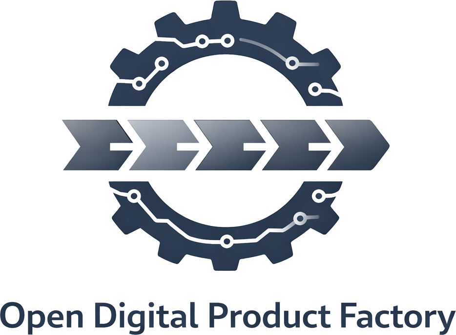
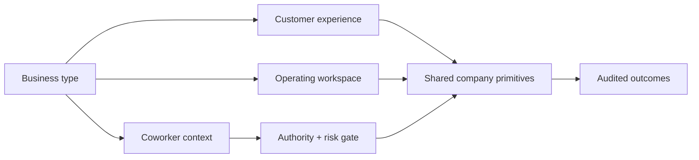

<p align="center">
  
</p>

<h1 align="center">Open Digital Product Factory</h1>

<p align="center">
  <strong>A local-first operating platform where purposed AI coworkers help one organization run and improve its business under human authority.</strong>
</p>

<p align="center">
  <a href="https://opendigitalproductfactory.com/"><strong>Product tour</strong></a>
  &nbsp;&middot;&nbsp;
  <a href="https://opendigitalproductfactory.com/business-types/">Business catalogue</a>
  &nbsp;&middot;&nbsp;
  <a href="docs/user-guide/">User guide</a>
  &nbsp;&middot;&nbsp;
  <a href="#quick-install">Install</a>
  &nbsp;&middot;&nbsp;
  <a href="CONTRIBUTING.md">Contribute</a>
</p>

<p align="center">
  <a href="https://github.com/OpenDigitalProductFactory/opendigitalproductfactory/actions/workflows/ci.yml">
    
  </a>
  <a href="LICENSE">
    
  </a>
</p>

DPF starts from the business you run rather than an empty software canvas. A packaged business type shapes the customer experience, internal vocabulary, operating defaults, and coworker context. The install is dedicated to one organization, runs on infrastructure that organization controls, and only connects to external providers, integrations, or contribution paths when they are deliberately configured.

This README is the source-facing entry point. The [public tour](https://opendigitalproductfactory.com/) is the clearer introduction for potential users and customers.

## Choose your path

| If you want to... | Start here | What you will find |
|---|---|---|
| Evaluate DPF for a business | [Product tour](https://opendigitalproductfactory.com/) and [business catalogue](https://opendigitalproductfactory.com/business-types/) | Fit, operating model, trust posture, current maturity, and business-shaped examples |
| Install or pilot it | [Quick install](#quick-install) | Supported hosts, early-access paths, installer commands, and verification reporting |
| Run the platform | [User guide](docs/user-guide/) | Setup, everyday work, coworkers, compliance, administration, and in-product help |
| Extend or contribute | [Developer setup](docs/user-guide/contributing/developer-setup.md) and [AGENTS.md](AGENTS.md) | Worktrees, architecture rules, verification, DCO, CI, and pull-request delivery |
| Review the trust model | [Standards family](docs/architecture/agent-standards-family.md), [external alignment](docs/architecture/agent-standards-external-alignment.md), [contribution roadmap](docs/architecture/agent-standards-contribution-roadmap.md), and [conformance](docs/architecture/agent-standards-dpf-conformance.md) | Runtime authority, agent identity, job qualification, delegation, evidence, assurance, and relationship to NIST, ISO/IEC, IEEE, W3C, IETF, and OpenID work |

## The platform in one view


```mermaid
flowchart LR
  A["Business type"] --> B["Customer experience"]
  A --> C["Operating workspace"]
  A --> D["Coworker context"]
  B --> E["Shared company primitives"]
  C --> E
  D --> F["Authority + risk gate"]
  F --> E
  E --> G["Audited outcomes"]
```

Text alternative: the selected business type shapes the customer experience, operating workspace, and coworker context. Customer and workspace activity meet shared company primitives. Coworker actions first pass through authority and risk policy. Outcomes retain an evidence trail.

Four boundaries keep that story honest:

- **Business first.** More than 100 packaged business types shape vocabulary and defaults; the internal archetype remains the single source of truth.
- **One organization per install.** DPF is not a shared multi-tenant database. Cross-install learning uses governed, opt-in contribution.
- **AI does not create authority.** A tool call requires both user capability and coworker grant, plus approval or escalation when risk policy requires it.
- **Self-development is governed work.** Build Studio can guide and evidence platform changes, while customizable installs also support editors and external agent clients. Complex source work is not represented as hands-off autonomy.

User-facing narrative lives in [Market Archetypes And Coworkers](docs/user-guide/market-archetypes.md), with proof personas under [docs/personas/](docs/personas/).

---

## AI Agent Standards

This repository hosts a draft standards family for trustworthy AI-agent operation and identity. DPF is the first implementation and conformance case.

- [Trusted AI Kernel (TAK)](docs/architecture/trusted-ai-kernel.md) — runtime governance, authority mediation, HITL, delegation, audit, provider backpressure, queueing, failover
- [Global AI Agent Identification and Governance (GAID)](docs/architecture/GAID.md) — identity, issuer / accreditation, badging, assurance, authorization classes, chain-of-custody
- [Job-Specific Intelligence (TAK-JSI)](docs/architecture/job-specific-intelligence.md) — qualification of a versioned agent operating profile for a bounded job, data scope, tool surface, and risk context
- [External Standards Alignment](docs/architecture/agent-standards-external-alignment.md) — clause-level synergy and augmentation boundaries across NIST, ISO/IEC, IEEE, W3C, IETF, OpenID, and 1EdTech work
- [Standards Contribution Roadmap](docs/architecture/agent-standards-contribution-roadmap.md) — readiness gates, venue-specific packages, pilots, interoperability evidence, and staged formalization
- [Trusted AI Agent Governance White Paper](docs/architecture/2026-04-18-trusted-ai-agent-governance-white-paper.md) — market, policy, and implementation case
- [DPF Standards Conformance Assessment](docs/architecture/agent-standards-dpf-conformance.md) — how the platform maps to the proposed controls today

Publication outputs are generated from the Markdown sources of truth:

```bash
pnpm docs:tak
node docs/architecture/generate-gaid-docx.mjs
node docs/architecture/generate-agent-standards-white-paper-docx.mjs
```

---

## Quick install

These commands assume a fresh machine with no DPF repo yet. If you've already cloned the repo (contributors), skip to **Step 2** from inside the repo.

### Windows 10 / 11 — **GA**

The Windows installer is a self-contained PowerShell script that clones the repo for you.

```powershell
# Step 1 — download the installer (run from any directory)
iwr -UseBasicParsing https://raw.githubusercontent.com/OpenDigitalProductFactory/opendigitalproductfactory/main/install-dpf.ps1 -OutFile install-dpf.ps1

# Step 2 - run it (prompts for install directory; may suggest a non-C drive)
powershell -ExecutionPolicy Bypass -File install-dpf.ps1
```

### macOS Apple Silicon — **GA** · [full guide](docs/install/macos.md)

Validated end-to-end on real Apple Silicon hardware (M-series, macOS 14+). The Unix installer sources helper libraries from inside the repo, so you must clone first.

```bash
# Step 1 — clone the repo and enter it
git clone https://github.com/OpenDigitalProductFactory/opendigitalproductfactory.git
cd opendigitalproductfactory

# Step 2 — run the installer
bash install-dpf.sh
```

**Voice works on macOS.** Speech-to-text runs out of the box (bundled `speaches` / faster-whisper service — no GPU needed). For spoken output, Apple Silicon runs a native-host TTS sidecar (Docker can't reach the Neural Engine); enable it once with `bash scripts/tts/setup-chatterbox-tts-macos.sh`. See [Voice (STT + TTS)](docs/install/macos.md#voice-stt--tts).

### Linux (native Docker) — Early access · [full guide](docs/install/linux.md)

```bash
git clone https://github.com/OpenDigitalProductFactory/opendigitalproductfactory.git
cd opendigitalproductfactory
bash install-dpf.sh
```

### Cloud Single VM (AWS / GCP / Azure) — Early access · pilots wanted · [full guide](docs/install/cloud-single-vm.md)

Inside the VM:

```bash
git clone https://github.com/OpenDigitalProductFactory/opendigitalproductfactory.git
cd opendigitalproductfactory
bash install-dpf.sh --headless --release
```

Terraform modules for the cloud-VM path live under [`infra/terraform/single-vm/{aws,gcp,azure}/`](infra/terraform/single-vm/).

The installer asks one question — **Ready to go** (pre-built images; source changes normally flow through Build Studio) or **Customizable** (full source clone; Build Studio, editors, and external agent clients can share the workspace). Both modes include the full platform. Build Studio is available in both, but it is not the only supported development path for a customizable install. For serious source changes while Build Studio continues hardening, use Customizable mode. Login credentials are saved to `.env` / `.admin-credentials` at the end of installation.

**AI toolchain readiness.** If you have Claude Code or Codex CLI installed on the host, the installer wires them automatically — DPF skills, MCP tools, and kernel-tier memory all available on the first turn of every new contributor session. Re-running the installer is a no-op when nothing has drifted. See [Install operations](docs/operations/install.md) for the readiness states and what each one means.

**Releases & versions.** Stable versions are published on the [Releases page](https://github.com/OpenDigitalProductFactory/opendigitalproductfactory/releases) — each carries a changelog and downloadable source archives (`.zip` / `.tar.gz`). The install scripts above (which track `main`) remain the recommended path; the Releases page is where you see what changed between versions and pin a specific one. Releases are cut automatically from each `vX.Y.Z` tag.

If you hit a wall — happy-path success stories and "the installer hit a wall at step X" failures are equally useful — open an issue using the [Install verification report template](.github/ISSUE_TEMPLATE/install_verification.md) and attach the bundle produced by `bash install-dpf.sh doctor`.

---

## Working on the source

If you want to contribute to the codebase rather than just run it:

- [Developer Setup](docs/user-guide/contributing/developer-setup.md) — native `pnpm` + Docker sidecars, IDE debugging, hot reload.
- [Dev Container Setup](docs/user-guide/contributing/dev-container.md) — fully containerized; only Docker Desktop and VS Code required.
- [Development Workspace](docs/user-guide/development-workspace.md) — how Build Studio, VS Code, policy states, and validation environments fit together.

### Shared workspace model

Self-developing installs use one shared workspace per install:

- Build Studio always works from that workspace.
- In customizable installs, VS Code works from the same workspace.
- Production promotion is governed through the portal.
- Contribution policy (`fork_only` / `selective` / `contribute_all`) is configured later in the portal.

### Source isolation vs. runtime isolation

Worktrees created by `scripts/new-dev-worktree.sh` give you **source-control** isolation — your branch, your working tree, your commits — so concurrent sessions and the self-upgrade loop don't reset your work. They are **not** a second runtime.

For each change:

- Edit and commit from the worktree.
- Cheap source-local checks (targeted Vitest, `pnpm typecheck` on the changed package) can run in the worktree if its deps resolve cleanly.
- For anything that exercises the live platform — portal routes, server actions, MCP tools, DB-bound behavior, Build Studio flows — verify against the canonical install at the root clone (or a leased shared nonprod environment), and capture that evidence in the PR.
- If the worktree can't run a build/test because pnpm/corepack isn't on PATH, workspace symlinks point outside the worktree, the Prisma client is missing, or Turbopack rejects a cross-workspace symlink — that's a harness limitation, not a product defect. Route the verification through the **shared local-CI convergence sandbox** (one runtime every worktree leases sequentially via `local-integration-ci`); per-worktree runtimes don't scale at DPF's expected 1k–10k concurrent worktrees.

Full rule: [AGENTS.md §5](AGENTS.md) and [`worktree-is-source-control-not-runtime`](docs/founder-kernel/wiki/principles/worktree-is-source-control-not-runtime.md). The `Quick dev commands` below assume you're either in the root install or a worktree whose dep graph already resolves — they are not a claim that every worktree is a standalone runtime.

### Quick dev commands

| Task | Command |
|------|---------|
| Install dependencies | `pnpm install` |
| Start the dev server | `pnpm dev` |
| Typecheck | `pnpm typecheck` |
| Run tests | `pnpm test` (Vitest) |
| Generate TAK Word doc | `pnpm docs:tak` |
| Diagnostic bundle | `bash install-dpf.sh doctor` |
| Verify the install | `bash scripts/verify-install-edge.sh` |
| Stop / start the running stack | `bash dpf-stop.sh` · `bash dpf-start.sh` |

Pre-commit hooks run typecheck. **Run `pnpm test` locally before pushing** — CI runs the full Vitest suite and breaks for everyone if a test regresses.

---

## Repo layout

```
apps/
  web/                 Next.js portal — the platform surface
  mobile/              React Native 0.83 / Expo SDK 55 / React 19.2 companion app

packages/
  db/                  Prisma schema, seeds, migrations, model profiles
  api-client/          Typed client for the portal API
  validators/          Shared Zod validators (incl. edge event envelope)
  types/               Cross-package type-only exports
  finance-templates/   AI provider supplier contract templates
  storefront-templates/  Storefront archetype scaffolds
  integration-shared/  Shared adapter contracts

services/
  edge-node/           Linux container Edge Node runtime
  edge-node-go/        Mode 4 native Edge Node binary (Windows / macOS / embedded)
  adp/                 ADP payroll connector (early)
  browser-use/         Headless browser MCP service
  integration-test-harness/  E2E test harness

infra/
  terraform/single-vm/{aws,gcp,azure}/   Cloud Single-VM modules

docs/
  index.html                            Public homepage (opendigitalproductfactory.com)
  README.md                             Documentation index
  user-guide/                           Operator-facing pages, also bundled into in-app help
  install/                              Per-platform install runbooks
  architecture/                         TAK, GAID, white paper, conformance, diagrams
  superpowers/specs/                    Dated design specs (the "why" record)
  superpowers/plans/                    Dated implementation plans (the "how" record)
  founder-kernel/wiki/principles/       Tiered platform principles (retrievable via wiki_query MCP)

scripts/             Install, lifecycle, build, backup, hardware detection, verification
.github/             Workflows, issue templates, DCO config
```

Three buckets matter when filing new contributor material:

- **`docs/superpowers/specs/`** — design rationale, dated, append-only history of decisions
- **`docs/superpowers/plans/`** — implementation plans, also dated, tracked through to ship
- **`docs/user-guide/`** — operator-facing pages, bundled into the portal's in-app help

Specs and plans are historical context; user-guide pages are onboarding material.

---

## Architecture & deployment specs

The deployment architecture keeps Windows, macOS, native Linux, customer-cloud, and TAPPaaS aligned to the same canonical contracts while each target carries its own maturity level:

- [Deployment Contracts](docs/superpowers/specs/2026-05-09-deployment-contracts.md) — 10 canonical contracts every deployment target wraps (release artifacts, runtime config, lifecycle, identity, edge, build execution, observability, secrets, LLM / agent routing, client / API surfaces)
- [Cloud Deployment Design](docs/superpowers/specs/2026-05-09-cloud-deployment-design.md) — substrates (Single VM, Managed container service, Managed Kubernetes) and packaging targets
- [Cloudflare-fronted Managed Deployment Design](docs/superpowers/specs/2026-08-29-cloudflare-fronted-managed-deployment-design.md) — research-stage managed delivery using one isolated DPF cell per customer and a replaceable Cloudflare edge adapter
- [DPF Edge Node](docs/superpowers/specs/2026-05-09-dpf-edge-node-design.md) — host-resident trust + connectivity for discovery, MCP / A2A gateway, identity brokering
- [Edge Node Deployment Matrix](docs/superpowers/specs/2026-05-20-edge-node-deployment-matrix.md) — Mode 1 container vs. Mode 4 native binary per host substrate, with the verified-2026-05-20 Docker Desktop finding
- [Build Execution Provider](docs/superpowers/specs/2026-05-09-build-execution-provider-design.md) — sandbox lifecycle abstraction so Build Studio runs on substrates beyond local Docker
- [Mac / Linux Installer-Parity Roadmap](docs/superpowers/plans/2026-05-09-macos-linux-native-support.md) — 10-phase implementation plan for native macOS (Apple Silicon) + native Linux installs

For runtime topology — container layout, hardware tiers, Docker Compose breakdown, monitoring stack — see [`docs/architecture/platform-overview.md`](docs/architecture/platform-overview.md).

---

## Contributing

### The Hive Mind model

1. Install and run your own instance.
2. Add capabilities for your context.
3. Share back what's useful to others.

Every extension — a new role, a new route, a new agent skill — follows the same pattern. No special access needed. Fork, build, contribute.

### The contributor rulebook

[**AGENTS.md**](AGENTS.md) is the canonical operating contract for any AI agent working in this codebase, and it doubles as the durable operating rules for human contributors. Tool-specific files (`CLAUDE.md`, `.cursor/rules/`, `.clinerules/`, `.github/copilot-instructions.md`, `CONVENTIONS.md`, `.continue/rules/`) are pointers to it — do not duplicate rules into them.

Durable governance also lives as tiered principles under [`docs/founder-kernel/wiki/principles/`](docs/founder-kernel/wiki/principles/), retrievable at runtime via the `wiki_query` MCP tool.

### Branch model + PR workflow

- Topic branches off `origin/main` — short-lived, one PR per branch
- All changes land via PR; `main` is the release branch, force-push protected
- **DCO sign-off required** on every commit (`git commit -s`)
- For **concurrent sessions**: each runs in its own `git worktree`; use `git commit --only <paths>` with positional arguments so a parallel session's staged files do not sweep into your commit
- Never `--no-verify`, never `--no-gpg-sign`, never amend across sessions

### CI gates contributors will see

| Gate | What it does | Notes |
|------|--------------|-------|
| **DCO** | Confirms every commit carries `Signed-off-by:` | Required. Use `git commit -s`. |
| **signoff** | App-tier sign-off check | Skipped if no concerns flagged. |
| **Typecheck** | `pnpm typecheck` against the merged tree | Pre-commit hook only runs this; CI is the canonical run. |
| **Unit Tests** | Full Vitest suite | Run locally before pushing. |
| **Production Build** | `next build` | Catches Turbopack / NFT cascade regressions. |
| **Analyze (actions / go / javascript-typescript / python)** | CodeQL across the multi-language tree | The Go agent under `services/edge-node-go/` is in scope. |
| **Routing Invariants Audit** | Re-runs seed + invariant guards against the PR's merge-base | Failure typically means a seed contract drifted; rebase onto current `main` if a fix has since landed. |
| **Routing Tier Contract** | Verifies `ModelTierPolicy` cost-tier → model bindings are consistent | Touches anything under `packages/db/data/`? Expect this gate. |
| **Repo Guard Loop** | Runs every `scripts/check-no-*.mjs` ratchet guard via `scripts/check-guards.mjs` | Add a new ratchet as one `check-no-*.mjs` script — no ci.yml/package.json edit. `pnpm check:guards` runs it locally. |
| **Dockerfile Node Version** | Asserts the Node version in `Dockerfile*` matches the workspace | Bumping Node? Update all three Dockerfiles. |

### Code standards

- TypeScript strict mode (`noUncheckedIndexedAccess`, `exactOptionalPropertyTypes`)
- New features need Vitest tests
- Follow existing patterns (server actions, React cache, auth gates)
- Stay current on dependencies — bump patch / minor proactively; capture blocked majors as tracked work

Longer-form contributor guidance — full branch model, PR checklist, local verification workflow, the cross-session etiquette — lives in [**CONTRIBUTING.md**](CONTRIBUTING.md).

---

## Docs index

- [docs/README.md](docs/README.md) — documentation index
- [docs/user-guide/](docs/user-guide/) — operator-facing guides, bundled into the portal's in-app help
- [docs/user-guide/market-archetypes.md](docs/user-guide/market-archetypes.md) — archetype-led user narrative and coworker positioning
- [docs/personas/](docs/personas/) — persona proof library for archetype-led marketing and dogfood testing
- [docs/install/](docs/install/) — per-platform install runbooks
- [docs/architecture/](docs/architecture/) — runtime, deployment, standards, governance
- [docs/superpowers/specs/](docs/superpowers/specs/) — dated design specs (the "why" record)
- [docs/superpowers/plans/](docs/superpowers/plans/) — dated implementation plans

---

## License

Licensed under the [Apache License, Version 2.0](LICENSE).

Contributions are accepted under the [Developer Certificate of Origin (DCO)](https://developercertificate.org/). By submitting a pull request, you certify that your contribution is your original work and you grant an irrevocable license under the project's Apache-2.0 license.

Required attributions for bundled open-source dependencies are listed in [NOTICE](NOTICE). Credit to the standards bodies, frameworks, and authors whose ideas shaped DPF is in [ACKNOWLEDGMENTS.md](ACKNOWLEDGMENTS.md).
