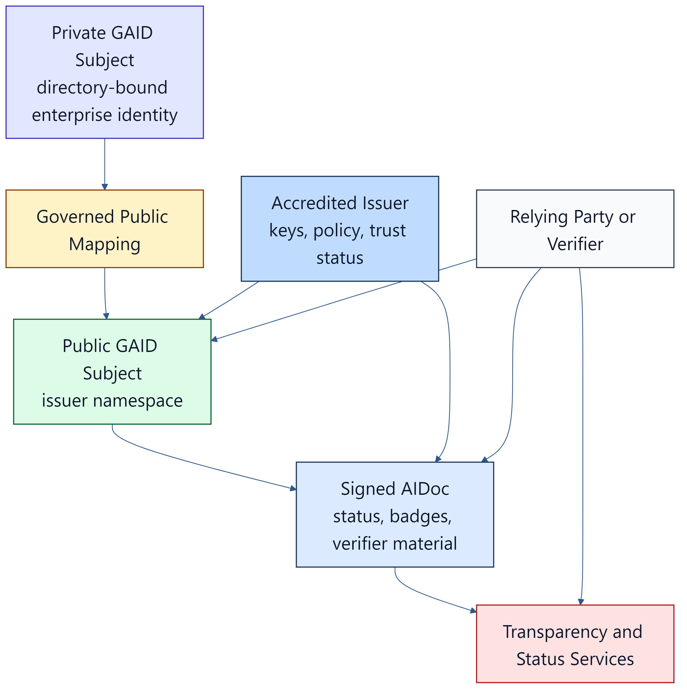

# Trusted AI Agent Governance

## Executive Summary

This document is a position paper describing why the market needs a complementary standards family
for AI agents: runtime governance, identity and assurance, and job-specific qualification.

The key message of this document is simple. The market does not lack agent innovation. It lacks a cohesive trust architecture for that innovation.

Enterprises are already deploying AI agents to search code, read documents, invoke tools, route work, coordinate specialists, and act across internal and external systems. Yet most organizations still struggle to answer basic management questions with confidence:

- Which agents exist?
- Who authorized them?
- What tools, prompts, skills, and data can they reach?
- What human oversight applies?
- What evidence exists for what they actually did?
- What claims about fit-for-purpose, safety, bias, or tool use have been independently assessed?
- For which job, activity, data, and risk scope is this exact operating profile qualified?

Current standards and products address parts of this problem, but not the whole of it. `ISO/IEC 42001:2023` remains current, but it operates at the organization management-system level, not at the runtime identity and control-plane level required for agent operations. `MCP` and `A2A` are important and timely, but they address interoperability between agents, tools, and systems rather than trusted identity, assurance, and end-to-end runtime governance. Vendor frameworks from `OpenAI`, `Anthropic`, `Google`, and `Microsoft` make agent development more practical, but they do not establish a shared, globally usable trust model across platforms.

We therefore propose a standards family composed of:

- `TAK`, the `Trusted AI Kernel`, which defines the runtime control model for trustworthy agent operation
- `GAID`, the `Global AI Agent Identification and Governance Framework`, which defines stable identity, badging, assurance, issuer governance, and chain-of-custody for AI agents
- `TAK-JSI`, the `Job-Specific Intelligence` profile, which defines how a versioned operating
  profile is assessed, qualified, monitored, and revalidated for a particular job and context

The point is not to duplicate existing standards. The point is to connect the layers that are currently fragmented.

## 1. The Market Problem

Organizations are moving from simple assistant patterns to agentic patterns. This changes the management problem materially.

An assistant that only generates text can often be governed through policy, model selection, and human review. An agent that can invoke tools, route work to specialists, read sensitive context, maintain memory, and cross system boundaries creates a different class of operational concern. In practice, the enterprise problem becomes one of inventory, identity, authority, oversight, traceability, and accountability.

This is where current operating pain is most visible. Many organizations can describe their large language model strategy at a high level, but cannot yet maintain a trustworthy inventory of deployed agents. They often do not know, in a durable machine-readable way:

- which agents are public and which are private
- which are coordinators and which are specialists
- which tools and skills are exposed to each agent
- what immutable instructions govern them
- what human-in-the-loop (`HITL`) pattern applies
- what data sensitivity each agent is expected to handle
- how to trace a public action back through delegations and internal systems

This problem becomes more acute when agents are offered beyond a single team. The moment an agent is consumed across a large enterprise, across partners, or in public business-to-business or business-to-consumer channels, trust can no longer depend on undocumented local knowledge. Identity, capability claims, and chain-of-custody need to be structured, portable, and verifiable.

The problem is not merely technical. It is managerial. Without stronger standards, organizations cannot govern AI agents with the same discipline expected for software components, identities, certificates, regulated workflows, or high-consequence operational changes.

Generic model selection does not close this gap. A model card, hallucination benchmark, or
one-shot application test can be useful evidence, but it does not establish competence for every
job that may route to that model. Job fitness depends on the whole operating profile: knowledge,
decision doctrine, tools, data, routing, instructions, oversight, and representative outcomes.

## 2. Why Current Standards and Protocols Fall Short

There are now several important standards and de facto standards in the market. The difficulty is that they are solving adjacent problems at different layers.

`ISO/IEC 42001:2023` is important because it gives organizations a formal management-system approach to AI governance. It is, however, not a runtime agent standard. It does not define agent identity documents, public issuer models, tool gating semantics, receipt chains, or immutable instruction governance. It is therefore relevant, but insufficient, for the problem addressed here.

`NIST AI RMF 1.0` is similarly valuable as a risk framing model, but it is not designed to function as a concrete cross-platform agent identity and runtime control specification.

The leading open agent protocols are also important, but differently scoped. `Anthropic` introduced the `Model Context Protocol` on November 25, 2024, to standardize how AI applications connect to tools and data sources. Since then, `MCP` has added a formal authorization profile, protected-resource metadata discovery, and extension work under neutral stewardship in the `Agentic AI Foundation`. `Google` announced the `Agent2Agent Protocol` on April 9, 2025, and later donated `A2A` to the Linux Foundation on June 23, 2025, to improve interoperability between agents. These are significant advances. They do not, however, provide a complete answer to public identity, assurance badging, issuer accreditation, or runtime governance.

The identity layer has also moved materially. The `OpenID Foundation` established the `AIIM` Community Group in 2025 and has since published both a white paper on identity management for agentic AI and a March 2026 response to `NIST` on AI agent security. The `W3C` launched the `Agent Identity Registry Protocol Community Group` on April 24, 2026 to work specifically on verifiable AI agent identity infrastructure, with anticipated coordination to `OpenID AIIM`. `CoSAI`, operating under `OASIS Open`, published `Agentic Identity and Access Management` in April 2026 to define how enterprises can represent, authenticate, authorize, and govern AI agents as verifiable identities. This is precisely the problem neighborhood in which `GAID` operates.

The large platform vendors are converging on agent frameworks rather than on a single trust architecture. `OpenAI` expanded its `Agents SDK` on April 15, 2026 with native harness and sandbox capabilities. `OpenAI`, `Anthropic`, and others are also moving standards work into neutral governance venues, including the `Agentic AI Foundation`, which `OpenAI` announced on December 9, 2025. `Microsoft` now positions `Agent Framework` as the next generation of `Semantic Kernel` and `AutoGen`, with workflow, checkpointing, and `HITL` support. `Google` continues to develop the `Agent Development Kit` and related agent infrastructure. This shows market momentum. It does not yet establish a coherent, interoperable governance answer.

The distinction is also visible in frontier-model safety programs. `OpenAI`'s `Preparedness Framework`, `Anthropic`'s `Responsible Scaling Policy`, and `Google DeepMind`'s `Frontier Safety Framework` govern model-development and deployment risks. They are important prior art and should continue to inform the field. They are not, however, substitutes for a portable runtime harness standard or a portable agent identity and receipt model.

The gap can be summarized as follows:

| Current Artifact | What It Solves | What It Does Not Fully Solve |
|------------------|----------------|-------------------------------|
| `ISO/IEC 42001` | Organization-level AI management systems | Runtime control, agent identity, issuer governance, receipts |
| `NIST AI RMF` | AI risk framing and lifecycle considerations | Concrete runtime and identity specifications for agents |
| `MCP` | Tool and context interoperability | Public identity, badging, public trust chain |
| `A2A` | Agent-to-agent interoperability and discovery | Accredited identity, assurance portability, external validation |
| Vendor agent frameworks | Practical implementation patterns | Cross-vendor trust semantics and common public assurance model |
| `W3C VC`, `RFC 9421`, `SLSA`, `Trace Context`, `PURL` | Strong building blocks for credentials, signatures, provenance, tracing, and structured identifiers | A cohesive agent-specific standard that composes these patterns into an operational identity and governance model |

The consequence is that enterprises are left to integrate these concerns themselves. Some do this through internal registries, one-off profiler scripts, prompt conventions, or platform-specific metadata. Those measures are usually useful. They are rarely sufficient.

## 3. Public Policy and Industry Signals

The public policy environment is now clearly signaling that AI agents have become a standards problem, not merely a product feature.

On February 17, 2026, `NIST` launched the `AI Agent Standards Initiative`, explicitly framing interoperable and secure agent adoption as a national standards concern. The initiative called out industry-led standards, open protocols, agent identity infrastructure, and security evaluations as active areas of work. This matters because it confirms that the U.S. standards conversation has moved from general AI governance into agent-specific interoperability and trust.

The signal became even clearer with the `NCCoE` concept paper, "Accelerating the Adoption of Software and AI Agent Identity and Authorization", published on February 5, 2026. That paper specifically asked for input on use cases, identity, authorization, auditing, non-repudiation, and controls against prompt injection. In other words, the market problem described in this paper is now recognized in formal public-sector work.

There are also direct timing implications. The `CAISI` RFI on AI agent security closed on March 9, 2026, and the `NCCoE` concept paper comment period closed on April 2, 2026. Those specific windows have passed. The larger agenda has not. The initiative itself is new, active, and still forming. The conclusion is that we are not too late for standards work. We are at the point where credible proposals are needed.

The White House has also already established AI policy as a live federal agenda. Public comment on the U.S. `AI Action Plan` opened on February 25, 2025, and the Administration published `America's AI Action Plan` on July 23, 2025. Whether one agrees with every aspect of that plan is not the main point here. The main point is that the federal policy environment is already asking for concrete, implementable approaches rather than abstract concern.

Industry behavior reinforces this. `OpenAI` published its proposals for the U.S. AI Action Plan on March 13, 2025. `Anthropic` submitted its own March 2025 `OSTP` response and has continued to argue for stronger testing and evaluation approaches, including in its earlier essay on third-party testing and its later work with `CAISI` and the `UK AISI`. This is not evidence that the market has solved the problem. It is evidence that leading vendors understand the policy and assurance questions are becoming unavoidable.

International and regional governance work reinforces the same conclusion. The `EU` published the `General-Purpose AI Code of Practice` on July 10, 2025 as a voluntary but practically significant route to meeting `AI Act` obligations around transparency, safety, security, and copyright. `Singapore IMDA` launched its `Model AI Governance Framework for Agentic AI` on January 22, 2026, positioning it as a first national framework focused specifically on reliable and safe deployment of agentic AI. These are not direct substitutes for `TAK`, `GAID`, or `TAK-JSI`, but they show that the market is moving from general AI governance into concrete operational expectations for agents.

The point is not that governments or frontier labs are waiting for one final regulatory answer before acting. The point is that both are operating in a fragmented environment and are now seeking more coherent structures for identity, assurance, interoperability, and runtime trust.

## 4. The Case for a Trusted AI Kernel (TAK)

`TAK` addresses the runtime half of the problem.

A trusted runtime for agents needs to do more than host model inference. It needs to mediate authority. It needs to govern tool execution. It needs to distinguish immutable directives from conversational input. It needs to define when a human must approve an action, when an action can execute directly, how delegation narrows authority, and how evidence is recorded.

This is particularly important because modern agent systems are not just single prompts followed by single outputs. They are increasingly composed of:

- generalist coordinators
- narrow, deeply skilled specialists
- persistent or retrieved memory
- hidden or immutable instructions
- external tools and connectors
- long-running tasks that can fail, retry, or be resumed

These are precisely the conditions in which weak governance becomes expensive and dangerous. Fabrication, hallucination, unauthorized action, prompt injection, hidden-instruction leakage, and misplaced autonomy are not separate issues. They are different symptoms of the same missing control plane.

`TAK` therefore proposes that a trustworthy runtime `MUST` provide a clear authority model, execution gating, `HITL` semantics, immutable instruction governance, memory and context-window control, audit logging, delegation narrowing, and runtime transparency to supervisors. A key message of this document is that these are not optional implementation preferences. They are part of the minimum structure required for trustworthy agency.

## 5. The Case for a Global AI Agent Identification and Governance Framework (GAID)

`GAID` addresses the identity and assurance half of the problem.

Enterprises do not only need to know that an agent exists. They need to know what the agent is, what evidence exists about it, what claims it can legitimately carry, and how that identity can be traced across boundaries.

This is why `GAID` is more than a naming convention. It combines:

- a stable identifier
- a resolvable `Agent Identity Document`
- structured badging for capability, governance, safety, sensitivity, and fit-for-purpose
- portable authorization classes
- signed action receipts and chain-of-custody
- a governance model for private and public issuance

The need for a stronger badging model is especially acute. In practice, organizations want to know not only whether an agent exists, but whether it is fit for a particular purpose, whether it uses tools, whether it retains memory, what kind of model it uses, whether training-data or model-card references exist, whether bias or evaluation evidence exists, what context limits apply, and what kind of human oversight is expected. Today these answers are often incomplete, inconsistent, or hidden behind vendor-specific interfaces.

This is also where public trust enters the picture. Internal identifiers are useful, but public agents need stronger validation. The closest analogies are not only application user accounts. They are also `DNS`, `ISBN`, `PKI`, and supply-chain provenance systems. Public trust works when syntax, governance, accreditation, status, and verification all exist together. That is the role `GAID` is intended to play.

## 6. The Case for Job-Specific Intelligence (TAK-JSI)

`TAK-JSI` addresses the qualification gap between identity claims and runtime permission.

AI Coworkers resemble enduring operational subjects: they have a `GAID`, an owner, an operating
profile, and advertised capabilities. But a capability label such as "research", "coding", or
"customer support" is too broad to serve as a job qualification. A qualification must bind a
versioned operating profile to a versioned job profile, assessment scheme, activity scope, data and
risk boundary, evidence, expiry, and revalidation policy.

This structure follows established competence-assessment ideas without claiming that an AI agent is
a person. It also aligns with the `NIST AI RMF` emphasis on fit-for-purpose measurement under
representative deployment conditions. Qualification is evidence for a ceiling on autonomy; it is
not authorization and does not eliminate runtime controls.

`TAK-JSI` also clarifies three controls that are often conflated:

- **proactivity** controls initiative, not permission
- **earned autonomy** controls evidence-backed latitude for a specific activity and risk
- the **Golden Triangle** controls cost, quality, time, reasoning, and verification resources, not
  competence or data eligibility

Model and provider routing must therefore filter first for job, data, residency, modality,
contractual, and evidence eligibility before ranking remaining candidates by quality, cost, or
latency.

## 7. Why the Standards Belong Together

The standards are deliberately separate because each has one canonical owner:

- `GAID` answers who the agent is and what current claims it carries
- `TAK-JSI` answers which job and context the identified operating profile is qualified for
- `TAK` answers what the runtime permits now
- receipts join identity, qualification, authority, action, and evidence

Identity without qualification can overstate fitness. Qualification without runtime enforcement
can become a decorative certificate. Runtime governance without portable identity and claims can
remain locally controlled but externally opaque.

## 8. DPF as a Proving Ground

The value of a standard increases materially when it can be exercised in a real platform rather than described only in the abstract.

`DPF` is a useful proving ground because it already contains several runtime patterns that align with `TAK`:

- route-specific specialist agents rather than one generic agent everywhere
- capability and agent-grant intersection for tool access
- proposal-mode behavior for higher-risk actions
- explicit prompt assembly blocks that separate identity, authority, sensitivity, and context
- audit logging for tool execution
- differentiated sensitivity and role context

It also contains early identity-related structures that are relevant to `GAID`, including a registry of agent identities, model bindings, tool grants, supervisor assignments, default `HITL` tiers, delegation relationships, and memory declarations.

DPF also contains substrate relevant to `TAK-JSI`: AI Coworker identities, profession doctrine,
decision perspectives, scoped proactivity, cost/quality/time posture, sensitivity-aware routing,
and evidence-earned autonomy. The missing step is to compose these into a versioned job profile,
assessment scheme, qualification record, and runtime qualification ceiling.

This makes `DPF` especially valuable for conformance work. It is not a blank sheet. It already demonstrates that many `TAK` controls are implementable in a practical system. At the same time, it exposes what is still missing for a fuller `GAID` posture: federated issuance, public verification, standardized badges, external certificates, public status and revocation, and portable action receipts.

In other words, `DPF` is credible as a first implementation case because it shows both existing strengths and remaining work.

## 9. A Neutral Reference Model

The standards family proposed here is intentionally vendor-neutral.

The reference model is not meant to mirror one product suite. It is meant to identify the minimum cooperating planes that a trustworthy agent ecosystem requires:

- an identity plane
- an assurance plane
- a job-qualification plane
- a runtime control plane
- an evidence plane
- an interoperability plane
- a trust and validation plane

This matters because the current market often presents partial control planes as if they were complete trust architectures. In practice, the runtime, identity, evidence, and validation concerns remain distinct even when a single vendor offers them in one product family.

## 10. Why a Staged Adoption Model Is the Most Credible Path

The phased adoption model proposed for `GAID` follows the historical pattern by which durable public identifier systems have become trusted in practice.

`ISBN` is a strong precedent. The standard defines a durable global identifier, but operational scale comes through the `International ISBN Agency` and delegated national or regional agencies rather than through one undifferentiated global operator. `DNS` shows the same layered emergence: the technical standards came first, delegation and namespace operations matured afterward, and multistakeholder governance later formalized through `ICANN` and `IANA` stewardship structures. Public certificate ecosystems offer a related precedent: trust required not only certificate syntax, but also identity proofing, certificate authority obligations, audit, revocation, and public transparency.
Sources: [International ISBN Agency](https://www.isbn-international.org/), [National ISBN Agencies](https://www.isbn-international.org/content/national-isbn-agencies), [RFC 1034](https://www.rfc-editor.org/info/rfc1034), [RFC 1035](https://www.rfc-editor.org/info/rfc1035), [RFC 1591](https://www.rfc-editor.org/info/rfc1591), [ICANN history](https://www.icann.org/en/history), [IANA about](https://www.iana.org/about.html), [CA/B Forum Baseline Requirements](https://cabforum.org/working-groups/server/baseline-requirements/requirements/)

That precedent supports a staged `GAID` path:

- `Phase 1`: enterprise-private identity, inventory, `AIDoc`, badges, and receipts
- `Phase 2`: federated or accredited cross-boundary trust
- `Phase 3`: broader public verifier interoperability with optional decentralized portability profiles

This is not a compromise. It is the most historically grounded route to adoption at scale.

## 11. Public Verification Architecture Options for GAID

There are several viable public-verification architectures for `GAID`.

The first is a `PKI` and domain-anchored model in which accredited issuers bind public `GAID` subjects to controlled namespaces, signed identity documents, revocation services, and transparency publication. This is the strongest near-term default because enterprises, governments, and relying parties already understand the accountability model.

The second is a `federated trust-list` model in which multiple recognized authorities publish issuer trust lists and verifier material. This is particularly relevant for regulated sectors, regional ecosystems, and multinational cooperation.

The third is a `DID` / `VC` portability profile in which a public `GAID` can also be represented through decentralized or controlled-identifier infrastructure. This is useful for portability and selective disclosure, but it should not be treated as the only viable public-trust model. As of May 11, 2026, enterprise adoption still favors directory-native internal identity and issuer-validated public identity over ledger-first approaches.
Sources: [DID Core](https://www.w3.org/TR/did-core/), [VC Data Model 2.0](https://www.w3.org/TR/vc-data-model/), [NIST blockchain identity white paper](https://csrc.nist.gov/publications/detail/white-paper/2020/01/14/a-taxonomic-approach-to-understanding-emerging-blockchain-idms/final), [Microsoft Entra Agent ID](https://learn.microsoft.com/en-us/entra/agent-id/agent-identities), [Microsoft Entra Verified ID standards](https://learn.microsoft.com/en-us/entra/verified-id/verifiable-credentials-standards?country=us&culture=en-us)

The preferred approach for the standard is therefore hybrid:

- private enterprise identity remains directory-bound
- public identity is issuer-accredited and verifier-friendly
- transparency is mandatory
- decentralized portability is optional

Adjacent work in payments and commerce also supports this direction. `AP2`, the `Agent Payments Protocol`, uses verifiable mandates and cryptographic evidence to show that an agent is acting on bounded delegated payment authority. That is not the same problem as `GAID`, but it is strong prior art for signed consequential-action receipts and bounded delegated authority in high-stakes agent interactions.

This hybrid model offers the best balance of adoption, accountability, and future portability.

## 12. DPF as an Initial Prototype and Outcome Framework

`DPF` is not being offered as proof that the standards are already fully solved. It is being offered as the initial implementation prototype and proving ground.

That distinction matters. The prototype is useful precisely because it already contains enough of the runtime and identity posture to make the standards concrete, while still leaving visible gaps that the standards can force into implementable shape.

For `TAK`, the prototype already demonstrates:

- route-scoped orchestrator and specialist patterns
- governed tool exposure through authority intersection
- proposal-mode approvals
- runtime prompt assembly with hidden and immutable control blocks
- audit logging for tool execution

For `GAID`, the prototype already demonstrates:

- stable internal agent registry metadata
- model binding and tool-grant declarations
- supervisor and `HITL` posture references
- early `AIDoc`-like structures

The standards therefore produce implementation outcomes for the prototype. Near-term `DPF` outcomes should include:

- canonical private `GAID` issuance
- an internal `AIDoc` service
- a badge registry and evidence model
- signed or tamper-evident consequential-action receipts
- `LDAP` / `SCIM` / protocol profile projection
- later public verification and issuer-facing profiles

This is a crucial part of the proposal. The standards are not only theoretical artifacts. They define what a real platform should build next.

## 13. Recommendations for Governments, Standards Bodies, and Enterprises

The recommendations are straightforward.

Governments and standards bodies should:

- treat runtime governance, agent identity, and job qualification as separate but complementary standards layers
- build on existing work such as `MCP`, `A2A`, `VC`, `SLSA`, `Trace Context`, and `HTTP Message Signatures` rather than starting from zero
- establish explicit liaison positions with `OpenID AIIM`, the `W3C` Agent Identity Registry Protocol Community Group, `CoSAI`, the `Agentic AI Foundation`, and the relevant `IETF` OAuth and GNAP work
- recognize accredited issuer governance as a critical dependency for public agent identity
- prioritize chain-of-custody, non-repudiation, and `HITL` disclosure as first-class concerns

Enterprises should:

- stop treating agent inventory as a prompt catalog problem
- adopt structured identity, tool-surface, and oversight metadata now, even before public standards fully mature
- distinguish self-asserted claims from independently evidenced claims
- distinguish generic capability evidence from job-specific qualification
- require qualification revalidation when the operating profile, job doctrine, routing set, or data
  policy materially changes
- require runtime evidence for consequential actions

Platform vendors should:

- expose stronger structured metadata for tools, skills, prompts, memory, and approval posture
- make badging and assurance claims machine-readable
- bind qualification badges to versioned job and operating profiles with current status and expiry
- support portable identity and receipt semantics across frameworks

The standards themselves should also ship with companion implementation artifacts, not only prose. At minimum that means:

- a `TAK` conformance assertion rubric
- a `GAID` conformance assertion rubric
- a `TAK-JSI` conformance assertion rubric
- a reference implementation statement from the `DPF` prototype
- a clear standards-lifecycle and liaison posture

The most credible near-term disposition is liaison-first. `TAK` should align outward to `AAIF`,
`NIST`, `CoSAI`, and relevant `IETF` work on authorization and proof-of-possession. `GAID` should
align outward to `OpenID AIIM`, the `W3C` Agent Identity Registry Protocol Community Group,
`CoSAI`, and the same `IETF` authorization and trust infrastructure work. `TAK-JSI` should align to
`NIST` evaluation work, AI quality and risk standards, data-quality governance, competence-scheme
prior art, and versioned occupation/skill taxonomies. No single venue currently owns the full
problem.

The point is not to wait for a perfect end-state. The point is to move from ad hoc local conventions toward interoperable trust infrastructure.

## 14. Conclusion

AI agents are now mature enough to create a standards problem and immature enough that the standards answer is still forming.

That combination is exactly why action is needed now.

The market already has meaningful building blocks. It has organization-level governance
frameworks. It has interoperability protocols. It has vendor frameworks. It has credential,
signature, provenance, and traceability standards. What it does not yet have is a cohesive answer
to trusted runtime control, trusted agent identity, and job-specific qualification.

This paper therefore proposes a practical direction:

- `TAK` for runtime governance
- `GAID` for identity, assurance, and traceability
- `TAK-JSI` for versioned job qualification, surveillance, and revalidation
- `DPF` as an early proving ground for conformance and refinement

We propose these not as final answers to every policy or platform question, but as a concrete starting point for the standards work that now needs to happen.

## References

- [ISO/IEC 42001:2023 Artificial intelligence management system](https://www.iso.org/standard/42001)
- [ISO/IEC 17024:2026 Conformity assessment - General requirements for bodies operating certification of persons](https://www.iso.org/standard/17024)
- [ISO/IEC 25059:2023 Quality model for AI systems](https://www.iso.org/standard/80655.html)
- [ISO/IEC 5259-5:2025 Data quality governance](https://www.iso.org/standard/84150.html)
- [NIST AI RMF 1.0](https://doi.org/10.6028/NIST.AI.100-1)
- [NIST AI Agent Standards Initiative, February 17, 2026](https://www.nist.gov/artificial-intelligence/ai-agent-standards-initiative)
- [NIST AI RMF Playbook - Measure](https://airc.nist.gov/airmf-resources/playbook/measure/)
- [NIST press release: Announcing the AI Agent Standards Initiative, February 17, 2026](https://www.nist.gov/node/1906621)
- [NCCoE concept paper: Accelerating the Adoption of Software and AI Agent Identity and Authorization, February 5, 2026](https://csrc.nist.gov/pubs/other/2026/02/05/accelerating-the-adoption-of-software-and-ai-agent/ipd)
- [CAISI RFI on Securing AI Agent Systems, January 12, 2026](https://www.nist.gov/news-events/news/2026/01/caisi-issues-request-information-about-securing-ai-agent-systems)
- [White House: Public Comment Invited on Artificial Intelligence Action Plan, February 25, 2025](https://www.whitehouse.gov/briefings-statements/2025/02/public-comment-invited-on-artificial-intelligence-action-plan/)
- [White House: America's AI Action Plan, July 23, 2025](https://www.whitehouse.gov/articles/2025/07/white-house-unveils-americas-ai-action-plan/)
- [OpenAI: OpenAI's proposals for the U.S. AI Action Plan, March 13, 2025](https://openai.com/global-affairs/openai-proposals-for-the-us-ai-action-plan/)
- [OpenAI: Our updated Preparedness Framework, April 15, 2025](https://openai.com/index/updating-our-preparedness-framework/)
- [OpenAI: The next evolution of the Agents SDK, April 15, 2026](https://openai.com/index/the-next-evolution-of-the-agents-sdk)
- [OpenAI: OpenAI co-founds the Agentic AI Foundation under the Linux Foundation, December 9, 2025](https://openai.com/index/agentic-ai-foundation/)
- [Anthropic: Introducing the Model Context Protocol, November 25, 2024](https://www.anthropic.com/news/model-context-protocol)
- [Anthropic Responsible Scaling Policy](https://www.anthropic.com/responsible-scaling-policy)
- [Anthropic: Third-party testing as a key ingredient of AI policy](https://www.anthropic.com/news/third-party-testing/)
- [Anthropic: Strengthening our safeguards through collaboration with US CAISI and UK AISI, September 12, 2025](https://www.anthropic.com/news/strengthening-our-safeguards-through-collaboration-with-us-caisi-and-uk-aisi)
- [Linux Foundation: Agentic AI Foundation announcement, December 9, 2025](https://www.linuxfoundation.org/press/linux-foundation-announces-the-formation-of-the-agentic-ai-foundation?hs_amp=true)
- [AGENTS.md](https://agents.md/)
- [Model Context Protocol authorization specification](https://modelcontextprotocol.io/specification/2025-11-25/basic/authorization)
- [OpenID Foundation AIIM Community Group](https://openid.net/cg/artificial-intelligence-identity-management-community-group/)
- [OpenID Foundation: Identity Management for Agentic AI](https://openid.net/wp-content/uploads/2025/10/Identity-Management-for-Agentic-AI.pdf)
- [OIDF response to NIST on AI agent security, March 6, 2026](https://openid.net/wp-content/uploads/2026/03/Attachment1_NIST-2025-0035-0001.pdf)
- [W3C Agent Identity Registry Protocol Community Group, launched April 24, 2026](https://www.w3.org/community/agent-identity/)
- [Google Developers Blog: Announcing the Agent2Agent Protocol, April 9, 2025](https://developers.googleblog.com/en/a2a-a-new-era-of-agent-interoperability/)
- [Google Developers Blog: Google Cloud donates A2A to Linux Foundation, June 23, 2025](https://developers.googleblog.com/google-cloud-donates-a2a-to-linux-foundation/)
- [Agent2Agent Protocol specification](https://google-a2a.github.io/A2A/specification/)
- [Google DeepMind: Strengthening our Frontier Safety Framework, September 22, 2025](https://deepmind.google/discover/blog/strengthening-our-frontier-safety-framework/)
- [CoSAI: Agentic Identity and Access Management, approved March 20, 2026](https://www.coalitionforsecureai.org/wp-content/uploads/2026/04/agentic-identity-and-access-control.pdf)
- [OWASP Top 10 for Agentic Applications, December 9, 2025](https://genai.owasp.org/2025/12/09/owasp-top-10-for-agentic-applications-the-benchmark-for-agentic-security-in-the-age-of-autonomous-ai/)
- [CSA MAESTRO](https://labs.cloudsecurityalliance.org/maestro/)
- [MITRE ATLAS](https://atlas.mitre.org/)
- [EU General-Purpose AI Code of Practice, published July 10, 2025](https://digital-strategy.ec.europa.eu/en/policies/contents-code-gpai)
- [IMDA Model AI Governance Framework for Agentic AI, January 22, 2026](https://www.imda.gov.sg/resources/press-releases-factsheets-and-speeches/press-releases/2026/new-model-ai-governance-framework-for-agentic-ai)
- [Google Cloud: Agent Development Kit overview](https://cloud.google.com/agent-builder/agent-development-kit/overview)
- [Microsoft Agent Framework Overview, updated February 20, 2026](https://learn.microsoft.com/en-us/agent-framework/overview/)
- [Microsoft Entra Agent ID, updated May 1, 2026](https://learn.microsoft.com/en-us/entra/agent-id/agent-identities)
- [Microsoft Entra Workload ID overview](https://learn.microsoft.com/en-us/entra/workload-id/workload-identities-overview)
- [Microsoft Entra Verified ID supported standards, updated April 9, 2026](https://learn.microsoft.com/en-us/entra/verified-id/verifiable-credentials-standards?country=us&culture=en-us)
- [ServiceNow AI Control Tower product page](https://www.servicenow.com/products/ai-control-tower.html)
- [ServiceNow launches AI Control Tower, May 6, 2025](https://newsroom.servicenow.com/press-releases/details/2025/ServiceNow-Launches-AI-Control-Tower-a-Centralized-Command-Center-to-Govern-Manage-Secure-and-Realize-Value-From-Any-AI-Agent-Model-and-Workflow/)
- [ServiceNow expands AI Control Tower, May 5, 2026](https://newsroom.servicenow.com/press-releases/details/2026/ServiceNow-expands-AI-Control-Tower-to-discover-observe-govern-secure-and-measure-AI-deployed-across-any-system-in-the-enterprise/default.aspx)
- [Veza introduces AI Agent Security, December 8, 2025](https://veza.com/company/press-room/veza-introduces-ai-agent-security-to-protect-and-govern-ai-agents-at-enterprise-scale/)
- [Veza introduces Native Access Agents and Enterprise Agent Identity Control Plane, February 25, 2026](https://veza.com/company/press-room/veza-introduces-native-access-agents-to-secure-the-modern-ai-driven-enterprise-with-enterprise-agent-identity-control-plane/)
- [W3C Verifiable Credentials Data Model v2.0](https://www.w3.org/TR/vc-data-model/)
- [1EdTech Open Badges 3.0](https://standards.1edtech.org/open-badges/specifications/standards/v3p0/cert)
- [O*NET Content Model](https://www.onetcenter.org/content.html)
- [ESCO](https://esco.ec.europa.eu/en/about-esco)
- [Decentralized Identifiers (DIDs) v1.0](https://www.w3.org/TR/did-core/)
- [W3C Trace Context](https://www.w3.org/TR/trace-context/)
- [RFC 9421 HTTP Message Signatures](https://www.rfc-editor.org/info/rfc9421)
- [RFC 4512 Lightweight Directory Access Protocol (LDAP): Directory Information Models](https://www.rfc-editor.org/rfc/rfc4512.html)
- [RFC 7643 System for Cross-domain Identity Management: Core Schema](https://www.rfc-editor.org/rfc/rfc7643)
- [RFC 7644 System for Cross-domain Identity Management: Protocol](https://www.rfc-editor.org/rfc/rfc7644)
- [RFC 9728 OAuth 2.0 Protected Resource Metadata](https://www.rfc-editor.org/rfc/rfc9728)
- [RFC 9635 Grant Negotiation and Authorization Protocol (GNAP)](https://www.rfc-editor.org/rfc/rfc9635)
- [RFC 9767 GNAP Resource Server Connections](https://www.rfc-editor.org/rfc/rfc9767)
- [RFC 9449 OAuth 2.0 Demonstrating Proof of Possession (DPoP)](https://www.rfc-editor.org/rfc/rfc9449)
- [RFC 9162 Certificate Transparency Version 2.0](https://www.rfc-editor.org/rfc/rfc9162)
- [SCITT architecture draft -22](https://datatracker.ietf.org/doc/draft-ietf-scitt-architecture/22/)
- [SLSA Provenance v1.2](https://slsa.dev/spec/v1.2/provenance)
- [in-toto Attestation Framework Specification](https://github.com/in-toto/attestation/blob/main/spec/README.md)
- [Sigstore Documentation](https://docs.sigstore.dev/)
- [C2PA Content Credentials Technical Specification v2.2](https://spec.c2pa.org/specifications/specifications/2.2/specs/C2PA_Specification.html)
- [C2PA Implementation Guidance](https://spec.c2pa.org/specifications/specifications/2.4/guidance/Guidance.html)
- [AP2 Agent Payments Protocol core concepts](https://ap2-protocol.org/topics/core-concepts/)
- [ISO/IEC 27701:2025 Privacy information management systems](https://www.iso.org/standard/85819.html)
- [ISO/IEC 12792:2025 Transparency taxonomy of AI systems](https://www.iso.org/standard/84111.html)
- [ISO/IEC DIS 42102 Framework for characterizing AI system methods and capabilities](https://www.iso.org/standard/86898.html)
- [Package URL / ECMA-427](https://www.packageurl.org/)
- [International ISBN Agency](https://www.isbn-international.org/)
- [National ISBN Agencies](https://www.isbn-international.org/content/national-isbn-agencies)
- [RFC 1034 Domain Names - Concepts and Facilities](https://www.rfc-editor.org/info/rfc1034)
- [RFC 1035 Domain Names - Implementation and Specification](https://www.rfc-editor.org/info/rfc1035)
- [RFC 1591 Domain Name System Structure and Delegation](https://www.rfc-editor.org/info/rfc1591)
- [ICANN history](https://www.icann.org/en/history)
- [IANA about](https://www.iana.org/about.html)
- [CA/B Forum Baseline Requirements](https://cabforum.org/working-groups/server/baseline-requirements/requirements/)
- [NIST blockchain identity white paper](https://csrc.nist.gov/publications/detail/white-paper/2020/01/14/a-taxonomic-approach-to-understanding-emerging-blockchain-idms/final)
