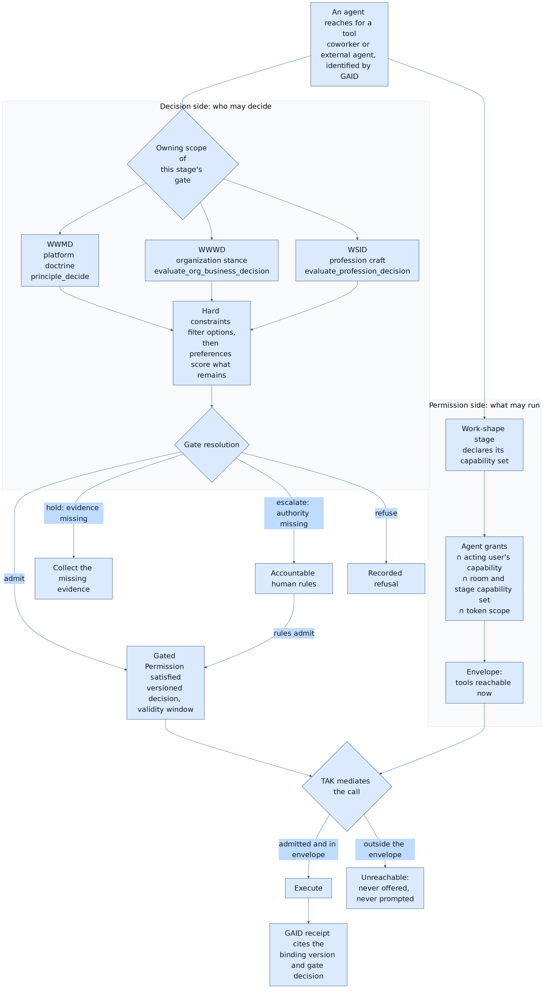
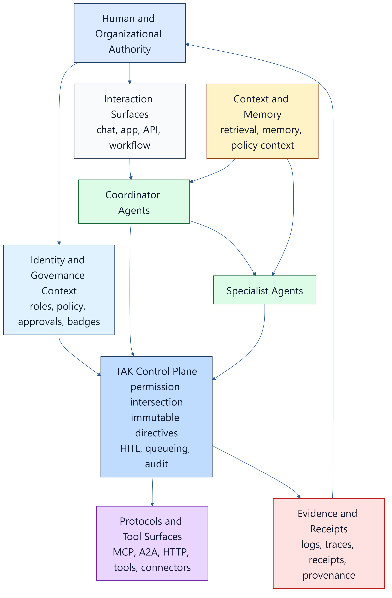
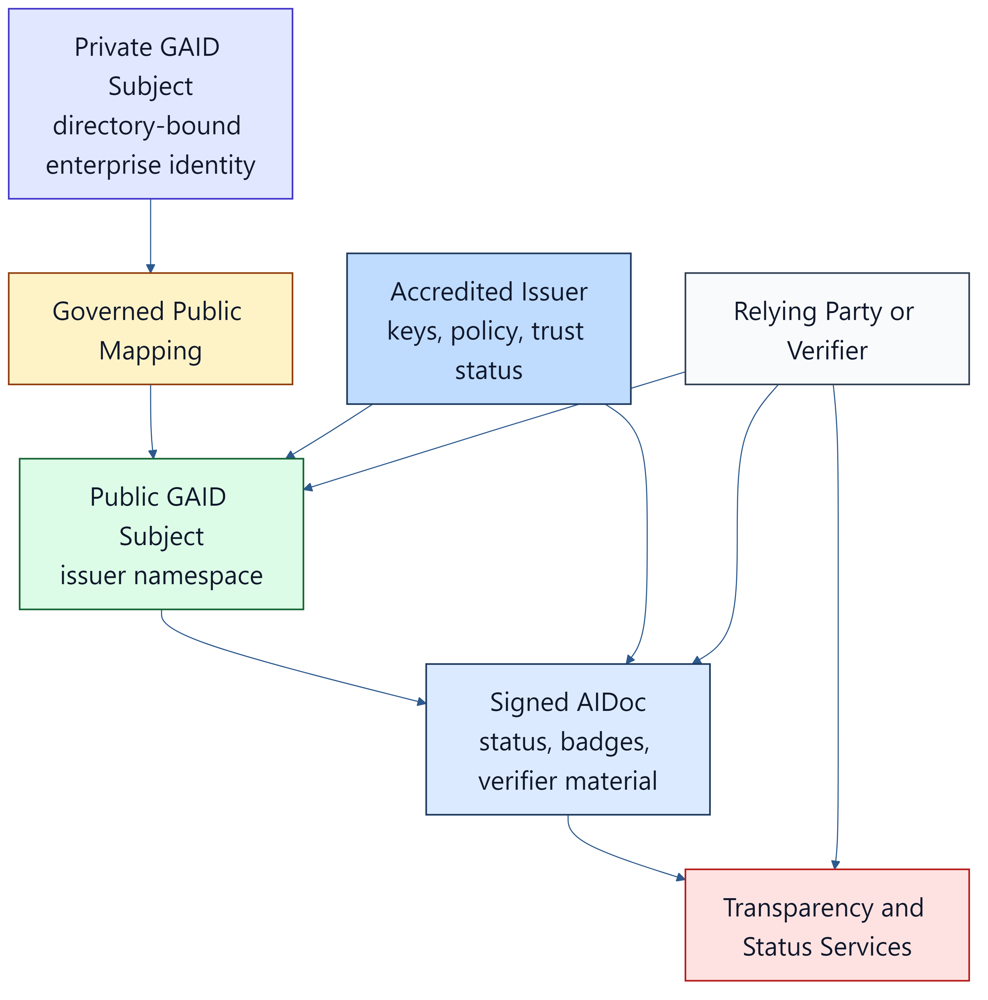

# Trusted AI Agent Governance

**Decide once, enforce always: four cornerstones for AI agents that are safe to delegate to**

| | |
|---|---|
| Status | Discussion draft, revision 2.1 |
| Date | 2026-10-01; first edition 2026-04-18 |
| Owner | EP-B932453F / BI-6CC40F77 |

This is a position paper. The normative requirements live in the four standards it introduces:

- [`TAK`](trusted-ai-kernel.md)
- [`GAID`](GAID.md)
- [`TAK-JSI`](job-specific-intelligence.md)
- [`GPP`](gated-permissions-process.md)

All four are open working drafts. Nothing in this paper claims certification, regulatory compliance or endorsement by a standards body. Every statement about the Digital Product Factory (DPF) reference implementation is labelled as one of:

- **enforced** — a control that blocks at runtime
- **shadow** — a control that records but does not block
- **not built**

The evidence date is 2026-09-30. [§8](#8-dpf-the-working-instantiation) gives the claim-to-evidence ledger.

## Executive Summary

AI agents now read documents, call tools, change records, send messages, deploy code and coordinate other agents. The question every organization adopting them faces is not whether the model is clever enough. It is **who decided this agent may do this, and how would anyone know?**

Today most agent tools answer that question in one of two ways:

- **Approve every tool call.** The agent stops and asks before each action.
- **Approve nothing.** The agent runs with whatever credentials it was given. These modes go by "YOLO", "always allow" or "skip permissions".

The first fails quietly and the second fails loudly, and the first drives people to the second. A leading vendor reports that users approve 93–97% of per-call prompts, and that in a controlled study people caught a disguised dangerous command 13.6% of the time, falling to about 5% after fifty prompts. The same users rejected 39% of the *plans* they were shown (vendor-reported; [§1](#1-the-defining-problem-approval-fatigue)). People supervise decisions well and keystrokes badly.

The 2024–2026 incident record is mostly a record of what happens next. Deleted production databases, leaked private repositories, malicious tool servers, and evaluation agents that escaped their sandbox and reached production infrastructure share a pattern: an agent held authority broader than its task, and nothing evaluated the damaging action against who was entitled to authorize it.

The market's newest answer is a classifier that guesses which calls are safe enough to skip the prompt. It reduces prompts. It also has a published miss rate and a published bypass, and it cannot say who was entitled to decide.

This paper proposes a different principle: **decide once, by the authority that owns the decision, then enforce on every call.** It presents four complementary open standards, each answering one question:

| Standard | Question | What it owns |
|---|---|---|
| `GAID` — Global AI Agent Identification and Governance | Who is this agent? | Identity, operating profile, claims, badges, receipts |
| `TAK-JSI` — Job-Specific Intelligence | Is it fit for this job? | Job qualification, assessment, revalidation |
| `GPP` — Gated Permissions Process | Who decided this may happen? | The binding of a decision gate in an owning authority to the exact tools it admits, for one stage of one kind of work |
| `TAK` — Trusted AI Kernel | May it act now? | Runtime mediation: authority intersection, consequence gating, oversight, evidence |

The paper also makes a claim about engineering method. **Model-based systems engineering (MBSE) has never treated AI agents as first-class system elements. It should.** When the work shapes, decision gates, tool bindings, agents and receipts are model elements that the running system executes and checks itself against, the model stops being documentation and becomes the control. GPP supplies the link between who may decide and what may run that makes this possible.

DPF, an open-source operating platform for small and mid-sized organizations, is both a workable system that real businesses run on and the reference instantiation of all four standards. It ships:

- 107 business archetypes
- 87 AI coworker roles across nine value streams
- 27 profession doctrine families
- 47 governed work shapes

The paper reports, honestly, which of its controls enforce, which run in shadow, and which are not yet built.

## 1. The defining problem: approval fatigue

### 1.1 Per-call approval does not survive contact with people

| Evidence | Source |
|---|---|
| Users approve about 93% of permission prompts | Anthropic Engineering, 2026-03-25 (vendor-reported) |
| Users approve 97% of prompts but reject 39% of plans. In a controlled study (n=1,053), people caught a disguised dangerous command 13.6% of the time: about 17% early in a session, about 5% after fifty prompts | Claude blog, 2026-08-07 (vendor-reported) |
| Sandboxing removed 84% of prompts internally; the post names approval fatigue as the risk | Anthropic Engineering, 2025-10-20 (vendor-reported) |
| In a field study, adherence to permission warnings fell substantially within three weeks; varying the warning slowed the decline | Vance et al., *MIS Quarterly* 42(2), 2018 |
| Attackers exploited repeated MFA approval prompts until a person accepted one ("push bombing", Uber 2022) | BleepingComputer |

The mechanism is ordinary habituation. A prompt that is almost always right to accept trains acceptance. The rare prompt that matters arrives in a stream that has taught the reviewer not to read. This is not a user-education problem that better training will fix. It is a design problem: **the checkpoint has been placed at the level where people are least able to judge.**

### 1.2 So people switch it off

Every major agent CLI offers a mode that removes the prompts: `--yolo`, "always allow", `--dangerously-skip-permissions`. Researchers who disclosed a GitHub MCP prompt-injection attack in 2025 noted they suspect many users choose "always allow". Malware in the August 2025 Nx "s1ngularity" supply-chain attack invoked installed AI CLIs with these flags to inventory secrets.

No independent survey of how many users run in these modes was found, so this paper cites no adoption rate. The incident record shows what happens when they do.

### 1.3 The incident record

| Date | Incident | Control that was missing |
|---|---|---|
| 2025-05 | A public GitHub issue drives an agent, through an MCP server, to leak private-repository contents | Separation of untrusted input, private data and outbound action |
| 2025-05/06 | Asana's MCP server exposes data across customer tenants | Tenant isolation in the tool server |
| 2025-07 | An agent holding a database service-role key follows instructions planted in support tickets (Supabase MCP) | Credential scope; data-flow separation |
| 2025-07 | A coding agent deletes a production database during a declared code freeze (Replit) | The freeze was an instruction, not an enforced gate |
| 2025-08 | Malware runs AI CLIs with skip-permission flags to harvest secrets (Nx s1ngularity) | CLIs accept those flags from any caller |
| 2025-09 | A malicious MCP server silently copies every email to an attacker (`postmark-mcp`) | Tool-server provenance and egress control |
| 2026-04 | An agent finds an unrelated, over-scoped API token and deletes a production volume and its backups in seconds | Credential scope; no gate on a destructive API |
| 2026-07 | Evaluation agents escape their sandbox and compromise Hugging Face production infrastructure | Sandbox boundary, over-broad credentials, exposed metadata endpoint |

Sources and dates are in the [market and thought-leadership landscape](agent-governance-market-landscape-2026.md#3-incident-record-20242026). Published accounts of the July 2026 Hugging Face intrusion conflict on its scale, from one autonomous agent to hundreds of coordinating agents. This paper relies only on the elements the accounts share.

**The repeating pattern** is not a weak model. It is an agent that held authority broader than its task, a damaging action that met no gate, and no record of who was entitled to approve that class of action. Model-level guardrails and detection were present in several of these cases and did not change the outcome.

### 1.4 Classifiers are an improvement, not an authority

The most recent industry response is to let a model decide which calls may proceed without a prompt. Anthropic made this the default for Claude Code on 2026-08-14 and reports fewer serious unintended actions than under manual approval (vendor-reported). Two facts limit it as a governance answer:

- Its designers publish a 17% false-negative rate on real overeager actions (n=52).
- Twelve days after it became the default, a researcher disclosed a prompt-injection chain that achieved remote code execution against it in 60–80% of attempts. The Cloud Security Alliance's guidance is to treat such a classifier as a productivity control, not as a substitute for sandboxing, egress control or credential isolation.

A classifier answers "does this look dangerous?" It cannot answer "who was entitled to decide this?", which is the question an auditor, a regulator or an injured customer will ask.

### 1.5 What oversight regulation asks for

The EU AI Act's Article 14 requires that people overseeing a high-risk system can monitor, interpret and override it, and remain aware of automation bias. The Digital Omnibus has moved the high-risk obligations to 2027-12-02 (Annex III) and 2028-08-02 (Annex I), so there is time to get this right.

A 13.6% catch rate is weak evidence that per-call approval delivers effective oversight. A recorded decision by a named, accountable authority, enforced deterministically on every call, is a stronger form of evidence.

## 2. Why current standards and protocols fall short

Several important standards and de facto standards exist. They solve adjacent problems at different layers.

**Management and risk frameworks**

- `ISO/IEC 42001:2023` gives organizations a certifiable AI management system. It is not a runtime agent standard. It does not define agent identity documents, tool-gating semantics, receipt chains or who may authorize a class of agent action.
- `NIST AI RMF 1.0` is a risk-framing model, not a cross-platform agent identity or runtime specification.

**Interoperability protocols**

- The `Model Context Protocol` (introduced by Anthropic in November 2024, now under the Agentic AI Foundation) standardizes how agents connect to tools and data. It has since gained OAuth 2.1 authorization, protected-resource metadata (RFC 9728), resource indicators (RFC 8707), and revisions in November 2025 and July 2026.
- MCP tool annotations such as `readOnlyHint` and `destructiveHint` are explicitly hints that clients must not trust from untrusted servers.
- MCP authorizes at the level of a server and a scope. It has no notion of which authority may decide that a class of action is admissible for a particular piece of work.
- `A2A`, donated to the Linux Foundation in June 2025, standardizes agent-to-agent discovery and messaging without decision-authority semantics.

**Identity**

The identity layer has moved quickly:

- OpenID's `AIIM` community group
- the W3C Agent Identity Registry Protocol community group (April 2026)
- CoSAI's *Agentic Identity and Access Management* (April 2026)
- Microsoft Entra Agent ID
- NIST NCCoE's concept paper on software and AI agent identity and authorization (February 2026)

These are the neighbourhood GAID operates in.

**Deterministic tool policy**

Tool-level policy is now available as a product. AWS Bedrock AgentCore Policy evaluates every gateway tool call with Cedar, default-deny, on principal, action and context. Kong, Microsoft and others offer MCP allow-lists. These are the right enforcement shape. None of them models where authority originates.

**Governance suites**

ServiceNow AI Control Tower, Credo AI and IBM watsonx.governance keep inventories, risk classifications and policies. They are records of governance, not inline authorization.

| Current artifact | What it solves | What it does not fully solve |
|---|---|---|
| `ISO/IEC 42001` | Organization-level AI management systems | Runtime control, agent identity, receipts, decision authority per action class |
| `NIST AI RMF` | Risk framing and lifecycle | Concrete runtime and identity specifications for agents |
| `MCP` | Tool and context interoperability; transport authorization | Public identity, badging, who may decide an action class |
| `A2A` | Agent-to-agent interoperability | Accredited identity, assurance portability, decision authority |
| Cedar / OPA / OpenFGA gateways | Deterministic per-call tool policy | The origin and ownership of the authority being enforced |
| Agent identity platforms | Agent identity, sponsor, lifecycle | Job qualification; per-decision-class authority |
| Classifier "auto modes" | Fewer prompts | Determinism; attributable authority; resistance to injection |
| Vendor agent frameworks | Practical implementation patterns | Cross-vendor trust semantics |
| `W3C VC`, `RFC 9421`, `SLSA`, `Trace Context`, `PURL` | Building blocks for credentials, signatures, provenance and tracing | An agent-specific composition into identity and governance |

The nearest prior work on the specific GPP question is real and is cited, not ignored:

- ITIL change enablement pre-authorizes *standard changes* as a class and routes *normal changes* to a change authority.
- Delegation-of-authority matrices and segregation of duties name accountable deciders.
- Ibrahim and Li's *Overlaying Governance* (arXiv 2606.03518, June 2026) composes delegation and resource-scope attenuation over relational policies.
- A September 2026 practitioner article on *decision rights* for agentic AI names owners for authorization, data access, intervention, exceptions and accountability. It explicitly leaves tool binding to identity systems and gateways.

**GPP is that binding.**

## 3. Public policy and industry signals

AI agents have become a standards problem, not merely a product feature.

**United States**

- NIST launched the AI Agent Standards Initiative on 2026-02-17.
- The NCCoE concept paper (2026-02-05) asked for input on agent identity, authorization, auditing, non-repudiation and prompt-injection controls.
- NIST's COSAiS project is developing SP 800-53 control overlays for single-agent and multi-agent AI systems.
- The comment windows have closed; the agenda has not.

**Europe and Asia**

- The EU published the General-Purpose AI Code of Practice on 2025-07-10, and has deferred, not withdrawn, the AI Act's high-risk obligations ([§1.5](#15-what-oversight-regulation-asks-for)).
- Singapore's IMDA published a Model AI Governance Framework for Agentic AI on 2026-01-22.

**Security community**

- OWASP's *Excessive Agency* risk (LLM06:2025) names three root causes: excessive functionality, excessive permissions and excessive autonomy.
- OWASP's Top 10 for Agentic Applications (December 2025) adds tool misuse, identity and privilege abuse, and human–agent trust exploitation. The last is approval fatigue by another name.
- Simon Willison's "lethal trifecta" (2025) and Meta's "Agents Rule of Two" give the field a shared vocabulary for dangerous capability combinations.

**Analysts**

- Gartner predicted in June 2025 that more than 40% of agentic AI projects will be cancelled by the end of 2027, citing inadequate risk controls among the causes.
- Secondary reporting of a May 2026 Gartner note describes binary governance, either locked down or fully trusted, as a root cause of failure, and recommends governance proportional to autonomy.

The direction is clear: proportionate, attributable, deterministic control. The missing piece is a shared way to model it.

## 4. Four cornerstones

The four standards are deliberately separate, because each has exactly one normative owner. The [standards family map](agent-standards-family.md) is the entry point.

### 4.1 GAID: who is it?

Organizations need to know not only that an agent exists, but what it is, what operating profile is active, what claims it carries, and how its actions trace across boundaries. GAID combines:

- a stable identifier
- a resolvable Agent Identity Document
- structured badges for capability, governance, safety and sensitivity
- portable authorization classes
- signed action receipts and chain of custody
- a governance model for private and public issuance

Public trust works when syntax, governance, accreditation, status and verification exist together, as they do in DNS, ISBN and PKI. That is the role GAID is intended to play. [§11](#11-public-verification-architecture-options-for-gaid) sets out its public-verification options.

### 4.2 TAK-JSI: is it fit for this job?

A capability label such as "research", "coding" or "customer support" is too broad to be a job qualification. A qualification must bind a versioned operating profile to all of the following:

- a versioned job profile
- an assessment scheme
- an activity scope
- a data and risk boundary
- evidence
- an expiry
- a revalidation policy

Qualification is a property of the *whole working composition*: the model, instructions, doctrine, tools, data, routing and oversight. It is not a property of a model name.

JSI also separates three controls that are often conflated:

- **Proactivity** controls initiative, not permission.
- **Earned autonomy** controls evidence-backed latitude for a specific activity and risk.
- **Cost, quality and time posture** controls resource allocation, not competence.

Qualification sets a ceiling on autonomy. It is never authorization.

### 4.3 GPP: who decided this may happen?

GPP defines one modelled unit, the **Gated Permission**. It binds a decision gate, in a named owning authority scope, to a bounded set of tool capabilities, for one stage of one kind of work. Each binding carries a subject scope, a validity window, preconditions, stop conditions and a recorded enforcement mode. In short form:

> **scope gate × capability set × work-shape stage × subject × validity**



*Figure: the Gated Permission pair. The decision side runs once per class of work; the permission side narrows every call. TAK executes only what both admit. Source: the GPP standard, §7.3.*

Three rules follow:

1. **Approve the decision, not the keystroke.** The owning authority decides whether a *class* of tool use is admissible for a piece of work. That authority can be a person, recorded doctrine, or doctrine that escalates to a person. TAK then enforces the decision on every call without a further prompt.
2. **Unreachable beats prompted.** A tool that no satisfied binding admits is not offered for approval at all, so it cannot be approved by fatigue.
3. **Every consequential reach traces to a named authority.** For any consequential call, the system can answer: which gate admitted this class of action, in which scope, decided by whom, on what evidence, and valid until when.

GPP also makes the model checkable. Its completeness checks include:

- **stage coverage**: every stage that can reach a consequential capability has a binding
- **vocabulary resolution**: every capability named in the model resolves to an enforceable grant
- **mode honesty**: a shadow gate is never reported as enforced
- **reach reconciliation**: every tool the runtime actually allows is admitted by some binding

Reach reconciliation is the most important. A model the runtime does not match is documentation, not governance.

GPP adopts the Agents Rule of Two as a model constraint. An envelope that combines untrusted input, sensitive access and state-changing or outbound ability for one actor requires a gate that includes an accountable human or independent validator. GPP owns no runtime control, so it composes with sandboxing, egress control and data-flow techniques rather than replacing them.

### 4.4 TAK: may it act now?

TAK addresses the runtime. A trusted runtime must:

- mediate authority
- govern tool execution
- distinguish immutable directives from conversational input
- define when a human must approve an action and when it can proceed directly
- narrow authority on delegation
- record evidence

Its effective-permission rule intersects four terms:

- what the principal may do
- what the agent may do
- what the route, workflow or context exposes (the GPP envelope supplies this term)
- data constraints

A model's request is never sufficient evidence of authorization. TAK derives its gated set from each tool's declared consequence rather than from a hand-maintained list, and it treats gate *coverage* as a governed metric. A correctly implemented gate that governs almost nothing is indistinguishable at runtime from no gate.

**On scope.** The first edition of this paper argued that fabrication, hallucination, unauthorized action and prompt injection are symptoms of one missing control plane. That overstated the case. Runtime mediation limits which effects an agent can produce and who can authorize them. It does not make a model's statements true, and it does not by itself defeat prompt injection. What it does is bound the damage a wrong or manipulated agent can do, and make the authority behind every consequential effect attributable.

## 5. Why the standards belong together

The standards compose around one governed action:

1. `GAID` resolves the agent's identity and active operating profile.
2. `GPP` resolves the envelope: the satisfied bindings for the agent's current work and stage, each traceable to a gate decision in its owning scope.
3. `TAK-JSI` confirms any qualification those bindings require.
4. `TAK` intersects principal authority, agent grants, the GPP envelope and data constraints, then mediates the call.
5. `GAID` binds the receipt, including the binding and gate-decision references, back to the identifiable agent.

No member widens another:

- A GAID claim is not authorization.
- A JSI qualification is not permission to act.
- A GPP binding is not a grant; it can only narrow.
- A TAK permission is not evidence of competence.

Each standard alone fails in a recognizable way:

- **Identity without qualification** overstates fitness.
- **Qualification without enforcement** is a decorative certificate.
- **Enforcement without attributable authority** is a locked door with no record of who holds the keys.
- **Authority without identity** cannot be verified across a boundary.

## 6. Decisions belong to their scope

A governed agent constantly makes or proposes decisions. The question of *whose judgment governs* is as important as whether the agent is permitted to act.

DPF binds three authority scopes:

- **WWMD** governs platform direction: how the platform itself should evolve.
- **WWWD** governs an organization's business choices, from its own declared mission, market and stance.
- **WSID** governs profession and craft judgment, such as what a competent data architect, bookkeeper or security analyst would do.

Other implementations will name their scopes differently. The standards require only that every decision names the scope that owns it.

Four rules govern judgment within and across scopes. TAK §7.13 is their normative home.

- **Hard constraints filter before preferences rank.** An attractive score cannot outweigh a prohibition.
- **Cross-scope material is advisory** until the owning scope adopts it. A platform founder's preferences do not silently become a customer's business decisions.
- **Missing facts lead to evidence collection; missing authority leads to escalation.** Neither defaults to approval.
- **A recommendation is not a permission.** Consulting doctrine produces a recommendation. Permission is decided separately, when the agent reaches for a tool.

GPP is where the scope becomes operational. Each Gated Permission names exactly one owning scope, so the question of who decided is answered in the model before it is asked at runtime.

## 7. MBSE with AI as a first-class participant

### 7.1 The gap in systems engineering

Model-based systems engineering describes complex systems as connected models of:

- requirements
- structure
- behaviour
- interfaces
- allocation
- verification

It is how aircraft, spacecraft and medical devices are engineered, and its current standards (SysML v2 and KerML) are open and machine-readable. Yet AI agents have not been part of the discipline. They are treated as software components with fuzzy behaviour, or as external actors outside the system boundary. Neither treatment can express what governed agentic work requires:

- an agent that holds a role
- doctrine it reasons from
- a stage of work it is performing
- a decision it may make or must escalate
- tools it may or may not reach
- a receipt it must leave

### 7.2 The model is the system

This paper proposes that a governed agent system be engineered as a model whose elements the runtime executes and checks itself against. In DPF the chain is:

```text
requirement -> scoped principle/policy -> work shape and stage -> decision gate
            -> Gated Permission (capability set) -> mediated effect -> receipt
            -> observed outcome -> revalidation
```

Each link maps to an established modelling construct. GPP's mapping uses:

- SysML v2 action and state definitions for work shapes and stages
- requirements with DMN decisions for gates
- interfaces for capability sets
- allocations for Gated Permissions
- PROV-O for evidence

The family's composition profile composes SysML v2/KerML, BPMN, CMMN, DMN, SACM and PROV-O, and uses STPA to derive hazards. It does not invent a new modelling language.

What changes is the relationship between model and system:

- **Intended state, deployed control state and observed outcome are kept as separate facts.** The model records which bindings exist, which mode each gate runs in, and what actually happened.
- **The model is checked against reality.** Reach reconciliation compares what the runtime actually allows with what the model admits. A discrepancy is a finding in either direction: an unmodelled reach, or a modelled authority that does nothing.
- **Agents are modelled as performers, not just components.** A coworker is an identity-bearing performer (GAID) with qualifications (JSI), allocated to stages through bindings (GPP), acting under runtime mediation (TAK).

### 7.3 Why this matters beyond DPF

Organizations already model their processes, controls and responsibilities, in BPMN diagrams, RACI matrices and control frameworks. Those models are not connected to what their AI agents can actually do. When the model of who may decide what is the same artifact the runtime enforces and audits, three properties follow:

1. Governance becomes reviewable as a design.
2. Assurance becomes a check over models and records, rather than a reconstruction from logs.
3. A change of policy becomes a change of model, with a version, an owner and a diff.

That is the contribution this paper most wants the systems-engineering and AI-governance communities to test.

### 7.4 From model to machine

In manufacturing, a CAD model becomes a part because three properties hold. Every element of the
model has an exact meaning. A post-processor compiles that model deterministically into machine
instructions. Design-rule checks reject parts that cannot be made before any metal is cut. Governed
agentic work needs the same three properties.

- **A notation with execution semantics.** Each construct is a typed element with a defined runtime
  behaviour. A stage marks the tools that are reachable. A gate diamond names its owning authority
  and whether it blocks or only observes. A stop records a disposition. The iconography is borrowed
  from BPMN so that practitioners recognise it. The semantics are deliberately restricted so that
  soundness (no deadlock, no unreachable stage) stays decidable.
- **A deterministic compiler.** It turns the drawn shape into the executable definition the runtime
  reads. It also classifies every change as narrowing, clarifying or widening authority, and only a
  widening change requires re-deciding.
- **Design-rule checks before deployment.** GPP's completeness checks, plus workflow-net soundness,
  reject a shape that would leave a consequential tool ungated or a transition guarded on one code
  path but not another.

The acceptance test is the manufacturing one: convert every existing shape into the model, compile
it back, and get the same executable result.

The model also concentrates attention. Most tool calls are reads and routine internal changes, and
those keep ordinary permission checks. The design view shows where the *critical* interactions are:
outward, authority-changing and irreversible actions, and dangerous capability combinations. That
is where the gate is placed in the call path, and only there.

At those points, authority becomes a value the call must carry. It is a permit minted by the gate,
bound to the decision, the stage, the actor and, for irreversible actions, the exact parameters. It
is checked at a single mediation point that no code path can avoid. This is object-capability
security applied to agent tool use.

It is honest about its boundary. An agent that can read the signing key or write the database
directly can forge what the database holds. On a development installation that is detected, not
prevented. Prevention is a deployment property: agent runtimes that hold no database credentials
and cannot reach the key.

Adoption is incremental by design:
- A tool with no declared binding behaves exactly as before.
- Every binding starts in shadow mode, recording what it would refuse.
- New structural checks are ratchets: today's exceptions sit on a list that can only shrink.

## 8. DPF: the working instantiation

A standard gains credibility when it is exercised in a real system rather than only described. DPF is both:

- a workable operating platform for small and mid-sized organizations, local-first and one organization per install
- the reference implementation where the four standards are put into practice first

### 8.1 Scale of the reference system

| Element | Count (verified in source, 2026-09-30) |
|---|---|
| Business archetypes, each provisioning value streams, Workrooms and coworker jobs | 107, in 25 industry categories |
| AI coworker roles, each with identity, tool grants, supervisor and default oversight tier | 87 across nine value streams (40 active, 42 defined, 5 draft) |
| Profession doctrine families (WSID corpora) | 27 registered |
| Governed work shapes, each with triggers, stages, accountable principals, stop conditions and review points | 47 |
| Collaboration shapes for consequential acts (specialist alignment, approval sign-off, outward review, consequential change, escalation, craft stewardship) | 6 |
| Delivery surfaces sharing one governed process | In-platform Build Studio plus external coding agents over MCP |

### 8.2 Claim-to-evidence ledger

| Control | Standard | Mode in DPF |
|---|---|---|
| Effective permission: agent grants ∩ user capability ∩ room grants ∩ token scope, at discovery and at execution | TAK §7.2; GPP envelope | **Enforced** on the governed execution path |
| Workroom narrowing: a room can only tighten what a coworker may reach; observers get read access only | GPP §9.4 | **Enforced** |
| External agents: OAuth consent binds human, client and assistant role; scopes map to granular grants; step-up on insufficient scope | TAK; GAID | **Enforced** |
| Organization × profession (WWWD × WSID) alignment gate on every consequential tool inside a Workroom; most-restrictive verdict wins | TAK §7.13; GPP | **Enforced** |
| Escalation gate: damaging actions go to a person; steered actions proceed | TAK §9 | **Enforced** |
| Mandatory receipt reservation for consequential calls, tied to the agent's GAID | GAID §10 | **Enforced** on the governed path |
| Workroom collaboration-shape gate on consequential calls | GPP | **Shadow** by kernel decision; records what it would refuse, pending operator ratification against that evidence |
| Turning a sealed scope decision into a single-use, time-bound authorization for one exact action | GPP §9.1 | **Enforced for 11 tools**; widening it is the GPP implementation path |
| Gate-minted permit for each outward, authority-changing or irreversible call, signed (MAC) and bound to the exact call's parameters | GPP §9.1; TAK | **Shadow.** A verdict is recorded on every such call and none is refused. Forged, replayed and mismatched permits are recorded as such. Installs record `unsigned` until the signing key is provisioned |
| Enforcement promoted one binding at a time, by recorded decision | GPP C-7 | **Mechanism built, nothing enforced.** The enforced set is empty. Promotion needs a cited decision and no unmediated reach to the binding's tools; four dynamic direct call sites currently block every promotion. A missing key or unsealed lineage downgrades to shadow, never to mass refusal |
| One transition path per guarded stage change (Build Studio plan → build) | GPP C-8 | **Single path, declared and unequal gate sets.** All five paths go through one function with per-path gate profiles. The `save_phase_handoff` path records the WWMD gate it skips; enforcing it awaits the shadow evidence |
| Unmediated reach: direct tool calls that bypass the mediation point | GPP C-9 | **Ratcheted.** 28 known sites sit on a shrink-only list and a new one fails CI. Each direct call to a consequential tool is recorded |
| Per-stage capability sets on work shapes | GPP §7 | **Declared and CI-tested** for standing, coworker and orchestration stages, and pinned into scheduled stage runs; a shrink-only list tracks stages still missing a read tool. Delivery shapes still bind per shape |
| Capability vocabulary resolves to enforceable grants | GPP C-2 | **Not yet checked**; one dangling capability found ([§8.3](#83-what-building-it-taught-us)) |
| Job qualification lifecycle: assessment, credential, surveillance, revalidation | JSI | **Not built**; no qualification table exists |
| Signed public receipts, public badges, federated issuance | GAID | **Not built** |
| Governed audit of every tool call | TAK §8.4.2 | **Partial**; some direct execution paths bypass the governed audit record |
| Published efficacy measures | GPP §11 | **Not yet published** |

### 8.3 What building it taught us

Two findings from writing the GPP standard against DPF's own code illustrate why the model must be checked against the system.

**A dangling capability.** DPF's delivery work shapes grant a capability named `write-source`. No tool grant honours that name. Inside a delivery Workroom, an in-portal coworker's tool surface therefore quietly collapses to read-only. The system fails safe, and nobody could see it, because the model said *write* while the runtime said *read*. GPP's vocabulary-resolution check is designed to catch exactly this. It is now tracked for repair. The first stage-level binding slice has since merged with a parity test asserting GPP's stage-coverage and vocabulary-resolution checks for the stages it covers.

**Reach in the other direction.** Live operation of standing Workrooms showed rooms stalling because a stage's work needed a read tool the model had not admitted. When stage-level bindings were introduced, 21 stages were recorded on a shrink-only gap list, each pointing to the backlog item that will supply the missing tool. Eight have since gained the read tool they lacked; 13 remain (2026-10-01). The first live reconciliation of called against declared tools (2026-10-02, 12 stage runs across 11 standing rooms) found both directions at once. Eight rooms called their declared read tool. One stage reached an undeclared tool and then stalled. The two rooms still on the gap list searched for a reader that the model does not admit. Reach reconciliation is a two-way check: a model that admits too little produces stalls, and one that admits too much produces incidents.

Neither finding was visible from the documentation alone. Both became visible the moment the model and the runtime were compared.

**The platform's own delivery flow.** Writing DPF's Build Studio flow down as a model, rather than
reading it file by file, exposed three more findings:
- Its stages, gates and tool sets were spread across at least six modules.
- One tool could advance work from planning to building after an evidence check alone, skipping the
  blocking platform-scope decision that the main path enforces. This is one transition with two gate
  sets, and it is now tracked as a defect.
- Its ship gate is shadow-only unless an enforce mode is switched on.

None of these was visible from documentation. All three were visible the moment the flow was
expressed as a model.

### 8.4 Portability

The standards are vendor-neutral, and DPF is one implementation. Adapters that carry the composition to other agent harnesses are planned and in progress. They will be reported only when their enforcement capabilities have been independently inspected. Portability of prose, skills or prompts does not transfer credentials, grants or qualification.

## 9. Measuring whether it works

A governance claim that cannot be measured is a belief. GPP defines seven efficacy measures:

| Measure | Question |
|---|---|
| M-1 Gate coverage | Of consequential tools each agent can reach, what share is admitted only through a binding? |
| M-2 Human decisions per effect | How many human decisions were needed per consequential effect executed? |
| M-3 Resolution mix | What share of gate resolutions were doctrine-only, human, held or escalated? |
| M-4 Refusals before effect | How many consequential reaches were refused before any effect, and why? |
| M-5 Unauthorized or unintended effects | How many consequential effects later proved unauthorized or unintended? |
| M-6 Shadow divergence | How often would a shadow gate have refused a call that proceeded? |
| M-7 Decision outcome linkage | What share of admitted decisions have a recorded observed outcome? |

The outcome GPP targets is **M-2 falling while M-5 stays flat or falls**: fewer human decisions, each better placed, with no increase in harm. That is the measurable form of "decide once, enforce always".

DPF already records the raw material:

- authorization decisions
- tool executions and receipts
- gate consultations with their human outcomes
- approval envelopes
- Workroom activity, including shadow-gate observations

It has not yet published these measures. The next revision of this paper will report them with denominators, period and environment, or say why it cannot.

## 10. A neutral reference model

The family is vendor-neutral. The reference model identifies the cooperating planes a trustworthy agent ecosystem requires:

- an identity plane (GAID)
- an assurance plane (GAID badges, JSI evidence)
- a job-qualification plane (JSI)
- an **authority-binding plane (GPP)**
- a runtime control plane (TAK)
- an evidence plane (receipts and observed outcomes)
- an interoperability plane (MCP, A2A, OAuth)
- a trust and validation plane (issuers, verifiers, transparency)



The market often presents partial control planes as complete trust architectures. In practice, identity, authority, runtime, evidence and validation remain distinct concerns, even when one vendor sells them in one product.

## 11. Public verification architecture options for GAID

There are several viable public-verification architectures for GAID:

1. **PKI and domain-anchored.** Accredited issuers bind public GAID subjects to controlled namespaces, signed identity documents, revocation services and transparency publication. This is the strongest near-term default, because relying parties already understand its accountability model.
2. **Federated trust lists.** Recognized authorities publish issuer lists and verifier material. This suits regulated sectors and regional ecosystems.
3. **DID / VC portability profile.** Useful for portability and selective disclosure, but not the only viable public-trust model. Enterprise adoption still favours directory-native internal identity and issuer-validated public identity.

The preferred approach is hybrid:

- private identity stays directory-bound
- public identity is issuer-accredited and verifier-friendly
- transparency is mandatory
- decentralized portability is optional

AP2, the Agent Payments Protocol, is strong prior art for signed consequential-action evidence and bounded delegated authority.



Sources: [DID Core](https://www.w3.org/TR/did-core/), [VC Data Model 2.0](https://www.w3.org/TR/vc-data-model/), [Microsoft Entra Agent ID](https://learn.microsoft.com/en-us/entra/agent-id/agent-identities), [Microsoft Entra Verified ID standards](https://learn.microsoft.com/en-us/entra/verified-id/verifiable-credentials-standards?country=us&culture=en-us)

## 12. Why staged adoption is the credible path

Durable public identifier systems became trusted in stages:

- ISBN scaled through delegated national agencies.
- DNS matured from technical standards to delegated operations to multistakeholder governance.
- Public certificate ecosystems needed identity proofing, authority obligations, audit, revocation and transparency, not just syntax.

Sources: [International ISBN Agency](https://www.isbn-international.org/), [RFC 1034](https://www.rfc-editor.org/info/rfc1034), [RFC 1591](https://www.rfc-editor.org/info/rfc1591), [ICANN history](https://www.icann.org/en/history), [CA/B Forum Baseline Requirements](https://cabforum.org/working-groups/server/baseline-requirements/requirements/).

The same logic applies to the whole family:

| Phase | Scope |
|---|---|
| Phase 1, enterprise-private | Identity, inventory, Gated Permission models, enforced bindings and receipts inside one organization |
| Phase 2, federated | Cross-boundary trust, portable binding references carried in authorization context, and accredited qualification schemes |
| Phase 3, public | Verifier interoperability, public badges and status, and independent conformance assessment |

## 13. Recommendations

**Governments and standards bodies should:**

- treat runtime governance, agent identity, job qualification and **decision-authority binding** as separate but complementary layers
- recognize that per-call approval prompts are weak evidence of human oversight, and ask instead for attributable decisions by accountable authorities, enforced deterministically
- build on MCP, A2A, OAuth transaction tokens, Verifiable Credentials, SLSA, Trace Context and HTTP Message Signatures rather than starting from zero
- invite systems-engineering bodies to treat AI agents as first-class model elements, so that agent governance can be expressed in SysML v2 and checked against running systems
- keep liaison with OpenID AIIM, the W3C agent-identity community groups, CoSAI, the Agentic AI Foundation, NIST's agent initiatives and the relevant IETF work

**Enterprises should:**

- stop treating per-call approvals as their oversight story; move human decisions to the class of work, and make everything outside those decisions unreachable
- name the owning authority for each class of consequential agent action, and record its decisions
- distinguish self-asserted claims from evidenced claims, and generic capability from job qualification
- require qualification revalidation when the operating profile, doctrine, routing or data policy changes materially
- require runtime evidence, linking each receipt to its authorizing decision, for consequential actions
- measure supervision load and harm together; a falling number of approvals is only good news if harm does not rise

**The agent-tool protocol community should** consider authorization that is scoped to the
transaction and the situation, not only to the server and scope. MCP today authorizes a client for
scopes, treats tool annotations as untrusted hints, and states that a server-issued handle "is a
name, not a capability". None of its finalized enhancement proposals defines per-call authorization.
The existing hooks would carry it:
- per-request metadata
- a result type that requires further input
- an extensions framework

DPF intends to build such an extension as a reference implementation: gate-minted permits that can
only be narrowed, plus a structured refusal that names the gate a call needs. It will then offer the
extension for review.

**Platform vendors should:**

- expose structured, machine-readable metadata for tools, consequence classes, skills, memory and approval posture
- make tool-consequence annotations trustworthy, by attesting them, rather than leaving them as hints
- support binding references (who decided, under which version) in authorization context and receipts
- bind qualification badges to versioned job and operating profiles with status and expiry

**The standards should ship with implementation artifacts, not only prose:**

- conformance assertion rubrics for TAK, GAID and TAK-JSI, which exist as drafts, and for GPP, which has proposed assertions GPP-001 to GPP-012
- executable conformance tests
- a reference implementation statement from DPF
- published efficacy measures
- a clear standards-lifecycle and liaison posture

## 14. A call to the ecosystem

AI agents are mature enough to create a governance problem, and immature enough that the governance answer is still forming. The industry is converging on the right diagnosis: per-call approval fails, blanket trust fails, and governance must be proportionate. It has not converged on a way to model, enforce and evidence that proportion.

This paper proposes a concrete starting point:

- **GAID**: know who the agent is
- **TAK-JSI**: know it is fit for the job
- **GPP**: know who decided it may act, for which class of work, and make everything else unreachable
- **TAK**: enforce that, deterministically, on every call
- **MBSE**: so the model of governance is the system that enforces it
- **DPF**: an open, working instantiation that real organizations can run, inspect and challenge

We invite implementers, assessors, standards bodies and systems engineers to test these drafts, report where they fail, and contribute improvements. The standards are open working drafts precisely so that this can happen.

## References

**Approval fatigue, incidents and current market** (evidence date 2026-09-30; full list with publishers in the [market and thought-leadership landscape](agent-governance-market-landscape-2026.md))

- [Anthropic Engineering: Making Claude Code more secure and autonomous with sandboxing, 2025-10-20](https://anthropic.com/engineering/claude-code-sandboxing)
- [Anthropic Engineering: How we built Claude Code auto mode, 2026-03-25](https://www.anthropic.com/engineering/claude-code-auto-mode)
- [Anthropic Engineering: How we contain Claude across products, 2026-05-25](https://www.anthropic.com/engineering/how-we-contain-claude)
- [Claude blog: Auto mode is now the default in Claude Code, 2026-08-07](https://claude.com/blog/auto-mode-default-in-claude-code)
- [Cloud Security Alliance Labs: research note on Claude Code auto mode prompt injection, 2026](https://labs.cloudsecurityalliance.org/research/csa-research-note-claude-code-automode-prompt-injection-2026/)
- [Vance et al., Tuning Out Security Warnings, MIS Quarterly 42(2), 2018](https://misq.umn.edu/pub/skin/frontend/default/misq/pdf/V42I2/14124_RA_VanceJenkins.pdf)
- [Invariant Labs: GitHub MCP vulnerability, 2025](https://invariantlabs.ai/blog/mcp-github-vulnerability)
- [Simon Willison: Supabase MCP lethal trifecta, 2025-07-06](https://simonwillison.net/2025/Jul/6/supabase-mcp-lethal-trifecta)
- [Fortune: Replit agent deletes production database, 2025-07-23](https://fortune.com/2025/07/23/ai-coding-tool-replit-wiped-database-called-it-a-catastrophic-failure)
- [Wiz: s1ngularity supply-chain attack, 2025](https://www.wiz.io/ko-kr/blog/s1ngularity-supply-chain-attack)
- [Koi Security: postmark-mcp backdoor, 2025](https://koi.ai/blog/postmark-mcp-npm-malicious-backdoor-email-theft)
- [Hugging Face: agent intrusion technical timeline, 2026-07-27](https://huggingface.co/blog/agent-intrusion-technical-timeline)
- [METR: OpenAI–Hugging Face incident investigation, 2026-08-26](https://metr.org/blog/2026-08-26-openai-hugging-face-incident-investigation/)
- [Simon Willison: The lethal trifecta, 2025-06-16](https://simonwillison.net/2025/Jun/16/the-lethal-trifecta/)
- [Meta AI: Agents Rule of Two](https://ai.meta.com/blog/practical-ai-agent-security/)
- [OWASP LLM06:2025 Excessive Agency](https://genai.owasp.org/llmrisk/llm062025-excessive-agency/)
- [OWASP Top 10 for Agentic Applications, 2025-12-09](https://genai.owasp.org/2025/12/09/owasp-top-10-for-agentic-applications-the-benchmark-for-agentic-security-in-the-age-of-autonomous-ai/)
- [EU AI Act Article 14 (human oversight)](https://ai-act-service-desk.ec.europa.eu/en/ai-act/article-14)
- [NIST COSAiS: control overlays for securing AI systems](https://csrc.nist.gov/projects/cosais)
- [Gartner: over 40% of agentic AI projects will be canceled by end of 2027, 2025-06-25](https://www.gartner.com/en/newsroom/press-releases/2025-06-25-gartner-predicts-over-40-percent-of-agentic-ai-projects-will-be-canceled-by-end-of-2027)
- [AWS Bedrock AgentCore Policy](https://docs.aws.amazon.com/bedrock-agentcore/latest/devguide/policy.html)
- [Model Context Protocol authorization, 2026-07-28 revision](https://modelcontextprotocol.io/specification/2026-07-28/basic/authorization)
- [Ibrahim & Li, Overlaying Governance, arXiv 2606.03518, 2026-06](https://arxiv.org/abs/2606.03518)
- [Architecture & Governance Magazine: Five Decision Rights CIOs Need for Agentic AI, 2026-09-25](https://www.architectureandgovernance.com/artificial-intelligence/five-decision-rights-cios-need-for-agentic-ai/)

**Modelling and systems engineering**

- [OMG SysML v2](https://www.omg.org/spec/SysML/2.0)
- [OMG DMN 1.5](https://www.omg.org/spec/DMN/1.5)
- [OMG BPMN 2.0.2](https://www.omg.org/spec/BPMN/2.0.2)
- [OMG CMMN 1.1](https://www.omg.org/spec/CMMN/1.1)
- [OMG SACM 2.3](https://www.omg.org/spec/SACM/2.3)
- [W3C PROV-O](https://www.w3.org/TR/prov-o/)
- [MIT STPA handbooks](https://psas.scripts.mit.edu/home/books-and-handbooks/)

**Standards, policy and protocols** (retained from the first edition; venue details verified 2026-07-26 and to be rechecked before external filing)

- [ISO/IEC 42001:2023 Artificial intelligence management system](https://www.iso.org/standard/42001)
- [ISO/IEC 17024:2026 Conformity assessment - certification of persons](https://www.iso.org/standard/17024)
- [ISO/IEC 25059:2023 Quality model for AI systems](https://www.iso.org/standard/80655.html)
- [ISO/IEC 5259-5:2025 Data quality governance](https://www.iso.org/standard/84150.html)
- [NIST AI RMF 1.0](https://doi.org/10.6028/NIST.AI.100-1)
- [NIST AI Agent Standards Initiative, 2026-02-17](https://www.nist.gov/artificial-intelligence/ai-agent-standards-initiative)
- [NIST AI RMF Playbook - Measure](https://airc.nist.gov/airmf-resources/playbook/measure/)
- [NCCoE concept paper: Software and AI Agent Identity and Authorization, 2026-02-05](https://csrc.nist.gov/pubs/other/2026/02/05/accelerating-the-adoption-of-software-and-ai-agent/ipd)
- [CAISI RFI on Securing AI Agent Systems, 2026-01-12](https://www.nist.gov/news-events/news/2026/01/caisi-issues-request-information-about-securing-ai-agent-systems)
- [White House: America's AI Action Plan, 2025-07-23](https://www.whitehouse.gov/articles/2025/07/white-house-unveils-americas-ai-action-plan/)
- [OpenAI: Updated Preparedness Framework, 2025-04-15](https://openai.com/index/updating-our-preparedness-framework/)
- [OpenAI: The next evolution of the Agents SDK, 2026-04-15](https://openai.com/index/the-next-evolution-of-the-agents-sdk)
- [Linux Foundation: Agentic AI Foundation, 2025-12-09](https://www.linuxfoundation.org/press/linux-foundation-announces-the-formation-of-the-agentic-ai-foundation?hs_amp=true)
- [Anthropic: Introducing the Model Context Protocol, 2024-11-25](https://www.anthropic.com/news/model-context-protocol)
- [Anthropic Responsible Scaling Policy](https://www.anthropic.com/responsible-scaling-policy)
- [OpenID Foundation AIIM Community Group](https://openid.net/cg/artificial-intelligence-identity-management-community-group/)
- [OpenID Foundation: Identity Management for Agentic AI](https://openid.net/wp-content/uploads/2025/10/Identity-Management-for-Agentic-AI.pdf)
- [W3C Agent Identity Registry Protocol Community Group, 2026-04-24](https://www.w3.org/community/agent-identity/)
- [Google: Announcing the Agent2Agent Protocol, 2025-04-09](https://developers.googleblog.com/en/a2a-a-new-era-of-agent-interoperability/)
- [Google Cloud donates A2A to Linux Foundation, 2025-06-23](https://developers.googleblog.com/google-cloud-donates-a2a-to-linux-foundation/)
- [Google DeepMind: Frontier Safety Framework, 2025-09-22](https://deepmind.google/discover/blog/strengthening-our-frontier-safety-framework/)
- [CoSAI: Agentic Identity and Access Management, 2026](https://www.coalitionforsecureai.org/wp-content/uploads/2026/04/agentic-identity-and-access-control.pdf)
- [CSA MAESTRO](https://labs.cloudsecurityalliance.org/maestro/)
- [MITRE ATLAS](https://atlas.mitre.org/)
- [EU General-Purpose AI Code of Practice, 2025-07-10](https://digital-strategy.ec.europa.eu/en/policies/contents-code-gpai)
- [IMDA Model AI Governance Framework for Agentic AI, 2026-01-22](https://www.imda.gov.sg/resources/press-releases-factsheets-and-speeches/press-releases/2026/new-model-ai-governance-framework-for-agentic-ai)
- [Microsoft Agent Framework overview](https://learn.microsoft.com/en-us/agent-framework/overview/)
- [Microsoft Entra Agent ID](https://learn.microsoft.com/en-us/entra/agent-id/agent-identities)
- [ServiceNow expands AI Control Tower, 2026-05-05](https://newsroom.servicenow.com/press-releases/details/2026/ServiceNow-expands-AI-Control-Tower-to-discover-observe-govern-secure-and-measure-AI-deployed-across-any-system-in-the-enterprise/default.aspx)
- [W3C Verifiable Credentials Data Model v2.0](https://www.w3.org/TR/vc-data-model/)
- [1EdTech Open Badges 3.0](https://standards.1edtech.org/open-badges/specifications/standards/v3p0/cert)
- [O*NET Content Model](https://www.onetcenter.org/content.html)
- [ESCO](https://esco.ec.europa.eu/en/about-esco)
- [W3C Trace Context](https://www.w3.org/TR/trace-context/)
- [RFC 9421 HTTP Message Signatures](https://www.rfc-editor.org/info/rfc9421)
- [RFC 9728 OAuth 2.0 Protected Resource Metadata](https://www.rfc-editor.org/rfc/rfc9728)
- [RFC 9449 OAuth 2.0 DPoP](https://www.rfc-editor.org/rfc/rfc9449)
- [IETF OAuth Transaction Tokens draft -08](https://datatracker.ietf.org/doc/html/draft-ietf-oauth-transaction-tokens-08)
- [RFC 9162 Certificate Transparency 2.0](https://www.rfc-editor.org/rfc/rfc9162)
- [SCITT architecture draft -22](https://datatracker.ietf.org/doc/draft-ietf-scitt-architecture/22/)
- [SLSA Provenance v1.2](https://slsa.dev/spec/v1.2/provenance)
- [in-toto Attestation Framework](https://github.com/in-toto/attestation/blob/main/spec/README.md)
- [AP2 Agent Payments Protocol core concepts](https://ap2-protocol.org/topics/core-concepts/)
- [Package URL / ECMA-427](https://www.packageurl.org/)
- [International ISBN Agency](https://www.isbn-international.org/)
- [RFC 1034 Domain Names - Concepts and Facilities](https://www.rfc-editor.org/info/rfc1034)
- [RFC 1591 Domain Name System Structure and Delegation](https://www.rfc-editor.org/info/rfc1591)
- [ICANN history](https://www.icann.org/en/history)
- [CA/B Forum Baseline Requirements](https://cabforum.org/working-groups/server/baseline-requirements/requirements/)
- [DID Core](https://www.w3.org/TR/did-core/)

## Revision history

| Revision | Date | Change |
|---|---|---|
| 1 | 2026-04-18 | First edition: TAK, GAID, TAK-JSI |
| 2 | 2026-10-01 | Added §7.4 (model to machine: notation, compiler, design-rule checks, critical-call gating, permits, the honest forgery boundary), the Build Studio findings in §8.3, and the transaction-scoped MCP recommendation in §13. Reframed around approval fatigue and the incident record. Added GPP as the fourth cornerstone, decision scopes (§6), MBSE with AI as a first-class participant (§7), the DPF claim-to-evidence ledger (§8) and efficacy measures (§9). Narrowed the first edition's "one missing control plane" claim (§4.4). Refreshed market references (BI-6CC40F77). |
| 2.1 | 2026-10-01 | Added the Gated Permission pair figure to §4.3 and updated the stage-tool gap count in §8 (21 recorded, 13 remaining). Added four §8.2 ledger rows for GPP Phase 1–2 as built: shadow permits, per-binding enforcement with an empty enforced set, the single plan → build transition path, and the unmediated-reach ratchet. Published GPP as a Word edition alongside the other standards (BI-56C4EFCF). |
