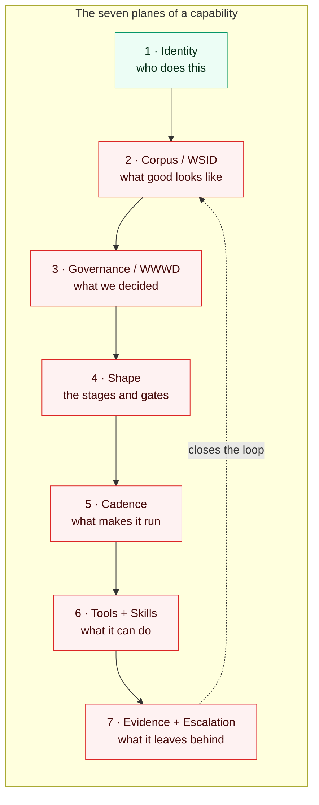
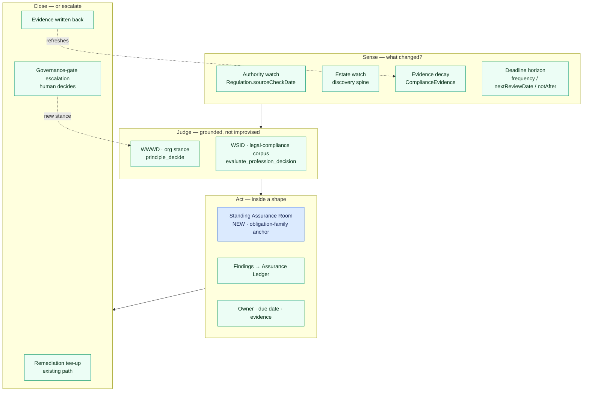
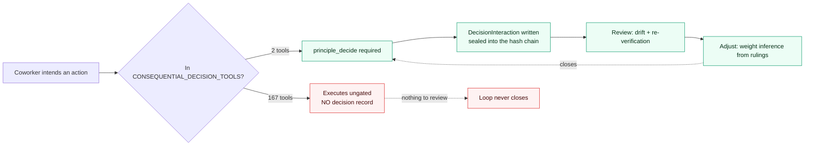

# The Assurance Operating Loop and the Capability Completeness Contract

**Design pass, 2026-08-20.** Companion to
[the scoping pass](2026-08-20-recurring-obligation-work-shape-and-doc-robustness.md),
which established *what* is missing. This establishes *why* it went missing, the
composition that fixes it for compliance, and the reusable contract that finds
and closes the same failure everywhere else.

The operator's diagnosis is the correct one and this document takes it as the
premise: the compliance implementation is thin **because it was built before WSID,
before the corpus, and before workrooms had shapes**. Every ingredient it needed
now exists. None of them are wired to it. The work is composition, not invention.

## 1. The diagnosis, sharpened

A coworker capability is not one thing. It is **seven planes that must all
resolve**, and the platform has built all seven — but never asserted that they
resolve *together* for any given capability.

Text alternative: identity, corpus, governance, shape, cadence, tools/skills, and
evidence form a chain that must close back on the corpus. For the compliance
capability, only the identity plane resolves; the other six break.

### 1.1 Where compliance breaks, plane by plane

Every row verified against the working tree on 2026-08-20.

| Plane | Built platform-wide? | Resolves for compliance? | Evidence |
|---|---|---|---|
| **1 Identity** | Yes | **Yes** | `compliance-officer` is a real tier-2 roster coworker (`packages/db/src/workforce-seed.ts:211`) with a model floor (`agent-model-defaults.ts:50`) |
| **2 Corpus / WSID** | Yes — `docs/professions/registry.json` binds roster coworkers to a family; `legal-compliance` carries 11 corpus pages, `security` 8 | **No** | `evaluate_profession_decision` requires the `registry_read` grant. **`compliance-officer` does not hold it** — and neither do `security-engineer` or `market-research-analyst`, both added to main since this was first measured |
| **3 Governance / WWWD** | Yes — `principle_decide` | **No** | Same grant, same lockout (`agent-grants.ts:403`) |
| **4 Shape** | Partially — `WorkCapsule` with nullable `backlogItemId`, `outcomeAnchor` admitting `coworker` | **No** | No obligation-family room shape exists; standing rooms deferred (BI-A2234157) |
| **5 Cadence** | Yes — `COWORKER_SELF_TASKS` + the 5-minute dispatcher | **No** | Registry holds 5 of 27 roster coworkers; `compliance-officer` absent. Its Proactivity setting is a silent no-op |
| **6 Tools + Skills** | Yes — 67 skills, grant-gated tool packs | **No** | All 4 compliance skills are stranded (below). No MCP tool exists to create or update an `Obligation`, `Control`, `ComplianceEvidence`, `RiskAssessment`, `ComplianceIncident`, `ComplianceAudit`, `AuditFinding`, or `RegulatorySubmission` |
| **7 Evidence + Escalation** | Yes — Assurance Ledger, `assurance-remediation-teeup`, kernel escalation | **No** | Nothing in the compliance domain writes to the ledger |

### 1.2 The single sharpest fact

> **`compliance-officer` — the coworker whose entire job is governance — cannot
> call `evaluate_profession_decision` or `principle_decide`.**
>
> When first measured it was the only roster coworker in that state. Re-measured
> against a later `main`, **three of 27 are**: `compliance-officer`,
> `security-engineer`, and `market-research-analyst`. Two coworkers were added
> with the same defect in the interval. That is the argument for the ratchet in
> §6 Wave 1 in one observation: this is not a one-off to fix, it is a class of
> defect that recurs every time a coworker is authored, because nothing checks it.

The coworker whose entire job is governance is the one coworker locked out of the
governance kernel. It holds `policy_write`, `data_governance_validate`,
`file_read`, `backlog_read`, `backlog_write`, `tool_evaluation_create` — and not
`registry_read`. Its 11-page `legal-compliance` corpus, covering EU AI Act risk
tiers, GDPR lawful basis, CCPA consumer rights, CADA sovereignty, and SPDX
licensing, is unreachable by the coworker it was written for.

This is a one-line fix. It is listed first in §6 for that reason.

### 1.3 The two-namespace defect behind the stranded skills

The skills exist and are well-written. They reach nobody, for a structural reason
worth naming precisely — it is **not** a typo.

There are two identity namespaces and no reconciliation between them:

- **The profession registry** (`docs/professions/registry.json`) binds *roles* to
  a family. `legal-compliance` lists five: `compliance-officer`,
  `legal-operations-counsel`, `licensing-specialist`, `policy-specialist`,
  `policy-enforcement-agent`. Only the first two are roster coworkers; the rest
  are profession-side role names.
- **The skill seeder** (`packages/db/src/seed-skills.ts:586`) treats
  `assignTo` as *agentIds* and writes `SkillAssignment` rows verbatim.
  `SkillAssignment.agentId` is a bare `String` with **no relation** to the
  coworker roster (`schema.prisma:13068`), so the write always succeeds.

All four compliance skills declare `assignTo: ["policy-specialist"]` — a valid
*profession role*, not a coworker. The assignments are created, reference nobody,
and no gate objects.

**Blast radius: 8 of 68 skills reach no coworker at all** —
`skills/compliance/*` (all four: `add-regulation`, `gap-assessment`,
`onboard-regulation`, `posture-report`), `skills/docs/generate-diagram`,
`skills/docs/review-structure`, `skills/workspace/backlog-status`,
`skills/workspace/create-task`. The unresolved target ids are
`policy-specialist`, `documentation-specialist`, `coo-orchestrator`, and
`external-coding-agent`.

The seeder's own header records that this exact class of drift was caught and
fixed once before — for the `"*"` wildcard path only (`seed-skills.ts:84-93`,
BI-53ABC4A4). The explicit-`assignTo` path was left unvalidated.

Two further unbacked anchors in the same area:

- `svc-compliance-pci-requirements` declares
  `backingSkillIds: ["compliance-requirements-review"]`
  (`coworker-service-catalog-seed.ts:95`) — **a skill that does not exist
  anywhere in the repository.**
- The skill schema has no cadence concept at all. All 67 skills carry
  `taskType` ∈ {`analysis`, `conversation`, `code_generation`, `action`} and a
  chat-phrase `triggerPattern`. **A skill cannot express "runs weekly."** This is
  the schema-level reason the cadence plane could not be filled even in
  principle, and it is why §4 adds a recurring task type rather than a
  per-capability cron.

## 2. The composition: the Assurance Operating Loop

The fix is one named loop that consumes all seven planes. It is deliberately
built from parts that already exist and adds exactly two new concepts (marked).

Text alternative: four watches sense change; every finding is judged against the
profession corpus and the organization's own stances rather than improvised;
action happens inside a standing room with an owner, a due date, and evidence;
closure either tees up remediation through the existing path or escalates to a
human, and both feed back into evidence freshness and organizational stance.

**Why "judge" is not optional.** The scoping pass flagged that the existing
regulatory scan asks an LLM *from recall* whether a regulation changed. Routing
every finding through WSID and WWWD is what converts a model opinion into a
grounded, citable, ledgered recommendation. It is the difference between a
compliance product and a compliance-flavoured hallucination — and it is precisely
the plane the compliance coworker is currently locked out of (§1.2).

## 3. The Capability Completeness Contract

The generalization the operator asked for. **A capability is complete when all
seven planes resolve, and each assertion is machine-checkable against substrate
that already exists.**

| # | Plane | Assertion | Checkable against |
|---|---|---|---|
| 1 | Identity | The owning `agentId` is in the roster | `COWORKER_AGENT_SEEDS` |
| 2 | Corpus | The owner's profession family has ≥1 corpus page **and the owner holds the grant that reaches it** | `registry.json` + `docs/professions/*/wiki/` + `TOOL_TO_GRANTS` |
| 3 | Governance | The owner can call `principle_decide`; consequential acts pass the governance gate | `TOOL_TO_GRANTS` + gate registry |
| 4 | Shape | The work has a declared shape — stages, gates, terminal outcomes | Room shape registry (new, §4) |
| 5 | Cadence | Every recurring obligation has a trigger; **every cadence-bearing column has a reader** | `COWORKER_SELF_TASKS` + job catalog + column-reader scan |
| 6 | Tools + Skills | Every `assignTo` resolves to a roster coworker; every `backingSkillId` resolves to a skill; the owner holds a tool for each act its shape requires | `SkillAssignment` + `SkillDefinition` + `TOOL_TO_GRANTS` |
| 7 | Evidence | Findings land on the Assurance Ledger with owner and due date; escalation path declared | Assurance Ledger |

Four of these seven checks are **pure static analysis over existing registries**
and can ship as a CI gate this week. That is the leverage: the contract does not
need the design to land before it starts finding gaps.

### 3.1 The dead-column check, generalized

The scoping pass found six dead cadence columns by hand. That should be
mechanical, and it generalizes past compliance:

> **A schema column that encodes an intention — a frequency, a due date, a
> review cadence, a staleness budget — with no reader is a defect, not a
> placeholder.**

A `reader-coverage` scan over a registry of intention-bearing columns
(`*Frequency`, `*ReviewDate`, `next*At`, `*DueDate`, `staleAfter*`,
`*CadenceHint`, `notAfter`) that fails when a column has no non-generated,
non-test consumer would have caught every one of them at the commit that
introduced it. Precedent exists: `measure-doc-staleness-coverage.mjs` is already a
coverage ratchet, so this is a known shape in this codebase, not a new kind of
gate.

## 4. What changes, concretely

Only two genuinely new concepts. Everything else is a registry entry, a grant, or
a reader.

**New concept 1 — Room Shape.** A declared stage/gate template a workroom is an
instance of. `outcomeAnchor: { kind: "obligation-family", family: "ai-governance" }`,
no `backlogItemId`, stages `sense → judge → act → close`, each with an owner and
a gate. This is the first non-build consumer of EP-WORK-CONVERGENCE and the thing
that makes the operator's picture-first shape view possible for non-build work.

**New concept 2 — a recurring skill task type.** Extend the skill schema with a
`taskType: "recurring"` plus a `cadence` field, and add an `assurance-watch`
discriminator to `SCHEDULED_AGENT_TASK_KINDS` (currently 2 entries). Without
this, "runs weekly" remains unexpressible and every cadence stays a bespoke cron.

**Everything else already exists:**

| Need | Existing part |
|---|---|
| Recurring coworker work | `COWORKER_SELF_TASKS` + 5-minute dispatcher |
| Craft grounding | `evaluate_profession_decision` + `legal-compliance` corpus |
| Org grounding | `principle_decide` + WWWD stance pages |
| Findings ledger | Assurance Ledger |
| Auto-remediation | `assurance-remediation-teeup` |
| Escalation | Governance gate (EP-1C37C089) |
| Authority feed pattern | `patch-assessment-sweep` (OSV/KEV) |
| Behavioural proof | Coworker certification |

## 4A. The decision gate and the closed loop

**This section corrects §2 and §4.** The original design named `principle_decide`
as a "judge" step and left it there. That under-described what the platform
already has, and it omitted the thing that actually makes autonomy safe: the
gate must fire *at the point of consequential action*, and the record it leaves
must feed back into how the next decision is made.

Verification on 2026-08-20 found that **almost all of this is built** — under
`EP-1C37C089`, most of whose items are already done — and that the gap is
narrower, sharper, and more urgent than "design it".

### 4A.1 What exists

| Concern | Status | Where |
|---|---|---|
| Consult-before-consequential-act gate | **Built, enforce by default** | `apps/web/lib/tak/decision-routing-governance-hook.ts` — `principle_decide` must be consulted before a consequential tool; a consult clears the gate for `CONSULT_WINDOW_MS`. Modes: enforce \| shadow \| off |
| Gate at tool dispatch | **Built** | Runtime kernel-commandment gate in `mcp-tools.ts` (BI-43F95F77) refuses or demands typed confirmation before the tool body runs |
| Gate on workroom next-steps | **Built** | `BI-E0BFFF77` — work-shape action envelope + `principle_decide` autonomy gate; `CoworkerActionEnvelope` carries `manifestActionId`, `rationale`, `status`, `authorityDecisionId` |
| Decision record | **Built, and sealed** | `DecisionInteraction` — question, options, evidence, sources, rationale, riskTier, confidenceBefore/After, `scoredOptions`, `recommendedOptionId`, `chosenOptionId`, `gateKey`. Append-only hash chain (`chainId`/`prevHash`/`chainEntryHash`/`sealedAt`) with a write guard |
| Result of the decision | **Built** | `outcomeType`, `outcomePayload`, `humanOutcome`, plus `EscalationCapture` / `DeferralCapture` |
| Review | **Built** | Golden-decision drift (`decision-drift.ts`) flags a flipped winner or a collapsed margin against the frozen scenario panel, using the same `decide()` engine the runtime uses |
| Adjust over time | **Built** | `weight-inference.ts` / `weight-inference-adapter.ts` infer dimension weights from actual human rulings |
| Evidence still valid? | **Built** | `EvidenceReVerification` + `evidence-reverifier.ts` |

So the operator's model — gate the critical acts, record the decision, keep the
result, review it, adjust — is **not missing. It is implemented.**

### 4A.2 The gap: the gate governs 1% of what a coworker can do

`CONSEQUENTIAL_DECISION_TOOLS` is a hand-maintained set. It contains **two**
tools — `triage_backlog_item` and `retire_backlog_item` — against **169
side-effecting tools**. An undeclared tool is *ordinary by default*, so **167
side-effecting tools execute with no kernel consultation required and leave no
decision record.**

Text alternative: two tools take the governed path — consult, record, seal,
review, adjust — and the loop closes. The other 172 bypass it entirely, produce
no decision record, and therefore give the review and adjust stages nothing to
work with.

This is the same failure shape as everything else in this document: **the
mechanism is present, and its reach was never asserted.** It is already filed as
`BI-B54D5B65` ("~180 side-effecting tools have never been triaged for
reversibility — 'no declaration' means 'ordinary' by default, and nobody
checked"), which is open.

**Consequence for autonomy specifically.** Coverage is the binding constraint on
how much autonomy can safely be granted. Raising a coworker's Proactivity, or
letting the Assurance Operating Loop act without a human, widens the blast radius
of exactly the 172 ungated tools. Autonomy should not be increased ahead of gate
coverage — and because coverage is now measured on every run, that ordering can
be made explicit rather than assumed.

### 4A.3 What is genuinely missing

Two things, both narrow:

1. **Consequence classification (the big one).** 167 side-effecting tools carry
   no reversibility or consequence declaration. Until they do, the gate's reach
   cannot grow. A declaration on the tool definition — next to the `sideEffect`
   flag that already exists — makes the set derived rather than hand-maintained,
   which is what stops it drifting again.
2. **Action-outcome feedback.** `DecisionInteraction` records the decision and
   its *verdict*, and the loop closes on **human rulings** via weight inference.
   Nothing links a decision to *what actually happened when the authorized action
   ran* — no edge from `DecisionInteraction` to the `ToolExecution` /
   `ToolExecutionReceipt` it authorized, and no observed-outcome field. So the
   system can learn "the human overruled me" but not "the call I made turned out
   badly". For an autonomous loop with no human in it, the second is the only
   signal available.

One smaller note: the consult-window ledger is a **per-process, in-memory map**
(documented in the hook's own header). Single-portal deployments are fine; a
multi-instance portal would let a consult on one process clear the gate on
another, or fail to. Worth closing before autonomy is widened across instances.

### 4A.4 Effect on this document's scoring

The Governance plane grades whether an agent *can* consult the kernel. It does
not grade whether the platform *makes* it. The measure now reports gate coverage
at repo level, and per agent as `reachableSideEffectingTools` /
`reachableGatedTools`, deliberately **alongside** the ladder rather than folded
into it — folding them would score an agent down for a platform-level gap it
does not control. Once consequence classification lands, the Governance ceiling
should rise to require that an agent's reachable consequential tools are gated.

## 5. Why every existing gate missed this

Worth stating plainly, because the closure plan has to survive the same gates.

- **Grant audit** checks that held grants map to real tools. It does not check
  that a coworker holds the grants its *job* requires — so the missing
  `registry_read` reads as a deliberate scope choice.
- **Skill seeding** writes `SkillAssignment` rows against an unconstrained
  `String` column. An assignment to nobody is indistinguishable from an
  assignment to somebody.
- **Coworker certification** exists and runs nightly — but only **6 of 27**
  coworkers have curated golden journeys (`change-reviewer`,
  `marketing-specialist`, `inventory-specialist`, `ops-coordinator`,
  `ux-design-critic`). The other 18, `compliance-officer` among them, fall to
  `derivedReadProbe`: *"use one of your available tools to retrieve one concrete
  piece of current data."* A coworker with zero reachable skills, no recurring
  work, and no domain write tools **passes that probe**.
- **Doc gates** check links, presence, and staleness — never whether a documented
  surface states its cadence.

Every gate is presence-shaped. None is reachability-shaped. That is one pattern,
and it is the same one recorded as *absence is invisible to every gate*.

**Corollary for the plan:** the completeness contract must be a **gate**, not a
report. A report would be read once and drift; §3's four static checks are the
first thing to ship.

## 6. Closure plan

Ordered so that each step is independently valuable and the cheap unblocking
fixes come first.

### Wave 0 — unblock (hours, not weeks)

| # | Action | Effect |
|---|---|---|
| 0.1 | Grant `registry_read` to `compliance-officer` | Unlocks WSID **and** WWWD for the governance coworker. One line |
| 0.2 | Repoint the 4 compliance skills' `assignTo` to `compliance-officer` | Four written skills start reaching a real coworker |
| 0.3 | Resolve the other 4 stranded ids (`documentation-specialist`→`doc-specialist`, `coo-orchestrator`→`coo`, plus `external-coding-agent` policy) | 8 of 68 stranded skills → 0 |
| 0.4 | Resolve or remove `backingSkillIds: ["compliance-requirements-review"]` | Removes an unbacked anchor |

### Wave 1 — make the gaps un-reintroducible (the ratchets)

| # | Action | Effect |
|---|---|---|
| 1.1 | CI check: every `assignTo` and `backingSkillId` resolves | Closes the two-namespace defect permanently |
| 1.2 | CI check: dead intention-bearing columns (§3.1) | Would have caught all six compliance dead columns |
| 1.3 | Curated golden journeys for the remaining 18 coworkers, asserting at least one *domain* act | Certification becomes reachability-shaped |
| 1.4 | Doc contract + coverage ratchet (scoping pass §4.3) | Docs must state cadence, trigger, and autonomy boundary |

### Wave 2 — build the loop for compliance

| # | Action |
|---|---|
| 2.1 | `assurance-watch` task kind + `COWORKER_SELF_TASKS` entry for `compliance-officer` |
| 2.2 | Deadline-horizon sweep over the six revived columns → Assurance Ledger |
| 2.3 | Wire the regulatory monitor's existing `"scheduled"` arm — **after** its authority source is fixed to summarize a fetched source rather than recall one |
| 2.4 | Room Shape + Standing Assurance Room; first instance = AI governance of ourselves |
| 2.5 | Compliance domain MCP tools (obligation / control / evidence / finding), grant-gated |

### Wave 3 — generalize

| # | Action |
|---|---|
| 3.1 | Run the completeness contract across the full identity inventory → a ranked gap ledger |
| 3.2 | Close per-coworker, highest-consequence first |
| 3.3 | Certificate inventory + expiry watch; then the cryptographic bill of materials |
| 3.4 | Licence/credential renewal watch (field-service and professional-services verticals) |
| 3.5 | Multi-tenant compliance for the `it-managed-services` archetype |

Wave 0 is four small changes and materially improves the compliance coworker the
same day. Wave 1 is what stops the platform re-earning this document.

## 7. Decisions needed from the operator

1. **Wave 1 as a blocking gate or a ratchet?** A blocking gate on all 23
   coworkers fails CI immediately (18 lack curated journeys). Recommendation:
   ratchet — freeze the current count, forbid regression, close over Wave 3.
2. **The unbacked-anchor policy.** `compliance-requirements-review` is one
   instance of a known pattern. Should Wave 1.1 fail the build on any unbacked
   anchor, or quarantine and report first?
3. **`external-coding-agent`.** Is it a real non-roster identity that should be
   registered, or should those two skills move to a roster coworker? This changes
   whether 1.1 needs an allow-list.
4. **Authority sourcing** (carried forward from the scoping pass, still
   load-bearing): the regulatory monitor must not run daily on model recall.
   Confirm the fetched-source approach before 2.3.
