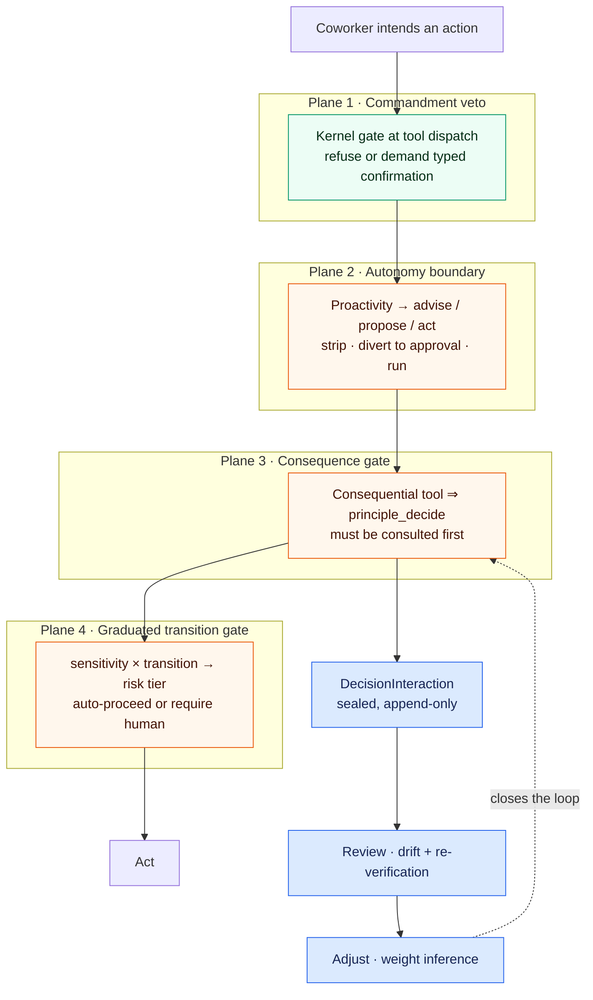

# Governed Autonomy — DPF Conformance and Implementation Scope

**The normative model lives in [the Trusted AI Kernel (TAK)
specification](trusted-ai-kernel.md).** This document does not restate it. It
records how the DPF implementation stands against it, and manages the scope of
closing the difference.

That split is deliberate and was corrected in this pass: the architecture *is*
TAK, and real implementation has now taught TAK several things it did not
previously say. Those lessons were folded back into the standard rather than
accumulating in a parallel document —

| TAK section | What implementation taught |
|---|---|
| §8.1 | A side-effect flag is not a sufficient governance discriminator; tools need a **consequence class** |
| §8.4.1 | A hand-maintained opt-in list of gated tools **inverts** the default safety rule — named as a normative anti-pattern |
| §8.4.2 | Gate **coverage** is itself a governed metric, reportable per agent over reachable tools |
| §7.12.1 | Autonomy is **bounded by gate coverage**, because the most autonomous level removes every other control |
| §7.12.2 | Machine-evaluable **admission criteria** for autonomous operation |
| §8.11 | **Activity shapes and triggers** — recurring work needs stop conditions and a review point, or it is an unbounded grant |
| §8.11.1 | A recorded cadence or expiry with **no reader** is a defect, not latent configuration |
| §13.3 | **Decision records and outcome linkage** — under autonomy, outcome feedback is the only corrective signal left |

Conformance assertions `TAK-020` through `TAK-028` in [the rubric](tak-conformance-tests.md)
test these.

**How to use this document.** §1–§3 explain how the DPF runtime realizes the TAK
model, in implementation terms. §4–§6 are the per-coworker, per-shape, and
per-tool criteria as DPF applies them. §7 is the sequencing rule. **§8 is the
scope register** — every capability with its status, evidence, owning backlog
item, and the field in the machine measure that proves it. Nothing in §8 is an
estimate: each row is measured or cites the code that implements it.

Companions: [the seven-plane capability
contract](2026-08-20-assurance-operating-loop-and-capability-completeness.md) ·
[the obligation-shape scoping
pass](2026-08-20-recurring-obligation-work-shape-and-doc-robustness.md) · the
generated measure at `docs/maintenance/capability-completeness.md`.

## 0. Conformance summary

DPF still **fails `TAK-003`** — the default proposal safety rule — but the
assertions derived from it have moved. Numbers below are read from
`apps/web/lib/coworker-lifecycle/capability-completeness.generated.json`, not
estimated:

| Assertion | Requirement | DPF status |
|---|---|---|
| `TAK-003` | Undeclared consequential tool defaults to `proposal` | **Fail** — an undeclared side-effecting tool is still ordinary by default. Flipping that default moves 122 tools behind the gate in one step and is deliberately its own change |
| `TAK-020` | Every side-effecting tool carries a consequence class | **Fail, materially narrowed** — 56 of 178 (31%), up from 0. The assertion requires *every* side-effecting tool plus an unclassified-means-consequential default, so it does not pass until `TAK-003` does |
| `TAK-021` | Gating derived, not an enumerated allowlist | **Pass** — `deriveConsequentialToolNames` computes the gated set from `ToolDefinition.consequence`; `CONSEQUENTIAL_DECISION_TOOLS` survives only as a unioned transitional seed, and a CI ratchet fails the build if the composition root stops installing the derived resolver |
| `TAK-022` | Gate coverage reportable | **Pass** — `summary.consequentialGate` reports coverage, the split by consequence class, and whether the runtime resolver is installed; rise-only floor in `scripts/agent-capability-baseline.json` |
| — | Skill/service reference integrity | **Pass** — enforced by `scripts/check-agent-capability-integrity.mjs` in CI |
| — | New-agent capability completeness | **Pass** — every newly declared identity must meet the seven current plane ceilings (3/3/3/2/3/3/2); existing per-plane gap counts are shrink-only in the same CI guard |
| — | Profession corpus reachability | **Pass** — all 86 measured identities reach `evaluate_profession_decision`; the scanner consumes both workforce-seed and canonical-registry grant sources, and corpus gaps are ratcheted at zero |
| `TAK-023` | Autonomy bounded by coverage | **Fail** — not enforced; §7 states the rule, admission criterion A4 is its machine form |
| `TAK-024` | Activity shapes bounded | **Pass for declared shapes** — `work-shapes.ts` registers a named, versioned shape with stages, an accountable principal each, governed-decision advances, stop conditions including the failure exit, and a review point; `validateWorkShape` enforces those as a conformance test. One shape is declared, so the assertion holds where it applies and says nothing about activity not yet bound |
| `TAK-025` | Triggers declared; dead intent detected | **Partial** — the §8.11.1 vocabulary is a closed set and every shape declares from it; the six dead cadence columns now have a reader (`deadline-horizon-sweep.ts`). A general scan for *unread* recorded intentions does not exist, so dead intent is still found by hand |
| `TAK-026` | Decision-to-action linkage | **Fail** — no edge from decision to execution |
| `TAK-027` | Outcome feedback under autonomy | **Fail** — loop closes on human rulings only |
| `TAK-028` | Decision-procedure drift detection | **Pass** — golden-scenario drift |

The controls themselves were always built and correct. **What failed was reach**,
and that is what this pass moved: the gate went from governing 2 tools to 54, a
coworker acquired a declared shape and a declared cadence, and six columns that
read as controls in force acquired the reader that makes them so.

`TAK-020` is worth being precise about, because a 31% figure invites being read
as a pass in progress. It is not: the assertion's own criterion is that an
*unclassified* tool is treated as consequential. Until that default flips, 122
side-effecting tools remain ordinary by omission, and the honest status is Fail
with a much smaller remainder.

## 1. How DPF realizes the TAK model

TAK §7 and §8 define the control model. DPF implements it as four planes.

Four control planes stand between a coworker's intent and a consequential act.
All four are built. They have **very different reach**, and reach — not
existence — is what governs how much autonomy is safe.



Text alternative: an intended action passes a commandment veto that covers every
tool, then an autonomy boundary that covers scheduled runs, then a consequence
gate that requires a kernel consultation, then a graduated transition gate. Only
the consequence gate produces the sealed decision record that review and
adjustment feed on, so wherever that gate does not reach, the loop cannot close.

### 1.1 Reach, measured

| Plane | Mechanism | Reach today |
|---|---|---|
| 1 · Commandment veto | `mcp-tools.ts` runtime kernel gate | **Every** MCP tool dispatch |
| 2 · Autonomy boundary | `agent-task-scheduler.ts` + `propose-interception.ts` | **Scheduled/autonomous runs only** — not interactive chat |
| 3 · Consequence gate | `decision-routing-governance-hook.ts` | **56 of 178** side-effecting tools |
| 4 · Graduated transition | `graduated-autonomy.ts` | **Build Studio phase transitions only** |

Plane 1 is broad but produces no decision record — it is a veto, not a decision.
Plane 3 is the only plane that produces one, and it reaches 1%.

## 2. The autonomy equation

The operator's question — *"at Proactivity high, what is this coworker allowed to
do?"* — resolves through three terms, all of which are real:

```
what it may do  =  action boundary (from Proactivity)
                 ∩ tools it can reach (from grants)
                 ∩ what the consequence gate stops
```

**Term 1 — action boundary.** `ProactivityLevel` (quiet | balanced | assertive)
resolves to a `ProactivityActionBoundary`, enforced on the scheduled path:

| Boundary | Enforcement |
|---|---|
| `advise` | Side-effecting tools are **stripped from the run** — the coworker can only recommend |
| `propose` | Side-effecting non-artifact calls are **diverted to `AgentActionProposal`** for owner approval; curated artifact writes still run |
| `act` | Side-effecting tools **run directly** |

This is genuinely enforced (BI-754C9E82 for `advise`, BI-80532D5C for `propose`),
and `propose` is the safety precondition that lets self-tasks extend beyond the
curated roster.

**Term 2 — reachable tools.** Grants determine which side-effecting tools the
coworker can call at all. The measure reports this per agent as
`planes.governance.reachableSideEffectingTools`.

**Term 3 — the consequence gate.** Of those reachable tools, how many require a
kernel consultation first: `reachableGatedTools`.

**Why Proactivity high is the critical factor.** At `act`, terms 1 and 2 stop
constraining and only term 3 remains — and term 3 is 1%. So raising Proactivity
converts the coverage gap from latent to live. That yields the sequencing rule in
§7, which is the single most important line in this document.

## 3. Workroom shape and triggers

A **work shape** is the reusable structure a workroom is an instance of: what
starts it, what stages it moves through, what must be true to advance, who is
accountable, and when it stops.

Substrate already exists and is not widely known — `StoredCycleBoundary`
(`apps/web/lib/work-management/room-cycle-adapter.ts`) persists exactly the
fields a shape needs:

| Field | Role in the shape |
|---|---|
| `trigger` | What started this cycle |
| `objective` | What it is for |
| `accountablePrincipalRef` | Who answers for it |
| `expectedReviewAt` | When it is looked at regardless |
| `stopConditions` | What ends it |
| `measureSummary` | How success is judged |

What is **missing** is the declarative registry: a named catalog of shapes with
stages and per-stage gates, so a shape can be instantiated rather than
hand-assembled. That is the "Room Shape" concept the capability contract scores
as plane 4 with a ceiling of 0.

### 3.1 Trigger taxonomy per shape

Triggers are the half most often left implicit. Every shape must declare which of
these start or advance it:

| Trigger kind | Source | Status |
|---|---|---|
| **Claim** | A coworker claims a backlog item | Built — the only trigger a workroom has today |
| **Cadence** | `COWORKER_SELF_TASKS` → `ScheduledAgentTask`, driven by Proactivity | Built; **4 of 82** agents registered |
| **Deadline horizon** | A due date falling inside a look-ahead window | Columns exist, **no reader** |
| **Authority change** | An external source changed | Built for OSV/KEV; manual-only for regulations |
| **Estate drift** | Discovery spine observes a change | Built for software estate |
| **Evidence decay** | Proof passed its freshness budget | Partial |
| **Escalation** | Another shape escalated into this one | Built (`EscalationCapture`) |

### 3.2 Criteria for a well-formed shape

A shape is complete when every row holds. These are the acceptance criteria for
plane 4, and the checklist for authoring any new shape:

1. **Named and versioned** — instantiable, not hand-assembled.
2. **Declared trigger set** — at least one from §3.1, each with its condition.
3. **Stages with entry/exit conditions** — an advance is a decision, not a status write.
4. **Per-stage gate declaration** — which advances require `principle_decide`, and at what risk tier.
5. **Accountable principal per stage** — `accountablePrincipalRef` is not optional.
6. **Stop conditions** — including the failure exit, not only the happy one.
7. **Review point** — `expectedReviewAt`, so a stalled room surfaces without anyone remembering it.
8. **Evidence contract** — what the shape must leave behind for the next reviewer.

## 4. Criteria A — per AI coworker

The seven-plane contract, graded 0–3 (absent · declared · reachable · proven),
with declared ceilings where the substrate caps what is attainable. Full criteria
and per-agent scores are in the [capability
contract](2026-08-20-assurance-operating-loop-and-capability-completeness.md) §3
and the generated measure.

Applied to **82 distinct agent identities** — the canonical `AGT-*` registry, the
workforce roster, and the profession registry, joined through
`agent-identity.ts`. Two governance-relevant fields are reported per agent
alongside the ladder: `reachableSideEffectingTools` and `reachableGatedTools`.

**Autonomy-specific admission criteria.** Before a coworker is raised to
`assertive` with an `act` boundary, all of these must hold:

| # | Criterion | Measured by |
|---|---|---|
| A1 | Governance plane ≥ 2 — it can consult the kernel | `planes.governance.level` |
| A2 | Corpus plane ≥ 2 — it can reach its craft corpus | `planes.corpus.level` |
| A3 | An escalation target is declared | `planes.governance.escalatesTo` |
| A4 | Every reachable side-effecting tool is consequence-classified | `reachableGatedTools == reachableSideEffectingTools` |
| A5 | Evidence plane ≥ 2 — a curated journey exercises a real domain act | `planes.evidence.level` |
| A6 | Its shape declares stop conditions and a review point | Shape registry (not yet built) |

**A4 fails for every agent today**, because the classification does not exist.
That is the gate on widening autonomy, not a nice-to-have.

## 5. Criteria B — per workroom shape

Per §3.2. Plane 4 scores 0 for all 78 agents with a ceiling of 0, because no
shape registry exists. When it lands the ceiling rises to 3 and the ladder is:

| Level | Means |
|---|---|
| 0 | No declared work shape |
| 1 | A shape is named but has no stages or gates |
| 2 | Stages and gates declared, triggers bound |
| 3 | Declared, instantiated, and running instances observable |

## 6. Criteria C — per tool

A tool is **governed** when its consequence is declared and the gate can act on
that declaration.

| # | Criterion | Status |
|---|---|---|
| C1 | Declares `sideEffect` | Built — 169 declare `true` |
| C2 | Declares consequence/reversibility | **Missing on all of them** |
| C3 | The consequential set is **derived** from C2, not hand-maintained | Missing — the set is a literal of 2 |
| C4 | Consequential calls require a `principle_decide` consult | Built and enforce-by-default |
| C5 | The consult and the call are durably linked for audit | Partial — consult window is per-process, in memory |
| C6 | The authorized act's outcome feeds back | **Missing** |

C2 and C3 are one change: put the declaration on the tool definition beside
`sideEffect`, derive the set, and add a CI check that every `sideEffect: true`
tool carries one. A hand-maintained set is precisely what let coverage sit at 1%
unnoticed.

## 7. The sequencing rule

> **Autonomy may not be widened ahead of gate coverage.**
>
> Raising a coworker to `assertive`/`act` removes terms 1 and 2 of the autonomy
> equation and leaves only the consequence gate. While that gate covers 56 of 178
> side-effecting tools, raising Proactivity widens the blast radius of the other
> 167 — each of which executes with no kernel consultation and leaves no decision
> record for review or adjustment to act on.

Both sides are now measured on every run, so this ordering can be enforced rather
than remembered: admission criterion **A4** is the machine-checkable form of it.

## 8. Implementation scope register

The scope instrument. **Status is evidence-backed, not estimated** — every
"Built" row cites code present on this branch. A BI marked *(done)* had its
status read from the platform backlog; the rest are cited as the originating
item without a status claim.

| # | Capability | Status | Evidence | Owning BI | Measured by |
|---|---|---|---|---|---|
| 1 | Commandment veto at tool dispatch | **Built** | `mcp-tools.ts` kernel gate | — | — |
| 2 | Consult-before-consequential-act gate | **Built** | `decision-routing-governance-hook.ts`, enforce by default | BI-B6690C11 (done) | `summary.consequentialGate.mechanism` |
| 3 | Sealed decision record | **Built** | `DecisionInteraction` + hash chain, `decision-chain.ts` | BI-81CC5D8E | — |
| 4 | Review — corpus drift | **Built** | `decision-drift.ts` golden scenarios | EP-0AF96937 | — |
| 5 | Adjust — weight inference from rulings | **Built** | `weight-inference-adapter.ts` | EP-DECISION-TIER-REBALANCE | — |
| 6 | Evidence re-verification | **Built** | `EvidenceReVerification` | — | — |
| 7 | Autonomy boundary `advise` | **Built** | tools stripped in scheduler | BI-754C9E82 | — |
| 8 | Autonomy boundary `propose` | **Built** | `propose-interception.ts` → `AgentActionProposal` | BI-80532D5C | — |
| 9 | Graduated transition gate | **Built, Build Studio only** | `graduated-autonomy.ts` | BI-D996C238 | — |
| 10 | Workroom governance anchor | **Built** | `CoworkerActionEnvelope` + autonomy gate | BI-E0BFFF77 (done) | — |
| 11 | Cycle boundary: trigger, stop conditions, review point | **Built** | `StoredCycleBoundary` | — | — |
| 12 | **Consequence classification on tools** — TAK §8.1, `TAK-020` | **Partial (56/178)** | `ToolConsequence` gained `authority`; every tool that moves money, reaches a third party, changes identity/authority, or destroys state now declares a class | **BI-B54D5B65** (P1) | `summary.consequentialGate.coveragePct` = 31 |
| 12a | **Default for an unclassified side-effecting tool** — TAK §8.1, `TAK-003` | **Missing** | still ordinary by omission for 122 tools; deliberately deferred to its own change | BI-B54D5B65 | `summary.consequentialGate.ungated` |
| 13 | **Derived consequential set + CI check** — TAK §8.4.1, `TAK-021` | **Built** | `consequential-tool-coverage.ts` derives from `consequence`, seed unioned; rise-only floor + resolver-install check in `check-agent-capability-integrity.mjs` | BI-B54D5B65 | `gateClassified` |
| 14 | **Action-outcome feedback** — TAK §13.3, `TAK-026`/`TAK-027` | **Missing** | no edge to `ToolExecution`; no observed outcome | **BI-23BF8131** | — |
| 15 | Durable consult ledger | **Partial** | per-process in-memory map | **BI-AF7CE2BC** | — |
| 16 | **Work-shape registry (stages + gates)** — TAK §8.11, `TAK-024` | **Built (1 shape)** | `work-shapes.ts`; projects onto `StoredCycleBoundary` rather than adding a substrate; `validateWorkShape` is the §8.11 MUSTs as a check | EP-WORK-CONVERGENCE / BI-A2234157 | `planeLevels.shape` ceiling 0 → 2 |
| 17 | Screen-manifest registry | **Empty** | `ALL_MANIFESTS = []` — the envelope's `manifestActionId` resolves against nothing | — *(unfiled)* | — |
| 18 | Cadence trigger coverage | **Partial** | 6 of 82 agents registered (`compliance-officer` added) | BI-E2DB8A43 | `planeLevels.cadence` ceiling 2 → 3 |
| 19 | Skills can declare a cadence | **Built** | `taskType: "recurring"` + cron `cadence` in skill frontmatter, persisted to `SkillDefinition.cadence` | BI-EA406643 | `summary.skills.cadenceCapable` 0 → 1 |
| 20 | Deadline-horizon trigger — TAK §8.11.1, `TAK-025` | **Built** | `deadline-horizon-sweep.ts` reads all six columns; daily `obligation-assurance-watch` cron raises findings onto the Assurance Ledger | BI-B57CA395 | `AssuranceFinding` where `findingKind = "obligation-deadline"` |
| 21 | Autonomy admission criteria (A1–A6) enforced — TAK §7.12.2, `TAK-023` | **Missing** | A4 fails for every agent | **BI-1DF04B7A** | `planes.governance.*` |

| 22 | Skill `assignTo` referential integrity | **Built** | `scripts/check-agent-capability-integrity.mjs` + CI workflow; stranded skills enforced at zero | `BI-B6157AAB` | `summary.skills.stranded` |
| 23 | Unbacked `backingSkillIds` ratchet | **Built (baseline 7)** | shrink-only `scripts/agent-capability-baseline.json` | `BI-5C1978C7` | `summary.unbackedSkillIds` |

### 8.0 Landed in this pass

Recurring-obligation pass (this change):

| Change | Effect on the measure |
|---|---|
| Consult gate derived from `ToolDefinition.consequence`, seed unioned; `authority` class added; 39 tools classified | `summary.consequentialGate` 2/174 (1%) → 54/174 (31%) |
| Work-shape registry with §8.11 conformance check | `planeLevels.shape` 82/0/0/0 ceiling 0 → 81/0/1/0 ceiling 2 |
| Skill cadence declaration + `compliance-officer` self-task | `planeLevels.cadence` 77/0/5/0 ceiling 2 → 76/0/5/1 ceiling 3; `skills.cadenceCapable` 0 → 1 |
| Daily deadline-horizon sweep over the six dead columns | `AssuranceFinding` gains `obligation-deadline`; six columns acquire a reader |
| Rise-only consult-gate floor + resolver-install check in CI | a coverage regression, and a dropped resolver install, both fail the build |
| Compliance and proactivity pages rewritten to what now happens | doc-cadence checklist complete rows 2/56 → 5/56 |

Earlier capability-integrity pass:

| Change | Effect on the measure |
|---|---|
| `registry_read` granted to `compliance-officer`, `security-engineer`, `market-research-analyst` | Governance level-1 population 3 → 0; no roster coworker is now locked out of the kernel. Corpus level-3 25 → 28 |
| 8 stranded skills repointed (`policy-specialist`→`compliance-officer`, `documentation-specialist`→`doc-specialist`, `coo-orchestrator`→`coo`) | `summary.skills.stranded` 8 → 0 |
| Capability-integrity CI gate + shrink-only baseline | Stranded skills cannot regress; a net-new unbacked anchor fails the build |

The seven unbacked `backingSkillIds` were **deliberately not removed**.
`evaluateCoworkerServiceReadiness` already surfaces each as "Missing skill: X"
with a *Review capabilities* recovery — so the service is honestly not-ready
today. Deleting the citation would flip it to falsely-ready. Writing the seven
skills is real domain work and remains `BI-5C1978C7`.

### 8.1 Reading the register

Rows 1–11 are **built** — do not redesign them. The recurring error in this
programme has been proposing new machinery where the machinery exists and only
its *reach* was never asserted.

Rows 12–21 were the actual scope. **13, 16, 19, and 20 landed**; 12 moved from
0 to 54 of 174. Row **12a is now the critical path**: flipping the default for an
unclassified side-effecting tool is what turns `TAK-020` and `TAK-003` from a
narrowed failure into a pass, and it is held back deliberately because it changes
gate behaviour for 120 tools at once.

Row 17 is worth separate attention: the workroom action envelope is built and
governs actions resolved through a screen manifest — and the manifest registry is
an empty array, so today it governs nothing.

## 9. Open decisions

1. **Where does consequence classification live?** On the tool definition
   (proposed here) or in a separate policy file? On the definition keeps it next
   to `sideEffect` and lets CI demand it; a policy file allows an operator to
   retune without a code change.
2. **Does the autonomy boundary extend to interactive chat?** It is enforced on
   the scheduled path only. An owner acting through chat is a different actor
   with different consent — but the tools are the same tools.
3. **Should A4 hard-block raising Proactivity to assertive?** Recommendation:
   yes, once classification exists; a warning until then, because a hard block
   today would freeze every coworker at `balanced`.
4. **What counts as an observed outcome** for row 14 — tool success, or a
   business-level result the coworker cannot see? Recommendation: start with
   execution outcome plus reversal detection, since both are already observable.
