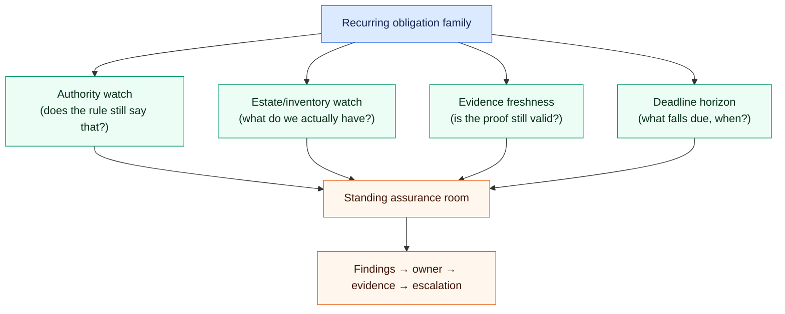

# Recurring-Obligation Work Shape and Documentation Robustness

**Scoping pass, 2026-08-20.** Triggered by an operator observation on the public
compliance and licensing-readiness pages: the docs describe *records and screens*
but never describe **what the AI Coworker actually does, in what shape, on what
cadence, and how it stays current**. That observation generalizes. This document
establishes how far it generalizes, what is actually built underneath, and what
has to be scoped to close it.

> **Follow-on:** the *why* and the closure design are in
> [The Assurance Operating Loop and the Capability Completeness Contract](2026-08-20-assurance-operating-loop-and-capability-completeness.md).
> It establishes that this is a composition failure across seven planes — and
> that `compliance-officer` cannot
> reach WSID or WWMD.

## 1. The finding in one picture

The failure is not "a doc is thin". It is a **three-layer break** that repeats
across the platform: a record substrate exists, the cadence that should drive it
was never wired, and the doc describes only the layer that exists.

```mermaid
flowchart LR
    subgraph L1["Layer 1 — Record substrate"]
        R1["Regulation / Obligation / Control"]
        R2["LicenseRequirementReference"]
        R3["Policy / Audit / Evidence"]
    end
    subgraph L2["Layer 2 — Cadence & trigger"]
        C1["obligation.frequency"]
        C2["control.nextReviewDate"]
        C3["renewalCadenceHint / staleAfterDays"]
        C4["RegulatoryMonitorScan triggeredBy=scheduled"]
    end
    subgraph L3["Layer 3 — Work shape"]
        W1["Standing room / recurring turn"]
        W2["Owner, evidence, escalation"]
    end
    subgraph L4["Layer 4 — Documentation"]
        D1["What the coworker does"]
        D2["Frequency & trigger"]
        D3["How it stays current"]
    end

    L1 -->|"BUILT"| L2
    L2 -.->|"DEAD — no consumer"| L3
    L3 -.->|"ABSENT"| L4

    classDef built fill:#ecfdf5,stroke:#059669,color:#052e16
    classDef dead fill:#fff7ed,stroke:#ea580c,color:#431407
    classDef absent fill:#fef2f2,stroke:#dc2626,color:#450a0a
    class R1,R2,R3 built
    class C1,C2,C3,C4 dead
    class W1,W2,D1,D2,D3 absent
```

Text alternative: the record substrate is built and the cadence *columns* exist
on it, but nothing reads those columns; because no recurring work shape consumes
them, there is nothing for the documentation to describe, so the docs stop at
"here is the screen".

## 2. What was verified (not asserted)

Every row below was checked against the working tree on `main` lineage at
2026-08-20. Line references are to the files named.

| # | Claim | Evidence |
|---|---|---|
| 1 | The compliance record substrate is deep and real | 20+ Prisma models: `Regulation`, `Obligation`, `Control`, `ControlObligationLink`, `ComplianceEvidence`, `RiskAssessment`, `ComplianceIncident`, `ComplianceAudit`, `AuditFinding`, `Policy`, `PolicyAcknowledgment`, `ComplianceSnapshot`, `RegulatoryAlert`, `RegulatoryMonitorScan`, plus 5 `License*` models (`packages/db/prisma/schema.prisma`) |
| 2 | An 18-regulation horizontal pack is seeded, incl. AI-governance regimes | `packages/db/src/seed-software-horizontal-compliance.ts` — CCPA/CPRA, VCDPA family, breach-notification family, SOC 2, ISO 27001, NIST AI RMF, TRAIGA, Colorado AI Act, EU AI Act, GDPR, UK GDPR, HIPAA, GLBA, FERPA, FedRAMP, CAN-SPAM, TCPA, ADA/WCAG. Statutory vs framework is correctly distinguished |
| 3 | Applicability is data-driven, not hardcoded | `RegulationApplicability` + `regulationApplies` (`packages/db/src/regulation-applicability.ts`); adding a regime is a data operation |
| 4 | The coworker can *capture* scope conversationally | `record_compliance_scope` in `apps/web/lib/mcp/packs/compliance-scope-pack.ts` — 10 data-handling predicates incl. `deploys-automated-decisioning` |
| 5 | **`Obligation.frequency` drives nothing** | Only consumer is a display string in `apps/web/lib/tak/route-context/providers/compliance.ts:175`. No scheduler reads it |
| 6 | **`Control.reviewFrequency` / `nextReviewDate` / `lastReviewedAt` drive nothing** | No sweep reads them; no job in the scheduled-job catalog references controls |
| 7 | **`LicenseRequirementReference.staleAfterDays` and `renewalCadenceHint` are dead columns** | Zero consumers platform-wide. The only `staleAfterDays` consumers are the unrelated MDM match-config and product-operating-context paths |
| 8 | **The regulatory-change monitor is manual-button-only** | `triggerRegulatoryMonitorScan(triggeredBy: "scheduled" \| "manual")` — the `"scheduled"` arm is typed but **never passed**. Sole caller is `apps/web/components/compliance/ScanStatus.tsx:21` with `"manual"` |
| 9 | Its downstream is likewise unwired | `getLatestScan`, `listScans`, `listAlerts`, `createObligationFromAlert`, `getRegulatoryAlertSummary` have **zero** callers outside their own module |
| 10 | **Not one of 57 scheduled jobs is compliance-domain** | `apps/web/lib/operate/scheduled-jobs/catalog.ts` — no obligation-due, control-review, evidence-freshness, policy-review, licence-renewal, certificate-expiry, regulatory-change, or AI-governance-audit job exists |
| 11 | Scheduled *coworker* tasks support only two kinds | `ScheduledAgentTask.taskKind` ∈ {`product-intelligence-watch`, `product-management-playbook`}. There is no assurance/obligation kind |
| 12 | **A recurring-coworker-work registry already exists — and compliance is not in it** | `COWORKER_SELF_TASKS` (`apps/web/lib/operate/scheduled-jobs/coworker-self-tasks.ts`) wires per-coworker Proactivity (quiet/balanced/assertive) into the `ScheduledAgentTask` engine, so an Assertive coworker self-drives a recurring, idempotent unit of work with no human in the loop. It holds **5 of 27** roster coworkers, among them: `marketing-specialist`, `inventory-specialist`, `doc-specialist`, `platform-engineer`. `compliance-officer`, `legal-operations-counsel`, `finance-controller`, `hr-specialist` and most of the roster has **no entry**, so their proactivity setting produces nothing |
| 13 | **The compliance domain is single-tenant — self-only** | No `organizationId` and no `customerAccountId` on `Regulation`, `Obligation`, `Control`, `Policy`, `ComplianceAudit`, `ComplianceIncident`, or `ComplianceSnapshot`. An MSP cannot run compliance *for* a customer on this substrate |
| 14 | **Only 4 of 80 user-guide docs describe coworker behaviour at all** | `AI Coworker Support` appears in `compliance/licensing-readiness.md`, `platform/edge-nodes.md`, `wiki/index.md`, `workspace/documents.md`. In the licensing case it is a single paragraph with no shape, no cadence, no trigger |
| 15 | Doc gates check presence, links, and freshness — never behaviour | `scripts/check-doc-links.mjs`, `check-doc-reference-integrity.mjs`, `measure-doc-staleness-coverage.mjs`, `check-docs-impact.mjs`, `check-prose-lint.ts`. None asserts that a doc describing an automated surface states its cadence or trigger |
| 16 | **Cryptography/PQC has no representation anywhere** | Platform-wide, the only hits for post-quantum / crypto-agility are three prose lines in `docs/superpowers/plans/2026-05-13-edge-node-phase1-mtls-hardening.md` deferring PQC to a "5-year horizon". No regulation row, no obligation, no control, no inventory, no certificate-expiry monitor |
| 17 | Certificate substrate exists but is unmonitored for expiry | `docker-compose.pki.yml`, `docker-compose.tls.yml`, step-ca evaluation (`docs/security/tool-evaluations/2026-07-20-step-ca.md`). The only expiry monitor is `token-expiry-monitor` (provider/integration credentials), not X.509 |
| 18 | The security/vulnerability side *is* wired — and is the proof the pattern is solvable | `patch-assessment-sweep` (OSV + CISA KEV, daily 05:00), `siem-correlation-sweep`, `log-signature-scanner`, `assurance-remediation-teeup`, `catalog-sweep` (EOL/EOS). This is the only obligation family that got layers 2 and 3 |
| 19 | Standing (non-BI) rooms are a known, deferred gap | `WorkCapsule.backlogItemId` is nullable (45/289 live rooms have none); `outcomeAnchor` already admits `coworker` / `work-case` / `external`. BI-A2234157 deferred pending EP-WORK-CONVERGENCE |
| 20 | The MSP archetype exists and expects exactly this | `it-managed-services` archetype with `estateSeparation: "strict"`, `customerGraph: "separate-customer-projection"`, modules `customer-estate` / `service-agreements` / `service-operations` (`packages/storefront-templates/src/archetypes/`) |

**Read rows 18 and 20 together.** Patch management is what the compliance domain
should look like: a discovery spine, an external authority feed, a daily sweep, a
findings ledger, and an auto-remediation tee-up. The gap is not conceptual
capability — it is that this shape was built once, for one obligation family, and
never generalized.

### 2.1 Self-tasks now span two modules ⟦runtime: 2026-09-02⟧

`COWORKER_SELF_TASKS` reached 749 lines against an 800-line ceiling, so entries
that pair with a declared work shape live in
`coworker-standing-self-tasks.ts` and are spread into the original registry.

A static reader has to union both: a spread is invisible to the frontmatter-style
parser the capability measure uses, so reading only the first module would report
every coworker declared in the second as having no recurring trigger — which the
measure states as "any Proactivity setting is a silent no-op". `SELF_TASK_SOURCES`
in `scripts/measure-capability-completeness.mjs` names both, with the literal to
read from each.

Each standing self-task drives the FIRST stage of its coworker's shape and nothing
past the shape's governed gate. A self-task starts standing work; it never carries
it through the decision a human owns.

## 3. The generalization: obligations are a family, not a feature

The operator's instinct is correct — the compliance page is one instance. The
real unit is a **recurring obligation**: something the business must keep true
over time, against an authority that changes without asking.

Text alternative: every recurring-obligation family decomposes into four watch
types — authority change, estate/inventory drift, evidence decay, and deadline
horizon — which all feed one standing assurance room that turns findings into
owned, evidenced, escalatable work.

### 3.1 Coverage of the four watch types today

| Watch type | Wired for | Absent for |
|---|---|---|
| **Authority change** | Software vulnerabilities (OSV/KEV), EOL/EOS milestones | Regulations (built, manual-only), licences, standards versions, AI-governance regimes, cryptographic guidance |
| **Estate / inventory** | Installed software, discovered models, catalog identity | Cryptographic inventory (certificates, algorithms, key stores), AI-system inventory (EU AI Act Art. 11-ish register), policy-to-obligation coverage, licence footprint per location/activity |
| **Evidence freshness** | Provider trust evidence, material freshness decay | `ComplianceEvidence` (no decay model), control effectiveness, audit-finding verification |
| **Deadline horizon** | Token expiry, invoice recurrence, marketing schedule | Obligation `frequency`, control `nextReviewDate`, licence/permit expiry, fee `dueDate`, submission due dates, policy review dates, certificate `notAfter` |

Every "Absent" cell is a column that already exists in the schema with no reader.

### 3.2 Vertical and archetype nuance

The families are not uniform across archetypes, and the current design treats
them as if they were:

- **Software platform (us)** — AI governance is the load-bearing family: EU AI
  Act, Colorado AI Act, TRAIGA, NIST AI RMF are seeded but have no operating
  cadence. This is the acute irony: *the platform whose product is governed AI
  decisioning has no recurring AI-governance audit of itself.*
- **IT managed services** — needs the *whole* stack multi-tenant (row 13).
  Compliance-as-a-service for the customer estate is a named archetype feature
  with no substrate path.
- **Banking / financial services, public sector, healthcare** — vertical packs
  are seeded (`seed-public-sector-compliance.ts`, DORA, CADA) but inherit the
  same dead cadence.
- **Field service / farm-ranch / professional services** — the dominant family is
  *licensing and credentialing*, which is precisely where the dead
  `renewalCadenceHint` / `staleAfterDays` columns live. Personnel credentials
  expiring silently is the highest-consequence failure in these verticals.

### 3.3 Cryptography regulation — the newly-arriving family

This is a clean test of whether the scoping generalizes, because the platform has
**nothing** for it (row 16) and it spans all four watch types at once:

- **Authority change** — migration deadlines and algorithm deprecations move on
  regulator/standards timelines, not ours.
- **Estate/inventory** — a *cryptographic bill of materials*: which algorithms,
  key sizes, certificates, and protocol versions exist where. The platform
  already has the discovery spine (`DiscoveredItem`, `CatalogIdentity`, SBOM
  ingest) that this would extend; it does not need a new spine.
- **Evidence freshness** — attestation that a migration step actually happened.
- **Deadline horizon** — certificate `notAfter` is the most operationally urgent
  recurring deadline the platform tracks nowhere.

Certificate management is the *entry point*, not a side note: it is the one
cryptographic obligation that already has substrate (`docker-compose.pki.yml`,
step-ca) and an unambiguous, machine-readable due date.

## 4. Proposed shape

### 4.1 The Standing Assurance Room

Not a new concept. Substrate verification (rows 12 and 19) found that **both
halves already exist** and simply were never pointed at obligations:

- **The recurring-work trigger exists.** `COWORKER_SELF_TASKS` already turns a
  coworker's Proactivity setting into a real cron-backed `ScheduledAgentTask`
  executed through the agentic loop by the every-5-minute dispatcher. Its own
  header states the design rule: a coworker earns a self-task "only when there is
  a concrete, idempotent, non-destructive unit of work that is genuinely useful
  to run on a cadence." **An obligation deadline sweep is the textbook case** —
  it is idempotent, non-destructive, and useless if it only runs when someone
  remembers to ask.
- **The standing-room shape exists.** `WorkCapsule.backlogItemId` is nullable and
  `outcomeAnchor` already admits a `coworker` anchor; standing rooms are deferred
  pending EP-WORK-CONVERGENCE (BI-A2234157), not unbuilt.

So the proposal is a **registry entry plus a projection**, not a new engine:

- **Trigger:** add `compliance-officer` (then `legal-operations-counsel`,
  `hr-specialist`) to `COWORKER_SELF_TASKS`, with balanced = weekly and
  assertive = daily, exactly as the existing four entries do.
- **Determinism:** for the sweeps that must not be prompt-shaped, add an
  `assurance-watch` discriminator to `SCHEDULED_AGENT_TASK_KINDS`
  (`agent-task-kind.ts`, currently 2 entries) so execution is deterministic
  rather than free-text.
- **Anchor:** `outcomeAnchor: { kind: "obligation-family", … }` with no
  `backlogItemId`, so the room persists and each run is an activity within it.
- **Executor:** the domain coworker, not a headless job — findings then arrive
  with a WWWD-grounded recommendation and the governance gate applies to any
  consequential action.
- **Output:** findings onto the existing Assurance Ledger, reusing the
  `assurance-remediation-teeup` path patch management already proved.
- **Escalation:** the existing kernel/WWWD path. A regulatory change is exactly
  the non-aligned/novel case that should escalate, not auto-resolve.

Deliberately **not** proposed: a new findings model, a new ledger, a new room
type, a new scheduler, or a new proactivity mechanism. All six exist.

**Consequence for the operator:** turning a compliance coworker's Proactivity to
Assertive today produces nothing, silently. That is the same absence-is-invisible
failure the platform has hit before — the setting is present, so it reads as
working.

### 4.2 The trigger taxonomy

| Trigger | Source column (exists today) | Fires |
|---|---|---|
| Deadline horizon | `Obligation.frequency`, `Control.nextReviewDate`, `Policy.reviewDate`, `LicenseFeeSchedule.dueDate`, licence expiry, certificate `notAfter` | Daily sweep, look-ahead window per family |
| Authority change | `Regulation.sourceCheckDate` / `lastKnownVersion` | Scheduled scan — pass the `"scheduled"` arm that already exists |
| Estate drift | Discovery spine | Reuse `patch-assessment-sweep` cadence |
| Evidence decay | `ComplianceEvidence` + a per-family freshness policy | Weekly |
| Scope change | `record_compliance_scope` writes | Event-driven — re-evaluate applicability on change |

### 4.3 The documentation contract

The doc gap is a *consequence* of the shape gap, but it needs its own contract or
it will re-open. Proposed: any user-guide page describing a surface that has
automated behaviour must carry a section stating, in the operator's language:

1. **What the coworker does** — the concrete acts, not "can assist with".
2. **When it runs** — the cadence and what triggers an off-cadence run.
3. **How it stays current** — which authority it watches and how change arrives.
4. **What it will not do** — the autonomy boundary and what escalates.
5. **What you must do** — the human step that no cadence removes.

Enforced by extending the existing doc-gate family (row 15) with a check that
keys off a registry of automated surfaces, so the gate fails when a scheduled job
or coworker service exists for a route whose doc has no such section. This
follows the precedent of `measure-doc-staleness-coverage.mjs` — a coverage
ratchet, not a big-bang rewrite.

## 5. Ranked scope

Ordered by consequence-per-unit-effort, with the cheap high-value items first.

| # | Slice | Why here | Rough shape |
|---|---|---|---|
| 1 | **Wire the regulatory monitor's `"scheduled"` arm** | The code exists and is typed for it; one catalog entry. Highest ratio in the list | Catalog job + Inngest fn; surface `listAlerts` / `getRegulatoryAlertSummary` on the attention queue |
| 2 | **Deadline-horizon sweep** across obligation / control / policy / licence / fee / submission | Six dead date columns, one sweep, immediate operator value | One daily job → Assurance Ledger findings |
| 3 | **Certificate inventory + expiry watch** | Crypto family entry point; unambiguous due dates; PKI substrate already present | Extend discovery spine; `notAfter` into the deadline sweep |
| 4 | **AI-governance recurring audit of ourselves** | The platform's own product claim; EU AI Act / Colorado / TRAIGA / NIST AI RMF already seeded | Standing assurance room, `compliance-officer` executor |
| 5 | **`COWORKER_SELF_TASKS` entries for the governance coworkers + `assurance-watch` task kind + standing-room projection** | The generalization that makes 6–9 cheap; unblocks BI-A2234157's first non-build consumer. Also fixes the silent no-op when a compliance coworker's Proactivity is set to Assertive | Registry entries + one discriminator + EP-WORK-CONVERGENCE projection |
| 6 | **Documentation contract + coverage ratchet** | Prevents re-drift; makes the shape legible to operators and to the MSP buyer | Extend doc-gate family |
| 7 | **Licence/credential renewal watch** | Revives `renewalCadenceHint` / `staleAfterDays`; highest consequence in field-service and professional-services verticals | Deadline sweep, vertical-specific look-ahead |
| 8 | **Cryptographic bill of materials + PQC migration posture** | The full crypto family once certificates prove the path | Extend SBOM/catalog identity with algorithm facts |
| 9 | **Multi-tenant compliance for the MSP archetype** | Largest and most valuable; deliberately last because it is a tenancy migration across 20+ models and should not gate 1–8 | `organizationId` / customer-estate scoping across the compliance domain |

Items 1–4 are independently shippable and do not depend on 5.

## 6. Open questions for the operator

1. **Self vs customer first.** Items 1–8 make the platform assure *itself*. Item 9
   makes it a product an MSP sells. Does the MSP tenancy work pull forward, or
   does self-assurance ship first and prove the shape?
2. **Autonomy boundary per family.** Patch management auto-tees remediation
   builds off-hours. Should a regulatory change ever auto-file work, or must
   every regulatory finding land in front of a human first?
3. **Authority sourcing for regulatory watch.** The current scan asks an LLM
   whether a regulation changed (`routeAndCall` per regulation). That is a
   fabrication surface on a compliance claim. Should this move to registered
   official sources — with the LLM summarizing a fetched diff rather than
   recalling one — before the cadence is switched on?
4. **Crypto-regulation jurisdictional scope.** Which jurisdictions and industries
   bind first, so the applicability spec is written once rather than backfilled?

Question 3 is load-bearing: turning on a daily scan over a hallucinating source
would manufacture compliance noise at scale. It should be settled before item 1
ships, not after.
