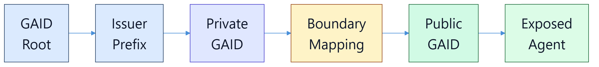
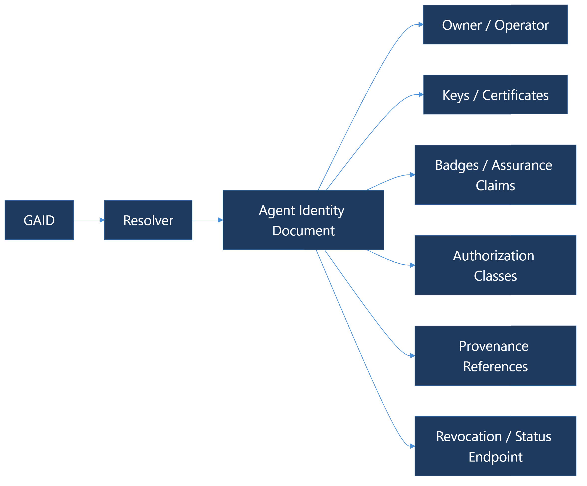
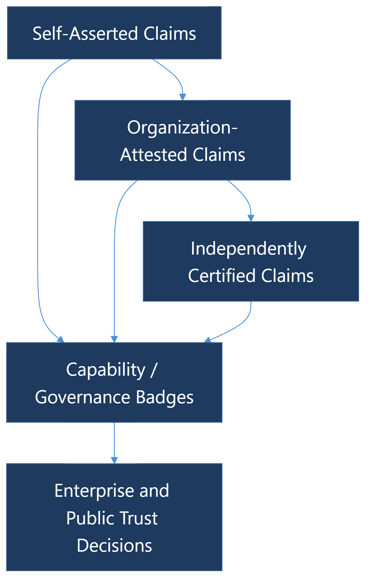
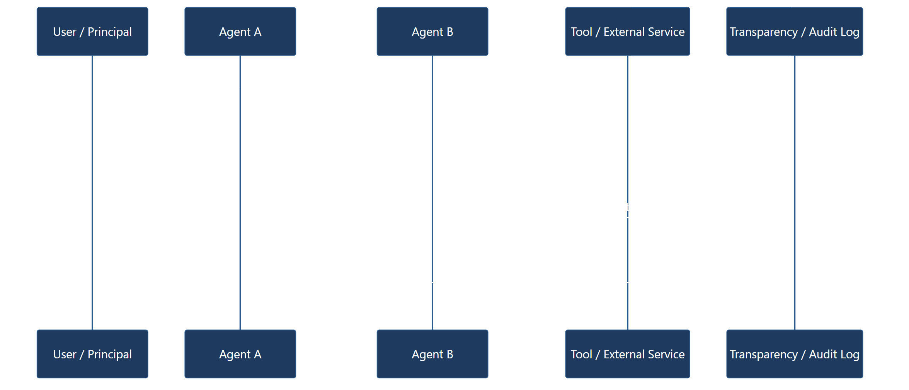

# Global AI Agent Identification and Governance Framework (GAID)

## Abstract

The Global AI Agent Identification and Governance Framework (`GAID`) is a normative identity, badging, and traceability standard for AI agents. It defines how an agent is named, how its governance and capability claims are expressed, how its public and private identities relate to each other, and how its actions are traced across system boundaries.

The problem `GAID` addresses is not naming alone. The problem is that AI agents are increasingly expected to act with durable identity, delegated authority, tool access, and external impact, while the market still relies on ad hoc metadata, undocumented prompts, trial-and-error capability discovery, and weak audit trails. In practice, organizations cannot reliably inventory, compare, govern, or trust agents at scale without a stronger identity and assurance model.

`GAID` is intentionally complementary to `TAK`. `GAID` defines who an agent is, what claims can be made about it, and how those claims are verified and traced. `TAK` defines how a trustworthy runtime `MUST` govern the agent in operation.

## 1. Scope

This standard specifies requirements for:

- stable agent identifiers in private and public namespaces
- issuer, registry, and accreditation expectations
- agent identity resolution
- the `Agent Identity Document` (`AIDoc`)
- badging and assurance claims
- portable authorization classes
- chain-of-custody and action receipt records
- public validation, revocation, and reassignment controls
- interoperability profiles for emerging agent protocols

This standard applies to:

- enterprise-private agents
- public-facing business-to-business and business-to-consumer agents
- government and regulated-environment agents
- single-agent and multi-agent systems
- embedded, routed, orchestrated, and externally callable agents

This standard does not define:

- runtime execution controls, memory governance, or human-in-the-loop enforcement
- internal model architecture
- organization-wide AI management systems

Those concerns are addressed respectively by `TAK` and broader governance frameworks such as `ISO/IEC 42001`.

## 2. Conformance

An implementation conforms to this standard only if it satisfies all requirements identified as `MUST` for its claimed conformance profile.

This standard defines three conformance profiles:

- `GAID-Private`
- `GAID-Federated`
- `GAID-Public`

An implementation:

- `MUST` declare the highest conformance profile it claims
- `MUST NOT` claim a higher profile if any mandatory control for that profile is absent
- `MUST` distinguish between self-asserted, organization-attested, and independently-certified claims
- `SHOULD` publish an implementation statement showing how each control is met
- `MAY` implement controls beyond those required by its claimed profile

## 3. Normative References

The following references are relevant to this standard and informed its design:

| Reference | Relevance |
|-----------|-----------|
| [ISO/IEC 42001:2023](https://www.iso.org/standard/81230.html) | Organization-level AI management systems |
| [NIST AI RMF 1.0](https://doi.org/10.6028/NIST.AI.100-1) | Risk management framing for AI systems |
| [NIST AI Agent Standards Initiative](https://www.nist.gov/caisi/ai-agent-standards-initiative) | Current U.S. public-sector standards activity for agent interoperability, identity, and security |
| [NCCoE concept paper: Accelerating the Adoption of Software and AI Agent Identity and Authorization](https://csrc.nist.gov/pubs/other/2026/02/05/accelerating-the-adoption-of-software-and-ai-agent/ipd) | Identity, authorization, auditing, and non-repudiation concerns for agents |
| [Model Context Protocol specification](https://modelcontextprotocol.io/specification/2024-11-05/basic/index) | Tool and context interoperability |
| [Anthropic: Introducing the Model Context Protocol](https://www.anthropic.com/news/model-context-protocol) | Background on MCP as an open protocol |
| [Agent2Agent Protocol specification](https://google-a2a.github.io/A2A/specification/) | Agent-to-agent interoperability and discovery |
| [Google: Announcing the Agent2Agent Protocol](https://developers.googleblog.com/es/a2a-a-new-era-of-agent-interoperability/) | Background on A2A as an open protocol |
| [W3C Verifiable Credentials Data Model v2.0](https://www.w3.org/TR/vc-data-model/) | Credential format and issuer-verifier trust patterns |
| [W3C Trace Context](https://www.w3.org/TR/trace-context/) | Cross-system trace propagation |
| [RFC 9421 HTTP Message Signatures](https://www.rfc-editor.org/info/rfc9421) | Message-level integrity and signing |
| [SLSA Provenance v1.1](https://slsa.dev/spec/v1.1/provenance) | Provenance and verifiable supply-chain evidence |
| [Package URL / ECMA-427](https://www.packageurl.org/) | Software identification patterns relevant to normalized agent component references |
| [OWASP GenAI Security Project](https://genai.owasp.org/) | Security considerations for LLM and agentic systems |

## 4. Terms and Definitions

For the purposes of this standard:

| Term | Definition |
|------|------------|
| `agent` | A software system that can reason, decide, and perform actions with or without tool use on behalf of a principal or workflow |
| `GAID` | A stable identifier assigned to an AI agent subject under this standard |
| `issuer` | The authority that allocates, signs, or attests a `GAID` and its related identity assertions |
| `registry` | The namespace management layer that delegates or recognizes issuer prefixes |
| `AIDoc` | The signed `Agent Identity Document` describing an agent's identity, operating surface, governance claims, and status |
| `badge` | A structured claim about an agent's capability, governance posture, assurance status, or operating constraint |
| `assurance level` | The strength of evidence behind a claim, such as self-asserted, organization-attested, or independently-certified |
| `authorization class` | A portable declaration of the kinds of actions or data access an agent is designed to request or perform |
| `public namespace` | The globally resolvable identifier space intended for cross-organizational or public consumption |
| `private namespace` | An internally governed identifier space intended for local or intra-organizational use |
| `boundary mapping` | The governed relationship between an internal private identifier and an externally exposed public identifier |
| `receipt` | A signed record describing a specific agent action, delegation, or decision event |
| `chain-of-custody` | The traceable sequence linking a principal, agent, delegate, action, evidence, and resulting state transition |
| `transparency log` | An append-oriented record of public issuance, status change, revocation, or other identity-relevant events |

## 5. Design Principles

An implementation of `GAID`:

- `MUST` treat agent identity as a governance artifact, not merely a UI label
- `MUST` separate stable identity from mutable runtime configuration
- `MUST` preserve a durable mapping from agent identity to issuing authority
- `MUST` distinguish declared capability from verified capability
- `MUST` distinguish local authorization from portable authorization class
- `MUST` preserve chain-of-custody for consequential actions
- `SHOULD` support both private and public operation without forcing them to share a single namespace
- `SHOULD` expose enough structured metadata that relying parties do not need trial-and-error to determine whether an agent is fit for purpose
- `MAY` support additional badge vocabularies, sectors, or regulatory overlays so long as the core identity and receipt semantics are preserved

## 6. Namespace and Issuer Model

### 6.1 Core Requirement

Every materially distinct AI agent subject `MUST` have a stable identifier.

The identifier `MUST` be:

- unique within its issuing scope
- durable across routine configuration and model-version changes
- resolvable to a current identity document
- non-ambiguous about whether it is private or public

### 6.2 GAID Syntax

This standard defines the following canonical identifier form:

`gaid:<scope>:<issuer-prefix>:<agent-local-id>`

Where:

- `<scope>` `MUST` be either `priv` or `pub`
- `<issuer-prefix>` `MUST` identify the issuing namespace authority
- `<agent-local-id>` `MUST` be unique within that issuer prefix

Examples:

- `gaid:priv:contoso.internal:hr-onboarding-coordinator`
- `gaid:pub:example.ai:claims-review-agent`

An implementation `MAY` maintain additional internal identifiers, but the canonical `GAID` `MUST` remain the primary interoperable identifier.



_Figure 1. `GAID` separates private and public namespaces while preserving governed mapping between them._

### 6.3 Public Namespace

A `GAID-Public` implementation `MUST` operate under a namespace that is globally recognizable and administratively governed.

For public identifiers:

- the issuer prefix `MUST` be controlled by the issuing authority or its delegate
- the issuing authority `MUST` publish its validation material and status process
- the identifier `MUST` resolve to a current `AIDoc`
- the issuer `MUST` support revocation and status inquiry

An issuer prefix `SHOULD` be derived from or bound to a verifiable public namespace such as:

- an internet domain under the issuer's control
- a recognized government or industry registration namespace
- a delegated sub-namespace allocated by an accredited root or federation

### 6.4 Private Namespace

A `GAID-Private` implementation `MAY` issue internal identifiers without global registration.

For private identifiers:

- the issuer `MUST` ensure uniqueness within its boundary
- the issuer `MUST` maintain a local resolution mechanism
- the issuer `SHOULD` maintain an internal status and revocation record
- the identifier `MUST NOT` be represented as publicly accredited unless it has passed through a recognized public issuance process

### 6.5 Boundary Mapping

An agent exposed outside its original administrative boundary `MUST NOT` rely solely on a private identifier.

Where a private agent is exposed publicly:

- a public `GAID` `MUST` be assigned
- the relationship between the private and public identifiers `MUST` be recorded
- the mapping `MUST` be visible to authorized auditors
- the mapping `SHOULD NOT` disclose internal-only identifiers to general public consumers unless policy requires it

### 6.6 Delegation, Accreditation, and Root Governance

Public `GAID` operation depends on recognized issuer governance.

Therefore:

- a `GAID-Public` ecosystem `MUST` define one or more root registries or a recognized federation of roots
- public issuers `MUST` be accredited directly or indirectly under that governance model
- accredited issuers `MUST` publish allocation, status, and revocation policies
- accredited issuers `MUST` be auditable
- accredited issuers `MUST` be able to prove control of the prefixes they allocate

The point is not to centralize all issuance in one institution. The point is to ensure that public trust is anchored in recognized governance rather than private assertion alone.

### 6.7 Revocation, Suspension, and Reassignment

An issuer `MUST` support status values that distinguish at least:

- active
- suspended
- revoked
- retired
- superseded

A public `GAID`:

- `MUST NOT` be silently reassigned to a materially different agent subject
- `SHOULD` remain tombstoned after revocation or retirement
- `MUST` preserve historical receipts and evidence even when the current status is no longer active

Private `GAID` reassignment `SHOULD NOT` occur. If it does occur under local policy, the reassignment `MUST` be explicitly recorded, and prior evidence `MUST` remain distinguishable from the new subject.

## 7. Agent Identity Document (AIDoc)

### 7.1 Core Requirement

Every conforming `GAID` implementation `MUST` provide an `AIDoc` for each issued agent identity.

The `AIDoc`:

- `MUST` be structured and machine-readable
- `MUST` be signed or otherwise cryptographically protected
- `MUST` represent current status
- `MUST` identify the issuer
- `MUST` disclose the operating surface relevant to relying-party trust

The `AIDoc` `MAY` be represented in JSON, JSON-LD, or another interoperable encoding, provided the semantics in this standard are preserved.



_Figure 2. Public trust depends on being able to resolve an agent identifier into current, signed identity metadata._

### 7.2 Minimum AIDoc Fields

At minimum, an `AIDoc` `MUST` contain the following fields:

| Field | Requirement | Purpose |
|-------|-------------|---------|
| `gaid` | `MUST` | Canonical agent identifier |
| `subject_name` | `MUST` | Human-readable agent name |
| `issuer` | `MUST` | Issuer identity and delegation chain |
| `status` | `MUST` | Current lifecycle status |
| `subject_type` | `MUST` | Coordinator, specialist, assistant, service agent, or equivalent |
| `owner_organization` | `MUST` | Organizational owner or controlling entity |
| `service_endpoints` | `SHOULD` | Public or internal endpoints through which the agent is reached |
| `versioning` | `MUST` | Agent software or deployment version references |
| `model_binding` | `MUST` | Model family, provider, and version where known |
| `runtime_profile` | `SHOULD` | Runtime type, region, or managed environment references |
| `tool_surface` | `MUST` | Declared tools, connectors, or protocol surfaces |
| `skill_surface` | `SHOULD` | Declared skills, capabilities, or specialized repertoires |
| `prompt_surface` | `SHOULD` | Prompt or instruction classes, including immutable or hidden instruction disclosures by class or hash |
| `memory_profile` | `SHOULD` | Durable memory characteristics and retention posture |
| `hitl_profile` | `SHOULD` | Default oversight or approval posture |
| `data_sensitivity_profile` | `SHOULD` | Declared data handling and sensitivity scope |
| `authorization_classes` | `SHOULD` | Portable action and access classes |
| `badges` | `SHOULD` | Structured assurance and capability claims |
| `verification_material` | `MUST` for `GAID-Public` | Public keys, certificates, or equivalent verifier references |
| `status_endpoint` | `SHOULD` | Current status and revocation endpoint |
| `transparency_log` | `SHOULD` for `GAID-Federated` and above | Public or internal transparency reference |
| `evidence_refs` | `SHOULD` | Model cards, evaluations, provenance, policies, or test reports |

### 7.3 Disclosure Expectations

The `AIDoc` `MUST NOT` fabricate precision that the issuer does not have.

If an issuer does not know a field such as:

- training-data disclosure
- benchmark evidence
- effective context limit
- provider-side memory behavior
- model bias assessment

then the field `MUST` be marked as:

- `undisclosed`
- `not assessed`
- `not independently verified`
- `not applicable`

The point is not to force perfect disclosure. The point is to make missing evidence explicit.

### 7.4 Operating Surface Declarations

The `AIDoc` `SHOULD` declare the surfaces that materially affect trust, including:

- exposed tools and connector families
- external protocols such as `MCP`, `A2A`, HTTP APIs, queues, or event streams
- prompt or instruction classes
- skills or callable specialties
- data stores or retrieval classes
- memory and context persistence posture

An implementation `MUST NOT` claim that an agent is narrowly scoped if its declared operating surface is materially broader.

## 8. Badge and Assurance Model

### 8.1 Core Principle

Badging is an integral part of agent identity under this standard. A `GAID` without a structured claim model is insufficient for scalable trust.

Badges exist to answer questions that organizations and consumers repeatedly face in practice:

- What can this agent do?
- What is it allowed to touch?
- What evidence supports that claim?
- Has anyone independent assessed it?
- Is it suitable for the purpose for which it is being offered?

### 8.2 Badge Categories

A conforming implementation `SHOULD` support badge categories at least sufficient to express:

| Badge Category | Examples |
|----------------|----------|
| `capability` | code generation, research, CRM update, scheduling, deployment coordination |
| `governance` | human approval required, audit logging enabled, immutable instructions controlled |
| `data-sensitivity` | public, internal, confidential, regulated, export-controlled |
| `action-class` | read, recommend, create, update, approve, execute, delegate |
| `interoperability` | `MCP`, `A2A`, HTTP API, queue-based worker, UI protocol compatibility |
| `fit-for-purpose` | customer support, policy drafting, architecture review, clinical triage support |
| `safety-and-risk` | prompt-injection hardened, sandboxed execution, external content disclosure required |
| `evaluation` | benchmark coverage, red-team coverage, failure mode tests, calibration tests |
| `provenance` | model card reference, software provenance reference, supply-chain evidence |

### 8.3 Badge Payload Requirements

Each badge `MUST` identify:

- badge type
- claim statement
- scope
- issuer
- assurance level
- issuance date
- expiry or review date where applicable
- evidence reference or explicit statement that evidence is absent

### 8.4 Assurance Levels

At minimum, the following assurance levels `MUST` be supported:

| Level | Meaning |
|-------|---------|
| `self-asserted` | Claim made by the agent operator or issuer without independent verification |
| `org-attested` | Claim reviewed and attested by the operating organization |
| `independently-certified` | Claim assessed by an independent assessor or accredited body |

An issuer `MUST NOT` present a self-asserted claim as if it were independently-certified.

### 8.5 Benchmark and Disclosure Claims

If a badge claims a measured capability or operating limit, the badge `SHOULD` identify the basis for that claim, such as:

- benchmark or evaluation suite
- test date
- model version
- tool set under test
- token or context assumptions
- failure rate, calibration threshold, or success threshold

Examples include:

- maximum recommended task horizon
- observed tool-use success rate
- effective context-window utilization under declared conditions
- hallucination or fabrication rate under defined tests
- known limits or exclusions

### 8.6 Badge Freshness

Capability, safety, and fit-for-purpose badges `SHOULD` expire or be reviewed on a defined cadence.

An issuer `MUST NOT` continue to advertise stale badges as current once the underlying model, runtime, or tool surface has materially changed.



_Figure 3. `GAID` separates identity from the strength of evidence behind claims about that identity._

## 9. Authorization Classes

### 9.1 Purpose

Authorization classes are portable declarations of intended action scope. They are not a substitute for local runtime authorization.

This distinction matters. A relying party needs to know what class of actions an agent is designed to request or perform, while a runtime still needs its own live policy model such as `RBAC`, `ABAC`, or `TAK` execution gating.

### 9.2 Minimum Class Vocabulary

A conforming implementation `SHOULD` support at least the following portable classes:

| Class | Meaning |
|-------|---------|
| `observe` | read or inspect data without mutation |
| `analyze` | derive recommendations, rankings, or assessments |
| `create` | create new records or artifacts |
| `update` | modify existing records or configurations |
| `approve` | approve or reject governed actions |
| `execute` | perform side-effecting operations |
| `delegate` | assign work to another agent or system |
| `administer` | manage identity, policy, or platform configuration |
| `cross-boundary` | exchange data or invoke actions across organizational boundaries |

### 9.3 Mapping Rule

An implementation:

- `MUST` map portable authorization classes to local runtime policy
- `MUST NOT` treat a declared authorization class as proof of present authorization
- `SHOULD` include the active authorization class reference in receipts for consequential actions

## 10. Chain-of-Custody and Agent Action Receipts

### 10.1 Core Requirement

Consequential agent actions `MUST` produce a receipt or an equivalent evidence record.

Consequential actions include:

- state-changing tool calls
- approvals or rejections
- cross-agent delegation
- cross-boundary requests
- publication, deployment, or deletion events
- actions involving sensitive data

### 10.2 Minimum Receipt Fields

At minimum, a receipt `MUST` contain:

| Field | Purpose |
|-------|---------|
| `receipt_id` | Unique receipt identifier |
| `gaid` | Acting agent identifier |
| `issuer` | Issuing or signing authority |
| `principal_ref` | Human or system authority reference, with privacy-preserving pseudonymization where needed |
| `timestamp` | Action timestamp |
| `action_type` | Action or tool classification |
| `authorization_class` | Portable action class reference |
| `execution_mode` | Proposal, immediate, review-after, or equivalent |
| `target_ref` | Target system, record, or resource reference |
| `request_hash` | Hash of governing request or parameters |
| `result_hash` | Hash or digest of the resulting artifact, output, or change set where applicable |
| `trace_context` | Trace identifiers sufficient for distributed correlation |
| `parent_receipt` | Parent receipt where the action is delegated or derived |
| `evidence_refs` | Supporting evidence or artifact references |
| `signature` | Signature or equivalent integrity mechanism |

### 10.3 Trace Context and Delegation

For multi-step or multi-agent flows:

- the initiating trace context `SHOULD` be preserved end to end
- delegated actions `MUST` retain a parent-child receipt relationship
- the delegated agent's `GAID` `MUST` be recorded
- the delegating agent's `GAID` `MUST` remain visible in the chain

### 10.4 Integrity and Non-Repudiation

For `GAID-Federated` and above:

- receipts `MUST` be tamper-evident
- signatures `SHOULD` use `RFC 9421`, `JOSE`, `COSE`, or an equivalent standard mechanism
- verification material `MUST` be discoverable through the `AIDoc` or issuer metadata

### 10.5 Privacy and Minimization

Receipts `MUST` minimize unnecessary disclosure.

Accordingly:

- raw prompt text `SHOULD NOT` be included by default in public receipts
- sensitive user content `SHOULD` be referenced by digest, pointer, or protected evidence store rather than copied directly
- internal-only context `MAY` be redacted in public-facing receipts while remaining available to authorized auditors



_Figure 4. `GAID` receipts preserve the chain from principal to agent to delegate to resulting evidence._

## 11. Protocol Profiles and Interoperability

### 11.1 General Rule

`GAID` does not replace agent protocols. It provides the identity and governance layer that those protocols can carry.

An implementation `SHOULD` declare how `GAID` claims are surfaced across the protocols it uses.

### 11.2 MCP Profile

For `MCP` environments:

- the agent `SHOULD` expose its `GAID` and relevant `AIDoc` reference in connection or server metadata where possible
- declared tools in the `AIDoc` `SHOULD` align with the actual exposed tool surface
- remote tool invocation receipts `SHOULD` preserve acting agent identity and trace context

### 11.3 A2A Profile

For `A2A` environments:

- the `Agent Card` `SHOULD` carry or reference the agent's `GAID`
- the published skills and capabilities `SHOULD` align with `AIDoc` claims
- task and artifact events `SHOULD` preserve chain-of-custody identifiers
- public agents `SHOULD` bind `Agent Card` metadata to issuer-controlled verification material

### 11.4 HTTP and API Profile

For direct HTTP APIs:

- `GAID` `SHOULD` be carried in request or message metadata
- signatures `SHOULD` bind the identity claim to the request
- trace context `SHOULD` follow `W3C Trace Context`

### 11.5 Async and Queue Profile

For queue-based or event-driven systems:

- the acting `GAID` `MUST` be preserved in message metadata
- the receipt relationship `MUST` survive retries and delayed processing
- replay or duplicate-delivery handling `SHOULD` be explicit

### 11.6 UI and Human Interaction Profile

Where agent interactions are surfaced to humans through approvals, task cards, or dynamic interfaces:

- the visible agent identity `SHOULD` map to the canonical `GAID`
- approval prompts `SHOULD` disclose enough badge and assurance information that the human can make an informed decision
- any generated UI `SHOULD NOT` obscure who the acting agent is, what class of action is proposed, or what evidence exists

## 12. Security and Privacy Considerations

An implementation conforming to this standard:

- `MUST` defend against agent identity spoofing
- `MUST` support key rotation and status updates
- `MUST` distinguish hidden-instruction disclosure from hidden-instruction publication
- `MUST` treat prompt injection, tool injection, and connector compromise as identity-relevant risks, not merely runtime bugs
- `SHOULD` bind public agent identity to organizational certificates or equivalent verification material
- `SHOULD` use transparency logging for public issuance and revocation events
- `SHOULD` minimize personally identifiable information in public identity documents and receipts
- `MAY` support selective disclosure for regulated or classified environments

An issuer `MUST NOT` imply that identity proof alone guarantees behavioral safety. Identity enables accountability. It does not replace runtime controls.

## 13. Conformance Profiles

### 13.1 `GAID-Private`

A `GAID-Private` implementation:

- `MUST` issue stable private identifiers
- `MUST` maintain local `AIDoc` resolution
- `MUST` record status
- `SHOULD` issue receipts for consequential actions
- `MAY` omit public accreditation and external certificate validation

### 13.2 `GAID-Federated`

A `GAID-Federated` implementation:

- `MUST` meet all `GAID-Private` requirements
- `MUST` support delegated issuer governance
- `MUST` support signed `AIDoc` publication
- `MUST` support receipt integrity and status checking
- `SHOULD` maintain a transparency log
- `SHOULD` support organization-attested and independently-certified badges

### 13.3 `GAID-Public`

A `GAID-Public` implementation:

- `MUST` meet all `GAID-Federated` requirements
- `MUST` use an accredited issuer model or recognized federated equivalent
- `MUST` expose public verification material
- `MUST` support public revocation and status checks
- `MUST` provide public-facing badge and assurance disclosures appropriate to relying-party trust
- `SHOULD` support certificate-backed identity binding for public endpoints and organizational ownership

## 14. Informative Annexes

### Annex A: Relationship to TAK

`GAID` and `TAK` solve different but related problems:

- `GAID` identifies the agent, its claims, and its evidence
- `TAK` governs the runtime in which that agent acts

An implementation with `TAK` but no `GAID` may be locally well governed but externally opaque.

An implementation with `GAID` but no `TAK` may be well labeled but behaviorally under-governed.

The standards are therefore complementary.

### Annex B: Suggested AIDoc Skeleton

```json
{
  "gaid": "gaid:pub:example.ai:claims-review-agent",
  "subject_name": "Claims Review Agent",
  "issuer": {
    "name": "Example AI Public Issuer",
    "prefix": "example.ai"
  },
  "status": "active",
  "subject_type": "specialist",
  "owner_organization": "Example Insurance Group",
  "model_binding": {
    "provider": "example-provider",
    "model_family": "frontier-assistant",
    "model_version": "2026-04"
  },
  "tool_surface": [
    "claims.lookup",
    "policy.lookup",
    "note.create"
  ],
  "authorization_classes": [
    "observe",
    "analyze",
    "create"
  ],
  "badges": [
    {
      "category": "fit-for-purpose",
      "claim": "claims-triage-support",
      "assurance_level": "org-attested"
    }
  ],
  "verification_material": {
    "certificate_ref": "https://issuer.example.ai/certs/current"
  },
  "status_endpoint": "https://issuer.example.ai/status/claims-review-agent"
}
```

### Annex C: Governance Implication

The strongest lesson from adjacent systems such as `DNS`, `ISBN`, `PKI`, and software provenance is that syntax alone is not enough.

Identity works at scale only when:

- the namespace is governed
- issuers are recognized
- relying parties can validate claims
- status changes are visible
- historical evidence is preserved

That is the governance posture `GAID` is intended to establish for AI agents.
