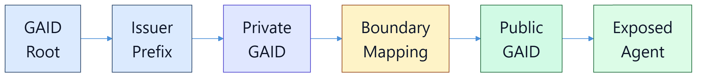
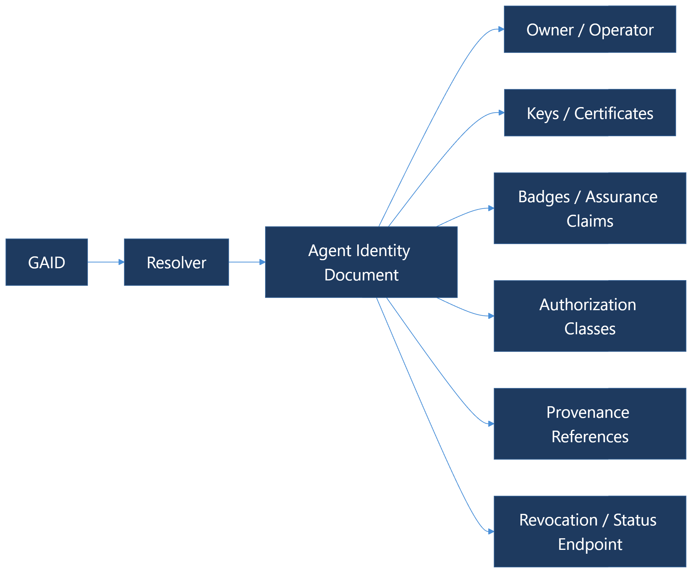
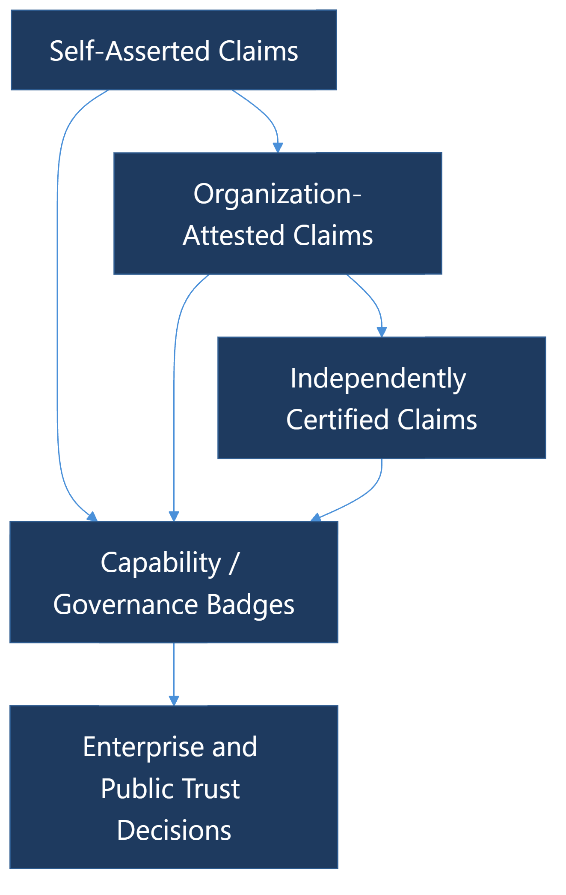
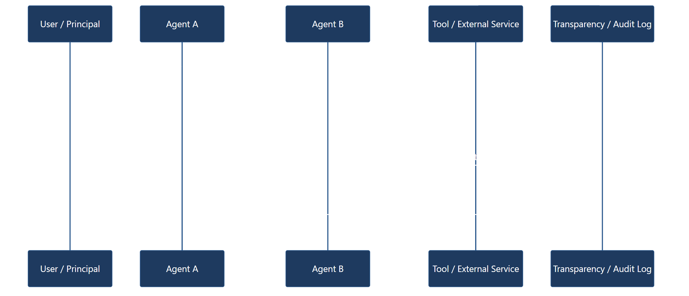

# Global AI Agent Identification and Governance Framework (GAID)

## Abstract

The Global AI Agent Identification and Governance Framework (`GAID`) is a normative identity, badging, and traceability standard for AI agents. It defines how an agent is named, how its governance and capability claims are expressed, how its public and private identities relate to each other, and how its actions are traced across system boundaries.

The problem `GAID` addresses is not naming alone. The problem is that AI agents are increasingly expected to act with durable identity, delegated authority, tool access, and external impact, while the market still relies on ad hoc metadata, undocumented prompts, trial-and-error capability discovery, and weak audit trails. In practice, organizations cannot reliably inventory, compare, govern, or trust agents at scale without a stronger identity and assurance model.

`GAID` is intentionally complementary to `TAK` and its `TAK-JSI` qualification profile. `GAID` defines who an agent is, what claims it carries, and how those claims are verified and traced. `TAK-JSI` defines whether a versioned operating profile is qualified for a particular job and context. `TAK` defines how a trustworthy runtime `MUST` govern the identified and qualified agent in operation.

## 1. Scope

This standard specifies requirements for:

- stable agent identifiers in private and public namespaces
- issuer, registry, and accreditation expectations
- agent identity resolution
- the `Agent Identity Document` (`AIDoc`)
- badging and assurance claims
- versioned job-qualification claims and their status
- portable authorization classes
- chain-of-custody and action receipt records
- public validation, revocation, and reassignment controls
- interoperability profiles for emerging agent protocols

This standard applies to:

- enterprise-private agents
- public-facing business-to-business and business-to-consumer agents
- government and regulated-environment agents
- single-agent and multi-agent systems
- embedded, routed, orchestrated, and externally callable agents

This standard does not define:

- runtime execution controls, memory governance, or human-in-the-loop enforcement
- job definitions, qualification schemes, or qualification assessment procedures
- internal model architecture
- organization-wide AI management systems

Those concerns are addressed respectively by `TAK`, the [Job-Specific Intelligence (`TAK-JSI`) profile](job-specific-intelligence.md), and broader governance frameworks such as `ISO/IEC 42001`.

## 2. Conformance

An implementation conforms to this standard only if it satisfies all requirements identified as `MUST` for its claimed conformance profile.

This standard defines three conformance profiles:

- `GAID-Private`
- `GAID-Federated`
- `GAID-Public`

An implementation:

- `MUST` declare the highest conformance profile it claims
- `MUST NOT` claim a higher profile if any mandatory control for that profile is absent
- `MUST` distinguish between self-asserted, organization-attested, independently-assessed, and accredited-certified claims
- `SHOULD` publish an implementation statement showing how each control is met
- `MAY` implement controls beyond those required by its claimed profile

### 2.1 Standard Versioning, Lifecycle, and Conformance Assertions

This standard `SHOULD` be versioned using a semantic-style scheme:

- major versions for normative incompatibilities
- minor versions for additive normative capabilities or profiles
- patch versions for clarifications, errata, or non-substantive corrections

Implementations claiming conformance `SHOULD` declare:

- the supported `GAID` version
- the claimed conformance profile
- any declared public-trust profile such as private-only, federated, certificate-backed, or decentralized-portability

Each normative `MUST` statement in this standard `SHOULD` map to one or more explicit conformance assertions in a companion test suite or implementation statement. This document does not require one central verifier implementation, but it does require that conformance claims be testable rather than rhetorical.

A suggested companion assertion rubric for this revision is published in `gaid-conformance-tests.md`.

The intended lifecycle of `GAID` is open standards progression through multistakeholder implementation and liaison rather than indefinite treatment as an internal white paper.

The preferred near-term disposition is publication as an open industry specification with explicit liaison to `OpenID AIIM`, the `W3C` Agent Identity Registry Protocol Community Group, `CoSAI`, and relevant `IETF` OAuth / `GNAP` work, with later venue-specific profiles or registrations preserving the same identity and evidence semantics.

## 3. Normative References

The following references are relevant to this standard and informed its design:

| Reference | Relevance |
|-----------|-----------|
| [ISO/IEC 42001:2023](https://www.iso.org/standard/42001) | Organization-level AI management systems |
| [ISO/IEC 17024:2026](https://www.iso.org/standard/17024) | Competence-scheme, assessment, surveillance, and reassessment prior art profiled by `TAK-JSI` |
| [ISO/IEC 25059:2023](https://www.iso.org/standard/80655.html) | AI-system quality characteristics for structured capability and qualification evidence |
| [ISO/IEC 5259-1:2024](https://www.iso.org/standard/81088.html) | AI data-quality concepts and terminology |
| [ISO/IEC 5259-2:2024](https://www.iso.org/standard/81860.html) | AI data-quality measures relevant to evidence and qualification scope |
| [ISO/IEC 5259-5:2025](https://www.iso.org/standard/84150.html) | Data-quality governance and stewardship relevant to qualification claims |
| [ISO/IEC 12792:2025](https://www.iso.org/standard/84111.html) | Transparency taxonomy for AI systems relevant to `AIDoc` and badge disclosure posture |
| [ISO/IEC DIS 42102](https://www.iso.org/standard/86898.html) | Framework for characterizing AI system methods and capabilities |
| [NIST AI RMF 1.0](https://doi.org/10.6028/NIST.AI.100-1) | Risk management framing for AI systems |
| [NIST AI Agent Standards Initiative](https://www.nist.gov/artificial-intelligence/ai-agent-standards-initiative) | Current U.S. public-sector standards activity for agent interoperability, identity, security, and evaluation |
| [NCCoE concept paper: Accelerating the Adoption of Software and AI Agent Identity and Authorization](https://csrc.nist.gov/pubs/other/2026/02/05/accelerating-the-adoption-of-software-and-ai-agent/ipd) | Identity, authorization, auditing, and non-repudiation concerns for agents |
| [OpenID Foundation AIIM Community Group](https://openid.net/cg/artificial-intelligence-identity-management-community-group/) | Open identity-community venue focused on AI agent identity, modularization, and liaison work |
| [OpenID Foundation: Identity Management for Agentic AI](https://openid.net/wp-content/uploads/2025/10/Identity-Management-for-Agentic-AI.pdf) | Agent identity, authorization, and interoperability white paper from the AIIM community |
| [OIDF response to NIST on AI agent security](https://openid.net/wp-content/uploads/2026/03/Attachment1_NIST-2025-0035-0001.pdf) | Threat-model and identity-layer response to current U.S. agent security policy work |
| [W3C Agent Identity Registry Protocol Community Group](https://www.w3.org/community/agent-identity/) | Active W3C venue for verifiable AI agent identity infrastructure and liaison positioning |
| [CoSAI: Agentic Identity and Access Management](https://www.coalitionforsecureai.org/wp-content/uploads/2026/04/agentic-identity-and-access-control.pdf) | Practical enterprise model for representing and governing AI agent identities |
| [Model Context Protocol specification](https://modelcontextprotocol.io/specification/2025-11-25/basic) | Tool and context interoperability |
| [Model Context Protocol authorization specification](https://modelcontextprotocol.io/specification/2025-11-25/basic/authorization) | OAuth-based authorization profile for protected MCP deployments |
| [Anthropic: Introducing the Model Context Protocol](https://www.anthropic.com/news/model-context-protocol) | Background on MCP as an open protocol |
| [Agent2Agent Protocol specification](https://google-a2a.github.io/A2A/specification/) | Agent-to-agent interoperability and discovery |
| [Google: Announcing the Agent2Agent Protocol](https://developers.googleblog.com/en/a2a-a-new-era-of-agent-interoperability/) | Background on A2A as an open protocol |
| [Linux Foundation: Agentic AI Foundation announcement](https://www.linuxfoundation.org/press/linux-foundation-announces-the-formation-of-the-agentic-ai-foundation?hs_amp=true) | Neutral governance venue for MCP and `AGENTS.md` stewardship |
| [RFC 4512 Lightweight Directory Access Protocol (LDAP): Directory Information Models](https://www.rfc-editor.org/rfc/rfc4512.html) | Enterprise directory modeling relevant to internal agent identity projection |
| [RFC 7643 System for Cross-domain Identity Management: Core Schema](https://www.rfc-editor.org/rfc/rfc7643) | Enterprise lifecycle and identity-provisioning schema baseline |
| [RFC 7644 System for Cross-domain Identity Management: Protocol](https://www.rfc-editor.org/rfc/rfc7644) | Enterprise lifecycle and provisioning protocol baseline |
| [RFC 9728 OAuth 2.0 Protected Resource Metadata](https://www.rfc-editor.org/rfc/rfc9728) | Protected-resource discovery and metadata model relevant to verifier and server trust surfaces |
| [RFC 9635 Grant Negotiation and Authorization Protocol (GNAP)](https://www.rfc-editor.org/rfc/rfc9635) | Negotiated delegated authorization model for dynamic agent rights |
| [RFC 9767 GNAP Resource Server Connections](https://www.rfc-editor.org/rfc/rfc9767) | Resource-server-facing GNAP model for binding access rights to protected resources |
| [RFC 9449 OAuth 2.0 Demonstrating Proof of Possession (DPoP)](https://www.rfc-editor.org/rfc/rfc9449) | Sender-constrained token and proof binding for high-assurance agent requests |
| [W3C Verifiable Credentials Data Model v2.0](https://www.w3.org/TR/vc-data-model/) | Credential format and issuer-verifier trust patterns |
| [1EdTech Open Badges 3.0](https://standards.1edtech.org/open-badges/specifications/standards/v3p0/cert) | Claim, evidence, result, issuer, status, and expiry patterns for portable qualification records |
| [Decentralized Identifiers (DIDs) v1.0](https://www.w3.org/TR/did-core/) | Optional decentralized public identity profile for portable verification |
| [W3C Trace Context](https://www.w3.org/TR/trace-context/) | Cross-system trace propagation |
| [RFC 9421 HTTP Message Signatures](https://www.rfc-editor.org/info/rfc9421) | Message-level integrity and signing |
| [RFC 9162 Certificate Transparency Version 2.0](https://www.rfc-editor.org/rfc/rfc9162) | Public transparency log pattern for trust, status, and auditability (Experimental) |
| [SCITT architecture draft](https://datatracker.ietf.org/doc/draft-ietf-scitt-architecture/22/) | Transparency and verifiable publication pattern for signed statements |
| [SLSA Provenance v1.2](https://slsa.dev/spec/v1.2/provenance) | Provenance and verifiable supply-chain evidence |
| [in-toto Attestation Framework Specification](https://github.com/in-toto/attestation/blob/main/spec/README.md) | Practical statement and envelope model for signed evidence and receipt payloads |
| [Sigstore Documentation](https://docs.sigstore.dev/) | Operational transparency and verification substrate for signed identity and receipt artifacts |
| [C2PA Content Credentials Technical Specification v2.2](https://spec.c2pa.org/specifications/specifications/2.2/specs/C2PA_Specification.html) | Cryptographically bound provenance and content-credential pattern for agent-produced artifacts |
| [C2PA Implementation Guidance](https://spec.c2pa.org/specifications/specifications/2.4/guidance/Guidance.html) | Guidance on AI/ML content provenance and `digitalSourceType` disclosure |
| [AP2 Agent Payments Protocol core concepts](https://ap2-protocol.org/topics/core-concepts/) | Adjacent mandate and verifiable-credential pattern for consequential agent commerce and payment authorization |
| [Package URL / ECMA-427](https://www.packageurl.org/) | Software identification patterns relevant to normalized agent component references |
| [OWASP Top 10 for Agentic Applications](https://genai.owasp.org/2025/12/09/owasp-top-10-for-agentic-applications-the-benchmark-for-agentic-security-in-the-age-of-autonomous-ai/) | Concrete agentic risk taxonomy and mitigation guidance |
| [CSA MAESTRO](https://labs.cloudsecurityalliance.org/maestro/) | Agentic AI threat-modeling framework |
| [MITRE ATLAS](https://atlas.mitre.org/) | Adversarial tactics and techniques knowledge base for AI systems |
| [EU General-Purpose AI Code of Practice](https://digital-strategy.ec.europa.eu/en/policies/contents-code-gpai) | Current EU transparency, safety, security, and documentation expectations for GPAI providers |
| [Regulation (EU) 2016/679 (GDPR)](https://eur-lex.europa.eu/legal-content/EN/ALL/?uri=celex%3A32016R0679) | Privacy-law baseline for personal data minimization, accountability, and records implications of receipts and identity documents |
| [IMDA Model AI Governance Framework for Agentic AI](https://www.imda.gov.sg/resources/press-releases-factsheets-and-speeches/press-releases/2026/new-model-ai-governance-framework-for-agentic-ai) | National governance framework for agentic AI deployment |
| [ISO/IEC 27701:2025](https://www.iso.org/standard/85819.html) | Privacy information management system reference for `AIDoc` and receipt minimization obligations |
| [Job-Specific Intelligence (`TAK-JSI`)](job-specific-intelligence.md) | Job-qualification profile whose portable claims are carried by `GAID` |

## 4. Terms and Definitions

For the purposes of this standard:

| Term | Definition |
|------|------------|
| `agent` | A software system that can reason, decide, and perform actions with or without tool use on behalf of a principal or workflow |
| `GAID` | A stable identifier assigned to an AI agent subject under this standard |
| `issuer` | The authority that allocates, signs, or attests a `GAID` and its related identity assertions |
| `registry` | The namespace management layer that delegates or recognizes issuer prefixes |
| `AIDoc` | The signed `Agent Identity Document` describing an agent's identity, operating surface, governance claims, and status |
| `badge` | A structured claim about an agent's capability, governance posture, assurance status, or operating constraint |
| `job-qualification claim` | A versioned claim that a specific operating profile meets a declared `TAK-JSI` scheme within stated activity, data, risk, and deployment constraints |
| `assurance level` | The strength of evidence behind a claim, such as self-asserted, organization-attested, independently-assessed, or accredited-certified |
| `authorization class` | A portable declaration of the kinds of actions or data access an agent is designed to request or perform |
| `public namespace` | The globally resolvable identifier space intended for cross-organizational or public consumption |
| `private namespace` | An internally governed identifier space intended for local or intra-organizational use |
| `boundary mapping` | The governed relationship between an internal private identifier and an externally exposed public identifier |
| `receipt` | A signed record describing a specific agent action, delegation, or decision event |
| `chain-of-custody` | The traceable sequence linking a principal, agent, delegate, action, evidence, and resulting state transition |
| `transparency log` | An append-oriented record of public issuance, status change, revocation, or other identity-relevant events |

## 5. Design Principles

An implementation of `GAID`:

- `MUST` treat agent identity as a governance artifact, not merely a UI label
- `MUST` separate stable identity from mutable runtime configuration
- `MUST` distinguish enduring subject identity from versioned operating state
- `MUST` preserve a durable mapping from agent identity to issuing authority
- `MUST` distinguish declared capability from verified capability
- `MUST` distinguish capability, job qualification, authorization, and runtime autonomy
- `MUST NOT` treat a qualification badge as live authorization
- `MUST` distinguish local authorization from portable authorization class
- `MUST` preserve chain-of-custody for consequential actions
- `SHOULD` support both private and public operation without forcing them to share a single namespace
- `SHOULD` expose enough structured metadata that relying parties do not need trial-and-error to determine whether an agent is fit for purpose
- `MAY` support additional badge vocabularies, sectors, or regulatory overlays so long as the core identity and receipt semantics are preserved

## 6. Namespace and Issuer Model

### 6.1 Core Requirement

Every materially distinct AI agent subject `MUST` have a stable identifier.

The identifier `MUST` be:

- unique within its issuing scope
- durable across routine configuration and model-version changes
- resolvable to a current identity document
- non-ambiguous about whether it is private or public

### 6.2 GAID Syntax

This standard defines the following canonical identifier form:

`gaid:<scope>:<issuer-prefix>:<agent-local-id>`

Where:

- `<scope>` `MUST` be either `priv` or `pub`
- `<issuer-prefix>` `MUST` identify the issuing namespace authority
- `<agent-local-id>` `MUST` be unique within that issuer prefix

Examples:

- `gaid:priv:contoso.internal:hr-onboarding-coordinator`
- `gaid:pub:example.ai:claims-review-agent`

An implementation `MAY` maintain additional internal identifiers, but the canonical `GAID` `MUST` remain the primary interoperable identifier.

Public standardization of the identifier form remains an open deployment task. A future public profile `SHOULD` either register `GAID` as a URI scheme or profile it as a `URN` namespace in line with the relevant IANA process, rather than leaving the colon-delimited form permanently informal.

An early public-federation work item `SHOULD` therefore include an explicit IANA registration plan, naming authority expectations, and backward-compatibility rules for private deployments that began before a public namespace decision was finalized.



_Figure 1. `GAID` separates private and public namespaces while preserving governed mapping between them._

### 6.3 Public Namespace

A `GAID-Public` implementation `MUST` operate under a namespace that is globally recognizable and administratively governed.

For public identifiers:

- the issuer prefix `MUST` be controlled by the issuing authority or its delegate
- the issuing authority `MUST` publish its validation material and status process
- the identifier `MUST` resolve to a current `AIDoc`
- the issuer `MUST` support revocation and status inquiry

An issuer prefix `SHOULD` be derived from or bound to a verifiable public namespace such as:

- an internet domain under the issuer's control
- a recognized government or industry registration namespace
- a delegated sub-namespace allocated by an accredited root or federation

### 6.4 Private Namespace

A `GAID-Private` implementation `MAY` issue internal identifiers without global registration.

For private identifiers:

- the issuer `MUST` ensure uniqueness within its boundary
- the issuer `MUST` maintain a local resolution mechanism
- the issuer `SHOULD` maintain an internal status and revocation record
- the issuer prefix `MUST` include a stable installation, domain, or equivalent namespace discriminator so future federation does not require subject renaming
- the identifier `MUST NOT` be represented as publicly accredited unless it has passed through a recognized public issuance process

### 6.5 Boundary Mapping

An agent exposed outside its original administrative boundary `MUST NOT` rely solely on a private identifier.

Where a private agent is exposed publicly:

- a public `GAID` `MUST` be assigned
- the relationship between the private and public identifiers `MUST` be recorded
- the mapping `MUST` be visible to authorized auditors
- the mapping `SHOULD NOT` disclose internal-only identifiers to general public consumers unless policy requires it

### 6.6 Delegation, Accreditation, and Root Governance

Public `GAID` operation depends on recognized issuer governance.

Therefore:

- a `GAID-Public` ecosystem `MUST` define one or more root registries or a recognized federation of roots
- public issuers `MUST` be accredited directly or indirectly under that governance model
- accredited issuers `MUST` publish allocation, status, and revocation policies
- accredited issuers `MUST` be auditable
- accredited issuers `MUST` be able to prove control of the prefixes they allocate

The point is not to centralize all issuance in one institution. The point is to ensure that public trust is anchored in recognized governance rather than private assertion alone.

### 6.7 Revocation, Suspension, and Reassignment

An issuer `MUST` support status values that distinguish at least:

- active
- suspended
- revoked
- retired
- superseded

A public `GAID`:

- `MUST NOT` be silently reassigned to a materially different agent subject
- `SHOULD` remain tombstoned after revocation or retirement
- `MUST` preserve historical receipts and evidence even when the current status is no longer active

Private `GAID` reassignment `SHOULD NOT` occur. If it does occur under local policy, the reassignment `MUST` be explicitly recorded, and prior evidence `MUST` remain distinguishable from the new subject.

### 6.8 Subject Identity, Exposure State, and Continuity

`GAID` identifies the enduring AI subject, not merely one ephemeral runtime instance.

Accordingly:

- routine changes to model binding, prompt bundles, tools, badges, or autonomy posture `MUST NOT` mint a new `GAID` by default
- the same `GAID` `SHOULD` remain valid when an internal-only agent later becomes federated or publicly exposed
- identity continuity and exposure-state continuity `MUST` be treated as separate concerns

An implementation `SHOULD` distinguish at least the following exposure states:

- `private`
- `federated`
- `public`

Changing exposure state:

- `MAY` require stronger verification or publication controls
- `MUST NOT` silently break subject continuity
- `SHOULD` preserve auditable mapping from earlier internal usage to later external usage

### 6.9 Subject Identity Versus Operating State

This standard distinguishes:

- **subject identity** — the enduring `GAID`-identified agent subject
- **operating state** — the currently governed version of the agent's operational form

The operating state `SHOULD` include materially relevant elements such as:

- model and provider binding
- prompt and instruction bundle references
- tool surface
- autonomy posture
- verification references
- current badges and authorization posture

A change to operating state `SHOULD` create a new governed version or state record beneath the same `GAID`, rather than replacing the `GAID` itself.

### 6.10 Public Verification Architecture Options

For cross-organizational or public trust, this standard recognizes several viable authority architectures:

- `directory-first private only`
- `public PKI and domain-anchored issuer model`
- `federated trust-list model`
- `decentralized identifier and verifiable credential model`
- `hybrid model`

The standard does not require one monopoly authority architecture. It does, however, require that a public `GAID` ecosystem clearly specify:

- who the recognized issuers are
- how issuer status is validated
- how revocation and suspension are published
- how relying parties verify current trust status

### 6.11 Preferred Public Architecture

The preferred public architecture under this standard is a hybrid model:

- private enterprise identity remains directory-native
- public identity is issuer-accredited and publicly verifiable
- verifiable credential and decentralized identifier projections `MAY` be supported as optional portability profiles
- transparency publication `SHOULD` exist regardless of whether the underlying authority model is centralized, federated, or decentralized

This preference is based on current adoption and operational precedent:

- directory systems remain the practical enterprise anchor for internal identity
- certificate and domain-controlled trust models remain the most deployable public-trust pattern
- decentralized profiles remain useful, but should not be the only available public-validation path

This standard is intended to be complementary to, and in active liaison with, adjacent identity efforts rather than competitive with them. In particular:

- `OpenID` `AIIM` occupies the transaction, authentication, authorization, and identity-modularization layer
- the `W3C` Agent Identity Registry Protocol Community Group occupies an adjacent verifiable identity-infrastructure lane
- `CoSAI` occupies a practical control-framework lane for enterprise deployment

`GAID` focuses on the compositional identity, badge, receipt, and issuer-governance semantics that these efforts can consume, profile, or align around.


_Figure 2. Preferred hybrid `GAID` verification composes private identity, accredited public identity, status, and verifier workflows rather than collapsing trust into one mechanism._

### 6.12 Staged Adoption Model

`GAID` is designed for staged adoption.

The expected path is:

1. `enterprise-private foundation`
2. `federated or accredited cross-boundary trust`
3. `global public trust fabric`

In the first stage:

- private `GAID` issuance
- internal `AIDoc` resolution
- enterprise directory projection
- organization-attested badges
- internal receipts

In the second stage:

- public or partner-facing `GAID`
- accredited issuer or recognized federation participation
- signed public `AIDoc`
- public status and revocation
- stronger assurance and transparency publication

In the third stage:

- broader public verifier interoperability
- optional decentralized portability profiles
- stronger cross-jurisdiction governance and dispute handling

This staged model is not a sign of incompleteness. It follows the historical pattern by which durable identifier systems such as `ISBN`, `DNS`, and public certificate ecosystems became operationally trusted at scale.

### 6.13 Governance Dependencies and Economic Model

Public `GAID` operation depends on recognized governance and sustainable funding.

Therefore a `GAID-Public` ecosystem `MUST` define:

- root or federation authority responsibilities
- issuer accreditation requirements
- audit and dispute processes
- status and revocation publication responsibilities
- funding and fee policies for the operating trust system

The preferred funding posture is:

- no mandatory public-fee dependency for private enterprise `GAID`
- issuer accreditation and operating fees for public issuance
- optional certification fees for higher-assurance badges
- transparency and status infrastructure funded primarily by issuers or federation participants rather than by per-action usage charges

The standard `SHOULD NOT` assume a per-receipt or per-agent-action public fee model because that scales poorly for high-volume operational use.

### 6.14 Open Questions for Global Adoption and Scale

The following questions remain important for global-scale adoption and `SHOULD` be treated as governance work items rather than ignored ambiguities:

- whether one root, many roots, or federated trust lists should dominate
- how cross-jurisdiction disputes, fraud, and reassignment are handled
- how public transparency avoids creating unnecessary surveillance or correlation risk
- how small issuers, open-source communities, and public-interest organizations participate affordably
- how sector overlays and badge vocabularies are governed without fragmentation
- how platform migrations, mergers, or provider changes preserve durable identity

These open questions do not block private or early federated adoption. They do, however, matter for credible global public operation.

### 6.15 Optional Decentralized Portability Profile

`GAID` `MAY` support a decentralized portability profile using `VC`, `DID`, or another recognized controlled-identifier model.

If such a profile is used:

- the core `GAID` semantics `MUST` remain unchanged
- sensitive or rapidly changing operating metadata `SHOULD NOT` be forced into an immutable public ledger
- off-chain status, receipt, and evidence services `MAY` still remain necessary
- ledger or registry anchoring `SHOULD` be used primarily for proof commitments, status references, or key material rather than for full public disclosure of agent internals

### 6.16 Bootstrap and Recognition Path

Early public `GAID` ecosystems `SHOULD` support a bootstrap model in which:

- organizations or sector alliances publish mutual-recognition trust lists
- recognized issuers publish their validation material, status endpoints, and policy references
- relying parties can adopt one or more roots or trust lists without waiting for a single global authority

This mirrors the way durable trust systems often mature in practice: through interoperable recognition and policy alignment first, and tighter accreditation convergence later.

## 7. Agent Identity Document (AIDoc)

### 7.1 Core Requirement

Every conforming `GAID` implementation `MUST` provide an `AIDoc` for each issued agent identity.

The `AIDoc`:

- `MUST` be structured and machine-readable
- `MUST` be signed or otherwise cryptographically protected
- `MUST` represent current status
- `MUST` identify the issuer
- `MUST` disclose the operating surface relevant to relying-party trust

The `AIDoc` `MAY` be represented in JSON, JSON-LD, or another interoperable encoding, provided the semantics in this standard are preserved.



_Figure 3. Public trust depends on being able to resolve an agent identifier into current, signed identity metadata._

### 7.2 Minimum AIDoc Fields

At minimum, an `AIDoc` `MUST` contain the following fields:

| Field | Requirement | Purpose |
|-------|-------------|---------|
| `gaid` | `MUST` | Canonical agent identifier |
| `subject_name` | `MUST` | Human-readable agent name |
| `issuer` | `MUST` | Issuer identity and delegation chain |
| `status` | `MUST` | Current lifecycle status |
| `subject_type` | `MUST` | Coordinator, specialist, assistant, service agent, or equivalent |
| `owner_organization` | `MUST` | Organizational owner or controlling entity |
| `owner_of_record` | `SHOULD` | Named accountable owner, sponsor, or steward for the agent subject |
| `responsible_team` | `SHOULD` | Team or function responsible for operating governance and maintenance |
| `controlling_humans` | `SHOULD` | Human supervisors, sponsors, or approval authorities materially tied to the subject |
| `service_endpoints` | `SHOULD` | Public or internal endpoints through which the agent is reached |
| `exposure_state` | `SHOULD` | Whether the identity is operating in private, federated, or public posture |
| `directory_bindings` | `SHOULD` | Internal directory or lifecycle projections such as `LDAP`, `AD`, `Entra`, or `SCIM` references |
| `versioning` | `MUST` | Agent software or deployment version references |
| `model_binding` | `MUST` | Model family, provider, and version where known |
| `runtime_profile` | `SHOULD` | Runtime type, region, or managed environment references |
| `operating_profile_ref` | `SHOULD` | Current governed operating profile identifier |
| `operating_profile_fingerprint` | `SHOULD` | Digest or equivalent marker of the materially relevant operating state |
| `validation_state` | `SHOULD` | Whether the current operating state is validated, stale, pending review, restricted, or revoked |
| `qualification_refs` | `SHOULD` | Current `TAK-JSI` qualification claims, schemes, status, and verifier references |
| `tool_surface` | `MUST` | Declared tools, connectors, or protocol surfaces |
| `skill_surface` | `SHOULD` | Declared skills, capabilities, or specialized repertoires |
| `prompt_surface` | `SHOULD` | Prompt or instruction classes, including immutable or hidden instruction disclosures by class or hash |
| `memory_profile` | `SHOULD` | Durable memory characteristics and retention posture |
| `hitl_profile` | `SHOULD` | Default oversight or approval posture |
| `data_sensitivity_profile` | `SHOULD` | Declared data handling and sensitivity scope |
| `entitlement_scope` | `SHOULD` | Declared scope of access or privilege types the agent may request or hold |
| `reachable_systems` | `SHOULD` | Classes of systems, services, or environments the agent can materially affect |
| `reachable_data_classes` | `SHOULD` | Classes of data the agent can materially access or process |
| `credential_bindings` | `SHOULD` | Credential, token, or delegated identity model used to act as the agent |
| `least_privilege_posture` | `SHOULD` | Whether the declared access posture is attested as least-privilege, over-scoped, unknown, or under review |
| `blast_radius_profile` | `SHOULD` | Structured statement of the potential operational impact if the agent or its credentials are misused |
| `mcp_surfaces` | `SHOULD` | Declared `MCP` servers, tools, or connection surfaces the identity exposes or consumes |
| `a2a_surfaces` | `SHOULD` | Declared `A2A` cards, endpoints, or task-interaction surfaces |
| `authorization_classes` | `SHOULD` | Portable action and access classes |
| `badges` | `SHOULD` | Structured assurance and capability claims |
| `verification_material` | `MUST` for `GAID-Public` | Public keys, certificates, or equivalent verifier references |
| `status_endpoint` | `SHOULD` | Current status and revocation endpoint |
| `transparency_log` | `SHOULD` for `GAID-Federated` and above | Public or internal transparency reference |
| `evidence_refs` | `SHOULD` | Model cards, evaluations, provenance, policies, or test reports |

### 7.3 Disclosure Expectations

The `AIDoc` `MUST NOT` fabricate precision that the issuer does not have.

If an issuer does not know a field such as:

- training-data disclosure
- benchmark evidence
- effective context limit
- provider-side memory behavior
- model bias assessment

then the field `MUST` be marked as:

- `undisclosed`
- `not assessed`
- `not independently verified`
- `not applicable`

The point is not to force perfect disclosure. The point is to make missing evidence explicit.

For adoption, a `GAID-Private` implementation `SHOULD` be able to publish a minimum viable `AIDoc` using only the `MUST` fields plus the smallest set of local accountability fields needed to inventory and govern the subject.

### 7.4 Minimum Viable Private AIDoc

A minimum viable private `AIDoc` `SHOULD` usually be sufficient if it contains:

- `gaid`
- `subject_name`
- `issuer`
- `status`
- `subject_type`
- `owner_organization`
- `versioning`
- `model_binding`
- `tool_surface`

Most enterprises will also want at least one local accountability field such as `owner_of_record`, `responsible_team`, or `directory_bindings`.

### 7.5 Operating Surface Declarations

The `AIDoc` `SHOULD` declare the surfaces that materially affect trust, including:

- exposed tools and connector families
- external protocols such as `MCP`, `A2A`, HTTP APIs, queues, or event streams
- prompt or instruction classes
- skills or callable specialties
- data stores or retrieval classes
- memory and context persistence posture

An implementation `MUST NOT` claim that an agent is narrowly scoped if its declared operating surface is materially broader.

### 7.6 Validation Continuity

An `AIDoc` `SHOULD` make it possible for a relying party to distinguish between:

- the same enduring agent subject
- the same currently validated operational subject

This means an implementation `SHOULD` expose enough state to answer:

- is this still the same `GAID`?
- is this still the same materially validated operating state?

The answer to the second question `MAY` change even when the answer to the first remains yes.

### 7.7 Enterprise Directory and Lifecycle Projection

For enterprise-private operation, the `AIDoc` `SHOULD` make it possible to project the enduring agent subject into directory and lifecycle systems without fragmenting identity.

At minimum, an enterprise projection `SHOULD` make visible where policy allows:

- the canonical private `GAID`
- display name and subject type
- owner, sponsor, or responsible team
- directory or tenant-local lifecycle identifiers
- coarse access or group posture
- current validation or restriction state

The purpose is not to turn `LDAP` or `SCIM` into `GAID`. The purpose is to let internal IAM, access review, and inventory systems reason about agent identity using familiar enterprise carriers.

### 7.8 Example Machine-Readable AIDoc Pattern

An `AIDoc` `SHOULD` be rich enough that a relying party can answer basic trust questions without trial-and-error probing.

Those questions include:

- who owns and sponsors this agent
- what identity systems it is bound to internally
- what kinds of systems and data it can reach
- what protocols it exposes
- what evidence exists for the current claims

This standard does not require one single serialization format, but it `SHOULD` encourage a predictable JSON-based baseline so enterprises can inventory, compare, and validate agents programmatically.

## 8. Badge and Assurance Model

### 8.1 Core Principle

Badging is an integral part of agent identity under this standard. A `GAID` without a structured claim model is insufficient for scalable trust.

Badges exist to answer questions that organizations and consumers repeatedly face in practice:

- What can this agent do?
- What is it allowed to touch?
- What evidence supports that claim?
- Has anyone independent assessed it?
- Is it suitable for the purpose for which it is being offered?

### 8.2 Badge Categories

A conforming implementation `SHOULD` support badge categories at least sufficient to express:

| Badge Category | Examples |
|----------------|----------|
| `identity-and-accountability` | sponsor assigned, accountable team declared, directory binding validated |
| `capability` | code generation, research, CRM update, scheduling, deployment coordination |
| `job-qualification` | qualified for claims intake, architecture review, deployment coordination, or another versioned job profile |
| `governance` | human approval required, audit logging enabled, immutable instructions controlled |
| `data-sensitivity` | public, internal, confidential, regulated, export-controlled |
| `access-and-blast-radius` | least-privilege attested, broad entitlement scope, production write capable, public-facing |
| `action-class` | read, recommend, create, update, approve, execute, delegate |
| `interoperability` | `MCP`, `A2A`, HTTP API, queue-based worker, UI protocol compatibility |
| `fit-for-purpose` | customer support, policy drafting, architecture review, clinical triage support |
| `business-archetype-and-operating-model` | HOA management, nonprofit community intake, professional services assistant, software platform coworker |
| `model-and-provider-posture` | provider-bound, multi-provider approved, context-window constrained, memory-enabled |
| `safety-and-risk` | prompt-injection hardened, sandboxed execution, external content disclosure required |
| `evaluation` | benchmark coverage, red-team coverage, failure mode tests, calibration tests |
| `provenance` | model card reference, software provenance reference, supply-chain evidence |

### 8.3 Badge Payload Requirements

Each badge `MUST` identify:

- badge type
- claim statement
- claim scope
- issuer
- assurance level
- issuance date
- expiry or review date where applicable
- evidence reference or explicit statement that evidence is absent

For scoped claims, the badge `SHOULD` structure scope explicitly rather than leaving it as prose.

At minimum, scoped fit-for-purpose or governance badges `SHOULD` make it possible to express:

- applicable business archetypes or sectors
- applicable operating-model classes
- applicable workflow or task classes
- applicable data classes
- required oversight or `HITL` posture
- excluded uses or prohibited contexts
- jurisdictional or regulatory overlays where relevant

A `job-qualification` badge `MUST` additionally identify:

- the qualification scheme and job-profile version
- the assessed operating-profile fingerprint
- qualified activities and explicit exclusions
- applicable tools, data classes, risk classes, jurisdictions, and deployment constraints
- the maximum autonomy tier supported by the qualification evidence
- issue, expiry or review, surveillance, and status references
- evidence and evaluator identity appropriate to the claimed assurance level

### 8.4 Assurance Levels

At minimum, the following assurance levels `MUST` be supported:

| Level | Meaning |
|-------|---------|
| `self-asserted` | Claim made by the agent operator or issuer without independent verification |
| `org-attested` | Claim reviewed and attested by the operating organization |
| `independently-assessed` | Claim assessed by an independent assessor but not necessarily within an accredited certification regime |
| `accredited-certified` | Claim assessed under a recognized accredited certification or recognized public-assurance regime |

An issuer `MUST NOT` present a self-asserted claim as if it were independently-assessed or accredited-certified.

### 8.5 Benchmark and Disclosure Claims

If a badge claims a measured capability or operating limit, the badge `SHOULD` identify the basis for that claim, such as:

- benchmark or evaluation suite
- test date
- model version
- tool set under test
- token or context assumptions
- failure rate, calibration threshold, or success threshold

Examples include:

- maximum recommended task horizon
- observed tool-use success rate
- effective context-window utilization under declared conditions
- hallucination or fabrication rate under defined tests
- known limits or exclusions

A generic model benchmark, model card, system card, or successful demonstration in another job
`MUST NOT` by itself be represented as job qualification. A job-qualification claim `MUST` be
supported by evidence for the identified operating profile under representative job, tool, data,
workflow, and consequence conditions.

Where possible, the evidence model `SHOULD` reuse adjacent standards and recognized evidence artifacts such as:

- model cards
- benchmark or evaluation reports
- `VC`-carried attestations
- `SPDX`, `CycloneDX`, or `purl` references for software and component identification
- `SLSA` or equivalent provenance statements
- signed receipts and transparency-log references

### 8.6 Badge Freshness

Capability, safety, and fit-for-purpose badges `SHOULD` expire or be reviewed on a defined cadence.

An issuer `MUST NOT` continue to advertise stale badges as current once the underlying model, runtime, or tool surface has materially changed.

### 8.7 Badge Scope and Version Specificity

Badges `SHOULD` attach to a governed operating state or profile version, not permanently to the `GAID` in the abstract.

This is important because:

- model behavior can improve
- model behavior can degrade
- tool-use capability can materially change
- prompt or runtime changes can alter risk posture
- a provider can silently alter behavior under the same marketed model line

An implementation `SHOULD` therefore preserve:

- the enduring `GAID`
- versioned operating-state history
- badge history by operating-state version

### 8.8 Material Change and Badge Invalidation

When a material change occurs, affected badges `MUST NOT` silently remain current unless policy and evidence explicitly justify doing so.

At minimum, a conforming implementation `SHOULD` support badge states such as:

- `active`
- `pending-revalidation`
- `stale`
- `restricted`
- `revoked`

Material changes include, at minimum:

- model or provider changes
- prompt or instruction bundle changes
- tool-surface changes
- autonomy or governance changes
- job-profile, qualification-scheme, profession-corpus, decision-axis, or assessment changes
- routed-model eligibility, substitution-set, or routing-policy changes
- data classification, permitted-use, residency, or stewarded quality changes
- verification key, certificate, or credential-binding changes that affect identity, signing, or delegated authority
- runtime dependency drift that alters practical capability or risk

### 8.9 Practical Capability Drift

This standard recognizes that provider-side or dependency-side behavior may change without a neatly versioned public release signal.

An implementation `MUST NOT` assume that a stable model marketing name alone guarantees capability continuity.

Where meaningful drift is detected:

- the relevant badge state `SHOULD` change
- the validation state `SHOULD` become visible to relying parties
- the prior capability claim `MUST NOT` continue to be represented as fully current without revalidation



_Figure 4. `GAID` separates identity from the strength of evidence behind claims about that identity._

### 8.10 Archetype, Workflow, and Data-Scope Scrutiny

`GAID` fit-for-purpose claims `MUST NOT` be treated as universal simply because an agent performs well in one narrow context.

For materially consequential badges, a conforming implementation `SHOULD` scrutinize claims against:

- the business archetypes or sectors in which the claim is intended to apply
- the workflow classes the agent is expected to perform
- the data sensitivity and jurisdiction classes in which the claim will operate
- the oversight posture required to keep the claim valid
- explicitly excluded or higher-risk scenarios where the claim does not apply

This is especially important where organizations are trying to govern broad families of internal and public AI agents. A badge that is useful for a low-risk intake workflow in one archetype `MUST NOT` be implied to cover high-risk approval or regulated decision support in another.

### 8.11 Job Qualification Claims

`GAID` carries job-qualification claims; it does not define the qualification scheme. The normative
scheme belongs to `TAK-JSI`.

A conforming implementation:

- `MUST` bind each qualification claim to a `GAID` and operating-profile fingerprint
- `MUST` expose the current qualification status without erasing historical status
- `MUST` distinguish `defined`, `assessed`, and `qualified` profiles
- `MUST` support at least `active`, `pending-revalidation`, `restricted`, `suspended`, `expired`,
  and `revoked` qualification states
- `MUST NOT` advertise a stale or out-of-scope qualification as current
- `MUST` cause material change to enter revalidation unless the scheme explicitly establishes
  evidence-backed continuity
- `SHOULD` publish qualified activities, exclusions, evidence strength, surveillance cadence, and
  next review date in a verifier-readable form

The identity subject may remain the same while its operating profile changes and one or more
qualification claims become stale. Revalidation normally updates the qualification record rather
than minting a new `GAID`.

## 9. Authorization Classes

### 9.1 Purpose

Authorization classes are portable declarations of intended action scope. They are not a substitute for local runtime authorization.

This distinction matters. A relying party needs to know what class of actions an agent is designed to request or perform, while a runtime still needs its own live policy model such as `RBAC`, `ABAC`, or `TAK` execution gating.

### 9.2 Minimum Class Vocabulary

A conforming implementation `SHOULD` support at least the following portable classes:

| Class | Meaning |
|-------|---------|
| `observe` | read or inspect data without mutation |
| `monitor` | passively observe, watch, or alert on changes without directly mutating the target system |
| `analyze` | derive recommendations, rankings, or assessments |
| `report` | read or analyze data and publish a summary, notification, or evidence artifact without directly changing the target record |
| `create` | create new records or artifacts |
| `update` | modify existing records or configurations |
| `approve` | approve or reject governed actions |
| `execute` | perform side-effecting operations |
| `delegate` | assign work to another agent or system |
| `administer` | manage identity, policy, or platform configuration |
| `cross-boundary` | exchange data or invoke actions across organizational boundaries |

### 9.3 Mapping Rule

An implementation:

- `MUST` map portable authorization classes to local runtime policy
- `MUST NOT` treat a declared authorization class as proof of present authorization
- `SHOULD` include the active authorization class reference in receipts for consequential actions

## 10. Chain-of-Custody and Agent Action Receipts

### 10.1 Core Requirement

Consequential agent actions `MUST` produce a receipt or an equivalent evidence record.

Consequential actions include:

- state-changing tool calls
- approvals or rejections
- cross-agent delegation
- cross-boundary requests
- publication, deployment, or deletion events
- actions involving sensitive data

### 10.2 Minimum Receipt Fields

At minimum, a receipt `MUST` contain:

| Field | Purpose |
|-------|---------|
| `receipt_id` | Unique receipt identifier |
| `gaid` | Acting agent identifier |
| `issuer` | Issuing or signing authority |
| `principal_ref` | Human or system authority reference, with privacy-preserving pseudonymization where needed |
| `timestamp` | Action timestamp |
| `action_type` | Action or tool classification |
| `authorization_class` | Portable action class reference |
| `execution_mode` | Proposal, immediate, review-after, or equivalent |
| `target_ref` | Target system, record, or resource reference, preferably as a URI, URN, `purl`, or similarly stable typed locator |
| `request_hash` | Hash of governing request or parameters |
| `result_hash` | Hash or digest of the resulting artifact, output, or change set where applicable |
| `trace_context` | Trace identifiers sufficient for distributed correlation |
| `parent_receipt` | Parent receipt where the action is delegated or derived |
| `evidence_refs` | Supporting evidence or artifact references |
| `signature` | Signature or equivalent integrity mechanism |

### 10.3 Trace Context and Delegation

For multi-step or multi-agent flows:

- the initiating trace context `SHOULD` be preserved end to end
- delegated actions `MUST` retain a parent-child receipt relationship
- the delegated agent's `GAID` `MUST` be recorded
- the delegating agent's `GAID` `MUST` remain visible in the chain

### 10.4 Integrity and Non-Repudiation

For `GAID-Federated` and above:

- receipts `MUST` be tamper-evident
- signatures `SHOULD` use `RFC 9421`, `JOSE`, `COSE`, `DSSE`, or an equivalent standard mechanism
- verification material `MUST` be discoverable through the `AIDoc` or issuer metadata
- sender-constrained token or proof-of-possession binding such as `DPoP` `SHOULD` be used where receipts depend on bearer-style access tokens across trust boundaries
- content artifacts produced or transformed by agents `SHOULD` support provenance mechanisms such as `C2PA` where the relying-party context expects content-level authenticity or AI-origin disclosure
- implementers `SHOULD` prefer working evidence stacks such as `in-toto` attestations and `Sigstore` verification or transparency services where they fit the deployment model, rather than inventing proprietary receipt envelopes

### 10.5 Privacy and Minimization

Receipts `MUST` minimize unnecessary disclosure.

Accordingly:

- raw prompt text `SHOULD NOT` be included by default in public receipts
- sensitive user content `SHOULD` be referenced by digest, pointer, or protected evidence store rather than copied directly
- internal-only context `MAY` be redacted in public-facing receipts while remaining available to authorized auditors

Implementations handling identifiable human context `SHOULD` align receipt and `AIDoc` retention with applicable privacy controls such as `GDPR` and `ISO/IEC 27701`, including minimization, retention, and accountability expectations.



_Figure 5. `GAID` receipts preserve the chain from principal to agent to delegate to resulting evidence._

## 11. Protocol Profiles and Interoperability

### 11.1 General Rule

`GAID` does not replace agent protocols. It provides the identity and governance layer that those protocols can carry.

An implementation `SHOULD` declare how `GAID` claims are surfaced across the protocols it uses.

### 11.2 Core, Extensions, and Profile Pattern

`GAID` implementations `SHOULD` follow a stable-core and protocol-profile pattern rather than redefining each transport or directory protocol around AI agents.

In that pattern:

- the **core `GAID` model** defines the enduring subject, issuer lineage, `AIDoc`, badge semantics, receipt semantics, and continuity rules
- **extension vocabularies** define additional sector, enterprise, or protocol-specific fields without altering core subject semantics
- **protocol profiles** define how core and extension claims are projected into a particular carrier such as `LDAP`, `SCIM`, `MCP`, `A2A`, or HTTP APIs

An implementation `MUST NOT` create protocol-specific subject identifiers that fragment the canonical `GAID` identity merely because the carrier format differs.

### 11.3 Extension Registry Model

A conforming ecosystem `SHOULD` maintain a registry or equivalent catalog for extension vocabularies and protocol profiles.

That registry `SHOULD` identify at least:

- the extension or profile name
- the fields or claims it defines
- whether those fields are normative, optional, or implementation-specific
- what underlying `GAID` core concepts each field maps to
- any privacy or disclosure constraints on publication

This allows enterprise and public ecosystems to add agent-specific semantics without destabilizing the core identity model.

### 11.4 MCP Profile

For `MCP` environments:

- the agent `SHOULD` expose its `GAID` and relevant `AIDoc` reference in connection or server metadata where possible
- declared tools in the `AIDoc` `SHOULD` align with the actual exposed tool surface
- remote tool invocation receipts `SHOULD` preserve acting agent identity and trace context
- protected `MCP` deployments `SHOULD` align their verifier and authorization metadata with the `MCP` authorization profile and `RFC 9728` discovery model rather than inventing parallel discovery semantics

### 11.5 A2A Profile

For `A2A` environments:

- the `Agent Card` `SHOULD` carry or reference the agent's `GAID`
- the published skills and capabilities `SHOULD` align with `AIDoc` claims
- task and artifact events `SHOULD` preserve chain-of-custody identifiers
- public agents `SHOULD` bind `Agent Card` metadata to issuer-controlled verification material
- where `A2A` agent cards advertise `securitySchemes` or authenticated extended cards, the published `GAID` projection `SHOULD` remain consistent across both public and authenticated card variants

### 11.6 HTTP and API Profile

For direct HTTP APIs:

- `GAID` `SHOULD` be carried in request or message metadata
- signatures `SHOULD` bind the identity claim to the request
- trace context `SHOULD` follow `W3C Trace Context`

### 11.7 LDAP Profile

`GAID` does not replace `LDAP`, but a conforming implementation `SHOULD` define how agent identity is projected into enterprise directory systems.

For `LDAP` projections:

- the enduring `GAID` `SHOULD` be published as a stable agent identity attribute
- standard structural directory classes `SHOULD` be preserved for broad client compatibility
- agent-specific semantics `SHOULD` be added through auxiliary object classes or clearly namespaced attributes rather than replacing standard directory structure
- agent entries `SHOULD` remain distinguishable from human and service principals by explicit type attributes and not only by directory placement
- profile fingerprint and validation state `SHOULD` be publishable to authorized relying parties
- issuer, exposure state, and verifier references `MAY` be projected where downstream trust decisions require them
- group membership `MAY` be used as the primary coarse authority surface for downstream compatibility

An implementation `MUST NOT` rely only on directory placement or display labels to distinguish agent identity type.

### 11.8 SCIM Profile

`GAID` likewise does not replace `SCIM`, but a conforming implementation `SHOULD` define how the enduring agent subject and its selected metadata are projected through lifecycle provisioning interfaces.

For `SCIM` projections:

- the canonical `GAID` `SHOULD` remain the stable subject reference
- mutable operating-state references, validation state, and selected badge data `MAY` be mapped through appropriate profile extensions
- lifecycle updates `SHOULD` revise the operating-state projection without minting a new enduring subject identifier
- lifecycle operations such as activation, suspension, and deprovisioning `SHOULD` preserve `GAID` continuity rather than fragmenting subject identity

### 11.9 Async and Queue Profile

For queue-based or event-driven systems:

- the acting `GAID` `MUST` be preserved in message metadata
- the receipt relationship `MUST` survive retries and delayed processing
- replay or duplicate-delivery handling `SHOULD` be explicit

### 11.10 UI and Human Interaction Profile

Where agent interactions are surfaced to humans through approvals, task cards, or dynamic interfaces:

- the visible agent identity `SHOULD` map to the canonical `GAID`
- approval prompts `SHOULD` disclose enough badge and assurance information that the human can make an informed decision
- approval prompts `SHOULD` disclose the relevant `receipt_id` or proposed receipt reference so the approval can later be audited and referenced precisely
- any generated UI `SHOULD NOT` obscure who the acting agent is, what class of action is proposed, or what evidence exists

### 11.11 Public Verifier Profile

For public verification flows, a conforming implementation `SHOULD` make it possible for a relying party or verifier to:

1. resolve the canonical public `GAID`
2. retrieve the current `AIDoc`
3. verify issuer signature or equivalent cryptographic protection
4. verify issuer accreditation or federation trust status
5. verify current suspension, revocation, or retirement status
6. verify current badge validity and assurance level
7. inspect or validate receipt or trace evidence where a consequential action is in question

The verifier profile `SHOULD` support this flow without requiring disclosure of internal-only prompts, secrets, or sensitive enterprise-only entitlement details.

The verifier profile `SHOULD` also:

- support either HTTPS issuer resolution or approved decentralized-resolution profiles where applicable
- resolve issuer trust through an explicit trust anchor or trust-list source
- enforce freshness policy for cached status material

## 12. Security and Privacy Considerations

An implementation conforming to this standard:

- `MUST` defend against agent identity spoofing
- `MUST` support key rotation and status updates
- `MUST` distinguish hidden-instruction disclosure from hidden-instruction publication
- `MUST` treat prompt injection, tool injection, and connector compromise as identity-relevant risks, not merely runtime bugs
- `SHOULD` bind public agent identity to organizational certificates or equivalent verification material
- `SHOULD` use transparency logging for public issuance and revocation events
- `SHOULD` minimize personally identifiable information in public identity documents and receipts
- `SHOULD` align threat analysis and control mapping with public catalogs such as `OWASP` Top 10 for Agentic Applications, `CSA MAESTRO`, and `MITRE ATLAS`
- `SHOULD` consider applicable privacy and transparency obligations under frameworks such as the `EU` GPAI Code of Practice, enterprise privacy programs, and sector-specific disclosure rules
- `MAY` support selective disclosure for regulated or classified environments

A shared starter artifact for this work `MAY` be published as `agent-standards-threat-model.md`, provided implementations still adapt it to their real issuer, verifier, and deployment boundaries.

An issuer `MUST NOT` imply that identity proof alone guarantees behavioral safety. Identity enables accountability. It does not replace runtime controls.

## 13. Conformance Profiles

### 13.1 `GAID-Private`

A `GAID-Private` implementation:

- `MUST` issue stable private identifiers
- `MUST` maintain local `AIDoc` resolution
- `MUST` record status
- `SHOULD` project the identity into enterprise directory or lifecycle systems where relevant
- `SHOULD` carry owner, sponsor, or responsible-team accountability metadata
- `SHOULD` issue receipts for consequential actions
- `MAY` omit public accreditation and external certificate validation

### 13.2 `GAID-Federated`

A `GAID-Federated` implementation:

- `MUST` meet all `GAID-Private` requirements
- `MUST` support delegated issuer governance
- `MUST` support signed `AIDoc` publication
- `MUST` support receipt integrity and status checking
- `SHOULD` maintain a transparency log
- `SHOULD` support organization-attested, independently-assessed, and accredited-certified badges
- `SHOULD` support verifier-facing trust-list or federation publication

### 13.3 `GAID-Public`

A `GAID-Public` implementation:

- `MUST` meet all `GAID-Federated` requirements
- `MUST` use an accredited issuer model or recognized federated equivalent
- `MUST` expose public verification material
- `MUST` support public revocation and status checks
- `MUST` provide public-facing badge and assurance disclosures appropriate to relying-party trust
- `SHOULD` support certificate-backed identity binding for public endpoints and organizational ownership
- `SHOULD` support hybrid verification in which domain or certificate control, issuer status, and optional decentralized portability can coexist without fragmenting the canonical subject identity

Implementations claiming any `GAID` profile `SHOULD` publish an assertion mapping, evidence pack, or equivalent rubric such as the companion `gaid-conformance-tests.md` document.

## 14. Informative Annexes

### Annex A: Relationship to TAK and TAK-JSI

`GAID`, `TAK-JSI`, and `TAK` solve different but related problems:

- `GAID` identifies the agent, its claims, and its evidence
- `TAK-JSI` qualifies a versioned operating profile for a declared job and context
- `TAK` governs the runtime in which that agent acts

An implementation with `TAK` but no `GAID` may be locally well governed but externally opaque.

An implementation with `GAID` but no `TAK` may be well labeled but behaviorally under-governed.

An implementation with identity and runtime governance but no `TAK-JSI` may be capable yet unable
to substantiate that its operating profile is fit for a particular job.

The standards are therefore complementary. The canonical ownership map is
[agent-standards-family.md](agent-standards-family.md).

### Annex B: Suggested AIDoc Skeleton

```json
{
  "gaid": "gaid:pub:example.ai:claims-review-agent",
  "subject_name": "Claims Review Agent",
  "issuer": {
    "name": "Example AI Public Issuer",
    "prefix": "example.ai"
  },
  "status": "active",
  "subject_type": "specialist",
  "owner_organization": "Example Insurance Group",
  "versioning": {
    "agent_release": "2026.04.3"
  },
  "owner_of_record": {
    "type": "person",
    "display_name": "Director of Claims Operations"
  },
  "responsible_team": "Claims Automation Team",
  "controlling_humans": [
    {
      "role": "sponsor",
      "display_name": "Director of Claims Operations"
    },
    {
      "role": "approval_authority",
      "display_name": "Claims Governance Board"
    }
  ],
  "directory_bindings": [
    {
      "system": "entra",
      "tenant_ref": "contoso-tenant",
      "subject_ref": "11111111-2222-3333-4444-555555555555"
    }
  ],
  "model_binding": {
    "provider": "example-provider",
    "model_family": "frontier-assistant",
    "model_version": "2026-04"
  },
  "operating_profile_fingerprint": "sha256:3d034b7f46c7b3b4adf8d2f6e7027fe4967963f4b7091d988b41b0d4fcf25e8b",
  "tool_surface": [
    "claims.lookup",
    "policy.lookup",
    "note.create"
  ],
  "entitlement_scope": [
    "claims_read",
    "policy_read",
    "case_note_create"
  ],
  "reachable_systems": [
    "claims-platform",
    "policy-system"
  ],
  "reachable_data_classes": [
    "internal-confidential",
    "customer-pii"
  ],
  "least_privilege_posture": "org-attested",
  "blast_radius_profile": {
    "system_impact": "bounded",
    "data_impact": "moderate",
    "requires_hitl_for_side_effects": true
  },
  "mcp_surfaces": [
    "claims-tools-server"
  ],
  "a2a_surfaces": [
    "https://agents.example.ai/cards/claims-review-agent"
  ],
  "authorization_classes": [
    "observe",
    "analyze",
    "create"
  ],
  "badges": [
    {
      "badge_id": "badge-fit-claims-triage-v3",
      "category": "fit-for-purpose",
      "claim": "claims-triage-support",
      "assurance_level": "org-attested",
      "claim_scope": {
        "business_archetypes": [
          "insurance-claims"
        ],
        "workflow_classes": [
          "triage",
          "summarization"
        ],
        "data_classes": [
          "customer-pii"
        ],
        "required_hitl_tier": "approve-before-execution",
        "excluded_uses": [
          "claims-approval",
          "coverage-denial"
        ]
      },
      "evidence_refs": [
        "https://issuer.example.ai/evidence/model-card/claims-review-agent",
        "https://issuer.example.ai/evidence/evaluations/claims-review-agent-v3"
      ]
    }
  ],
  "evidence_refs": [
    "https://issuer.example.ai/evidence/policy/claims-review-agent",
    "https://issuer.example.ai/evidence/runtime-profile/claims-review-agent"
  ],
  "verification_material": {
    "certificate_ref": "https://issuer.example.ai/certs/current"
  },
  "status_endpoint": "https://issuer.example.ai/status/claims-review-agent",
  "transparency_log": "https://issuer.example.ai/log/claims-review-agent"
}
```

### Annex C: Governance Implication

The strongest lesson from adjacent systems such as `DNS`, `ISBN`, `PKI`, and software provenance is that syntax alone is not enough.

Identity works at scale only when:

- the namespace is governed
- issuers are recognized
- relying parties can validate claims
- status changes are visible
- historical evidence is preserved

The staged adoption model in this standard follows that precedent:

- core identifier and semantics first
- private or local operational use second
- delegated or accredited public issuance third
- broader public verification, transparency, and portability after that

That is the governance posture `GAID` is intended to establish for AI agents.

### Annex D: Suggested Public Verifier Pseudocode

```text
function verifyPublicGAID(gaid, expected_fingerprint = null, max_status_age = "PT15M"):
  aidoc = resolveAIDoc(gaid, resolution_profiles = ["https", "approved-decentralized"])
  if aidoc is null:
    return failure("aidoc_not_found")

  trustAnchor = resolveIssuerTrustAnchor(aidoc.issuer)
  if trustAnchor is null:
    return failure("issuer_not_trusted")

  if not verifySignature(aidoc, trustAnchor):
    return failure("invalid_aidoc_signature")

  if not verifyIssuerStatus(aidoc.issuer, trustAnchor):
    return failure("issuer_status_invalid")

  if not verifyCurrentStatus(aidoc.status_endpoint, aidoc.status, max_status_age):
    return failure("subject_status_invalid")

  if expected_fingerprint is not null:
    if not verifyOperatingProfileContinuity(aidoc.operating_profile_fingerprint, expected_fingerprint):
      return failure("operating_profile_mismatch")

  if not verifyBadgeValidity(aidoc.badges):
    return failure("badge_posture_invalid")

  if not verifyTransparencyReference(aidoc.transparency_log):
    return failure("transparency_reference_invalid")

  return {
    subject_identity_valid: true,
    issuer_valid: true,
    status_valid: true,
    badge_posture: summarizeBadges(aidoc.badges)
  }
```

### Annex E: Suggested Receipt Verifier Pseudocode

```text
function verifyReceipt(receipt, aidoc, max_receipt_age = "P30D"):
  if receipt is null:
    return failure("receipt_not_found")

  if receipt.gaid != aidoc.gaid:
    return failure("receipt_subject_mismatch")

  if not verifyReceiptSignature(receipt, aidoc.verification_material):
    return failure("invalid_receipt_signature")

  if not verifyReceiptFreshness(receipt.timestamp, max_receipt_age):
    return failure("receipt_stale")

  if receipt.parent_receipt is not null:
    if not verifyParentReceiptLink(receipt.parent_receipt, receipt.trace_context):
      return failure("parent_receipt_invalid")

  if not verifyTraceContext(receipt.trace_context):
    return failure("trace_context_invalid")

  if not verifyAuthorizationClass(receipt.authorization_class, aidoc.authorization_classes):
    return failure("authorization_class_invalid")

  return success("receipt_verified")
```
