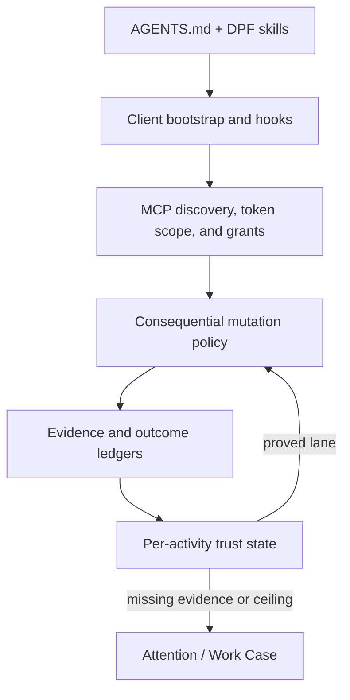

# Agent Client Governance

DPF supports embedded AI coworkers and external coding clients such as Claude,
Codex, Grok, Antigravity, and customer-owned MCP agents. Trust does not come
from a client brand or from the client saying that it followed instructions.
Trust comes from layered controls and observed outcomes.

## The four governance altitudes

| Altitude | Purpose | Authoritative mechanism |
| --- | --- | --- |
| Instructions | Teach the agent how DPF works and how to make decisions | `AGENTS.md`, DPF skills, WWMD/WWWD/WSID |
| Client harness | Catch known procedural mistakes near the client | bootstrap conformance, hooks, worktree and lease guards |
| Server authority | Decide which actions DPF accepts | MCP token scope, agent grants, lifecycle hooks, evidence gates |
| Learning and trust | Decide when autonomy may widen | `DecisionShadowLedger`, `TrustState`, regulatory ceilings, governed playbooks |

Each layer solves a different failure class.

- Instructions are portable and expressive, but a client may misunderstand,
  omit, or override them.
- Client hooks provide fast feedback, but delivery and trust behavior differs by
  client and customer-owned agents may not install them.
- Server gates apply to every caller, but should be reserved for consequential
  transitions so normal work does not become bureaucratic.
- Trust learning improves autonomy over time, but only from reconciled outcomes;
  self-attestation is not an outcome.

## Which plane owns what

Tool discovery and mutation acceptance are intentionally separate:

- Per-client conformance and progressive disclosure decide which tools a caller
  sees and whether grants permit the call.
- Consequential mutation policies decide whether the requested state change is
  supportable now.

A client can therefore possess `backlog_write` and still be denied when it tries
to mark unsupported work complete. The grant means “may attempt this class of
action,” not “every claim is true.”

## Evidence-earned completion

`BacklogItem.status="done"` is organizational truth. Agent callers must provide a
typed completion manifest citing evidence already recorded on the BI. The server
resolves ownership, freshness, polarity, and supersession before allowing the
transition.

Evidence requirements are proportional:

- documentation needs a review;
- verified-existing implementation needs source provenance plus a manual
  verification record;
- operational work needs a manual completion check; and
- new implementation needs source, tests, production build, and any applicable
  UX or migration evidence.

Inapplicable UX and migration dimensions require a concrete rationale. This is
less costly than forcing irrelevant tests and more trustworthy than silently
assuming that a missing record means “not applicable.”

Build Studio is not exempt. Its canonical `FeatureBuild` verification can
satisfy dimensions through an adapter, so evidence is reused rather than copied.

## Surface-neutral semantic change review

Code authored in Build Studio, Codex, Claude, Grok, or another MCP client uses
one semantic review contract. The authoring surface is attribution, not a
different quality policy. The contract is implemented as pure functions in
`apps/web/lib/change-review/semantic-change-review.ts`; Build Studio retains a
compatibility adapter while external clients can construct the same receipt.

A receipt is fresh only while all of its semantic identity remains unchanged:

- Workroom;
- base and head trees;
- diff digest;
- policy and reviewer versions; and
- normalized specialist set.

Changing any one of those inputs requires a new review. Reordering or repeating
the same specialists does not. A genuinely low-risk change may auto-pass, but
the auto-pass still emits a receipt with its rationale; review is never skipped
silently.

The receipt reuses the existing `ExternalEvidenceRecord` and
`WorkCapsuleActivity(kind="evidence-recorded")` streams. It does not create a
parallel finding table. This keeps the write substrate singular while allowing
portal timelines, local hooks, CI, and promotion controls to project the same
evidence in later rollout phases.

External delivery surfaces invoke the native `review_semantic_change` operation
only after the complete concern is committed locally and before pregate or the
first push. Build Studio invokes the same operation contract once over the
assembled task diff, before UX verification and promotion; its existing
task-level reviews remain intact. Runtime code activates the Change Reviewer,
while a docs-only low-risk change can receive an explicit auto-pass receipt.
Content selects existing specialist branches (accessibility, data governance,
SBOM, and architecture guardrail), and the normalized specialist set is part of
freshness. Repair loops stop after two failed rounds and surface operator review
instead of oscillating. The adapters initially run in shadow mode; the next
rollout phase ratchets deterministic publication enforcement only after outcome
telemetry demonstrates sufficient signal quality.

Publication enforcement is deliberately split from inference. Review persists
an immutable receipt before publication; `pnpm review:semantic-gate` then
validates an exact-tree git-dir sidecar with no model, portal, database, or
network call. Explicit exemptions are policy-versioned, evidence-linked, and
expiry-bound.

Reviewer execution status is not a semantic verdict. Capacity, admission,
transport, or response-parsing failure produces `inconclusive` and a retry
action; it never fabricates a critical code finding. GitHub/CI correlation is
written to the same evidence streams as `semantic-change-review.outcome`, and
inconclusive samples are excluded from precision and unique-yield denominators.

Nor can a reviewer pass a change it could not read. Where the change is not
present in what the reviewer can see, it answers `cannot-verify`, which is
recorded as `inconclusive` with reason `reviewer-could-not-verify-change` and
rides the same retry path. Inability to review is never a code finding: a
finding about the code asserts the code was read, and `pass` or `fail` asserts
that THIS change was reviewed. A reviewer that reports the change as absent
while still answering `pass` is corrected to `inconclusive` rather than
published (BI-82902891).

## Design grounding

- Existing specs/plans reviewed: the shared Change Reviewer control plan and
  the agent-client governance contract on this page.
- Current code substrate reviewed: the surface-neutral semantic review receipt,
  external-review activation policy, existing external evidence and Work
  Workroom activity streams, Build Studio task review, and assembled-change
  verification transition.
- Source of truth: the immutable receipt identity in
  `apps/web/lib/change-review/semantic-change-review.ts` plus Workroom
  evidence; no new persistence substrate is introduced.
- Decision: both authoring paths use one operation and evidence shape. A local
  no-network adapter enforces exact-tree freshness only after cross-surface
  outcome telemetry calibrates the policy.

## Client identity and trust

Client identity is useful attribution:

- which client family and version connected;
- which token and human principal authorized the request;
- which coworker or task run acted; and
- which session or Workroom contained the work.

It is not authority. A new Antigravity, Grok, Codex, or customer agent receives
the same server policy. Measured trust is keyed to coworker, activity, and risk,
then bounded by regulation and intrinsic authority.

## Operator attention

The platform asks for attention only when attention changes the outcome:

- evidence is genuinely missing;
- a newer failure invalidates an older pass;
- repeated unsupported mutations suggest a runaway client;
- a regulatory or authority ceiling requires a human; or
- bounded autonomous recovery is exhausted.

The preferred interaction gives one plain-language reason and one recommended
next action. Raw activity, token, policy, and ledger identifiers remain behind
engineer-level disclosure.

## Adding another consequential gate

Before adding a gate:

1. verify the canonical record and policy do not already exist;
2. classify the transition’s reversibility and blast radius;
3. route real architectural alternatives through WWMD;
4. reuse `governedExecuteTool` rather than adding a client-specific server path;
5. reuse existing evidence, attention, and trust records;
6. provide shadow, enforce, and emergency-off rollout modes when compatibility
   risk warrants them; and
7. verify every supported client through the server, even if its local hooks are
   absent.

The default is not to gate everything. Server enforcement belongs at
organizational truth, irreversible state, external effect, regulatory floor, or
material authority-boundary transitions.
