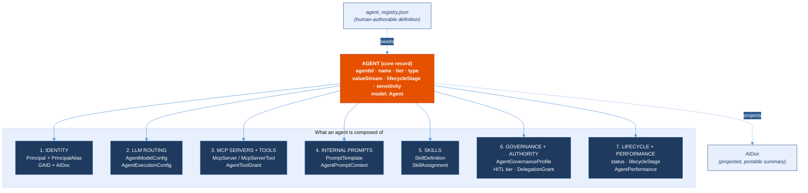
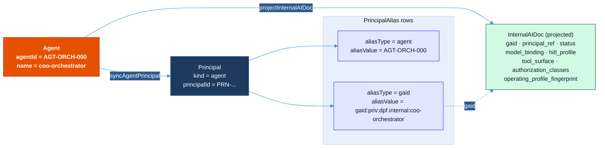
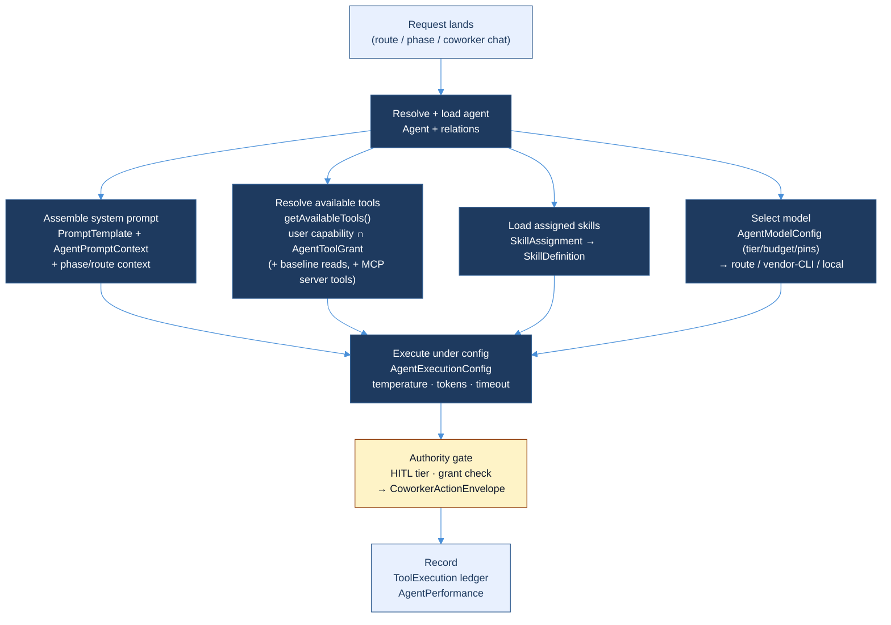

# The DPF AI Agent Meta-Model

> **What this document is.** The single, canonical answer to *"what is an AI agent, and what is it made of?"* in DPF. The model already exists in the codebase — it is just spread across the Prisma schema, the agent registry, the identity layer, and the standards docs. This page pulls those pieces into one picture so the model can be **communicated** rather than reverse-engineered.
>
> This is an architecture reference (a synthesis of the existing model), not a proposal for a new one. Every component below names its canonical home in code. Where the doc and the code disagree, **the code wins** — fix the doc.

---

## 1. The one-sentence model

> **An AI agent is a stable governed *identity* bound to a *model-routing policy*, a *tool surface* (MCP + platform tools), a set of *prompts*, a set of *skills*, and an *authority/governance envelope* — assembled at runtime and traceable through an audit ledger.**

For product UX, the tool surface now includes the [Authorized Surface Contract](../superpowers/specs/2026-08-08-authorized-surface-contract-design.md): a renderer-neutral, principal-filtered projection of semantic state and governed actions. It gives browser, mobile, workroom/headless, scheduled, and external agents the same page contract without treating DOM access as authority.

A useful mental shorthand:

```
agent = identity
      + llm-routing
      + mcp-servers/tools
      + prompts
      + skills
      + governance/authority
      + lifecycle/performance
```

The core record is the `Agent` row; the seven items above are the components that hang off it. Two *surfaces* matter for communication:

- **`agent_registry.json`** — the human-authorable definition (what you write to declare an agent).
- **The `AIDoc`** — the projected, portable summary (what the platform publishes about an agent).



---

## 2. The core record — `Agent`

The spine every component attaches to. Canonical home: **`packages/db/prisma/schema.prisma` → `model Agent`** (~line 1932). Seeded from `packages/db/data/agent_registry.json`.

| Field | Meaning |
| --- | --- |
| `agentId` (unique) | Semantic id, e.g. `AGT-ORCH-000`. The durable name. |
| `slugId` (unique, optional) | Backward-compat alias, e.g. `coo`, `build-specialist`. |
| `name` | Human-readable name, e.g. `coo-orchestrator`. |
| `tier` | Hierarchy level (1 = orchestrator, higher = more specialised). |
| `type` | Functional classification (`orchestrator`, `specialist`, …). |
| `valueStream` | `evaluate` \| `explore` \| `integrate` \| `deploy` \| `release` \| `consume` \| `operate` \| `cross-cutting`. |
| `it4itSections` | IT4IT framework anchors (e.g. `6.1.1 Policy FC`). |
| `sensitivity` | `public` \| `internal` \| `confidential` \| `restricted`. |
| `humanSupervisorId` | The accountable human (e.g. `HR-000`). |
| `hitlTierDefault` | Autonomy posture: `0` = human-only, `1` = approve, `2` = review, `3` = autonomous. |
| `escalatesTo` | Who blocked work escalates to (HR role or agent id). |
| `delegatesTo[]` | Child agent ids this one may hand work to. |
| `lifecycleStage` | `plan` \| `design` \| `build` \| `production` \| `retirement`. |
| `status` / `archived` | Operational state. |

Everything else is a relation: `governanceProfile`, `executionConfig`, `skills`, `toolGrants`, `promptContext`, `performanceProfiles`, `delegationGrants`, `authorityBindings`, `coworkerAssessments`, `coworkerNeeds`.

---

## 3. The seven components

### 3.1 Identity — *who the agent is*

Three layers, each with a distinct job:

1. **Semantic id** — `Agent.agentId` (`AGT-ORCH-000`). The name humans and code use.
2. **Principal convergence** — every identity-bearing entity (User, Agent, EdgeNode, …) is one `Principal` with `kind="agent"`, carrying `PrincipalAlias` rows. Agents get two aliases:
   - `aliasType="agent"` → `aliasValue = AGT-ORCH-000`
   - `aliasType="gaid"`  → `aliasValue = gaid:priv:dpf.internal:coo-orchestrator`

   Authorization resolves on the `Principal`; the alias kind tells the platform which surface authenticated. (AGENTS.md §11; `apps/web/lib/identity/principal-linking.ts` → `syncAgentPrincipal`.)
3. **GAID + AIDoc** — **GAID** (*Global AI Agent Identification and Governance Framework*) is the normative naming/identity/traceability standard: `docs/architecture/GAID.md`. GAID format is `gaid:<scope>:<issuer-prefix>:<agent-local-id>` (e.g. `gaid:priv:dpf.internal:coo-orchestrator`). DPF currently implements the **private** profile (`GAID-Private`); the AIDoc's `exposure_state` is always `"private"` today. The **AIDoc** (Agent Identity Document) is the projected, portable summary of an agent — see §4.

GAID is deliberately complementary to **TAK** (Trusted AI Kernel): *GAID says who an agent is and what claims can be made about it; TAK says how a trustworthy runtime must govern it.* See `docs/architecture/trusted-ai-kernel.md` and `docs/architecture/agent-standards-dpf-conformance.md`.



### 3.2 LLM routing — *which model the agent runs on*

An agent does **not** hardcode one model; it declares a *policy* and the router resolves a concrete model per call.

- **`AgentModelConfig`** (schema ~line 8804) — the routing *policy*:
  - `minimumTier` — `frontier` \| `strong` \| `adequate` \| `basic`
  - `budgetClass` — `minimize_cost` \| `balanced` \| `quality_first`
  - `pinnedProviderId` / `pinnedModelId` — optional hard pins
  - `minimumCapabilities` (e.g. `{ "toolUse": true }`) and `minimumContextTokens` — hard capability floor
- **`AgentExecutionConfig`** (schema ~line 2063) — the runtime *envelope*: `defaultModelId`, `temperature`, `maxTokens`, `executionType` (`in_process` \| `sandbox` \| `daemon`), `timeoutSeconds`, `concurrencyLimit`, token budgets, `memoryType` / `memoryBackend`.
- **Resolution** — the selection algorithm (filter on tier/capabilities/sensitivity, rank by cost-per-success per budget class, apply pins, dispatch with a fallback chain) is documented in `docs/user-guide/ai-workforce/model-routing-lifecycle.md`. Dispatch can be **routed** (cloud/local via OpenAI-compatible `/v1/chat/completions`), **vendor-CLI** (Claude/Codex/Grok in a sandbox), or **local** (Docker Model Runner). Inference itself: `apps/web/lib/ai-inference.ts`.

In the registry this is the `config_profile.model_binding` block (`model_id`, `provider_id`, `temperature`, `max_tokens`, `credential_ref`, `auth_type`).

### 3.3 MCP servers & tools — *what the agent can do*

- **MCP servers** are first-class records: **`McpServer`** (`serverId`, `transport`, `category`, `status`, `healthStatus`, …) with discovered **`McpServerTool`** rows (`toolName`, `inputSchema`, `isEnabled`). The local DPF server (`serverId="dpf"`) exposes the platform tool catalog over JSON-RPC 2.0 at `apps/web/app/api/mcp/v1/route.ts`.
- **Tool grants** — an agent's *permitted* surface is `AgentToolGrant` rows (`grantKey`, e.g. `registry_read`, `backlog_write`). Grants are coarse keys, not raw tool names.
- **Attachment** — `getAvailableTools()` (`apps/web/lib/mcp-tools.ts`) intersects **user role capability ∩ agent grants**, applies `TOOL_TO_GRANTS` + `GRANT_IMPLICATIONS` (`apps/web/lib/agent-grants.ts`), adds the `COWORKER_READ_BASELINE_GRANTS` every coworker gets, then unions in MCP server tools under the same gating. Default-deny: an unmapped tool is refused.
- **Execution-time authority** — every coworker call passes through `governedExecuteTool()`, which evaluates the current `EffectiveAuthContext`, coworker grant, `DelegationChain` attenuation, route/record scope, external-connection state, sensitivity clearance, masking obligations, policy version, and HITL policy. Prompt text, model routing fallback, and provider cost are deliberately not authority inputs. The outcome is `allow`, `deny`, or `require-approval`; every outcome writes a privacy-safe `AuthorizationDecisionLog` before execution. A missing authority context or failed decision-log write fails closed.
- **External Task delivery** — an ordinary MCP task submission persists its `TaskRun` and immutable request/authentication binding, enqueues deterministic background execution, and returns the durable task handle without holding the HTTP request open. The same authenticated Streamable HTTP endpoint supports GET/SSE and publishes `notifications/tasks/status` from committed task state. Notifications are latency hints, not authority or truth: reconnecting and notification-blind clients recover through `tasks/get` / `tasks/list`, and a scheduled reconciler re-enqueues durable pending work after process or transport loss.

In the registry this is `config_profile.tool_grants` and `execution_runtime`.

### 3.4 Internal prompts — *how the agent thinks and speaks*

Three prompt sources compose into the system context:

- **`PromptTemplate`** (schema ~line 9524) — versioned, overridable templates seeded from `prompts/<category>/<slug>.prompt.md`. Frontmatter carries `name`, `category` (`route-persona`, `build-phase`, `specialist`, `platform-identity`, …), `agent_id`, `reports_to`, `value_stream`, `hitl_tier`, `composesFrom` (for `{{include:...}}` composition), `perspective`, `heuristics`, `interpretiveModel`. Hardcoded TS constants are fallback only (AGENTS.md §2).
- **`AgentPromptContext`** (schema ~line attached to `Agent`) — the agent's cognitive frame, per Scott Page: `perspective` (how it frames problems), `heuristics` (how it searches), `interpretiveModel` (what it optimises for), `domainTools`.
- **Phase prompts** — Build Studio assembles `ideate → plan → build → review → ship` prompts in `apps/web/lib/build/build-agent-prompts.ts`, injecting IT4IT context, project context, and prior-phase evidence.

### 3.5 Skills — *packaged, reusable competencies*

- **`SkillDefinition`** (schema ~line 8823) — the catalogued skill: `skillId`, `category`, `riskBand`, `triggerPattern`, `agentInvocable`/`userInvocable`, `allowedTools`, `composesFrom`, `capability`, `taskType`, plus the full `skillMdContent`. Authored once at `packages/dpf-skill-pack/skills/<slug>/SKILL.md` (AGENTS.md §16).
- **`SkillAssignment` / `AgentSkillAssignment`** — bind a skill to an agent (`agentId`, `priority`/`sortOrder`, `enabled`). Skills belong to coworkers, not routes.

### 3.6 Governance & authority — *what the agent is allowed to do, and who answers for it*

- **`AgentGovernanceProfile`** (schema ~line 2015) — `autonomyLevel`, `hitlPolicy`, `allowDelegation`, `maxDelegationRiskBand`, plus FKs to `AgentCapabilityClass` and `DirectivePolicyClass`.
- **HITL tier** (`hitlTierDefault` 0–3) — the autonomy dial.
- **Delegation & authority** — `DelegationGrant` and `AuthorityBinding` carry scoped, time-boxed, risk-banded authority. `DelegationChain` narrows capability scope hop by hop and preserves the human origin at execution.
- **HITL call-chain return** — an execution-time `require-approval` decision creates or reuses a privacy-safe `CoworkerActionEnvelope` bound to the exact human, coworker, task, delegation chain, tool, subject, route, input fingerprint, sensitivity, and policy-version fingerprint. Only that `TaskRun` moves to `input-required`; an approved re-entry resumes and finalizes only the matching call. Changed inputs or stale policy require a new decision.
- **Accountability spine** — `humanSupervisorId` (sponsor) + `escalatesTo` (escalation target). The SysML current-state model of these invariants lives in `packages/db/src/seed-ea-sysml-agent-authority.ts` (default-deny, dual-gate, HITL, token-scope, audit, dual-principal, grant-narrowing).

### 3.7 Lifecycle & performance — *the agent over time*

`status` / `archived` / `lifecycleStage` track where the agent is in its life; `AgentPerformance` records execution metrics by task type; `CoworkerSelfAssessment` / `CoworkerCapabilityNeed` capture declared readiness and gaps.

---

## 4. The two surfaces — how you actually *communicate* an agent

There are exactly two artifacts you hand someone to convey "this is the agent":

### 4.1 The authorable definition — `agent_registry.json`

This is what you **write**. One entry fully declares an agent; the seed turns it into the `Agent` row + relations + Principal/aliases. Real entry (`AGT-ORCH-000`, abbreviated):

```jsonc
{
  "agent_id": "AGT-ORCH-000",
  "agent_name": "coo-orchestrator",
  "tier": "orchestrator",
  "value_stream": "cross-cutting",
  "capability_domain": "Strategic alignment, budget authority delegation, ...",
  "human_supervisor_id": "HR-000",
  "hitl_tier_default": 0,
  "delegates_to": ["AGT-100", "AGT-101", "AGT-102"],
  "escalates_to": "HR-000",
  "it4it_sections": ["6.1.1 Policy FC", "6.1.2 Strategy FC"],
  "status": "defined",
  "config_profile": {
    "model_binding":     { "model_id": "claude-opus-4-6", "temperature": 0.3, "max_tokens": 8192,
                           "provider_id": "anthropic", "credential_ref": "anthropic-prod", "auth_type": "api_key" },
    "execution_runtime": { "type": "in_process", "timeout_seconds": 300 },
    "token_budget":      { "daily_limit": 500000, "per_task_limit": 50000 },
    "tool_grants":       ["registry_read", "backlog_read", "backlog_write", "decision_record_create", ...],
    "memory":            { "type": "persistent", "backend": null },
    "concurrency_limit": 2
  }
}
```

Read it top-to-bottom and you have all seven components: identity (`agent_id`/`agent_name`), governance (`hitl_tier_default`, `human_supervisor_id`, `escalates_to`, `delegates_to`), LLM routing (`model_binding`), execution (`execution_runtime`, `token_budget`), and tools (`tool_grants`). Skills and prompts bind by `agent_id` from their own sources.

### 4.2 The projected summary — `AIDoc`

This is what the platform **publishes** about an agent: a deterministic projection of current state, defined by `InternalAIDoc` in `apps/web/lib/identity/aidoc-resolver.ts` (`projectInternalAIDoc`). It is the GAID-aligned identity card:

```ts
type InternalAIDoc = {
  gaid: string;                 // gaid:priv:dpf.internal:coo-orchestrator
  issuer: string;               // dpf.internal
  subject_type: "agent";
  subject_name: string;
  principal_ref: string;        // PRN-...
  status: string;
  exposure_state: "private";    // private profile today
  validation_state: "validated" | "pending-revalidation" | "stale";
  lifecycle_stage: string;
  data_sensitivity_profile: string;
  model_binding: { default_model_id, pinned_provider_id, pinned_model_id,
                   minimum_tier, budget_class, execution_type, temperature, max_tokens };
  hitl_profile:  { default_tier, policy, autonomy_level, allow_delegation, max_delegation_risk_band };
  prompt_class_refs: string[];        // e.g. ["conversation:strategy-alignment"]
  tool_surface: string[];             // derived from grants
  authorization_classes: GaidAuthorizationClass[];   // portable action classes
  operating_profile_fingerprint: string;             // SHA256 of materially-relevant state
};
```

The `operating_profile_fingerprint` is the key idea for communication-at-scale: a hash of model binding + grants + prompt classes + HITL tier + sensitivity. When it changes, the agent's operating identity has *materially* changed — memory and assurance claims revalidate against it.

**Rule of thumb:** author in the registry, communicate via the AIDoc, govern via TAK, name via GAID.

---

## 5. Runtime assembly

Identity and config are static; the live agent is *assembled* per request. `getAvailableTools()`, prompt composition, skill loading, and model resolution all run at call time, then the authority gate and `ToolExecution` ledger close the loop.



---

## 6. Source map (single source of truth per component)

| Component | Canonical home |
| --- | --- |
| Core record | `packages/db/prisma/schema.prisma` → `model Agent` |
| Authorable definition | `packages/db/data/agent_registry.json` |
| Identity — convergence | `packages/db/prisma/schema.prisma` → `Principal`, `PrincipalAlias`; `apps/web/lib/identity/principal-linking.ts` |
| Identity — standard | `docs/architecture/GAID.md` (+ `agent-standards-dpf-conformance.md`, `gaid-conformance-tests.md`) |
| Identity — projection | `apps/web/lib/identity/aidoc-resolver.ts` (`InternalAIDoc`, `projectInternalAIDoc`) |
| LLM routing | `AgentModelConfig`, `AgentExecutionConfig`; `docs/user-guide/ai-workforce/model-routing-lifecycle.md`; `apps/web/lib/ai-inference.ts` |
| MCP servers & tools | `McpServer`, `McpServerTool`, `AgentToolGrant`; `apps/web/app/api/mcp/v1/route.ts`; `apps/web/lib/mcp-tools.ts`; `apps/web/lib/agent-grants.ts` |
| Prompts | `prompts/<category>/<slug>.prompt.md`; `PromptTemplate`; `AgentPromptContext`; `apps/web/lib/build/build-agent-prompts.ts` |
| Skills | `SkillDefinition`, `SkillAssignment`; `packages/dpf-skill-pack/skills/<slug>/SKILL.md` |
| Governance & authority | `AgentGovernanceProfile`, `DelegationGrant`, `DelegationChain`, `AuthorityBinding`, `CoworkerActionEnvelope`; `apps/web/lib/govern/authority/`; `apps/web/lib/mcp-governed-execute.ts`; `packages/db/src/seed-ea-sysml-agent-authority.ts`; AGENTS.md §8 |
| Lifecycle & performance | `Agent.status/lifecycleStage`, `AgentPerformance`, `CoworkerSelfAssessment`, `CoworkerCapabilityNeed` |
| Audit ledger | `AuthorizationDecisionLog` (why authority allowed/denied/paused) + `ToolExecution` (what ran), surfaced at `/platform/ai/authority` |

---

## 7. Standards lineage (why the model is shaped this way)

DPF's agent model is not bespoke — it conforms to an explicit standards family, documented in-repo:

- **GAID** — *who* the agent is, what claims can be made, how they're verified/traced. (`docs/architecture/GAID.md`)
- **TAK** (Trusted AI Kernel) — *how* a trustworthy runtime must govern the agent in operation. (`docs/architecture/trusted-ai-kernel.md`)
- **ISO/IEC 42001** — the org-wide AI management system layer GAID/TAK sit inside.
- **IT4IT** — value-stream and functional-component anchoring (`valueStream`, `it4itSections`).
- **Principal convergence** (AGENTS.md §11) — agents are principals alongside humans, so authorization is uniform.

The DPF-specific conformance position is in `docs/architecture/agent-standards-dpf-conformance.md`; the threat model in `docs/architecture/agent-standards-threat-model.md`.

---

## 8. Known gaps (what the model does *not* yet cover)

- **GAID public/federated profiles** — only `GAID-Private` is implemented; `exposure_state` is always `"private"`. Public issuance, revocation, and cross-boundary validation are specified in `GAID.md` but not yet built.
- **Prompt-context generation** — `AgentPromptContext.{perspective,heuristics,interpretiveModel}` are hand-seeded; there is no auto-sync to capability changes.
- **Agent versioning** — no formal major/minor versioning, deprecation, or staged-rollout policy beyond `lifecycleStage`.
- **Dynamic MCP binding** — tool grants are static at seed time; runtime discovery/binding of new MCP servers to an agent is not yet modelled.
