# Application boundaries

DPF's web application is organized as a modular monolith. PostgreSQL and the web deployment stay unified, while selected high-growth application contexts follow an explicit dependency direction enforced by `scripts/check-application-boundaries.mjs`.

The canonical machine-readable policy is `scripts/application-boundaries.json`. This page explains it; it is not a second rule source.

## Governed dependency direction

```mermaid
flowchart LR
  mcp["mcp — protocol/tool adapters"] --> actions["actions — browser/server-action adapters"]
  actions --> queue["queue — durable execution adapters"]
  queue --> integrate["integrate — external-system orchestration"]
  integrate --> build["build — delivery orchestration"]
  build --> tak["tak — agent-loop orchestration"]
  tak --> inference["inference — provider-neutral execution"]
  inference --> routing["routing — model/workload policy"]
```



An outer context may import any context to its right. A context may not import a context to its left, and the allowed graph must remain acyclic. Imports within a context are unrestricted by this guard.

This first governed cohort was selected from measured size and reciprocal-dependency hotspots. It does not claim that every `apps/web/lib` directory is already a mature bounded context. Additional contexts enter the registry only when ownership and dependency direction are explicit.

## Outer layers: lib never imports the UI

`outerLayers` in the registry names directories that sit above `apps/web/lib`: `apps/web/app` (routes and layouts) and `apps/web/components` (React UI). No file under `apps/web/lib` may import either, whatever its context, and every import kind counts: value imports, `import type`, dynamic `import()`, and `import("x").T` type queries. A type-only edge still ties `lib` and the UI into one TypeScript program, which blocks the `lib`/`ui` project split in the [import-cycle spec](../superpowers/specs/2026-09-30-web-runtime-import-cycle-and-project-references-design.md) (§4.3, §6 PR-3).

The count was 44 edges on 2026-09-30 and is 0 now. The fixes followed one rule: move the shared type, constant or pure helper down into `lib`, and have the component import it from there. For example, the status→intent registry now lives in `lib/ui-model/statusColors.ts` (the report-kit barrel re-exports it), the domain nav tables in `lib/navigation/*-nav.ts`, and the twin snapshot contract in `lib/twin/`. Where `lib` hooks read a React context, the context and its hooks live in `lib` and the provider component in `components/` fills it (`lib/i18n/messages-context.ts`, `lib/hooks/system-events.ts`). If `lib` genuinely needs to render or call UI, invert the dependency (the UI registers itself or passes a callback); an edge that cannot move yet needs an owned, dated exception like any other.

## Why this direction

The initial ordering minimizes disruption while establishing a real target. Across the eight contexts, the 2026-08-01 baseline contains 498 distinct cross-context import statements. The chosen acyclic order permits 433 and records 65 reverse imports as debt. It preserves dominant flows such as MCP adapters into integration/application behavior, actions into orchestration, integration into build/inference/routing, and inference into routing.

The ordering is a refactoring constraint, not proof that every present responsibility is in the right folder. BI-B970B01D uses the resulting evidence to extract ports and move responsibilities along semantic seams.

## Exception contract

Each accepted reverse import is exact and carries:

- the source file, raw module specifier, and target context in its key;
- an accountable context owner;
- a rationale tied to the hardening work; and
- a review date.

The guard blocks a new reverse import. When an accepted import disappears, the guard remains green and reports the now-stale exception so the baseline can shrink. Expired exceptions fail the registry validation.

`--write-baseline` is a mechanical serializer, not permission to accept debt. Use it after removing edges, or after a governed architecture decision explicitly accepts a new exception. Never use it merely to turn a failing PR green.

## Refactoring pattern

When the guard identifies a reverse dependency:

1. Characterize the behavior at the existing public boundary.
2. Decide which context owns the policy or state.
3. Put a small typed port in the inner owner, or move the misplaced responsibility.
4. Keep transport behavior—sessions, HTTP mapping, Next.js revalidation, MCP serialization—at the outer adapter.
5. Remove the reverse import and regenerate the baseline so the improvement cannot regress.

Avoid a neutral `shared` dumping ground. A genuinely cross-context primitive needs a named canonical owner and evidence that the existing context cannot own it.

## Commands and evidence

```text
node --test scripts/check-application-boundaries.test.mjs
node scripts/check-application-boundaries.mjs
```

The guard is part of the canonical source policy-guard profile and is also available as `pnpm check:application-boundaries`. The context pass uses only Node built-ins. The outer-layer pass reads specifiers with the pinned guard TypeScript (`@dpf/repo-guard-runtime`, which the source profile installs) so that import-shaped text inside a prompt template literal is not mistaken for an import.

## Ownership and successor work

- BI-2E9F6D37 owns this registry and guard.
- BI-963F4226 introduces the transport-neutral ActorContext/application-service boundary.
- BI-58810028 proves that boundary through the Finance canary.
- BI-71345FF0 burns API-route → server-action coupling to zero.
- BI-B970B01D removes the highest-value reciprocal context edges and oversized orchestration seams.
- BI-PSC-004, BI-ECO-004, and BI-ECO-005 remain the owners of durable execution, integration receipts, and shared company primitives.
