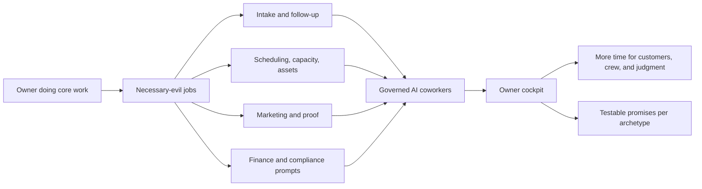

# Archetype Owner Positioning

**Status:** Draft - 2026-07-18  
**Scope:** Owner-facing marketing opportunity, visual direction, and test-priority translation for the current 95 archetypes across 21 categories.  
**Related:** [Market Archetypes And Coworkers](../user-guide/market-archetypes.md), [Archetype Owner Quick Guide](../marketing/archetype-owner-quick-guide.md), [Archetype Business Value Streams](archetype-business-value-streams.md), [Archetype Audit Plan](../testing/archetype-audit-plan.md), [Customer Marketing Workspace Design](../superpowers/specs/2026-04-24-customer-marketing-workspace-design.md)

## 1. Positioning Thesis

DPF should speak first to the owner who is also doing the work: the plumber still answering calls, the clinic owner still handling forms, the salon owner still filling gaps in the schedule, the venue owner still chasing deposits, the nonprofit director still writing donor updates after dinner.

The promise is not "AI for small business" in the abstract. The promise is:

> Keep doing the work customers pay you for. Give the work around the work to governed AI coworkers.

The broader market thesis is now:

> Integrate at the edge. Simplify in the core. Generalize for the ecosystem.

DPF should meet owners where they are: QuickBooks for accounting, Stripe or Square for payments, Gusto or ADP for payroll, HubSpot or Salesforce for CRM, Zendesk or Jira Service Management for tickets, Slack or Microsoft 365 for communication, Shopify or POS systems for commerce, and vertical tools where regulation or specialization demands them. Those systems are bridges and benchmarks, not the final architecture. When a workflow is broadly useful across companies, DPF should absorb it into native company primitives so the next owner does not inherit the same brittle software stack.

The "work around the work" is the necessary-evil layer that steals owner time:

- capturing enough information to quote, book, dispatch, or qualify the work
- following up when a customer, patient, donor, resident, or client goes quiet
- keeping schedules, crews, assets, inventory, rooms, or service capacity from colliding
- drafting campaign ideas, proof assets, local content, reminders, and customer updates
- surfacing compliance, licensing, disclosure, or safety prompts before the owner promises the wrong thing
- turning inbox, portal, finance, customer, and operations data into a daily owner cockpit

This document turns the archetype catalog into two usable artifacts:

1. **Marketing positioning:** why DPF matters to the owner of each business type.
2. **Testing emphasis:** which owner promise must be verified before that positioning is safe to use.

## 2. Current State vs Planned Complete State

DPF should separate what can be marketed as available today from what belongs in planned-state positioning.

| Layer | Current platform positioning | Planned complete-state positioning | Do not overclaim |
| --- | --- | --- | --- |
| Archetype setup | Business-specific portal, vocabulary, CTA type, activation profile, seed content, coworker framing. | Owner starts from an operational model that already knows the business's demand, capacity, compliance, and growth pattern. | Do not imply every leaf has fully mature vertical operations until the archetype audit verifies it. |
| Coworkers | Purposed coworkers can help with setup, storefront, customer, marketing, finance, operations, compliance, and platform work inside governed permissions. | AI coworkers proactively handle follow-up, draft campaigns, detect gaps, prepare decisions, and coordinate across the owner cockpit. | Do not imply unreviewed public publishing, clinical/legal/financial advice, or unrestricted tool authority. |
| Owner cockpit | Workspace/twin surfaces can frame work by archetype and expose current portal/customer/finance/workflow state. | The daily board becomes the owner's command center for exceptions, capacity, next best actions, and work that needs judgment. | Do not imply every vertical cockpit is finished until workspace/twin routes are acceptance-tested. |
| Marketing | Archetype-aware offers, proof prompts, campaign ideas, and strategy inputs are defined as the customer marketing workspace direction. | Marketing coworker becomes the owner's research/draft/sequence assistant for local campaigns, proof assets, funnel review, and periodic strategy refresh. | Do not imply channel integrations, attribution, or automatic posting are complete unless verified. |
| Operations | Shared mechanics cover intake, scheduling, inbox, customer records, finance drafts, workbooks, and selected vertical modules. | Field dispatch, rental capacity, project milestones, membership, donations, account relationships, and regulated handoffs become first-class vertical loops. | Do not imply DPF replaces core EHR, core banking, ticketing seat maps, payment rails, payroll, or full accounting systems. |
| Ecosystem absorption | DPF has native routes and adapters across finance, HR, CRM, customer, knowledge, inventory, integrations, and work tracking; connector scorecards benchmark the surrounding SaaS ecosystem. | Adapters become migration bridges and learning surfaces. Shared primitives for Party, Work, Money, Asset, Knowledge, and Authority absorb repeatable workflows into a coherent operating platform. | Do not sell every vendor integration as native, or native aspiration as delivered parity. State the bridge-vs-native boundary clearly. |

## 3. Owner Promise Diagram

Use this diagram in internal strategy decks. For customer-facing collateral, replace it with photography or UI captures showing the owner moment: an after-hours inbox, a full schedule, a dispatch board, a donor campaign draft, a rental return queue, or a venue calendar.

## 4. Category Positioning Matrix

Each row names the business-specific reason DPF should matter, the visual story marketing can tell, and the highest-value use case the archetype audit should prove. Rows are source categories unless labelled as a spotlight; `IT managed services` is a required `professional-services` leaf spotlight, not a separate category in the canonical 95 / 21 inventory.

| Category | Owner-practitioner reality | DPF owner promise | Visual / collateral brief | Highest-value test emphasis |
| --- | --- | --- | --- | --- |
| Trades and maintenance | The owner is often quoting, dispatching, checking parts, and doing urgent work personally. | DPF catches useful job details, prioritizes urgency, drafts customer updates, and keeps quote, dispatch, and follow-up work from spilling into the evening. | Owner in a van or small office with a job map, urgent requests, technician readiness, and parts reminders. | Intake must capture urgency/property/job details; inbox and coworker must use jobs, call-outs, quotes, technicians, and licensed-work framing. |
| Beauty and personal care | The owner earns money in the chair or treatment room, but loses hours to gaps, no-shows, rebooking, and promotions. | DPF protects the calendar, fills quiet slots, drafts reactivation campaigns, and keeps provider availability connected to what customers can book. | Salon floor with a live calendar, open slots, repeat-client reminders, and campaign drafts for bridal, seasonal, or package offers. | Provider-specific slots, duration variants, no account-balance language, and client/appointment vocabulary must hold across portal and coworker. |
| Healthcare and wellness | The owner or lead practitioner needs appointments ready without drifting into unsafe advice or privacy mistakes. | DPF handles readiness work around the encounter: missing forms, patient/pet context, reminders, operational follow-up, and compliance-aware boundaries. | Front desk readiness board showing forms, patient/pet records, appointment reasons, and safe escalation prompts. | Patient/pet fields must reach inbox and records; coworker must refuse diagnosis/crisis handling and keep PHI/clinical boundaries clear. |
| Pet services | The owner cares for named pets while juggling temperament notes, grooming durations, boarding ranges, and recurring walks. | DPF remembers the pet details that shape the job and helps the owner coordinate booking, special instructions, and repeat care. | Pet profile beside booking calendar with size, breed, temperament, stay dates, recurring walk pattern. | Pet `ConfigurationItem` linkage, boarding date ranges, recurring walking, and size-based pricing must survive submission and coworker context. |
| Food and hospitality | The owner is producing food and service while managing reservations, custom orders, allergens, and event quotes. | DPF separates table reservations, catering quotes, and shop orders so the owner does not force every food business through one workflow. | Kitchen pass plus reservation sheet, catering inquiry, and bakery order queue in one owner cockpit. | Mixed CTA behavior must be correct: party-size reservations, catering guest/event quote capture, bakery purchase/order, and allergen/dietary capture. |
| Retail and goods | The owner is merchandising, fulfilling, ordering stock, answering custom requests, and trying to turn buyers into repeat customers. | DPF connects catalog, checkout, customer history, restock signals, delivery notes, and campaign ideas around what is selling. | Merchandising board with low-stock items, online orders, delivery dates, returns, and local product campaign copy. | Shop CTA, product images, order-to-customer linkage, wholesale inquiry exception, and delivery/custom-commission sub-flows must be verified. |
| Fitness and recreation | The owner coaches or runs classes while renewals, attendance, packages, and class communications drive the business. | DPF treats membership and retention as the business, not a one-time sale, and helps the owner see churn, renewals, and class demand. | Class schedule and membership board showing renewals, attendance gaps, and reactivation campaign. | Recurring membership language, member/student vocabulary, tiers, emergency contact/DOB capture, and class schedule behavior must be tested. |
| Education and training | The owner or instructor teaches, but the admin load is parent/student details, skill level, scheduling, and B2B program qualification. | DPF separates payer, learner, instructor, level, cohort, and corporate-program context so training is booked and marketed correctly. | Lesson calendar with learner profile, parent contact, instructor assignment, and corporate training proposal draft. | Learner-vs-payer fields, instructor/pickup/location details, safeguarding tone, and B2B corporate-training framing must be verified. |
| Professional services | The owner sells expertise, then loses time qualifying vague inquiries, creating proposals, managing retainers, and proving credibility. | DPF turns loose inquiries into scoped engagements, drafts proof assets, keeps retainers/milestones visible, and respects regulated advice boundaries. | Consultant or advisor workspace with inquiry brief, proposal outline, retainer status, case-study proof, and compliance prompt. | Client/engagement/retainer vocabulary, regulated disclaimers for legal/accounting, portfolio proof, and milestone/retainer finance framing must hold. |
| IT managed services spotlight (`professional-services` leaf) | The owner is accountable for client uptime and trust while tracking assets, tickets, agreements, and separate estates. | DPF helps the MSP keep each client's estate isolated, agreements visible, incidents triaged, and improvement opportunities tied to the right client. | Multi-client service desk with clearly separated estates, assets, incidents, SLA signals, and agreement renewal prompts. | Strict estate separation, per-client vocabulary, service agreement activation, incident/helpdesk framing, and no cross-client leakage are critical. |
| Nonprofit and community | The director is mission worker, fundraiser, volunteer coordinator, and reporting clerk in one. | DPF helps the organization ask, thank, receipt, coordinate programs, and tell the story without turning supporters into "customers." | Donation/program board with donor thanks, volunteer slots, beneficiary notes, grant/reporting tasks, and campaign draft. | Donate CTA, receipts without invoices, donor/supporter/beneficiary vocabulary, cooperative governance, and member-owned framing must be verified. |
| HOA and property management | The manager or board member handles resident issues, dues, violations, facilities, vendors, and owner communication. | DPF centralizes requests with property context and helps route maintenance, reservations, dues questions, and communication without consumer-sales language. | Resident request board with unit/address, urgency, violation follow-up, amenity booking, and vendor task status. | Resident/homeowner vocabulary, property/unit/urgency capture, amenity booking, dues/covenant framing, and landlord/tenant audience switching must be tested. |
| Software platform | The founder/operator is selling, supporting, learning from users, and improving the product at the same time. | DPF turns customer inquiries into product learning, backlog items, growth actions, and governed improvement work. | SaaS operator cockpit linking demo requests, pilots, support signals, product backlog, and campaign proof. | Inquiry-to-inbox-to-backlog linkage, digital-product association, and non-recursive DPF-as-product wording must be verified. |
| Banking and financial services | The operator must grow relationships while disclosures, KYC, regulatory posture, and core-system boundaries dominate trust. | DPF helps prepare engagement, education, intake, and relationship workflows while keeping core banking and regulated advice outside its promise. | Relationship opening board with KYC checklist, disclosure pack, BIAN capability map, and branch/local campaign concepts. | BIAN perspective, FDIC/NCUA/NMLS packs, KYC/disclosure framing, no cart/book/donate drift, and no rate/legal advice are release-critical. |
| Public sector and civic | The clerk, utility manager, or public-safety administrator serves residents under statute, not a market sale. | DPF helps route civic requests, permits, records, ratepayer issues, and communication while preserving public-body language and access boundaries. | Resident-service cockpit with 311 requests, permit queue, utility connection, records request, and meeting/notice tasks. | Resident/ratepayer vocabulary, statutory-fee framing, compliance placeholders, and law-enforcement CJI refusal must be verified. |
| Automotive services | The owner is often in the field, and the job depends on vehicle details, parts, location, ETA, and trust. | DPF captures the vehicle/service context, supports mobile dispatch, drafts ETA/follow-up updates, and surfaces certification or bonding prompts. | Mobile repair board with VIN/service details, technician route, parts/calibration note, roadside ETA, and review request. | Field-dispatch derivation, VIN/part/calibration posture, emergency-reactive roadside/locksmith behavior, and honest diagnosis language must be tested. |
| Moving and logistics | The owner coordinates crews, trucks, routes, loads, estimates, paperwork, and customer anxiety on moving day. | DPF helps turn the inquiry into a route/load plan, keeps crew and truck capacity visible, and handles status updates and post-job follow-up. | Route/load planning board with crew-hours, truck capacity, addresses, disposal/manifest or chain-of-custody notes. | Field dispatch, route/load planning, B2B account routes, consolidated billing, DOT/chain-of-custody prompts, and junk disposal leg must be verified. |
| Security services | The owner sells trust, staffing, incident response, install quality, and monitoring continuity under licensing constraints. | DPF supports recurring site coverage, patrol/incident documentation, install-to-monitoring handoff, and credible marketing without fear language. | Patrol/site coverage board with guard posts, incidents, licensing checks, install tasks, and monitoring renewal prompts. | Service agreements, post/patrol/incident vocabulary, licensing/low-voltage prompts, install plus monitoring retention, and credible tone must be tested. |
| Real estate and construction | The owner sells a high-trust, high-ticket project while coordinating tours, designs, selections, draws, subcontractors, and warranty obligations. | DPF keeps model-home or design-consultation demand connected to milestone projects, draw readiness, client communication, and build-team coordination. | Builder cockpit with model-home tours, design selections, draw milestones, subcontractor tasks, and warranty follow-up. | Booking item plus inquiry CTA, milestone/draw billing readiness, projects module, weekend model-home hours, and builder-license/warranty framing must be verified. |
| Media production | The owner is creative lead, producer, scheduler, budget manager, and client-chaser for approvals. | DPF helps scope the brief, track dependencies, chase approvals, protect crew/suite capacity, and keep milestone language intact from quote to delivery. | Production timeline with brief, deadline, crew/artists, review rounds, asset waits, and invoice milestones. | Project type/budget/deadline/brief capture, scheduling defaults, PIPELINE/timeline workspace posture, approval bottlenecks, and rights/usage boundaries must be tested. |
| Live events and venues | The owner manages dates, holds, capacity, staffing, guest experience, contracts, and settlement risk. | DPF helps avoid date conflicts, capture event/talent/venue details, coordinate readiness, and market the calendar without claiming full ticketing or settlement. | Venue calendar with holds, event packages, ticket/package references, staffing readiness, access needs, and promoter/talent inquiries. | Date/capacity/hold conflict handling, event vocabulary, purchase/inquiry references, weekend/long-day scheduling, and no seat-map/payment-rail overclaim must be verified. |
| Rental and shared assets | The owner earns money only when assets are reserved, used, returned, inspected, and available again. | DPF helps protect the reserve-use-return-inspect loop, records damage/availability, and turns fleet utilization into owner actions. | Rental yard or storage board with reservations, out/returned state, inspection queue, damage notes, and utilization prompts. | Rental CTA, asset-pool vocabulary, reserve/use/return/inspect states, self-storage occupancy, production-equipment rental, and cooperative shared-machinery fairness must be tested. |

## 5. Marketing Assets And Proof Guidance

Owner-facing collateral should show a real burden being removed. Avoid generic AI imagery and vague productivity claims.

Use these asset patterns:

- **Hero image:** the owner at the worksite, front desk, shop counter, studio, van, venue, or yard with the DPF cockpit visible as a practical tool.
- **Workflow diagram:** core job in the center, surrounding admin jobs around it, AI coworkers attached to the admin jobs, owner judgment retained for approvals.
- **Before/after storyboard:** "5:45 PM after the last appointment" vs "tomorrow's readiness board is already prepared."
- **Use-case close-up:** one archetype-specific screen or diagram, such as emergency plumbing triage, dental missing forms, donor thank-you follow-up, builder draw milestone, rental return inspection, or venue date-hold conflict.
- **Proof strip:** what the customer can inspect: vocabulary fit, CTA fit, saved admin steps, coworker draft, compliance prompt, audit trail, and approval boundary.

Copy should use the operator's language before platform language:

- trades: jobs, call-outs, quotes, techs, parts, emergency, planned maintenance
- clinics: patients, appointments, forms, practitioners, records, follow-ups
- retail: stock, orders, deliveries, returns, merchandising, repeat buyers
- nonprofits: donors, supporters, volunteers, beneficiaries, programs, receipts
- venues: dates, holds, rooms, packages, guests, access needs, settlement
- rental: reservations, assets, return, inspection, damage, availability, utilization

## 6. Test Translation Rules

Marketing promises become audit requirements when they touch one of these surfaces:

1. **Vocabulary proof:** the portal, coworker, inbox, workspace, and finance language must use the archetype's business terms.
2. **CTA proof:** the public action must match the business model: book, buy, inquire, donate, apply, or reserve.
3. **Burden proof:** the promised necessary-evil job must be represented by real fields, states, tasks, drafts, reminders, or coworker responses.
4. **Trust proof:** regulated, licensed, financial, clinical, civic, and safety-sensitive claims must include the right boundary and refusal behavior.
5. **Owner cockpit proof:** the workspace/twin must surface the owner-relevant exception, not just generic CRM data.
6. **Growth proof:** marketing suggestions must reflect archetype, locality, route to market, proof assets, and capacity constraints.

If a claim cannot be tied to one of those proofs, treat it as planned-state copy, not current-state marketing.

## 7. Guardrails

- Do not say DPF replaces a licensed professional, clinical system, legal advisor, core banking system, official public-safety data system, full ticketing platform, payment rail, payroll system, or accounting ledger.
- Do not describe AI coworkers as autonomous publishers unless the `publish_marketing` approval path exists and the action is explicitly approved.
- Do not flatten every business into "customers" and "products"; use the archetype's vocabulary.
- Do not lead with Build Studio for small-business customers. Lead with the owner, the business type, and the work they are trying to protect.
- Do not use market-size or ROI numbers in collateral unless they come from a cited, current source and are specific to the geography and archetype.

## 8. Documentation Maintenance Rule

When adding or changing an archetype, update this document if the change alters any of the following:

- owner-practitioner reality
- promised burden reduction
- image or diagram story
- test emphasis
- current-state vs planned-state boundary

The archetype seed remains executable truth. This document is the positioning and testing interpretation layer.
