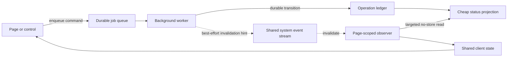

# Background-operation observation contract

**Status:** canonical architecture contract

**Owner:** platform architecture

**Backlog:** `BI-AF4D4F23`
**First implementation:** `/ops/self-upgrade`

Long-running work must not own the browser page that launched or observes it. Navigation, reload,
tab closure, and temporary loss of connectivity are normal conditions; none may cancel the durable
operation or prevent the operator from leaving its page.

This contract is the single source of truth for browser observation of queued and otherwise durable
background operations. Domain specifications define their own commands, states, and projections;
they point here for observation mechanics rather than restating them.

## Required architecture

The boundaries are mandatory:

1. **Commands enqueue; pages do not execute.** A request that starts material work returns after a
   durable queue or run record exists. The operation continues independently of the initiating
   request, component, route, or tab.
2. **The ledger is truth.** State transitions are persisted before any notification is emitted.
   Events can be lost, duplicated, or reordered without making the displayed state incorrect.
3. **Observation uses a cheap projection.** A status endpoint may read the current run, health, and
   immediately relevant control state. It must not perform network discovery, git operations,
   inference, history scans, impact analysis, or start work.
4. **Events invalidate; they do not carry authority.** A domain event tells observers to re-read the
   projection. The browser does not reconstruct durable state by replaying transient events.
5. **Reconnect rehydrates.** On initial mount and after stream reconnection, an observer reads the
   projection. Correctness never depends on having witnessed every transition.
6. **One system stream per tab.** Shell-wide system events are owned by
   `SystemEventProvider`; consumers subscribe through its in-process fan-out. A feature must not open
   another connection to the same system stream. This protects the HTTP/1.1 per-origin connection
   budget and centralizes liveness behavior.
7. **Fallback is bounded and quiet.** When the stream is unavailable, an observer may reconcile with
   exponential backoff and jitter. It pauses while the document is hidden, coalesces overlapping
   invalidations into one request, and permits only one request in flight.
8. **Navigation cancels observation, not work.** Observer-owned reads and optional calculations use
   `AbortController` and abort on unmount. Durable jobs are cancelled only through an explicit,
   authorized domain cancellation command.
9. **Transport code cannot navigate.** EventSource, WebSocket, retry, heartbeat, and fetch wrappers
   must never call `router.refresh`, `router.push`, `window.location.reload`, or otherwise own page
   lifecycle. A domain shell may perform a bounded post-deployment reload on an explicit lifecycle
   transition; that policy remains outside the transport.
10. **Optional work is stale-while-revalidate.** Expensive impact, preview, or history queries are
    user-initiated or separately scheduled. A refresh preserves the last useful result while the new
    request is pending, and navigation aborts it.

## Page refresh policy

`router.refresh()` is appropriate after a bounded user mutation when the route's server-rendered
data is the intended result and the refresh is not scheduled. It is prohibited as a timer-driven
progress mechanism, reconnect handler, liveness probe, or substitute for a status projection.

For background progress, update feature state from the targeted projection. This keeps unrelated
layouts, server components, permissions, and data fetches out of the observation loop and leaves
the browser free to navigate immediately.

## Platform primitives

| Concern | Canonical primitive |
| --- | --- |
| Shared shell connection and fan-out | `apps/web/components/platform/SystemEventProvider.tsx` |
| Resilient SSE transport | `apps/web/lib/hooks/useResilientEventSource.ts` |
| Targeted observation lifecycle | `apps/web/lib/hooks/useBackgroundOperationObserver.ts` |
| Durable system event types | `apps/web/lib/tak/agent-event-bus.ts` |
| Self-upgrade domain projection | `apps/web/lib/self-upgrade/status-snapshot.ts` |
| Self-upgrade page state | `apps/web/components/ops/SelfUpgradeLiveProvider.tsx` |
| Local-model operation ledger | `apps/web/lib/inference/local-model-operations.ts` |
| Local-model status projection | `apps/web/app/api/platform/ai/local-models/status/route.ts` |
| Local-model page observer | `apps/web/components/platform/OllamaManagement.tsx` |
| Structural regression guard | `apps/web/lib/architecture/background-operation-observation-contract.test.ts` |

Feature providers should be page- or workflow-scoped; connection ownership is shell-scoped. This
separation prevents every feature from inventing transport lifecycle while avoiding a monolithic
global store of unrelated domain state.

Local model installs are a concrete instance of this contract. The initiating action first writes
a deterministic `ScheduledJob` receipt and dispatches a concurrency-one queue event. The worker
persists progress before broadcasting `system:local-model`; the event invalidates the provider
page's narrow authenticated projection and is never treated as installed-model authority. Removing
a model remains request-bound because deletion is short, but it still reconciles the routing
projection before returning its bounded outcome.

## Failure semantics

- A durable transition succeeds even if notification delivery fails. Delivery failures are logged
  and reconciliation repairs the browser view.
- A status read failure preserves the last successful snapshot and exposes an observer error; it
  does not erase known state or alter the background job.
- Multiple events during one read produce at most one follow-up read.
- Hidden documents do not poll. Becoming visible triggers a fresh projection read.
- Degraded queue health may enable bounded reconciliation even while SSE is connected, because the
  durable ledger—not transport health—determines completion.

## Review and verification checklist

A new or changed background operation is not architecture-complete until reviewers can answer yes:

- Is initiation durably acknowledged before the request returns?
- Can the tab navigate or close without affecting the operation?
- Is there a small, capability-checked, `no-store` status projection?
- Are persisted transitions committed before best-effort event publication?
- Does the feature consume the shared system stream rather than opening a duplicate?
- Does initial mount, reconnect, and visibility restoration rehydrate from durable state?
- Are reads single-flight, abortable, backoff-limited, and paused while hidden?
- Is timer-driven `router.refresh()` absent?
- Are optional expensive reads separated and abortable?
- Do tests cover event loss/reconnect, duplicate invalidation, unmount abort, subscriber isolation,
  and notification failure after a durable write?

The structural test ratchets known violations: no new interval-driven route refresh is permitted.
The remaining promotions-page exception is explicitly tracked by `BI-B8F44BF7`; the allowlist must
shrink when that item lands and may not grow without a filed architecture-debt backlog item.

## Standards and precedent

- [WHATWG Server-Sent Events](https://html.spec.whatwg.org/multipage/server-sent-events.html):
  reconnection is part of the transport contract, but application state still requires rehydration.
- [MDN EventSource](https://developer.mozilla.org/en-US/docs/Web/API/EventSource): EventSource is a
  persistent unidirectional connection; DPF shares the system connection within a tab.
- [WHATWG HTML Page Visibility](https://html.spec.whatwg.org/multipage/interaction.html#page-visibility): hidden documents should avoid
  unnecessary background activity and reconcile when visible again.
- [AbortController](https://dom.spec.whatwg.org/#interface-abortcontroller): lifecycle-bound reads
  are explicitly cancellable.
- Kubernetes controllers' reconcile-loop model: notifications prompt reconciliation, while observed
  durable state remains authoritative. DPF adopts that separation at browser scale rather than
  treating an event stream as a durable log.
