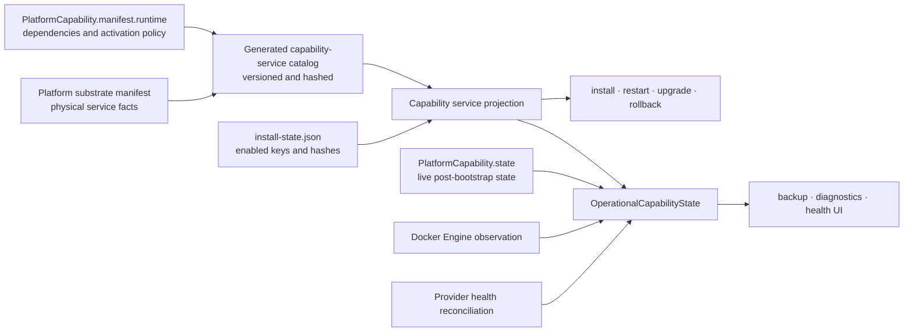

# Capability-driven runtime profiles

DPF resolves physical services from governed runtime capabilities. This keeps install, restart, transition, backup, diagnostics, and health behavior on one authority path instead of maintaining a service list in each consumer. The broader rationale and acceptance gates remain in the [platform substrate convergence design](../superpowers/specs/2026-07-17-platform-substrate-convergence-design.md#63-capability-driven-runtime-profiles--bi-psc-003); this page is the operating architecture implemented by BI-PSC-003.

## Authority flow

The checked-in [substrate manifest](../../scripts/platform-substrate-manifest.json) owns service names, Compose profiles, host support, dependencies, data ownership, backup policy, health semantics, and boundary class. Runtime capability definitions are seeded from [platform-runtime-capabilities.json](../../packages/db/data/platform-runtime-capabilities.json); their `manifest.runtime` metadata owns capability dependency and activation policy, while live `PlatformCapability.state` is the post-bootstrap enabled-state authority.

[compile-capability-service-catalog.mjs](../../scripts/compile-capability-service-catalog.mjs) joins those sources into the checked-in [generated catalog](../../scripts/capability-service-catalog.generated.json). Its catalog hash and deterministic capability-state hash bind a persisted install snapshot to the exact catalog and enabled set. [resolve-capability-compose-profiles.mjs](../../scripts/lib/resolve-capability-compose-profiles.mjs) is the lifecycle adapter; [capability-service-projection.ts](../../apps/web/lib/platform-runtime/capability-service-projection.ts) is the web adapter. Both delegate dependency closure to the same catalog contract. Unknown capabilities, conflicting hashes, duplicate authorities, and stale state fail closed.

After bootstrap, [OperationalCapabilityState](../../apps/web/lib/platform-runtime/operational-state.ts) joins the catalog projection, `install-state.json`, live database state, bounded Docker Engine observations, and reconciled provider observations. Backup, readiness, the runtime-health page, and system health consume that object rather than reconstructing topology.

## Profiles and host filtering

For locally capability-activated services, runtime profile names are mechanically derived from stable capability keys. Separately distributed and development-only boundaries retain their explicit profile contracts instead of being renamed to `runtime-*`:

| Capability | Canonical Compose profile | Local services |
| --- | --- | --- |
| `runtime:build` | `runtime-build` | `sandbox-postgres`, `sandbox-init`, `sandbox` |
| `runtime:browser-automation` | `runtime-browser-automation` | `browser-use` |
| `runtime:durable-automation` | `runtime-durable-automation` | `redis`, `redis-exporter`, `inngest` |
| `runtime:local-speech` | `runtime-local-speech` | `dpf-stt`, `dpf-tts` |
| `runtime:deep-observability` | `runtime-deep-observability` | Prometheus, Grafana, Loki, Alloy, and PostgreSQL exporter |
| `runtime:external-ai` | `runtime-external-ai` on Linux | Ollama from the Linux overlay; configured external providers remain provider-managed |
| `runtime:adp-integration` | `integrations-adp` (separate-distribution exception) | `adp` |
| `runtime:development` | `dev` and `integration-test` (lifecycle-only) | `dev-postgres`, `dev-init`, `dev-portal`, and `integration-test-harness` |

PostgreSQL, `portal-init`, and the portal are `runtime:core` and have no profile. The resolver filters service bindings by `hostPlatforms` before returning profiles and required services. The Linux overlay therefore provides a deliberate hybrid: the same `runtime:external-ai` capability can select host-local Ollama on Linux while external provider configurations remain outside Compose on every host. Linux-only `cadvisor` and `node-exporter` remain under the explicit `linux-monitoring` overlay.

Lifecycle overlays are not capability state. `promote`, `dev`, `integration-test`, `linux-monitoring`, and `linux-host-network` are explicit, allowlisted overlays. `runtime:development` has `activationPolicy: lifecycle-profile`; selecting `dev` or `integration-test` is therefore explicit lifecycle intent and does not convert development infrastructure into an install capability profile. The `runtime:adp-integration` binding is also intentionally exceptional: its `adp` service remains a `separate-distribution` boundary under the retained `integrations-adp` profile, rather than being folded into the local runtime-profile naming convention. The one-release compatibility aliases are:

- `tts` → `runtime:local-speech` → `runtime-local-speech`
- `observability-ui` → `runtime:deep-observability` → `runtime-deep-observability`

The governed [Compose wrapper](../../scripts/dpf-compose.mjs) locates the install from the canonical project root and Compose file chain, loads that install's state, resolves host-aware profiles, and replaces caller-supplied capability profiles with the canonical set. Direct attempts to enable a disabled `runtime-*` profile or an unapproved profile fail. Explicit lifecycle overlays survive this normalization. Installer, setup, start, autostart, and promotion paths call the same adapter.

## Capability transitions

Enabling resolves the full dependency closure, persists the desired catalog/state identity, starts the required services, and commits live capability state only after the signed host receipt proves the exact topology and required health. Disabling first closes work admission. If a declared work guard has queued or running work, the request returns `drain_required` with blocker counts and leaves the current projection active. Once drained, the transition stops and removes services no longer required.

The transition protocol uses an HMAC-signed, expiring envelope containing the transition identifier, prior and desired keys, hashes, profiles, and services. The promoter has the only read-write `/dpf-state` mount. The host apply script serializes transitions, writes the install snapshot atomically, reconciles explicit service deltas, observes the Compose project, and writes a signed receipt. Its journal permits a crash-safe retry. A failed reconcile or required-health check restores the previous install snapshot and service closure; an unverifiable rollback is reported as `rollback_failed`, never as success. Startup reconciliation completes or compensates pending database receipts before admitting another transition.

Health is an observation of the desired state, not permission to enable or disable a capability.

### Retiring a capability

Retirement is **declared, and it is two-phase**. A capability carries two independent axes: `state`
(`active` | `disabled`) is *enablement* — whether this install has it turned on, tracked per-install in
the database — and `lifecycle` (absent, meaning active, or `retired`) is *lifecycle* — whether the
platform still offers it at all. Conflating them would make "the operator turned it off"
indistinguishable from "the platform withdrew it", so a `retired` capability may not also be `state:
active`; the compiler refuses that contradiction.

To retire a capability:

1. **Mark it** `lifecycle: "retired"` and `state: "disabled"` in the capability seed, and **leave the
   entry in the catalog** for at least one release. Installs migrate off it on their next upgrade: the
   projection drops it from `enabledRuntimeCapabilities`, restamps the snapshot, and reports it in
   `droppedRetiredCapabilities` so the withdrawal is visible rather than silent.
2. **Only then delete the entry**, once every supported install has upgraded past step 1.

Deleting the entry without step 1 wedges every install that still has the capability enabled. Nothing
vouches for an id that is simply absent, so it cannot be told apart from a corrupt or hand-edited
snapshot — the projection fails closed, and the upgrade that would have dropped the capability is the
upgrade it blocks (BI-5AA0345E). That is the same self-wedging shape as a moved catalog hash
([install-state readiness migration](../superpowers/specs/2026-07-18-install-state-readiness-migration-design.md) §7)
and an N-1 promoter build context.

A retired capability that is still a dependency of a live one is a catalog authoring error, reported as
`retired_runtime_capability_required`, not silently projected.

## Install, upgrade, consumer assets, and rollback

The persistent snapshot stores sorted `enabledRuntimeCapabilities`, `capabilityCatalogHash`, and `capabilityStateVersion`. POSIX hosts use `$XDG_STATE_HOME/dpf/install-state.json` when `XDG_STATE_HOME` is set and otherwise `$HOME/.dpf/install-state.json`; Windows uses `%USERPROFILE%\.dpf\install-state.json`. A container reads the host directory through `/dpf-state` with the mount access appropriate to its responsibility.

A previous-release state without capability fields migrates once to the documented pre-profile compatibility set: core, build, browser automation, durable automation, local speech, deep observability, and external AI. This preserves services that previously started by default without silently enabling newer optional capabilities. The adapter expands dependencies, writes the sorted keys and hashes through a sibling temporary file and atomic rename, and subsequent resolution rejects stale catalog or state hashes. Existing optional volumes and data are not deleted by migration or deactivation; deletion requires the separate evidence-approved removal process.

A fresh installer state carries an explicit empty capability selection, so its
first projection activates only the always-on core dependency closure and
writes the current hashes. Missing capability selection means legacy state;
an explicit empty selection means a new core-only install. This distinction
prevents compatibility migration from turning every clean install into the
pre-profile full runtime.

Consumer installs no longer embed a second Compose topology. The Windows installer exports canonical release assets from the selected portal image, rejects missing, duplicate, path-escaping, unlisted, or SHA-256-mismatched files, and records a verified-asset manifest and release-version marker. Resume revalidates the installed asset bytes and version before binding `.env`. `DPF_IMAGE_TAG` and `GHCR_OWNER` are replaced atomically while unrelated operator settings and comments are preserved, so every image in `docker-compose.release.yml` resolves to the verified release version. The resolved project root and Compose file chain are canonicalized for child processes so a wrapper cannot validate one installation and execute another.

Governed self-upgrade carries the enabled capability snapshot forward and recomputes its projection against the release catalog before service replacement. The promotion recovery path copies the prior install state before mutation and restores that file atomically after a failed promotion; the governed rollback workflow owns restoration of the prior deployed release and PostgreSQL recovery point. Normal upgrades use `/ops/self-upgrade`; direct rebuilds of the live portal are not a supported upgrade path.

## Backup and health semantics

PostgreSQL remains the mandatory scheduled core backup and trial-restore target. For enabled non-core services, `backupPolicy: included` means their canonical data is already covered by the core backup owner; `separate-required` means the projection selects the target but a dedicated runner must exist. A selected `separate-required` target without a runner reports `optional_degraded`. Disabled targets receive an `optional_inactive` receipt and do not create an independent failing schedule. External provider runtimes are never local backup targets. Neo4j and Qdrant schedules remain deactivated; this capability work does not resurrect the retired BET-5 stores.

The shared health projector exposes four explicit states:

| State | Meaning and aggregate effect |
| --- | --- |
| **Required** | Desired local service. Missing or unhealthy makes aggregate health degraded. |
| **Optional — inactive** | Capability is disabled. Absence is expected and does not degrade aggregate health. |
| **Optional — degraded** | Capability is enabled but its service or required backup runner is unavailable; aggregate health is degraded. |
| **External — provider managed** | Provider configuration and reconciled provider evidence determine availability; it is not treated as a local container. |

Observations for services or providers absent from the catalog are rejected. External provider probes are bounded and failure-isolated, retain useful disabled-provider diagnostics, and cannot turn an unrelated provider batch failure into fabricated local service state. The UI uses text, icons, details, and actions in addition to theme-aware color.

## Observation and diagnostics boundary

The portal observes only containers in its own Docker Compose project. It discovers that project from the current container label, queries Docker Engine through the mounted socket with a five-second timeout and one-megabyte response limit, and maps Compose service labels plus container/health state into the operational projection. A missing hostname, missing project label, inaccessible engine, timeout, oversized response, or malformed response yields no observations; the projector then reports the applicable required or optional degradation instead of guessing.

Host diagnostics remain in installer-owned doctor and verification surfaces. They record the canonical Compose file chain, rendered configuration hash, container state, and redacted install state. Docker Engine itself is a host prerequisite and observation boundary, not a manifest service. Podman command aliases are rejected by installer preflight because the current contract requires standard Docker Engine.

## Diagnosing capability drift (BI-5ACBAC50)

Two authorities describe what is enabled: `enabledRuntimeCapabilities` in
`install-state.json`, and `PlatformCapability.state` in the database. The
transition protocol keeps them together — live state commits only after the
signed host receipt proves the topology.

When they disagree anyway, `projectCapabilityServices` throws
`capability_state_stale:<capabilityId>` and refuses to project. That is
deliberate: a projection that guessed which side to believe would hand backup,
readiness and the health UI a topology neither source claims.

The refusal used to name only the FIRST mismatch, and it happens inside the
loader that runtime health and backup readiness call — so the surfaces that would
explain the condition were the ones that could not render.
`createOperationalCapabilityState` now re-raises that error with the full
diagnosis from
[`capability-state-divergence.ts`](../../apps/web/lib/platform-runtime/capability-state-divergence.ts):
every drifted capability, and which way each drifted.

- `live-active-not-enabled` — the database says on, the install snapshot does not
  list it. Anything trusting capability state believes services are running that
  the install never provisioned. This is the shape that let an installation
  report `runtime:deep-observability` active while no collector existed, so every
  metric-backed surface had no source and the state that would have revealed it
  read healthy.
- `enabled-not-live-active` — the install enabled it, the database says disabled.
  The services may be running while the platform believes they are not, so
  nothing tends them.
- `missing-live-state` — no capability row at all.

Reporting is not repair. The diagnosis says what diverged; it never decides which
authority wins, because reconciling without first finding the writer that moved
state outside the transition protocol leaves the cause in place.

## Safe operating rules

- Change physical service facts in the substrate manifest and regenerate the catalog; do not hand-edit the generated catalog.
- Change capability dependencies or activation policy in the canonical capability seed/sync path; do not encode them in Compose.
- Change enabled state only through the governed transition API/saga. Do not set `COMPOSE_PROFILES` to bypass capability authority.
- Preserve lifecycle overlays as explicit operator intent and capability profiles as resolved state.
- Treat a stale hash, unknown capability, unknown observation, or failed receipt as an operator-visible fault. Do not infer a replacement state.
- Retire a capability in two phases — mark it `retired` and leave the entry for a release, then delete it. Deleting the entry outright wedges every install that still has it enabled.
- Use governed self-upgrade and its recovery point for release changes; do not mutate the live topology with an ad hoc Compose rebuild.
- Do not remove optional volumes, schedules, or provider records merely because a capability is inactive.

The executable conformance checks are [check-capability-compose-profiles.mjs](../../scripts/check-capability-compose-profiles.mjs), the resolver tests, installer/lifecycle contract tests, and the substrate ratchet described in [Platform substrate boundaries and budgets](platform-substrate-boundaries.md).
