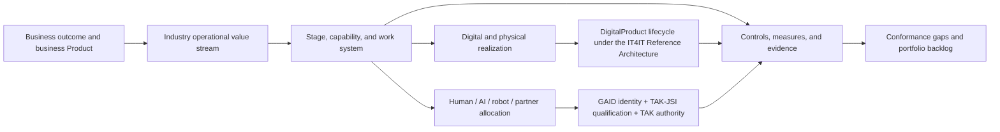
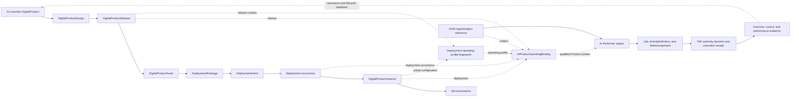

# Portfolio Aligned Agent and Workforce Operating Standard

**Identifier:** `DPF-PAAW` (supersedes `DPF-FPAW`)
**Version:** Candidate 0.2.0
**Status:** DPF normative candidate; not an adopted Open Group, ISO, OMG, NIST, or ServiceNow standard
**Normative owner:** DPF Standards Steward, a human role designated by the platform maintainer
**Design sponsor and bounded direct-source contributor attestor:** Mark Bodman
**Owned concerns:** enterprise value, portfolio placement, operating-flow, work-allocation, and
cross-standard traceability semantics
**Companion:** [Archetype Profile Catalog](four-portfolio-archetype-standard-profile-catalog.md)
**Formerly:** *Four-Portfolio Archetype and AI Workforce Operating Standard* (`DPF-FPAW`). Renamed
2026-08-29 to remove the portfolio cardinality from the standard's identity — the portfolio
decomposition is core, the count is a parameter (three in the 2020 expression, four today). The
`DPF-FPAW` identifier and the existing `FPAW-*` normative rule prefixes remain valid aliases until
the governed rename migration (see *Revision 0.2.0*, below) retires them with a published crosswalk.

IT4IT™ is a trademark of The Open Group. This document uses the mark only for accurate editorial
reference to the IT4IT Reference Architecture; no affiliation, endorsement, certification, or
trademark license is claimed.

## Naming and harmonization posture

**This is a harmonization standard, not a replacement.** A standard earns its validity and
credibility by building on established doctrine and carrying it into a new context — not by
discarding it. `DPF-PAAW` references and composes prior art rather than re-issuing it: The Open Group
IT4IT™ 3.0.1, *The Shift to Digital Product* (`W205`) and Digital Product Portfolio Management
(`G252`); TOGAF®/ArchiMate® enterprise structure; the ServiceNow Common Service Data Model (CSDM)
data shape; Porter's separation of primary from support value-chain activities; and the SFIA / O*NET
competence vocabularies — bound together through the DPF Trustworthy AI Agent Standards Family (TAK,
GAID, and TAK-JSI). PAAW adds the missing business-operating context around these; it does not throw
the baby out with the bathwater.

**The name is portfolio-*aligned*, not portfolio-*counted*.** Portfolio decomposition is the
load-bearing idea — every governed thing is placed in, and its workforce aligned to, a portfolio. The
*number* of portfolios is a versioned parameter of the operator's operating model, not part of the
standard's identity: the earlier published expression used three; the current expression uses four
(`foundational`, `manufactureAndDeliver`, `forEmployees`, `productsAndServicesSold`). A later
expression may use a different number without renaming the standard. This is why the identity is now
**P**ortfolio **A**ligned **A**gent and **W**orkforce (PAAW), not "Four-Portfolio."

**Two axes carry the model, and neither is the portfolio count.**

- **Structure — vertical (who owns and coordinates).** Portfolio alignment is the coordination
  hierarchy. This is Conway's law applied to a workforce of humans *and* agents: the coordination
  structure the work is organized into becomes the structure of what is produced. Whatever the thing,
  it is placed in a portfolio, specialized by **archetype**, and operated by an aligned
  agent-and-workforce. The **archetype** is the specialization lens that makes a generic
  portfolio-aligned structure concrete for a given business type — and, for a harmonization standard,
  the adapter that maps an industry's own reference models onto the shared spine.
- **Flow — horizontal (what produces value).** Value is produced along value streams — IT4IT for the
  Digital Product delivery flow, and archetype-specific operational value streams for the business
  flow — separated into **primary** and **support** activities after Porter. This is the shape of the
  work, held distinct from who owns it.

**Agent-and-Workforce parity is realized through TAK-JSI.** The workforce is humans and AI agents at
parity. A human performer carries competence and credentials; an AI performer carries a **TAK-JSI**
(Job-Specific Intelligence) qualification — `Defined → Assessed → Qualified` — that certifies fitness
for a specific job *without* granting live permission (TAK computes the execution-time authority
ceiling; GAID carries identity). JSI is the mechanism that lets both estates be assigned, qualified,
and coordinated as one aligned workforce; the name deliberately says **Agent *and* Workforce** so
both estates are named, not folded.

**The unit of value is the BusinessProduct.** Earlier DPF framing centered the `DigitalProduct` as
the single unit of organization for everything the platform tracks. `DPF-PAAW` harmonizes upward: the
**BusinessProduct** — a good, service, experience, access product, or public service/benefit — is the
unit, and `DigitalProduct` is the one identity within it whose offered outcome essentially depends on
software. This keeps IT4IT's Digital Product lineage exact while removing the limitation that a
business deals only in digital products.

## Revision 0.2.0 — rename and governed migration

This revision renames the standard and reframes its posture (above). To preserve traceability and
avoid one large unreviewable change, the rename lands as governed slices — each an independently
revertible pull request — and `DPF-FPAW` and the `FPAW-*` rule prefixes remain valid aliases until
their slice completes:

1. **Keystone (this change).** Standard identity, naming and harmonization posture, and the
   BusinessProduct / archetype / TAK-JSI reframing.
2. **Rule-prefix crosswalk.** Migrate the 206 `FPAW-*` normative rule identifiers to `PAAW-*` with a
   published old→new crosswalk so no existing citation is orphaned.
3. **Inbound references.** Update the specs, plans, and architecture documents that cite the standard
   or its filename, and rename the file with redirects, so link integrity is preserved.
4. **Kernel doctrine.** Reconcile the founder-kernel unit-of-value stance (`DigitalProduct` → the
   `BusinessProduct` harmonization) as a deliberate, ratified doctrine change rather than a silent one.
5. **Public-facing documentation.** Bring external-facing material up to the harmonized framing.

Slices 2–5 are tracked in the backlog under the PAAW harmonization epic.

## Abstract

This standard defines an enterprise operating-model bridge between:

- the operator-contributed four portfolio roles and Mark Bodman's direct design direction, with
  independently expressed lineage to The Open Group IT4IT™ Reference Architecture Version 3.0.1,
  *The Shift to Digital Product* (`W205`), and Digital Product Portfolio Management (`G252`), under
  the source-use controls in Section 13.1.1
- DPF's DigitalProduct lifecycle architecture, with a source-validated IT4IT 3.0.1 map covering seven
  value streams/28 stages, four functional groups/33 primary functional components, six supporting
  functions, two backbones/nine key data objects, cardinalities, and system-of-record boundaries
- the goods, services, experiences, access products, and public services/benefits an organization actually
  provides
- the industry operational value streams that create those outcomes
- human employees, contractors, partners, AI coworkers, automated systems, and robots that perform
  work
- the digital and physical resources, controls, and evidence required to perform that work safely
  and accountably

The IT4IT Reference Architecture is intentionally centered on managing the business of IT and the
lifecycle of Digital Products whose offered outcome essentially depends on software. Its source
concept may describe a service, physical item, or digital item, so it is broader than PAAW's
`DigitalProduct` software/capability identity and narrower than all PAAW BusinessProducts. This
standard adds the missing business-operating context around it. A veterinary clinic, bank,
municipality, warehouse, builder, restaurant, or salon does not sell only IT4IT-qualified Digital
Products, even when its work is deeply digitally enabled. BusinessProducts and industry value streams
therefore remain first-class and join IT4IT only through explicit composite digital touchpoints.

An AI coworker is a particularly important bridge. It is simultaneously:

1. a managed DigitalProduct with a strategy, design, build/acquire, release, deployment, operation,
   assurance, improvement, and retirement lifecycle; and
2. an identity-bearing performer that contributes capacity and work under a job qualification,
   delegated authority, oversight, and evidence contract.

Those aspects are linked, not duplicated. The digital-product record does not become an employee,
and the agent identity does not replace product lifecycle management.

## 1. Status, scope, and normative language

### 1.1 Status

`DPF-PAAW` is an independently expressed DPF candidate intended to become suitable contribution material for a
profile or extension of the IT4IT Reference Architecture. It is not an assertion that The Open Group or any other cited body has
reviewed, adopted, endorsed, or certified it.

Contributor provenance is material design evidence, but it does not turn DPF expression into Open
Group Material or make acknowledgement credit a license to a collective publication. Section 13.1.1
keeps contributor-supplied source material, published standards, attribution, trademark use, and
external conformance as separate decisions.

The key words **MUST**, **MUST NOT**, **SHOULD**, **SHOULD NOT**, and **MAY** indicate requirement
strength in the sense of [BCP 14](https://www.rfc-editor.org/info/bcp14) when, and only when, they
appear in bold capitals.

### 1.2 In scope

This standard specifies:

- an original enterprise operating-model metamodel
- four-portfolio placement and dependency rules
- business Product, Offering, DigitalProduct, and service boundaries
- operational value-stream and stage contracts across industries
- activity, job, role, skill, performer, allocation, capacity, and physical-work semantics
- human-AI-robot-partner augmentation and substitution patterns
- the dual DigitalProduct/performer treatment of an AI coworker
- composition of shared, category, leaf-archetype, organization, and jurisdiction profiles
- mapping to the IT4IT Reference Architecture, CSDM, architecture/workflow, AI-governance,
  workforce, physical-operation, and
  industry standards
- conformance claims, evidence, and minute-detail gap analysis

### 1.3 Out of scope

This standard does not:

- redefine the seven IT4IT Reference Architecture v3 value streams, functional components, data objects, or licensed
  conformance criteria
- define a universal ontology of every occupation; TAK-JSI and referenced occupation sources own
  job-qualification inputs
- define live agent authorization, global agent identity, or job qualification; TAK, GAID, and
  TAK-JSI own those subjects
- replace BPMN, CMMN, DMN, ArchiMate, BACM, VDML, ISA-95, GS1, or industry transaction standards
- require every business product, task, facility, asset, or person to be represented as a
  DigitalProduct
- prescribe one database schema, product platform, model provider, process engine, or CMDB
- imply that a mapped or derived result is an external certification

## 2. Design goals and invariants

The standard exists to make the following questions answerable from one traceable model:

1. What value does the organization promise, to whom, and through which business Product or Offer?
2. Which portfolio owns each governed aspect and which other portfolios does it depend on?
3. Through which industry-recognizable value stream and stages is the outcome created?
4. Which capabilities and work units realize each stage?
5. Which human, AI, robot, automated, or partner performers may do that work, under which job,
   skill, authority, supervision, and evidence conditions?
6. Which DigitalProducts and physical resources enable the work, and where do their separate
   lifecycles connect?
7. What actually happened, did it achieve the intended outcome, and what gaps remain?

The following invariants apply throughout:

- **Portfolio role is not item type.** A portfolio says why an aspect is funded and governed; it
  does not turn every member into a DigitalProduct.
- **Business Product is not DigitalProduct.** A business Product may be physical, digital, service,
  experience, access, entitlement, public benefit, or hybrid.
- **Value stream is not process.** A value stream describes value-state transitions; processes,
  cases, decisions, and physical tasks realize those transitions.
- **Capability is not skill.** A capability belongs to an organization; a skill or competence is
  demonstrated by a performer in a context.
- **Job is not incumbent.** A job bundles outcomes and accountabilities; a person or AI coworker is
  one possible performer.
- **Role is not performer.** A role is contextual responsibility; a performer is an identity-bearing
  subject eligible for an assignment.
- **Digital command is not physical completion.** Appropriate physical, human, sensor, custody, or
  transaction evidence is required.
- **Capability is not authority.** A model, human, partner, or robot may be able to act without being
  permitted or qualified to do so.
- **Evidence is not certification.** A local mapping or assessment states only what its declared
  method and verifier support.
- **One concern, one authority.** The standard links existing canonical records; it does not create
  a second home for commerce, the IT4IT Reference Architecture, agent identity, runtime policy, job qualification, or archetypes.

## 3. Standards position and ownership

### 3.1 The bridge in one view



The diagram is a textual summary, not a new record hierarchy. It shows that the IT4IT Reference Architecture and the agent
standards family join the business operating model at different, explicit seams.

### 3.2 Canonical ownership map

| Concern | Normative or canonical owner | `DPF-FPAW` relationship |
|---|---|---|
| Business Product, Offer, catalog, and sale truth | DPF commercial catalog | References; does not redefine transaction truth |
| DigitalProduct lifecycle | DPF product/design/release/asset/package/deployment/instance/service/offer/agreement authorities; IT4IT 3.0.1 owns its external concepts | Applies the source-validated Section 13.3 map at explicit digital touchpoints without asserting external conformance |
| Four portfolio roots | Mark Bodman's contributor-attested design direction plus DPF portfolio registry; published G252 expression remains separately governed | Generalizes governed membership across business and workforce aspects |
| Operational value creation | This standard plus archetype profile catalog | Defines value-flow, stage, work, and evidence contracts |
| Enterprise architecture view | ArchiMate and DPF EA substrate | Projects views; does not replace the source metamodel |
| Processes, cases, and decisions | BPMN, CMMN, DMN or equivalent | References execution semantics |
| AI coworker identity and claims | GAID | Requires a stable identity reference |
| AI job qualification | TAK-JSI | Requires a current scoped qualification when applicable |
| AI runtime authority and evidence | TAK | Requires execution-time enforcement and receipts |
| Profession doctrine | WSID or equivalent | References versioned craft and decision doctrine |
| Archetype inventory | `ALL_ARCHETYPES` in storefront templates | Profiles are derived/checkable; they do not own the catalog |
| Work/backlog status | Existing domain work records and `BacklogItem` | Links; never duplicates work status inside a gap |

### 3.3 Relationship vocabulary

Cross-standard mappings **MUST** use one of these relationships:

| Relationship | Meaning |
|---|---|
| `adopts` | Uses an external artifact directly for the concern it already defines |
| `profiles` | Narrows or composes an external artifact without changing its core semantics |
| `augments` | Adds a missing relationship or control outside the external artifact's scope |
| `maps-to` | Declares a correspondence without asserting semantic identity or conformance |
| `adjacent` | Addresses a related layer and remains independently governed |
| `out-of-scope` | Must remain with the cited authority and is not redefined here |

Concept mappings **SHOULD** additionally use the SKOS-style relations `exact`, `close`, `broad`,
`narrow`, or `related`, with rationale, source and target versions, confidence, reviewer, and date.
The relation is always read from the external source concept to the FPAW target: `broad` means the
target is broader than the source, while `narrow` means the target is narrower than the source. A
polyhierarchical or composite projection whose direction cannot be stated without qualification uses
`related` plus explicit component edges; it **MUST NOT** use `broad` or `narrow` as shorthand for
"the source covers more/fewer things." An `exact` mapping **MUST NOT** be used merely because two
labels look alike.

## 4. Resolution model and trace spine

`DPF-FPAW` uses six cumulative resolution depths. They provide IT4IT-caliber specificity without
copying that architecture's metamodel. They are orthogonal to IT4IT Levels 1–5 and **MUST NOT** be
reported as numeric equivalents; Section 13.3 records only a qualified view-to-view relationship.

| Level | View | Required content |
|---|---|---|
| `R0` Enterprise context | Why and for whom | Organization, mission, stakeholders, ecosystem, objectives, jurisdictions, external obligations |
| `R1` Portfolio landscape | What is governed and funded | Four roots, product lines, primary placements, dependencies, owners, current and target posture |
| `R2` Value flow | How stakeholder value changes | Operational value streams, stages, triggers, incoming/outgoing value states, handoffs, variants, capabilities |
| `R3` Work system | Who/what performs the flow | Work units, jobs, roles, skills, allocation patterns, authority, physical/digital resources, controls, exceptions |
| `R4` Implementation bindings | Which mechanisms realize it | DPF records, applications, DigitalProducts, services, facilities, partners, interfaces, external-standard mappings |
| `R5` Operational evidence | What happened and whether it worked | Occurrences, decisions, queues, capacity, custody, actions, outcomes, metrics, evidence, incidents, conformance, gaps |

Every refinement **MUST** trace upward. An `R3`–`R5` object without an `R0`–`R2` purpose is orphaned;
an `R0`–`R2` promise without an `R3`–`R5` realization is unsubstantiated.

The complete trace spine is:

```text
Organization
  → objective / outcome
  → business Product / Offering
  → operational value stream
  → stage
  → capability
  → operating flow / work unit
  → allocation
  → performer + job/role + skill/qualification
  → digital/physical/information resource
  → authority/control
  → evidence/measure/incident
  → conformance finding/gap
  → primary portfolio and canonical backlog work
```

An implementation **MAY** materialize this as relations, projections, resolvable references, or an
exchange graph. It **MUST NOT** infer a missing semantic link solely from a matching name.

### 4.1 Applicability and consequence predicates

Terms that gate requirements are governed data, not discretionary prose:

| Predicate/axis | Controlled values | Decision rule |
|---|---|---|
| applicability | `applicable`, `not-applicable`, `undetermined` | `not-applicable` requires source, scope-specific rationale, evidence, reviewer, and review date; `undetermined` cannot satisfy an applicable **MUST** |
| consequence class | `ordinary`, `material`, `consequential`, `safety-critical`, `unknown` | select the highest triggered class; `unknown` cannot be used to bypass a control |
| load-bearing | `true`, `false`, `undetermined` | true when omission or failure prevents Stage acceptance, breaches a commitment/control, or materially degrades an Outcome |

`material` means a change or work item crosses a profile-declared threshold for stakeholder outcome,
law/rights, safety, financial exposure, privacy/security, service commitment, identity/authority,
capacity, or reversibility. `consequential` means it can commit funds or obligations, determine rights
or eligibility, affect health/safety, alter an authoritative record, disclose protected data, control
physical equipment, or cause a difficult-to-reverse state change. A profile **MUST** publish its
thresholds and source authority. When classification is disputed or evidence is missing, the record
remains `undetermined` or `unknown`, the related requirement is `not-assessed`, and a Gap is opened.

## 5. Original conceptual metamodel

The concepts below are logical contracts. They do not imply one new database table per row.

| Concept | Definition | Minimum identifying attributes |
|---|---|---|
| `Organization` | Legal or operating authority that owns objectives, products, portfolios, accountability, and evidence | stable ID, legal/operating scope, owner, effective period |
| `Principal` | Enduring, issuer- or resolver-recognized identity anchor for an organization, natural person, governed team, GAID AgentSubject, deterministic automation, or authorized robot; distinct from every contextual role, job, performer projection, assignment, and runtime instance | stable ID, `principalKind`, authoritative namespace/resolver, issuer or owning authority, organization relationship, status, effective period |
| `Stakeholder` | Person, group, organization, community, animal/patient proxy, or public beneficiary affected by value or risk | stable ID/class, relationship, needs, affected-party status |
| `Objective` | Governed intent or target the Organization chooses to pursue; distinct from observed achievement | ID/version, statement, owner, measures/targets, effective period, source |
| `Outcome` | Measurable change intended for a stakeholder or the organization | ID/version, statement, beneficiary, measure, target, acceptance rule, time horizon |
| `OutcomeObservation` | Append-only observation about progress toward or achievement of an intended Outcome; it is evidence, not the intended state itself | ID, Outcome reference, observed value/state, time, method, provenance, confidence, verifier |
| `PortfolioDefinition` | Stable meaning and governance rule for a portfolio root | key, name, placement rule, allowed aspects, owner, version |
| `Portfolio` | Managed, effective-dated collection of item references under one definition | ID, definition, scope, owner, objectives, period |
| `AspectKindDefinition` | Versioned registry entry that makes a GovernedAspect concern computable and prevents arbitrary sibling labels | kind key/version, permitted canonical target kinds, owning concern, boundary predicate, incompatible/overlap rules, lifecycle and merge policy, owner, effective period |
| `GovernedAspect` | Stable, versioned projection of one canonical target for one non-overlapping concern, lifecycle, and accountability boundary; it prevents arbitrary labels from evading exact-one placement | aspect ID/version, canonical target ID/type, aspect kind, owning concern, boundary/non-overlap rule, owner, sibling relations, effective period, merge/supersession history |
| `PortfolioItemReference` | Placement of a GovernedAspect, not a duplicate business object or an invented aspect label | aspect ID/version, canonical target reference, primary root, rationale, evidence, period |
| `BusinessProduct` | Good, service, experience, access right, entitlement, public service/benefit, or hybrid offered to a beneficiary | ID, type/form, owner, value proposition, lifecycle |
| `ServiceDefinition` | Stable description of a capability or outcome supplied to consumers; distinct from a BusinessProduct whose form is service, the terms of an Offering, and any runtime/service instance | ID/version, outcome/capability, provider, consumers, commitments, realization links |
| `CoworkerService` | Specialized ServiceDefinition for governed work outcomes supplied through one or more coworker Products/Performers; distinct from its offer, accepted engagement, assignment, and runtime instance | ID/version, outcome/activity scope, provider, eligible consumers, Product/Performer realization links, authority/qualification prerequisites |
| `Offering` | Abstract, typed terms envelope for potential consumption; it does not itself determine commercial sale truth, service-operation truth, or accepted engagement | ID/version, `offerKind`, provider, typed target reference, terms, channel, eligibility, commitment, effective period |
| `BusinessProductOffering` | Commercial or public-value configuration of a BusinessProduct | Offering ID, BusinessProduct ID, price/funding/eligibility, catalog and sale references |
| `OperationalServiceOffering` | Operational commitments for a ServiceDefinition or DigitalProduct-backed service | Offering ID, ServiceDefinition/DigitalProduct reference, SLO, support, entitlement and instance policy |
| `CoworkerServiceOffering` | Terms under which a coworker service may be engaged; a DPF mapping specializes this as `CoworkerOffer` | Offering ID, CoworkerService reference, authority/qualification prerequisites, commercial/approval terms |
| `ConsumptionAgreement` | Accepted, effective-dated terms under one Offering between one provider and one consumer Principal; kinds include transaction, subscription, service-contract, chargeback-contract, and coworker engagement | ID/version, agreement kind, Offering version, provider, consumer, accepted terms, price/showback rule, commitments, start/end, status, evidence |
| `Entitlement` | Effective right of one Principal to request, access, use, or administer an Offering, service, or instance; distinct from acceptance, fulfillment, and observed usage | ID/version, entitled Principal, target, source agreement/policy, scope, constraints, start/end, status, evidence |
| `DigitalProduct` | Governed digital capability or product with a digital lifecycle | ID, owner, value, lifecycle, versions/releases, service bindings |
| `DigitalProductDesign` | Versioned logical design and requirement/architecture baseline for one DigitalProduct; it groups intended components, qualities, controls, and realization constraints without being a release or deployment | ID/version, DigitalProduct, requirements, architecture/design artifacts, intended components, quality/control constraints, owner, effective period |
| `DigitalProductRelease` | Approved, versioned composition of DigitalProduct assets/packages intended for defined environments and consumers; distinct from a deployment operating profile | ID/version, DigitalProduct, composition, approval/status, effective period |
| `DigitalProductAsset` | Versioned software, model, prompt, skill, tool definition, dataset, policy bundle, content, or other controlled digital constituent used by a design or release | ID/version, asset kind, owner, provenance, integrity/digest, dependencies, lifecycle, effective period |
| `DeploymentPackage` | Immutable or content-addressed deployable artifact assembled from one release composition; distinct from its source assets and every deployment | ID/version/digest, DigitalProductRelease, included asset versions, target compatibility, provenance, rollback identity |
| `DeploymentIntent` | Desired, approved configuration and resource state for one prospective or changed DigitalProduct instance | ID/version, DigitalProductRelease, consumer/environment, desired topology/configuration, resource and policy requirements, source request/agreement, approval, effective period |
| `Deployment` | Attributable execution record that applies one DeploymentIntent with one or more DeploymentPackages to an environment to create, update, rollback, or remove an instance; it is an occurrence, not the resulting runtime | ID, intent, package versions/digests, environment, action, actor/automation, start/end, result, rollback, evidence |
| `DigitalProductInstance` | Actual deployed or provisioned runtime realization of one effective DeploymentIntent and DigitalProductRelease; it may expose several service instances/endpoints and depend on other product instances | ID/version, DeploymentIntent, DigitalProductRelease, creating/current Deployment, environment/location, actual topology/configuration, package/dependency versions, status, owner, observed period |
| `ServiceInstance` | Operational realization of one ServiceDefinition, exposed to consumers or other systems and realized by one or more DigitalProductInstances, resources, or partner services | ID/version, ServiceDefinition, realizing instances/resources, environment/region, endpoints, operational state, owner, service/dependency evidence |
| `UsageOccurrence` | One measured act of access, invocation, consumption, or capacity use under a ConsumptionAgreement or Entitlement; distinct from the work performed and from the resulting OutcomeObservation | ID, agreement/entitlement, Offering/service/instance target, consumer, quantity/unit, start/end, charge/showback reference, evidence |
| `ValueStream` | End-to-end flow from a stakeholder trigger to an accepted outcome | ID, beneficiary, trigger, outcome, stages, owner, profile/version |
| `Stage` | Measurable value-state transition within a ValueStream | stable key, input/output state, acceptance, owner, evidence |
| `Capability` | Repeatable organizational ability needed to achieve an outcome | ID, definition, owner, maturity/evidence |
| `OperatingFlow` | Behavioral realization of work: process, case, decision, task network, or physical operation | ID, kind, inputs/outputs, controls, version |
| `ActivityDefinition` | Stable, qualification-addressable responsibility within a Job, Stage, OperatingFlow, or WorkUnitDefinition; it is not an occurrence of work | ID/version, owning context, intended outcome, boundaries, mappings |
| `WorkUnitDefinition` | Reusable contract for a coherent unit of work | ID/version, Stage, outcome, inputs/outputs, execution-media set/connectivity, requirements, acceptance/evidence, exceptions |
| `WorkOccurrence` | One demanded instance of a WorkUnitDefinition | ID, state, scope, times, assignments, evidence, exceptions |
| `Job` | Stable bundle of outcomes, accountabilities, and work responsibilities | ID/version, purpose, activities, accountable owner, constraints |
| `Role` | Responsibility in a stage, flow, or work occurrence | ID, context, responsibilities, decision rights |
| `Occupation` | External or internal classification of similar jobs | stable referenced ID, source/version, mappings |
| `SkillConcept` | Versioned human- or machine-applicable ability concept from a governed internal or external vocabulary | concept ID/version, definition, source, mappings |
| `SkillRequirement` | Required proficiency in a SkillConcept for a Job, ActivityDefinition, or WorkUnitDefinition | concept ID/version, level, evidence policy, freshness, context |
| `CompetenceAssertion` | Evidence-backed assertion that a Performer has a proficiency or capability relevant to a SkillRequirement | performer, skill concept/version, level, scope, evidence, issuer/verifier, confidence, freshness |
| `Performer` | Identity-bearing human, AI coworker, authorized robot, automated system, or partner eligible for work | Principal ID, kind, operating status, authority/qualification refs |
| `AgentSubjectReference` | Typed reference to the enduring AI-agent subject whose identity semantics are owned by GAID | GAID/Principal ID, GAID version, resolver, validity, operating-profile context |
| `AIProductOperatingBinding` | Versioned temporal binding that states which GAID subject operates under which AI-coworker DigitalProductRelease and operating-profile fingerprint; the release/deployment realizes the Product while the subject performs under the binding | ID/version, organization scope, DigitalProductRelease, operating-profile fingerprint, AgentSubjectReference, deployment/instance when applicable, role, binding state, TAK-JSI qualification reference, compatibility-relation references, effective period, owner, evidence |
| `AIProductBindingCompatibility` | Pairwise, effective-dated assessment governing whether two operating bindings of the same subject/role may be active concurrently | ID/version, canonical ordered binding pair, overlap scope, disposition, segregation constraints when applicable, evaluator, evidence, effective period |
| `Resource` | Digital, physical, informational, spatial, material, inventory, equipment, facility, or supplier resource used by work | ID/type, owner/custodian, state, location, lifecycle |
| `AllocationDecision` | Governed eligibility-then-suitability decision that applies one allocation pattern to one WorkOccurrence and owns the complete atomic assignment set | ID/version, WorkOccurrence, pattern, `1..*` WorkAssignments, Collaboration when required, eligibility/suitability evidence, owner/decision time, effective period |
| `WorkAssignment` | Atomic governed binding of exactly one work occurrence, one responsibility, one Performer, and one AllocationDecision for an effective period | work, responsibility, performer, allocation-decision reference, authority, supervision, fallback, evidence expectation, effective period |
| `WorkforceTransitionAssessment` | Versioned baseline-to-target decision for augmentation, substitution, redeployment, or deliberate human-only retention at WorkUnitDefinition granularity | ID/version, scope, immutable baseline/target allocation snapshots, retained/transferred/retired/new activity partitions, affected Jobs/SkillRequirements/Principals, reskilling/redeployment, controlled decision state, effective period, owner, evidence, rollback/fallback |
| `AccountabilityAssignment` | Human or organizational accountability that persists regardless of executor | scope, accountable Principal, decision rights, period |
| `Collaboration` | Structured handoff or joint execution over one WorkOccurrence and `2..*` atomic WorkAssignments | ID/version, WorkOccurrence, assignment references, sequence/parallelism, handoffs, reconciliation, shared acceptance, evidence, escalation |
| `Control` | Obligation, permission, prohibition, approval, segregation, safety, or escalation rule | ID, source, applicability, owner, enforcement, evidence |
| `Metric` | Defined value, flow, quality, economics, capacity, safety, or risk measure | ID, formula, unit, source, target, freshness |
| `Evidence` | Attributable observation supporting a claim about work, outcome, control, or conformance | ID, claim, provenance, subject, time, integrity, retention |
| `Incident` | Undesired event, failure, harm, exception, or control breach | ID, affected scope, severity, cause status, response, evidence |
| `SourceCitation` | Identifier-level reference used only for research orientation, never as normative, mapping, or conformance evidence | ID, owner, title/version, canonical URI or reproducible owner-approved resolver, access date, orientation scope |
| `SourceUseDecision` | Source- and use-specific determination of whether material may be accessed or incorporated for a declared purpose | ID, source/version/locator, intended use, status, rights basis, permitted/prohibited actions, evidence, reviewer, dates |
| `ContributorAttestation` | Authenticated or signed provenance and permission statement for a contributor's specifically identified original or separable contribution | ID, contributor/member/rightsholder, work and exact scope, contribution kind, rights basis, permissions, exclusions, evidence, authentication/signature/date |
| `Profile` | Versioned composition of core rules, facets, vocabulary, mappings, and constraints | ID/version, applicability, inherited facets, requirements, owner |
| `ConformanceClaim` | Scoped assertion against declared standard/profile requirements | scope, versions, requested/achieved depth, statuses, evidence, verifier, date |
| `Gap` | Evidence-backed delta between an applicable target and observed state, with verification state independent from remediation-work status | ID, target, observation, type, dimension, impact, portfolio, verification state, closure evidence, work ref or disposition rationale |

`principalKind` uses exactly `organization`, `person`, `team`, `agent-subject`,
`deterministic-automation`, or `authorized-robot` in the core vocabulary. A versioned Profile may add
a namespaced kind only when it preserves the identity and authority invariants below. A partner is an
organization relationship, not a second identity kind.

Current DPF persistence still carries contextual values in `Principal.kind`. Until that substrate is
converged, its lossless FPAW adapter **MUST** emit both the source value and the canonical kind/role:

| Current DPF value | FPAW projection rule |
|---|---|
| `human` | `person` |
| `agent` | `agent-subject` only when the Principal resolves through a GAID alias/reference; otherwise create an identity Gap |
| `customer` | resolve the enduring party as `person` or `organization`; preserve `customer` as a contextual relationship/Role |
| `partner` | resolve the enduring party as `person` or `organization`; preserve partner enrollment/contract as an organization relationship/Role |

An additional runtime value **MUST** have an explicit lossless mapping or a namespaced Profile
extension. Changing customer/partner context **MUST NOT** re-identify the Principal.

### 5.1 Relationship invariants

- An in-scope governed aspect **MUST** have exactly one active primary portfolio placement for an
  effective period or a `missing` `GDM-PORTFOLIO` Gap whose observed placement is `unclassified`, and
  **MUST NOT** have more than one. One real-world thing may expose several explicitly related aspects.
- A GovernedAspect **MUST** resolve to one canonical target, declare its owning concern, lifecycle,
  accountability, and non-overlap boundary, relate itself to sibling aspects, and retain
  merge/supersession history. An arbitrary label **MUST NOT** create a new aspect or evade the
  exact-one-placement invariant.
- An active GovernedAspect **MUST** resolve its kind through one effective AspectKindDefinition. For
  overlapping effective periods, `(organizationScope, canonicalTargetRef, aspectKind,
  owningConcern)` is unique, and `owningConcern` **MUST** equal the resolved definition. Two sibling
  kinds on the same target are permitted only when both
  definitions prove their boundary predicates disjoint; otherwise they are duplicate/overlap Gaps.
- Every active Objective **MUST** relate to one or more intended Outcomes. An Outcome may have zero or
  more OutcomeObservations; an observation **MUST NOT** replace the target or imply satisfaction
  without the Outcome's declared measure, acceptance rule, and verifier.
- A BusinessProduct **MUST** bind to at least one ValueStream and intended Outcome.
- A ValueStream **MUST** begin with a stakeholder trigger and end with an accepted stakeholder
  outcome.
- A Stage **MUST** require one or more Capabilities and identify its work realization or a justified
  gap.
- Every Organization **MUST** resolve to an `organization` Principal when it owns accountability,
  authority, or governed records. Its affiliated people, teams, and AgentSubjects remain separate
  Principals; affiliation never merges their identities.
- Every Performer **MUST** resolve to exactly one Principal for its scoped effective period. One
  Principal **MAY** have multiple contextual Performer projections over time; a new role, job,
  assignment, deployment, or runtime instance **MUST NOT** create a second enduring identity.
- A Team Principal exists only when the team has a stable identity, governed membership, owner or
  sponsor, accountable human or Organization Principal, authority boundary, lifecycle, and effective
  period. An ad hoc human/AI grouping remains Collaboration over its member Principals.
- An `agent-subject` Principal **MUST** bind through AgentSubjectReference to exactly one authoritative
  GAID AgentSubject for the FPAW identity scope and effective period. GAID owns that subject identity;
  FPAW **MUST NOT** mint a competing AgentSubject or treat a deployment/runtime instance as one.
- Principal identity alone **MUST NOT** grant work eligibility, qualification, accountability, or
  action authority. Those rights arise only from effective assignments, qualifications, policy, and
  control evidence. AccountabilityAssignment remains human or organizational; a Team Principal can
  receive it only when its accountable human or Organization Principal is explicit.
- A consequential WorkOccurrence **MUST** have an accountable Principal even when the executor is
  AI, robotic, automated, or external.
- A WorkAssignment **MUST** bind exactly one WorkOccurrence, one ActivityDefinition-or-Role
  responsibility, one Performer, and one AllocationDecision, plus authority,
  qualification/eligibility, supervision, fallback, evidence expectations, and an effective period;
  an assignee ID alone is insufficient. Joint work **MUST** use the AllocationDecision's one
  Collaboration containing `2..*` atomic WorkAssignments.
- A qualification or assignment that names an activity **MUST** resolve that name to an
  ActivityDefinition and state whether any external activity mapping is exact, close, broad, narrow,
  or merely related.
- A SkillRequirement **MUST** reference a SkillConcept; claimed performer proficiency **MUST** be a
  separate CompetenceAssertion with provenance, verifier, scope, confidence, and freshness.
- A DigitalProduct relation to a BusinessProduct, Stage, or WorkUnitDefinition **MUST** be explicit
  and typed.
- A Gap **MUST** carry its own verification lifecycle and **MUST NOT** duplicate remediation-work
  status. Planned remediation links canonical work; detection/triage may instead carry an explicit
  disposition rationale until remediation is authorized.
- A profile or mapping **MUST** retain source version and effective date; silent inheritance from a
  newer source version is prohibited.
- A SourceUseDecision **MUST** bind one source artifact or separately supplied contribution to one
  intended use. Permission for a contributor-origin source **MUST NOT** be inherited by the compiled
  publication, another contributor's expression, or another use.

### 5.2 Core aspect-kind registry

The base `aspectKind` set is the registry `FPAW-ASPECT-KINDS@0.1.0`. Every row below expands to a
complete AspectKindDefinition record with `registryVersion = 0.1.0`, `owner = DPF Standards
Steward`, `effectiveFrom = 2026-08-01`, and `effectiveTo = null`. These common values are data, not
defaults that an implementation may omit. A Profile may add only a versioned, namespaced record with
the same fields and predicate grammar.

The predicate grammar is deliberately small and deterministic: `eq(field,value)`,
`in(field,{values})`, `and(predicate,...)`, and `cardinality(field,min,max)`. Operands use the exact
field keys shown below. A predicate engine **MUST** reject an unknown operator, field, target kind, or
concern key rather than treating it as free text.

| Kind key | Permitted target-kind IDs | Owning concern key | Predicate ID and expression | Uniqueness discriminator | Incompatible kind set | Merge-policy key |
|---|---|---|---|---|---|---|
| `business-product` | `{BusinessProduct}` | `promised-value-lifecycle` | `AKP-BP-001 = eq(targetType,BusinessProduct)` | `targetId,targetVersion` | `{}` | `source-lineage-compatible` |
| `service-definition` | `{ServiceDefinition,CoworkerService}` | `supplied-outcome-commitment` | `AKP-SD-001 = in(targetType,{ServiceDefinition,CoworkerService})` | `targetId,targetVersion` | `{}` | `source-lineage-compatible` |
| `offering` | `{Offering}` | `terms-channel-eligibility` | `AKP-OF-001 = eq(targetType,Offering)` | `targetId,targetVersion` | `{}` | `identity-preserving-only` |
| `performer` | `{Principal}` | `performer-capacity-authority` | `AKP-PF-001 = eq(targetType,Principal)` | `targetId,performerContextKey,assignmentAuthorityScope` | `{}` | `scope-disjoint-only` |
| `workforce-structure` | `{Job,Role,SkillRequirement,AccountabilityAssignment}` | `workforce-structure-governance` | `AKP-WS-001 = in(targetType,{Job,Role,SkillRequirement,AccountabilityAssignment})` | `targetId,targetVersion` | `{}` | `source-lineage-compatible` |
| `digital-product-lifecycle` | `{DigitalProduct}` | `digital-product-lifecycle` | `AKP-DP-001 = eq(targetType,DigitalProduct)` | `targetId,targetVersion` | `{}` | `source-lineage-compatible` |
| `operating-capability` | `{Capability,OperatingFlow}` | `dedicated-production-ability` | `AKP-OC-001 = and(in(targetType,{Capability,OperatingFlow}),eq(reuseScope,dedicated))` | `targetId,targetVersion,dedicatedProductOrStageScope` | `{shared-foundation}` | `dedicated-scope-disjoint` |
| `operating-resource` | `{Resource}` | `dedicated-resource-custody` | `AKP-OR-001 = and(eq(targetType,Resource),eq(reuseScope,dedicated))` | `targetId,targetVersion,dedicatedProductOrStageScope` | `{shared-foundation}` | `custody-lineage-compatible` |
| `shared-foundation` | `{Capability,OperatingFlow,Resource,ServiceDefinition,DigitalProduct}` | `cross-product-foundation` | `AKP-SF-001 = and(in(targetType,{Capability,OperatingFlow,Resource,ServiceDefinition,DigitalProduct}),eq(reuseScope,shared),cardinality(consumerScope,2,*))` | `targetId,targetVersion,consumerScope` | `{operating-capability,operating-resource}` | `shared-scope-disjoint` |
| `control-governance` | `{Control,ServiceDefinition}` | `policy-authority-assurance` | `AKP-CG-001 = in(targetType,{Control,ServiceDefinition})` | `targetId,targetVersion,authoritySource,controlObjective` | `{}` | `authority-objective-compatible` |

Active uniqueness is a collision predicate, not string equality over a serialized tuple. Two aspects
collide when organization scope, kind key, target ID/version, and every scalar discriminator are
equal; their half-open effective periods overlap; and every set-valued discriminator has a non-empty
intersection. An open interval end is positive infinity. The set-valued keys are
`assignmentAuthorityScope`, `dedicatedProductOrStageScope`, and `consumerScope`; their members are
canonical IDs, not labels. Thus `{A,B}` and `{B,C}` collide through `B`. Pairwise-disjoint scope sets
do not collide. The row predicate, discriminator, incompatibility set, and merge-policy key are
normative data.

For two different kinds, an incompatibility-set match is evaluated when their organization, target,
effective period, and applicable set-valued scopes overlap under the same rules. Boundary predicates
are evaluated over overlapping effective periods; partially overlapping scopes **MUST NOT** evade a
duplicate/overlap finding by using different serialized set values.

The merge policies have exact outcomes: `identity-preserving-only` forbids merging distinct source
identities; `source-lineage-compatible` and `custody-lineage-compatible` require a common declared
successor plus compatible target kind, owner/custodian, and scope; `scope-disjoint-only`,
`dedicated-scope-disjoint`, and `shared-scope-disjoint` require pairwise-disjoint scopes before a
successor is formed; `authority-objective-compatible` additionally requires equal authority source
and control objective. An incompatible pair or failed predicate creates a duplicate/overlap Gap.
Split creates versioned siblings with disjoint scopes and a common predecessor; merge creates one
successor and supersedes every predecessor. Neither operation may rewrite historical placements or
evidence.

## 6. Four-portfolio enterprise model

The four roots remain stable. They are grounded in Mark Bodman's contributor-attested design
direction and DPF's canonical portfolio registry. G252 is recorded only as bibliographic design
lineage; the published guide and the contributor-origin concepts are distinct sources under Section 13.1.1.
`DPF-FPAW` calls the roots portfolio **roles** because membership describes governance purpose, not
intrinsic object type. Exact published-wording or conformance equivalence remains unasserted.

| Canonical FPAW exchange key | Display name | Primary placement question | Representative governed aspects |
|---|---|---|---|
| `products_and_services_sold` | Goods and Services for Sale | Is this aspect part of the value promise transferred, sold, granted, or delivered to an external customer or beneficiary? | goods, services, experiences, access, entitlements, public services, subscriptions, DigitalProducts sold externally |
| `for_employees` | Workforce | Is this contributor capacity, a job/role/skill/authority construct, or a BusinessProduct/ServiceDefinition intended primarily for contributors? | employees, contractors, partners, AI coworkers, authorized robots, internal employee services and tools |
| `manufacturing_and_delivery` | Manufacturing and Delivery | Is this a specialized production or fulfillment capability/resource used directly to make or deliver external value? | factories, kitchens, field fleets, warehouses, delivery workflows, production tooling, CI/CD, specialized operational technology |
| `foundational` | Foundational | Is this a reusable cross-product foundation used broadly across the enterprise? | compute, network, shared data, identity, security, governance, shared facilities, common platforms and infrastructure |

The snake_case keys above are the target exchange vocabulary of this standard. Current DPF runtime
types and persisted `PortfolioDecomposition` values still use camelCase keys. Until the adapter
convergence in Section 18 lands, an implementation **MUST** publish an explicit, lossless mapping
between those current keys and this target vocabulary; neither spelling may be silently presented as
already authoritative for the other surface.

The current DPF adapter mapping is:

| Current runtime/persistence key | FPAW exchange key |
|---|---|
| `productsAndServicesSold` | `products_and_services_sold` |
| `forEmployees` | `for_employees` |
| `manufactureAndDeliver` | `manufacturing_and_delivery` |
| `foundational` | `foundational` |

This table defines serialization equivalence only. It does not rename the current source enum, and
it does not make a runtime object conformant without the governed-aspect placement, ownership,
relationship, and evidence assertions required by this section.

### 6.1 Placement algorithm

For each governed aspect, evaluate in this order:

1. If it is part of the external value promise, place it in Goods and Services for Sale.
2. Otherwise, if it is contributor capacity, workforce structure, or contributor-consumed value,
   place it in Workforce.
3. Otherwise, if it is dedicated to producing or fulfilling one or more external products, place it
   in Manufacturing and Delivery.
4. Otherwise, if it is reusable enterprise foundation, place it in Foundational.
5. If no rule applies, record a `missing` `GDM-PORTFOLIO` Gap with observed placement
   `unclassified`; do not choose the nearest label.

Placement follows investment accountability and lifecycle ownership, not implementation technology.
A cloud service can be Foundational, Manufacturing and Delivery, Workforce, or part of a sold BusinessProduct,
depending on the governed aspect and consumer.

### 6.2 Multi-aspect decomposition

A thing **MUST NOT** be double-counted by assigning one aspect to several primary portfolios. It
**MAY** have several aspects, each with one placement and typed relations among them.

Examples:

- An AI coworker's identity, skills, capacity, and authority are a Workforce performer aspect. Its
  software, prompts, models, tool adapters, and operational service form a DigitalProduct aspect.
- A passive industrial robot is a Manufacturing and Delivery asset. If it is independently
  identity-bearing, schedulable, and authorized to perform work, it also has a linked Workforce
  performer aspect.
- A SaaS platform sold to customers has a commercial BusinessProduct/BusinessProductOffering aspect in Goods and Services
  for Sale, a DigitalProduct lifecycle, dedicated delivery tooling in Manufacturing and Delivery,
  and shared infrastructure dependencies in Foundational.
- Client-owned inventory in a warehouse is not the warehouse operator's sold good. Custody and
  handling are the sold service; racks, scanners, and dock operations are delivery resources.

### 6.3 Portfolio dependency contract

Dependencies **MUST** be directional. The canonical serialization below always reads
`subject --relation--> object`; passive UI labels are aliases, not reversed exchange edges.

| Relation | Permitted subject → object semantics | Inverse display alias | Closure/cardinality rule |
|---|---|---|---|
| `constitutes` | component/realization aspect → value-bearing BusinessProduct or aspect of it | `constituted-by` | `0..* → 0..*`; non-transitive unless a Profile explicitly closes a composition path |
| `enables` | enabling aspect → enabled aspect, without joining the value promise | `enabled-by` | `0..* → 0..*`; non-transitive |
| `consumes` | consuming aspect → capacity, Resource, ServiceDefinition, or supplied aspect | `consumed-by` | `0..* → 0..*`; non-transitive |
| `operates` | operating performer/service/aspect → operated Product, service, Resource, Stage, or work | `operated-by` | `0..* → 0..*`; non-transitive and effective-dated |
| `governs` | Control/authority aspect → governed aspect or work | `governed-by` | `0..* → 0..*`; non-transitive unless the authority source defines delegation |
| `supplies` | supplying aspect → recipient of material, data, capacity, or service | `supplied-by` | `0..* → 0..*`; non-transitive |
| `commercializes` | Offering → its exactly-one Section 7.1 compatible primary target | `commercialized-by` | each Offering version has exactly one primary object; other Products/services are related through separate realization or bundle edges |
| `replaces` | replacement aspect/version → predecessor aspect/version | `replaced-by` | time-directed and acyclic; predecessor/successor periods **MUST NOT** silently overlap |

Every edge **MUST** carry subject/object identifiers and versions, relation key, owner, effective
period, and evidence. A namespaced extension **MUST** publish the same subject/object, inverse,
transitivity, temporal, and cardinality semantics.

Every active BusinessProduct **MUST** trace to its necessary Workforce, Manufacturing and Delivery,
and Foundational aspects or carry a justified `not-applicable` decision. Externally supplied products
remain dependencies of the consuming portfolio; they **MUST NOT** be represented as the organization's
own Goods and Services for Sale.

### 6.4 Two Workforce lenses

The Workforce portfolio contains two linked but distinguishable lenses:

- **contribution lens:** performers, jobs, roles, skills, capacity, authority, supervision, and
  workforce outcomes
- **internal-consumption lens:** products and services supplied primarily to those contributors

An implementation **MUST** state which lens applies. An internal HR portal is not a performer; an AI
coworker is not merely an internal application.

### 6.5 IT4IT Digital Product portfolio perspective crosswalk

IT4IT 3.0.1 describes market-facing, internal-facing, and foundational Digital Product portfolio
perspectives. They classify IT4IT-qualified Digital Products, not every FPAW governed aspect, and do
not replace FPAW's exactly-one primary placement decision.

| IT4IT perspective | Qualified FPAW projection | Deliberate FPAW augmentation |
|---|---|---|
| market-facing Digital Product | Goods and Services for Sale only when the offered BusinessProduct meets the source Digital Product conditions; preserve the composite BusinessProduct/DigitalProduct/Offering/agreement/instance map | physical, human-labor-led, public-value, and other non-IT4IT BusinessProducts remain first-class |
| internal-facing Digital Product | Workforce internal-consumption, dedicated Manufacturing and Delivery, or Foundational according to primary consumer, reuse, investment accountability, and lifecycle owner | one source perspective is intentionally split across three FPAW roles rather than nearest-label mapped |
| foundational Digital Product | Foundational when broadly reusable across Products/consumers; otherwise the applicable dedicated role | non-digital shared facilities, governance, people structures, and physical resources may also be Foundational |

IT4IT has no portfolio equivalent for FPAW's Workforce contribution lens or for non-digital
Manufacturing and Delivery. Human, AI, robot, contractor, and partner performers plus jobs, skills,
allocation, physical production, custody, and delivery work are normative FPAW augmentation.

## 7. Product, offer, service, and realization boundary

### 7.1 Business Product forms

A BusinessProduct `form` **MUST** use a controlled vocabulary that can represent at least:

- `good`
- `service`
- `experience`
- `access`
- `entitlement`
- `public-service`
- `public-benefit`
- `digital-product`
- `hybrid`

The form is independent of delivery mode. A service may be delivered physically, digitally, or
hybrid; a physical good may contain software; a DigitalProduct may be sold, used internally, or
embedded in another BusinessProduct.

Business Products **SHOULD** also declare:

- target consumers and beneficiaries
- commercial or public-value model
- channels
- provisioning or entitlement model
- ownership/custody transfer
- promised outcomes and commitments
- returns, cancellation, renewal, retirement, or end-of-life treatment

`offerKind` uses exactly `business-product`, `operational-service`, or `coworker-service` in the core.
Each Offering version **MUST** have exactly one provider Organization Principal, one effective period,
and exactly one primary target compatible with its kind:

| `offerKind` | Exactly-one primary target |
|---|---|
| `business-product` | BusinessProduct |
| `operational-service` | ServiceDefinition **xor** DigitalProduct |
| `coworker-service` | CoworkerService |

Bundling or cross-selling uses explicit relations among separate Offering versions; it does not add a
second primary target. An accepted engagement, entitlement, ProductSold, subscription, or runtime
instance is downstream evidence and **MUST NOT** replace the Offering. A BusinessProduct whose
`form = digital-product` **MUST** have at least one effective DigitalProduct
`--constitutes--> BusinessProduct` edge; otherwise the form claim is `unsatisfied`, not a naming
shortcut.

### 7.2 DPF authority boundary

For DPF implementations:

- `ProductLine → Product → ProductOffering → CatalogItem → ProductSold` owns commercial and sale
  truth.
- `DigitalProduct → ServiceOffering` owns digital architecture and operational-service commitments.
- `CoworkerService → CoworkerOffer → CoworkerEngagement` owns coworker-service terms and accepted
  engagement context; those records do not replace ProductOffering or ServiceOffering truth.
- Relationships among the commercial, operational-service, and coworker-service chains are explicit
  and evidence-bearing; they are never inferred from a name,
  URL, catalog presence, or common owner.

DPF may display the following familiar passive labels, but its exchange edge **MUST** retain the
Section 6.3 canonical direction:

| DPF display label | Canonical edge |
|---|---|
| `constituted-by-digital-product` | `DigitalProduct --constitutes--> BusinessProduct` |
| `digitally-enabled-by` | `DigitalProduct --enables-->` a BusinessProduct, Stage, or WorkUnitDefinition |
| `operated-by-digital-product` | `DigitalProduct --operates-->` a BusinessProduct, ServiceDefinition, Stage, or WorkUnitDefinition |
| `governed-by-digital-product` | `DigitalProduct --governs-->` a BusinessProduct, Stage, or WorkUnitDefinition |
| `sold-as-digital-product` | derived display only when `BusinessProductOffering --commercializes--> BusinessProduct` and `DigitalProduct --constitutes--> BusinessProduct` are both effective; it is not a third exchange edge |

The removed premature DPF `ProductDigitalProduct` join is not evidence that no semantic relationship
exists; it is evidence that persistence must wait for a real consumer workflow and endpoint contract.

### 7.3 Bill of realization

Every material BusinessProduct **SHOULD** have a bill of realization linking its promised outcomes to:

- operational value streams and stages
- required capabilities
- human, AI, robot, automated, and partner work
- DigitalProducts and services
- facilities, equipment, materials, inventory, data, and suppliers
- authority, safety, privacy, and commercial controls
- outcome, flow, quality, economics, capacity, and risk evidence

This is broader than a bill of materials and **MUST NOT** be collapsed into a DigitalProduct-only
dependency graph.

## 8. Operational value streams

### 8.1 Business value is independent from the IT4IT Reference Architecture

An operational ValueStream describes how a business or public organization creates stakeholder
value. It is not an IT4IT Reference Architecture stream and is not automatically part of that
architecture's `Consume` stream. A relevant stage may map to one or more candidate lifecycle
touchpoints when a DigitalProduct is involved, but the business
stream retains its own identity and outcome.

DPF's default macro-backbone reuses the canonical runtime keys from
`operational-value-stream.ts`; display wording is not a second identifier:

| Canonical key | Default display label |
|---|---|
| `attract` | Attract & Discover |
| `capture` | Capture Demand |
| `qualify` | Qualify & Schedule |
| `deliver` | Deliver the Value |
| `settle` | Settle & Account |
| `retain` | Retain & Grow |

`trust-compliance` and `operate-improve` are cross-cutting. Profiles **MAY** insert, split, repeat,
rename, or omit stages where the value-state logic requires it. Common insertions include
`return-inspect`, `receive-store`, field-dispatch states, case review, statutory eligibility, donation
acknowledgment, and seasonal production cycles.

A display label may use industry language, but the stable semantic key and mapping rationale **MUST**
remain inspectable.

### 8.2 Stage contract

Every material Stage **MUST** declare the following groups:

| Group | Required content |
|---|---|
| Identity | stable key, label, ValueStream/profile/version, applicability |
| Value intent | stakeholder/beneficiary, trigger, incoming value state, promised outcome, exit and acceptance condition |
| Flow | predecessors/successors, handoff contract, queue/WIP semantics, cadence, variants, rework, cancellation and exception paths |
| Capacity | demand signal, capacity unit, load-bearing status, bottleneck/constraint policy |
| Execution | required capabilities, OperatingFlows, WorkUnitDefinitions, jobs/roles, allocation patterns |
| Resources | DigitalProducts, services, data, facilities, equipment, materials, inventory, locations, suppliers |
| Governance | accountable Principal, decision rights, authority limits, approvals, segregation, safety/privacy/regulatory controls, escalation |
| Evidence | authoritative records/events, completion proof, custody/provenance, evidence owner, retention |
| Measures | stakeholder value, flow, quality, economics, capacity, risk, target bands, confidence, freshness |
| Dependencies | four-portfolio placements and explicit DigitalProduct lifecycle bindings |
| Tailoring | profile source, allowed variation, local extensions, unresolved conflicts |

### 8.3 Handoffs and flow truth

A material handoff **MUST** identify sender, receiver, value/evidence transferred, acceptance
condition, timing expectation, rejection path, and escalation. A stage marked complete while its
transferred work is rejected is rework or exception flow, not successful value movement.

Load-bearing stages **MUST** be identified from operational evidence or profile rationale. Measures
**SHOULD** cover value, flow, quality, economics, capacity, and risk separately; a single throughput
metric cannot stand in for all six.

## 9. Work system

### 9.1 OperatingFlow types

An OperatingFlow **MUST** declare one or more behavior kinds:

- `process` for predictable ordered work
- `case` for evidence-driven, non-linear work
- `decision` for rule, judgment, or policy determination
- `task-network` for coordinated discrete work
- `physical-operation` for transformation, movement, treatment, inspection, custody, or onsite work
- `event-response` for reactive or incident-driven work

BPMN, CMMN, and DMN **SHOULD** be used where their semantics apply. A physical-operation profile may
map to ISA-95, GS1, asset, safety, or industry models. `DPF-FPAW` adds cross-model traceability; it
does not redefine their execution semantics.

### 9.2 Work-unit definition

Every allocatable WorkUnitDefinition **MUST** identify:

1. stable identifier, version, and owning Stage
2. intended outcome and acceptance evidence
3. inputs, outputs, and value-state change
4. required skills, proficiency, credentials, and qualifications
5. data classification, permitted use, residency, retention, and steward
6. tools, connectors, facilities, equipment, materials, and inventory
7. physical presence, location, environment, safety, and custody requirements
8. authority, approval, reversibility, consequence, segregation, and escalation class
9. expected time, capacity, quality, cost, continuity, and service constraints
10. exception, fallback, retry, cancellation, and handoff conditions

It also **MUST** declare a non-empty `executionMedia` set drawn from:

- `software-executed` — software, AI, or deterministic automation performs an authoritative action or
  state transition
- `human-cognitive` — a human/partner performs judgment, communication, approval, or administrative
  work, even when a digital tool records it
- `physical-actuation` — transformation, movement, treatment, inspection, custody, or onsite action is
  essential

`hybrid` is a derived label only when the set contains more than one value; it is not a fourth value
that hides which media apply.

`connectivityMode` is orthogonal and uses exactly `online | intermittently-connected | offline |
not-applicable`. Paper, verbal, or offline work is therefore representable without misclassifying it
as physical. If materially different media have different authority, evidence, or acceptance rules,
they are separate WorkUnitDefinitions rather than one coarse multi-value declaration.

Work units **SHOULD** be split when authority, tools, data sensitivity, consequence, required
knowledge, evaluation method, physical reach, or autonomy ceiling differ materially.

### 9.3 Physical and non-digital work

A WorkUnitDefinition whose `executionMedia` contains `physical-actuation` **MUST** evaluate every
stable field group below. Each group has either a value/evidence record or a Section 4.1
`not-applicable` decision with source, rationale, reviewer, and review date; `undetermined` cannot
satisfy the field contract:

| Field-group key | Required concern set |
|---|---|
| `PHY-SITE` | site, environment, access window, and operating conditions |
| `PHY-ASSET` | equipment, materials, facility, vehicle, and inventory state |
| `PHY-CUSTODY` | ownership, custody, serialization/lot, condition, and transfer points |
| `PHY-SAFETY` | hazards, human licenses, safety envelope, safe state, emergency stop, and prohibited conditions |
| `PHY-CONDITION` | calibration, inspection, maintenance, sanitation, contamination, or cold-chain requirements |
| `PHY-OBSERVATION` | authoritative observation method, acceptance evidence, and accountable supervisor |
| `PHY-INCIDENT` | incident, damage, waste, rework, and recovery evidence |

Authoritative observation method, acceptance evidence, and accountable supervision are mandatory
for physical completion; the remaining groups are conditional only through the recorded
field-applicability decision above. A WorkUnitDefinition whose media include `human-cognitive`
**MUST** likewise identify its authoritative record or observation method—for example a signed form, approved case record,
transaction, inspection, or witnessed handoff—rather than inferring completion from task UI state.

`canPerformPhysicalWork: true` is never sufficient. A digital twin or EA projection **MUST NOT**
replace the authoritative asset, transaction, clinical, custody, or domain record.

A digital command, checklist completion, or AI statement **MUST NOT** be treated as proof of physical
completion. Evidence may come from an authorized human, partner, machine/sensor, transaction,
inspection, custody transfer, or another profile-approved source.

### 9.4 Capacity

Capacity **MUST** be typed. Supported units may include employee-hours, crew-hours, AI concurrency,
model/provider budget, appointment slots, facility beds/chairs/bays/rooms, vehicle/equipment time,
inventory, storage volume, route stops, decision-review capacity, or regulated credentials.

Capacity projections **MUST** expose the limiting resource and freshness of observation. Substituting
AI for one activity does not remove residual human exception, approval, supervision, or recovery
capacity.

### 9.5 DPF Workroom definition and instance projection

DPF may present the formal work model through the qualified business phrases **Workroom definition**
and **Workroom instance**. These are projections, not additional standard entities:

- a Workroom definition projects one or more versioned WorkUnitDefinitions with their owning
  OperatingFlow, Stage, applicable archetype/Profile, and convening policy; and
- a Workroom instance projects one root WorkOccurrence through its domain or coordination WorkCase.
  A composite instance may contain child WorkOccurrences, each of which remains independently
  identifiable and governed.

The canonical DPF vocabulary and persistence boundary is defined in
[`workroom-vocabulary-boundary.md`](workroom-vocabulary-boundary.md). A DPF implementation **MUST**
refactor the existing Work Case source registry and Workroom projections toward this mapping; it
**MUST NOT** create a parallel room-template store, occurrence ledger, agent task bus, or portfolio
ledger.

Every Workroom instance **MUST** reference the exact definition version used and preserve approved
instance tailoring. A standing instance uses bounded cycles for a stream of repeated activity. A
finite instance seals after acceptance. A schedule, domain event, exception, or prior occurrence may
spawn an instance. Temporary workspaces or execution resources may be torn down, but retained
definition identity, occurrence identity, actions, receipts, outcome evidence, and required measures
**MUST NOT** be deleted as a side effect.

A sub-room is a contained Workroom instance with an independently meaningful objective or control
boundary. A cycle is not a sub-room unless it needs its own accountability, authority, lifecycle, or
outcome evidence. Work coordination distinguishes structural containment, spawn provenance,
dependency, blocking, and outcome contribution. These coordination relations do not replace Section
6.3 portfolio dependencies or the authoritative relations of a domain system.

Portfolio placement remains aspect-based. A Workroom definition may declare a default primary
coordinated portfolio role and directional dependencies; an instance records their effective values
and exceptions. The room references canonical Products, Performers, Resources, work, and evidence—it
does not own copies of them. Definition estimates, targets, and evidence policy remain distinguishable
from instance actuals such as elapsed time, cost, capacity, token/tool use, exceptions, and accepted
outcomes.

### 9.6 Proposed competence-evolution Workroom application profile

The [PAAW competence-evolution Workroom
design](../superpowers/specs/2026-08-30-paaw-competence-evolution-workroom-design.md) defines a
candidate application profile for turning operational experience into governed knowledge, evaluated
WorkPatterns, and qualification-aware activation. It composes Section 9.5 Workrooms with scoped
WWMD/WWWD/WSID commons, Governed Playbook Experimentation, TAK-JSI, GAID, and TAK.

The profile is informative in Candidate 0.2.0. It does not add conformance requirements until the
Standards Steward approves a minor-version proposal under Section 19. The proposed minor-version
requirements would require:

- exactly one explicit coordinator/Process Overseer for every executable Workroom, distinct from
  the accountable outcome owner and, where independence is required, from executor,
  evaluator/reviewer, and approver;
- a deterministic before/after-transition conformance result over the exact room definition and
  collaboration-shape versions, roster, prerequisites, authority, measures, budgets, review point,
  stop conditions, observed deviations, disposition, and next permitted transition;
- a trace from exact WorkOccurrence evidence through scoped knowledge, candidate method,
  independent evaluation, qualification-impact decision, JSI status, active binding, deployed
  profile, and later outcome;
- evaluator and held-out material separation from the candidate's writable environment;
- precommitted endpoints, capability floors, critical failures, seed/retry/submission budgets, and
  invalidation rules;
- direct target-profile or governed-equivalence evidence before a method transfers across a model,
  provider, harness, corpus, tool surface, job version, or data/risk context; and
- applicable JSI revalidation before a material promoted change can retain or widen an active
  assignment or autonomy ceiling; and
- a current process-oversight JSI qualification and intersecting TAK authority when an AI coworker
  occupies the coordinator role.

The profile creates no second room definition, evidence ledger, commons, playbook authority,
qualification model, or action-permission engine.

## 10. Performer and work-allocation model

### 10.1 Performer kinds

An implementation **MUST** distinguish at least:

- `human`
- `ai-coworker`
- `deterministic-automation`
- `authorized-robot`
- `partner-organization`

Passive machinery is a Resource, not a Performer. An authorized robot has both a performer identity
and a separately managed physical asset/controller/safety configuration. A mixed team is a
Collaboration and allocation over canonical Performers, unless the team itself resolves to an
independently governed Team Principal; it is not a primitive Performer kind.

### 10.2 Allocation is a governed decision

Allocation occurs in two ordered steps:

1. **Eligibility gates:** authority, license/credential, safety, physical reach/location, data
   clearance, tool/resource availability, current skill or job qualification, contractual and legal
   constraints.
2. **Suitability selection:** expected quality, latency, cost, capacity, oversight burden,
   resilience, learning value, stakeholder preference, and concentration risk.

An ineligible performer **MUST NOT** become eligible merely because it is faster, cheaper, available,
or preferred by a model.

### 10.3 Allocation patterns

The following controlled vocabulary is normative:

| Pattern | Execution and control intent | Assignment/coordination contract |
|---|---|---|
| `human-only` | A human performs; AI/automation may not execute the work | exactly one human execution assignment unless several humans collaborate under an explicit Collaboration |
| `human-led-ai-assisted` | Human owns execution; AI supplies bounded analysis, retrieval, or drafting | `2..*` assignments and one Collaboration; human execution and AI assistance are separate responsibilities |
| `ai-prepare-human-decide` | AI prepares; an authorized human makes the consequential decision or commit | `2..*` assignments and one Collaboration with prepare→decide acceptance |
| `paired-execution` | Human and AI execute distinct, interdependent responsibilities with explicit handoffs | `2..*` assignments and one Collaboration |
| `ai-led-human-approved` | AI performs the work; human approval is required before effect | `2..*` assignments and one Collaboration with approval before commit |
| `ai-primary-human-exception` | AI executes within a bounded envelope; a human handles declared exceptions and escalation | `2..*` assignments and one Collaboration, including the exception responsibility |
| `bounded-autonomous-ai` | Qualified AI executes without per-occurrence review inside a TAK-enforced ceiling | exactly one AI execution assignment; AccountabilityAssignment and escalation remain separate |
| `deterministic-automation` | Rule-bound system executes without agentic discretion | exactly one deterministic-automation execution assignment unless explicit reconciliation requires Collaboration |
| `robot-primary-safety-supervised` | Robot executes physical work inside an engineered safety envelope and supervision contract | `2..*` assignments and one Collaboration, including safety supervision |
| `partner-primary-internal-accountable` | External party executes under contract while internal accountability remains explicit | one or more partner assignments; internal AccountabilityAssignment is mandatory and is not a second executor by default |
| `mixed-sequential` | Several performer kinds execute ordered responsibilities | `2..*` assignments and one ordered Collaboration |
| `mixed-parallel` | Several performer kinds execute concurrent responsibilities with reconciliation | `2..*` assignments and one parallel Collaboration with reconciliation |

### 10.4 Accountability and collaboration

Every consequential WorkOccurrence **MUST** identify:

- executor(s)
- accountable human or organizational Principal
- reviewer/approver when required
- consulted roles when their input is mandatory
- escalation receiver
- override authority
- prohibited actions
- fallback and continuity owner

This applies to a zero-employee organization. Human employment is not mandatory; legal and
organizational accountability cannot be delegated away to an AI coworker.

Each AllocationDecision references exactly one WorkOccurrence, exactly one pattern, and `1..*`
WorkAssignments. Each WorkAssignment references that same WorkOccurrence and exactly one
ActivityDefinition/Role responsibility, one Performer, and one AllocationDecision. `executor(s)`
above is therefore the set of atomic assignments, not a plural assignee field. When the pattern table
requires joint work, the AllocationDecision references exactly one Collaboration over `2..*` of its
assignments; that Collaboration records sequencing/parallelism, handoffs, reconciliation, shared
acceptance, and escalation. One WorkAssignment **MUST NOT** belong to several AllocationDecisions.
Within an AllocationDecision, `(WorkAssignment, responsibility)` membership is unique. A
Collaboration cannot contain an assignment owned by another AllocationDecision, and every assignment
required by the selected pattern appears exactly once in the decision's complete assignment set.

### 10.5 Augmentation and substitution

Augmentation or replacement **MUST** be assessed at WorkUnitDefinition granularity, not by deleting a
job title. The assessment **MUST** be a versioned WorkforceTransitionAssessment and record:

- immutable baseline and target allocation snapshots, controlled decision state, effective period,
  and scope
- a total activity partition: baseline activities are exactly one of `retained`, `transferred`, or
  `retired`; every `retained`/`transferred` baseline activity maps to `1..*` target activities, and
  every target activity maps to exactly one retained/transferred predecessor or is `new`
- affected Jobs, SkillRequirements, human Principals or populations, and AI/automation/partner Performers
- reskilling, redeployment, displacement, consultation, or no-change treatment for affected people
- residual human demand and exception load
- supervision, approval, and recovery cost
- safety, legal, professional, and affected-party constraints
- data/tool/provider dependencies and concentration risk
- quality, time, cost, capacity, and resilience evidence
- transition, rollback, fallback, and workforce-impact plan
- accountable owner and review date

`WorkforceTransitionAssessment.decisionState` uses exactly:

`draft | assessed | approved | effective | verification-pending | closed | withdrawn | superseded`.

Legal forward transitions are `draft → assessed | superseded`, `assessed → approved | withdrawn |
superseded`, `approved → effective | withdrawn | superseded`, `effective → verification-pending |
superseded`, and `verification-pending → closed | effective | superseded`. `withdrawn`, `closed`, and
`superseded` are terminal; every `superseded` transition links its successor. Once `assessed`, baseline
and target snapshots are immutable; a change creates a new version. Two `approved`, `effective`, or
`verification-pending` versions for the same scope **MUST NOT** have overlapping effective periods.

Every `retired` baseline activity **MUST** state how its intended Outcome, obligation, exception,
evidence, and residual demand are eliminated, transferred, or otherwise satisfied. Deleting a Job or
position **MUST NOT** silently delete work or its accountability. `closed` requires target-outcome and
workforce-impact verification; completing a rollout task is insufficient.

Observed performance may update suitability or proficiency confidence. It **MUST NOT** silently widen
authority, job scope, or autonomy.

### 10.6 Shared versus industry-specific AI coworkers

A shared AI-coworker DigitalProduct/profile family **SHOULD** be reused when intended outcome, activity
semantics, authority envelope, evidence contract, tool pattern, data sensitivity, legal/safety burden,
and evaluation requirements remain materially equivalent. A family is a reusable design and
qualification template; it is not a GAID AgentSubject or proof that a deployed coworker exists.

Specialization **SHOULD** occur through versioned profession, archetype, jurisdiction, vocabulary,
control, tool, and evidence facets. A distinct industry-specific DigitalProduct/profile family **SHOULD**
require at least one material difference in:

- occupational or professional decision scope
- regulated or delegated authority
- safety boundary or physical interface
- data/custody boundary
- non-transferable evidence or evaluation contract
- accountability or external relying-party contract

GAID alone governs when an AgentSubject identity is minted, resolved, or retired for an issuer,
organization/deployment, and accountability lifecycle. Industry novelty is neither necessary nor
sufficient for identity creation.

This produces reusable horizontal coworkers for demand, customer care, scheduling/dispatch, finance,
compliance, supply, workforce, records, and operations, with narrower specializations for clinical,
financial-regulatory, public-safety, cold-chain/custody, licensed craft, or similarly bounded work.

## 11. AI coworker as DigitalProduct and performer

### 11.1 Dual-aspect rule

An AI coworker **MUST** be modeled through two linked aspects:

| Aspect | Governs | Required canonical references |
|---|---|---|
| DigitalProduct aspect | strategy, investment, design, components, versions, build/acquire, release, deployment, service, operations, assurance, improvement, retirement | DigitalProduct ID, owner, portfolio placement, lifecycle/version, realization and service references |
| Performer aspect | identity, job/activity scope, qualifications, skills, capacity, authority, supervision, assignment, actions, receipts, status | GAID/Principal ID, operating-profile fingerprint, TAK-JSI status, TAK policy/authority, work and evidence references |

The aspects **MUST** have a resolvable, versioned relationship. They **MUST NOT** be two independent
copies of the same identity or lifecycle truth.

The following implications are normative:

- An AI coworker in Workforce is still subject to DigitalProduct lifecycle management.
- A DigitalProduct release does not automatically authorize an Agent to act.
- A GAID identity does not prove that its current operating profile is qualified for a job.
- A TAK-JSI qualification does not grant live permission; TAK computes the execution-time ceiling.
- A service offer for coworker work does not become evidence that the work happened.
- A new model, prompt, tool, corpus, memory policy, provider route, or authority envelope may be a
  material change requiring product, qualification, and runtime re-evaluation.

### 11.2 Qualification boundary: Agent, AI coworker, and DigitalProduct

`Agent` is the broad technical and organizational actor class. `AI coworker` is the narrower term
for an Agent deliberately managed as both a DigitalProduct and a Performer. A prompt, model, tool,
skill, script, experimental agent, or subordinate worker **MUST NOT** be promoted to an AI coworker
or standalone DigitalProduct merely because it can execute agentic behavior. It normally remains a
versioned asset or component of the DigitalProduct that owns the consumer outcome.

An implementation claiming the `FPAW-Managed-AI-Coworker-DigitalProduct` qualification **MUST**
evidence:

1. an agreed consumer and outcome
2. software that is essential to realizing that outcome
3. active product ownership and lifecycle management
4. at least one formal internal or external offer
5. explicit price, chargeback, showback, or documented zero-price treatment
6. accepted consumption or assignment terms
7. instance-readiness evidence and, for an operated claim, one or more managed runtime or service
   instances

DPF **MAY** project an Agent into a candidate DigitalProduct record to establish lifecycle work, but
the projection itself is not conformance evidence. Until the criteria above are verified, the
record **MUST** report `candidate` or an equivalent non-conformant qualification state rather than
claim the FPAW qualification. This qualification is an original DPF product-management profile, not
an assertion of IT4IT Reference Architecture conformance. An external conformance claim requires an authorized edition,
applicable SourceUseDecision, and qualified human assessment. Within this standard, the unqualified phrase
*AI coworker* always denotes the managed dual-aspect concept; broader technical agents are named
explicitly as Agents or components.

This boundary preserves the operator's key insight—an AI coworker is itself a type of
DigitalProduct—without treating every reusable agentic artifact as an independently offered product.

### 11.3 Product-to-runtime chain

A conforming AI-coworker implementation **SHOULD** expose this chain, using local equivalents:

```text
strategy / portfolio decision
  → DigitalProduct definition
  → DigitalProductDesign and controlled requirements
  → DigitalProductRelease definition
  → versioned DigitalProductAssets (model, prompt, data/corpus, skill packages, tools, policies)
  → immutable DeploymentPackage
  → approved DeploymentIntent
  → attributable Deployment
  → actual DigitalProductInstance and exposed ServiceInstances/endpoints
  → deployment-scoped operating-profile fingerprint referencing the DigitalProductRelease and actual configuration
  → enduring GAID/Principal performer identity
  → Offering, ConsumptionAgreement, Entitlement, UsageOccurrence, coworker service, and eligible job/activity assignments
  → TAK-governed actions and attributable evidence
```

This chain separates planning, Product definition, design, release, versioned assets, deployable
packages, desired deployment, actual operational instances/services, and consumption. Sections 13.3
and 13.4 supply the source-validated IT4IT 3.0.1 and CSDM 5 mappings; implementations remain free to
use another conformant system of record.

One DigitalProduct version **MAY** support several deployed instances. One enduring AI-coworker
identity **MAY** move across approved versions over time. A conformance claim **MUST** identify which
operating-profile fingerprint and deployed configuration produced the evidence.

The release or DigitalProductInstance realizes the DigitalProduct; an AgentSubject does not. An
AIProductOperatingBinding states that one enduring subject performs under one release/profile
combination for a declared role and period. Each binding references exactly one DigitalProductRelease,
one operating-profile fingerprint, and one AgentSubjectReference, plus zero or one DigitalProductInstance:
zero is permitted for approved pre-deployment qualification and exactly one is required for an
active/`operated` claim.

`bindingState` uses exactly `candidate | approved | active | suspended | retired`. Legal transitions
are `candidate → approved | retired`, `approved → active | suspended | retired`, `active → suspended |
retired`, and `suspended → approved | active | retired`; `retired` is terminal. `approved` requires a
current TAK-JSI qualification reference and approved release/profile combination; `active` additionally
requires exactly one deployed instance and current runtime policy evidence.

The active uniqueness key is `(organizationScope, DigitalProductRelease,
operatingProfileFingerprint, AgentSubjectReference, role)` over overlapping effective periods.
AIProductBindingCompatibility.disposition uses exactly `compatible | segregated | incompatible |
undetermined`. It is a pairwise relation, not one scalar field on a binding. For every pair of
bindings with the same subject/role whose effective periods overlap in `active`, exactly one current
compatibility relation exists, keyed by the lexically ordered pair of binding IDs plus the evaluated
overlap period. Only `compatible`, or `segregated` with provably disjoint assignment, authority, data,
tool, and memory scopes, may overlap in `active`; `incompatible`/`undetermined` overlap is prohibited.
One binding can therefore have different evidenced dispositions against different peers. Every
AI-Performer WorkAssignment references exactly one active
AIProductOperatingBinding and its current TAK-JSI qualification; a non-AI assignment references none.
One binding may support many temporal WorkAssignments. Every Evidence record that supports an AI
WorkAssignment or an `operated` implementation-state claim references exactly one binding that was
`active` at `observedAt`, its one deployed instance, and the qualification/policy versions effective
at that time. Later suspension or retirement does not rewrite that historical evidence.

The following cardinalities are the vendor-neutral default. A profile **MAY** narrow them but
**MUST NOT** collapse the identities or lifecycles:

- an active AI-coworker DigitalProduct has `1..*` DigitalProductDesigns; each design belongs to exactly
  one DigitalProduct
- one DigitalProductDesign may govern `0..*` DigitalProductReleases; each release references exactly
  one design and one DigitalProduct
- a release composes `1..*` versioned DigitalProductAssets and may produce `1..*` DeploymentPackages;
  an asset may be reused by several releases and a package belongs to exactly one release composition
- one DigitalProductRelease may have `0..*` DeploymentIntents; each intent references exactly one
  release, consumer/environment scope, desired topology, and approval
- one DeploymentIntent has `0..*` Deployment attempts and `0..1` current DigitalProductInstance until
  successful fulfillment, then exactly one; each instance realizes exactly one effective intent, while a
  changed desired state creates a new intent version rather than rewriting deployment history
- one DigitalProductInstance may realize `0..*` ServiceInstances and one ServiceInstance may depend on
  `1..*` DigitalProductInstances/resources; each ServiceInstance references exactly one ServiceDefinition
- one DigitalProductRelease may support many operating profiles; each operating profile references
  exactly one primary DigitalProductRelease plus `0..*` dependency releases and fingerprints the
  deployed model, prompt, skill package, tool, data, memory,
  policy, provider, and oversight configuration that TAK-JSI evaluates
- a DigitalProduct has `0..*` Offering versions and `0..*` DigitalProductInstances; one Offering may
  produce `0..*` ConsumptionAgreements, and each agreement accepts exactly one Offering version for
  one provider/consumer pair and may establish `0..*` Entitlements, `0..*` DeploymentIntents, and
  `0..*` UsageOccurrences
- the FPAW managed-product
  qualification requires a formal offer, while an `operated` implementation-state claim also
  requires a managed instance in the assessed scope
- a DigitalProduct has `0..*` AIProductOperatingBindings before managed-coworker qualification; the
  `FPAW-Managed-AI-Coworker-DigitalProduct` qualification requires at least one current `approved` or
  `active` binding, and an `operated` claim requires an `active` binding
- the Performer aspect resolves through the binding to a GAID-owned enduring subject plus the
  applicable release and operating-profile context; GAID remains authoritative for subject identity
  while FPAW owns this Product/work relationship
- a referenced agent subject may participate in many runtime deployments and temporal WorkAssignments
- CoworkerService-to-DigitalProduct is conceptually many-to-many: one product can provide several
  services, and a composite service can depend on several products

The `Offering → ConsumptionAgreement → Entitlement/request → DeploymentIntent/UsageOccurrence`
chain and the `DigitalProduct → Design → Release → Asset → Package → DeploymentIntent → Deployment
→ DigitalProductInstance → ServiceInstance`
chain are related but distinct. Neither
chain substitutes for the GAID subject identity, qualification, assignment, or action-evidence
chain.

### 11.4 AI-coworker operating reference view using TAK

Mark Bodman attests that he originated CSDM as a ServiceNow internal standard, created several public
CSDM pattern videos, and regards the opening implementation-agnostic view in *AI Control Tower with
CSDM 5* as relevant to TAK. The exact videos and any separable rights in ServiceNow publications have
not been enumerated. The canonical DPF four-plane reference architecture lives in the
[TAK standard](trusted-ai-kernel.md#11-ai-coworker-operating-reference-architecture). The bridge view
below is independently expressed from DPF's own TAK, GAID, DigitalProduct, and work-allocation
semantics. It does not reproduce, transform, or claim permission to use the ServiceNow source figure.
TAK's companion
[lifecycle and architecture view](trusted-ai-kernel.md#12-ai-coworker-lifecycle-and-architecture-view)
expresses the requested end-to-end lifecycle pattern in DPF vocabulary.



TAK owns the runtime authority, delegation, gating, and evidence semantics. FPAW owns only the typed
bridge from the separate product, design, release, asset, package, desired-state, deployment-occurrence,
product-instance, and service-instance identities to the identity-bearing Performer and its work.
`CA-MB-2026-08-01-CSDM-PROVENANCE` records that origin/video provenance and direct design direction;
it does not assert personal ownership of the ServiceNow publications. The local CSDM/AICT publication
was used to challenge the technical level boundaries in Section 13.4, but the figure's entities,
relationships, and geometry are DPF-owned TAK/FPAW expression. Public ServiceNow pages are
`reference-only` citations; no external conformance or exact class equivalence is asserted.

### 11.5 Source-validated IT4IT 3.0.1 lifecycle bridge

The IT4IT Reference Architecture Version 3.0.1 defines seven value streams containing 28 stages. They
are a connected value network, not a mandatory linear delivery process. The four current functional
groups—Strategy to Portfolio, Requirement to Deploy, Request to Fulfill, and Detect to Correct—group
functional components and were the four value streams in Version 2; they are not aliases for, parents
of, or replacements for individual Version 3 value streams.

| IT4IT value-stream key | Source stage sequence | FPAW AI-coworker lifecycle concern | Minimum FPAW evidence |
|---|---|---|---|
| `IT4IT-VS-EVALUATE` | Gather Influencers → Identify Gaps → Propose Investments → Define Backlog Mandates → Ensure Governance | strategy, portfolio placement, value hypothesis, investment, risk appetite, and make/buy/partner choice | decision record, owner, Outcome hypothesis, portfolio dependency map |
| `IT4IT-VS-EXPLORE` | Prioritize Backlog Items → Define Digital Product Architecture → Refine Product Backlog → Finalize Roadmap & Scope Agreement | job discovery, stakeholder impact, architecture, data/tool needs, controls, experience, and feasibility | job/activity draft, impact assessment, architecture and evaluation plan |
| `IT4IT-VS-INTEGRATE` | Plan Product Release → Design & Develop → Build, Integrate, & Test → Accept & Publish Release | design, build/acquire/configure, compose, test, accept, and publish the Product Release and its assets/packages | provenance, bill of composition, test, approval, release identity, and qualification evidence |
| `IT4IT-VS-DEPLOY` | Plan & Approve Deployment → Fulfill Deployment → Validate Deployment → Observe Deployment | create or change Desired and Actual Product Instances from an accepted Product Release | intent, approval, package/digest, environment, actual configuration, validation, observation, and rollback evidence |
| `IT4IT-VS-RELEASE` | Define Service Offer → Implement Service Offer → Publish Service Offer | define, implement, and publish the Service Offer and consumption terms; this stream does **not** create or authorize the Product Release | Offering version, release-blueprint relation, terms, commitments, channels, price/showback, and publication evidence |
| `IT4IT-VS-CONSUME` | Select an Offer → Agree to Service Offer → Subscribe to Service Offer → Provide Service Support → Publish Service Status | select and agree to an Offering, establish subscription/entitlement, consume it, and receive support/status | accepted agreement, entitlement, request/subscription, instance relation, usage, support, and acceptance evidence |
| `IT4IT-VS-OPERATE` | Detect Issue → Diagnose Issue → Resolve Issue | observe and restore actual instances/services while feeding learning into portfolio, release, deployment, offer, and work governance | telemetry, event/incident/problem/change evidence, TAK receipts, Outcome observations, revalidation, and retirement decisions |

The precise structural mapping is in Section 13.3. In particular, FPAW keeps `DigitalProductRelease`
as the result of Integrate, `DeploymentIntent`/`DigitalProductInstance` as the Desired/Actual instance
projection of Deploy, and Offering/ConsumptionAgreement as the Release/Consume seam. An industry
ValueStream may intersect several of these touchpoints but **MUST NOT** be renamed to an IT4IT stream.

### 11.6 Source-validated CSDM 5 deployment patterns

The following vendor-neutral profiles are grounded in the CSDM 5 separation among Product Model,
Business Application/design context, SDLC component or AI Digital Asset, deployed CI/service instance,
service/Service Offering, catalog representation, and consumption. Section 13.4 records the qualified
semantic mappings and the constructs that CSDM does not supply. The same DigitalProduct can therefore
have different product, asset, deployment, service, dependency, and physical-operation shapes.

| Pattern | Distinguishing topology | DPF lifecycle implication |
|---|---|---|
| `standalone-service` | one product family supplies a separately operated service | keep product/version, deployment, service instance, and offer distinct |
| `platform-hosted-capability` | application or coworker capability depends on a shared platform host | model both design-time and runtime dependency; platform lifecycle remains separate |
| `microservice-composite` | many independently versioned components collectively realize one BusinessProduct/ServiceDefinition | component releases and runtime dependencies do not create multiple commercial BusinessProducts by default |
| `shared-technology-service` | common service supports many internal Products or performers | Foundational or Workforce internal-consumption placement; explicit consumers and commitments |
| `client-compute-or-edge` | capability runs partly on user, vehicle, device, site, or edge infrastructure | include location, device, offline, data-residency, update, and support constraints |
| `external-federated-ai` | externally operated agent/model/service participates in local work | preserve external identity, contract, data boundary, service dependency, internal accountability, fallback |
| `hybrid-orchestrated-ai` | local and external agents, models, data, MCP/API services, or humans collaborate | record component and action provenance across every boundary |
| `multi-instance-product` | one product/asset version is deployed into several runtime instances | avoid duplicating product truth; version and observe each instance separately |

An implementation **MUST** state whether a mapping describes product definition, design record,
release, versioned asset, deployment package, desired deployment, actual deployment, runtime CI,
service instance, service definition, Offering, agreement/entitlement, usage, GAID AgentSubject, work,
or evidence. Treating any of these as one "AI agent" record creates ambiguous ownership, cardinality,
authority, and lifecycle gaps. A CSDM Product Model is not a CI; an AI Application/AI Function is a
runtime projection, never an enduring AgentSubject identity; and a Product Model lifecycle state is
not Product Release approval.

## 12. Archetype profile composition

The core is stable; industry meaning is composed through profiles. The hierarchy is:

```text
DPF-FPAW core
  → reusable facet profiles
  → category baseline
  → leaf-archetype delta
  → organization composition and overrides
  → jurisdiction / contract / deployment overlays
```

### 12.1 Required facets

An ArchetypeProfile **MUST** compose or explicitly mark not applicable:

| Facet | Minimum content |
|---|---|
| `market-offering` | BusinessProduct lines/forms, consumers, value propositions, channels, offers |
| `four-portfolio` | primary governed aspects and typed dependencies across all four roots |
| `commercial-public-value` | transaction, subscription, recurring agreement, appointment, project, membership, donation, grant, statutory, or other value model |
| `delivery-topology` | digital, facility, field, production, warehouse, route, professional case, event/media, public service, or composed pattern |
| `capacity-demand` | demand signature, scarce resources, queues, calendars, throughput, seasonal or emergency behavior |
| `asset-custody-material` | owned/client goods, serialized/lot items, inventory, equipment, facilities, movement, custody and evidence |
| `activity-job-skill` | stages, WorkUnitDefinitions, jobs, roles, skills, licenses/qualifications, profession/occupation references |
| `performer-allocation` | human/AI/robot/partner patterns, handoffs, authority, supervision, fallback, specialization |
| `trust-control` | safety, privacy, professional, regulatory, accessibility, public/member governance, jurisdiction |
| `outcome-measure` | stakeholder outcomes plus flow, quality, economics, capacity, risk evidence |
| `vocabulary-delta` | recognizable industry labels and genuine leaf differences without changing core semantics |
| `digital-enablement` | explicit DigitalProducts, services, CSDM candidate profile, and IT4IT Reference Architecture lifecycle touchpoints |

### 12.2 Composition rules

- A profile **MUST** declare ID, version, purpose, applicability, inherited facets, requirements,
  vocabulary, mappings, owner, and effective period.
- Core **MUST** requirements cannot be weakened.
- Applicable requirements compose by union. Applicable controls compose only through the
  deterministic meet rule for their declared constraint axis; “most restrictive” is not a
  free-text judgment.
- Vocabulary may relabel a concept but **MUST NOT** silently change its meaning.
- Conflicts become explicit ConformanceClaims/Gaps; they are never silently resolved.
- Local extensions **MUST** be namespaced and **MUST NOT** mutate the built-in archetype definition.
- `not-applicable` **MUST** carry a scope-specific rationale and reviewer.
- Multi-archetype organizations **MUST** compose every active primary/secondary BusinessProduct,
  DigitalProduct, and value-flow
  facet, reconcile shared resources/coworkers, and surface conflicts.

Each composable control **MUST** declare one merge axis and normalized unit. Candidate 0.1.0 defines:

| Merge axis | Meet operation |
|---|---|
| required obligations/evidence/reviewers | set union |
| allowed performers/actions/data/tools/jurisdictions | set intersection |
| prohibited performers/actions/data/tools | set union |
| minimum oversight, evidence depth, qualification, or retention | maximum lower bound |
| maximum autonomy, authority, exposure, latency, risk tolerance, or retention | minimum upper bound |
| numeric interval | interval intersection |
| categorical equality such as jurisdiction or record class | exact equality or an explicit lossless mapping |
| permitted allocation modes | set intersection |

Composition first decomposes a control that spans several axes into atomic constraints that retain
the source control ID, authority, scope, and evidence. It then resolves any declared lossless
categorical mappings to one canonical value, normalizes units, and applies each axis meet. A
lossless mapping **MUST** be a total one-to-one mapping for the values in scope; otherwise the values
are incomparable.

For any member-set axis, let `Required = union(requiredMembers)`, `Allowed =
intersection(allowedMembers)` with an undeclared allowed set treated as the axis universe, and
`Prohibited = union(prohibitedMembers)`. The effective set is `Allowed - Prohibited`. A member in
both Required and Prohibited, or any Required member absent from the effective set, is a composition
conflict. Prohibition therefore prevents execution while the claim remains unsatisfied; it does not
silently erase the requirement. Controls with different authorities or scopes are not combined until
Appendix B proves they apply to the same subject, period, and decision.

An empty intersection, inverted interval, incompatible unit, incomparable authority source, or
simultaneous minimum/maximum that cannot both hold is a composition conflict. It produces an
`unsatisfied` requirement and Gap; precedence in Appendix B may identify the governing authority but
**MUST NOT** fabricate a meet. A Profile extension that adds a merge axis **MUST** publish its partial
order, normalization, meet operation, conflict predicate, and evidence.

### 12.3 Coverage manifest

A generated or mechanically checked manifest **MUST** assert for every current unique leaf:

- exactly one category baseline
- BusinessProduct classification and at least one value proposition
- all four portfolio roots with placement or justified non-applicability
- one or more operating patterns and complete Stage contracts to the claimed resolution
- performer allocation and activity/job/skill references
- physicality, location, resource, material, and custody declarations
- controls, evidence expectations, and outcome measures
- explicit provenance `explicit | derived`
- evidence maturity `template-ready | ops-ready | connector-ready | regulated-ready | sole-platform-ready`
- zero unknown/unmapped facets; exceptions include rationale and owner

The source registry remains authoritative. A new leaf without complete facets **MUST** fail profile
coverage rather than inherit an unreported generic fallback.

## 13. External standards mappings

### 13.1 Mapping rules

Every external mapping **MUST** identify:

- standards owner, title, edition/version, canonical URI, and access date
- source concept or requirement identifier without reproducing restricted text
- local concept or requirement identifier
- relationship (`adopts | profiles | augments | maps-to | adjacent | out-of-scope`)
- semantic relation (`exact | close | broad | narrow | related`)
- rationale, confidence, known loss or mismatch, reviewer, and review cadence
- SourceUseDecision ID, use status, permitted-use scope, and ContributorAttestation ID when applicable

Unknown license terms default to `undetermined` and no content processing. An AI system **MUST NOT**
open a restricted or unknown-rights artifact merely to decide whether it may open that artifact.
Rights evidence must instead come from a separately accessible public license/rights page, signed
permission, the operative agreement, or a qualified human-supplied rights record. An express
prohibition for the declared use makes the source `excluded`. A public abstract, product page, or
download link is not permission to process or reproduce the publication. A mapping **MUST NOT** imply
endorsement, certification, or standards-body status.

#### 13.1.1 Source-use decisions and contributor-origin material

Every source/use pair **MUST** have a complete SourceUseDecision before any of these actions:

- AI or automated access to non-public, restricted, unknown-rights, or contributor-origin content
- use of external content to substantiate normative text, an `exact` or `close` mapping, a
  conformance claim, copied/transformed content, or generated artifacts
- storage, reproduction, repository distribution, sublicensing, or external submission of a source
  asset or protected expression

A public page used only to identify a title, owner, version, canonical URI or reproducible
owner-approved resolver, or research target **MAY** instead have a SourceCitation. A SourceCitation
**MUST** identify those fields plus access date and orientation scope, **MUST** be `reference-only`,
**MUST NOT** represent a license determination, and **MUST NOT** support normative text, a claimed
correspondence, or conformance evidence. Public availability alone never qualifies a source as
`permitted-public`.

Each SourceUseDecision binds one exact artifact or one explicitly enumerated immutable source set to
one declared use and has exactly one status:

- `permitted-public` — the declared use is authorized by a public license or public-domain basis
- `permitted-contributor` — the declared use is authorized for a bounded contributor-origin source
- `permitted-operator` — the authenticated operator/source custodian authorized bounded private
  technical analysis and independently expressed mapping; this does not authorize quotation,
  reproduction, redistribution, sublicensing, external submission, or an external conformance claim
- `reference-only` — bibliographic or identifier reference is allowed, but protected expression is
  not an input
- `excluded` — an applicable term expressly prohibits the declared access or use
- `undetermined` — the rights basis is unresolved; treatment defaults to reference-only and the
  material **MUST NOT** be processed or incorporated

A SourceUseDecision **MUST** record:

- source artifact, title, owner, edition/version, locator, access date, intended use, and use status
- claimed rightsholder, contributor, member organization, and employer/assignment context when relevant
- governing public license, contract, permission, retained-use clause, or other asserted rights basis
- exact contribution scope and locator, contribution kind, and whether it is sole, separable joint,
  collective-work, work-for-hire, assigned, or undetermined
- separate permissions for AI processing, quotation, paraphrase, transformation, storage,
  reproduction, repository distribution, sublicensing under the repository license, and external submission
- excluded coauthor, editor, publisher, employer, standards-body, confidential, and third-party material
- attribution/trademark conditions, evidence, reviewer, decision/effective dates, expiry, and revocation terms

Grouping is permitted only when every enumerated source has the same owner, rights basis, intended
use, status, permission matrix, exclusions, reviewer, and dates. Otherwise each source requires a
separate decision. A summary row or a decision ID without these resolved fields is not a complete
SourceUseDecision.

A natural-person contributor **MAY** supply a clean-room statement, excerpt, source asset, or concept
description as a new `permitted-contributor` source when a ContributorAttestation establishes every
applicable field above and grants the intended use. Acceptance covers only the specifically
identified, separable contribution and permissions. It **MUST NOT** extend to:

- collective-work wording, clause structure, numbering, editorial synthesis, or definitions not
  demonstrated to be the attestor's authorized contribution
- a coauthor's, editor's, employer's, publisher's, standards body's, or third party's material
- a published figure, table, logo, or trade dress unless rights to that exact artifact are evidenced
- trademark use beyond accurate nominative reference
- confidential material, external conformance/certification, or an adoption, endorsement, or ownership claim

The member-rights distinction is explicit. The Open Group's current Membership Terms define the
`Member` as the member company or organization, treat contributed Information and resulting Material
as The Open Group intellectual property, and reserve to the Member the continuing right to use the
Information it contributed. A named individual's acknowledgement therefore proves participation, not
by itself personal ownership, the member organization's authorization, contribution boundaries, or a
license to the compiled Material. The agreement actually governing the contribution controls.

When the attestor is also the DPF Standards Steward, or joint authorship, employment, assignment,
work-for-hire, or collective-work rights are implicated, an independent human rights reviewer
**MUST** accept the SourceUseDecision before contributor-origin expression is incorporated into an
adopted normative version, the source asset itself is redistributed or sublicensed, or an external
submission relies on the claimed rights. An authenticated clean-room design statement may support a
candidate's independently expressed semantics under a bounded decision; adoption remains gated.
Contributor provenance cannot be represented as a current external requirement or authoritative
interpretation without an authorized edition and the applicable standards process.

### 13.2 Orientation references, not mapping records

The following table is research orientation only. Its rows are deliberately non-conformant as
external mapping records because they do not carry the complete fields required by Section 13.1.
No row may be used as evidence for `FPAW-MAP-001`; a production mapping registry must create a
separate complete record for each claimed correspondence.

| Reference | Research question, not a relation | DPF concern to test in a future authorized mapping |
|---|---|---|
| [The Shift to Digital Product W205](https://publications.opengroup.org/w205) | Is there documentable conceptual lineage? | bibliographic lineage under `SUD-W205-2026-08-01` |
| [DPPM Guide G252](https://publications.opengroup.org/g252) | Could the operator-contributed roles be reconciled? | direct statements remain separate; exact published expression/equivalence is not asserted |
| [OMG BACM](https://www.omg.org/spec/BACM) | Could FPAW profile or augment it? | business elements, value, capability, stakeholder, operational work, and assurance |
| [OMG VDML 1.1](https://www.omg.org/spec/VDML/1.1/) | Could a semantic relation be established? | actor-neutral value creation and value networks |
| [ArchiMate](https://www.opengroup.org/archimate-forum/archimate-overview) | Could architecture views be represented without conflating ontologies? | viewpoints and architecture relations |
| [BPMN 2.0.2](https://www.omg.org/spec/BPMN/2.0.2/) | Could predictable execution be allocated? | process and collaboration execution |
| [CMMN](https://www.omg.org/spec/CMMN) | Could case work be allocated? | case and evidence-driven execution |
| [DMN](https://www.omg.org/dmn/) | Could governed decisions be referenced? | decision requirements and logic |
| [NIST AI RMF 1.0](https://www.nist.gov/itl/ai-risk-management-framework) | Could an authorized control profile be defined? | scoped AI risk governance |
| [ISO/IEC 42001:2023](https://www.iso.org/standard/42001) | Could organizational controls be related? | AI management-system context, not individual job qualification |
| [ISO/IEC 23894:2023](https://www.iso.org/standard/77304.html) | Could risk-management integration be related? | AI risk context |
| [ISO 30414:2025](https://www.iso.org/standard/30414) | Where is the reporting boundary? | human-capital reporting versus AI-coworker DigitalProduct/Performer semantics |
| [ISCO-08](https://isco.ilo.org/en/isco-08/) | Could licensed identifiers be referenced? | human occupation/job classification |
| [ESCO](https://esco.ec.europa.eu/en/about-esco) | Could licensed identifiers be referenced? | occupation, skill, competence, and qualification identifiers |
| [O*NET Content Model](https://www.onetcenter.org/content.html) | Could a licensed workforce profile be defined? | work and worker descriptors with attribution |
| [ISA-95](https://www.isa.org/standards-and-publications/isa-standards/isa-95-standard) | Could an authorized boundary profile be defined? | enterprise, control-system, and manufacturing-operation boundaries |
| [GS1 standards](https://www.gs1.org/standards/how-gs1-standards-work) | Which licensed identifiers/events are applicable? | product, location, logistics, and physical traceability |
| [ISO 55000 family](https://www.iso.org/committee/55089/x/catalogue/) | Could asset context be related? | asset-management lifecycle |
| [W3C PROV-O](https://www.w3.org/TR/prov-o/) | Could interoperable provenance be represented? | attribution among entities, activities, and responsible agents |
| [W3C SKOS](https://www.w3.org/TR/skos-reference/) | Could concept-scheme relations be represented? | qualified semantic mapping vocabulary |
| [W3C SHACL](https://www.w3.org/TR/shacl/) | Could RDF constraints be validated? | machine-verifiable graph/profile constraints |
| [W3C DCAT 3](https://www.w3.org/TR/vocab-dcat-3/) | Could exchange resources be related? | versioned resource/catalog relationships |

APQC's Process Classification Framework is useful prior art for cross-industry and industry-specific
taxonomies, but APQC artifacts carry version- and artifact-specific license and attribution terms.
This standard does not import the taxonomy. Implementers **MUST** obtain and review the applicable
license before mapping APQC content. The same reference-only rule applies to ISO/IEC full text and artifact-specific material
from CSDM, SCOR, TM Forum, BIAN, ISA, GS1, or other licensors.

### 13.3 Source-validated IT4IT Reference Architecture 3.0.1 bridge

These records are independently expressed, source-reviewed mappings under
`SUD-C24A-COMPILED-2026-08-01`; they are not reproduced functional criteria or an IT4IT conformance
claim. The following common envelope applies to every value-stream, functional-group, functional-
component, supporting-function, key-data-object, and cardinality row in Section 13.3; each row supplies
its source identifier, FPAW target, semantic relation or the `related` default, and known loss.

| Common mapping field | Section 13.3 value |
|---|---|
| standards owner / title / edition | The Open Group; *IT4IT Standard, Version 3.0.1*; publication `C24A` |
| canonical URI / access date | <https://publications.opengroup.org/c24a>; source-reviewed 2026-08-01 |
| cross-standard relationship | `maps-to` for each source correspondence; FPAW-only semantics named in a boundary column `augments` the source and never become an IT4IT requirement |
| semantic direction / default | IT4IT source concept → FPAW target; `related` when a row does not state a narrower qualified relation |
| rationale / known loss | the applicable row boundary plus the cardinality, participation, ownership, and source-conflict rules in Section 13.3.2 |
| confidence | `high` for the source identifier, component/KDO ownership, notation, and value-stream structure; `medium` for independently expressed cross-model projection unless a row establishes a closer relation |
| SourceUseDecision / permitted-use scope | `SUD-C24A-COMPILED-2026-08-01`; `permitted-operator` for bounded private technical analysis and independently expressed mapping only |
| ContributorAttestation | `CA-MB-2026-08-01-IT4IT-PROVENANCE` records contributor provenance only; it is not evidence for a published-source mapping fact |
| reviewer / review date | DPF candidate technical review; 2026-08-01 |
| review cadence / trigger | at least annually and on IT4IT edition, source correction, local metamodel, mapping-method, or adapter-contract change |

`StandardMapState` records whether the source-to-FPAW semantic correspondence has been source
reviewed; `present-verified` here means that this envelope and the cited comparison were reviewed. It
does not mean that any DPF Product, ServiceNow record, or customer implementation conforms. A
concrete implementation `BindingState` remains `present-unverified` until its objects, versions,
relations, system-of-record controls, and evidence are inspected.

#### 13.3.1 Value streams and functional groups

| Map ID | IT4IT 3.0.1 source identifier | FPAW target/touchpoint | Relation | Boundary and known loss | StandardMapState |
|---|---|---|---|---|---|
| `IT4IT-MAP-VS-EVALUATE-001` | Evaluate | portfolio/objective/outcome/investment governance around DigitalProduct-enabled realization | related | does not replace industry evaluation or four-portfolio placement | `present-verified` |
| `IT4IT-MAP-VS-EXPLORE-001` | Explore | DigitalProduct architecture, design, feasibility, backlog, work-impact, and roadmap touchpoints | related | does not define the complete BusinessProduct or industry work design | `present-verified` |
| `IT4IT-MAP-VS-INTEGRATE-001` | Integrate | DigitalProductDesign → DigitalProductRelease → DigitalProductAsset/DeploymentPackage | close | FPAW adds AI operating-profile, qualification, provenance, and non-software asset semantics | `present-verified` |
| `IT4IT-MAP-VS-DEPLOY-001` | Deploy | DeploymentIntent → Deployment → DigitalProductInstance/ServiceInstance | close | FPAW distinguishes deployment event, actual instance, service instance, and GAID subject | `present-verified` |
| `IT4IT-MAP-VS-RELEASE-001` | Release | Offering definition, implementation, and publication | close | IT4IT Release is the Service Offer lifecycle; it is not DigitalProductRelease authorization | `present-verified` |
| `IT4IT-MAP-VS-CONSUME-001` | Consume | Offering selection → ConsumptionAgreement → Entitlement → UsageOccurrence/support | close | FPAW adds BusinessProduct sale/public-value, WorkOccurrence, Performer, and acceptance semantics | `present-verified` |
| `IT4IT-MAP-VS-OPERATE-001` | Operate | ServiceInstance/DigitalProductInstance detection, diagnosis, resolution, evidence, and improvement | close | FPAW adds physical/human work, TAK action receipts, Outcome acceptance, and cross-portfolio impact | `present-verified` |

The 33 primary functional components remain grouped as follows; this is orthogonal to the seven rows
above. A value stream uses components across groups, and a component may participate in several
streams. The two Financial Management components are supporting components, not a fifth primary group.

| Functional-group map ID | Current IT4IT functional group | Source functional components | FPAW bridge boundary |
|---|---|---|---|
| `IT4IT-MAP-FG-S2P-001` | Strategy to Portfolio | Strategy: Policy, Strategy, Enterprise Architecture. Portfolio: Portfolio Backlog, Proposal, Product Portfolio. | maps digital strategy/portfolio controls only; four FPAW portfolio roles remain the broader placement system |
| `IT4IT-MAP-FG-R2D-001` | Requirement to Deploy | Develop: Product Backlog, Requirement, Product Design, Source Control, Pipeline, Build Package, Release Composition. Test: Test, Defect. | maps software/digital design and integration mechanisms, not non-digital manufacture or human work execution |
| `IT4IT-MAP-FG-R2F-001` | Request to Fulfill | Consume: Consumption Experience, Identity, Offer, Order, Chargeback. Fulfill: Change, Fulfillment Orchestration, Resource, Fulfillment, Usage. | maps digital offer/fulfillment/consumption mechanisms; an industry ValueStream is not a Request-to-Fulfill instance |
| `IT4IT-MAP-FG-D2C-001` | Detect to Correct | Support: Service Level, Incident, Problem, Knowledge. Assure: Configuration, Monitoring, Event, Diagnostics & Remediation. | maps digital operations management; physical work, product outcomes, and TAK authority remain FPAW extensions |

The controlled registry below expands all 33 primary functional components plus the two Financial
Management components. The key-data-object names and single logical controlling component are source
facts; the final column states the FPAW system-of-record boundary and does not transfer operational
ownership to this standard or to `EaReferenceModelElement`.

| Component map ID | IT4IT functional group / function | Functional component | Controlled key data object(s) | FPAW system-of-record boundary |
|---|---|---|---|---|
| `IT4IT-MAP-FC-POLICY-001` | Strategy to Portfolio / Strategy | Policy | Policy | project to governed Control/policy authority; retain the authoritative policy source |
| `IT4IT-MAP-FC-STRATEGY-001` | Strategy to Portfolio / Strategy | Strategy | Strategic Theme; Strategic Objective | project to strategy and Objective references; Outcome targets and observations remain distinct |
| `IT4IT-MAP-FC-ENTERPRISE-ARCHITECTURE-001` | Strategy to Portfolio / Strategy | Enterprise Architecture | Architecture Roadmap Item; Architecture Blueprint; Value Stream | project architecture/roadmap references and explicit IT4IT-stream touchpoints; do not replace an industry FPAW ValueStream |
| `IT4IT-MAP-FC-PORTFOLIO-BACKLOG-001` | Strategy to Portfolio / Portfolio | Portfolio Backlog | Portfolio Backlog Item | reference the canonical portfolio mandate/backlog record; do not duplicate work status |
| `IT4IT-MAP-FC-PROPOSAL-001` | Strategy to Portfolio / Portfolio | Proposal | Scope Agreement | project scope/roadmap decision and acceptance evidence; do not treat it as a ConsumptionAgreement |
| `IT4IT-MAP-FC-PRODUCT-PORTFOLIO-001` | Strategy to Portfolio / Portfolio | Product Portfolio | Digital Product | apply the composite Digital Product projection below; four-portfolio placement remains FPAW-owned |
| `IT4IT-MAP-FC-PRODUCT-BACKLOG-001` | Requirement to Deploy / Develop | Product Backlog | Product Backlog Item | reference canonical product backlog work and product scope; do not create a second backlog ledger |
| `IT4IT-MAP-FC-REQUIREMENT-001` | Requirement to Deploy / Develop | Requirement | Requirement | retain requirement identity/version and trace it to DigitalProductDesign and verification evidence |
| `IT4IT-MAP-FC-PRODUCT-DESIGN-001` | Requirement to Deploy / Develop | Product Design | Product Design | project to DigitalProductDesign; design is not release or runtime truth |
| `IT4IT-MAP-FC-SOURCE-CONTROL-001` | Requirement to Deploy / Develop | Source Control | Source | project controlled source to DigitalProductAsset provenance; source is not a DeploymentPackage |
| `IT4IT-MAP-FC-PIPELINE-001` | Requirement to Deploy / Develop | Pipeline | Pipeline | reference the governed integration pipeline and its evidence; the pipeline does not own release approval |
| `IT4IT-MAP-FC-BUILD-PACKAGE-001` | Requirement to Deploy / Develop | Build Package | Build Package | project build output to asset/package build evidence; immutable DeploymentPackage identity remains explicit |
| `IT4IT-MAP-FC-RELEASE-COMPOSITION-001` | Requirement to Deploy / Develop | Release Composition | Product Release; Product Release Blueprint | project to DigitalProductRelease and the versioned release-to-offer blueprint relation |
| `IT4IT-MAP-FC-TEST-001` | Requirement to Deploy / Test | Test | Test Case; Test Plan | retain test definition/execution evidence and qualification scope; a passing test is not release approval |
| `IT4IT-MAP-FC-DEFECT-001` | Requirement to Deploy / Test | Defect | Defect | project to defect/Gap evidence while keeping product-work and Gap verification states separate |
| `IT4IT-MAP-FC-CONSUMPTION-EXPERIENCE-001` | Request to Fulfill / Consume | Consumption Experience | Interaction | project the consumer interaction occurrence; it is not agreement, entitlement, usage, work, or outcome acceptance |
| `IT4IT-MAP-FC-IDENTITY-001` | Request to Fulfill / Consume | Identity | Identity; Entitlement | reference the authoritative Principal resolver and project Entitlement separately; identity does not grant authority |
| `IT4IT-MAP-FC-OFFER-001` | Request to Fulfill / Consume | Offer | Service Offer Catalog; Service Offer | project to catalog representation and Offering respectively; keep those identities distinct |
| `IT4IT-MAP-FC-ORDER-001` | Request to Fulfill / Consume | Order | Order; Subscription | retain request/order truth and project Subscription to its accepted ConsumptionAgreement; neither is an Entitlement |
| `IT4IT-MAP-FC-CHARGEBACK-001` | Request to Fulfill / Consume | Chargeback | Chargeback Contract; Chargeback Record | project contract terms to typed ConsumptionAgreement and each charge/showback occurrence to separate evidence |
| `IT4IT-MAP-FC-CHANGE-001` | Request to Fulfill / Fulfill | Change | Change | reference the authoritative change record and related deployment/work occurrences; change is not the resulting instance |
| `IT4IT-MAP-FC-FULFILLMENT-ORCHESTRATION-001` | Request to Fulfill / Fulfill | Fulfillment Orchestration | Desired Product Instance | project to DeploymentIntent; preserve desired versus actual state |
| `IT4IT-MAP-FC-RESOURCE-001` | Request to Fulfill / Fulfill | Resource | Resource | reference canonical digital/physical Resource identity and custody; do not copy operational state into the map |
| `IT4IT-MAP-FC-FULFILLMENT-001` | Request to Fulfill / Fulfill | Fulfillment | Fulfillment Book | project to a fulfillment OperatingFlow/WorkUnitDefinition and occurrences; it is not DeploymentIntent or instance truth |
| `IT4IT-MAP-FC-USAGE-001` | Request to Fulfill / Fulfill | Usage | Usage Record | project to UsageOccurrence with agreement/entitlement, target, quantity, time, and provenance |
| `IT4IT-MAP-FC-SERVICE-LEVEL-001` | Detect to Correct / Support | Service Level | Service Contract; KPI | distinguish Service Contract template/instance projections and project KPI to Metric/observation evidence |
| `IT4IT-MAP-FC-INCIDENT-001` | Detect to Correct / Support | Incident | Incident | reference the canonical Incident and evidence; incident handling remains separate work |
| `IT4IT-MAP-FC-PROBLEM-001` | Detect to Correct / Support | Problem | Problem | reference the canonical problem/cause record; a hypothesis does not become verified Gap cause |
| `IT4IT-MAP-FC-KNOWLEDGE-001` | Detect to Correct / Support | Knowledge | Knowledge Item | reference governed knowledge/information Resource with source, version, access, and provenance |
| `IT4IT-MAP-FC-CONFIGURATION-001` | Detect to Correct / Assure | Configuration | Actual Product Instance | project to DigitalProductInstance and typed ServiceInstance views; never infer AgentSubject identity |
| `IT4IT-MAP-FC-MONITORING-001` | Detect to Correct / Assure | Monitoring | Service Monitor; Log | project observations/logs to Evidence and OutcomeObservation without making telemetry authoritative product truth |
| `IT4IT-MAP-FC-EVENT-001` | Detect to Correct / Assure | Event | Event | project attributable event evidence and incident triggers; an event is not a work or outcome record |
| `IT4IT-MAP-FC-DIAGNOSTICS-REMEDIATION-001` | Detect to Correct / Assure | Diagnostics & Remediation | Runbook | project to governed OperatingFlow/WorkUnitDefinition and execution receipts; a runbook is not authority to act |
| `IT4IT-MAP-FC-COST-MODELING-001` | Financial Management / supporting function | Cost Modeling | Cost Model | reference the authoritative cost model and project its outputs to economics/Metric evidence |
| `IT4IT-MAP-FC-INVESTMENT-001` | Financial Management / supporting function | Investment | Budget Item | reference authoritative investment/budget decisions and four-portfolio economics; do not duplicate finance truth |

| Supporting-function map ID | IT4IT supporting function | FPAW bridge boundary |
|---|---|---|
| `IT4IT-MAP-SF-FINANCE-001` | Financial Management: Cost Modeling; Investment | economics, investment, price/showback, cost, and benefit evidence across the four portfolios |
| `IT4IT-MAP-SF-GRC-001` | Governance, Risk & Compliance | Control, Authority, policy, risk, conformance, and Gap relations |
| `IT4IT-MAP-SF-WORKFORCE-001` | Workforce Management | human/contractor capacity is source scope; FPAW augments it with human, AI, robot, partner, job, skill, allocation, and collaboration semantics |
| `IT4IT-MAP-SF-SOURCING-001` | Sourcing & Vendor Management | supplier/partner Products, contracts, dependencies, authority boundaries, concentration risk, and fallback |
| `IT4IT-MAP-SF-INTELLIGENCE-001` | Intelligence & Reporting | Metric, Evidence, OutcomeObservation, and portfolio/operational reporting |
| `IT4IT-MAP-SF-COLLABORATION-001` | Collaboration & Communication | coordination capability; FPAW adds atomic WorkAssignment/Collaboration responsibility and evidence |

These six supporting functions and their chapter-level component descriptions are advisory/non-normative
in IT4IT 3.0.1. Their FPAW projections are extension points, not imported IT4IT conformance obligations.

#### 13.3.2 Digital Product and Service Offer backbones

IT4IT `Digital Product` is not an exact synonym for FPAW `DigitalProduct`. The source concept may be a
service, physical item, or digital item when software is essential to the offered outcome, an offer or
contract and price/showback exist, and software/resources have an active lifecycle. FPAW therefore
maps it to a composite graph with exactly one `BusinessProduct` projection, `1..*` essential
`DigitalProduct`/system realizations, `1..*` Offerings, and economics. `0..*`
`ConsumptionAgreements` and `0..*` Desired/Actual instance projections are contingent: they arise only
when an offer is accepted and fulfillment/runtime exists, so they are not prerequisites for defining
the Digital Product. Only when the value sold is itself software or a digitally delivered capability is
the local `DigitalProduct` a close primary component projection. Human-labor-led and non-digital
products remain FPAW BusinessProducts outside IT4IT's Digital Product definition.

| Map ID | IT4IT 3.0.1 key data object | Controlling functional component | FPAW projection | Semantic relation | Preserved boundary / known loss | StandardMapState |
|---|---|---|---|---|---|---|
| `IT4IT-MAP-KDO-DIGITAL-PRODUCT-001` | Digital Product | Product Portfolio | exactly one BusinessProduct projection + `1..*` essential DigitalProduct realizations + `1..*` Offerings + economics + `0..*` contingent ConsumptionAgreements + `0..*` Desired/Actual instance lineage | related | this is a composite graph, not one taxonomic node: the source concept is broader than FPAW DigitalProduct but narrower than all BusinessProducts; qualified component edges carry the precision | `present-verified` |
| `IT4IT-MAP-KDO-PRODUCT-DESIGN-001` | Product Design | Product Design | DigitalProductDesign | close | retain product and design identities; source design may not contain FPAW work/AI authority detail | `present-verified` |
| `IT4IT-MAP-KDO-PRODUCT-RELEASE-001` | Product Release | Release Composition | DigitalProductRelease | close | produced/accepted in Integrate; never inferred from Service Offer publication or deployment state | `present-verified` |
| `IT4IT-MAP-KDO-DESIRED-INSTANCE-001` | Desired Product Instance | Fulfillment Orchestration | DeploymentIntent | close | desired configuration is not an actual instance or one AIProductOperatingBinding | `present-verified` |
| `IT4IT-MAP-KDO-ACTUAL-INSTANCE-001` | Actual Product Instance | Configuration | DigitalProductInstance, with typed ServiceInstance projections | close | preserve actual configuration, environment, dependencies, and subtype; never infer AgentSubject identity | `present-verified` |
| `IT4IT-MAP-KDO-SERVICE-OFFER-001` | Service Offer | Offer | Offering with `offerKind=operational-service`, commitments, channels, and Product Release Blueprint relation | close | Offering is not Agreement, Entitlement, catalog item, or runtime instance | `present-verified` |
| `IT4IT-MAP-KDO-SUBSCRIPTION-001` | Subscription | Order | ConsumptionAgreement with `agreementKind=subscription` plus `0..*` Entitlements when access is granted | close | accepted agreement and granted access remain distinct; a subscription need not itself prove an entitlement | `present-verified` |
| `IT4IT-MAP-KDO-CHARGEBACK-001` | Chargeback Contract | Chargeback | ConsumptionAgreement with `agreementKind=chargeback-contract` | close | internal chargeback terms do not replace price, usage, or actual charge records | `present-verified` |
| `IT4IT-MAP-KDO-SERVICE-CONTRACT-001` | Service Contract | Service Level | logical-service template → Offering commitment/SLO template projection; physical-service instance → ConsumptionAgreement with `agreementKind=service-contract` plus commitments/metrics | related | preserve template-versus-instance subtype and status: the offer-origin template is not an accepted agreement, while the instantiated contract is not ServiceDefinition, ServiceInstance, or measurement evidence | `present-verified` |

The Service Contract mapping is conditional, not a union object. The logical-service record is the
template from which terms can be offered; the physical-service record is the instance created for
consumption. An adapter **MUST** retain template/instance subtype, status, originating Offering, and
instantiation trace and **MUST NOT** materialize the template as an accepted ConsumptionAgreement.

The Product Release-to-Service Offer seam is an explicit Release Blueprint relation. FPAW names the
logical relation `realizes-offer-through-release-blueprint`; an adapter **MAY** use a dedicated
blueprint object or a versioned relation carrying release, offer, compatibility, environment, and
effective-period fields, but **MUST NOT** collapse Product Release and Service Offer.

| Cardinality map ID | Source relation and notation | Normalized bounds retained by an adapter | FPAW relation |
|---|---|---|---|
| `IT4IT-MAP-CARD-PRODUCT-DESIGN-001` | Digital Product → Product Design, `1:n` | `0..1` Product per Design; `0..*` Designs per Product; `participationSpecified=false` | DigitalProduct has DigitalProductDesign |
| `IT4IT-MAP-CARD-DESIGN-RELEASE-001` | Product Design → Product Release, `1:n` | `0..1` Design per Release; `0..*` Releases per Design; `participationSpecified=false` | DigitalProductDesign governs DigitalProductRelease |
| `IT4IT-MAP-CARD-RELEASE-DESIRED-001` | Product Release → Desired Product Instance, `1:n` | `0..1` Release per Desired Instance; `0..*` Desired Instances per Release; `participationSpecified=false` | DigitalProductRelease authorizes DeploymentIntent |
| `IT4IT-MAP-CARD-DESIRED-ACTUAL-001` | Desired Product Instance → Actual Product Instance, `1:1` | `0..1 : 0..1`; `participationSpecified=false` | DeploymentIntent is realized by DigitalProductInstance |
| `IT4IT-MAP-CARD-RELEASE-BLUEPRINT-001` | Product Release → Product Release Blueprint, §7.1.7.1 `n:1` versus §7.1.7.2 `1:n` | under `n:1`: `0..1` Blueprint per Release and `0..*` Releases per Blueprint; under `1:n`: `0..*` Blueprints per Release and `0..1` Release per Blueprint; `participationSpecified=false`; `sourceConflict=true` | preserve a versioned DigitalProductRelease-to-release-blueprint relation without choosing one conflicting source cardinality |
| `IT4IT-MAP-CARD-OFFER-BLUEPRINT-001` | Service Offer → Product Release Blueprint, §7.1.7.2 `n:m` versus §8.1.3.2 `n:1` | under `n:m`: `0..* : 0..*`; under `n:1`: `0..1` Blueprint per Offer and `0..*` Offers per Blueprint; `participationSpecified=false`; `sourceConflict=true` | preserve a versioned Offering-to-release-blueprint relation without choosing one conflicting source cardinality |
| `IT4IT-MAP-CARD-SUBSCRIPTION-OFFER-001` | Subscription → Service Offer, `n:1` | `0..1` Offer per Subscription; `0..*` Subscriptions per Offer; `participationSpecified=false` | ConsumptionAgreement accepts Offering |
| `IT4IT-MAP-CARD-SUBSCRIPTION-DESIRED-001` | Subscription → Desired Product Instance, `n:1` | `0..1` Desired Instance per Subscription; `0..*` Subscriptions per Desired Instance; `participationSpecified=false` | ConsumptionAgreement requests/entitles DeploymentIntent |
| `IT4IT-MAP-CARD-SUBSCRIPTION-CHARGEBACK-001` | Subscription → Chargeback Contract, `1:n` | `0..*` Chargeback Contracts per Subscription; `0..1` source Subscription per contract; `participationSpecified=false` | ConsumptionAgreement relates typed agreements |
| `IT4IT-MAP-CARD-SUBSCRIPTION-SERVICE-CONTRACT-001` | Subscription → instantiated Service Contract instance, `1:1` | `0..1 : 0..1`; `participationSpecified=false` | subscription agreement instantiates/relates a service-contract ConsumptionAgreement, never the logical-service template |
| `IT4IT-MAP-CARD-ACTUAL-SERVICE-CONTRACT-001` | Actual Product Instance → Service Contract instance, `1:n` | `0..*` Service Contract instances per Actual Instance; `0..1` source Actual Instance per contract; `participationSpecified=false` | DigitalProductInstance is governed by an instantiated service-contract agreement |

IT4IT §11.9.2 uses the relationship cardinalities to state maximum shape and globally does not
prescribe mandatory participation. Owner-section prose such as "belongs to" or "one or more" remains
valuable context, but an adapter **MUST** preserve source notation, normalized bounds, direction,
`participationSpecified=false`, and any source conflict, and it **MUST NOT** convert that prose into an
IT4IT minimum or silently strengthen `0..1` to exactly one. A stricter minimum must
be an independently evidenced implementation rule and be reported separately from the source cardinality. Data-flow
arrows are integration triggers, not process-flow or guaranteed one-way information semantics. Each
IT4IT key data object is controlled by exactly one logical functional component, while one component
may control several objects. A DPF adapter **MUST** record that logical owner and the concrete
operational system of record; `EaReferenceModel` and `EaReferenceModelElement` are
reference/assessment definitions, never operational object stores.

The source prescribes no direct Product Release-to-Service Offer cardinality. The seam is mediated by
Product Release Blueprint, and the two explicit conflict rows above retain the source's incompatible
presentations instead of silently synthesizing `n:m`, `1:n`, or `n:1` as one authoritative rule.

The FPAW `R0`–`R5` resolution depths and IT4IT Levels 1–5 are orthogonal. Implementations may report a
qualified relation—typically R0/R1 to Level 1 context, R2 to Level 2, R3/R4 across Level 3 and
implementation-specific Level 4, and R5 adjacent to Level 5 operational evidence—but **MUST NOT**
assert numeric equivalence.

### 13.4 Source-validated CSDM 5 and AICT bridge

These are standard-level semantic mappings under `SUD-CSDM-LOCAL-2026-08-01`. The following common
envelope applies to every concept and relation row in Section 13.4; each row adds its source identifier,
FPAW target, semantic relation or sentinel, and known loss.

| Common mapping field | Section 13.4 value |
|---|---|
| standards owner / title / edition | ServiceNow; *CSDM 5 White Paper* and *AI Control Tower with CSDM v1*; versions identified by the supplied publications |
| canonical URI / access date | public orientation resolvers `SCIT-SNOW-CSDM-RESOURCES`, `SCIT-SNOW-CSDM-MODEL`, and `SCIT-SNOW-AICT-GUIDANCE`; complete supplied artifacts source-reviewed 2026-08-01 |
| cross-standard relationship | `maps-to` for `present-verified` correspondences; `augments` for an `absent` extension boundary that FPAW must supply |
| semantic direction / default | CSDM 5 or AICT source concept → FPAW target; `related` when a row does not establish a closer relation |
| rationale / known loss | the applicable row boundary plus the anti-collapse, adapter-fingerprint, direction, and cardinality rules below |
| confidence | `high` for source concept/relationship presence or verified absence; `medium` for independently expressed cross-model projection; concrete physical binding remains unverified |
| SourceUseDecision / permitted-use scope | `SUD-CSDM-LOCAL-2026-08-01`; `permitted-operator` for bounded private technical analysis and independently expressed mapping only |
| ContributorAttestation | `CA-MB-2026-08-01-CSDM-PROVENANCE` records origin/video provenance and design direction only; it is not evidence for a vendor-publication mapping fact |
| reviewer / review date | DPF candidate technical review; 2026-08-01 |
| review cadence / trigger | at least annually and on CSDM/AICT publication, ServiceNow family/plugin/dictionary, local metamodel, or adapter-contract change |

A `StandardMapState` of `present-verified` means the source concept and FPAW relation were reviewed; a
concrete ServiceNow adapter `BindingState` remains `present-unverified` until its family/release,
plugins, table dictionary, relationship directions, lifecycle choices, and sample records are
fingerprinted. `absent` is a verified extension boundary: the named source does not provide the FPAW
construct and the adapter must preserve FPAW/TAK authority rather than fabricate an equivalence.

The table uses `none` only as a sentinel when StandardMapState is `absent`; it is not an asserted
Section 13.1 semantic relation. Every asserted mapping uses one of `exact`, `close`, `broad`, `narrow`,
or `related` in the source-to-target direction defined by Section 3.3.

| Map ID | CSDM 5 / AICT source concept/class | FPAW target | Semantic relation | StandardMapState | Adapter boundary / known loss |
|---|---|---|---|---|---|
| `CSDM-MAP-STRATEGY-001` | Goal; Target; Product Idea; Planning Item | Objective, Metric/target, candidate BusinessProduct/DigitalProduct proposal | related | `present-verified` | intended Outcome still requires beneficiary, acceptance, and observation semantics |
| `CSDM-MAP-VALUESTREAM-001` | Value Stream; Value Stream Stage; Business Capability; Business Process | ValueStream, Stage, Capability, OperatingFlow | related | `present-verified` | CSDM associations do not supply the FPAW Stage contract, WorkUnitDefinition, Performer, or evidence |
| `CSDM-MAP-PORTFOLIO-001` | generic Portfolio; Service Portfolio; Manage Portfolio domain | Portfolio projection/governance overlay | related | `present-verified` | there is no safe taxonomic hierarchy: these are not equivalent to the four FPAW portfolio roles; Foundation domain is referential data, not Foundational placement |
| `CSDM-MAP-PRODUCT-MODEL-001` | Product Model (`cmdb_model`) and subtypes, including version-agnostic AI System Product Model | subtype-selected BusinessProduct, DigitalProduct, ServiceDefinition, Resource, model reference, or qualified DigitalProductDesign projection for a planned/designed subsystem | narrow | `present-verified` | Product Model is a specification, not a CI; the selected FPAW target is narrower than the source umbrella; preserve Product Model, Product, and Design identities, and do not infer portfolio placement or CI/runtime truth |
| `CSDM-MAP-BUSINESS-APPLICATION-001` | Business Application (`cmdb_ci_business_app`); Application Model | logical DigitalProduct architecture/portfolio projection | broad | `present-verified` | the FPAW target is broader than this application-specific source; the record is non-version-specific and non-operational, not product, release, asset, or runtime truth by itself |
| `CSDM-MAP-RELEASE-GAP-001` | no distinct release authority | DigitalProductRelease | none | `absent` | release activity and lifecycle status do not supply approved composition, scope, effective period, or release authority |
| `CSDM-MAP-ASSET-001` | SDLC Component; AI System Digital Asset; AI Model/Dataset/Prompt Digital Assets; SBOM | DigitalProductAsset and release-composition evidence | close | `present-verified` | physical table, immutable version/digest, provenance, sharing, and composition cardinalities need implementation evidence |
| `CSDM-MAP-PACKAGE-GAP-001` | System Component Model and deployable-form descriptions | DeploymentPackage | none | `absent` | no distinct package identity, digest, target compatibility, provenance, or rollback contract is defined |
| `AICT-MAP-PACKAGE-001` | Package (Artifact), the deployable artifact assembled from AI Digital Assets | DeploymentPackage | close | `present-verified` | AICT supplies the logical deployable layer, but not a stable CSDM class/table plus immutable digest, target-compatibility, provenance, or rollback contract |
| `AICT-MAP-DEPLOYMENT-INTENT-GAP-001` | Deploy lifecycle stage, tasks, approvals, and target descriptions | DeploymentIntent | none | `absent` | lifecycle evidence does not provide a stable, versioned desired-configuration identity with consumer/environment, topology, source agreement/request, and approval |
| `AICT-MAP-DEPLOYMENT-OCCURRENCE-GAP-001` | deployment activity between Package (Artifact) and operational CI | Deployment | none | `absent` | no immutable attributable deployment-occurrence identity records intent, package digest, environment, actor/automation, result, rollback, and evidence |
| `CSDM-MAP-REALIZATION-001` | Product Model `model_id`; Business Application → SDLC Component → Application Service | typed product/design/asset/runtime realization relations | close | `present-verified` | relation is not a release/profile/subject temporal binding; actual physical directions/cardinalities require fingerprinting |
| `CSDM-MAP-RUNTIME-001` | Service Instance; Application Service; Data Service Instance; AI Application; AI Function; Application | DigitalProductInstance/ServiceInstance and typed runtime-component projections | close | `present-verified` | preserve every subtype; runtime CI/service instance is not Product, Release, Deployment, or AgentSubject |
| `CSDM-MAP-DISCOVERY-001` | bottom-up discovery of Application, AI Application, AI Function, Application Service, and dependency topology | observed runtime/service/dependency projections and candidate Gaps | related | `present-verified` | discovery may refresh observed runtime topology only; it must not synthesize Product, Release, package, GAID AgentSubject, work, agreement, or conformance truth |
| `CSDM-MAP-SERVICE-001` | Business Service; Technology Management Service | ServiceDefinition with provider/consumer perspective | close | `present-verified` | operational-CI behavior and abstract service definition remain explicit projections |
| `CSDM-MAP-OFFER-001` | Business/Technology Management Service Offering; Service Commitment | OperationalServiceOffering and commitment terms | close | `present-verified` | Offering is not parent service, model, catalog item, agreement, entitlement, or runtime instance |
| `CSDM-MAP-CONSUMPTION-001` | Service Offering Subscription; Request Catalog; Catalog Item; Install Base/usage context | ConsumptionAgreement/Entitlement; catalog/channel; request representation; UsageOccurrence candidate | related | `present-verified` | accepted terms, usage identity/provenance, WorkOccurrence, and outcome acceptance require FPAW extension |
| `CSDM-MAP-PHYSICAL-001` | Enterprise Good, Facility, Hardware, Consumable, OT, Facility Service Instance, Operational Process Service Instance | BusinessProduct/Resource and physical-operation ServiceInstance selected by use | related | `present-verified` | this polyhierarchical use-dependent projection has no single broad/narrow direction; sold value versus internal resource and physical WorkAssignment/custody must be decided in FPAW |
| `CSDM-MAP-LIFECYCLE-001` | domain progression plus Life Cycle Stage and Life Cycle Stage Status | external lifecycle-state projection with provenance | related | `present-verified` | must remain separate from Product Release, deployment, binding, AgentSubject, work, and conformance states |
| `CSDM-MAP-IDENTITY-GAP-001` | AI Application/AI Function and mentions of AI Agent | deployed runtime projection only | none | `absent` | no enduring AI-agent subject/resolver; GAID AgentSubjectReference remains authoritative |
| `CSDM-MAP-BINDING-GAP-001` | `model_id` and CMDB realization/dependency relations | AIProductOperatingBinding | none | `absent` | no release/profile/AgentSubject/deployment temporal uniqueness, compatibility, or TAK-JSI qualification contract |
| `CSDM-MAP-WORK-GAP-001` | Business Process, Value Stream Stage, task/request/case context | ActivityDefinition/WorkOccurrence/AllocationDecision/WorkAssignment/Collaboration | none | `absent` | no atomic responsibility, Performer, authority, human/AI synergy, handoff, or acceptance contract |
| `CSDM-MAP-EVIDENCE-GAP-001` | monitoring, health, risk, lifecycle, and consumption telemetry | Evidence/OutcomeObservation/ConformanceClaim/Gap/TAK receipt | none | `absent` | no claim subject, deployed/profile identity, provenance, freshness, verifier, or intended-versus-observed contract |
| `CSDM-MAP-FEDERATION-001` | internal/external provider and service-dependency topology | provider/dependency topology | related | `present-verified` | federated Performer identity, provider contract, authority/data boundary, accountability, fallback, and concentration risk require FPAW/TAK |

The following source cardinalities and prescribed directions constrain an adapter. An arrow supplies an
implementation relationship, not permission to merge endpoint identities.

| Relation map ID | CSDM 5 / AICT relation | FPAW preservation rule |
|---|---|---|
| `CSDM-MAP-REL-SERVICE-OFFER-001` | Business/Technology Management Service has `1..*` Service Offerings; Offering derives from one parent service | keep ServiceDefinition and Offering separate; preserve provider/consumer classification |
| `CSDM-MAP-REL-OFFER-COMMITMENT-001` | Service Offering contains `1..*` Service Commitments | preserve commitment identity/version; do not turn it into a second Offering |
| `CSDM-MAP-REL-APPLICATION-SERVICE-001` | one Business Application may use several Application Services by environment/geography | one logical design may realize many typed ServiceInstances |
| `CSDM-MAP-REL-MODEL-INSTANCE-001` | a CI references `0..1` Product Model when `model_id` is populated; a Product Model may describe `0..*` instances | participation is not inferred; model-to-instance relation is not Release, package, deployment, or AgentSubject binding |
| `CSDM-MAP-REL-VALUESTREAM-001` | each Value Stream Stage may relate to `0..*` Business Processes and `0..*` Business Capabilities through many-to-many tables; each populated relation selects one or more records | preserve the source's optional participation and M:M structure; retain Stage/Process/Capability identities and directions; add FPAW work/evidence contracts |
| `CSDM-MAP-REL-COMPONENT-RUNTIME-001` | Business Application contains SDLC Component; SDLC Component contains Application Service; Application Service depends on runtime CIs/services | preserve design/asset/service-instance dependency levels and observed topology |
| `AICT-MAP-REL-ASSET-PACKAGE-DEPLOYMENT-001` | AI Digital Asset → Package (Artifact) → repeated operational deployment/CI, `1:m:n` | preserve one asset to many packages to many deployment/instance observations; resolve an explicit DeploymentIntent and attributable Deployment before DigitalProductInstance/ServiceInstance, or emit the two deployment gaps rather than jumping directly from package to runtime CI |
| `CSDM-MAP-REL-OFFER-RUNTIME-001` | Technology Offering contains Service Instance/Dynamic CI Group; Business Service Offering depends on Service Instance | Offering-to-runtime realization does not create consumption agreement or entitlement |
| `CSDM-MAP-REL-CATALOG-001` | one service may have several Catalog Items | Catalog Item is requestable representation, not the Offering or accepted engagement |

CSDM's domain progression and per-object Life Cycle Stage/Status pair are independent state systems.
Product Instance synchronization among CI, Asset, and Install Base does not synchronize the Product
Model and **MUST NOT** be projected as FPAW release approval, AI binding state, subject status, work
state, or evidence verification. CSDM also contains publication-sensitive class-label inconsistencies;
therefore every physical adapter binding **MUST** carry ServiceNow family/release, active plugins,
dictionary/table/relationship fingerprints, source page/version, known conflict, reviewer, and date.

The bridge's anti-collapse rule is normative: BusinessProduct, Product Model, DigitalProduct, design,
release, asset, package, deployment intent/event, DigitalProductInstance, ServiceInstance/runtime CI,
ServiceDefinition, Offering, ConsumptionAgreement, Entitlement, catalog item, UsageOccurrence,
AgentSubject, AIProductOperatingBinding, WorkAssignment, and Evidence **MUST** retain distinct
identities and typed relations. An adapter may create several explicit projections from one source
record, but it **MUST** report projection level, direction, cardinality, provenance, and known loss.

### 13.5 Industry-standard profiles

Industry mappings belong in versioned profile facets, not in the core. A profile **SHOULD** select
authoritative sources for the actual regulated or transaction boundary—for example BIAN in banking,
HL7 FHIR in healthcare data exchange, NIEM in public-sector information exchange, TM Forum in
telecommunications, GS1 in supply chains, or jurisdiction-specific law and professional doctrine.

Selection **MUST** be based on applicability, version, license, and actual implementation evidence.
A category label alone is not proof that a standard applies to every leaf or WorkUnitDefinition.

## 14. Conformance model

### 14.1 Profiles

A conformance claim includes the Core profile plus any claimed profiles:

| Profile | Required scope |
|---|---|
| `FPAW-Core-Semantic` | concepts, identities, source/version boundaries, traceability, and core invariants |
| `FPAW-Four-Portfolio` | placements, aspects, dependencies, ownership, and BusinessProduct/DigitalProduct realization |
| `FPAW-Business-Offering-Value` | BusinessProducts, Offerings, Outcomes, ValueStreams, Stages, and measures |
| `FPAW-Operational-Work` | OperatingFlows, WorkUnitDefinitions/Occurrences, handoffs, capacity, resources, and physical work |
| `FPAW-Workforce-AI` | jobs, roles, skills, performers, allocation, AI dual aspect, TAK/GAID/TAK-JSI links |
| `FPAW-AI-Coworker-DigitalProduct-Lifecycle` | the AI coworker's explicit DigitalProduct lifecycle and candidate external-reference mappings |
| `FPAW-Industry-Archetype` | composed category/leaf/organization/jurisdiction facets and complete coverage manifest |
| `FPAW-Assurance-Evidence` | controls, metrics, provenance, conformance verification, gaps, waivers, surveillance |
| `FPAW-Publication-Governance` | standard ownership, change control, adoption, version publication, and external contribution state |

Profile dependency and minimum claimable depth are normative:

| Profile | Required profiles | Minimum claimable depth | Requirement membership |
|---|---|---:|---|
| `FPAW-Core-Semantic` | none | `R5` | `FPAW-CORE-*`, `FPAW-CONF-*` |
| `FPAW-Four-Portfolio` | Core | `R5` | `FPAW-PORT-*`, `FPAW-PROD-*`, `FPAW-CONF-*` |
| `FPAW-Business-Offering-Value` | Core, Four-Portfolio | `R5` | `FPAW-PROD-*`, `FPAW-FLOW-*`, `FPAW-CONF-*` |
| `FPAW-Operational-Work` | Core, Business-Offering-Value | `R5` | `FPAW-FLOW-*`, `FPAW-WORK-*`, `FPAW-PHYS-*`, `FPAW-CONF-*` |
| `FPAW-Workforce-AI` | Core, Operational-Work, Assurance-Evidence | `R5` | `FPAW-WORK-*`, `FPAW-AI-*`, `FPAW-CONF-*` |
| `FPAW-AI-Coworker-DigitalProduct-Lifecycle` | Core, Four-Portfolio, Workforce-AI, Assurance-Evidence | `R5` | `FPAW-AI-*`, `FPAW-MAP-*`, `FPAW-CONF-*` |
| `FPAW-Industry-Archetype` | Core, Operational-Work, Workforce-AI | `R5` | `FPAW-PROF-*`, `FPAW-CONF-*`, plus every requirement ID selected by the versioned facet manifest; the companion Candidate 0.1.0 catalog adds `FPAW-CAT-*` |
| `FPAW-Assurance-Evidence` | Core | `R5` | `FPAW-MAP-*`, `FPAW-CONF-*`, `FPAW-GAP-*` |
| `FPAW-Publication-Governance` | Core | `R5` | `FPAW-GOV-*`, `FPAW-CONF-*` |

Profile scope is non-vacuous. A claim **MUST** contain the profile's characteristic anchors below;
objects outside the declared scope remain outside the claim, but an empty characteristic scope cannot
earn conformance:

| Profile | Mandatory non-empty characteristic anchors |
|---|---|
| `FPAW-Core-Semantic` | one Organization plus the identities, source/version boundary, and ConformanceClaim being assessed |
| `FPAW-Four-Portfolio` | one or more GovernedAspects and a complete four-root inventory, including evidenced zero counts where a root has no items |
| `FPAW-Business-Offering-Value` | one BusinessProduct or ServiceDefinition, one typed Offering, one intended Outcome, and one ValueStream |
| `FPAW-Operational-Work` | one material Stage, WorkUnitDefinition, and WorkOccurrence |
| `FPAW-Workforce-AI` | one AI Performer, one applicable Job/ActivityDefinition, and one WorkAssignment |
| `FPAW-AI-Coworker-DigitalProduct-Lifecycle` | one AI-coworker DigitalProduct, release, AIProductOperatingBinding, and lifecycle evidence chain |
| `FPAW-Industry-Archetype` | one canonical leaf manifest and every facet selected by that manifest |
| `FPAW-Assurance-Evidence` | one scoped claim, its mandatory evidence set, and the resulting Gap/waiver inventory, including evidenced zero counts |
| `FPAW-Publication-Governance` | one standard version publication, adoption, or normative change action |

An implementation **MUST NOT** claim a profile below its minimum depth or omit a dependency. It
conforms only if every applicable **MUST** in the union of the exact membership expressions above,
the selected facet manifest, and Core is satisfied with acceptable evidence.

A Gap may document that a mandatory anchor is missing during a readiness assessment, but it is not
the anchor and cannot make the scope non-empty. Any Gap against a mandatory characteristic anchor
blocks conformance to that profile until the required object exists and the Gap is verified closed.

Two conditional closures are additive to every row above and prevent requirements from disappearing
through an escape path: a claim that records or references any Gap **MUST** add `FPAW-GAP-*`, and a
claim that asserts any external mapping or candidate binding **MUST** add `FPAW-MAP-*`. A
`not-assessed` or `unsatisfied` RequirementStatus, or a requirement carrying an active waiver record,
is not itself a Gap; if the implementation creates a Gap from it, the Gap family becomes part of the
exact membership expression.

Resolution is cumulative: an `Rn` assessment includes `R0` through `Rn` and cannot selectively omit
a lower level. A catalog row becomes depth-applicable when assessed depth is at least its `Minimum
depth`, subject to profile membership and object applicability. Because each profile's minimum
claimable depth equals or exceeds the deepest requirement in its membership, a shallower exercise is
only a readiness/gap assessment; it is not profile conformance.

Achieved depth is derived, not declared: it is the deepest `Rn` for which all mandatory anchors,
applicable requirement objects, upward/downward traces, and required evidence through `Rn` have been
assessed. The implementation statement records both requested and achieved depth; conformance uses
the lower of the two and cannot claim a profile whose minimum is deeper.

Every requirement ID inherits a default applicability predicate from its family:

| Family | Default applicability |
|---|---|
| `CORE` | every conformance scope |
| `PORT` | every governed aspect inside a Four-Portfolio claim |
| `PROD` | each in-scope BusinessProduct, ServiceDefinition, Offering, DigitalProduct, or realization relation named by the requirement |
| `FLOW` | each in-scope operational ValueStream, Stage, or handoff named by the requirement |
| `WORK` | each in-scope ActivityDefinition, Job, work, Performer, assignment, collaboration, or capacity record named by the requirement |
| `PHYS` | work/resource scopes whose WorkUnitDefinition `executionMedia` contains `physical-actuation`; otherwise a recorded `not-applicable` decision is required |
| `AI` | any in-scope AI coworker, AI Performer, or agentic component named by the requirement |
| `PROF` | every declared industry/category/leaf/organization/jurisdiction profile |
| `CAT` | every claim using the companion Candidate 0.1.0 archetype profile catalog |
| `MAP` | every asserted external mapping or IT4IT binding; mapping-governance requirements apply whenever any mapping is in scope |
| `CONF` | every ConformanceClaim |
| `GAP` | every declared gap-analysis scope and each resulting Gap named by the requirement |
| `GOV` | every proposal, approval, version publication, adoption, or external-contribution action for this standard |

A row's own conditional text may narrow this default, but every exclusion **MUST** carry the
Section 4.1 applicability decision. Profile membership and applicability are different axes: a
requirement can belong to a profile yet be `not-applicable` only with that evidence.

### 14.2 Implementation statement

A claim **MUST** state:

- standard and profile versions
- organization, BusinessProduct, DigitalProduct, ValueStream, workforce, deployment, and jurisdiction scope
- requested and derived achieved resolution depth `R0`–`R5`
- requirement applicability and status
- evidence references, provenance, confidence, freshness, verifier, and verification method
- deviations/waivers, owner, rationale, expiry, and review date
- external mappings, SourceUseDecision status/ID, permitted-use scope, and ContributorAttestation ID
  when applicable

Requirement status uses exactly:

- `satisfied`
- `partial`
- `unsatisfied`
- `not-applicable`
- `not-assessed`

Implementation state is a separate axis:

- `defined`
- `mapped`
- `implemented`
- `verified`
- `operated`

Evidence verification status is also a separate axis:

- `verified`
- `provisional`
- `unverified`
- `stale`
- `not-required`

`StandardMapState` uses exactly `absent | present-unverified | present-verified`. It reports whether a
source-to-FPAW semantic correspondence is absent, proposed but not source-reviewed, or source-reviewed.
`BindingState` uses exactly `absent | present-unverified | present-verified` independently for a
concrete edition/object/relation/system-of-record binding in one implementation.
The identical tokens
do not make the axes interchangeable: a `present-verified` StandardMapState does not verify an adapter,
and a verified adapter does not change the standard-level map. Both are distinct from
`AIProductOperatingBinding.bindingState`, whose Product/subject lifecycle vocabulary is defined in
Section 11.3.

MappingConfidence uses `unknown | low | medium | high`, optionally accompanied by a calibrated
`0..1` value and method. It, StandardMapState, BindingState, ImplementationState, and
EvidenceVerificationStatus are separate axes. None may be collapsed into a single status.

### 14.3 Evidence rules

- Missing mandatory evidence sets RequirementStatus to `not-assessed` and EvidenceVerificationStatus
  to `unverified`; it never implies satisfaction.
- Derived evidence **MUST** retain its method, inputs, source versions, and confidence.
- Lower-confidence projections **MUST NOT** overwrite a human-verified assessment.
- Runtime evidence **MUST** identify the relevant deployed version and effective policy/profile.
- Evidence **MUST** be re-evaluated after an applicable standard/profile change or material
  BusinessProduct, DigitalProduct, or operating-profile change.
- **SHOULD** deviations require a recorded rationale even when they do not block conformance.
- A waiver **MUST** be scoped, owned, reasoned, time-bounded, and reviewed.
- A waiver records governance acceptance or temporary risk treatment only. It does not change an
  unsatisfied **MUST** to `satisfied`; the claim remains nonconformant unless the governing profile
  applies a tailoring point expressly delegated by the owning core requirement and satisfies its
  evidence contract. A profile cannot invent an exception to a core **MUST**.
- DPF's archetype readiness ladder is an implementation-evidence ladder, not an external
  certification ladder.

### 14.4 Machine-readable projection

A conforming implementation **SHOULD** publish a machine-readable implementation statement. JSON,
JSON-LD/RDF, ArchiMate exchange, or another governed representation may be used. If RDF is used,
SHACL **SHOULD** express conformance constraints, SKOS **SHOULD** express concept mappings, and PROV-O
**SHOULD** express evidence attribution.

At minimum, the exchange representation **MUST** preserve:

- canonical object type/ID/version, organization scope, owner, and effective period
- GovernedAspect kind-definition reference, target, placement, uniqueness/non-overlap assertion, and
  split/merge/supersession lineage
- relation subject/object IDs and versions, canonical direction/key, owner, effective period, and evidence
- intended Outcome targets separately from append-only OutcomeObservations and their measure,
  acceptance, provenance, confidence, and verifier fields
- BusinessProduct-to-DigitalProduct realization plus the separate product/deployment lineage:
  DigitalProduct → DigitalProductDesign → DigitalProductRelease → DigitalProductAsset →
  DeploymentPackage → DeploymentIntent → Deployment → DigitalProductInstance → ServiceInstance,
  with distinct IDs, versions, directions, cardinalities, owners, states, and effective periods
- the separate consumption lineage: Offering → ConsumptionAgreement → Entitlement → UsageOccurrence,
  preserving optional agreement/entitlement/usage participation and the provider/consumer identities
- typed joins rather than one forced serial chain: release-blueprint relations join
  DigitalProductRelease to Offering; request/agreement/entitlement and fulfillment relations may join
  consumption to DeploymentIntent; realization/exposure relations join DigitalProductInstance and
  ServiceInstance to the offered service while retaining every endpoint identity
- WorkUnitDefinition `executionMedia`, `connectivityMode`, applicable `PHY-*` decisions, authoritative
  completion evidence, and physical-resource/custody references
- AllocationDecision pattern, complete atomic WorkAssignment set, ActivityDefinition-or-Role
  responsibilities, Performer/Principal references, and the one Collaboration when required
- WorkforceTransitionAssessment state/version, immutable snapshots, baseline/target partitions,
  predecessor/successor mappings, people treatment, rollback/fallback, and verification evidence
- AIProductOperatingBinding state and uniqueness fields, the pairwise
  AIProductBindingCompatibility relations, effective-time TAK-JSI qualification/deployment, and the
  WorkAssignment/evidence references that select one current binding
- Profile IDs/versions/dependencies, characteristic anchors, merge-axis controls, and applicability
- requested/achieved depth plus each requirement's applicability, RequirementStatus, waiver reference,
  evidence references, and verifier
- Evidence type/integrity/provenance/time/freshness/verification fields and derived-method lineage
- Gap target/observation, assessment scales, verification state/history, closure evidence, and canonical
  work reference or disposition rationale
- external mappings, source notation and normalized bounds, direction, participation-known flag,
  source-conflict/known-loss fields, standard-map state separately from implementation BindingState,
  SourceUseDecision status/IDs, applicable ContributorAttestation references, and permitted-use scope

Round-tripping a diagram or a single score without these fields is insufficient.

## 15. Gap-analysis model

### 15.1 Gap types

`Gap.type` uses a controlled vocabulary:

`missing | partial | misaligned | unverified | stale | duplicate | orphaned | obsolete |
under-controlled | over-constrained | incompatible`.

### 15.2 Gap dimensions

Every Gap has one primary dimension key and may have related dimension keys:

| Key | Dimension |
|---|---|
| `GDM-VALUE` | stakeholder value, objective, and outcome |
| `GDM-PRODUCT` | BusinessProduct, ServiceDefinition, typed Offering, and catalog boundary |
| `GDM-PORTFOLIO` | portfolio placement and dependency |
| `GDM-FLOW` | ValueStream, Stage, handoff, queue, bottleneck, and rework |
| `GDM-CAPABILITY` | capability coverage and maturity |
| `GDM-WORK` | OperatingFlow, ActivityDefinition, and WorkUnitDefinition/Occurrence |
| `GDM-WORKFORCE` | job, role, occupation, skill, credential, qualification, and capacity |
| `GDM-ALLOCATION` | human/AI/robot/partner allocation and synergy |
| `GDM-CONTROL` | authority, accountability, segregation, safety, privacy, accessibility, and regulation |
| `GDM-PHYSICAL` | physical assets, facilities, materials, inventory, maintenance, location, and custody |
| `GDM-DIGITAL-PRODUCT` | DigitalProduct enablement and lifecycle coverage |
| `GDM-INFORMATION` | information, interface, record, data quality, provenance, and interoperability |
| `GDM-ECONOMICS` | commercial economics, cost, margin, entitlement, contract, and commitment |
| `GDM-AI` | AI risk, evaluation, monitoring, drift, provider, and runtime control |
| `GDM-MEASUREMENT` | value, flow, quality, economics, capacity, risk metrics, and evidence |
| `GDM-MAPPING` | external mapping, license, version, and semantic confidence |
| `GDM-RESILIENCE` | resilience, continuity, recovery, concentration, and vendor dependence |

### 15.3 Assessment scales

Gap records use these closed scales:

- severity: `unknown | informational | low | moderate | high | critical`
- gate disposition: `none | hard-gate | undetermined`, with source authority and reason
- confidence: `unknown | low | medium | high`, optionally accompanied by a calibrated `0..1` value
- freshness: `unknown | current | aging | stale`, computed from `observedAt`, `validUntil` or a
  profile-owned maximum age, and `assessedAt`
- verification state: `open | verification-pending | closed | superseded`

`unknown` or `undetermined` is conservative: it cannot satisfy a mandatory control or reduce
prioritization. `hard-gate` is a blocking disposition reserved for unsatisfied law, rights, safety,
or mandatory authority constraints; it is independent of severity.
Each profile **MUST** publish any domain-specific threshold that maps evidence to these shared keys.

Evidence records also use controlled classification:

- type: `authoritative-record | execution-receipt | observation | test | attestation | document |
  projection | inference`
- integrity: `signature-verified | source-verified | controlled-copy | unverified | failed`

Every evidence reference **MUST** carry type, integrity, provenance, observed/issued time, assessed
time, applicable freshness policy, and verification status. A projection or inference cannot become
an authoritative record merely because confidence is high.

Gap verification state is independent from backlog/remediation status. A Gap is `open` when created;
it may enter `verification-pending` only after remediation or an accepted no-remediation disposition
has supplied the declared acceptance evidence. It becomes `closed` only when an authorized verifier
confirms that the target is achieved or no longer applicable and records the evidence/decision. A
failed verification returns it to `open`. A `closed` Gap returns to `open` when its closure evidence
expires or is invalidated while the target/requirement version and scope identity are unchanged; the
prior closure event, verifier, evidence, and reopening reason remain in append-only state history.
When a target, requirement, Profile, or scope identity/version changes, the existing Gap is not
retargeted: if the newly applicable comparison exposes a delta, create a new `open` successor Gap and
mark the prior Gap `superseded` with that replacement reference. If no new delta exists, retain the
closed record and append the re-evaluation event. Backlog completion alone never closes a Gap.

### 15.4 Gap record

A Gap **MUST** contain:

- stable key, scope, profile/requirement version, and applicability
- explicit target/requirement and observed state
- type, primary/related dimensions, severity, gate disposition, confidence, and freshness
- verification state, state-change times, verifier, closure/supersession evidence, and replacement Gap when applicable
- every applicable impacted Outcome, BusinessProduct, DigitalProduct, Stage, Capability, work,
  Performer, and Resource reference; each omitted impact class carries a Section 4.1 applicability decision
- evidence and provenance
- cause hypothesis kept separate from established observation
- business impact, safety/regulatory severity, frequency, load-bearing relevance, and urgency
- remediation alternatives, `remediationOwnerPortfolio` (or `unassigned` while triaging), dependent
  portfolios, and constraints
- `rootCausePortfolio` only when causal evidence is verified; otherwise the cause remains a hypothesis
- expected acceptance evidence and test when remediation or disposition is proposed
- canonical `BacklogItem` or equivalent work reference when remediation is planned; otherwise an
  explicit no-remediation/triage disposition rationale, owner, and review date

A Gap **MUST NOT** duplicate backlog work status. Remediation progress is read from canonical work;
Gap verification state is changed only by the lifecycle and evidence rules above.

### 15.5 Prioritization

Gap prioritization remains a vector. Safety, legality, rights, and mandatory authority constraints act
as hard gates. Other gaps **SHOULD** expose stakeholder impact, flow criticality, frequency,
confidence, cost of delay, remediation effort, dependency leverage, reversibility, and evidence
freshness. A single composite percentage **MUST NOT** conceal these dimensions.

## 16. Normative requirement catalog

This catalog is the stable requirement index for Candidate 0.1.0. Sections 1–15 define the terms and
interpretation context. Requirement IDs remain stable within a major version; changed meaning requires
a new ID or major-version change.

### 16.1 Core semantic requirements

| ID | Requirement | Minimum depth |
|---|---|---|
| `FPAW-CORE-001` | A conformance scope **MUST** identify its Organization, standard version, profiles, resolution depth, owner, and effective period. | `R0` |
| `FPAW-CORE-002` | Every identity-bearing Performer **MUST** resolve to one canonical Principal for the scoped period. | `R3` |
| `FPAW-CORE-003` | An implementation **MUST** distinguish BusinessProduct from DigitalProduct. | `R1` |
| `FPAW-CORE-004` | A BusinessProduct **MUST NOT** be inferred to be digital from its channel, tools, dependencies, or name. | `R1` |
| `FPAW-CORE-005` | A DigitalProduct relationship to a BusinessProduct, Stage, or WorkUnitDefinition **MUST** be explicit, typed, and versioned. | `R4` |
| `FPAW-CORE-006` | Capability, job, role, occupation, skill, work, performer, and resource **MUST** remain semantically distinct. | `R3` |
| `FPAW-CORE-007` | Every lower-resolution realization **MUST** trace to an `R0`–`R2` purpose, and every claimed `R0`–`R2` promise **MUST** expose realization or a Gap. | `R3` |
| `FPAW-CORE-008` | Every normative, implementation, mapping, or conformance claim **MUST** identify source, version, scope, evidence status, and the applicable SourceUseDecision when an external, restricted, or contributor-origin source is used. | `R0` |
| `FPAW-CORE-009` | External published expression **SHOULD** be referenced by identifier and mapping rather than reproduced unless a SourceUseDecision expressly permits the exact use. | `R0` |
| `FPAW-CORE-010` | A mapping **MUST NOT** imply semantic identity, endorsement, conformance, or certification beyond its declared relationship and evidence. | `R0` |
| `FPAW-CORE-011` | A local representation **MUST** preserve canonical identifiers and ownership rather than copy authoritative business or transaction state into the standard model. | `R4` |
| `FPAW-CORE-012` | Unknown applicability, mapping, ownership, or evidence **MUST** remain explicit and **MUST NOT** be filled by nearest-label inference. | `R0` |
| `FPAW-CORE-013` | Every Profile **MUST** publish its materiality/consequence/load-bearing thresholds and source authority; every resulting applicability determination **MUST** use Section 4.1 and retain threshold, source, rationale, evidence, reviewer, and date. | `R0` |
| `FPAW-CORE-014` | A qualification or assignment activity **MUST** resolve to an ActivityDefinition and carry a qualified semantic mapping when the source activity vocabulary differs. | `R3` |
| `FPAW-CORE-015` | A SkillRequirement **MUST** reference a versioned SkillConcept, and performer proficiency **MUST** remain a separate CompetenceAssertion with scope, provenance, verifier, confidence, and freshness. | `R3` |
| `FPAW-CORE-016` | A machine-readable exchange **MUST** preserve every Section 14.4 identity, version, placement, relation, Profile/anchor/control, depth, requirement, evidence, Gap lifecycle, mapping, SourceUseDecision, applicable ContributorAttestation, and permitted-use field. | `R4` |
| `FPAW-CORE-017` | Every Principal **MUST** carry a controlled kind and authoritative identity reference and satisfy the Organization, Performer, Team Principal, and GAID AgentSubject boundaries in Section 5.1; Principal identity **MUST NOT** itself grant eligibility, qualification, accountability, or action authority. | `R3` |
| `FPAW-CORE-018` | Every source/use pair subject to Section 13.1.1 **MUST** have a complete, resolved, source-granular and use-granular SourceUseDecision containing every field and per-action permission required there before the declared action; an orientation-only SourceCitation **MUST NOT** substitute for that decision. A ContributorAttestation **MAY** authorize only the attestor's specifically identified direct or separable contribution and declared uses, **MUST NOT** extend to collective/coauthor/third-party expression or external claims, and **MUST** receive the independent review required by Section 13.1.1. | `R0` |
| `FPAW-CORE-019` | Objective, intended Outcome, and OutcomeObservation **MUST** remain distinct; each active Objective **MUST** trace to at least one intended Outcome, and observed evidence **MUST NOT** replace the Outcome target or imply achievement outside its measure/acceptance contract. | `R5` |

### 16.2 Four-portfolio requirements

| ID | Requirement | Minimum depth |
|---|---|---|
| `FPAW-PORT-001` | The four canonical roots **MUST** be represented: Goods and Services for Sale, Workforce, Manufacturing and Delivery, and Foundational. | `R1` |
| `FPAW-PORT-002` | Each in-scope governed aspect **MUST** have exactly one active primary placement for an effective period or a `missing` `GDM-PORTFOLIO` Gap whose observed placement is `unclassified`; it **MUST NOT** have more than one. | `R1` |
| `FPAW-PORT-003` | Placement **MUST** be based on value promise, primary consumer, investment accountability, and lifecycle ownership rather than technology. | `R1` |
| `FPAW-PORT-004` | Goods and Services for Sale **MUST** admit physical goods, services, experiences, access, entitlements, public services/benefits, DigitalProducts, and hybrids. | `R1` |
| `FPAW-PORT-005` | Workforce **MUST** distinguish the contribution and internal-consumption lenses. | `R1` |
| `FPAW-PORT-006` | Workforce contribution **MUST** admit humans, contractors, partners, AI coworkers, and authorized robots without treating them as employees by default. | `R3` |
| `FPAW-PORT-007` | Manufacturing and Delivery **MUST** admit specialized digital and non-digital means of making and fulfilling external value. | `R1` |
| `FPAW-PORT-008` | Foundational **MUST** admit reusable cross-product platforms, infrastructure, shared facilities, data, identity, security, and governance services. | `R1` |
| `FPAW-PORT-009` | Cross-portfolio dependencies **MUST** be directional, owned, effective-dated, and typed with the Section 6.3 controlled relation set or a versioned namespaced extension. | `R1` |
| `FPAW-PORT-010` | Every active BusinessProduct **MUST** trace to required Workforce, Manufacturing and Delivery, and Foundational aspects or justified non-applicability. | `R2` |
| `FPAW-PORT-011` | Externally supplied dependencies **MUST NOT** be represented as the organization's own Goods and Services for Sale. | `R1` |
| `FPAW-PORT-012` | Multi-aspect decomposition **MUST** be used instead of assigning one undifferentiated record to several primary portfolios. | `R1` |
| `FPAW-PORT-013` | Placement changes **MUST** retain prior state, rationale, evidence, owner, and effective dates. | `R5` |
| `FPAW-PORT-014` | A portfolio view **MUST** reference canonical managed items; it **MUST NOT** become a second BusinessProduct, DigitalProduct, workforce, asset, or backlog ledger. | `R4` |
| `FPAW-PORT-015` | An implementation using current camelCase portfolio keys **MUST** publish the explicit, lossless mapping to FPAW snake_case exchange keys until adapter convergence is complete. | `R4` |
| `FPAW-PORT-016` | Every GovernedAspect **MUST** have stable versioned identity, one canonical target, an owning concern/lifecycle/accountability boundary, a non-overlap rule, typed sibling relations, and merge/supersession history; an arbitrary aspect label **MUST NOT** create a new placement subject. | `R4` |
| `FPAW-PORT-017` | Every GovernedAspect **MUST** resolve a versioned AspectKindDefinition and satisfy the Section 5.2 registry, active uniqueness tuple, overlap predicate, and split/merge history; unresolved or overlapping sibling concerns **MUST** produce a Gap. | `R4` |

### 16.3 Product and value-flow requirements

| ID | Requirement | Minimum depth |
|---|---|---|
| `FPAW-PROD-001` | Commercial promise and sale truth **MUST** remain on BusinessProduct/BusinessProductOffering/catalog/sale equivalents. | `R1` |
| `FPAW-PROD-002` | Authoritative digital operational commitments **MUST** reside on OperationalServiceOffering/DigitalProduct service records; a commercial BusinessProductOffering may reference but **MUST NOT** redefine them. | `R4` |
| `FPAW-PROD-003` | A BusinessProduct **MUST** declare form, target consumer/beneficiary, value proposition, owner, and lifecycle status. | `R1` |
| `FPAW-PROD-004` | A BusinessProduct **MUST** bind to at least one intended Outcome and operational ValueStream. | `R2` |
| `FPAW-PROD-005` | A material BusinessProduct **SHOULD** expose a bill of realization across portfolios, work, DigitalProducts, resources, controls, and evidence. | `R4` |
| `FPAW-PROD-006` | BusinessProduct form **MUST** use the Section 7.1 controlled vocabulary or a versioned namespaced extension and **MUST NOT** treat an Outcome as a Product form. | `R1` |
| `FPAW-PROD-007` | ServiceDefinition/CoworkerService, a BusinessProduct whose form is service, typed BusinessProductOffering/OperationalServiceOffering/CoworkerServiceOffering terms, accepted engagement, DigitalProduct commitments, WorkAssignment, and runtime/service instance **MUST** remain distinguishable and traceably related. | `R4` |
| `FPAW-PROD-008` | A bill of realization **MUST NOT** be collapsed into a DigitalProduct-only bill of materials or represented as duplicate transaction truth. | `R4` |
| `FPAW-PROD-009` | A BusinessProduct **SHOULD** declare target consumers/beneficiaries, commercial/public-value model, channels, provisioning/entitlement, ownership/custody transfer, promised outcomes/commitments, and return/cancellation/renewal/retirement treatment. | `R2` |
| `FPAW-PROD-010` | A BusinessProduct/DigitalProduct realization relation **MUST** serialize in the Section 6.3 canonical subject→object direction; a Section 7.2 passive display alias or versioned namespaced extension **MUST** preserve equivalent inverse, temporal, transitivity, and cardinality semantics. | `R4` |
| `FPAW-PROD-011` | Every Offering version **MUST** declare one core or namespaced `offerKind`, exactly one provider Organization Principal, and exactly one compatible primary target; bundles, engagements, entitlements, sale records, and runtime instances **MUST NOT** create a second primary target or replace the Offering. | `R4` |
| `FPAW-FLOW-001` | An operational ValueStream **MUST** begin with a stakeholder trigger and end with an accepted stakeholder Outcome. | `R2` |
| `FPAW-FLOW-002` | A Stage **MUST** describe a value-state transition, not merely a department, system, role, or task list. | `R2` |
| `FPAW-FLOW-003` | Every material Stage **MUST** satisfy the Stage contract to the claimed resolution depth. | `R2` |
| `FPAW-FLOW-004` | Stable Stage keys **MUST** remain inspectable when profiles substitute industry display labels. | `R2` |
| `FPAW-FLOW-005` | A material handoff **MUST** define sender, receiver, transferred value/evidence, acceptance, rejection, timing, and escalation. | `R3` |
| `FPAW-FLOW-006` | Load-bearing stages **MUST** be identified with evidence or profile rationale. | `R2` |
| `FPAW-FLOW-007` | Iteration, rework, cancellation, and exception flow **MUST** be represented where material. | `R3` |
| `FPAW-FLOW-008` | Physical or manual execution **MUST NOT** be hidden behind a digital completion state. | `R5` |
| `FPAW-FLOW-009` | Profiles **MAY** split, insert, repeat, rename, or omit stages only when upward traceability and value-state semantics remain intact. | `R2` |
| `FPAW-FLOW-010` | Trust/compliance and operate/improve **SHOULD** be modeled as cross-cutting controls/capabilities unless a genuine sequential value transition exists. | `R2` |
| `FPAW-FLOW-011` | IT4IT Reference Architecture bindings **MUST** be limited to applicable, explicit DigitalProduct lifecycle touchpoints. | `R4` |
| `FPAW-FLOW-012` | A business ValueStream **MUST NOT** be classified wholesale as the `Consume` stream or a legacy functional group of the IT4IT Reference Architecture. | `R4` |
| `FPAW-FLOW-013` | Stage measurement **SHOULD** cover stakeholder value, flow, quality, economics, capacity, and risk as separable measures. | `R5` |
| `FPAW-FLOW-014` | Every Stage **MUST** identify required Capabilities and an OperatingFlow/WorkUnitDefinition realization or an explicit Gap. | `R3` |
| `FPAW-FLOW-015` | Every OperatingFlow **MUST** declare one or more controlled behavior kinds from Section 9.1 or a versioned namespaced extension. | `R3` |
| `FPAW-FLOW-016` | BPMN, CMMN, and DMN **SHOULD** be used where their execution semantics apply; any alternative **SHOULD** record why those semantics are inapplicable or insufficient. | `R4` |
| `FPAW-FLOW-017` | A DPF implementation **MUST** use the canonical `operational-value-stream.ts` Stage keys (`attract`, `capture`, `qualify`, `deliver`, `settle`, `retain`, and applicable registered insertions/cross-cuts); display labels or profile vocabulary **MUST NOT** become a parallel identifier. | `R4` |

### 16.4 Work, workforce, and allocation requirements

| ID | Requirement | Minimum depth |
|---|---|---|
| `FPAW-WORK-001` | A Job **MUST** be defined by outcomes, accountabilities, activities, and constraints rather than incumbent identity. | `R3` |
| `FPAW-WORK-002` | Every allocatable WorkUnitDefinition **MUST** satisfy the complete Section 9.2 field contract, including identity/version/Stage, value state, skills/qualifications, data, resources, physical conditions, authority/consequence, service constraints, and exception/handoff fields. | `R3` |
| `FPAW-WORK-003` | Work units **SHOULD** be split where authority, tools, data, consequence, qualification, physical reach, or evaluation differ materially. | `R3` |
| `FPAW-WORK-004` | Performer eligibility gates **MUST** be evaluated before cost, speed, or availability optimization. | `R3` |
| `FPAW-WORK-005` | Applicable credential, authority, safety, presence, data, tool/resource, contractual, legal, skill, and qualification constraints **MUST** act as hard gates. | `R3` |
| `FPAW-WORK-006` | Allocation **MUST** use the controlled pattern vocabulary or a versioned namespaced extension. | `R3` |
| `FPAW-WORK-007` | Every consequential WorkOccurrence **MUST** trace to an accountable Principal, executor, and escalation path. | `R5` |
| `FPAW-WORK-008` | AI, robot, automation, and partner Performers **MUST NOT** expand their own authority. | `R5` |
| `FPAW-WORK-009` | Human intervention **MUST** be driven by law, policy, authority, consequence, qualification, safety, or risk rather than a blanket assumption. | `R3` |
| `FPAW-WORK-010` | Augmentation and substitution **MUST** be assessed at WorkUnitDefinition granularity. | `R3` |
| `FPAW-WORK-011` | Substitution analysis **MUST** record residual human work, exception load, supervision, recovery, dependency, concentration, transition, and fallback. | `R3` |
| `FPAW-WORK-012` | AI Performer readiness **MUST** use current operating-profile, qualification, grant, tool/data, evaluation, and observed-performance evidence. | `R5` |
| `FPAW-WORK-013` | An authorized robot **MUST** separate performer identity, physical asset, controller, safety envelope, and maintenance state. | `R4` |
| `FPAW-WORK-014` | Partner-performed work **MUST** identify contract/commitment, data/custody boundary, accountable internal Principal, and fallback. | `R4` |
| `FPAW-WORK-015` | Suitability **SHOULD** consider quality, latency, cost, capacity, oversight, resilience, learning value, stakeholder preference, and concentration risk. | `R3` |
| `FPAW-WORK-016` | Outcome evidence **MAY** update suitability or proficiency confidence but **MUST NOT** silently widen authority, scope, qualification, or autonomy. | `R5` |
| `FPAW-WORK-017` | A zero-employee workforce profile **MUST** remain representable without weakening legal or organizational accountability. | `R3` |
| `FPAW-WORK-018` | Shared AI-coworker DigitalProduct/profile families **SHOULD** be specialized through versioned facets before a distinct family is defined; family reuse **MUST NOT** be represented as AgentSubject reuse or implementation evidence. | `R3` |
| `FPAW-WORK-019` | A distinct industry AI-coworker DigitalProduct/profile family **SHOULD** require a material occupational, authority, safety, physical-interface, data/custody, evidence, or relying-party-contract difference; GAID remains authoritative for AgentSubject identity creation. | `R3` |
| `FPAW-WORK-020` | Human skill, AI capability assertion, organization capability, tool grant, and job qualification **MUST** remain distinct and separately evidenced. | `R3` |
| `FPAW-WORK-021` | Capacity **MUST** declare a governed unit, limiting resource, time window, observation source, confidence, and freshness; nominal headcount or AI availability alone is insufficient. | `R5` |
| `FPAW-WORK-022` | Reallocation **MUST** preserve prior assignment, rationale, authority, handoff, and evidence when consequential. | `R5` |
| `FPAW-WORK-023` | Every WorkAssignment **MUST** bind exactly one WorkOccurrence, one ActivityDefinition-or-Role responsibility, one Performer, and one AllocationDecision plus authority, qualification/eligibility, supervision, fallback, evidence expectations, and effective period. | `R5` |
| `FPAW-WORK-024` | Performer kind **MUST** use the Section 10.1 vocabulary or a versioned namespaced extension; a mixed team **MUST** be modeled as Collaboration/allocation unless it resolves to an independently governed Team Principal. | `R3` |
| `FPAW-WORK-025` | Every consequential WorkOccurrence **MUST** identify executors, accountable Principal, required reviewer/approver and consulted roles, escalation receiver, override authority, prohibited actions, and fallback/continuity owner. | `R5` |
| `FPAW-WORK-026` | An augmentation/substitution assessment **MUST** retain transferred, retained, and new activities; residual demand/exceptions; supervision/recovery; constraints; dependencies; multidimensional evidence; transition/rollback/fallback; owner; and review date. | `R5` |
| `FPAW-WORK-027` | Every WorkforceTransitionAssessment **MUST** version its baseline and target allocation, affected Jobs/SkillRequirements/human Principals or populations, reskilling/redeployment/displacement treatment, decision state, effective period, accountable owner, outcome evidence, and rollback/fallback. | `R5` |
| `FPAW-WORK-028` | Each AllocationDecision **MUST** use one Section 10.3 pattern and its exact assignment/coordination cardinality; when Collaboration is required, the decision **MUST** reference exactly one Collaboration containing `2..*` unique atomic WorkAssignments from the same WorkOccurrence and decision, with explicit sequence/parallelism, handoffs, reconciliation, and shared acceptance. A plural assignee field **MUST NOT** substitute. | `R5` |
| `FPAW-WORK-029` | Every WorkforceTransitionAssessment **MUST** use the exhaustive Section 10.5 state machine, immutable assessed snapshots, non-overlapping effective versions, and total baseline/target activity conservation: every retained/transferred baseline maps to `1..*` targets and every target has exactly one such predecessor or is exclusively `new`. Verified closure is mandatory; deleting a Job or completing rollout work **MUST NOT** silently retire work or prove the transition outcome. | `R5` |
| `FPAW-WORK-030` | A DPF Workroom definition **MUST** project versioned WorkUnitDefinition, OperatingFlow/Stage, Profile, and convening policy rather than become a parallel work-definition authority. | `R4` |
| `FPAW-WORK-031` | A DPF Workroom instance **MUST** reference its exact definition version, one root WorkOccurrence/WorkCase, approved tailoring, accountable Principal, effective portfolio coordination, and retained outcome evidence. | `R5` |
| `FPAW-WORK-032` | Standing and finite Workroom instances **MUST** preserve definition and occurrence identity; teardown of temporary execution resources **MUST NOT** delete required actions, receipts, actual measures, or outcome evidence. | `R5` |
| `FPAW-WORK-033` | A Workroom sub-room **MUST** have an independently meaningful objective or control boundary; cycles and coordination relationships **MUST NOT** be collapsed into an undifferentiated parent/child hierarchy. | `R4` |
| `FPAW-WORK-034` | Workroom portfolio fields **MUST** reference canonical governed aspects and Section 6.3 dependencies; they **MUST NOT** create a second portfolio placement or asset ledger. | `R4` |

### 16.5 Physical and non-digital work requirements

| ID | Requirement | Minimum depth |
|---|---|---|
| `FPAW-PHYS-001` | Every WorkUnitDefinition whose `executionMedia` contains `physical-actuation` **MUST** evaluate each stable `PHY-*` Section 9.3 field group with a value/evidence record or governed `not-applicable` decision; authoritative observation, acceptance evidence, and accountable supervision are mandatory for physical completion. | `R3` |
| `FPAW-PHYS-002` | A digital command, checklist, or AI assertion **MUST NOT** be treated as proof that physical work completed. | `R5` |
| `FPAW-PHYS-003` | Completion evidence **MUST** come from a profile-approved human, partner, sensor/machine, transaction, inspection, custody, or equivalent authoritative record. | `R5` |
| `FPAW-PHYS-004` | Dedicated delivery assets **MUST** be distinguishable from shared Foundational assets. | `R1` |
| `FPAW-PHYS-005` | Load-bearing equipment/facilities **MUST** expose applicable availability, maintenance, calibration, sanitation, inspection, and replacement dependencies. | `R4` |
| `FPAW-PHYS-006` | A digital twin or EA view **MUST NOT** replace authoritative physical/domain records. | `R4` |
| `FPAW-PHYS-007` | Custody work **MUST** identify owner, custodian, item/lot identity, transfer points, condition, acceptance, discrepancy, and incident evidence. | `R5` |
| `FPAW-PHYS-008` | Safety-critical robotic work **MUST** define operating envelope, safe state, emergency stop, responsible supervisor, and failure recovery. | `R4` |
| `FPAW-PHYS-009` | Every WorkUnitDefinition **MUST** declare a non-empty Section 9.2 `executionMedia` subset and exactly one orthogonal `connectivityMode`; offline or human-cognitive work **MUST** retain authoritative evidence, `hybrid` **MUST** be derived from a multi-value set, and materially different authority/evidence modes **MUST** be split. | `R3` |

### 16.6 AI coworker and DigitalProduct requirements

| ID | Requirement | Minimum depth |
|---|---|---|
| `FPAW-AI-001` | An AI coworker **MUST** have linked DigitalProduct and Performer aspects. | `R4` |
| `FPAW-AI-002` | The DigitalProduct aspect **MUST** own product strategy, version/component, build/acquire, release, deployment, operation, assurance, and retirement truth. | `R4` |
| `FPAW-AI-003` | The Performer aspect **MUST** own identity, job/activity scope, qualification, capacity, authority, assignment, action, receipt, and operating status references. | `R5` |
| `FPAW-AI-004` | A DigitalProduct release **MUST NOT** be treated as runtime authorization or job qualification. | `R5` |
| `FPAW-AI-005` | An Agent identity or declared capability **MUST NOT** be treated as evidence of job qualification. | `R3` |
| `FPAW-AI-006` | Every AI WorkAssignment **MUST** resolve exactly one effective `active` AIProductOperatingBinding, its current TAK-JSI qualification, deployed instance, and TAK authority-decision evidence; qualification alone **MUST NOT** imply live permission, and a non-AI assignment **MUST NOT** carry such a binding. TAK owns enforcement semantics. | `R5` |
| `FPAW-AI-007` | AI work evidence **MUST** identify the enduring subject, operating-profile fingerprint, job/activity, deployed configuration, policy state, and action provenance. | `R5` |
| `FPAW-AI-008` | Material model, prompt, skill, tool, corpus/data, memory, provider, policy, or authority change **MUST** trigger impact analysis and applicable revalidation. | `R5` |
| `FPAW-AI-009` | DigitalProduct definition, DigitalProductDesign, DigitalProductRelease, DigitalProductAsset, DeploymentPackage, DeploymentIntent, Deployment, DigitalProductInstance, ServiceInstance/runtime component, ServiceDefinition, typed Offering, ConsumptionAgreement, Entitlement, UsageOccurrence, operating-profile fingerprint, AIProductOperatingBinding, and AgentSubjectReference **MUST** remain distinguishable; every mapping **MUST** declare which level it targets. | `R4` |
| `FPAW-AI-010` | External or federated agents **MUST** preserve external identity/provenance, contract, data/authority boundary, internal accountability, and fallback. | `R5` |
| `FPAW-AI-011` | An FPAW Collaboration involving multi-agent delegation **MUST** link the authoritative TAK delegation chain, escalation, and failure-owner evidence; TAK owns delegation semantics. | `R5` |
| `FPAW-AI-012` | An AI coworker lifecycle mapping **MUST** use DPF's governed local lifecycle-key vocabulary and **MUST NOT** silently substitute legacy functional-group labels; any external equivalence requires an authorized edition, complete SourceUseDecision and mapping envelope, and qualified human review. | `R4` |
| `FPAW-AI-013` | The term AI coworker **MUST** denote an Agent managed through linked DigitalProduct and Performer aspects; an agentic asset or subordinate component **MUST NOT** be promoted by capability alone. | `R4` |
| `FPAW-AI-014` | The `FPAW-Managed-AI-Coworker-DigitalProduct` qualification **MUST** evidence consumer outcome, essential software, lifecycle owner, formal offer, explicit price/showback treatment, accepted terms, instance readiness, and a managed instance for an `operated` claim; it **MUST NOT** be represented as IT4IT Reference Architecture conformance. | `R5` |
| `FPAW-AI-015` | A generated Agent-to-DigitalProduct projection **MUST** remain a candidate association until the applicable product-qualification evidence is verified. | `R5` |
| `FPAW-AI-016` | The Performer aspect **MUST** resolve through an `AgentSubjectReference` to the GAID-owned subject and applicable operating-profile context; FPAW **MUST NOT** mint or redefine that identity. | `R5` |
| `FPAW-AI-017` | Offer/engagement/usage, product/release/asset/deployment, and identity/qualification/assignment/evidence chains **MUST** remain distinguishable and traceably related. | `R5` |
| `FPAW-AI-018` | A conforming AI-coworker implementation **SHOULD** expose the complete Section 11.3 Product-to-runtime chain using resolvable local equivalents. | `R5` |
| `FPAW-AI-019` | AI-coworker DigitalProduct, design, release, asset/package, DeploymentIntent/Deployment/DigitalProductInstance/ServiceInstance, operating-profile, AIProductOperatingBinding, pairwise AIProductBindingCompatibility, AgentSubjectReference, ServiceDefinition/Offering/ConsumptionAgreement/Entitlement/UsageOccurrence, WorkAssignment, and operated-evidence cardinalities **MUST** satisfy Section 11.3 or a stricter profile. Binding state, temporal uniqueness, compatibility/overlap, and effective-time qualification rules are mandatory; the identities or lifecycles **MUST NOT** collapse. | `R5` |

### 16.7 Profile, mapping, and conformance requirements

| ID | Requirement | Minimum depth |
|---|---|---|
| `FPAW-PROF-001` | Every Profile **MUST** declare ID, version, purpose, applicability, inherited facets, requirements, vocabulary, mappings, owner, and effective period. | `R0` |
| `FPAW-PROF-002` | A Profile **MUST NOT** weaken a core **MUST**. | `R0` |
| `FPAW-PROF-003` | Composed requirements **MUST** use union semantics; each applicable control **MUST** declare a Section 12.2 merge axis/unit and use its deterministic meet operation. A namespaced axis **MUST** publish its partial order, normalization, meet, and conflict predicate. | `R3` |
| `FPAW-PROF-004` | Empty intersections, inverted intervals, incompatible units, incomparable authorities, or otherwise undefined meets **MUST** produce an `unsatisfied` conformance finding and Gap; they **MUST NOT** be silently resolved as “most restrictive.” | `R0` |
| `FPAW-PROF-005` | Local extensions **MUST** be namespaced and **MUST NOT** mutate built-in archetype truth. | `R0` |
| `FPAW-PROF-006` | Archetype coverage **MUST** be generated or mechanically checked against the canonical registry. | `R4` |
| `FPAW-PROF-007` | `not-applicable` **MUST** carry scope-specific rationale, evidence, and reviewer. | `R0` |
| `FPAW-PROF-008` | A new canonical archetype leaf **MUST** fail profile coverage until all required facets are explicit or governed-derived. | `R4` |
| `FPAW-PROF-009` | Every profile **MUST** retain source version and effective dates; vocabulary relabeling **MUST NOT** silently change core meaning. | `R0` |
| `FPAW-PROF-010` | A multi-archetype organization **MUST** compose every active BusinessProduct, DigitalProduct, and value-flow facet, reconcile shared resources/coworker profile families, and expose conflicts. | `R4` |
| `FPAW-PROF-011` | A leaf coverage manifest **MUST** assert every Section 12.3 field, provenance, evidence maturity, and zero unresolved facets or a governed exception with owner. | `R4` |
| `FPAW-PROF-012` | An industry Profile **SHOULD** select authoritative domain standards for its actual regulated/transaction boundary; selection **MUST** record applicability, version, license, and implementation evidence, and a category label alone **MUST NOT** establish applicability. | `R4` |
| `FPAW-PROF-013` | Every ArchetypeProfile **MUST** compose or explicitly mark not applicable every facet in the Section 12.1 required-facet contract. | `R4` |
| `FPAW-MAP-001` | External mappings **MUST** carry owner, title, version, URI, concept IDs, relationship, semantic relation, rationale, confidence, SourceUseDecision ID/status/permitted-use scope, ContributorAttestation ID when applicable, reviewer, and date. | `R4` |
| `FPAW-MAP-002` | An exact mapping **MUST NOT** be asserted from label similarity alone. | `R4` |
| `FPAW-MAP-003` | A source whose separately obtained rights evidence expressly prohibits the declared AI use **MUST** be `excluded`; an AI system **MUST NOT** inspect a restricted or unknown-rights artifact to discover its own permission. Unknown rights **MUST** be `undetermined` with no content processing; contributor-origin material **MUST** be recorded as a separate source and **MUST NOT** inherit permission from or confer permission on the compiled publication. | `R0` |
| `FPAW-MAP-004` | An IT4IT mapping or implementation binding **MUST** identify source/edition and external identifier, local lifecycle key/target, relation, rationale, known loss, evidence, SourceUseDecision, reviewer, and date. A source-reviewed standard map may be `present-verified`; a concrete implementation binding **MUST** remain `present-unverified` until its object, version, relation, system-of-record, and evidence are inspected. | `R4` |
| `FPAW-MAP-005` | Absence of an evidenced DigitalProduct relation **MUST** use BindingState `absent`; a complete candidate awaiting verification **MUST** use `present-unverified`; neither **MUST** receive a generic IT4IT fallback. | `R4` |
| `FPAW-MAP-006` | Cross-standard relationship **MUST** use the Section 3.3 controlled vocabulary; a concept mapping **SHOULD** also carry a qualified semantic relation. | `R4` |
| `FPAW-MAP-007` | An IT4IT bridge **MUST** preserve the seven value streams and their 28 stages separately from the four current functional groups; keep Product Release in Integrate, Desired/Actual Product Instance in Deploy, and Service Offer publication in Release; preserve both backbones, source cardinality/participation/conflicts, logical functional-component ownership, and concrete operational system of record. | `R4` |
| `FPAW-MAP-008` | A CSDM adapter **MUST** preserve Product Model/design, release, asset, package, desired/actual deployment, runtime CI/ServiceInstance, service/Offering, catalog/agreement/entitlement/usage, GAID AgentSubject, work, binding, and evidence boundaries; discovery **MUST** update observed runtime/dependency projections only; source gaps **MUST** remain explicit, and physical bindings **MUST** carry ServiceNow family/plugin/dictionary/relationship fingerprints. | `R4` |
| `FPAW-MAP-009` | Source-reviewed semantic-map state, concrete adapter BindingState, implementation conformance, and external certification **MUST** remain separate axes; `present-verified` on a standard-level map **MUST NOT** imply a verified deployment, customer implementation, or third-party conformance claim. | `R4` |
| `FPAW-CONF-001` | Every ConformanceClaim **MUST** state scope, versions, profiles, requested and derived achieved depth, requirement statuses, evidence, confidence, freshness, and verifier. | `R0` |
| `FPAW-CONF-002` | Missing mandatory evidence **MUST** set RequirementStatus to `not-assessed` and EvidenceVerificationStatus to `unverified`, never imply satisfaction. | `R5` |
| `FPAW-CONF-003` | Lower-confidence derived assessments **MUST NOT** overwrite human-verified evidence. | `R5` |
| `FPAW-CONF-004` | Derived or mapped alignment **MUST NOT** be represented as external certification. | `R0` |
| `FPAW-CONF-005` | Mandatory-requirement satisfaction, recommended-requirement deviations, ImplementationState, EvidenceVerificationStatus, BindingState, and MappingConfidence **MUST** be reported as separate axes. | `R5` |
| `FPAW-CONF-006` | Waivers **MUST** be scoped, owned, reasoned, time-bounded, and reviewed. | `R5` |
| `FPAW-CONF-007` | Applicable standard, Profile, BusinessProduct, DigitalProduct, operating-profile, or jurisdiction change, or evidence expiry, **MUST** trigger applicability and evidence re-evaluation. | `R5` |
| `FPAW-CONF-008` | Conformance reporting **SHOULD** expose requirement counts, evidence quality, and Gaps rather than a single composite score. | `R5` |
| `FPAW-CONF-009` | A conformance profile **MUST** include every dependency and every requirement in its Section 14.1 membership expression; claim depth **MUST NOT** filter out deeper requirements. | `R5` |
| `FPAW-CONF-010` | Evidence **MUST** carry the Section 15.3 type, integrity, provenance, time, freshness policy, and verification fields; projections/inferences **MUST NOT** become authoritative solely from confidence. | `R5` |
| `FPAW-CONF-011` | Derived evidence **MUST** retain method, inputs, source versions, and confidence; runtime evidence **MUST** identify the deployed version and effective policy/profile. | `R5` |
| `FPAW-CONF-012` | A conforming implementation **SHOULD** publish a machine-readable implementation statement preserving the Section 14.4 exchange contract. | `R4` |
| `FPAW-CONF-013` | An RDF conformance exchange **SHOULD** use SHACL for constraints, SKOS for semantic mappings, and PROV-O for evidence attribution, or record why an alternative preserves equivalent semantics. | `R4` |
| `FPAW-CONF-014` | Profile conformance **MUST** include the Section 14.1 non-empty characteristic anchors, and achieved resolution depth **MUST** be derived from assessed objects, trace coverage, and evidence rather than accepted from a declared label. | `R5` |

### 16.8 Gap requirements

| ID | Requirement | Minimum depth |
|---|---|---|
| `FPAW-GAP-001` | A Gap **MUST** compare an explicit applicable target/requirement with observed state. | `R5` |
| `FPAW-GAP-002` | Evidence, cause hypothesis, and remediation proposal **MUST** remain separate. | `R5` |
| `FPAW-GAP-003` | Gap type, dimension, severity, confidence, and freshness **MUST** use governed vocabularies. | `R5` |
| `FPAW-GAP-004` | A Gap **MUST** trace to impacted Outcomes, Products, Stages, Capabilities, work, Performers, Resources, or controls where applicable. | `R5` |
| `FPAW-GAP-005` | Remediation **MUST** route to one `remediationOwnerPortfolio` or `unassigned` while triaging, with dependent portfolios linked; `rootCausePortfolio` **MUST** be set only from verified causal evidence. | `R5` |
| `FPAW-GAP-006` | A Gap **MUST NOT** duplicate remediation-work status; planned remediation **MUST** link canonical backlog/work, while detection/triage may carry an explicit disposition rationale until remediation is authorized. | `R5` |
| `FPAW-GAP-007` | Safety, legality, rights, and mandatory authority Gaps **MUST** be prioritizable independently of economic score. | `R5` |
| `FPAW-GAP-008` | Every planned remediation **MUST** define acceptance evidence or a test. | `R5` |
| `FPAW-GAP-009` | `open`, `verification-pending`, and `closed` Gaps **MUST** be re-evaluated when evidence expires or an applicable target, requirement, Profile, or scope changes. Stale closure evidence **MUST** reopen the same Gap only when target/requirement version and scope identity are unchanged; a changed identity/version that exposes a delta **MUST** create an `open` successor and supersede the prior Gap. Backlog completion alone **MUST NOT** close a Gap. | `R5` |
| `FPAW-GAP-010` | Duplicate authorities, orphan records, silent fallbacks, and parallel sources of truth **MUST** be valid Gap findings. | `R5` |
| `FPAW-GAP-011` | Every Gap **MUST** carry all applicable Section 15.4 record fields, per-impact-class applicability decisions, and either the applicable acceptance evidence/test plus canonical work reference or an explicit triage/no-remediation disposition. | `R5` |
| `FPAW-GAP-012` | Gap severity, gate disposition, confidence, freshness, evidence type, and evidence integrity **MUST** use the Section 15.3 scales; `unknown`/`undetermined` **MUST NOT** reduce priority or satisfy a mandatory control. | `R5` |
| `FPAW-GAP-013` | Every Gap **MUST** use the Section 15.3 verification-state lifecycle; `closed` requires authorized target/no-longer-applicable verification evidence, failed verification or stale closure evidence on the unchanged target returns to `open` with its prior closure event retained, and a changed target/requirement/profile/scope identity uses an `open` successor plus `superseded` predecessor without deleting history. | `R5` |

### 16.9 Publication-governance requirements

| ID | Requirement | Minimum depth |
|---|---|---|
| `FPAW-GOV-001` | The normative owner **MUST** be the human DPF Standards Steward designated by the platform maintainer; AI contributors **MUST NOT** adopt a version. | `R0` |
| `FPAW-GOV-002` | A standard version change **MUST NOT** silently update Profiles, mappings, ConformanceClaims, qualifications, or implementation evidence. | `R4` |
| `FPAW-GOV-003` | A normative change proposal **MUST** satisfy every field in the Section 19.3 proposal contract. | `R4` |
| `FPAW-GOV-004` | Candidate-to-adopted transition **MUST** satisfy all five Section 19.3 gates, including an approved human decision record. | `R4` |
| `FPAW-GOV-005` | External submission **MUST NOT** be represented as adoption or ownership transfer before the receiving body accepts it under its process. | `R4` |

### 16.10 Requirement verification contract

The numbered rows in Section 16 are the complete stable core requirement index for Candidate 0.1.0.
A versioned profile may add requirements only through registered, namespaced IDs; the companion
catalog's `FPAW-CAT-*` register is part of an Industry-Archetype claim. Normative prose elsewhere in
this document defines the interpretation, controlled fields, and tests referenced by these IDs; it does not
create a second untracked requirement status. An assessment **MUST** create one record per applicable
core or selected-profile requirement and scope object with:

- requirement ID and standard version
- resolved profile membership and dependency set
- applicability predicate/decision and scope-object reference
- minimum and assessed resolution depth
- RequirementStatus, ImplementationState, and EvidenceVerificationStatus
- evidence IDs, verification method, test-case ID/result, verifier, and assessment date
- one result per atomic clause using this Candidate 0.1.0 decomposition: mandatory keywords are
  numbered left-to-right as `.m1`, `.m2`, and so on; recommendation keywords are numbered
  left-to-right as `.s1`, `.s2`, and so on; entries in a referenced field set are numbered in their
  published order as `.f1`, `.f2`, and so on
- deviation rationale for every applicable **SHOULD**/**SHOULD NOT** not followed

All applicable `.m*` and `.f*` subtests must pass for the parent row to be `satisfied`; a partial
pass is `partial`, never an implementation-defined rearrangement of suffixes.

Default verification patterns are:

| Family | Minimum evidence | Default test pattern |
|---|---|---|
| `CORE` | identity, source/version, source-use/attestation, applicability, semantic and trace records | schema/graph constraint plus orphan, permission-inheritance and nearest-label negative tests |
| `PORT` | placement decisions, aspect/dependency history, owners and effective dates | exactly-one-or-unclassified-Gap and dependency-integrity queries |
| `PROD` | BusinessProduct/ServiceDefinition/typed Offering/DigitalProduct records and realization links | type/identity/cardinality and boundary tests |
| `FLOW` | ValueStream/Stage contracts, handoffs, capabilities, work and measures | required-field, state-transition, rejection/rework and mapping tests |
| `WORK` | activity/job/skill contracts, assignments, eligibility decisions, occurrences and capacity observations | eligibility-before-suitability, assignment-field and accountability tests |
| `PHYS` | authoritative physical/domain records, custody, inspection/sensor and safety evidence | digital-assertion negative test plus physical completion/control checks |
| `AI` | typed DigitalProduct/Performer binding and referenced GAID, TAK-JSI and TAK receipts | identity/lifecycle separation, cross-standard reference and material-change tests |
| `PROF` | complete versioned facet manifest and canonical registry reconciliation | category/leaf uniqueness, facet completeness, composition and no-silent-conflict checks |
| `CAT` | category matrix, leaf deltas, source-registry reconciliation and resolved leaf manifest | state-effect, matrix completeness, deviation and manifest-assertion tests |
| `MAP` | complete mapping/binding and SourceUseDecision records | required-field, controlled-relation, version, prohibited-use and absent-binding negative tests |
| `CONF` | implementation statement, statuses, evidence and verifier records | dependency/depth closure and status-axis validation |
| `GAP` | target/observation comparison, governed scales, evidence and canonical work link | record completeness, vector-priority and no-duplicate-status checks |
| `GOV` | proposal, source-rights/independent review, human approval and publication records | owner-humanity, attestor-conflict, transition-gate, version-isolation and no-implied-adoption tests |

## 17. Worked end-to-end traces

These examples are informative. They demonstrate use of the same core across different archetypes;
they are not complete jurisdictional operating instructions.

### 17.1 HVAC maintenance agreement with AI dispatch

| Resolution | Example trace |
|---|---|
| `R0` | A property owner needs safe, reliable climate control; the HVAC contractor owns the service outcome and applicable trade/environmental obligations. |
| `R1` | The maintenance agreement is Goods and Services for Sale. Technicians and the AI dispatcher are Workforce aspects. Vans, gauges, truck stock, and dispatch operations are Manufacturing and Delivery. Shared identity, data, communications, model gateway, and accounting platform are Foundational. |
| `R2` | Capture demand → triage/qualify → quote/schedule → assign/dispatch → travel/on-site diagnose → approve/repair → test/close → invoice/retain. The IT4IT Reference Architecture does not define this business stream. |
| `R3` | `diagnose-refrigerant-system` requires a qualified technician, site access, equipment, environmental controls, measurements, and inspection evidence. `rank-dispatch-options` may use AI-primary/human-exception allocation; `authorize-refrigerant-work` remains constrained by credential, policy, and jurisdiction. |
| `R4` | The dispatcher AI coworker has a DigitalProduct version, Agent configuration, GAID/Principal AgentSubject reference, TAK-JSI dispatcher qualification, TAK grants, route/map and scheduling services, data classifications, and explicit IT4IT lifecycle bindings. |
| `R5` | Work order, assignment decision, travel/arrival evidence, readings, parts custody, approval, repair/test result, invoice, customer acceptance, Agent receipts, exceptions, and outcome measures support conformance and improvement. |

The AI dispatcher can recommend or execute assignment only within its authority and qualification.
It cannot infer a technician's license, declare physical repair complete, or turn a DigitalProduct release
into permission to contact a customer or modify a schedule.

### 17.2 Community bank loan application delta

The same macro-backbone is tailored to disclose/consent, identity/KYC, application capture,
eligibility and underwriting, decision/approval, booking, servicing, and retention. Work units separate
document extraction, risk analysis, adverse-action reasoning, credit decision, approval, and customer
communication because their authority, explainability, data, and legal consequences differ.

A shared document or scheduling coworker may be reused. A financial decision coworker requires a
specialized profile when regulation, model risk, adverse-action evidence, or delegated decision
authority differs. Human approval is required where the applicable policy or law requires it—not
merely because the performer is AI.

### 17.3 Warehouse custody delta

The warehouse sells custody, storage, and handling, not the client's inventory. The profile inserts
receive/store and dispatch custody transitions, records owner/custodian and condition at every
transfer, and adds lot/serialization, count, segregation, cold-chain, bonded, or dangerous-goods
controls where applicable. A scanner or AI allocation decision is not proof that goods moved; the
authoritative inventory/custody event and its provenance provide the evidence.

## 18. DPF implementation baseline and convergence plan

This section is an informative, source-derived baseline as of 2026-08-01. It is not a claim about
every live customer organization's operational state.

### 18.1 Current coverage

- The authoritative source contains 25 categories and 107 unique leaf archetypes with 574 item
  templates.
- All 107 can derive an operational-value-stream projection, but the current stage shape lacks the
  complete work/performer/resource/evidence contract defined here.
- 69 leaves have explicit activation profiles; 38 do not.
- 66 leaves have explicit four-portfolio decompositions; 41 rely on missing or legacy inference.
- Only two leaves declare an explicit `productMix`; most business Products are derived from item
  templates.
- 59 leaves contain legacy Request-to-Fulfill metadata; 30 explicit decompositions contain no other
  lifecycle label. Neither fact is acceptable as evidence of an external lifecycle mapping.
- The occupation registry has six profiles across healthcare, trades, and agriculture. The two
  agriculture profiles declare a WSID profession family but still have null governance-profile
  references; no profile is thereby proven job-qualified.
- The platform has 70 agent definitions: 19 active, 50 defined, and one draft Farm & Ranch Steward.
  Two of 11 coworker-service seeds declare archetype coverage; a seed or draft is not a deployment,
  qualification, or conforming coworker profile.
- The current workforce projection can create a DigitalProduct record for every active Agent, but it
  does not by itself prove the offer, economic treatment, accepted-consumption terms, instance
  readiness, and lifecycle evidence required for the FPAW managed-product qualification; a managed
  instance is additionally required only for an `operated` implementation-state claim.
- Six specialized metric-pack registrations exist: five target current leaves and one
  (`independent-hotel`) is orphaned from the current 106-leaf registry; the remaining leaves rely on
  generic metrics.
- Thirty-one leaves derive one or more trust gates and 76 do not; field-dispatch has rich type
  definitions but no configured built-in profile registry.
- Four of 25 categories currently meet the mechanically checked Tier-2 depth floor; 21 remain
  grandfathered gaps.
- Current readiness claims are `template-ready`; no category has source evidence here for a blanket
  `ops-ready`, `connector-ready`, `regulated-ready`, or `sole-platform-ready` claim.

These are gaps, not failures of the standard. They establish an honest starting point for applying it.

### 18.2 Existing substrate to reuse

| Standard concept | Current DPF authority or projection |
|---|---|
| portfolio definitions | four local root identities in `packages/db/data/portfolio_registry.json`, `Portfolio`, `TaxonomyNode`; legacy exact external-section fields are non-admissible under `GAP-SOURCE-007` |
| Objective/intended Outcome/observation | `ProductObjective` can project Objective and its `outcomeHypothesis`/targets can seed intended-Outcome semantics; `ProductOutcomeObservation` is append-only observed evidence only; no exact generalized Outcome authority exists yet, so that target remains a substrate Gap |
| business Product/Offer | `ProductLine`, `Product`, `ProductOffering`, `CatalogItem`, `ProductSold` |
| DigitalProduct lifecycle | `DigitalProduct`, `ProductVersion`, service/offer, release/deployment and managed-instance records are fragmented; Section 11.3 identities and lineage require convergence |
| IT4IT reference/assessment | `EaReferenceModel`/`EaReferenceModelElement` plus seeded 28 stages, 33 primary and two Financial Management functional components, criteria and stage participation; definitions/assessment only, not operational systems of record; the 46-key-data-object set, backbone relationships/cardinalities, SoR ownership and SoR/engagement flows are incomplete |
| archetypes/profiles | `packages/storefront-templates/src/archetypes/`, activation profiles, operating-model axes |
| operational ValueStreams | `operational-value-stream.ts`, archetype EA projection |
| capabilities | `BusinessCapability`, capability corpus and trace links |
| identity/workforce | `Principal`, `EmployeeProfile`, `Position`, `OccupationProfile`; `Agent` is configuration/template substrate, not identity |
| agent assurance | TAK, GAID, TAK-JSI, agent registry, authority and execution evidence |
| coworker services | `CoworkerService`, `CoworkerOffer`, `CoworkerEngagement` |
| work and allocation | Workroom definition/instance projections over `WORK_CASE_SOURCE_REGISTRY`, `Workroom`, `WorkItem`, `WorkQueue`, `WorkEngagement`, cycles, staffing/scheduling, and domain transactions; WorkUnitDefinition/WorkOccurrence realization remains incomplete |
| physical state | vertical-owned records, `InventoryEntity`, `WorkLocation`, `CustomerSite`; twins remain projections |
| conformance/gaps | `EaReferenceAssessment`, `EaConformanceIssue`, `LifecycleGap`, `PortfolioQualityIssue`, `BacklogItem` |

### 18.3 Priority convergence backlog

The documentation release reserves approximately 20% of its effort for convergence. The following
implementation work is deliberately identified rather than prematurely built:

1. normalize stable portfolio slugs and retire camelCase/legacy aliases at adapter boundaries
2. widen or layer Manufacturing and Delivery and Foundational definitions to include the business's
   physical/service delivery and shared non-digital foundations
3. separate local lifecycle keys, legacy functional groups, candidate external identifiers, and
   industry stages into typed vocabularies; do not promote legacy exact fields before authorized review
4. remove blanket Request-to-Fulfill fallback and require evidence-bearing DigitalProduct bindings
5. expand the thin Stage projection into the Stage contract, with typed capability relations
6. apply multi-archetype composition consistently to BusinessProduct, DigitalProduct, capability, and ValueStream projections
7. converge performer assignment on canonical Principal so humans, AI, robots, partners, crews, and
   mixed allocations can be represented honestly
8. establish a shared job/activity/skill/competence crosswalk that reuses TAK-JSI rather than creating
   another qualification model
9. replace critical JSON-only coworker applicability, activity, authority, and portfolio axes with
   typed/versioned relations when a real consumer workflow is proven
10. preserve empty coworker applicability as a gap; add explicit governed-universal coverage
11. add an evidenced AI-coworker DigitalProduct qualification state, a referentially constrained
    AIProductOperatingBinding across release, operating profile, GAID subject, and deployment, and
    pairwise AIProductBindingCompatibility evidence for overlapping bindings; keep projected records
    explicitly candidate until proven
12. define BusinessProduct/DigitalProduct realization dependencies only after endpoint and consumer evidence, and clarify
    the existing DigitalProduct-only dependency model
13. reconcile the several conformance/gap ledgers and project them into one report without creating a
    fifth general-purpose Gap authority
14. add a canonical generalized intended-Outcome target and Objective→Outcome→OutcomeObservation
    cardinalities without recasting append-only `ProductOutcomeObservation` evidence as intent
15. refactor the Work Case source registry and Workroom read model into the Section 9.5
    WorkUnitDefinition/WorkOccurrence bridge, preserving domain authorities and existing cycle,
    evidence, estimate, token/tool telemetry, backlog, worktree, PR, and receipt records
16. evaluate and, if accepted by the Standards Steward, publish the Section 9.6 competence-evolution
    application profile as a minor-version addition with conformance IDs, tests, and a compatibility
    notice

### 18.4 Documentation convergence in this release

This release updates canonical pointers and status notes in the existing business-operating-model,
archetype-value-stream, workforce, agent-standards, and architecture-orientation documents. Their
historical decisions remain traceable; superseded claims no longer compete with this standard.

## 19. Governance and versioning

### 19.1 Ownership

The accountable authority is the human DPF Standards Steward designated by the platform maintainer.
AI coworkers and contributors may research, draft, test, and review changes but cannot adopt a
normative version. The steward approves version state, owns the conformance policy, and records any
delegation or succession of that role.

The standard owns only enterprise value, four-portfolio placement, operating-flow, work-allocation,
AI dual-aspect, cross-standard traceability, conformance, and gap semantics. Changes to commerce,
IT4IT, archetypes, TAK, GAID, TAK-JSI, WSID, or domain records occur in their owning sources.

### 19.2 Versioning

- major version: incompatible semantic or normative change
- minor version: additive concepts, requirements, profiles, or mappings
- patch version: clarification or erratum with no changed conformance meaning

Profiles, mappings, conformance claims, qualifications, and implementation evidence have independent
versions or immutable IDs. Updating this standard **MUST NOT** silently update them.

### 19.3 Change process

A normative change proposal **MUST** include:

- problem and evidence
- affected requirement/concept/profile IDs
- compatibility and migration impact
- source/standards research, SourceUseDecisions, ContributorAttestations, and independent rights
  review when Section 13.1.1 requires it
- archetype and implementation impact
- alternatives and decision record
- conformance-test and documentation impact

New industry content should normally enter through a profile. A core change requires proof that the
concern is universal and cannot be expressed without weakening consistency.

Candidate-to-adopted transition requires all of the following:

1. complete requirement/profile/test coverage and a passing conformance-grammar audit
2. documented SourceUseDecisions and source-rights review, including independent human acceptance
   of contributor-origin use when Section 13.1.1 requires it, and closure of every Section 20.5
   source gap whose gate disposition is `stop`
3. independent architecture/semantic review with material findings resolved
4. an approved human decision record from the DPF Standards Steward
5. versioned publication and migration/compatibility notice

Submission to an external standards body is a separate state. DPF ownership remains until that body
accepts a contribution under its own process; no submission or liaison implies adoption.

### 19.4 Review cadence

- core standard: at least annually and after material IT4IT Reference Architecture, DPPM guide, or DPF architecture change
- external mapping: on source version change or at its declared cadence
- archetype profile: on source-registry, regulation, BusinessProduct/DigitalProduct, or operating-model change
- conformance/evidence: on expiry, incident, material change, or declared surveillance cadence

## 20. Research and source register

### 20.1 Bounded operator-source locators

The authenticated task log is the immutable evidence store for these three source records. Their
opening markers identify the exact turns without republishing the full messages. Later explanations
are not included; each future source requires a new locator and SourceUseDecision.

| Source ID | Exact locator | Bounded content |
|---|---|---|
| `OP-FPAW-01` | 2026-08-01 operator turn beginning “this is a deep research and documentation exercise”; Workroom `WC-1B88712B` | the requested four-portfolio, archetype, non-digital-work, human/AI-coworker, job/skill, value-stream, and standards-bridge direction |
| `OP-CSDM-02` | 2026-08-01 operator turn beginning “one of the more interesting aspects of the digital product definition”; same workroom | the AI-coworker-as-DigitalProduct proposition, CSDM/TAK relationship, CSDM-origin/video provenance statement, and instruction to include named local references |
| `OP-RIGHTS-03` | 2026-08-01 operator turn beginning “for the IT4IT standard, I was a contributor”; same workroom | the named-contributor and retained-rights assertion plus permission to research; not a grant by The Open Group or an employer |

### 20.2 Complete SourceUseDecision records

Every record below resolves the complete Section 13.1.1 field contract. “No” in an action matrix means
the decision supplies no permission for that action, even if a legacy repository path or runtime
currently performs it. Such current behavior is a Gap, not evidence of authorization.

#### 20.2.1 `SUD-MB-FPAW-DIRECT-2026-08-01`

| Field | Resolved value |
|---|---|
| Source/title/owner/version/locator/access | `OP-FPAW-01`, “FPAW goal statement”, Mark Bodman, task-turn version 1, `WC-1B88712B/OP-FPAW-01`, accessed 2026-08-01 |
| Intended use / status | AI-assisted analysis and independently worded DPF candidate design; `permitted-contributor` |
| Rights context | Mark is source owner and direct contributor; employer, Open Group Member, assignment, and work-for-hire context are not asserted for this message |
| Rights basis | authenticated instruction to create the requested DPF standard from this directly supplied direction |
| Exact scope / contribution kind | only the bounded concepts listed for `OP-FPAW-01`; direct sole-source problem statement and design direction, not compiled-publication expression |
| Action permissions | AI processing: yes; quotation: no; paraphrase: yes; transformation into independently worded DPF semantics: yes; source-message storage: task log only; source-message reproduction: no; repository distribution of source message: no; Apache-2.0 sublicensing of source message: no; external submission of source message: no |
| Exclusions | every compiled standard/guide, coauthor/editor/employer/publisher expression, figures, tables, criteria, confidential material, logos, and trade dress |
| Attribution / trademark | credit Mark as design sponsor and bounded direct-source contributor; comply with the IT4IT trademark notice in this document |
| Evidence / reviewer | authenticated task record, `WC-1B88712B`, `BI-C7DFE0F5`; recorded by the DPF candidate-authorship process; independent human rights acceptance not yet recorded |
| Decision dates / expiry / revocation | decided and effective 2026-08-01 for Candidate 0.1.0; expires on scope or source change; Mark may revoke prospective use by authenticated instruction; adoption/external rights reliance still requires Section 13.1.1 review |

#### 20.2.2 `SUD-MB-CSDM-DIRECT-2026-08-01`

| Field | Resolved value |
|---|---|
| Source/title/owner/version/locator/access | `OP-CSDM-02`, “CSDM/TAK direction and provenance statement”, Mark Bodman, task-turn version 1, `WC-1B88712B/OP-CSDM-02`, accessed 2026-08-01 |
| Intended use / status | record provenance and create an independently expressed DPF bridge from DPF-owned TAK/GAID/product/work semantics; `permitted-contributor` |
| Rights context | Mark is source owner and attested originator; ServiceNow employer/assignment and publication rights are undetermined |
| Rights basis | authenticated direct instruction and provenance statement; no ServiceNow permission is inferred |
| Exact scope / contribution kind | the statement that Mark originated CSDM, created several public CSDM pattern videos, and views the opening AICT/CSDM image as relevant; exact videos, source-figure elements, and separable publication contributions are not enumerated |
| Action permissions | AI processing: yes for this message; quotation: no; paraphrase: yes; transformation into independently worded DPF semantics: yes; source-message storage: task log only; reproduction: no; repository distribution: no; Apache-2.0 sublicensing: no; external submission: no |
| Exclusions | ServiceNow publications, figures, tables, class definitions, video expression/transcripts, confidential material, logos, trade dress, and any unenumerated employer-owned work |
| Attribution / trademark | credit only the bounded provenance statement; do not attribute any individual linked video to Mark until separately enumerated and verified |
| Evidence / reviewer | authenticated task record and `CA-MB-2026-08-01-CSDM-PROVENANCE`; recorded by the DPF candidate-authorship process; independent employer/rights review pending |
| Decision dates / expiry / revocation | decided/effective 2026-08-01 for Candidate 0.1.0; expires on scope/source change; revocable prospectively by authenticated instruction |

#### 20.2.3 `SUD-MB-RIGHTS-STATEMENT-2026-08-01`

| Field | Resolved value |
|---|---|
| Source/title/owner/version/locator/access | `OP-RIGHTS-03`, “IT4IT contributor-rights statement”, Mark Bodman, task-turn version 1, `WC-1B88712B/OP-RIGHTS-03`, accessed 2026-08-01 |
| Intended use / status | record the attested claim and research public provenance/rights context; `permitted-contributor` |
| Rights context | Mark is the attestor; the historically applicable member organization, employer, assignment, and chain of title are undetermined |
| Rights basis | authenticated direct statement; the statement is evidence of the claim, not proof of rights in collective Material |
| Exact scope / contribution kind | the named-contributor and retained-rights assertion only; direct provenance/rights attestation |
| Action permissions | AI processing: yes for the statement; quotation: no; paraphrase: yes; transformation: attestation record only; task-log storage: yes; reproduction: no; repository distribution: no; Apache-2.0 sublicensing: no; external submission as proof of compiled-publication rights: no |
| Exclusions | all compiled publication expression, unenumerated contribution items, other contributors, employers, member organizations, publishers, marks, and confidential material |
| Attribution / trademark | identify the assertion as Mark's attestation and preserve the organizational-Member caveat |
| Evidence / reviewer | authenticated task record; official member profile corroborates involvement/leadership but not personal title; current Membership Terms provide present-day context only; recorded by the DPF candidate-authorship process |
| Decision dates / expiry / revocation | decided/effective 2026-08-01; expires when contribution-specific evidence or the operative agreement changes the conclusion; no independent-human acceptance yet |

#### 20.2.4 `SUD-C24A-COMPILED-2026-08-01`

| Field | Resolved value |
|---|---|
| Source/title/owner/version/locator/access | The Open Group IT4IT Standard, Version 3.0.1, The Open Group, C24A; `D:\DPF_References\IT4IT v3.0.1.pdf` SHA-256 `311849EE0001EECA4437A65F10D9FD1D0A56C2C6DAA09C17D0ED3D3AA7CF99B6` and `.docx` SHA-256 `796342AE7871004214D62438E86B48B21DABE18397A6D95272800D1BEC9A44A6`; privately reviewed 2026-08-01 at the authenticated operator's direction |
| Intended use / status | bounded private technical analysis and independently expressed structural/semantic mapping; `permitted-operator` |
| Rights/contribution context | The Open Group is publisher/rightsholder of the compiled Material; Mark attests named contribution, but exact separable contribution, member organization, employer authorization, and personal chain of title are unestablished |
| Rights basis | authenticated operator supplied the local copy, directed technical research, attested contributor history, and prioritized technical robustness; this decision records bounded operator authorization, not a publisher-license conclusion |
| Exact scope / kind | complete PDF/DOCX and all protected expression; collective standard |
| Action permissions | AI processing: yes for bounded private analysis; quotation: no; paraphrase: yes as independent technical synthesis; transformation: yes for DPF-owned semantic maps/diagrams; storage: source remains outside the repository and only independent output is stored; reproduction: no; repository distribution: no source expression; Apache-2.0 sublicensing: no source expression; external submission: no source expression or conformance assertion |
| Exclusions / conditions | verbatim clauses, copied figures/tables, functional criteria, editorial structure, logos, trade dress, redistribution, certification, and claims of exact equivalence or endorsement |
| Attribution / trademark | editorial reference uses IT4IT™ as an adjective, credits The Open Group, and does not place the mark in this candidate's title; mapping IDs and prose are DPF expression |
| Evidence / reviewer | authenticated operator directions `OP-RIGHTS-03` and technical-priority turn, local artifact hash, source-page audit, mapping review, and `SAE-2026-08-01-01`; independent external-publication review remains separate |
| Decision dates / expiry / revocation | decided/effective 2026-08-01; expires on source/version change or operator revocation; redistribution or external conformance requires a separate decision |

#### 20.2.5 `SUD-G252-COMPILED-2026-08-01`

| Field | Resolved value |
|---|---|
| Source/title/owner/version/locator/access | `Digital Product Portfolio Management in the Digital Enterprise`, The Open Group Guide G252, The Open Group; `docs/Reference/DigitaProductPortfolioManagement.pdf` SHA-256 `98954AB92E5F108F6C48C08F47D023A0A0E840966B8BB4D20CDC01375C2FFC3A` and `docs/Reference/digital_product_portfolio_mgmt.txt` SHA-256 `29324F40F23413AEE431799444883FB7A0302E711285FC9BF031B718E08098DF`; path/hash inventory observed 2026-08-01, no renewed content access |
| Intended use / status | AI research, exact four-role equivalence, paraphrase, transformation, and mapping evidence; `excluded` |
| Rights/contribution context | The Open Group is publisher/rightsholder of the compiled Material; the operator identifies the guide as design lineage, but no contributor-credit claim from the compiled guide is admissible here and exact contribution/member/employer authority is unestablished |
| Rights basis | public product metadata supplies no AI/repository license; a historical access event reported an express AI restriction |
| Exact scope / kind | complete PDF, text extract, and protected expression; collective guide |
| Action permissions | AI processing, quotation, paraphrase, transformation, storage by this decision, reproduction, repository distribution, Apache-2.0 sublicensing, and external submission: no |
| Exclusions / conditions | all definitions, four-role wording/equivalence, figures, tables, criteria, editorial synthesis, logos, and trade dress |
| Attribution / trademark | no compiled-guide use is permitted by this decision; bibliographic reference credits The Open Group and does not imply endorsement, authorship, or permission to use protected marks or expression |
| Evidence / reviewer | public G252 product page, public Membership Terms, `SAE-2026-08-01-01`; fail-closed candidate review, with qualified human/rightsholder review required to change status |
| Decision dates / expiry / revocation | decided/effective 2026-08-01; no expiry while permission is absent; superseded only by source-specific written permission or qualified review |

#### 20.2.6 `SUD-W205-2026-08-01`

| Field | Resolved value |
|---|---|
| Source/title/owner/version/locator/access | `The Shift to Digital Product: A Full Lifecycle Perspective`, The Open Group W205, December 2020; `docs/Reference/Shift to Digital Product.pdf` SHA-256 `6AA9A2C154EC72117D0A6C609468E24E82DD34CBF198ECBC4E0524D41F6B87AB` and `docs/Reference/shift_to_digital_product.txt` SHA-256 `428712837B0E7335221D017834F8120E0E41D12ADD9A71B2D391934A08F65C73`; reviewed 2026-08-01 |
| Intended use / status | conceptual lineage and independently expressed synthesis; `permitted-public` |
| Rights/contribution context | The Open Group publication; Mark Bodman and Dan Warfield are identified authors; no sole-ownership claim |
| Rights basis | publication permission allowing use for any purpose when each copy or copied part retains its copyright and proprietary notices |
| Exact scope / kind | W205 publication under its own notice; jointly authored white paper, not a standard |
| Action permissions | AI processing: yes; quotation: yes only with notice and other applicable limits; paraphrase/transformation: yes; storage/reproduction/repository distribution: conditional on retained notices **and** the independent qualified-human acceptance required by Section 13.1.1; Apache-2.0 sublicensing: no; external submission: independently expressed output only unless separately reviewed with the W205 notice preserved |
| Exclusions / conditions | no standards status, endorsement, or ownership claim; retain W205 copyright/proprietary notices with every copy or copied part |
| Attribution / trademark | preserve the W205 copyright/proprietary notices; use third-party marks only as accurate editorial references under their owners' rules |
| Evidence / reviewer | W205 embedded permission and public product record; candidate source-use review; no independent qualified-human acceptance of the existing tracked copy/extract is recorded, so continued asset redistribution is not authorized by this candidate and remains `GAP-SOURCE-005` |
| Decision dates / expiry / revocation | decided/effective 2026-08-01; expires if the identified artifact/notice changes; no unilateral DPF revocation of publisher terms |

#### 20.2.7 `SUD-PORTFOLIO-WORKBOOK-V2-2026-08-01`

| Field | Resolved value |
|---|---|
| Source/title/owner/version/locator/access | `4_portfolio_Reworked_V2_Definitions_IT4IT.xlsx`, owner/contributors/version undetermined, `docs/Reference/`, SHA-256 `D051F436B3580AB5BCCFB6690A90F2C106F49CC189A94312B247BCA5639C35C7`, inventoried 2026-08-01 |
| Intended use / status | portfolio/taxonomy design input and repository distribution; `undetermined` |
| Rights/contribution context | Mark's relationship may be material, but sole authorship, employer/member rights, third-party fields, and assignment are not established |
| Rights basis / exact scope | no complete source-specific evidence; mixed-origin research workbook, exact contribution cells unenumerated |
| Action permissions | AI processing, quotation, paraphrase, transformation, storage by this decision, reproduction, repository distribution, Apache-2.0 sublicensing, and external submission: no |
| Exclusions / conditions | every field without per-cell provenance and any Open Group/TBM/APQC/employer/coauthor expression |
| Attribution / trademark | no external attribution or mark-use conclusion until the workbook's owners and sources are resolved |
| Evidence / reviewer | repository path and rights audit; candidate review; independent per-field lineage review pending |
| Decision dates / expiry / revocation | decided/effective 2026-08-01; expires when replaced or rights-cleared; status may change only through a complete new decision |

#### 20.2.8 `SUD-PORTFOLIO-WORKBOOK-V3-2026-08-01`

| Field | Resolved value |
|---|---|
| Source/title/owner/version/locator/access | `4_portfolio_Reworked_V3_Definitions_IT4IT.xlsx`, owner/contributors/version undetermined, `docs/Reference/`, SHA-256 `512C50F7F82EDED8C28A02ABEDD853E2249685CC8271FAA746CC617F22CDE0E0`, inventoried 2026-08-01 |
| Intended use / status | generator input for `taxonomy_v3.json`, portfolio design, and repository distribution; `undetermined` |
| Rights/contribution context | Mark's relationship may be material, but sole authorship, employer/member rights, third-party fields, and assignment are not established |
| Rights basis / exact scope | no complete source-specific evidence; mixed-origin workbook, exact contribution cells unenumerated |
| Action permissions | AI processing, quotation, paraphrase, transformation, storage by this decision, reproduction, repository distribution, Apache-2.0 sublicensing, and external submission: no |
| Exclusions / conditions | every field without per-cell provenance and any Open Group/TBM/APQC/employer/coauthor expression |
| Attribution / trademark | no external attribution or mark-use conclusion until the workbook's owners and sources are resolved |
| Evidence / reviewer | workbook path and `packages/db/scripts/generate-taxonomy-v3-json.ts`; candidate review; independent per-field lineage review pending |
| Decision dates / expiry / revocation | decided/effective 2026-08-01; expires when replaced or rights-cleared; status may change only through a complete new decision |

#### 20.2.9 `SUD-IT4IT-CRITERIA-WORKBOOK-2026-08-01`

| Field | Resolved value |
|---|---|
| Source/title/owner/version/locator/access | `IT4IT_Functional_Criteria_Taxonomy.xlsx`, owner/contributors/version undetermined, `docs/Reference/`, SHA-256 `BE8951DB1CA106B9930BB0EE988C35C383E014669FDFF4F7FAC08224069E3B8C`, inventoried 2026-08-01 |
| Intended use / status | EA reference-model seeding, image distribution, research, and conformance evidence; `undetermined` |
| Rights/contribution context | mixed IT4IT/functional-criteria lineage; personal, member, employer, and third-party rights unestablished |
| Rights basis / exact scope | no complete permission or per-cell provenance; research workbook, exact separable contribution unenumerated |
| Action permissions | AI processing, quotation, paraphrase, transformation, storage by this decision, reproduction, repository/image distribution, Apache-2.0 sublicensing, and external submission: no |
| Exclusions / conditions | all criteria, definitions, mappings, and third-party expression without separately cleared lineage |
| Attribution / trademark | no external attribution or mark-use conclusion until the workbook's owners and sources are resolved |
| Evidence / reviewer | workbook path, `packages/db/src/seed-ea-reference-models.ts`, and `Dockerfile`; candidate review; current ingestion/distribution is `GAP-SOURCE-002` |
| Decision dates / expiry / revocation | decided/effective 2026-08-01; expires when replaced or rights-cleared; status may change only through a complete new decision |

#### 20.2.10 `SUD-TAXONOMY-V3-COMPOSITE-2026-08-01`

| Field | Resolved value |
|---|---|
| Source/title/owner/version/locator/access | `taxonomy_v3.json`, DPF-maintained generated composite, current repository version, `packages/db/data/taxonomy_v3.json`, SHA-256 `022E5E7E2022F11E386857DB2F5787C47631FE904741B1A4A7DE488776D495FF`, reviewed 2026-08-01 |
| Intended use / status | platform taxonomy, archetype/portfolio evidence, repository and image distribution; `undetermined` |
| Rights/contribution context | generator copies V3 workbook fields, some marked from TBM/APQC; Mark/DPF originality and third-party field rights require per-field proof |
| Rights basis / exact scope | repository Apache license does not establish title to inherited fields; generated composite, not demonstrated clean-room sole work |
| Action permissions | further AI processing, quotation, paraphrase, transformation, storage, reproduction, repository/image distribution, Apache-2.0 sublicensing, and external submission: no under this decision; current legacy use remains a Gap |
| Exclusions / conditions | all inherited fields until source, license, transformation, and contributor provenance are recorded per field |
| Attribution / trademark | preserve recorded field-level source labels as audit clues, not rights conclusions; no external mark use or attribution conclusion until lineage is verified |
| Evidence / reviewer | JSON provenance markers and `packages/db/scripts/generate-taxonomy-v3-json.ts`; candidate review; `GAP-SOURCE-003` |
| Decision dates / expiry / revocation | decided/effective 2026-08-01; expires after a verified per-field lineage rebuild or replacement |

#### 20.2.11 `SUD-CSDM-LOCAL-2026-08-01`

| Field | Resolved value |
|---|---|
| Source/title/owner/version/locator/access | `CSDM 5.pdf` SHA-256 `56C133D31923B0503E45EDC1D4F11DD6904B70BE46B202F4DFDEF646FB229670` and `AICT with CSDM v1.pdf` SHA-256 `66D84B1174DC5D679C71E3E7ABE3A35938503840834FC6BA5B2A05289FA904D3`, ServiceNow, versions identified by filenames, `D:\DPF_References\`; path/hash inventory and the contained access event `SAE-2026-08-01-02` recorded 2026-08-01 |
| Intended use / status | bounded private technical analysis and independently expressed semantic/implementation mapping; `permitted-operator` |
| Rights/contribution context | ServiceNow publication rights; Mark's origin/provenance statement does not establish personal ownership or employer permission |
| Rights basis / exact scope | authenticated operator supplied the local artifacts, identified design provenance, and directed their use for technical mapping; authorization is limited to private analysis and independent DPF expression, not copied vendor publication assets |
| Action permissions | AI processing: yes for bounded private analysis; quotation: no; paraphrase: yes as independent technical synthesis; transformation: yes for independently expressed DPF semantic maps/diagrams; storage: source remains outside the repository and only independent output is stored; reproduction: no; repository distribution: no source expression; Apache-2.0 sublicensing: no source expression; external submission: no source expression or vendor conformance assertion |
| Exclusions / conditions | copied wording, figures, tables, page geometry, colors, logos, trade dress, redistribution, certification, and unqualified class/cardinality equivalence |
| Attribution / trademark | ServiceNow source concepts are identified accurately; TAK/FPAW figures, mapping IDs, and relationship grammar are DPF-owned expression |
| Evidence / reviewer | authenticated `OP-CSDM-02`, technical-priority direction, artifact hashes, complete CSDM 5/AICT source audit, and public ServiceNow citations; physical adapter verification remains implementation-specific |
| Decision dates / expiry / revocation | decided/effective 2026-08-01; expires on source/family/version change or operator revocation; copied-source publication or external conformance requires a separate decision |

#### 20.2.12 Historical source-access events

##### `SAE-2026-08-01-01` — C24A/G252 front matter

| Field | Recorded value |
|---|---|
| ID / event | `SAE-2026-08-01-01`; during candidate drafting, an AI process inspected cover/front-matter portions of local C24A/G252 artifacts before a valid SourceUseDecision existed |
| Artifacts | C24A PDF SHA-256 `311849EE…CF99B6` and G252 PDF SHA-256 `98954AB9…C2FFC3A`; the complete digests are in Sections 20.2.4 and 20.2.5 |
| Actor / tool / time | Codex AI candidate-authorship process on 2026-08-01; exact wall-clock timestamp was not retained and is recorded as `unknown` |
| Trigger | `OP-RIGHTS-03` asked that the named contribution be researched and traced; that instruction was a research trigger, not publisher permission |
| Scope observed | the initial event inspected only title/imprint, rights notices, and acknowledgement/credit fields; a later authenticated operator authorization caused a separate complete technical review of C24A 3.0.1, while G252 remained outside that technical review |
| Restriction discovered | both artifact notices were reported to restrict the declared generative-AI use; the notices are not reproduced here |
| Admissibility | the access does not create permission; page-specific credit locators and artifact-derived license assertions are excluded from this candidate |
| Containment | no verbatim clauses, copied figures/tables, functional criteria, or conformance assertions from the initial event are admitted; the later review is bounded by `SUD-C24A-COMPILED-2026-08-01` |
| Outputs influenced / re-review | the later source audit corrected the Digital Product scope, seven-value-stream/four-functional-group distinction, Release/Product Release boundary, backbone objects, cardinalities, and system-of-record rules in Sections 11.5 and 13.3 |
| Corrective action | retain the event as historical provenance; use the later `permitted-operator` decision for bounded technical synthesis, while redistribution and external conformance remain separately gated |
| Evidence / review date | candidate task audit and pre-amendment review findings; recorded 2026-08-01 by the DPF candidate-authorship process |

##### `SAE-2026-08-01-02` — AICT/CSDM orientation review

| Field | Recorded value |
|---|---|
| ID / event | `SAE-2026-08-01-02`; during the technical-hardening pass, an AI process inspected the complete local `AICT with CSDM v1.pdf` and `CSDM 5.pdf`; the initial orientation occurred before, and the complete mapping review after, the operator's bounded technical authorization |
| Artifact | ServiceNow `AICT with CSDM v1.pdf`, SHA-256 `66D84B1174DC5D679C71E3E7ABE3A35938503840834FC6BA5B2A05289FA904D3`; `CSDM 5.pdf`, SHA-256 `56C133D31923B0503E45EDC1D4F11DD6904B70BE46B202F4DFDEF646FB229670` |
| Actor / tool / time | Codex AI candidate-authorship process on 2026-08-01; exact wall-clock timestamp was not retained and is `unknown` |
| Trigger | `OP-CSDM-02` requested use of the opening implementation-agnostic picture; the later operator priority requested technical robustness over legal analysis |
| Scope observed | both publications in full: lifecycle domains, architecture layers, product-model hierarchy, design/build/runtime/service/offer/consumption and physical-operation distinctions, lifecycle/state processes, implementation relationships/cardinalities, and internal/external/hybrid patterns |
| Admissibility | the authenticated operator's later technical authorization permits independently expressed, source-reviewed semantic mappings under `SUD-CSDM-LOCAL-2026-08-01`; it does not permit copied vendor figures/tables or substantiate a concrete ServiceNow-instance conformance claim |
| Containment | no vendor wording, geometry, colors, trade dress, class list, or table was copied; the TAK lifecycle view uses DPF lifecycle keys, FPAW entities, and the independently supplied `OP-CSDM-02` direction |
| Outputs influenced / re-review | established the Product Model/design/asset/runtime/service/offer/consumption and physical-operation mappings, verified the missing release/package/GAID/work/evidence boundaries, and corrected the DPF TAK/FPAW lifecycle and architecture views |
| Corrective action | apply the source-validated Section 13.4 map; require ServiceNow family/plugin/dictionary/relationship fingerprints before any concrete adapter binding becomes verified, and retain separate publication/conformance gates |
| Evidence / review date | candidate task audit; recorded 2026-08-01 by the DPF candidate-authorship process |

### 20.3 ContributorAttestation records

#### 20.3.1 `CA-MB-2026-08-01-IT4IT-PROVENANCE`

| Field | Recorded value |
|---|---|
| Contributor / authentication | Mark Bodman; authenticated `OP-RIGHTS-03` and `OP-FPAW-01` in `WC-1B88712B` / `BI-C7DFE0F5` |
| Work / relationship | Mark attests that he was a named contributor to the IT4IT Reference Architecture works discussed and retains rights to his contributed material; the public member profile corroborates involvement since the Forum's 2014 inception and an Adoption Forum chair role, not exact contribution ownership |
| Exact source scope | only `OP-RIGHTS-03` for the rights assertion and `OP-FPAW-01` for the separately supplied design direction; no future message and no compiled-publication content |
| Contribution kind / separability | direct provenance assertion, concepts, architecture intent, and extension scope; exact C24A text, figures, tables, criteria, and contribution items remain unenumerated; no G252 contributor-credit conclusion is made by this attestation |
| Asserted rights basis | Mark's statement; current Membership Terms preserve continuing use of contributed Information for the organizational `Member` while treating resulting Material as The Open Group IP, but the historically operative agreement and personal/employer chain remain unverified |
| Permissions / exclusions | only the direct-message permissions in Sections 20.2.1 and 20.2.3; no permission for collective, coauthor, editor, employer, publisher, standards-body, confidential, logo, trade-dress, conformance, certification, or endorsement content |
| Authentication / evidence / date | authenticated task turns, public member profile, current public Membership Terms and style guide; recorded 2026-08-01; no signature beyond task authentication and no independent-human rights acceptance |
| Adoption / external submission | this independently expressed DPF candidate may be reviewed; adoption or an external submission relying on retained rights requires an authorized edition, complete source-specific decisions, and independent qualified human review |

#### 20.3.2 `CA-MB-2026-08-01-CSDM-PROVENANCE`

| Field | Recorded value |
|---|---|
| Contributor / authentication | Mark Bodman; authenticated `OP-CSDM-02` in `WC-1B88712B` / `BI-C7DFE0F5` |
| Work / relationship | Mark attests that he originated CSDM as a ServiceNow internal standard and created several public CSDM pattern videos |
| Exact source scope | the provenance and design-direction statements in `OP-CSDM-02` only; the exact videos and exact separable content inside CSDM/AICT publications are not enumerated |
| Contribution kind / separability | direct provenance statement and high-level standards direction; not a claim to ServiceNow publication expression |
| Asserted rights basis | authenticated direct statement; ServiceNow employment, assignment, work-for-hire, and publication rights remain undetermined |
| Permissions / exclusions | only the direct-message permissions in Section 20.2.2; no permission for ServiceNow text, figures, tables, class definitions, videos/transcripts, confidential material, marks, or trade dress |
| Authentication / evidence / date | authenticated task turn; recorded 2026-08-01; no employer/rightsholder confirmation or independent-human rights acceptance |
| Attribution rule | record Mark's bounded provenance without attributing any individual linked video to him until a separate enumerated attestation and decision exist |

### 20.4 SourceCitation register

Every row is `reference-only`, accessed 2026-08-01, and supplies orientation or identity context
only. It is not a license decision or normative/mapping/conformance evidence.

| ID | Owner / title and version | Canonical locator or reproducible resolver | Orientation scope |
|---|---|---|---|
| `SCIT-TOG-C24A` | The Open Group, IT4IT Standard Version 3.0.1 product record | <https://publications.opengroup.org/c24a> | title, identifier, version, type, and high-level research target |
| `SCIT-TOG-G252` | The Open Group, DPPM Guide G252 product record | <https://publications.opengroup.org/g252> | title, identifier, type, and research target |
| `SCIT-TOG-W205` | The Open Group, W205 product record | <https://publications.opengroup.org/w205> | title, publication identity, and lineage |
| `SCIT-TOG-MEMBERSHIP` | The Open Group, current Membership Terms page | <https://www.opengroup.org/membership/terms> | present-day Member/Contribution/Material context; historically operative agreement still controls |
| `SCIT-TOG-PROCESS` | The Open Group, current Standards Process page | <https://www.opengroup.org/standardsprocess/main.html> | present-day process orientation only |
| `SCIT-TOG-COPYRIGHT` | The Open Group, current copyright-transfer definition | <https://www.opengroup.org/standardsprocess/definitions.html> | present-day process definition only |
| `SCIT-TOG-LICENSING` | The Open Group, current commercial/non-commercial licensing page | <https://www.opengroup.org/licensing-commercial-and-non-commercial> | route for obtaining permission; not a license |
| `SCIT-TOG-TRADEMARKS` | The Open Group, current trademark guidelines | <https://www.opengroup.org/trademarks> | nominative/editorial-use constraints and attribution |
| `SCIT-TOG-STYLE` | The Open Group, current technical-publications style guide | <https://pubs.opengroup.org/handbooks/technical-publications-styleguide/chap2.html> | contributor-versus-author and publication-structure orientation |
| `SCIT-MB-PROFILE` | The Open Group member profile for Mark Bodman | <https://www.opengroup.org/member-spotlight/mark-bodman> | public identity, involvement-since-inception, and chair-role corroboration only |
| `SCIT-SNOW-CSDM-RESOURCES` | ServiceNow, CSDM data domains, Australia release | <https://www.servicenow.com/docs/r/servicenow-platform/common-service-data-model-csdm/csdm-conceptual-model.html> | current CSDM domain and CI-relationship implementation orientation |
| `SCIT-SNOW-CSDM-MODEL` | ServiceNow, CSDM glossary, Australia release | <https://www.servicenow.com/docs/r/servicenow-platform/common-service-data-model-csdm/csdm-term-definitions.html> | current vendor term-boundary orientation |
| `SCIT-SNOW-CSDM-INDEX` | ServiceNow, Exploring the AI Portfolio, Australia release | <https://www.servicenow.com/docs/r/application-portfolio-management/eaw-exploring-the-ai-portfolio.html?contentId=0wyzUqVB2jKs~oh7xWrGVA> | product-model, Digital Asset, dependency, and lifecycle implementation orientation |
| `SCIT-SNOW-AICT-PRODUCT` | ServiceNow, AI Control Tower product page | <https://www.servicenow.com/products/ai-control-tower.html> | product identity plus discover/govern/observe/measure scope orientation |
| `SCIT-SNOW-AICT-GUIDANCE` | ServiceNow, Common Service Data Model (CSDM) shapes, Australia release | <https://www.servicenow.com/docs/r/application-portfolio-management/eaw-modeling-csdm-shapes.html> | AI Product Model, Digital Asset, application/function, and service-delivery shape orientation |
| `SCIT-SNOW-TERMS` | ServiceNow, current Website Terms of Use | <https://www.servicenow.com/>; navigate via footer Legal / Website Terms of Use | current restriction context for website content and linking; not source permission |
| `SCIT-OMG-BACM` | Object Management Group, Business Architecture Core Metamodel 1.1 beta | <https://www.omg.org/spec/BACM> | business-architecture research target only |
| `SCIT-OMG-VDML` | Object Management Group, Value Delivery Modeling Language 1.1 | <https://www.omg.org/spec/VDML/1.1/> | value-network research target only |
| `SCIT-TOG-ARCHIMATE` | The Open Group, ArchiMate® overview; version not asserted by this citation | <https://www.opengroup.org/archimate-forum/archimate-overview> | architecture-view research target only |
| `SCIT-OMG-BPMN` | Object Management Group, Business Process Model and Notation 2.0.2 | <https://www.omg.org/spec/BPMN/2.0.2/> | process-execution research target only |
| `SCIT-OMG-CMMN` | Object Management Group, Case Management Model and Notation 1.1 | <https://www.omg.org/spec/CMMN> | case-execution research target only |
| `SCIT-OMG-DMN` | Object Management Group, Decision Model and Notation landing page; exact specification version not asserted | <https://www.omg.org/dmn/> | decision-model research target only |
| `SCIT-NIST-AIRMF` | US NIST, AI Risk Management Framework 1.0 | <https://www.nist.gov/itl/ai-risk-management-framework> | AI-risk research target only |
| `SCIT-ISO-42001` | ISO/IEC 42001:2023 product record | <https://www.iso.org/standard/42001> | AI-management-system research target only |
| `SCIT-ISO-23894` | ISO/IEC 23894:2023 product record | <https://www.iso.org/standard/77304.html> | AI-risk research target only |
| `SCIT-ISO-30414` | ISO 30414:2025 product record | <https://www.iso.org/standard/30414> | human-capital reporting research target only |
| `SCIT-ILO-ISCO08` | International Labour Organization, ISCO-08 public portal | <https://isco.ilo.org/en/isco-08/> | occupation-classification research target only |
| `SCIT-EC-ESCO` | European Commission, ESCO public portal; dataset version not asserted | <https://esco.ec.europa.eu/en/about-esco> | occupation/skill reference research target only |
| `SCIT-USDOL-ONET` | US Department of Labor O*NET Resource Center, Content Model; page version current on access | <https://www.onetcenter.org/content.html> | worker/work descriptor research target only |
| `SCIT-ISA-95` | International Society of Automation, ISA-95 standards-family page; family version not asserted | <https://www.isa.org/standards-and-publications/isa-standards/isa-95-standard> | enterprise/control boundary research target only |
| `SCIT-GS1-STANDARDS` | GS1, “How GS1 standards work”; page version current on access | <https://www.gs1.org/standards/how-gs1-standards-work> | physical identity/event research target only |
| `SCIT-ISO-55000` | ISO, ISO 55000 family committee catalog; family version not asserted | <https://www.iso.org/committee/55089/x/catalogue/> | asset-management research target only |
| `SCIT-W3C-PROVO` | W3C, PROV-O Recommendation, 30 April 2013 | <https://www.w3.org/TR/prov-o/> | provenance-exchange research target only |
| `SCIT-W3C-SKOS` | W3C, SKOS Reference Recommendation, 18 August 2009 | <https://www.w3.org/TR/skos-reference/> | semantic-mapping research target only |
| `SCIT-W3C-SHACL` | W3C, Shapes Constraint Language Recommendation, 20 July 2017 | <https://www.w3.org/TR/shacl/> | graph-validation research target only |
| `SCIT-W3C-DCAT3` | W3C, Data Catalog Vocabulary Version 3 Recommendation, 22 August 2024 | <https://www.w3.org/TR/vocab-dcat-3/> | catalog-exchange research target only |

DPF-owned code, schema, portfolio/archetype registries, TAK, GAID, TAK-JSI, and existing design
documents are current implementation evidence, subject to their own provenance. “DPF-owned” is not
used to launder inherited fields whose lineage is unresolved.

### 20.5 Current source-control and ingestion gaps

These are observed repository nonconformities, not permissions granted by this candidate. The
candidate may be reviewed as an independently expressed draft, but adoption, a repository
conformance claim, external publication, or standards-body submission is blocked while any `stop`
row applies. Removing, quarantining, or rights-clearing pre-existing assets and derived outputs is a
separate governed remediation action; this documentation release does not silently perform it.

| Gap ID | Gate | Observation | Required resolution |
|---|---|---|---|
| `GAP-SOURCE-001` | `stop` | legacy third-party PDFs, text extracts, workbooks, and images remain tracked under `docs/Reference/` | inventory each artifact, establish rights, then retain with terms or remove/quarantine through a governed PR |
| `GAP-SOURCE-002` | `stop` | `IT4IT_Functional_Criteria_Taxonomy.xlsx` is ingested by `seed-ea-reference-models.ts` and copied into an image despite an `undetermined` decision | disable authoritative ingestion/distribution until a complete permission and provenance record exists, or replace it with rights-cleared data |
| `GAP-SOURCE-003` | `stop` | `taxonomy_v3.json` is generated from the V3 workbook and contains fields marked from TBM/APQC, while its per-field title/license lineage is incomplete | rebuild from rights-cleared inputs with per-field provenance; do not assert blanket originality, Apache sublicensing, or donation rights |
| `GAP-SOURCE-004` | `warn` | 15 founder-kernel raw-source notes existed under the legacy contract; 3 scope-critical notes are migrated and 12 remain legacy | migrate the remaining notes to the target rights contract; until then they are not new AI/normative evidence |
| `GAP-SOURCE-005` | `stop` | the tracked W205 PDF/extract has retained-notice permission, but the independent qualified-human acceptance required by Section 13.1.1 for existing joint-work asset redistribution is not recorded | independently verify the notice, title/ownership context, current retained notices, and declared repository use; record acceptance or remove/quarantine the copies through a governed PR |
| `GAP-SOURCE-006` | `stop` | legacy Markdown designs and published stances contain externally derived or exact claims from workbooks, compiled publications, or the local BIAN/CSDM paper without complete output-level SUD/re-review records | treat them as historical non-admissible outputs; clean-room rewrite, rights-clear, or quarantine each affected output before adoption or external publication |
| `GAP-SOURCE-007` | `stop` | `portfolio_registry.json`, `business_model_registry.json`, and `agent_registry.json` retain exact external section/stream/criterion fields without complete mapping envelopes or source decisions; the draft Farm Steward also pairs local `operate` with a section label that conflicts with the registry's own numbering | quarantine those fields from standards evidence, inventory lineage per field, repair internal contradictions, and replace them with typed local lifecycle keys plus authorized, versioned mapping records |

### 20.6 Originality and licensing declaration

The candidate authorship process asserts that this document's prose, diagrams, requirement IDs,
metamodel, profile system, and conformance grammar are independently expressed DPF work. The
four-portfolio, DigitalProduct, and AI-coworker idea lineage includes Mark Bodman's bounded direct
statements under the decisions above. This assertion excludes `taxonomy_v3.json`, the reference
workbooks, compiled publications, and inherited data fields whose provenance is unresolved.

This document does not reproduce IT4IT Reference Architecture functional criteria, exact G252
four-role wording, APQC taxonomies, ISO/IEC clauses, CSDM diagrams/table definitions, or other
restricted artifacts. Implementers remain responsible for obtaining authoritative editions and
licenses. DPF mappings are not a substitute for those sources.

## Appendix A — DPF logical mapping

This appendix is informative and intentionally identifies conceptual gaps rather than inventing
parallel persistence.

| `DPF-FPAW` concept | Current DPF mapping | Status |
|---|---|---|
| `Organization` | `Organization` and business context | present |
| `Principal` | canonical `Principal`; human, organization, team, agent-subject, automation, and robot projections require kind/resolver convergence | present; cross-kind identity invariants are incomplete |
| `Objective/intended Outcome` | `ProductObjective`; its `outcomeHypothesis` and target measures provide partial intent substrate | partial; no exact generalized Outcome authority exists |
| `OutcomeObservation` | `ProductOutcomeObservation` | present as append-only observed evidence; **MUST NOT** be mapped as intended Outcome |
| `PortfolioDefinition/Portfolio` | portfolio registry, `Portfolio`, taxonomy | present; key/definition convergence needed |
| `BusinessProduct/BusinessProductOffering` | `ProductLine`, schema `Product`, `ProductOffering`, `CatalogItem`, `ProductSold` | present |
| `ServiceDefinition/OperationalServiceOffering` | service-domain definitions and `ServiceOffering` | fragmented; typed abstract boundary is new |
| `DigitalProduct` | `DigitalProduct` | present; lifecycle remains separate from offers and instances |
| `DigitalProductDesign` | architecture/design and EA design records | fragmented; canonical product-design identity and version lineage require convergence |
| `DigitalProductRelease` | `ProductVersion` and release/deployment records | partial; operating-profile relationship requires convergence |
| `DigitalProductAsset/DeploymentPackage` | source, build, artifact, SBOM/AIBOM and deployment records | fragmented; immutable asset/package identities, digests, provenance, composition and rollback lineage require convergence |
| `DeploymentIntent/Deployment` | desired configuration, change/release and deployment records | fragmented; desired state and deployment occurrence are not yet one typed chain |
| `DigitalProductInstance/ServiceInstance` | managed instances, application/service records and runtime topology | fragmented; actual product instance, exposed service instance and runtime component subtypes require convergence |
| `Offering/ConsumptionAgreement/Entitlement/UsageOccurrence` | product/service/coworker offers, engagements, subscriptions/access and usage/telemetry records | fragmented; accepted terms, granted access, request, usage and WorkOccurrence must remain distinct |
| `CoworkerService/CoworkerServiceOffering/engagement` | `CoworkerService`, `CoworkerOffer`, `CoworkerEngagement` | present; typed FPAW mapping required |
| `ValueStream/Stage` | archetype OVSM and EA projection | derived; Stage contract incomplete |
| `Capability` | `BusinessCapability` and corpus | present; Stage relation thin |
| `OperatingFlow/WorkUnitDefinition/WorkOccurrence` | Workroom definition/instance projections over `WORK_CASE_SOURCE_REGISTRY`, `Workroom`, domain `WorkCase` sources, `WorkItem`, cycles, staffing, scheduling, and process/case records | architecture bridge specified in Section 9.5; runtime definition identity/version, composition relations, and complete occurrence trace remain fragmented |
| `Job/Occupation/Skill` | `Position`, `OccupationProfile`, skills and profession corpora | present but fragmented |
| `Performer` | `Principal`, `EmployeeProfile`, partner/domain models; `Agent` is configuration/template, not identity | convergence incomplete |
| `WorkAssignment/Collaboration` | `WorkItem`, schedules, staffing, agent engagements | atomic assignment arity and human/AI/robot/partner collaboration union incomplete |
| `AIProductOperatingBinding/AIProductBindingCompatibility` | GAID aliases, operating profiles, deployments, agent registry relations | explicit release/profile/subject temporal binding and pairwise overlap disposition are target substrate Gaps |
| `Resource` | DigitalProduct, inventory, location/site and domain-owned physical records | distributed by correct domain ownership |
| `Control/Authority` | authority, delegation, compliance, TAK | substantial substrate |
| `Evidence` | tool execution, receipts, outcome/domain observations, EA evidence | substantial but not one common claim graph |
| `Profile` | archetype definitions/activation profiles/readiness | present; composition/completeness uneven |
| `ConformanceClaim/Gap` | EA assessment/issues, lifecycle/portfolio gaps, backlog links | present but fragmented |

## Appendix B — Interpretation precedence

For semantic and control interpretation, apply this order:

1. applicable law and regulation, non-waivable rights, and mandatory safety constraints
2. valid contract and explicit human/organizational authority, only within tier 1 bounds
3. the authoritative external standard for the concept it owns, when lawfully accessible and applicable
4. this standard for its owned bridge semantics
5. the applicable versioned profile and organization override
6. informative examples, white papers, videos, projections, and inferred defaults

A profile or organization override may tighten a higher-tier requirement but **MUST NOT** weaken it.
Current DPF schema, registry, and domain records are authoritative evidence of *as-is implementation
state*; they do not outrank FPAW target semantics for concerns FPAW owns. A conflict between current
state and target requirement is recorded as a Gap. All conflicts **MUST** be recorded; precedence
determines temporary interpretation, not silent deletion of the discrepancy.
