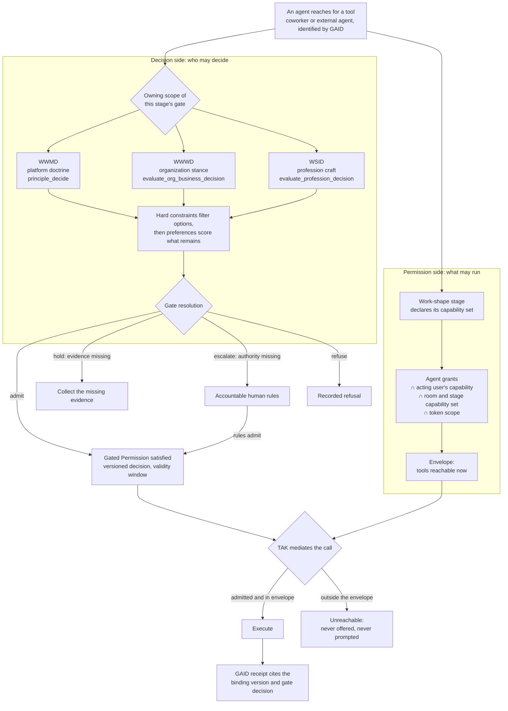
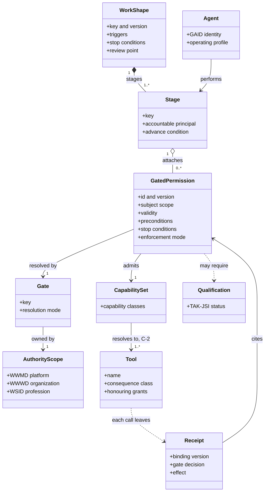
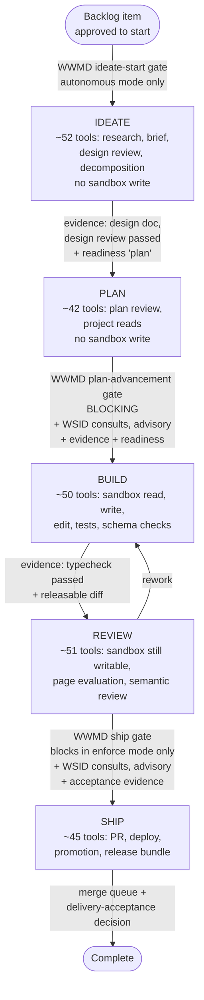

# Gated Permissions Process (GPP)

**Status:** working draft 0.3 · **Date:** 2026-10-01 · **Epic:** EP-B932453F · **Backlog:** BI-2C3B3AC9
**Placement decision:** DI-5E0B3CA09D27 (WWMD, high confidence). GPP is the fourth member of the
[standards family](agent-standards-family.md) and owns the binding semantic only.

## Abstract

The Gated Permissions Process (`GPP`) is a modeling standard for governing which tools an AI
agent may reach, and under whose decision. It defines one modelled unit, the **Gated
Permission**. A Gated Permission binds a decision gate in a named owning authority scope to a
bounded set of tool capabilities, for a specific stage of a specific work shape, with stated
evidence, validity and stop conditions.

GPP exists because neither of the two common ways to govern agent tool use holds up:

- **Per-call approval** asks a person to approve every tool call. People stop reading. One
  vendor reports that users approve 93–97% of prompts and catch a disguised dangerous command
  13.6% of the time (see the [market brief](agent-governance-market-landscape-2026.md#2-evidence-that-per-call-approval-fails)).
- **Blanket approval** ("YOLO" or skip-permission modes) approves nothing because it approves
  everything. The agent's standing credentials become its authority, and the 2024–2026 incident
  record shows what follows
  ([market brief §3](agent-governance-market-landscape-2026.md#3-incident-record-20242026)).

GPP moves the human or governed decision to the place where it carries information: **the
decision that admits a class of tool use for a bounded piece of work**. One decision, made by
the right authority and recorded, authorizes many deterministic tool calls inside a declared
envelope. Calls outside the envelope do not reach a human prompt. They are unreachable.

GPP does not enforce anything at runtime. [`TAK`](trusted-ai-kernel.md) enforces.
[`GAID`](GAID.md) identifies the actor and binds the receipt.
[`TAK-JSI`](job-specific-intelligence.md) qualifies the actor. GPP supplies the model that tells
each of them what the governed envelope is, and lets an assessor check that the model is
complete, consistent and actually enforced.

## 1. Scope

This standard specifies:

- the Gated Permission binding and its required elements
- how bindings attach to work shapes, shape stages and Workrooms
- how a binding names its owning decision scope and gate
- a shared capability vocabulary that resolves to enforceable tool grants
- capability co-occurrence constraints
- reuse, expiry and revocation of a gate decision across the tool calls it admits
- completeness and consistency checks over a set of bindings
- evidence and efficacy measures for a GPP implementation
- an informative textual notation and a SysML v2 mapping

It applies to:

- AI coworkers inside a platform
- external coding agents and other clients reaching the platform through MCP or another tool
  protocol
- human-plus-agent Workrooms, finite or standing
- any work shape that can reach a side-effecting tool

It does not:

- define runtime mediation, effective-permission intersection, proposal mode or the default
  safety rule; `TAK` §7.2, §8.4 and §7.12.1 own those
- define agent identity, operating profiles or receipts; `GAID` owns those
- define job qualification; `TAK-JSI` owns that
- define the doctrine inside a decision scope (WWMD, WWWD, WSID or another implementation's
  equivalent); the scope owner owns its doctrine
- prescribe a policy engine, a scoring algorithm or a model vendor
- claim that a complete model makes an agent safe; a model is evidence of intent, and
  enforcement evidence is separate (§11)

## 2. Conformance

An implementation conforms only if it satisfies every `MUST` for its claimed profile.

| Profile | Meaning |
|---|---|
| `GPP-Modeled` | Every work shape that can reach a consequential tool declares Gated Permissions for each stage. Every capability token resolves to enforceable grants. The completeness and consistency checks in §10 pass. No claim of runtime enforcement is implied. |
| `GPP-Enforced` | The runtime refuses to make a consequential tool reachable unless a satisfied, current binding covers it. Enforcement mode (enforced, shadow, off) is recorded per binding and is observable. Requires a `TAK` profile that implements §7.2 and §8.4. |
| `GPP-Evidenced` | The implementation publishes the §11 measures with denominators, evaluation period and environment, and links each published claim to its source records. |

An implementation:

- `MUST` declare the supported GPP version and the highest profile claimed
- `MUST NOT` claim `GPP-Enforced` for a binding whose gate runs in shadow or advisory mode
- `MUST NOT` claim `GPP-Evidenced` from a model, a design or a test fixture alone

### 2.1 Versioning

A binding `MUST` carry a version. A change to its scope, gate, capability set, subject scope,
validity or stop conditions is a material change and `MUST` produce a new version. A gate
decision recorded against an earlier version `MUST NOT` authorize calls under a later one
(§9.3).

#### 2.1.1 Binding revision versus shape version

Work shapes are often pinned by the work that uses them: a Workroom may claim an exact shape
version. If every binding change forced a new shape version, tightening a binding would unbind
live work, and implementers would have a reason to avoid tightening. To prevent that:

- A binding's version `MUST` be tracked separately from the version of the work shape it
  attaches to.
- A revision that only **narrows** a binding — removes a capability, shrinks the subject scope,
  shortens validity, or adds a stop condition or precondition — `MAY` apply to work pinned to the
  existing shape version, and `MUST` take effect at the next reach (§9.3).
- A revision that **makes explicit** a capability already reachable under the binding's current
  effective envelope `MAY` apply without a shape version change. It `MUST` be recorded with its
  date and author, and C-6 reach reconciliation (§10) `MUST` confirm that the declaration did not
  widen reach.
- A revision that **widens** the effective envelope `MUST` produce a new binding version, and
  `MUST NOT` authorize calls for work admitted under an earlier version until that work's gate is
  resolved again for the new version.

## 3. References

### 3.1 Normative references

- [Trusted AI Kernel (`TAK`)](trusted-ai-kernel.md): §7.2 effective permission, §7.12.1 autonomy bounded by gate coverage, §7.13 principle-directed decision contract, §8.1 tool definitions, §8.4 default safety rule, §8.11 governed activity shapes
- [Global AI Agent Identification and Governance (`GAID`)](GAID.md): §10 receipts, §10.2.1 principle-directed execution binding
- [Job-Specific Intelligence (`TAK-JSI`)](job-specific-intelligence.md): §8.4 qualification of principle-directed work, §14 qualification and earned autonomy

### 3.2 Informative references

- [Market and thought-leadership landscape (2026)](agent-governance-market-landscape-2026.md)
- [External standards alignment](agent-standards-external-alignment.md)
- [Work shapes and the decision gate](work-shapes-and-the-decision-gate.md)
- [Principle-directed composition design](../superpowers/specs/2026-09-27-principle-directed-agent-composition-design.md)
- OMG SysML v2 / KerML, DMN 1.5, BPMN 2.0.2, CMMN 1.1; W3C PROV-O
- OWASP LLM06:2025 *Excessive Agency*; OWASP Top 10 for Agentic Applications 2026
- Meta, *Agents Rule of Two*; Simon Willison, *The lethal trifecta*
- EU AI Act Article 14 (human oversight)

### 3.3 Reuse rule

When a requirement already lives in TAK, GAID or TAK-JSI, GPP references it and does not restate
it. A GPP clause that appears to duplicate one of them is a defect in GPP.

## 4. Terms and definitions

| Term | Definition |
|---|---|
| Decision scope | The authority domain that owns a class of judgment. DPF binds three: **WWMD** (platform direction), **WWWD** (the organization's business choices), **WSID** (profession and craft judgment). Other implementations name their own. |
| Gate | A decision point inside a scope that resolves to `admit`, `refuse`, `hold` (missing evidence) or `escalate` (missing authority). A gate can be resolved by doctrine, by an accountable human, or by both. |
| Capability | A named class of tool use, such as `read`, `write-source`, `outward-publish` or `money-out`. A capability resolves to one or more enforceable tool grants. |
| Work shape | A versioned definition of governed work: triggers, stages, advance conditions, stop conditions, review point and evidence (TAK §8.11). |
| Stage | One step of a work shape with an accountable principal and an advance condition. |
| Gated Permission | The binding of a gate to a capability set for a shape stage (§7). |
| Envelope | The union of capabilities admitted by the satisfied Gated Permissions currently in force for an actor in a Workroom. |
| Gate decision | The recorded result of resolving a gate, with its scope, version, evidence and validity. |
| Reach | Whether a tool is offered to and executable by an actor. A tool outside the envelope is unreachable, not merely prompted. |

## 5. Core principle

**Authority is decided once per class of work, by the scope that owns it, and enforced on
every call.**

Three consequences follow:

1. **Approve the decision, not the keystroke.** A person or governed resolver decides whether a
   class of tool use is admissible for this work, and the runtime enforces that decision
   deterministically on each call. People supervise where they are effective. The market brief
   records users rejecting 39% of plans while approving 97% of prompts.
2. **Unreachable beats prompted.** A tool that no satisfied binding admits is not offered. It is
   never presented for approval, so it can never be approved by fatigue.
3. **Every consequential reach traces to a named authority.** For any consequential tool call
   the platform can answer *which gate admitted this class of action, in which scope, decided by
   whom, on what evidence, valid until when*. That answer is GPP's audit object.

## 6. Relationship to the family

| Standard | Question it answers | What GPP takes from it | What GPP gives it |
|---|---|---|---|
| `GAID` | Who is acting, under which operating profile? | The actor and profile a binding applies to; the receipt that records each admitted call | The binding reference to place in the receipt |
| `TAK-JSI` | Is this profile qualified for this job? | A qualification precondition a binding may require (§7, element 8) | The tool classes a job's work shapes actually reach, so assessment targets the real envelope |
| `TAK` | May this actor act now? | Runtime enforcement: effective-permission intersection, consequence classes, proposal mode, gate coverage | The envelope that the route/workflow/context term of TAK §7.2 intersects |
| Decision scopes (WWMD/WWWD/WSID) | What does doctrine say about this choice? | The gate's resolver and doctrine | The specific classes of action each scope must rule on |

Composition order for one governed action:

1. `GAID` identifies the actor and profile.
2. `GPP` resolves the envelope for the actor's Workroom and stage, which is the set of satisfied
   Gated Permissions.
3. `TAK-JSI` confirms any qualification a binding requires.
4. `TAK` intersects principal authority, agent grants, the GPP envelope and data constraints,
   then mediates the call.
5. `GAID` records the receipt, including the binding reference and gate-decision reference.

No member widens another. An envelope never adds a grant the agent or principal lacks. It can
only narrow TAK's intersection.

## 7. The Gated Permission binding

A Gated Permission `MUST` declare the following elements.

| # | Element | Requirement |
|---|---|---|
| 1 | Identity and version | A stable identifier and version (§2.1). |
| 2 | Attachment | The work shape key and version, and the stage key, it applies to. A binding `MUST` attach to a stage, not only to a whole shape, when any stage of that shape reaches a consequential capability. |
| 3 | Owning scope | Exactly one decision scope that owns the admissibility judgment. Cross-scope material is advisory until the owning scope adopts it. |
| 4 | Gate | The gate within that scope and its resolution mode: `doctrine` (resolved by recorded principles under the scope's resolver), `accountable-human` (a named role decides), or `doctrine-then-human` (doctrine resolves; uncertainty or authority gaps escalate). |
| 5 | Capability set | The capabilities admitted, drawn from the shared vocabulary (§7.1). |
| 6 | Subject scope | What the admitted calls may act on (record set, repository, account, customer, external destination), as narrow as the work allows. |
| 7 | Validity | When the decision expires: a duration, a stage exit, a count of effects, or a combination. |
| 8 | Preconditions | Evidence that must exist before the gate resolves (for example a reproduction, a review receipt or a data classification), and any `TAK-JSI` qualification the actor must hold. |
| 9 | Escalation path | The accountable role that receives `hold` or `escalate` outcomes, and the disposition while waiting. |
| 10 | Stop conditions | What revokes the binding before expiry, such as a stage regression, a revoked grant, an incident, or evidence decay. |
| 11 | Enforcement mode | `enforced`, `shadow` or `off`, recorded with the binding and observable at runtime. |

A binding `MUST NOT` admit a capability for a stage whose accountable principal lacks the
authority to own that capability's consequence. Unresolved ownership is a `hold`, never an
`admit`.

### 7.1 Capability vocabulary

The capability vocabulary is the contract between modeled bindings and enforceable grants.

- Every capability token `MUST` resolve to a non-empty set of enforceable tool grants in the
  implementation's grant catalog.
- A token that resolves to nothing is a **dangling capability**. It `MUST` fail the §10
  consistency check. A dangling token fails safe at runtime (it admits nothing), but in the model
  it reads as authority that is in force when it is not.
- Capabilities `SHOULD` be classed by consequence, reusing the TAK §8.1 consequence classes, so
  that a binding's risk is legible without reading every tool.

**Minimum capability classes** (informative names; implementations may refine them):

| Class | Example tools | Consequence |
|---|---|---|
| `read` | search, list, get | none |
| `write-internal` | update a backlog item, record evidence | internal state |
| `write-source` | edit or commit source in a governed worktree | internal state, reversible |
| `authority` | grant, revoke, change identity or approval | authority |
| `outward` | send a message, publish, post | outward |
| `irreversible` | delete, transfer money, deploy to production | irreversible |

### 7.2 Gate resolution semantics

- A gate `MUST` resolve to exactly one of `admit`, `refuse`, `hold` or `escalate`.
- Hard constraints in the owning scope `MUST` be applied before any preference ranking
  (TAK §7.13). A preference score cannot turn a `refuse` into an `admit`.
- Missing evidence `MUST` yield `hold`. Missing authority `MUST` yield `escalate`. Neither
  defaults to `admit`.
- An `admit` `MUST` be recorded with the binding version, the scope, the resolver (doctrine
  reference and/or human principal), the evidence references and the validity.

### 7.3 The pairing at a glance

Every consequential tool call has two independent questions behind it. One is on the decision side:
*has the authority that owns this class of action decided it may happen?* The other is on the
permission side: *is this tool inside the envelope this actor may reach, for this stage of this
work?* GPP binds the two, and `TAK` enforces both on every call. Neither side can stand in for the
other. A high decision score does not make a tool reachable, and holding a grant does not answer who
decided.



How to read it:

- **The left side runs once per class of work, not once per call.** An `admit` stays valid for the
  binding's validity window (§9.1). Later calls inside the envelope reuse it, so nobody is asked
  again for each keystroke.
- **The right side runs on every call**, and it can only narrow. Each term of the intersection is
  owned by `TAK` §7.2; the room and stage term is what GPP models.
- **The two sides meet only at `TAK`.** A tool runs only when a current decision admits its class
  *and* the tool is in the envelope. Anything outside the envelope never reaches a human prompt.
- **The scoring stays inside its scope.** WWMD, WWWD and WSID are consulted according to which scope
  owns the gate, and their scores are never averaged into one number across scopes (§7.2,
  TAK §7.13). In DPF, a consequential call inside a Workroom also passes the WWWD × WSID alignment
  gate, where the most restrictive verdict wins (Annex A).

The diagram is the GPP model. Annex A says which parts of it DPF enforces today, and Annex C walks
through it for Build Studio.

## 8. Capability co-occurrence

A single envelope can combine capabilities that are each safe alone and dangerous together. GPP
adopts the *Agents Rule of Two* as a model-level constraint.

- An implementation `MUST` tag each capability with whether it introduces **untrusted input**,
  **sensitive access** or **state change / outward communication**.
- An envelope that combines all three for one actor in one session `MUST` require a binding whose
  gate resolution mode includes an accountable human or an independent validator, and `MUST`
  record that combination as a distinct, reviewable class.
- An implementation `SHOULD` report every envelope that reaches the full combination, per actor.

This constraint governs the model. Data-flow techniques such as capability-tagged values
(CaMeL-style) remain runtime controls under `TAK` and are complementary.

## 9. Bindings over time

### 9.1 Decide once, act within

A satisfied binding authorizes every call inside its capability set, subject scope and validity
without a further human prompt. This is the mechanism that removes approval fatigue without
removing authority. The decision is made at the granularity a person can judge, and enforcement
is per call.

### 9.2 Phase boundaries

A human checkpoint belongs at a stage boundary where a decision can change the outcome, not on
calls the decision has already admitted. An implementation `SHOULD NOT` re-prompt for calls a
current binding admits. A prompt that cannot change the decision is a rubber stamp and trains
inattention.

### 9.3 Expiry, revocation and material change

- A gate decision `MUST` stop authorizing when its validity ends, when a stop condition fires, or
  when the binding version changes.
- A change in the actor's operating profile that the applicable `TAK-JSI` rules treat as material
  `MUST` re-evaluate any binding that requires qualification.
- Revocation `MUST` take effect at the next tool reach. It `MUST NOT` wait for the envelope to be
  recomputed on some later schedule.

### 9.4 Narrowing only

A Workroom's posture, a proactivity setting or an autonomy level can narrow an envelope. None can
widen it (TAK §8.11.2). Raising autonomy changes how often a gated class proceeds without a
person. It does not admit a new class.

## 10. Completeness and consistency

A conforming `GPP-Modeled` implementation `MUST` be able to run the following checks over its
bindings and report every violation:

| Check | Fails when |
|---|---|
| C-1 Stage coverage | A stage of a shape can reach a consequential capability and no binding attached to that stage admits it |
| C-2 Vocabulary resolution | A capability token resolves to no enforceable grant (dangling) |
| C-3 Scope ownership | A binding names no owning scope, or more than one |
| C-4 Accountable authority | A binding's accountable principal cannot own the capability's consequence |
| C-5 Co-occurrence | An envelope combines untrusted input, sensitive access and state change without the §8 gate mode |
| C-6 Reach reconciliation | A tool reachable at runtime for an actor in a stage is not admitted by any binding (the model under-describes reality) |
| C-7 Mode honesty | A binding is presented as enforced while its gate runs in shadow or off |
| C-8 Transition path uniqueness | Two runtime paths perform the same stage transition while enforcing different gate sets. Every path that advances work from stage *A* to stage *B* `MUST` enforce the gate set the model declares for that transition. |

C-6 is the most important check. A model that the runtime does not match is documentation, not
governance. C-8 is its counterpart for transitions: a gate that one code path enforces and another
path skips is not a gate.

## 11. Evidence and efficacy measures

A `GPP-Evidenced` implementation `MUST` publish, for a stated period and environment, with
numerator and denominator:

| Measure | Question |
|---|---|
| M-1 Gate coverage | Of consequential tools reachable by each actor, what share is admitted only through a binding? (Reuses TAK §8.4.2, scoped per actor) |
| M-2 Human decisions per effect | How many human decisions were needed per consequential effect executed? Falling M-2 with stable M-5 is the approval-fatigue outcome GPP targets. |
| M-3 Resolution mix | Of gate resolutions, what share were doctrine-only, human, held or escalated? |
| M-4 Refusals before effect | How many consequential reaches were refused before any effect, and for which reason codes? |
| M-5 Unauthorized or unintended effects | How many consequential effects later proved unauthorized or unintended? |
| M-6 Shadow divergence | For bindings in shadow mode, how often would enforcement have refused a call that proceeded? |
| M-7 Decision outcome linkage | What share of admitted decisions have a recorded observed outcome? |

Measures `MUST` be computed from execution and decision records, not from configuration. A
published measure `MUST` state what it omits.

## 12. Notation

GPP does not require a particular notation. Two informative forms follow.

### 12.1 Textual form

```yaml
gatedPermission:
  id: gp.delivery-small.repair.write-source
  version: 1.0.0
  attach: { shape: delivery-small@1.0.0, stage: repair }
  scope: WWMD
  gate: { key: delivery-implementation, mode: doctrine-then-human }
  capabilities: [read, write-source]
  subject: { repository: platform, branch: "doc/*|fix/*|feat/*", worktree: governed }
  validity: { until: stage-exit, maxDuration: P7D }
  preconditions:
    evidence: [backlog-item-claimed, research-receipt]
    qualification: null
  escalation: { role: delivery-coordinator, whileWaiting: hold }
  stop: [grant-revoked, stage-regressed, pr-closed]
  enforcement: enforced
```

### 12.2 SysML v2 mapping

| GPP concept | SysML v2 / KerML construct |
|---|---|
| Work shape | `action def` with a `state def` for stages |
| Stage | `action` usage or `state` within the shape |
| Gate | `requirement def` with a `constraint` evaluated by a DMN decision |
| Capability set | `port def` / `interface` exposing tool items |
| Gated Permission | `allocation` of the capability interface to the stage, subject to the gate requirement |
| Owning scope | `part` representing the authority, linked by `satisfy` to the gate requirement |
| Evidence | `item` references; provenance via PROV-O |

The mapping is a modeling profile, not a claim of full SysML execution semantics. It composes the
existing [MBSE composition design](../superpowers/specs/2026-09-27-principle-directed-agent-composition-design.md).

### 12.3 The binding as a model

The same binding expressed as model elements. This is the view an MBSE tool, or a reviewer,
navigates, and it is the structure the §10 checks walk.



Each relationship maps to one completeness check:

| Relationship | Check |
|---|---|
| A stage that reaches a consequential capability has an attached binding | C-1 stage coverage |
| A capability set resolves to real tools | C-2 vocabulary resolution |
| A gate has exactly one owning scope | C-3 scope ownership |
| A stage's accountable principal can own the consequence | C-4 accountable authority |
| A receipt can be followed back to the binding and decision that admitted it | GPP-012 |
| Every tool actually reached is admitted by some binding | C-6 reach reconciliation |

### 12.4 From model to running system

A diagram that explains governance is not MBSE. In MBSE the model is precise enough to be
**interpreted and implemented** as the running workroom shape, and it stays **visible** both to the
people designing the work and to the people supervising it while it runs. This section makes that
requirement normative for `GPP-Modeled` and `GPP-Enforced`.

#### 12.4.1 The model is executable or verified

A conforming implementation:

- `MUST` hold its Gated Permission model in a machine-readable form. It uses typed elements for
  every §7 binding element and every §12.3 class, and identifiers that stay stable across versions.
- `MUST` either execute that model directly, so the declared shape *is* what the runtime runs, or
  verify the running configuration against it whenever either one changes. A model that exists only
  as prose or a picture does not satisfy `GPP-Modeled`.
- `MUST` declare, for each stage transition, the complete gate set that guards it: owning scope,
  resolver, whether it blocks or advises, and its mode. Every runtime path that performs that
  transition `MUST` enforce the same set (C-8).
- `MUST` map each model element to exactly one runtime artifact and publish that mapping, so an
  assessor can go from a clause to the code or configuration that realizes it.
- `SHOULD` derive participants, capability sets and gate bindings from the model, rather than
  configuring them separately and reconciling afterwards.

#### 12.4.2 The model is visible at design time and at runtime

| Requirement | What must be visible |
|---|---|
| V-1 Design view | The declared model, rendered without running any work: stages, transitions, each gate with its owning scope and mode, each stage's capability set, and accountable principals |
| V-2 Runtime view | For each live Workroom: the current stage, the bindings in force, a reference to the gate decision that satisfied each one, the effective envelope, and the enforcement mode of every gate |
| V-3 Shared identity | Every runtime node carries the identifier and version of the design element it instantiates, so a reviewer can move from a running room to its model element and back |
| V-4 Divergence | C-6 and C-8 findings appear in both views, as gaps attached to the elements they concern |

A view `MUST` be a projection of model and execution records. It `MUST NOT` infer a verdict the
records do not contain. A picture that disagrees with the ledger is worse than no picture, because
people act on the picture.

#### 12.4.3 DPF status

| Requirement | DPF substrate | Mode |
|---|---|---|
| Executable model | Work shapes are code-declared models: `WorkShapeDefinition` in `work-shapes.ts` and `delivery-shapes.ts` (stages, accountable principals, `governed-decision{decisionScope}` advances, stop conditions, `grants`, stage `tools`). The runtime reads the declared shape. | **Implemented** for work shapes. Build Studio's flow is not yet one declared shape (Annex C). |
| Transition gate sets | Declared per shape stage (`advance`). Build Studio's gates are spread across several modules (Annex C). | **Partial**; C-8 violation recorded (BI-45F9CB7A) |
| V-1 Design view | The EA/SysML parity engine (`apps/web/lib/ea/reconcile-sysml-projections.ts`) re-derives projections of MCP tool authority, coworker authority, value streams, process models and work-pattern architecture from their sources | **Partial.** Bindings are not yet first-class elements in the projection. |
| V-2 Runtime view | `shape-projection.ts` renders a room's stages as a graph in `WorkroomShape.tsx`. Gate verdicts are read off receipts, never inferred. | **Partial.** Bindings in force, the envelope and gate modes are not yet shown. |
| V-3 Shared identity | Rooms pin `key@version` of their shape | **Partial.** Binding identifiers do not exist yet. |
| V-4 Divergence | Architecture-vs-execution drift in both directions, and participants derived from the architecture's participation matrix | **Not built.** Tracked as open items in EP-MBSE-WORKROOM-SPINE: BI-FA970AE2 (drift both ways), BI-A83D5FB8 (participants from the architecture), BI-580A970A (reference spine room), BI-B8B3FB70 (rooms at IT4IT value-stream stages). |

## 13. Hazards

| Unsafe control action | Prevention and detection |
|---|---|
| A binding admits more than the stage needs | Stage-level attachment (§7 element 2); subject scope; C-6 reach reconciliation |
| A dangling capability reads as authority in force | C-2 vocabulary resolution |
| A decision is reused after its basis changed | Versioned bindings; §9.3 expiry and revocation |
| An envelope silently assembles the lethal trifecta | §8 co-occurrence; C-5 |
| A shadow gate is reported as enforcement | Element 11; C-7; `GPP-Enforced` exclusion |
| Ownership is ambiguous, so the gate defaults to admit | §7.2 `escalate`; C-3, C-4 |
| A second code path advances the same transition with fewer gates | §12.4.1 declared gate set per transition; C-8 |
| A growing human queue drives operators back to blanket approval | M-2 and M-3 monitored; bindings sized so one decision covers a coherent class |

## 14. Security and privacy considerations

A binding names authorities, subjects and evidence. Binding records and gate decisions can
reveal organizational structure and sensitive subjects. They `MUST` be readable only by
principals entitled to the underlying work. A GPP model does not reduce the need for sandboxing,
egress control, credential isolation or data-flow controls. It determines what those controls
must permit.

## Annex A (informative): DPF realization status

Assessed against repository source on 2026-09-30. Source presence is not runtime enforcement; the
mode column says which.

| GPP element | DPF substrate | Mode today |
|---|---|---|
| Work shapes and stages | `apps/web/lib/work-management/work-shapes.ts`, `delivery-shapes.ts` — 47 work shapes; each stage has an accountable principal and an advance that is a status change or a `governed-decision{decisionScope}` | Defined |
| Stage-level capability set (first slice) | `WorkShapeStage.tools` in `work-shapes.ts`, read through `stageDeclaredTools` (`stage-briefing.ts`). Declared tools are pinned into each scheduled stage run by `scheduledToolsNeedingPin` (`apps/web/lib/tak/scheduled-task-runs.ts`). Parity test `apps/web/lib/work-management/stage-tool-parity.test.ts` asserts C-1 (GPP-001), C-2 (GPP-002) and the grant-held first condition of C-4. Stages that do not yet have the read tool they need are listed in the shrink-only `KNOWN_STAGE_TOOL_GAPS` (`stage-tool-gaps.ts`). BI-43C3E914, PR #5846, merge `a6557758ce41`. | **Declared and tested** for standing, coworker and orchestration stages. Pinning is used for scheduled runs. Delivery shapes are not yet covered. The declarations were added without shape version bumps, so §2.1.1 applies: C-6 must confirm they made existing reach explicit rather than widening it. |
| Shape-level capability set | Work-shape `grants` (for example `tool:read`, `tool:write-source`), translated by `roomGrantsFromWorkShape` in `room-turn-authority.ts` | **Per shape.** Vocabulary is coarse (`tool:read`, `tool:write-source`, `tool:write`). The stage parity test does not cover shape grants. `write-source` resolves to no enforceable grant today. In-portal coworker turns in a room that declares a delivery shape therefore admit only the read baseline (`room-turn-authority.server.ts` → `roomGrantsFromWorkShape`). This fails safe but is dangling under C-2 (BI-00588B51). |
| Owning scope | `Workroom.decisionScope` enum `wwmd \| wwwd \| wsid`; gate tools `principle_decide` (WWMD), `evaluate_org_business_decision` (WWWD), `evaluate_profession_decision` (WSID) | Defined; scope per room, not per binding |
| Envelope narrowing | `deriveRoomTurnAuthority` — agent grants ∩ user capability ∩ room grants; observers get the read baseline; room boundary `advise \| propose \| preauthorized` | Enforced |
| Effective permission (TAK) | `getAvailableTools` (discovery) and `governedExecuteTool` → `evaluateCoworkerAuthority` deny-ladder (identity, capability, grant, room, delegation, route, subject, integration, sensitivity, policy version, escalation) | Enforced on the governed path |
| Token scope for external agents | `requiredTokenScopeForTool` / `tokenAdmitsTool`; OAuth scopes map to granular grants; step-up challenge | Enforced |
| Tool consequence → collaboration shape | `collaborationShapeForTool` (outward → outward-review; irreversible → change-consequential) | Defined |
| Shape gate on consequential calls | `workroom-shape-governance-hook.ts` (BI-E0BFFF77) | **Shadow by default** (`DPF_WORKROOM_GATE_MODE`), audited as WorkroomActivity |
| WWWD × WSID alignment gate | `tak/alignment-tool-gate.ts`, `alignment-specialist-delegation.ts`; runs for every consequential tool inside a Workroom | Enforced (most-restrictive-wins) |
| Escalation gate | `govern/authority/escalation-gate.ts` — damaging → human; steered → automated | Enforced |
| Gate decision → exact-action authorization | `policy-authority-projector.ts`, `resolve-policy-action-authority.ts` — a sealed WWMD/WWWD/WSID judgment becomes a single-use, time-bound authorization | **11 tools only** (`PROJECTABLE_ACTIONS`) |
| Required-approver enforcement | `required-approvers.ts` computes who must approve | Not wired to an enforcement point (BI-F9ED8151) |
| Qualification precondition | `coordinator-eligibility.ts` | No JSI qualification table; returns not-applicable |
| Receipts | `ToolExecutionReceipt`, GAID actor envelope, mandatory receipt reservation for consequential calls | Enforced on the governed path |
| Evidence for §11 | `AuthorizationDecisionLog`, `ToolExecution`, `DecisionInteraction`, `CoworkerActionEnvelope`, `WorkroomActivity` | Records exist; about 28 direct `executeTool` call sites bypass the governed audit; no published measures |

**Overall DPF status:**

- `GPP-Modeled`: **partial.** Standing, coworker and orchestration stages declare stage-level tools under a parity test that is a CI gate, with a shrink-only gap list. Delivery shapes still bind at shape level, with a coarse vocabulary and one known dangling token.
- `GPP-Enforced`: **partial.** Room narrowing, the alignment and escalation gates are enforced; the shape gate is in shadow mode; exact-action projection covers 11 tools.
- `GPP-Evidenced`: **not yet.**

## Annex B (informative): proposed assertions

| ID | Assertion |
|---|---|
| GPP-001 | Every stage of every shape that can reach a consequential capability has an attached binding (C-1). |
| GPP-002 | Every capability token resolves to at least one enforceable grant (C-2). |
| GPP-003 | Every binding names exactly one owning scope (C-3). |
| GPP-004 | A preference score cannot convert a hard-constraint refusal into `admit`. |
| GPP-005 | Missing evidence yields `hold` and missing authority yields `escalate`; neither yields `admit`. |
| GPP-006 | A tool outside the envelope is absent from discovery and refused at execution. |
| GPP-007 | A decision recorded against binding version *n* does not admit calls under version *n+1*. |
| GPP-008 | Revocation takes effect at the next reach. |
| GPP-009 | An envelope combining untrusted input, sensitive access and state change requires the §8 gate mode. |
| GPP-010 | Every tool reachable at runtime for an actor in a stage is admitted by a binding (C-6). |
| GPP-011 | A shadow-mode binding is never reported as enforced (C-7). |
| GPP-012 | Each consequential receipt resolves to its binding version and gate decision. |
| GPP-013 | Every runtime path that advances a stage transition enforces the transition's declared gate set (C-8). |
| GPP-014 | A live Workroom's runtime view resolves each node to its design element identifier and version (V-3). |

These are assessment designs. None has been executed by writing this draft. Executable form
belongs with the family's conformance work (BI-2AB781FA).

## Annex C (informative): Build Studio as a GPP model

Build Studio is DPF's own delivery flow: the path by which an idea becomes reviewed, merged and
shipped platform change. Its phases, transitions and per-phase tool permissions are the most fully
defined workroom flow DPF ships, so it is the first worked example. Everything below was read from
repository source at `02aca6a234` on 2026-10-01. Each element states its mode. The annex models what
exists and does not claim that the model is complete.

### C.1 The model



| Stage | Accountable | Transition gate into the next stage (scope, mode) | Capability set: admitted / withheld | Human checkpoint | Evidence to exit |
|---|---|---|---|---|---|
| Ideate | Build specialist and orchestrator; architecture and data-architect consults are advisory | WWMD ideate-start gate (`build-studio-ship-gate.ts`), runs only when the autonomous playbook mode is on | Research, brief, `reviewDesignDoc`, decomposition, project reads. Withheld: sandbox writes, ship tools, the decision-gate tools themselves | Approve Start; business brief accepted | Design doc; design review passed; intake ready; readiness lane `plan` |
| Plan | Enterprise architect and orchestrator | **WWMD plan-advancement gate** (`build-studio-gate.ts`), **blocking**. WSID acumen consults are **advisory**, chosen by the files touched. Plus evidence and readiness checks. | `reviewBuildPlan`, project reads. Withheld: sandbox writes | WWMD `escalate` goes to the owner | Build plan; plan review passed; readiness lane `implementation` |
| Build | Build orchestrator with software, frontend, data, QA and docs specialists | Evidence only | Sandbox read, write, edit, run and test; `validate_schema`; `propose_file_change`. Withheld: ship tools | None | Typecheck passed; at least one releasable source change |
| Review | Operations coordinator; change reviewer | Evidence only; UX verification is queued on entry | `evaluate_page`, semantic review, impact inspection; sandbox still writable. Rework returns to Build. | Acceptance recorded; UX override requires a written reason | Acceptance met; UX verification not blocking |
| Ship | Platform engineer and release orchestrators | **WWMD ship gate** (risk assessment): blocking in `enforce` mode only, otherwise shadow. WSID consults are advisory. | `create_portal_pr`, `deploy_feature`, promotion and release tools | PR checks and merge queue; the delivery shape's `delivery-acceptance` decision | PR, merged SHA, promotion; readiness lane `completion` |

**Where each part of the model lives today:**

| Part | Source |
|---|---|
| Phases and allowed transitions | `PHASE_ORDER` and `ALLOWED_TRANSITIONS` in `apps/web/lib/explore/feature-build-types.ts` |
| Evidence gates per transition | `checkPhaseGate` and `DEFAULT_LIFECYCLE_MATRIX` in `apps/web/lib/explore/build-process-matrix.ts` |
| Canonical transition | `advanceBuildPhase` in `apps/web/lib/actions/build.ts` |
| WWMD gates (gate key `build-studio`, mapped to WWMD by the authority projector) | `build-studio-gate.ts`, `build-studio-ship-gate.ts` |
| WSID advisory consults | `acumen-phase-consult.ts`, `acumen-impact.ts` |
| Capability sets | `buildPhases` tags on each MCP tool, applied by `filterToolsForCoworkerRuntime` after agent grants ∩ user capability |
| Workroom link | `attachBuildStudioWorkCapsule` creates a room with executor kind `build-studio` and binds the item's delivery shape |

### C.2 One binding, written out

The plan → build transition, expressed in the §12.1 notation. This is a model of what exists, not a
new configuration.

```yaml
gatedPermission:
  id: gp.build-studio.build.sandbox-write
  version: 0.1.0-model
  attach: { flow: build-studio, stage: build }
  scope: WWMD
  gate:
    key: build-studio            # evaluator gate key, projected to WWMD
    question: Start implementation from the reviewed plan?
    options: [start, revise-plan, escalate-to-owner]
    mode: doctrine-then-human    # escalate goes to the Build Studio owner
    blocking: true
  advisory:
    - scope: WSID                # acumen consults, chosen by the paths touched
      blocking: false
  capabilities: [read, write-source-sandbox, run-tests, schema-validate]
  subject: { sandbox: build-scoped }
  preconditions:
    evidence: [buildPlan, planReview-passed, happyPathIntake-ready]
    readiness: implementation    # initiative-readiness lane
    humanApproval: approve-start
  validity: { until: stage-exit }
  stop: [build-failed, build-abandoned, rework-from-review-reenters]
  enforcement: enforced          # on the canonical path only; see C.3 item 2
```

### C.3 What modeling it revealed

Writing the flow down as a model exposed six things that the code, read file by file, did not make
obvious. This is the practical argument for MBSE.

1. **The model is implicit.** Build Studio's stages, gates and capability sets are spread across at
   least six modules. A second, parallel model, the delivery shape's stages (design-note → implement
   → merge → accept for a medium item), governs the same work through initiative readiness. There is
   no single declared artifact a reviewer can inspect. That fails §12.4.1, and it is the first thing
   to fix.
2. **One transition, two gate sets (C-8).** `save_phase_handoff` is available in the plan phase and
   auto-advances plan → build after only the evidence check. The canonical path also enforces the
   blocking WWMD gate, initiative readiness and Approve Start. Recorded as BI-45F9CB7A; found by
   source reading, not yet reproduced at runtime.
3. **Accountable identity is not one thing (C-4).** The phase-handoff record and the IT4IT prompt map
   name different agents for the same phase, and neither ties back to the agent rows that hold tool
   grants. Until that is resolved, "can the stage's accountable principal own this consequence?"
   cannot be evaluated.
4. **WSID advises but never blocks, and the QA craft has no route.** Profession consults are chosen
   by file path, and no path rule selects the QA profession. Whether any WSID verdict should become
   blocking is an open decision for the platform scope, not something this annex can settle.
5. **The build engine's boundary is the environment, not the tool list.** The primary build path
   runs a coding CLI inside the build sandbox with its permission prompts disabled. The MCP phase
   filter does not apply there. The sandbox is the containment. That is a legitimate design, and it
   is the containment-first approach the market brief describes. GPP requires it to be **declared**
   as a binding whose capability set is "unrestricted inside the sandbox, nothing outside it", with
   its enforcement at the environment layer, rather than left implicit.
6. **The ship gate is shadow unless enforce mode is on (C-7).** Promotion is then approved
   automatically after `deploy_feature`. The model has to show that mode, and the public ledger
   (white paper §8) has to report it as shadow.

### C.4 Path to conformance

| Step | What changes | Checks it satisfies |
|---|---|---|
| 1 | Express the Build Studio flow as one declared work shape: stages, per-stage `tools`, the gate set per transition with scope and mode | §12.4.1; C-1, C-2 |
| 2 | Route every phase-changing path through one transition function | C-8 (BI-45F9CB7A) |
| 3 | Bind each stage to one accountable agent identity that holds the stage's grants | C-4 |
| 4 | Declare the build-engine sandbox as an environment-enforced binding | §7 element 11; C-7 |
| 5 | Render bindings, gate modes and the envelope in the room's shape view | V-1, V-2 |
| 6 | Reconcile tools actually called per stage against the declared set | C-6 |

## Revision history

| Version | Date | Change |
|---|---|---|
| 0.1 | 2026-09-30 | Initial working draft (BI-2C3B3AC9). |
| 0.2 | 2026-10-01 | Added §2.1.1 binding revision versus shape version. Annex A now cites the first stage-level binding slice (BI-43C3E914, PR #5846). |
| 0.3 | 2026-10-01 | Added the §7.3 pairing diagram and §12.3 model diagram. Added §12.4 model-to-running-system requirements (executability, V-1…V-4 visibility). Added check C-8 and assertions GPP-013/014. Added Annex C, Build Studio as a GPP model (BI-D0AB33B5). |
