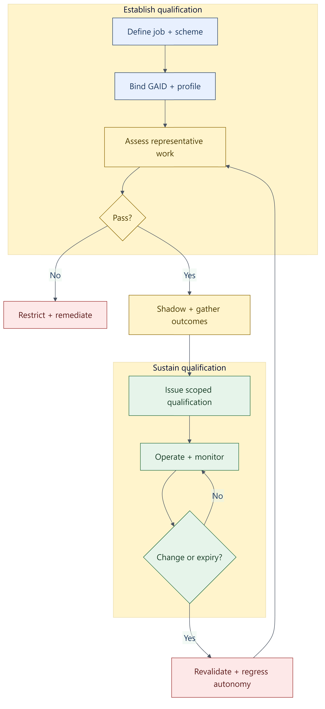

# Job-Specific Intelligence (TAK-JSI)

## Abstract

Job-Specific Intelligence (`JSI`) is a normative qualification profile for autonomous and
semi-autonomous AI agents. It defines how an identified agent operating profile is shown to be fit
for a specific job, activity, data scope, and risk context; how that qualification is versioned and
advertised; and when it must be restricted, suspended, or revalidated.

The problem is not that AI systems have no benchmarks. The problem is that generic model
benchmarks, model cards, system cards, and one-shot demonstrations do not establish whether an AI
Coworker can perform a particular job in a particular organization under its actual tool, data,
authority, and oversight constraints. A coding benchmark may support a software-development
qualification. It does not qualify the same operating profile for legal intake, health operations,
finance approval, or any other job with different knowledge, evidence, data, and harm boundaries.

`TAK-JSI` treats qualification as a property of a versioned operational subject in context, not as
a permanent property of a model name. It is a profile of the Trusted AI Kernel (`TAK`) because
qualification constrains runtime autonomy. It binds claims through `GAID` because relying parties
need to know which AI Coworker and operating profile earned the qualification.

## 1. Scope

This profile specifies requirements for:

- job and activity definitions for AI agents
- job-specific knowledge, skill, decision, tool, data, and evidence requirements
- qualification schemes and assessment plans
- qualification records bound to versioned agent operating profiles
- model and provider eligibility for a job and data scope
- data stewardship within qualification and evaluation
- evidence-based autonomy and proactivity boundaries
- material-change detection, surveillance, expiry, revalidation, suspension, and revocation
- portable advertisement of qualification through `GAID`
- conformance evidence for qualification issuers, operators, and verifiers

This profile applies to:

- AI Coworkers performing bounded enterprise or public-sector jobs
- orchestrators and specialists whose job scopes differ
- agents that route among multiple models or providers
- agents that act with tools, memory, retrieval, or delegated authority
- internal, federated, and public-facing agent operating profiles

This profile does not:

- define a universal ontology of every occupation
- define global agent identity; `GAID` owns that concern
- define live authorization or tool enforcement; `TAK` owns that concern
- replace profession doctrine such as DPF's `WSID`
- prescribe one model vendor, benchmark, prompt format, or harness implementation
- claim that passing an evaluation makes unrestricted autonomy safe

## 2. Conformance

An implementation conforms only if it satisfies every `MUST` for its claimed profile.

This standard defines three conformance profiles:

| Profile | Meaning |
|---|---|
| `TAK-JSI-Defined` | A versioned job profile, qualification scheme, constraints, and evidence requirements exist. No claim of demonstrated job performance is implied. |
| `TAK-JSI-Assessed` | A specific versioned agent operating profile has passed the declared assessment plan under representative conditions. |
| `TAK-JSI-Qualified` | The assessed profile also has governed operational evidence, surveillance/revalidation rules, GAID-bound status, and an enforceable TAK autonomy ceiling. |

An implementation:

- `MUST` declare the supported `TAK-JSI` version
- `MUST` declare the highest conformance profile claimed
- `MUST NOT` use `qualified` for a merely defined or self-described job profile
- `MUST` identify whether an assertion is self-asserted, organization-attested,
  independently-assessed, or accredited-certified
- `MUST` publish or retain an assertion-to-evidence mapping
- `SHOULD` publish a machine-readable implementation statement

### 2.1 Versioning

`TAK-JSI` `SHOULD` use semantic-style versioning:

- major versions for incompatible normative changes
- minor versions for additive requirements or profiles
- patch versions for clarifications and errata

Job profiles, qualification schemes, and qualification records `MUST` each have their own version
or immutable identifier. Updating this standard does not silently update a job qualification, and
updating a job profile does not silently preserve an earlier qualification.

## 3. References

### 3.1 Normative References

The following companion standards are indispensable to applying this profile:

| Reference | Normative relationship |
|---|---|
| [Trusted AI Kernel](trusted-ai-kernel.md) | Defines runtime authority, oversight, tool/data enforcement, material-change handling, evidence, and autonomy ceilings |
| [GAID](GAID.md) | Defines agent identity, operating-profile binding, badges, status, receipts, and verification |

### 3.2 Informative External References

The following references informed this profile. The exact relationship—adoption, profiling,
augmentation, mapping, or adjacency—is maintained in the informative
[External Standards Alignment](agent-standards-external-alignment.md) companion. Active drafts and
committee projects are identified as such and are not represented as completed standards.

| Reference | Relevance |
|---|---|
| [NIST AI RMF 1.0](https://doi.org/10.6028/NIST.AI.100-1) | Context-of-use risk mapping, measurement, monitoring, and management |
| [NIST AI RMF Playbook - Measure](https://airc.nist.gov/airmf-resources/playbook/measure/) | Fit-for-purpose evaluation, representative conditions, uncertainty, limits, and ongoing monitoring |
| [NIST AI Agent Standards Initiative](https://www.nist.gov/artificial-intelligence/ai-agent-standards-initiative) | Agent security, identity, interoperability, and consumer-comparable evaluation activity |
| [NIST AI Consortium](https://www.nist.gov/artificial-intelligence/nist-ai-consortium) | Measurement, evaluation, implementation evidence, and pre-standardization collaboration |
| [ISO/IEC 17024:2026](https://www.iso.org/standard/17024) | Adjacent lifecycle prior art for scheme scope, assessment, surveillance, reassessment, suspension, and revocation; not the direct conformity basis because its object is a person |
| [ISO/IEC 17065](https://www.iso.org/standard/46568.html) | Product, process, and service certification model more directly applicable to an AI agent operating profile |
| [ISO/IEC 17067:2013](https://www.iso.org/standard/55087.html) | Fundamentals and guidance for product, process, and service certification schemes |
| [ISO/IEC 42006:2025](https://www.iso.org/standard/42006) | Certification-body requirements for AI management systems and a bridge to broader AI product/process/service schemes |
| [ISO/IEC JTC 1/SC 42](https://www.iso.org/committee/6794475.html) | Horizontal AI committee, including JWG 6 with ISO/CASCO on conformity-assessment schemes for AI systems |
| [ISO/IEC 25059:2023](https://www.iso.org/standard/80655.html) | Quality model and common terminology for specifying and evaluating AI-system quality |
| [ISO/IEC 23894:2023](https://www.iso.org/standard/77304.html) | AI risk-management integration |
| [ISO/IEC 42005:2025](https://www.iso.org/standard/42005) | AI system impact assessment used to establish affected stakeholders, foreseeable impacts, prohibited uses, and reassessment triggers |
| [ISO/IEC TS 42119-2:2025](https://www.iso.org/standard/84127.html) | Risk-based application of software-testing practices to AI systems |
| [ISO/IEC 42119-3](https://www.iso.org/standard/85072.html) | Active verification and validation analysis work augmented by job, operating-profile, surveillance, and revalidation semantics |
| [ISO/IEC 5259-1:2024](https://www.iso.org/standard/81088.html) | Data quality concepts and fit-for-purpose framing for analytics and ML |
| [ISO/IEC 5259-2:2024](https://www.iso.org/standard/81860.html) | Measurable data-quality characteristics |
| [ISO/IEC 5259-3:2024](https://www.iso.org/standard/81092.html) | Data-quality lifecycle management requirements and guidance |
| [ISO/IEC 5259-5:2025](https://www.iso.org/standard/84150.html) | Data-quality governance and accountable stewardship |
| [W3C Verifiable Credentials Data Model 2.0](https://www.w3.org/TR/vc-data-model/) | Issuer-holder-verifier claim model, schemas, evidence, validity, and status |
| [1EdTech Open Badges 3.0](https://standards.1edtech.org/open-badges/specifications/standards/v3p0/cert) | Achievement claims with issuer, evidence, results, issue date, expiry, and portable verification |
| [WikiSkill](https://arxiv.org/html/2608.27454) | Separation of immutable experience, curated knowledge, executable skills, validation/rollback, and evidence that skill transfer can regress on another model |
| [Automated Researchers Can Reliably Mitigate Alignment Failures](https://alignment.anthropic.com/2026/automated-alignment-researchers/) | Parallel research, isolated held-out evaluation, capability preservation, and monitored evaluation-gaming evidence |
| [Automated Weak-to-Strong Researcher](https://alignment.anthropic.com/2026/automated-w2s-researcher/) | Flexible research inside a fixed control envelope and concrete reward-hacking modes involving seeds, evaluator feedback, and label leakage |
| [O*NET Content Model](https://www.onetcenter.org/content.html) | Tasks, knowledge, skills, abilities, work activities, and work context as job descriptors |
| [ESCO](https://esco.ec.europa.eu/en/about-esco) | Versioned relationships among occupations, skills, competences, and qualifications |

### 3.3 Reuse rule

`TAK-JSI` profiles adjacent standards instead of replacing them:

- occupation taxonomies `MAY` identify jobs and skill concepts
- `WSID` or an equivalent profession corpus `MAY` own job craft and decision doctrine
- verifiable credentials or open badges `MAY` carry qualification assertions
- `GAID` `MUST` bind the assertion to the agent subject and operating profile
- `TAK` `MUST` enforce the resulting operational ceiling

### 3.4 Conformity-Assessment Boundary

The object of a `TAK-JSI` qualification is a versioned AI agent operating profile in a declared
job and deployment context. It is not a person, a model family in the abstract, or an organization
management system.

Accordingly:

- ISO/IEC 17024 is used only as adjacent lifecycle prior art and `MUST NOT` be cited as the direct
  certification basis for an AI agent
- ISO/IEC 17065 and ISO/IEC 17067 provide the closer product, process, and service scheme model
- ISO/IEC 42006 certification of an organization's AI management system `MUST NOT` be represented
  as qualification of every agent operated by that organization
- ISO/IEC TS 42119-2 and ISO/IEC 42119-3 testing or validation evidence `MAY` support a
  qualification, but passing a test campaign does not create a job qualification unless the
  declared scheme, subject, scope, decision rule, and continuing-validity requirements are met
- accredited certification claims `MUST` identify the applicable scheme, certification body,
  accreditation basis, scope, status, and validity period
- organization-attested or independently assessed qualifications `MUST NOT` be labeled accredited
  certification

### 3.5 Specific Augmentation of AI Testing

`TAK-JSI` augments general AI testing and validation by requiring:

- the qualification subject to include the complete operating-profile fingerprint
- a versioned job and activity profile rather than a generic capability category
- representative tools, retrieval sources, memory behavior, data classes, provider routes,
  authority limits, and human-oversight conditions
- explicit prohibited uses and foreseeable misuse cases
- evidence thresholds tied to job outcomes and harms
- validity, surveillance, material-change, restriction, suspension, revocation, and revalidation
  rules
- runtime linkage through `TAK` and portable status disclosure through `GAID`

## 4. Terms and Definitions

| Term | Definition |
|---|---|
| `job` | A bounded set of responsibilities, activities, outcomes, and constraints performed for an organization or relying party |
| `activity` | A coherent unit of work within a job that may have its own qualification and autonomy boundary |
| `job profile` | A versioned description of a job's purpose, activities, knowledge, skills, decision axes, tools, data, evidence, and prohibited uses |
| `operating profile` | The materially relevant runtime state of an identified agent, as defined by `TAK` and bound through `GAID` |
| `qualification scheme` | The rules, assessment methods, evidence requirements, decision process, validity, and revalidation policy used to determine job fitness |
| `qualification record` | A versioned assertion that a specific operating profile met a qualification scheme for a declared scope |
| `qualification subject` | The tuple of agent identity, operating-profile fingerprint, job-profile version, activity scope, deployment context, and applicable data/risk classes |
| `job-specific intelligence` | The demonstrated ability of a qualification subject to perform a declared job/activity within its constraints and evidence requirements |
| `declared capability` | A capability stated by an operator, vendor, model card, tool description, or agent metadata without job-specific proof |
| `tested capability` | A capability observed under a declared evaluation, without necessarily satisfying a complete job qualification scheme |
| `qualified capability` | A capability that satisfies the applicable qualification scheme for its declared scope |
| `work-sample assessment` | A representative task performed end-to-end through the subject's real production execution path, judged afterwards against declared assessment criteria |
| `assessment criterion` | A single independently checkable assertion about a recorded work sample, stated as the competency being assured |
| `governed execution record` | The authoritative retained log of operations an agent actually performed, independent of any one execution transport's instrumentation |
| `authorization envelope` | The set of operations a subject's grants and permitted consequence classes allow, as distinct from any narrower surface an assessment harness presents |
| `surveillance` | Ongoing monitoring used to determine whether a qualification remains valid between formal reassessments |
| `material change` | A change capable of altering job performance, risk, data handling, authority, or the validity of prior evidence |
| `proactivity` | The requested degree of initiative an agent may take before involving a human |
| `earned autonomy` | The runtime action latitude justified by evidence and policy for a specific agent, activity, and risk scope |
| `autonomy ceiling` | The highest runtime oversight tier allowed after intersecting authority, qualification, data, regulatory, and risk constraints |
| `data steward` | The accountable role responsible for a data domain's meaning, quality, classification, permitted use, and lifecycle expectations |

## 5. Core Principle

The core principle of `TAK-JSI` is:

> Intelligence for autonomous work is qualified against the job, operating profile, data, tools,
> and consequences that exist in practice. It is not inferred from a model label or a generic
> benchmark.

The qualification subject is therefore:

```text
(GAID subject
 × operating-profile fingerprint
 × job-profile version
 × activity
 × deployment context
 × data/risk scope)
```

A qualification `MUST NOT` be generalized beyond that tuple without additional evidence.

## 6. Relationship to TAK, GAID, WSID, Proactivity, and the Golden Triangle

| Concern | Canonical owner | `TAK-JSI` relationship |
|---|---|---|
| Identity and advertised claim | `GAID` | Provides a qualification claim that GAID binds to a subject, profile, status, and evidence |
| Runtime permission and oversight | `TAK` | Provides an autonomy ceiling and qualification status that TAK enforces at action time |
| Profession and craft doctrine | `WSID` or equivalent | Consumes versioned knowledge, techniques, decision axes, and evidence practices; does not redefine them |
| Human initiative preference | Proactivity policy | Treats proactivity as a request that remains bounded by qualification and TAK constraints |
| Cost/quality/time posture | Golden Triangle or equivalent | Uses the compiled effort and assurance envelope during evaluation or execution; does not treat resource spend as proof of competence |
| Model/provider selection | Runtime router | Defines job-fit and data eligibility requirements; does not hard-code vendor flags |
| Data quality and handling | Data governance | Requires stewarded data constraints and evidence within the qualification scheme |

### 6.1 Proactivity is not autonomy

A proactivity setting `MAY` request that an agent:

- wait for a prompt
- suggest work
- prepare a proposal
- continue routine work within a boundary
- initiate bounded work when a trigger occurs

The setting `MUST NOT`:

- widen the principal's authority
- create a capability or qualification
- bypass a `TAK` approval requirement
- exceed a regulatory, contractual, jurisdictional, or data-handling ceiling
- exceed the qualification's activity or risk scope

### 6.2 The Golden Triangle is not a qualification score

A cost/quality/time posture `MAY` change:

- eligible model tier
- reasoning or inference effort
- context and loop budget
- review and verification depth
- retry and fallback posture

It `MUST NOT`:

- make an ineligible model eligible for restricted data
- convert an unqualified operating profile into a qualified one
- substitute more tokens or retries for missing job knowledge
- reduce a mandatory oversight or verification floor

## 7. Job Profile Requirements

Every `TAK-JSI-Defined` job profile `MUST` identify:

1. stable job-profile identifier and version
2. purpose and accountable owner
3. activities and expected outcomes
4. knowledge and skill/competence requirements
5. applicable profession corpus and decision-axis versions
6. tool and connector requirements
7. local authorization classes and prohibited actions
8. data domains, classifications, residency, retention, and permitted-use constraints
9. workflow, archetype, jurisdiction, and regulatory context
10. required human roles and oversight boundaries
11. expected evidence and acceptance criteria
12. known exclusions and unsupported use
13. material-change triggers
14. surveillance, expiry, and revalidation policy

### 7.1 Activity decomposition

A job profile `SHOULD` separate activities when they differ materially in:

- authority
- tools
- data sensitivity
- consequence or reversibility
- required knowledge
- evaluation method
- autonomy ceiling

An agent qualified to summarize a legal document, for example, `MUST NOT` be implied to be
qualified to provide legal advice, approve a filing, or make a jurisdictional determination.

### 7.2 Job-taxonomy alignment

Where an authoritative job or skill taxonomy exists, a job profile `SHOULD` reference stable
occupation and skill identifiers rather than inventing ambiguous local labels. Local extensions
`MAY` add organization-specific activities and constraints, but `MUST` preserve the referenced
version and semantic boundary.

## 8. Intelligence Profile Composition

A qualification scheme `MUST` assess the operational composition that performs the job, including:

| Dimension | Minimum question |
|---|---|
| Knowledge | Does the subject retrieve and apply the required, current, authoritative corpus? |
| Judgment | Does it apply the job's decision axes, policies, and escalation rules consistently? |
| Tools | Can it select and use the required tools correctly and stay inside the declared surface? |
| Data | Can it handle the permitted data classes with required quality, minimization, residency, and retention controls? |
| Model/provider | Is the routed model eligible and adequate for the activity, modality, context, and risk? |
| Harness | Do instructions, memory, grants, action gates, and receipts preserve the qualified behavior? |
| Human configuration | Are required reviewers, supervisors, and escalation receivers present and effective? |
| Outcomes | Do results satisfy job-specific acceptance criteria under representative conditions? |

The qualification `MUST` assess the system composition, not the base model in isolation.

### 8.1 WSID and vector decisioning

When a platform uses profession-local doctrine or decision vectors:

- the qualification scheme `MUST` identify the applicable profession and axis versions
- shared platform doctrine and profession-local doctrine `MUST` remain distinguishable
- organization-specific weights `MUST` identify their authority and evidence basis
- inferred or situational weights `MUST` disclose their confidence, freshness, and validation scope
- a rank-deficient or materially incomplete decision space `MUST NOT` be represented as a complete
  job-intelligence qualification

### 8.2 Learning and adaptation

`TAK-JSI` does not require model training or fine-tuning.

An implementation `MAY` adapt:

- retrieval and corpus selection
- organization-specific decision weights
- task routing
- tool selection policies
- prompts or skills
- workflow sequencing

Adaptive changes `MUST` remain observable, attributable, bounded, and subject to the material-change
rules in Section 13.

An adaptive method proven for one operating profile `MUST NOT` be presumed transferable to another
model, provider, harness, tool surface, corpus, memory policy, job version, or data/risk context.
Transfer requires direct target-profile evidence or a scheme-defined equivalence decision. The
informative [PAAW competence-evolution Workroom
profile](../superpowers/specs/2026-08-30-paaw-competence-evolution-workroom-design.md) defines the
DPF application pattern for producing that evidence.

## 9. Model and Provider Suitability

### 9.1 Eligibility before ranking

Model routing for qualified work `MUST` apply hard eligibility constraints before quality, cost, or
latency ranking.

Hard constraints `SHOULD` include, where applicable:

- data sensitivity clearance
- residency and egress restrictions
- modality and tool/function support
- minimum context capacity under the actual prompt/tool budget
- approved provider and model status
- required security, privacy, and contractual posture
- task-specific capability floor
- availability of required logging and evidence

If no candidate satisfies every hard constraint, the runtime `MUST` fail closed, narrow the task, or
escalate. It `MUST NOT` route sensitive or high-consequence work to an ineligible provider because
that provider has a higher generic benchmark score.

### 9.2 Evidence-based adequacy

After eligibility filtering, a qualification scheme `SHOULD` evaluate candidates using:

- job/activity scenario results
- observed tool-use reliability
- outcome correctness and completeness
- failure detection and escalation behavior
- uncertainty or calibration evidence
- cost and latency within the declared service envelope
- robustness across representative data and edge cases

Model cards and system cards `MAY` inform candidate selection. They `MUST NOT` be treated as a
substitute for qualification under the actual job profile.

### 9.3 Routed and multi-model profiles

If an operating profile can route among multiple models:

- the qualification record `MUST` identify the approved substitution set or routing policy version
- every candidate `MUST` satisfy the hard job and data constraints
- evaluation `MUST` cover the routing behavior, not only the best candidate
- fallback behavior `MUST` preserve the qualification's minimum floor
- adding or changing a candidate `MUST` trigger impact analysis and any required revalidation

## 10. Data Stewardship Requirements

Every qualification scheme involving organizational or external data `MUST` identify:

- accountable data owner or steward
- data domain and classification
- provenance and authoritative source
- permitted purpose and prohibited reuse
- minimum quality and completeness requirements
- freshness or verification requirements
- representativeness and known coverage gaps
- residency and cross-boundary constraints
- minimization, retention, deletion, and evidence-preservation rules
- incident and correction path

### 10.1 Data quality is part of job fitness

An evaluation `MUST NOT` claim job fitness when its test data is materially unlike the intended
operational data without declaring that limitation.

Where job performance depends on current facts, stale-but-plausible data `MUST` be treated as a
distinct risk. The qualification scheme `SHOULD` test freshness detection, source verification,
supersession, and abstention or escalation behavior.

### 10.2 Sensitive evaluation evidence

Qualification evidence `MUST` be minimized. Public badges or verifier responses `MUST NOT` disclose
personal, confidential, restricted, or regulated evaluation data merely to prove that an assessment
occurred.

A public assertion `SHOULD` expose:

- the evidence type
- assessor or issuer
- methodology identifier
- date and validity
- result and limitations
- protected evidence reference

It `SHOULD NOT` expose the underlying sensitive records.

## 11. Qualification Scheme and Evaluation

A qualification scheme `MUST` define:

1. scheme owner and decision authority
2. qualification subject and requested scope
3. prerequisites
4. assessment plan and scenario set
5. data and environment requirements
6. scoring, uncertainty, and acceptance rules
7. critical failures that override aggregate scores
8. human review and appeal path
9. evidence and reproducibility requirements
10. validity period, surveillance, and revalidation triggers
11. suspension and revocation rules

### 11.1 Representative evaluation

The assessment plan `MUST` include conditions similar to the intended deployment context.

It `SHOULD` cover:

- ordinary job tasks
- boundary and refusal cases
- incomplete, ambiguous, and conflicting information
- tool failure and partial completion
- unsafe or unauthorized requests
- relevant data classifications
- escalation and handoff
- repeated or long-horizon work where the job requires it
- adversarial or manipulated inputs appropriate to the risk

### 11.2 Job-specific measures

Measures `MUST` derive from the job's outcomes and risks.

They `MAY` include:

- correctness
- completeness
- timeliness
- evidence quality
- policy compliance
- tool-use success
- escalation precision and recall
- fabrication or unsupported-claim rate
- harmful-error severity
- recovery and correction behavior
- human-review burden
- cost and latency within a declared envelope

A generic benchmark `MAY` be supporting evidence. It `MUST NOT` be the sole basis for a
`TAK-JSI-Qualified` claim unless the scheme demonstrates that the benchmark is representative of
the declared job, tools, data, and consequences.

### 11.3 Critical failures

A scheme `MUST` identify critical failures that cannot be averaged away, such as:

- unauthorized or prohibited action
- sensitive-data disclosure or ineligible provider routing
- fabricated completion of consequential work
- failure to escalate a mandatory human decision
- action outside the qualified job/activity scope
- loss of chain-of-custody evidence

### 11.4 Work-sample assessment and assessment criteria

A qualification scheme `SHOULD` include at least one **work-sample assessment**: a representative
task the qualification subject performs end-to-end through its real production execution path,
judged afterwards against declared **assessment criteria**.

The method is the vocational-assessment analogue of a practical exam. It is distinguished from a
benchmark by three properties, each of which is normative here:

1. **Real path.** The subject `MUST` execute through the same routing, identity, model-selection,
   authority, and tool-exposure machinery it uses in production. An assessment that stubs the
   authority layer measures the stub, not the subject.
2. **Withheld consequence.** The offered capability surface `MUST` be restricted to
   non-side-effecting operations unless the scheme explicitly qualifies a consequential activity
   under its own controls. Fitness is demonstrable without incurring the consequence.
3. **Judged from the record.** Criteria are evaluated against the retained execution evidence, not
   against the subject's own narration of what it did.

#### 11.4.1 Assessment criteria

An **assessment criterion** is a single, independently checkable assertion about a recorded work
sample, stated as the property being assured rather than the failure being hunted. Each criterion
`MUST` be individually reportable — an aggregate pass conceals which competency is absent.

A scheme for a tool-using agent `SHOULD` include criteria covering at least:

| Criterion | Asserts |
|---|---|
| `AC-AUTHORIZED-SURFACE` | The subject was actually offered a non-empty authorized capability surface for the task. |
| `AC-TOOL-USE` | The subject demonstrably used that surface — at least one successful governed operation. |
| `AC-SCOPE-ADHERENCE` | Every operation the subject executed fell inside its authorization envelope. |
| `AC-GROUNDING` | Claims in the subject's output are supported by retrieved evidence, not invented. |
| `AC-RESPONSIVENESS` | The subject did not refuse or disclaim work that its authority and tools covered. |

`AC-AUTHORIZED-SURFACE` is a control on the *harness*, not the subject: a subject offered nothing
cannot demonstrate anything, and an assessment that fails it is invalid rather than adverse.
`AC-RESPONSIVENESS` and escalation precision are duals — a scheme `MUST NOT` reward refusal as
though it were caution, nor penalize a correct refusal of work outside authority.

Criterion identifiers `SHOULD` be stable, human-legible, and named for the competency. Identifiers
that name a vendor, a failure mode, or an internal implementation detail age badly and read as
jargon to the relying party who must interpret a qualification record.

#### 11.4.2 Evidence-source rule

A criterion `MUST` assert a property of the **governed execution record** — the authoritative,
retained log of operations the agent actually performed — and `MUST NOT` rely on instrumentation
that is incidental to one execution transport.

This is the rule most easily violated in practice. An agent runtime typically counts operations
in-process; the moment execution moves out of process — a subprocess-hosted client, a sidecar, a
remote tool server, a delegated sub-agent — that counter reports zero while the operations
themselves proceed, are authorized, and are audited normally. An assessment built on the counter
then fails every subject for a defect in its own observability, and the failure is
indistinguishable from genuine incapacity.

Schemes `SHOULD` therefore:

- name the authoritative evidence store for each criterion in the scheme definition;
- derive criterion evidence from that store, unioned with any transport-local signal rather than
  replaced by it;
- scope the query so it cannot capture a different session's operations (identify the assessment
  session AND bound it in time);
- treat an evidence-store read failure as inconclusive rather than adverse (§11.4.4).

#### 11.4.3 Authorization-envelope rule

Where a criterion tests whether the subject stayed within bounds, the bound `MUST` be the
subject's **authorization envelope** — what its grants and the operation's consequence class
permit — and `MUST NOT` be whatever narrower list the assessment harness happened to present.

The two differ routinely and legitimately. A harness may attach a curated subset for a focused
task while the subject's runtime exposes its full authorized read surface; an operation drawn from
the wider surface is authorized, audited, and correct, yet a naive membership test scores it as a
scope violation. Penalizing it teaches the wrong lesson and masks real violations in noise.

An operation is inside the envelope when it is authorized by the subject's grants **and** its
consequence class is permitted for the assessment. Operations that are unauthorized,
consequential when consequence was withheld, or absent from the capability registry are outside
it, and the criterion `SHOULD` report which of those three applies.

#### 11.4.4 Inconclusive results

An assessment that could not be validly executed — capacity exhaustion, provider downgrade below
the profile's declared floor, evidence-store unavailability, harness fault — `MUST` be recorded as
**inconclusive** and `MUST NOT` be recorded as a failed assessment of the subject.

Inconclusive results carry no qualification consequence and `SHOULD` be requeued. Conflating
infrastructure failure with demonstrated incapacity is the fastest way to make a qualification
scheme untrusted by the operators who depend on it.

### 11.5 Evaluation integrity and resistance to metric gaming

An evaluation that can change qualification status or autonomy `MUST` protect the evaluation from
the qualification subject as carefully as it protects the subject from an invalid harness.

The scheme `MUST`:

- assign evaluator/oracle ownership and qualification decision authority independently from the
  subject;
- keep held-out fixtures, expected results, labels, and evaluator credentials outside the
  subject's writable environment;
- retain scored logs and artifacts outside that writable environment;
- precommit primary endpoints, critical failures, capability floors, sample/cohort construction,
  seed and retry policy, resource/submission budgets, invalidation conditions, and the decision
  rule before candidate execution;
- attribute who selected each seed, sample, cohort, retry, and evaluator submission;
- invalidate evidence affected by evaluator leakage, label access, unauthorized test inspection,
  or an exceeded submission budget;
- distinguish a correct refusal, an incorrect refusal, a successful completion, and a mandatory
  escalation rather than folding them into one aggregate score;
- assess cross-model/provider transfer against the target operating profile rather than infer it
  from source-profile success; and
- base the qualification decision on governed actions, artifacts, receipts, and observed outcomes,
  not on private chain-of-thought access.

A capability floor `MUST` prevent a scheme from treating destruction of required job capability as
a safety or alignment improvement. For high-consequence work, a scheme `SHOULD` also use an
independent monitor, out-of-distribution cases, and repeated or long-horizon scenarios appropriate
to the job.

## 12. Qualification Decision and Record

A qualification decision `MUST` be made by the declared scheme authority, not by the subject agent.

The resulting qualification record `MUST` contain:

- qualification record identifier
- `TAK-JSI` version
- qualification scheme identifier and version
- job profile identifier and version
- subject `GAID`
- operating-profile fingerprint
- qualified activities and excluded uses
- applicable workflow, archetype, jurisdiction, and data/risk scopes
- approved model/provider set or routing-policy version
- tool and authority envelope
- maximum autonomy/oversight posture
- assessment result and evidence references
- issuer, assessor, and assurance level
- issued-at, valid-from, expiry/review date, and status
- material-change and surveillance policy reference

### 12.1 Status

A qualification record `MUST` support at least:

- `active`
- `pending-revalidation`
- `restricted`
- `suspended`
- `expired`
- `revoked`

An implementation `MUST NOT` advertise a non-active record as a current qualification.

## 13. Material Change and Revalidation

Qualification continuity is distinct from identity continuity.

The same `GAID` `MAY` remain valid while its qualification becomes pending, restricted, suspended,
expired, or revoked.

### 13.1 Minimum material-change triggers

The scheme `MUST` evaluate at least:

| Change | Required response |
|---|---|
| Model or provider substitution | Impact analysis; re-run affected capability, safety, data, and routing tests |
| Prompt, immutable directive, skill, or profession-corpus change | Re-run affected job scenarios and governance tests |
| Tool, connector, entitlement, or authority change | Re-run tool-boundary, critical-failure, and receipt tests |
| Memory or retrieval-policy change | Re-run provenance, freshness, contamination, and retention tests |
| Decision-axis or weight-policy change | Re-run judgment, calibration, and scope tests |
| Data classification, residency, or permitted-use change | Re-evaluate eligibility and data-handling controls before use |
| Job profile, regulation, workflow, or risk change | Issue a new scope/version and reassess affected activities |
| Harness/runtime dependency change | Assess whether enforcement or practical capability changed |
| Significant incident or performance drift | Restrict or suspend the affected scope pending review |

### 13.2 Fail-safe continuity

When the impact of a material change is unresolved:

- the record `MUST` move to `pending-revalidation`, `restricted`, or `suspended`
- the runtime `MUST NOT` increase autonomy
- the runtime `MAY` continue only at a lower, explicitly permitted oversight tier
- relying parties `MUST` be able to observe the changed status

### 13.3 Surveillance and renewal

`TAK-JSI-Qualified` implementations `MUST` define surveillance between formal assessments.

Surveillance `SHOULD` use:

- outcome quality
- exception and escalation patterns
- critical-failure events
- route/model substitutions
- data-quality or freshness incidents
- human corrections and overrides
- drift against qualification thresholds

Qualification renewal `MUST` consider operational evidence, not merely rerun a static benchmark.

## 14. Qualification and Earned Autonomy

Qualification sets a ceiling; it does not grant authority.

At execution time, `TAK` `MUST` compute the effective action posture from the intersection of:

```text
principal authority
∩ agent grants
∩ route/workflow policy
∩ qualification scope and status
∩ data/residency constraints
∩ regulatory and contractual ceilings
∩ evidence-earned autonomy for (agent × activity × risk)
```

### 14.1 Progressive autonomy

An implementation `MAY` use a progression such as:

1. shadow or observe only
2. recommend or propose
3. bounded execution with post-action review
4. bounded autonomous execution with mandatory evidence

Progression `MUST` be:

- scoped to a specific agent, activity, and risk class
- based on verified outcomes and critical-failure history
- reversible
- capped by the job qualification and external policy
- visible to a supervisor or relying party

Agreement with a human alone `MUST NOT` be treated as sufficient proof of competence when both may
share the same error or incomplete evidence.

### 14.2 Regression

The runtime `MUST` support reducing autonomy when:

- qualification status changes
- evidence freshness expires
- performance drifts
- a critical failure occurs
- the job, data, tools, or regulation changes
- required human oversight is unavailable

## 15. GAID Binding and Advertisement

Every advertised `TAK-JSI-Assessed` or `TAK-JSI-Qualified` claim `MUST` bind to:

- a resolvable `GAID`
- an operating-profile fingerprint
- a job-profile and qualification-scheme version
- a declared scope
- evidence and issuer references
- a current status
- a validity or review date

### 15.1 Qualification badge

`GAID` implementations `SHOULD` represent a JSI qualification as a structured
`job-qualification` badge or verifiable credential.

The badge `MUST` distinguish:

- the job/activity the subject is qualified for
- the actions and data classes it is not qualified for
- the strength of assurance
- the maximum autonomy posture
- current status and expiry
- the profile version actually assessed

The visual badge alone is never the claim. The structured, verifiable payload is the claim.

### 15.2 Minimum verifier response

A verifier `SHOULD` be able to answer:

- Is the agent identity valid?
- Is this the assessed operating profile?
- Is the qualification active?
- Does it cover this job/activity, data class, jurisdiction, and risk?
- What autonomy ceiling applies?
- What changed since assessment?
- Where is the supporting evidence?

## 16. Security, Privacy, and Misuse Considerations

Threats include:

- capability inflation through vague badges
- benchmark overfitting and evaluation leakage
- cherry-picked seeds, cohorts, or retries that overstate performance
- repeated evaluator probing that reconstructs held-out labels or acceptance boundaries
- apparent safety gains caused by destroying required job capability
- negative transfer when a method qualified on one operating profile is reused on another
- swapping the assessed model, prompt, tools, or data after qualification
- using a low-risk job qualification to justify high-risk work
- routing sensitive work through an unassessed provider
- stale profession or organizational knowledge
- poisoned evaluation or operational evidence
- self-issued claims presented as independent assurance
- hiding failure data while advertising aggregate success
- qualification lock-in to a proprietary benchmark or vendor label

Mitigations `SHOULD` include:

- precise scope and exclusions
- immutable profile fingerprints
- protected evidence and transparent methodology
- write-isolated held-out material and attributable evaluator submissions
- precommitted endpoints, seed/retry policy, budgets, capability floors, and invalidation rules
- direct target-profile assessment or governed equivalence before transfer
- independent assessment where risk warrants it
- critical-failure gates
- change-triggered revalidation
- status and revocation checking
- data minimization
- separation of scheme owner, assessor, operator, and subject where practical

## 17. Conformance Profiles

### 17.1 TAK-JSI-Defined

Requires:

- versioned job profile
- versioned qualification scheme
- declared data, tool, model/provider, authority, and oversight constraints
- assessment plan and acceptance criteria
- material-change and revalidation policy

It `MUST NOT` imply demonstrated performance.

### 17.2 TAK-JSI-Assessed

Requires everything in `TAK-JSI-Defined`, plus:

- qualification subject bound to a `GAID` and operating-profile fingerprint
- representative assessment execution
- retained evidence and result
- per-criterion results reported individually, not only in aggregate (§11.4.1)
- criterion evidence derived from the governed execution record (§11.4.2)
- scope criteria evaluated against the authorization envelope (§11.4.3)
- inconclusive executions distinguished from adverse results (§11.4.4)
- critical-failure evaluation
- explicit qualified scope and exclusions
- current status and validity period

### 17.3 TAK-JSI-Qualified

Requires everything in `TAK-JSI-Assessed`, plus:

- operational outcome evidence or a governed probation/shadow period
- active surveillance
- material-change detection
- enforceable TAK autonomy ceiling and regression path
- GAID-bound qualification advertisement and verifier status
- periodic reassessment or renewal

## 18. Informative Annex A: Qualification Lifecycle



_Figure 1. A qualification is defined, assessed, earned, monitored, and revalidated; it is never a
permanent property of the agent name._

## 19. Informative Annex B: Example Qualification Record

```json
{
  "qualification_id": "jsiq:example.org:accounts-payable-review:2026-01",
  "tak_jsi_version": "0.1.0",
  "scheme": {
    "id": "jsischeme:example.org:accounts-payable-review",
    "version": "2.1.0"
  },
  "job_profile": {
    "id": "job:example.org:accounts-payable-specialist",
    "version": "4.0.0",
    "activities": ["invoice-validation", "exception-routing"]
  },
  "subject": {
    "gaid": "gaid:priv:example.org:ap-coworker",
    "operating_profile_fingerprint": "sha256:example"
  },
  "scope": {
    "data_classes": ["internal", "confidential-finance"],
    "authorization_classes": ["observe", "analyze", "report"],
    "excluded_uses": ["payment-release", "bank-account-change"],
    "jurisdictions": ["US"],
    "autonomy_ceiling": "review-after-execution"
  },
  "routing_policy": {
    "id": "route:example.org:ap-review",
    "version": "3.2.0"
  },
  "assurance_level": "org-attested",
  "evidence": [
    "https://assurance.example.org/evidence/ap-review-2026-01"
  ],
  "issued_at": "2026-07-26T00:00:00Z",
  "review_after": "2026-10-26T00:00:00Z",
  "status": "active",
  "status_endpoint": "https://assurance.example.org/status/ap-coworker"
}
```

## 20. Informative Annex C: Relationship to DPF

DPF is a prototype implementation environment for `TAK-JSI`, not a present claim of complete
conformance.

Its current substrate demonstrates important parts of the profile:

- AI Coworker identity and lifecycle
- WSID profession corpora and profession-local decision axes
- model/provider routing with capability and sensitivity filters
- Golden Triangle effort and assurance posture
- proactivity controls
- shadow-ledger and progressive-autonomy concepts
- outcome and evidence records
- material-change and validation-continuity concepts in TAK/GAID

The companion [agent-standards-dpf-conformance.md](agent-standards-dpf-conformance.md) records which
parts are implemented, partial, or still absent.

## 21. Summary

The key message of this profile is:

An AI Coworker is not qualified for a job because its model is impressive. It is qualified only
when the identified operating profile demonstrates the job's knowledge, judgment, tool, data,
oversight, and outcome requirements; advertises that scope honestly; and continues to earn the
evidence on which its autonomy depends.
