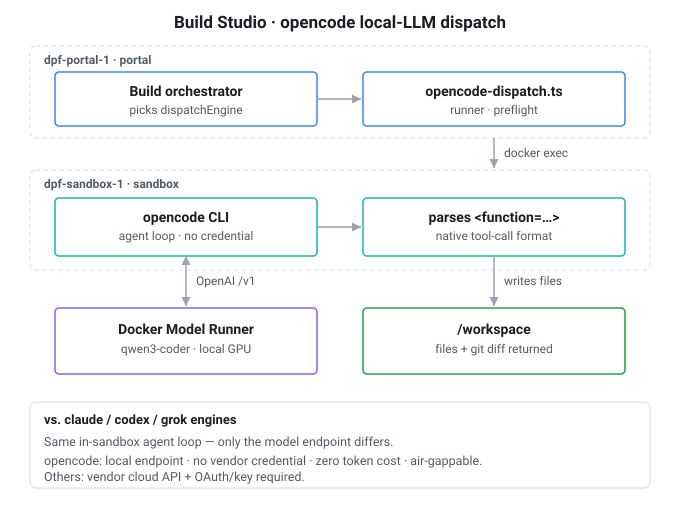

# Local-LLM build engine (opencode)

Build Studio can develop the platform using the install's **own local LLM**, with no
vendor credential and no token cost. This is the platform's built-in support for
developing itself on the operator's own hardware. The capability is delivered by a
dedicated Build Studio dispatch engine, **opencode**, that runs the install's bundled
Docker Model Runner model (e.g. `qwen3-coder`) as a coding agent inside the sandbox.



## What opencode is

[opencode](https://github.com/sst/opencode) (`sst/opencode`, npm `opencode-ai`, pinned
to a baseline-musl build) is an open-source terminal coding agent — the same category as
Claude Code or the Codex CLI, but vendor-neutral. You point it at any OpenAI-compatible
model endpoint and run it headless:

```
opencode run --dir /workspace -m local/<model> --format json \
  --dangerously-skip-permissions "<prompt>"
```

It runs its own agent loop (read files → call the model → execute tool calls → repeat),
emits structured JSON events, and edits files in place.

## Why it exists

Build Studio already had three dispatch engines — `claude`, `codex`, `grok` — but every
one needs a vendor credential and bills tokens to a cloud API. opencode is the
**local-LLM equivalent**: inference goes to the install's own endpoint (Docker Model
Runner / Ollama / vLLM), so a build runs **with no credential, at zero token cost, and
air-gappable**. That is what "Build Studio off the local LLM" means.

The decisive technical detail: small local models such as `qwen3-coder` do not reliably
do *API-level* tool calling, but they emit tool calls in their **native `<function=…>`
text format**. opencode parses that format itself and drives the tool loop — so the
robustness comes from opencode, not from the model's API. This is why the build path
works on a model whose API `supportsToolUse` flag is `false`, and why the Build Studio
capability gate admits a local model **only when the opencode engine is present**.

## How it is wired in

- **Portal** (`dpf-portal-1`): the build orchestrator picks the `dispatchEngine` and hands
  the task to `opencode-dispatch.ts` — the runner that mirrors `claude-dispatch.ts` /
  `codex-dispatch.ts`. It runs a hard **preflight** (endpoint reachable + model present +
  context above an advisory floor) before spending minutes on local inference.
- **Sandbox** (`dpf-sandbox-1`): the runner does `docker exec` into the sandbox and runs
  the **opencode CLI** there — the same isolation as the other engines. A generated
  `~/.config/opencode/opencode.json` declares a custom provider named `local` and sets
  `permission: allow` so a TTY-less container never blocks.
- **Model**: opencode calls the **Docker Model Runner** (e.g. `qwen3-coder` on the local
  GPU) over the OpenAI-compatible `/v1` API.
- **Output**: tool calls write into `/workspace`; the `--format json` stream is parsed
  back into a dispatch record plus a git diff.

## Install and registration

- `Dockerfile.sandbox` installs the pinned opencode binary into `/usr/local/bin` and
  pre-stages it under `/opt/dpf-engines/opencode` (the musl variant sidesteps an
  npm-on-Alpine install bug).
- `packages/db/data/build-engines.json` registers opencode as a build engine with
  `bakeInDefault: true` plus prestaged-binary and curl provisioning recipes — which is the
  `BuildEngine` / `BuildEngineState.present` row the capability gate checks.

## Where it sits in the pipeline

A local-only install serves all five Build Studio phases:

- **Ideate** and **Plan**: pure text generation via portal-side routing
  (`routeAndCall`, quality-first) → the strong-tier local model; no API tool-use is
  required.
- **Build**: the orchestrator dispatches the task to the opencode runner → opencode plus
  the local model writes the code.
- **Review** / **Ship**: the same governed gates as any other engine.

So the local LLM serves the whole pipeline; opencode is specifically the **build-phase
execution engine** that makes code-writing robust on a small local model.

## Relationship to the other engines

opencode is one of several Build Studio dispatch engines and is selected by the same
auto-detection and provider configuration as the rest. Its default role is still the
local/no-credential engine: opencode points at a local OpenAI-compatible endpoint and
needs no vendor credential, whereas claude / codex / grok point at a cloud API and
require OAuth or an API key.

The engine itself is provider-neutral. DPF can also point opencode at a credentialed
OpenAI-compatible coding endpoint, such as Z.ai's GLM Coding endpoint, by writing an
opencode provider config with a non-`local` provider name and exporting the provider API
key only inside the sandbox runner script. Local providers keep the Docker Model Runner
preflight because DPF can inspect their served models and context window; remote
OpenCode providers resolve through `ModelProvider` + `CredentialEntry` and surface
account-tier/model-entitlement failures from the provider call.

The in-sandbox agent loop, JSON event parsing, dispatch-attempt evidence, and governed
phase gates stay shared across local and credentialed opencode targets.

For an autonomous Living Playbook lane, routing is part of the evidence contract rather than an
implementation detail. The active binding is matched against a model profile (`local-coding` or
`frontier-coding`), while the phase execution profile records the provider and model actually
selected. Changing the model tier, provider readiness, or scope invalidates the prior eligibility
decision and forces a new check before the next consequential transition. A local-model result
therefore supports only the method/model/scope combination that produced it; it cannot authorize a
different provider or higher-risk lane.

> **Versioning note:** the opencode CLI contract above is pinned to a specific release
> and was researched against opencode's own documentation. Re-verify the `run` flags and
> config schema on any version bump.
