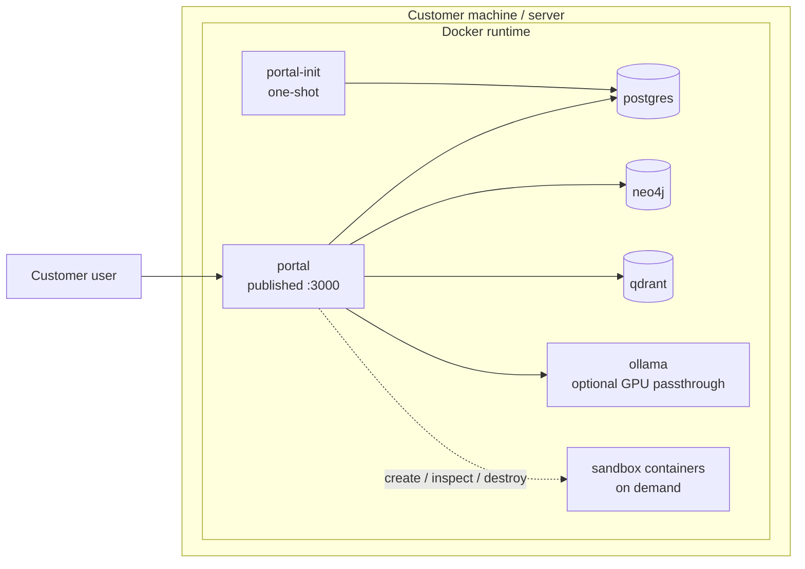
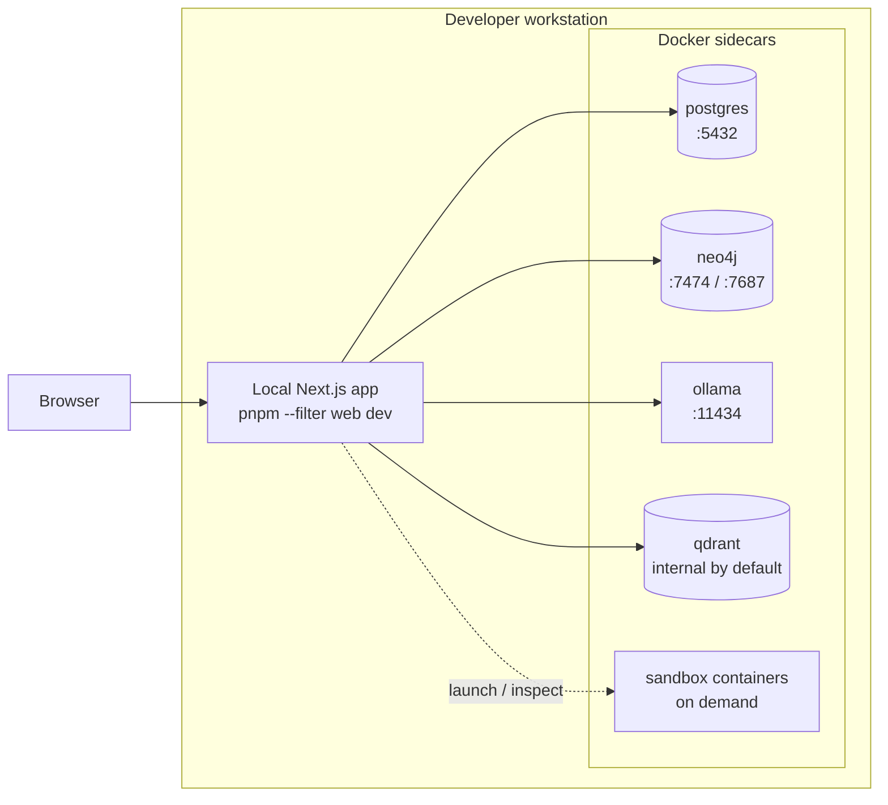
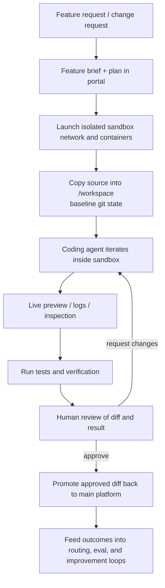

# Platform Overview

This document explains the main runtime pieces of Open Digital Product Factory, the two supported deployment models, the sandbox-based iterative workflow, and the practical hardware tiers for running the platform well.

The intent is to separate the always-on platform runtime from the evolving self-improvement loop. Some sandbox capabilities already exist in the codebase today. The broader governed iterative workflow is the target direction and should be read as an architecture goal, not as a claim that every stage is already fully automated.

## Current Runtime Core

The current platform runtime is a containerized application stack centered on the `portal` application and a small set of supporting data and AI services.

### Core Services

| Service | Role |
|---------|------|
| `portal-init` | One-shot startup container that waits for infrastructure readiness, applies Prisma migrations, and exits once initialization is complete |
| `portal` | Main Next.js application surface for operations, portfolio, architecture, AI coworker, storefront, and governance workflows |
| `postgres` | System of record for transactional platform data |
| `neo4j` | Graph storage for relationship-rich models such as enterprise architecture and connected capability views |
| `qdrant` | Vector database for semantic indexing, retrieval, and memory-style AI support |
| `ollama` | Local AI inference runtime for local-first deployments |
| External AI providers | Optional provider layer used when the tenant enables remote model access |

### Runtime Characteristics

- `portal` is the only service that needs to be directly exposed to end users in the target customer deployment.
- `postgres`, `neo4j`, `qdrant`, and `ollama` remain internal services by default.
- `portal` can route AI work to either local Ollama models or enabled external providers.
- Governance, auditability, and human approval sit above the execution layer rather than outside it.

## Deployment Model 1: Customer Mode

Customer mode is the target packaged deployment. The platform runs as a contained Docker stack with minimal host-level prerequisites and with a bias toward local data ownership.

### Characteristics

- Everything runs in Docker.
- Only the web app is published externally, normally on port `3000`.
- Databases and local AI stay on the internal Docker network.
- Optional GPU passthrough can be enabled for stronger Ollama performance.
- Sandbox containers are launched only when needed and are not part of the steady-state runtime.

### Mermaid Diagram

### Best Fit

Use customer mode when the goal is:

- the simplest supported install
- strong local control over platform data
- an internal-only infrastructure footprint
- minimal dependency on local developer tooling

## Deployment Model 2: Native Developer Mode

Native developer mode uses the same platform services, but changes the ergonomics. Stateful infrastructure remains in Docker while the app itself runs locally for debugging, hot reload, and tighter development loops.

### Characteristics

- `portal` runs locally via `pnpm --filter web dev`
- `postgres`, `neo4j`, `ollama`, and related services remain containerized
- Docker-published ports let the local app connect directly to those services
- IDE integration and live debugging are first-class in this mode
- The same sandbox image and sandbox orchestration mechanisms can still be used

### Mermaid Diagram

### Best Fit

Use native developer mode when you need:

- local IDE debugging
- hot reload during UI and API changes
- direct inspection of logs and service state
- a faster inner loop for development work

## Sandbox and Iterative Build Workflow

The platform includes the beginnings of a governed iterative build loop built around an isolated sandbox image and optional isolated sandbox infrastructure.

### Implemented Building Blocks

The current codebase already includes:

- a dedicated `dpf-sandbox` image definition
- source copy into an isolated `/workspace`
- sandbox-local dependency install and Prisma client generation
- a local development server inside the sandbox
- optional sandbox-local `postgres`, `neo4j`, and `qdrant` containers on a dedicated network
- time, CPU, memory, and disk limits for sandbox containers
- sandbox lifecycle controls for launch, inspect, and teardown

### Target Iterative Workflow

The target workflow layers governance and feedback on top of those sandbox primitives:

1. A user or operator proposes a feature or change
2. The platform records a brief, plan, and constraints
3. An isolated sandbox network and runtime are launched
4. Source is copied into the workspace with a clean baseline
5. An agent iterates on the change inside the sandbox
6. Preview, logs, and verification results are inspected
7. A human reviews the diff and outcome
8. Approved changes are promoted back into the main platform
9. Outcome data feeds evaluation, routing, and improvement systems

### Mermaid Diagram

### Important Boundaries

- The sandbox is isolated from the main runtime and can be destroyed completely.
- The sandbox may run its own temporary infrastructure rather than sharing the live databases.
- Human review remains the promotion gate for consequential changes.
- The adaptive feedback loop should tune behavior gradually rather than allowing uncontrolled architectural drift.

## Data Architecture: Three Complementary Data Layers

The platform uses three distinct data stores, each optimized for a different kind of question. Understanding which system answers which question is key to understanding the architecture.

### Layer 1: PostgreSQL — System of Record

PostgreSQL is the authoritative source for all mutable platform data. Every entity, relationship, configuration, and credential lives here. All writes go to Postgres first; other systems receive projections.

| What It Stores | Examples |
|---------------|---------|
| Business entities | Digital products, portfolios, taxonomy nodes, backlog items, epics |
| Infrastructure inventory | InventoryEntity, InventoryRelationship (from bootstrap discovery) |
| AI workforce | Agents, providers, credentials, token usage, task evaluations |
| Governance | Change requests, deployment windows, audit trails, authority grants |
| Health data | HealthSnapshot, PortfolioQualityIssue (from monitoring pipeline) |

**Question it answers:** "What is the current state of this entity and its full history?"

### Layer 2: Neo4j — Graph Projection for Topology and Impact

Neo4j receives a **read-only projection** from PostgreSQL. It does not accept direct writes — sync functions (`syncDigitalProduct`, `syncInventoryEntityAsInfraCI`, `syncEaElement`) fire after Postgres writes and project the data into graph form. Failures are logged but never block the source write.

| Node Type | Source | Purpose |
|-----------|--------|---------|
| DigitalProduct | Prisma DigitalProduct | Portfolio membership, taxonomy classification |
| TaxonomyNode | Prisma TaxonomyNode | Hierarchy traversal (CHILD_OF relationships) |
| Portfolio | Prisma Portfolio | Product grouping |
| InfraCI | Prisma InventoryEntity | Infrastructure topology (hosts, containers, databases, monitoring services) |
| EaElement | Prisma EaElement | Enterprise architecture modeling (ArchiMate notation) |

**Relationship types:** BELONGS_TO, CATEGORIZED_AS, CHILD_OF, DEPENDS_ON (with role: hosts, monitors, depends_on, stores_data_in), PROVIDES_TO, EA_REPRESENTS, and dynamic EA relationship types.

**Questions it answers:**
- "If PostgreSQL goes down, what digital products are affected?" (downstream impact traversal)
- "What infrastructure does this product depend on?" (upstream dependency traversal)
- "What is the shortest dependency path between these two systems?" (shortest path)
- "Show me the full topology of the Foundational portfolio" (subgraph extraction)

**What it cannot answer:** "How is PostgreSQL performing right now?" or "What was the CPU usage of this container over the last hour?" — those are time-series questions.

### Layer 3: Prometheus — Time-Series Metrics for Operational Health

Prometheus scrapes metrics from running services every 10-15 seconds and stores them as time-series data with 15-day retention. It is the operational health layer — it knows how things are performing right now and how that has changed over time.

| What It Collects | Source | Metrics |
|-----------------|--------|---------|
| Container resources | cAdvisor | CPU %, memory bytes, network I/O, disk I/O, restart count per container |
| Host resources | node-exporter | Total CPU, memory, disk utilization, network throughput |
| Database health | postgres-exporter | Connection pool utilization, active connections, query performance |
| Application performance | Portal /api/metrics (prom-client) | HTTP request latency, error rates, AI inference duration/tokens/cost |
| AI provider health | Portal /api/metrics | Inference errors by type (auth, rate_limit, network), semantic memory ops |
| Vector DB health | Qdrant native /metrics | Collection sizes, search latency |

**Questions it answers:**
- "What is the CPU utilization of the portal container right now?"
- "What was the p95 AI inference latency over the last hour?"
- "Is the Qdrant vector DB reachable?"
- "How many auth errors has the Anthropic provider thrown in the last 5 minutes?"

**What it cannot answer:** "What depends on Qdrant?" or "Which digital products are affected if Qdrant goes down?" — those are graph questions.

### How the Three Layers Work Together

*[High-resolution PNG](monitoring-diagrams/png/01-three-layer-data-architecture.png) | [Mermaid source](monitoring-diagrams/01-three-layer-data-architecture.mmd)*

**The convergence point** is the platform's native UI. Only the platform can combine:
- Topology from Neo4j ("Prometheus monitors PostgreSQL")
- Health from Prometheus ("PostgreSQL CPU is at 85%")
- Business context from PostgreSQL ("PostgreSQL belongs to the Foundational portfolio and is attributed to the Database taxonomy node")

No single data store has all three. This is why the platform renders its own dashboards rather than delegating entirely to Grafana.

### Grafana's Role: Power-User Escape Hatch

Grafana is included in the monitoring stack but serves a different audience and purpose:

| | Platform UI | Grafana |
|---|---|---|
| **Audience** | All users — business owners, operators, product managers | Platform engineers, DevOps, advanced troubleshooting |
| **Data sources** | PostgreSQL + Neo4j + Prometheus (all three) | Prometheus only (time-series) |
| **Navigation** | Integrated into product lifecycle views | Separate tool at :3002 |
| **Dashboards** | Curated, pre-built, context-aware | Ad-hoc, customizable, raw PromQL |
| **Graph data** | Yes — topology, impact analysis, dependency visualization | No — cannot query Neo4j |
| **Business context** | Yes — portfolios, products, taxonomy, governance | No — infrastructure metrics only |
| **Alerting** | Fires into PortfolioQualityIssue (platform-native, visible in product lifecycle) | Fires into Grafana UI (separate tool) |

*[High-resolution PNG](monitoring-diagrams/png/04-grafana-vs-platform-ui.png) | [Mermaid source](monitoring-diagrams/04-grafana-vs-platform-ui.mmd)*

**When to use Grafana:** Something is wrong and you need to dig deeper — correlate metrics across arbitrary dimensions, zoom into a 5-minute window, write custom PromQL queries, explore metrics that the platform UI doesn't surface yet.

**When to use the platform UI:** Day-to-day operational awareness, product lifecycle health, impact analysis before changes, understanding which digital products are affected by infrastructure degradation.

### Monitoring Stack Topology

The monitoring stack runs as part of the default Docker Compose stack. All services are headless infrastructure — they feed the platform's native UI and alert pipeline.

*[High-resolution PNG](monitoring-diagrams/png/02-monitoring-stack-topology.png) | [Mermaid source](monitoring-diagrams/02-monitoring-stack-topology.mmd)*

### AI Provider Failure Detection and Recovery

When an AI provider fails (credential expiry, rate limit exhaustion, network outage), the platform detects, adapts, and surfaces the issue through a governed cascade:

*[High-resolution PNG](monitoring-diagrams/png/03-provider-failure-cascade.png) | [Mermaid source](monitoring-diagrams/03-provider-failure-cascade.mmd)*

Key design: degradation is **feature-specific, not platform-wide**. A missing deep-thinker provider degrades Build Studio (code generation) but has no impact on portfolio management or backlog tracking. The platform surfaces contextual warnings on the affected feature, not a global error banner.

### Neo4j Sync Integrity

Because Neo4j is a projection, it can fall out of sync with PostgreSQL. The current sync is fire-and-forget — failures are logged but not retried. This is a known operational risk that the monitoring system should track:

- **Sync success/failure rate** — Prometheus metric to track projection health
- **Drift detection** — periodic reconciliation comparing Postgres entity counts to Neo4j node counts
- **Full rebuild** — the EA graph has `rebuildEaGraph()` for complete re-projection; inventory/product graphs should have equivalent capability

When the monitoring stack detects sync drift, it creates a `PortfolioQualityIssue` so operators are aware that graph-based views (impact analysis, dependency topology) may be stale.

---

## Hardware Guidance

The platform supports a broad range of hardware, but the user experience changes significantly depending on whether the goal is simple evaluation, day-to-day local AI, or sandbox-heavy self-building workflows.

### Practical Tiers

| Tier | CPU | RAM | Storage | GPU | Best for |
|------|-----|-----|---------|-----|----------|
| Minimum viable local run | Modern 4 cores | 16 GB | 50-100 GB SSD | None required | Evaluation, administration, and external-provider-first usage |
| Recommended for serious use | 8+ cores | 32 GB | 100-200 GB NVMe SSD | Optional, 8-12 GB VRAM recommended | Small-team use, local-first AI, and moderate sandbox iteration |
| Best for self-building / sandbox-heavy use | 12+ cores | 64 GB+ | 200+ GB NVMe SSD | 16 GB+ VRAM recommended | Frequent sandbox launches, heavier local models, and tighter iterative workflows |

### Current Local Model Auto-Selection

The current installer and Ollama entrypoint use detected RAM and VRAM to choose a default local model automatically:

| Hardware signal | Default model |
|----------------|---------------|
| GPU with 16 GB+ VRAM | `qwen3:32b` |
| GPU with 8-16 GB VRAM | `qwen3:14b` |
| GPU with 4-8 GB VRAM | `qwen3:8b` |
| CPU-only with 16 GB+ RAM | `qwen3:8b` |
| CPU-only with 8-16 GB RAM | `qwen3:1.7b` |
| Constrained systems below that | `qwen3:0.6b` |

These defaults are meant to keep installation practical. They are not the only models the platform can use, and they do not replace the broader multi-provider routing strategy for remote models.

## Summary

Open Digital Product Factory is designed as a contained business platform with:

- a main application container
- internal data and AI services
- optional external model providers
- isolated sandbox environments for controlled iteration
- two practical operating modes: packaged customer deployment and native developer mode

That architecture is what allows the platform to combine operational software, governed AI, and iterative self-improvement without collapsing everything into one unsafe runtime.
