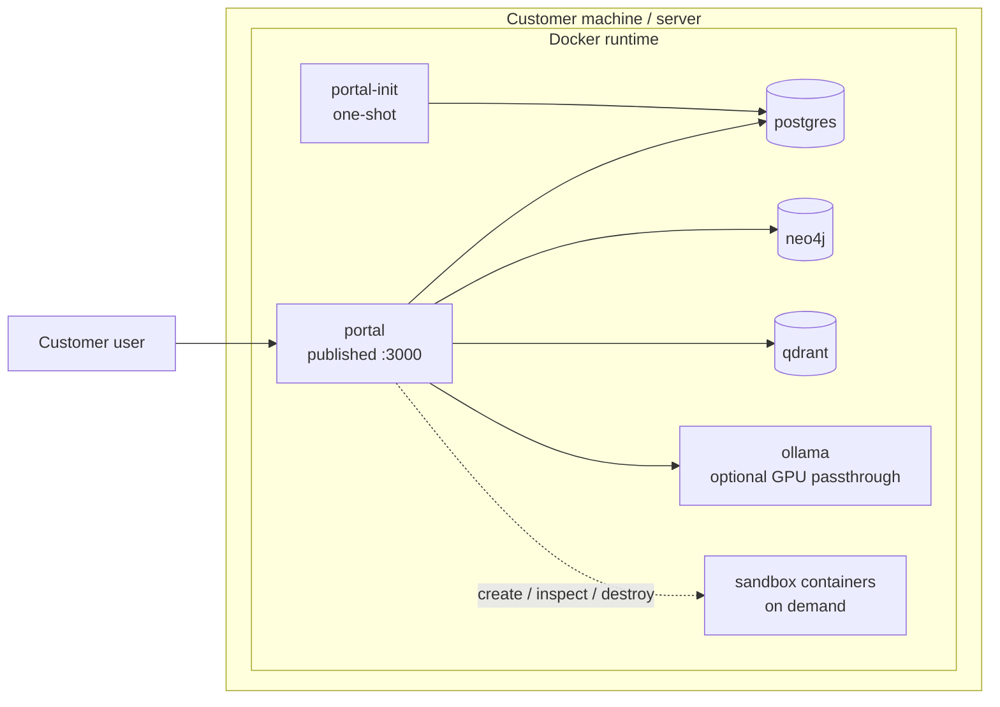
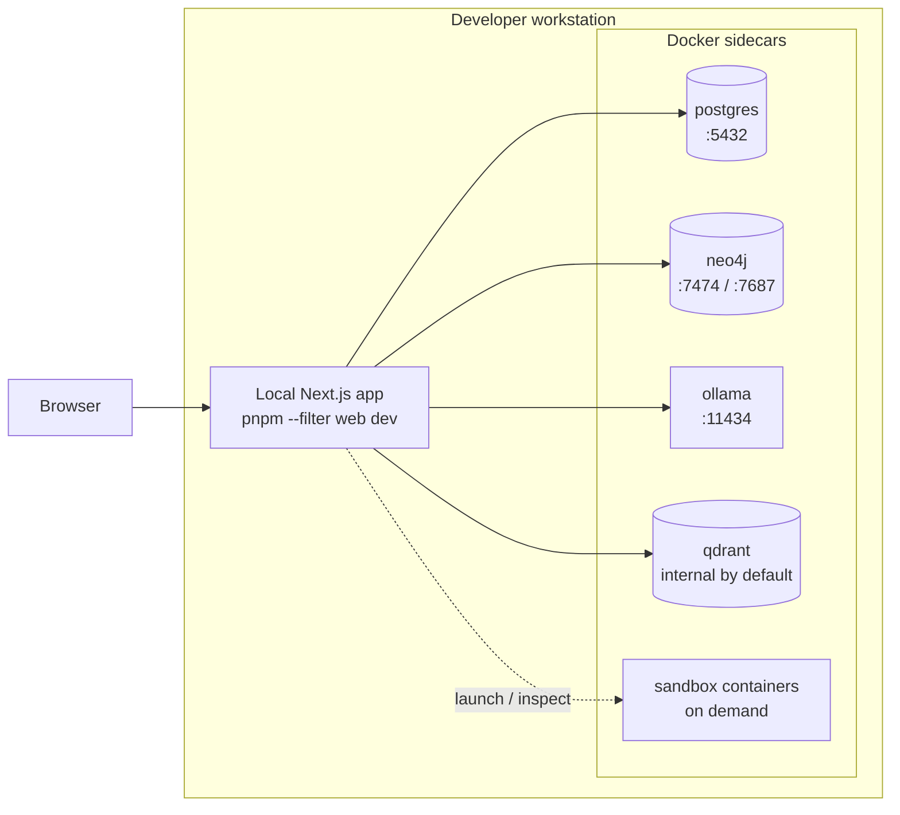
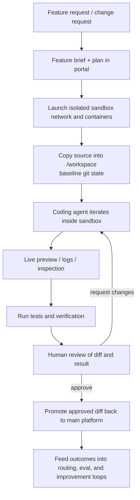

# Platform Overview

This document explains the main runtime pieces of Open Digital Product Factory, the two supported deployment models, the sandbox-based iterative workflow, and the practical hardware tiers for running the platform well.

The intent is to separate the always-on platform runtime from the evolving self-improvement loop. Some sandbox capabilities already exist in the codebase today. The broader governed iterative workflow is the target direction and should be read as an architecture goal, not as a claim that every stage is already fully automated.

## Current Runtime Core

The current platform runtime is a containerized application stack centered on the `portal` application and a small set of supporting data and AI services.

### Core Services

| Service | Role |
|---------|------|
| `portal-init` | One-shot startup container that waits for infrastructure readiness, applies Prisma migrations, and exits once initialization is complete |
| `portal` | Main Next.js application surface for operations, portfolio, architecture, AI coworker, storefront, and governance workflows |
| `postgres` | System of record for transactional platform data |
| `neo4j` | Graph storage for relationship-rich models such as enterprise architecture and connected capability views |
| `qdrant` | Vector database for semantic indexing, retrieval, and memory-style AI support |
| `ollama` | Local AI inference runtime for local-first deployments |
| External AI providers | Optional provider layer used when the tenant enables remote model access |

### Runtime Characteristics

- `portal` is the only service that needs to be directly exposed to end users in the target customer deployment.
- `postgres`, `neo4j`, `qdrant`, and `ollama` remain internal services by default.
- `portal` can route AI work to either local Ollama models or enabled external providers.
- Governance, auditability, and human approval sit above the execution layer rather than outside it.

## Deployment Model 1: Customer Mode

Customer mode is the target packaged deployment. The platform runs as a contained Docker stack with minimal host-level prerequisites and with a bias toward local data ownership.

### Characteristics

- Everything runs in Docker.
- Only the web app is published externally, normally on port `3000`.
- Databases and local AI stay on the internal Docker network.
- Optional GPU passthrough can be enabled for stronger Ollama performance.
- Sandbox containers are launched only when needed and are not part of the steady-state runtime.

### Mermaid Diagram

### Best Fit

Use customer mode when the goal is:

- the simplest supported install
- strong local control over platform data
- an internal-only infrastructure footprint
- minimal dependency on local developer tooling

## Deployment Model 2: Native Developer Mode

Native developer mode uses the same platform services, but changes the ergonomics. Stateful infrastructure remains in Docker while the app itself runs locally for debugging, hot reload, and tighter development loops.

### Characteristics

- `portal` runs locally via `pnpm --filter web dev`
- `postgres`, `neo4j`, `ollama`, and related services remain containerized
- Docker-published ports let the local app connect directly to those services
- IDE integration and live debugging are first-class in this mode
- The same sandbox image and sandbox orchestration mechanisms can still be used

### Mermaid Diagram

### Best Fit

Use native developer mode when you need:

- local IDE debugging
- hot reload during UI and API changes
- direct inspection of logs and service state
- a faster inner loop for development work

## Sandbox and Iterative Build Workflow

The platform includes the beginnings of a governed iterative build loop built around an isolated sandbox image and optional isolated sandbox infrastructure.

### Implemented Building Blocks

The current codebase already includes:

- a dedicated `dpf-sandbox` image definition
- source copy into an isolated `/workspace`
- sandbox-local dependency install and Prisma client generation
- a local development server inside the sandbox
- optional sandbox-local `postgres`, `neo4j`, and `qdrant` containers on a dedicated network
- time, CPU, memory, and disk limits for sandbox containers
- sandbox lifecycle controls for launch, inspect, and teardown

### Target Iterative Workflow

The target workflow layers governance and feedback on top of those sandbox primitives:

1. A user or operator proposes a feature or change
2. The platform records a brief, plan, and constraints
3. An isolated sandbox network and runtime are launched
4. Source is copied into the workspace with a clean baseline
5. An agent iterates on the change inside the sandbox
6. Preview, logs, and verification results are inspected
7. A human reviews the diff and outcome
8. Approved changes are promoted back into the main platform
9. Outcome data feeds evaluation, routing, and improvement systems

### Mermaid Diagram

### Important Boundaries

- The sandbox is isolated from the main runtime and can be destroyed completely.
- The sandbox may run its own temporary infrastructure rather than sharing the live databases.
- Human review remains the promotion gate for consequential changes.
- The adaptive feedback loop should tune behavior gradually rather than allowing uncontrolled architectural drift.

## Hardware Guidance

The platform supports a broad range of hardware, but the user experience changes significantly depending on whether the goal is simple evaluation, day-to-day local AI, or sandbox-heavy self-building workflows.

### Practical Tiers

| Tier | CPU | RAM | Storage | GPU | Best for |
|------|-----|-----|---------|-----|----------|
| Minimum viable local run | Modern 4 cores | 16 GB | 50-100 GB SSD | None required | Evaluation, administration, and external-provider-first usage |
| Recommended for serious use | 8+ cores | 32 GB | 100-200 GB NVMe SSD | Optional, 8-12 GB VRAM recommended | Small-team use, local-first AI, and moderate sandbox iteration |
| Best for self-building / sandbox-heavy use | 12+ cores | 64 GB+ | 200+ GB NVMe SSD | 16 GB+ VRAM recommended | Frequent sandbox launches, heavier local models, and tighter iterative workflows |

### Current Local Model Auto-Selection

The current installer and Ollama entrypoint use detected RAM and VRAM to choose a default local model automatically:

| Hardware signal | Default model |
|----------------|---------------|
| GPU with 16 GB+ VRAM | `qwen3:32b` |
| GPU with 8-16 GB VRAM | `qwen3:14b` |
| GPU with 4-8 GB VRAM | `qwen3:8b` |
| CPU-only with 16 GB+ RAM | `qwen3:8b` |
| CPU-only with 8-16 GB RAM | `qwen3:1.7b` |
| Constrained systems below that | `qwen3:0.6b` |

These defaults are meant to keep installation practical. They are not the only models the platform can use, and they do not replace the broader multi-provider routing strategy for remote models.

## Summary

Open Digital Product Factory is designed as a contained business platform with:

- a main application container
- internal data and AI services
- optional external model providers
- isolated sandbox environments for controlled iteration
- two practical operating modes: packaged customer deployment and native developer mode

That architecture is what allows the platform to combine operational software, governed AI, and iterative self-improvement without collapsing everything into one unsafe runtime.
