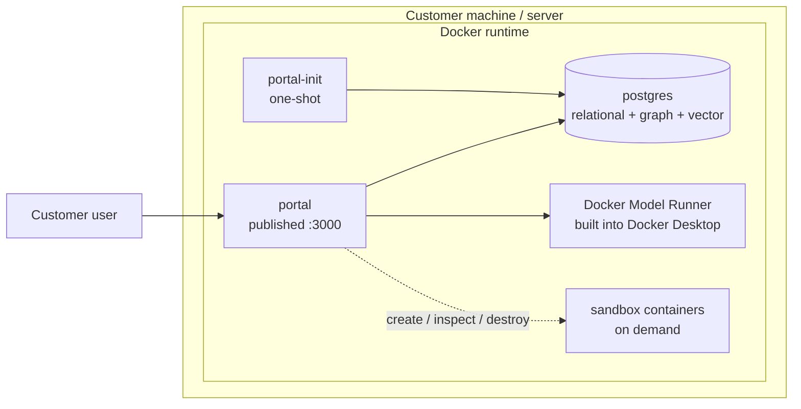
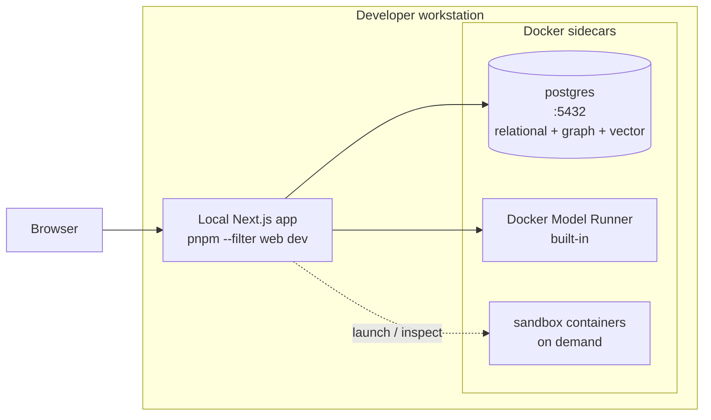
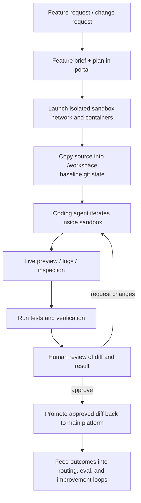

---
# Doc-impact edges (EP-DOCS-SYSTEM Phase 4). Changing any file below flags this
# page for review in the Docs Impact Gate, because this page documents the
# runtime topology and datastore substrate those files define. Retiring a
# datastore without this list is how the BET-5 Neo4j/Qdrant removal shipped
# while this page still described Neo4j as a live service.
relatedCode:
  - docker-compose.yml
  - packages/db/prisma/schema
  - packages/db/src/pg-graph.ts
  - packages/db/src/pgvector-store.ts
  - monitoring/prometheus/prometheus.yml
---

# Platform Overview

> **Which overview wins:** this page is the **canonical living overview** for runtime topology, deployment models, the sandbox/build workflow, and data architecture. [`orientation.md`](orientation.md) is the entry-point index and defers to this page for depth; where the two disagree, this page wins and orientation carries the bug.

> **Scope:** this document describes the **current GA runtime** — the Single VM substrate served via Docker Desktop on Windows. Multi-platform (macOS Apple Silicon, native Linux), customer-cloud (AWS / GCP / Azure), Managed Kubernetes, and TAPPaaS deployment shapes are documented under the deployment doctrine at [`docs/superpowers/specs/2026-05-09-deployment-contracts.md`](https://github.com/OpenDigitalProductFactory/opendigitalproductfactory/blob/main/docs/superpowers/specs/2026-05-09-deployment-contracts.md). Implementation status for each is tracked in the [umbrella branch plan](https://github.com/OpenDigitalProductFactory/opendigitalproductfactory/blob/main/docs/superpowers/plans/2026-05-09-deployment-architecture-and-rollout.md).

This document explains the main runtime pieces of Open Digital Product Factory, the two supported deployment models, the sandbox-based iterative workflow, and the practical hardware tiers for running the platform well.

The intent is to separate the always-on platform runtime from the evolving self-improvement loop. Some sandbox capabilities already exist in the codebase today. The broader governed iterative workflow is the target direction and should be read as an architecture goal, not as a claim that every stage is already fully automated.

## Current Runtime Core

The current platform runtime is a containerized application stack centered on the `portal` application and a small set of supporting data and AI services.

### Core Services

| Service | Role |
|---------|------|
| `portal-init` | One-shot startup container that waits for infrastructure readiness, applies Prisma migrations, and exits once initialization is complete |
| `portal` | Main Next.js application surface for operations, portfolio, architecture, AI coworker, storefront, and governance workflows |
| `postgres` | The single datastore: system of record for transactional data, **plus** the graph mirror (`graph_node` / `graph_edge`) for topology and impact, **plus** vector storage via `pgvector` for semantic indexing and memory. Built from `docker/postgres/Dockerfile` so the `vector` and `ltree` extensions can never drift out of the image |
| `inngest` | Durable execution engine for scheduled jobs, event-driven workflows, and retryable background tasks |
| `redis` | In-memory store backing Inngest's job queue and state |
| Docker Model Runner | Local AI inference built into Docker Desktop 4.40+ — no separate container needed. Models managed via `docker model pull`. On Linux installs without Docker Desktop, Ollama in compose substitutes; on TAPPaaS deployments, the customer's AI Stack Ollama / LiteLLM serves the same role. The runtime contract (`DPF_LLM_PROVIDER`, `LLM_BASE_URL`) is universal — see Doctrine Contract 9. |
| External AI providers | Optional provider layer used when the tenant enables remote model access |

### Runtime Characteristics

- `portal` is the only service that needs to be directly exposed to end users in the target customer deployment.
- `postgres` remains an internal service by default. Docker Model Runner is built into Docker Desktop and does not run as a separate container.
- `portal` can route AI work to either local models (via Docker Model Runner) or enabled external providers.
- Governance, auditability, and human approval sit above the execution layer rather than outside it.

> **One datastore, not three.** Earlier releases ran Neo4j (graph) and Qdrant (vectors) as separate services. **BET-5 (BI-A1E864A5) retired both onto PostgreSQL** — graph traversals moved to the `graph_node` / `graph_edge` mirror queried with recursive CTEs (`packages/db/src/pg-graph.ts`), and vectors moved to `pgvector` (`packages/db/src/pgvector-store.ts`). Both swaps were parity-verified against the live services before cutover. Existing installs remove the retired containers and volumes with `scripts/decommission-neo4j-qdrant.{sh,ps1}`.

## Deployment Model 1: Customer Mode

Customer mode is the target packaged deployment. The platform runs as a contained Docker stack with minimal host-level prerequisites and with a bias toward local data ownership.

### Characteristics

- Everything runs in Docker.
- Only the web app is published externally, normally on port `3000`.
- Databases and local AI stay on the internal Docker network.
- Docker Model Runner handles GPU passthrough automatically when a supported GPU is present.
- Sandbox containers are launched only when needed and are not part of the steady-state runtime.

### Mermaid Diagram


```mermaid
flowchart LR
    user[Customer user]

    subgraph host["Customer machine / server"]
        subgraph docker["Docker runtime"]
            portal[portal<br/>published :3000]
            init[portal-init<br/>one-shot]
            postgres[("postgres<br/>relational + graph + vector")]
            modelrunner[Docker Model Runner<br/>built into Docker Desktop]
            sandbox[sandbox containers<br/>on demand]
        end
    end

    user --> portal
    init --> postgres
    portal --> postgres
    portal --> modelrunner
    portal -. create / inspect / destroy .-> sandbox
```

### Best Fit

Use customer mode when the goal is:

- the simplest supported install
- strong local control over platform data
- an internal-only infrastructure footprint
- minimal dependency on local developer tooling

## Deployment Model 2: Native Developer Mode

Native developer mode uses the same platform services, but changes the ergonomics. Stateful infrastructure remains in Docker while the app itself runs locally for debugging, hot reload, and tighter development loops.

### Characteristics

- `portal` runs locally via `pnpm --filter web dev`
- `postgres` and related services remain containerized. Docker Model Runner is built into Docker Desktop.
- Docker-published ports let the local app connect directly to those services
- IDE integration and live debugging are first-class in this mode
- The same sandbox image and sandbox orchestration mechanisms can still be used

### Mermaid Diagram


```mermaid
flowchart LR
    browser[Browser]

    subgraph workstation["Developer workstation"]
        localapp[Local Next.js app<br/>pnpm --filter web dev]

        subgraph docker["Docker sidecars"]
            postgres[("postgres<br/>:5432<br/>relational + graph + vector")]
            modelrunner[Docker Model Runner<br/>built-in]
            sandbox[sandbox containers<br/>on demand]
        end
    end

    browser --> localapp
    localapp --> postgres
    localapp --> modelrunner
    localapp -. launch / inspect .-> sandbox
```

### Best Fit

Use native developer mode when you need:

- local IDE debugging
- hot reload during UI and API changes
- direct inspection of logs and service state
- a faster inner loop for development work

## Sandbox and Iterative Build Workflow

The platform includes the beginnings of a governed iterative build loop built around an isolated sandbox image and optional isolated sandbox infrastructure.

### Implemented Building Blocks

The current codebase already includes:

- a dedicated `dpf-sandbox` image definition
- source copy into an isolated `/workspace`
- sandbox-local dependency install and Prisma client generation
- a local development server inside the sandbox
- an optional sandbox-local `postgres` container (`sandbox-postgres`, on `pgvector/pgvector:pg16`) on a dedicated network
- time, CPU, memory, and disk limits for sandbox containers
- sandbox lifecycle controls for launch, inspect, and teardown

### Target Iterative Workflow

The target workflow layers governance and feedback on top of those sandbox primitives:

1. A user or operator proposes a feature or change
2. The platform records a brief, plan, and constraints
3. An isolated sandbox network and runtime are launched
4. Source is copied into the workspace with a clean baseline
5. An agent iterates on the change inside the sandbox
6. Preview, logs, and verification results are inspected
7. A human reviews the diff and outcome
8. Approved changes are promoted back into the main platform
9. Outcome data feeds evaluation, routing, and improvement systems

### Mermaid Diagram


```mermaid
flowchart TD
    request[Feature request / change request]
    brief[Feature brief + plan in portal]
    launch[Launch isolated sandbox network and containers]
    workspace[Copy source into /workspace<br/>baseline git state]
    iterate[Coding agent iterates inside sandbox]
    preview[Live preview / logs / inspection]
    verify[Run tests and verification]
    review[Human review of diff and result]
    promote[Promote approved diff back to main platform]
    learn[Feed outcomes into routing, eval, and improvement loops]

    request --> brief
    brief --> launch
    launch --> workspace
    workspace --> iterate
    iterate --> preview
    preview --> verify
    verify --> review
    review -->|approve| promote
    review -->|request changes| iterate
    promote --> learn
```

### Important Boundaries

- The sandbox is isolated from the main runtime and can be destroyed completely.
- The sandbox may run its own temporary infrastructure rather than sharing the live databases.
- Human review remains the promotion gate for consequential changes.
- The adaptive feedback loop should tune behavior gradually rather than allowing uncontrolled architectural drift.

## Data Architecture: One Datastore, Three Question Shapes

The platform asks three fundamentally different kinds of question — *what is true*, *how is it performing*, and *what did it say* — and each needs a different storage shape. Understanding which layer answers which question is key to understanding the architecture.

What it does **not** need is a different *server* per shape. PostgreSQL answers the first shape in three modes (relational, graph, vector); Prometheus and Loki cover the other two because time-series and log storage are genuinely different engines, not just different query languages.

### Layer 1: PostgreSQL — System of Record

PostgreSQL is the authoritative source for all mutable platform data. Every entity, relationship, configuration, and credential lives here. All writes go to Postgres first; other systems receive projections.

| What It Stores | Examples |
|---------------|---------|
| Business entities | Digital products, portfolios, taxonomy nodes, backlog items, epics |
| Infrastructure inventory | InventoryEntity, InventoryRelationship (from bootstrap discovery) |
| AI workforce | Agents, providers, credentials, token usage, task evaluations |
| Governance | Change requests, deployment windows, audit trails, authority grants |
| Health data | HealthSnapshot, PortfolioQualityIssue (from monitoring pipeline) |
| Semantic memory | `pgvector` embeddings — one table, per-collection HNSW indexes |

**Question it answers:** "What is the current state of this entity and its full history?"

### Layer 2: The Graph Mirror — Topology and Impact

Relationship-shaped questions ("what breaks if this fails?") are answered by a **read-only graph mirror that lives inside PostgreSQL**: the `graph_node` and `graph_edge` tables, traversed with `WITH RECURSIVE` CTEs in [`packages/db/src/pg-graph.ts`](https://github.com/OpenDigitalProductFactory/opendigitalproductfactory/blob/main/packages/db/src/pg-graph.ts).

The mirror does not accept direct writes — sync functions (`syncDigitalProduct`, `syncInventoryEntityAsInfraCI`, `syncEaElement`) fire after Postgres writes and project the data into graph form. Failures are logged but never block the source write.

> **This layer used to be Neo4j.** BET-5 (BI-A1E864A5) retired it in favour of the in-Postgres mirror, porting the traversal surface function for function — `getDownstreamImpact`, `getUpstreamDependencies`, `shortestPath`, `getNeighbours`, `getLayeredDependencyStack` and the rest keep their names and semantics. Parity was verified against the live Neo4j instance (40/40 downstream-impact and 40/40 neighbour queries) before the swap. One less server, one less backup member, one less thing to fall out of sync at a different rate than everything else.

| Node Type | Source | Purpose |
|-----------|--------|---------|
| DigitalProduct | Prisma DigitalProduct | Portfolio membership, taxonomy classification |
| TaxonomyNode | Prisma TaxonomyNode | Hierarchy traversal (CHILD_OF relationships) |
| Portfolio | Prisma Portfolio | Product grouping |
| InfraCI | Prisma InventoryEntity | Infrastructure topology (hosts, containers, databases, monitoring services) |
| EaElement | Prisma EaElement | Enterprise architecture modeling (ArchiMate notation) |
| Code + data model | Source indexer, Prisma introspection | Source files and Prisma models/fields as first-class nodes |

**Relationship types traversed for impact:** DEPENDS_ON, HOSTS, RUNS_ON, LISTENS_ON, MONITORS, MEMBER_OF, ROUTES_THROUGH, CARRIED_BY, CONNECTS_TO, PEER_OF — defined once as `IMPACT_RELATIONSHIP_TYPES` so queries cannot drift apart. Structural edges (BELONGS_TO, CATEGORIZED_AS, CHILD_OF, EA_REPRESENTS and the dynamic EA types) sit alongside them.

**Questions it answers:**
- "If PostgreSQL goes down, what digital products are affected?" (downstream impact traversal)
- "What infrastructure does this product depend on?" (upstream dependency traversal)
- "What is the shortest dependency path between these two systems?" (shortest path)
- "Show me the full topology of the Foundational portfolio" (subgraph extraction)

**One adjacency structure, four corpora.** The mirror spans infrastructure CIs, the EA/ArchiMate ontology, the Prisma data model, and the source code itself — so a dependency question can cross from a running container to the model it persists to the file that defines it. Operators explore it visually at **`/admin/graph-explorer`**.

**What it cannot answer:** "How is PostgreSQL performing right now?" or "What was the CPU usage of this container over the last hour?" — those are time-series questions.

### Layer 3: Prometheus — Time-Series Metrics for Operational Health

Prometheus scrapes metrics from running services every 10-15 seconds and stores them as time-series data with 15-day retention. It is the operational health layer — it knows how things are performing right now and how that has changed over time.

| What It Collects | Source | Metrics |
|-----------------|--------|---------|
| Container resources | cAdvisor | CPU %, memory bytes, network I/O, disk I/O, restart count per container |
| Host resources | node-exporter | Total CPU, memory, disk utilization, network throughput |
| Database health | postgres-exporter | Connection pool utilization, active connections, query performance |
| Application performance | Portal /api/metrics (prom-client) | HTTP request latency, error rates, AI inference duration/tokens/cost |
| AI provider health | Portal /api/metrics | Inference errors by type (auth, rate_limit, network), semantic memory ops |

**Questions it answers:**
- "What is the CPU utilization of the portal container right now?"
- "What was the p95 AI inference latency over the last hour?"
- "How saturated is the Postgres connection pool?"
- "How many auth errors has the Anthropic provider thrown in the last 5 minutes?"

**What it cannot answer:** "What depends on Postgres?" or "Which digital products are affected if Postgres goes down?" — those are graph questions.

### How the Layers Work Together


```mermaid
%%{init: {'theme': 'base', 'themeVariables': { 'primaryColor': '#1e293b', 'primaryTextColor': '#f8fafc', 'primaryBorderColor': '#334155', 'lineColor': '#64748b', 'secondaryColor': '#0f172a', 'tertiaryColor': '#1e293b', 'fontSize': '14px' }}}%%
flowchart TB
    subgraph WRITES["ALL WRITES (Single Source of Truth)"]
        direction TB
        postgres[("PostgreSQL\n─────────────────\nSystem of Record\n\nDigital Products\nPortfolios & Taxonomy\nInventory Entities\nAI Providers & Agents\nChange Requests\nCredentials & Governance\nHealth Snapshots")]
    end

    subgraph PROJECTIONS["READ-ONLY PROJECTIONS"]
        direction LR
        graphmirror[("Graph Mirror\n(in PostgreSQL)\n─────────────────\nTopology & Impact\n\ngraph_node / graph_edge\nDigitalProduct nodes\nInfraCI nodes\nEaElement nodes\nCode + Prisma nodes\nDEPENDS_ON edges\nMONITORS edges\nBELONGS_TO edges")]
        prometheus[("Prometheus\n─────────────────\nTime-Series Metrics\n\nContainer CPU/Memory\nHost Resources\nInference Latency\nToken Consumption\nError Rates\nCredential Expiry\nRate Limit Utilization")]
    end

    subgraph QUESTIONS["WHAT EACH LAYER ANSWERS"]
        direction TB
        q_pg["Relational tables answer:\n'What is the current state\nof this entity?'\n'What changed and when?'"]
        q_neo["The graph mirror answers:\n'What breaks if this\ngoes down?'\n'What depends on what?'"]
        q_prom["Prometheus answers:\n'How is this performing\nright now?'\n'What was the p95 latency\nover the last hour?'"]
    end

    subgraph CONVERGENCE["PLATFORM UI (The Convergence Point)"]
        direction TB
        health["System Health Dashboard\nGauges · Charts · Alerts"]
        graph_view["Dependency Graph\nTopology + Health Overlay"]
        impact["Impact Analysis\nWhat breaks if X fails?"]
        product["Product Lifecycle View\nHealth · Backlog · Architecture"]
    end

    grafana["Grafana\n(Power-User Escape Hatch)\n─────────────────\nAd-hoc PromQL queries\nCustom dashboards\nRaw metric exploration\n\nPrometheus only\nNo graph · No business context"]

    postgres -->|"sync functions\n(fire-and-forget)"| graphmirror
    postgres -->|"HealthSnapshot\nrecords"| health

    prometheus -->|"real-time metrics\n(scraped every 15s)"| health
    prometheus -->|"health overlay\nvia bridge"| graph_view

    graphmirror -->|"recursive CTE\ntraversal"| graph_view
    graphmirror -->|"downstream\nimpact"| impact

    postgres -->|"entity data\nattribution"| graph_view
    postgres -->|"business\ncontext"| product

    health --> product
    graph_view --> product
    impact --> product

    prometheus -.->|"same metrics\ndifferent audience"| grafana

    style WRITES fill:#1e3a5f,stroke:#3b82f6,stroke-width:2px
    style PROJECTIONS fill:#1e293b,stroke:#64748b,stroke-width:1px
    style CONVERGENCE fill:#14532d,stroke:#22c55e,stroke-width:2px
    style QUESTIONS fill:#0f172a,stroke:#334155,stroke-width:1px
    style grafana fill:#44403c,stroke:#a8a29e,stroke-width:1px,stroke-dasharray: 5 5
    style postgres fill:#1e3a5f,stroke:#3b82f6,stroke-width:2px
    style graphmirror fill:#312e81,stroke:#6366f1,stroke-width:2px
    style prometheus fill:#7c2d12,stroke:#f97316,stroke-width:2px
```

**The convergence point** is the platform's native UI. Only the platform can combine:
- Topology from the graph mirror ("Prometheus monitors PostgreSQL")
- Health from Prometheus ("PostgreSQL CPU is at 85%")
- Business context from the relational tables ("PostgreSQL belongs to the Foundational portfolio and is attributed to the Database taxonomy node")

No single query surface has all three. This is why the platform renders its own dashboards rather than delegating entirely to Grafana.

### Grafana's Role: Power-User Escape Hatch

Grafana ships as an **opt-in** power-user tool — it is not started by `docker compose up` (enable it with `docker compose --profile observability-ui up -d grafana`). It serves a different audience and purpose than the platform UI:

| | Platform UI | Grafana |
|---|---|---|
| **Audience** | All users — business owners, operators, product managers | Platform engineers, DevOps, advanced troubleshooting |
| **Data sources** | PostgreSQL (relational + graph mirror) + Prometheus + Loki | Prometheus only (time-series) |
| **Navigation** | Integrated into product lifecycle views | Separate tool at :3002 |
| **Dashboards** | Curated, pre-built, context-aware | Ad-hoc, customizable, raw PromQL |
| **Graph data** | Yes — topology, impact analysis, dependency visualization | No — cannot query the graph mirror |
| **Business context** | Yes — portfolios, products, taxonomy, governance | No — infrastructure metrics only |
| **Alerting** | Fires into PortfolioQualityIssue (platform-native, visible in product lifecycle) | Fires into Grafana UI (separate tool) |


```mermaid
%%{init: {'theme': 'base', 'themeVariables': { 'primaryColor': '#1e293b', 'primaryTextColor': '#f8fafc', 'primaryBorderColor': '#334155', 'lineColor': '#64748b', 'secondaryColor': '#0f172a', 'tertiaryColor': '#1e293b', 'fontSize': '14px' }}}%%
flowchart TB
    subgraph DATASOURCES["DATA SOURCES"]
        direction LR
        pg[("PostgreSQL — tables\n─────\nEntities\nRelationships\nGovernance\nBusiness Context")]
        neo[("PostgreSQL — graph mirror\n─────\nGraph Topology\nImpact Paths\nDependencies\nEA Models")]
        prom[("Prometheus\n─────\nTime-Series\nMetrics\nCounters\nHistograms")]
    end

    subgraph PLATFORM["PLATFORM UI (Primary Experience)"]
        direction TB
        p_header["Every User Sees This"]
        p_health["System Health\n─────\nService status grid\nHost resource gauges\nAI provider table\nAgent quality scores\nAlert history"]
        p_graph["Dependency Graph\n─────\nTopology from the graph mirror\n+ Health from Prometheus\n+ Attribution from PostgreSQL\n= Full operational picture"]
        p_impact["Impact Analysis\n─────\n'If Postgres goes down,\nwhich products are affected?'\nGraph traversal + business context"]
        p_product["Product Lifecycle\n─────\nHealth tab per product\nFeature degradation warnings\nCapability tier availability"]
        p_coworker["AI Coworker\n─────\nContextual health warnings\n'Memory offline'\n'Inference degraded'"]
    end

    subgraph GRAFANA["GRAFANA (Power-User Tool)"]
        direction TB
        g_header["Platform Engineers Only"]
        g_custom["Custom Dashboards\n─────\nAd-hoc PromQL\nArbitrary time ranges\nMetric correlation"]
        g_debug["Debugging\n─────\nZoom to 5-min window\nCross-metric analysis\nRaw histogram buckets"]
        g_explore["Exploration\n─────\nDiscover new metrics\nBuild prototype panels\nTest alert expressions"]
    end

    pg -->|"entities +\nbusiness context"| PLATFORM
    neo -->|"topology +\nimpact paths"| PLATFORM
    prom -->|"real-time\nmetrics"| PLATFORM

    prom -->|"same metrics\ndifferent context"| GRAFANA

    pg -.-x|"NOT available"| GRAFANA
    neo -.-x|"NOT available"| GRAFANA

    style DATASOURCES fill:#0f172a,stroke:#334155,stroke-width:1px
    style PLATFORM fill:#14532d,stroke:#22c55e,stroke-width:2px
    style GRAFANA fill:#44403c,stroke:#a8a29e,stroke-width:1px,stroke-dasharray: 5 5
    style pg fill:#1e3a5f,stroke:#3b82f6,stroke-width:2px
    style neo fill:#312e81,stroke:#6366f1,stroke-width:2px
    style prom fill:#7c2d12,stroke:#f97316,stroke-width:2px
    style p_header fill:#166534,stroke:#22c55e
    style g_header fill:#57534e,stroke:#a8a29e
```

**When to use Grafana:** Something is wrong and you need to dig deeper — correlate metrics across arbitrary dimensions, zoom into a 5-minute window, write custom PromQL queries, explore metrics that the platform UI doesn't surface yet.

**When to use the platform UI:** Day-to-day operational awareness, product lifecycle health, impact analysis before changes, understanding which digital products are affected by infrastructure degradation.

### Monitoring Stack Topology

The monitoring stack (Prometheus, Loki, Alloy, Grafana, and the metric exporters) is **capability-activated, not default**: every one of them sits behind the `runtime-deep-observability` Compose profile and starts only when the `runtime:deep-observability` capability is enabled. An installation that has not enabled it collects nothing, and the metric-backed surfaces have no source. Grafana is a further step again — the platform renders its own context-aware dashboards and delivers alerts via the Inngest poll-bridge rather than through Grafana, so the Grafana UI is for power users.

⟦runtime: this paragraph previously claimed the headless stack "runs as part of the default Docker Compose stack". That was false against the Compose file and it made a real drift harder to spot — BI-5ACBAC50 found a live install whose capability state read `runtime:deep-observability: active` while no collector existed. Verify against `docker-compose.yml` profiles before restating it.⟧


```mermaid
%%{init: {'theme': 'base', 'themeVariables': { 'primaryColor': '#1e293b', 'primaryTextColor': '#f8fafc', 'primaryBorderColor': '#334155', 'lineColor': '#64748b', 'secondaryColor': '#0f172a', 'tertiaryColor': '#1e293b', 'fontSize': '14px' }}}%%
flowchart LR
    subgraph APP["Application Services"]
        direction TB
        portal["Portal\n:3000\n─────\n/api/metrics\nprom-client"]
        sandbox1["Sandbox 1\n:3035"]
        sandbox2["Sandbox 2\n:3037"]
        sandbox3["Sandbox 3\n:3038"]
    end

    subgraph DATA["Data Services"]
        direction TB
        pg[("PostgreSQL\n:5432\n─────\ntables + graph mirror\n+ pgvector")]
        redis_svc[("Redis\n:6379\n─────\nInngest queue state")]
    end

    subgraph AI["AI Inference"]
        modelrunner["Docker Model\nRunner\n─────\n/metrics native"]
        external["External\nProviders\n(Anthropic,\nOpenAI, etc.)"]
    end

    subgraph MON["Monitoring Stack"]
        direction TB
        prom["Prometheus\n:9090\n─────\n15s scrape interval\n15-day retention\n13 alert rules"]
        grafana_svc["Grafana\n:3002\n─────\nAuto-provisioned\ndashboards"]
        cadvisor["cAdvisor\n:8080\n─────\nContainer\nCPU/Mem/Net/Disk"]
        nodeexp["node-exporter\n:9100\n─────\nHost OS\nCPU/Mem/Disk"]
        pgexp["postgres-exporter\n:9187\n─────\nConnections\nQuery perf"]
        redisexp["redis-exporter\n:9121\n─────\nQueue depth\nMemory"]
        loki_svc["Loki + Alloy\n:3100\n─────\nContainer logs\n14-day retention\nLogQL ruler"]
    end

    subgraph PLATFORM_UI["Platform-Native UI"]
        direction TB
        sys_health["System Health\nDashboard"]
        nav_dot["Nav Bar\nHealth Dot"]
        coworker["AI Coworker\nHealth Warnings"]
        alerts_wh["Alert Webhook\n/api/platform/alerts"]
    end

    prom -->|"scrape\n/api/metrics"| portal
    prom -->|"scrape"| sandbox1
    prom -->|"scrape"| sandbox2
    prom -->|"scrape"| sandbox3
    prom -->|"scrape"| cadvisor
    prom -->|"scrape"| nodeexp
    prom -->|"scrape"| pgexp
    prom -->|"scrape"| redisexp
    prom -->|"scrape\nnative /metrics"| modelrunner

    cadvisor -.->|"Docker socket\n(read-only)"| portal
    cadvisor -.->|"monitors all\ncontainers"| pg
    cadvisor -.->|"monitors"| redis_svc

    pgexp -->|"SQL stats"| pg
    redisexp -->|"queue stats"| redis_svc

    grafana_svc -->|"datasource"| prom

    portal -->|"proxy\n/api/platform/metrics"| prom
    portal --> sys_health
    portal --> nav_dot
    portal --> coworker

    loki_svc -.->|"tails every\ncontainer's stdout"| portal
    portal -->|"poll firing alerts\n(Prometheus + Loki ruler)"| alerts_wh
    alerts_wh -->|"creates\nQualityIssue"| pg

    portal -.->|"inference\ncalls"| modelrunner
    portal -.->|"inference\ncalls"| external

    style APP fill:#1e3a5f,stroke:#3b82f6,stroke-width:2px
    style DATA fill:#312e81,stroke:#6366f1,stroke-width:2px
    style AI fill:#581c87,stroke:#a855f7,stroke-width:2px
    style MON fill:#7c2d12,stroke:#f97316,stroke-width:2px
    style PLATFORM_UI fill:#14532d,stroke:#22c55e,stroke-width:2px
```

### Layer 3b: Loki + Alloy — Container Logs (the unbounded signal)

Metrics answer "how is a *pre-declared* signal trending?" Logs answer the larger, unbounded question: "what did any container actually write to stdout/stderr?" An error line repeated 500×/min, or a brand-new exception nobody instrumented, is invisible to Prometheus. Loki + Alloy close that gap, and — like the rest of the stack — run default-on in the base Compose project.

| Component | Role | Why it is cross-platform |
|-----------|------|--------------------------|
| **Alloy** (Grafana Alloy) | Discovers every container on the Docker daemon and tails its stdout/stderr into Loki, labeled by compose service. One config, no per-service wiring — a new container is captured on the next 15-second discovery refresh. | Reads the Docker **log API via the socket** — no host-path bind mounts (`/proc`, `/sys`, `/var/lib/docker`), so it runs identically on Docker Desktop for macOS/Windows and native Linux, unlike cAdvisor/node-exporter. |
| **Loki** | Stores the lines, label-indexed (not full-text), 14-day retention. A per-stream rate cap means one flooding container cannot fill the disk — excess is dropped, and the drop is itself an alert (`LogIngestionThrottled`). | Touches no host paths; the log *source* is Alloy. |

Two complementary detectors run on top, because a *loud* problem and a *quiet* problem need different lenses:

- **Loud path — Loki ruler (LogQL).** Error-rate rules (`ContainerErrorLogSpike` at >5 lines/min for 10m; `ContainerErrorLogStorm` at >60/min) fire in real time when a service sustains an elevated error rate.
- **Quiet path — novel-signature scanner.** An Inngest cron (every 15 min) clusters error lines into signatures — template extraction strips digits, UUIDs, hex, paths, and timestamps to a stable hash — and files **one** issue per *first-seen* signature. It catches a single novel exception even at low volume, deduped so a recurring line is filed once, not every cycle.

### How the Platform Handles Anything That Happens

The defining design choice is **one issue substrate**: every detection source — a metric breach, a log storm, a novel error line, an in-process crash, or a human report — converges into a single deduped inbox, is auto-triaged into the backlog, and is tracked to resolution. No source gets its own parallel inbox, so a *new* detector plugs into the same pipe without new surfacing or triage code. This is the IT4IT SS5.7 *Detect → Diagnose → Change → Resolve → Close* loop.

```
DETECT (many sources)        CONVERGE (one inbox)     SURFACE              MANAGE → RESOLVE
─────────────────────        ────────────────────     ───────              ────────────────
metric thresholds  ┐                                   System Health tab    auto-triage →
log rate / storm   ┤                                   shell health dot       BacklogItem
novel log lines    ┼─►  PlatformIssueReport      ─►   (amber/red, any    ─►  (deduped, sized)
app crash/regress  ┤    + PortfolioQualityIssue        page) + backlog     resolve: auto-clear
user reports       ┘    (deduped by key)                                    or "fix" build
```

**1 — Detect.** Each source carries its own dedup key so a recurring problem files *once*:

| Source | Mechanism | Lands as |
|--------|-----------|----------|
| Metric thresholds | Prometheus alert rules (`ContainerDown`, `HighErrorRate`, `HostDiskCritical`, `PostgresDown`, `AIInferenceHighLatency`…) | `PortfolioQualityIssue` (`health_alert`) |
| Log rate / storm | Loki ruler LogQL rules | `PortfolioQualityIssue` (`health_alert`) |
| Novel log lines | Novel-signature scanner (Inngest, 15 min) | `PlatformIssueReport` (`log_signature`) |
| App crashes / regressions | In-process error boundary + coworker-regression detector | `PlatformIssueReport` (`runtime_error`) |
| User reports | Feedback + support intake | `PlatformIssueReport` (`user_report` / `feedback`) |
| Estate drift | Discovery/portfolio quality writer | `PortfolioQualityIssue` (discovery kinds) |

**2 — Converge.** Two sibling tables share the operator inbox: `PlatformIssueReport` (runtime/log/user issues, deduped by `dedupeKey`) and `PortfolioQualityIssue` (metric/log-rate health alerts + discovery quality, keyed by `issueKey`). One inbox, one triage, one backlog.

**3 — Surface.** The native **System Health** tab (alert banner, service grid, resource gauges, Log Issues panel), the shell-nav **health dot** (`PlatformHealthIndicator`, amber/red on every page), and the **backlog**.

**4 — Manage → Resolve.** The `issue-report-triage` cron projects each issue into a tracked `BacklogItem` (`source=automated-detection`) — the "managed going forward" loop. Resolution is automatic (the issue auto-closes when its alert stops firing) or operator-driven ("Send to Build Studio as a fix" spins a fix-kind build).

**Alert delivery without an Alertmanager.** The stack deliberately ships **no** Alertmanager (fewer moving parts). Instead, an `alert-delivery-bridge` Inngest cron polls firing alerts from both Prometheus (`/api/v1/alerts`) and the Loki ruler (`/prometheus/api/v1/alerts`) and upserts them into `PortfolioQualityIssue` via the same writer the webhook receiver uses; the System Health alert endpoint (`/api/platform/metrics/alerts`) merges both evaluators so the shell-nav health dot reflects log-rate alerts, not just metric alerts. New detectors reuse the existing Inngest runtime rather than adding a process.

**Storm-resilient by construction.** The bridge reads **aggregated** alert state, so a container flooding 10k lines/sec yields exactly **one** `ContainerErrorLogStorm` issue, never a per-line flood. Loki's per-stream rate cap bounds disk; only *firing* alerts (past their `for:` debounce) are persisted; and reconciliation is source-attributed, so a transient Prometheus outage never false-resolves a still-firing issue.

**Coverage edges (honest limits).** The platform can tell you *that* something failed and *how often*, but not yet reconstruct a single request's path across services — **distributed tracing (Tier 3) is not built**. Detection is threshold- and novelty-based, not predictive: a slow drift that never crosses a threshold and repeats an existing signature stays invisible.

### AI Provider Failure Detection and Recovery

When an AI provider fails (credential expiry, rate limit exhaustion, network outage), the platform detects, adapts, and surfaces the issue through a governed cascade:


```mermaid
%%{init: {'theme': 'base', 'themeVariables': { 'primaryColor': '#1e293b', 'primaryTextColor': '#f8fafc', 'primaryBorderColor': '#334155', 'lineColor': '#64748b', 'secondaryColor': '#0f172a', 'tertiaryColor': '#1e293b', 'fontSize': '14px' }}}%%
flowchart TD
    subgraph DETECT["DETECT (Proactive)"]
        direction TB
        expiry_check["Credential Expiry Check\n(every 1 hour)\n─────\nScans tokenExpiresAt\nAttempts refresh 24h early"]
        health_probe["Provider Health Probe\n(every 5 minutes)\n─────\nGET /v1/models\nTests reachability + auth"]
        failure_track["Failure Rate Tracker\n(every inference call)\n─────\nSliding window (last 20)\nUpdates recentFailureRate"]
    end

    subgraph ALERT["ALERT (Prometheus Rules)"]
        direction TB
        cred_warn["CredentialExpiringSoon\n< 24 hours remaining"]
        cred_expired["CredentialExpired\nalready past expiry"]
        auth_fail["ProviderAuthFailing\nauth errors sustained > 2m"]
        high_fail["ProviderHighFailureRate\n> 50% failure rate"]
        provider_down["ProviderDown\nhealth probe failing > 5m"]
        rate_limit["RateLimitApproaching\nutilization > 80%"]
    end

    subgraph ADAPT["ADAPT (Automatic)"]
        direction TB
        degrade["Status: active --> degraded\n─────\nRouting applies 0.7x multiplier\nProvider deprioritized"]
        failover["Fallback Chain Activates\n─────\nNext provider in priority\nUser experience uninterrupted"]
        disable["Status: degraded --> inactive\n─────\nProvider removed from routing\nScheduled re-enable (1 hour)"]
    end

    subgraph SURFACE["SURFACE (Platform UI)"]
        direction TB
        quality_issue["PortfolioQualityIssue\ncreated automatically"]
        health_dash["System Health Dashboard\nProvider status table"]
        feature_warn["Feature Degradation Banner\n'Build Studio limited --\nadvanced AI models unavailable'"]
        coworker_warn["AI Coworker Warning\n'Memory offline' or\n'Responses may be slower'"]
    end

    subgraph RESOLVE["RESOLVE (Human or Auto)"]
        direction TB
        auto_refresh["Auto: Token Refresh\n(proactive, 24h before)"]
        auto_recover["Auto: Re-enable\n(scheduled after 1 hour)"]
        human_reauth["Human: Re-authenticate\nvia Provider detail page"]
        human_config["Human: Reconfigure\nor add backup provider"]
    end

    expiry_check -->|"token < 24h"| cred_warn
    expiry_check -->|"token expired"| cred_expired
    health_probe -->|"unreachable"| provider_down
    health_probe -->|"401/403"| auth_fail
    failure_track -->|"> 50%"| high_fail
    failure_track -->|"rate limit"| rate_limit

    cred_warn --> quality_issue
    cred_expired --> degrade
    auth_fail --> degrade
    high_fail --> degrade
    provider_down --> disable
    rate_limit --> quality_issue

    degrade --> failover
    degrade --> health_dash
    disable --> health_dash

    failover --> feature_warn
    failover --> coworker_warn

    quality_issue --> health_dash

    auto_refresh -.->|"success"| cred_warn
    auto_recover -.->|"re-enable"| disable
    human_reauth -.->|"new token"| degrade
    human_config -.->|"add provider"| failover

    style DETECT fill:#1e3a5f,stroke:#3b82f6,stroke-width:2px
    style ALERT fill:#7c2d12,stroke:#f97316,stroke-width:2px
    style ADAPT fill:#713f12,stroke:#eab308,stroke-width:2px
    style SURFACE fill:#14532d,stroke:#22c55e,stroke-width:2px
    style RESOLVE fill:#1e293b,stroke:#64748b,stroke-width:2px
```

Key design: degradation is **feature-specific, not platform-wide**. A missing deep-thinker provider degrades Build Studio (code generation) but has no impact on portfolio management or backlog tracking. The platform surfaces contextual warnings on the affected feature, not a global error banner.

Router providers are also policy boundaries. The suitability compiler carries account-scoped OpenRouter obligations through the request contract and every execution/fallback plan. The chat adapter is the single request-construction point for the `provider` controls and router-metadata header. Restricted routes require bounded endpoint slugs, ZDR, data-collection denial, disabled unbounded fallback, parameter support, and returned underlying-provider evidence. EU base-URL selection additionally requires current enterprise regional entitlement on that specific connection. This prevents a router fallback or a second account for the same provider ID from bypassing the original route policy.

### Graph Mirror Sync Integrity

Because the graph mirror is a projection, it can fall out of sync with the relational tables it projects from. The current sync is fire-and-forget — failures are logged but not retried. This is a known operational risk that the monitoring system should track:

- **Sync success/failure rate** — Prometheus metric to track projection health
- **Drift detection** — periodic reconciliation comparing source entity counts to `graph_node` counts
- **Full rebuild** — the EA graph has `rebuildEaGraph()` for complete re-projection; inventory/product graphs should have equivalent capability

When the monitoring stack detects sync drift, it creates a `PortfolioQualityIssue` so operators are aware that graph-based views (impact analysis, dependency topology) may be stale.

Co-locating the mirror with its source removed one failure mode outright. The projection is still fire-and-forget, so *logical* drift remains possible — but the mirror can no longer be **unreachable** while the system of record is healthy, because it is the same server. A separate graph service could be down, unauthenticated, or version-skewed on its own schedule; `graph_node` cannot. It also means graph state is captured by the ordinary Postgres backup rather than needing a backup member of its own.

---

## Hardware Guidance

Hardware follows the deployment and workload boundary rather than one universal
minimum. Provider-assisted customer operations need approximately 8–12 modern
CPU cores, 32 GB RAM, and a 1 TB NVMe SSD, with no discrete GPU requirement.
Local-first operations should use 64 GB system RAM and either 24 GB discrete
VRAM as a supported floor, 32 GB discrete VRAM for a new Windows purchase, or
64–128 GB Apple unified memory. Contributor development is a separate profile:
128 GB memory, 32 GB VRAM or 128 GB unified memory, and a 4 TB NVMe SSD.

The dated, buyer-facing [DPF hardware guide](../install/hardware.md) owns the
current machine shortlist, unified-versus-discrete memory explanation, context
planning, and manufacturer links. The runtime's host-aware model policy remains
the source of truth for the model selected on a particular installation; a
copied model-name table in architecture documentation would drift as the policy
and qualified tool-use models evolve.

## Summary

Open Digital Product Factory is designed as a contained business platform with:

- a main application container
- a single internal datastore — PostgreSQL serving relational, graph and vector workloads — alongside the observability and AI services
- optional external model providers
- isolated sandbox environments for controlled iteration
- two practical operating modes: packaged customer deployment and native developer mode

That architecture is what allows the platform to combine operational software, governed AI, and iterative self-improvement without collapsing everything into one unsafe runtime.
