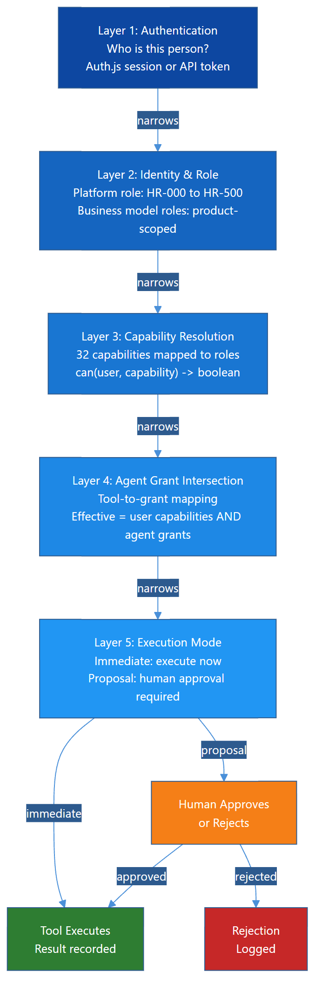
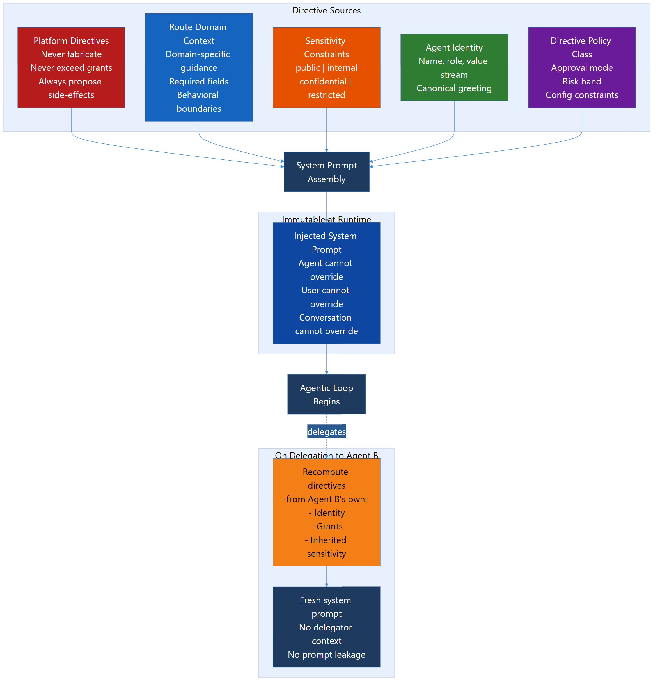
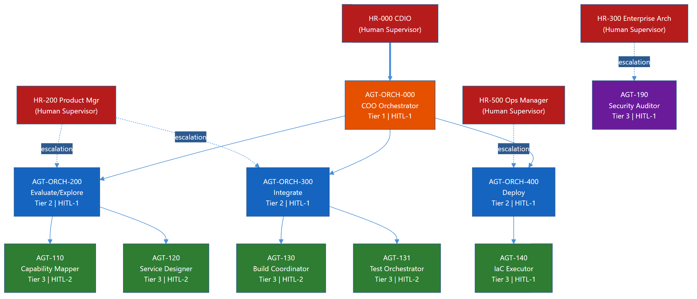
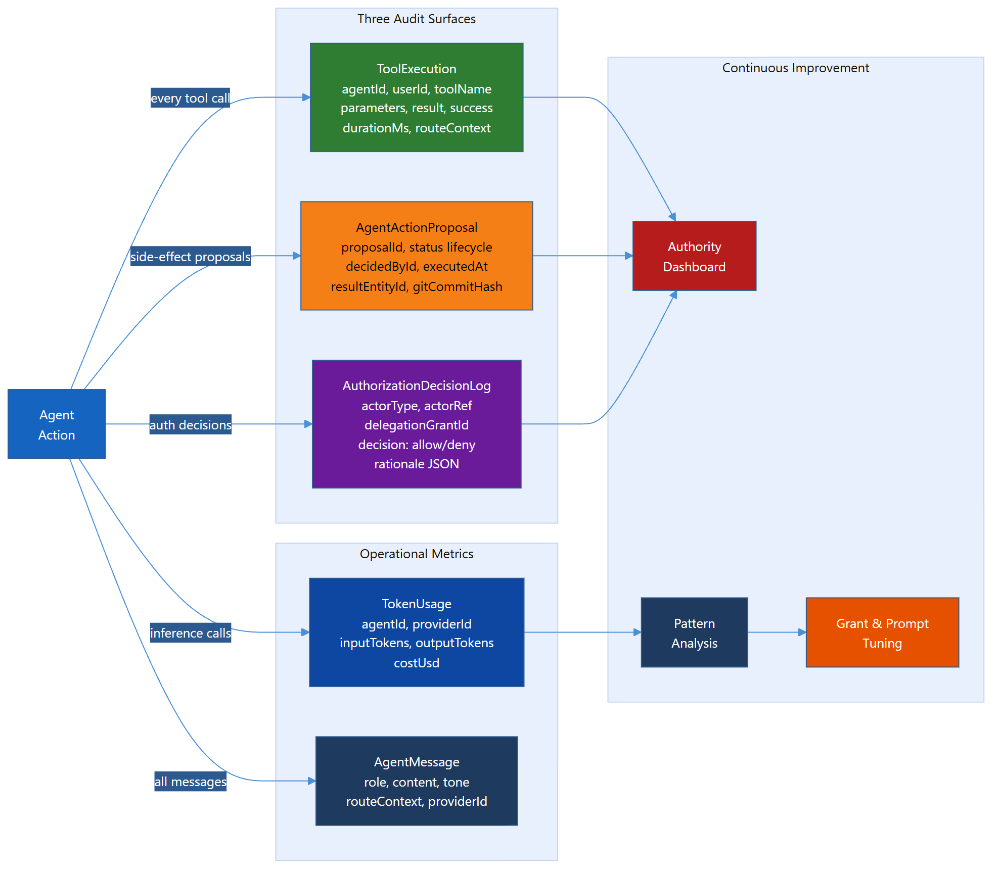

# Trusted AI Kernel (TAK)

## Abstract

The Trusted AI Kernel (`TAK`) is a normative runtime governance standard for trustworthy AI agent operation. It defines the minimum control model needed when AI agents act on behalf of human principals inside enterprise, public-sector, or cross-organizational systems.

The problem `TAK` addresses is straightforward: model capability alone does not create trustworthy agency. Trustworthy agency requires runtime mediation between human authority, agent capability, tool invocation, data sensitivity, memory, and oversight. `TAK` defines that mediation layer.

`TAK` is intentionally concerned with runtime governance. It does not attempt to solve global agent naming or public badging. Those concerns belong to the companion `GAID` standard. `TAK` instead defines what a trustworthy runtime `MUST`, `SHOULD`, and `MAY` do once an identified agent is allowed to operate.

## 1. Scope

This standard specifies requirements for:

- authority mediation between humans, agents, tools, and data
- runtime policy enforcement
- immutable directive handling
- tool execution gating
- provider rate budgeting, backpressure, queueing, and failover handling
- human-in-the-loop (`HITL`) controls
- delegation and escalation
- memory and context-window governance
- audit, evidence, and non-repudiation records
- runtime transparency
- defenses against fabrication, unsafe narration, and prompt-driven misuse
- minimum evaluation and conformance expectations

This standard applies to:

- single-agent systems
- orchestrator and specialist agent systems
- conversational coworker systems
- tool-using coding, administrative, analytical, and workflow agents
- enterprise-private and public-facing agent runtimes

This standard does not define:

- global namespace governance for public agent identifiers
- public issuer accreditation models
- external identity and badging formats

Those concerns are addressed by `GAID`.

## 2. Conformance

An implementation conforms to this standard only if it satisfies all requirements identified as `MUST` for its claimed conformance profile.

This standard defines three conformance profiles:

- `TAK-Basic`
- `TAK-Managed`
- `TAK-Assured`

An implementation:

- `MUST` declare the highest conformance profile it claims
- `MUST NOT` claim a higher profile if any mandatory control for that profile is absent
- `SHOULD` publish an implementation statement showing how each control is met
- `MAY` implement controls beyond those required by its claimed profile

## 3. Normative References

The following references are relevant to this standard and informed its design:

| Reference | Relevance |
|-----------|-----------|
| [ISO/IEC 42001:2023](https://www.iso.org/standard/42001) | Organization-level AI management systems |
| [NIST AI RMF 1.0](https://doi.org/10.6028/NIST.AI.100-1) | Risk management framing for AI systems |
| [NIST AI Agent Standards Initiative](https://www.nist.gov/caisi/ai-agent-standards-initiative) | Current U.S. public-sector standards activity for agents |
| [NCCoE concept paper: software and AI agent identity and authorization](https://csrc.nist.gov/pubs/other/2026/02/05/accelerating-the-adoption-of-software-and-ai-agent/ipd) | Identity, authorization, auditing, and non-repudiation concerns for agents |
| [NIST AI 800-2 benchmark evaluation draft](https://www.nist.gov/news-events/news/2026/01/towards-best-practices-automated-benchmark-evaluations) | Evaluation transparency and benchmark discipline |
| [Model Context Protocol specification](https://modelcontextprotocol.io/specification/2024-11-05/basic/index) | Tool and context interoperability |
| [Anthropic: Introducing the Model Context Protocol](https://www.anthropic.com/news/model-context-protocol) | Background on MCP as an open protocol |
| [W3C Trace Context](https://www.w3.org/TR/trace-context/) | Cross-system trace propagation |
| [RFC 9421 HTTP Message Signatures](https://www.rfc-editor.org/info/rfc9421) | Message-level signatures for integrity and non-repudiation |
| [OWASP GenAI Security Project](https://genai.owasp.org/) | Security considerations for LLM and agentic systems |

## 4. Terms and Definitions

For the purposes of this standard:

| Term | Definition |
|------|------------|
| `agent` | A software system that can reason, decide, and perform actions with or without tool use on behalf of a principal or workflow |
| `principal` | The human or organizational authority under which an agent operates |
| `runtime` | The execution environment that mediates prompts, tools, memory, policies, and outputs |
| `immutable directive` | A runtime-enforced instruction that the agent cannot change through conversation |
| `tool` | A callable capability that reads, writes, transforms, or acts on an internal or external system |
| `execution mode` | The enforcement class governing how a tool call is handled at runtime |
| `proposal` | A gated action that requires explicit human approval before execution |
| `immediate` | An action the runtime may execute without per-action approval because policy allows it |
| `delegation` | Transfer of a bounded task from one agent or orchestrator context to another |
| `escalation` | Routing of a decision or blocker to a higher-authority human or agent context |
| `memory` | Persisted or replayed context intended to influence subsequent agent behavior |
| `context window governance` | Controls that determine what prior information is preserved, summarized, truncated, or excluded |
| `provider budget` | The governed runtime view of rate, concurrency, token-throughput, quota, credit, funding-token, or contractual limits imposed by a model provider or inference service |
| `backpressure` | Runtime behavior that slows, queues, defers, or rejects new inference work so provider and policy limits are not exceeded |
| `inference queue` | A bounded, resumable runtime queue holding model invocations awaiting execution, retry, failover, or operator intervention |
| `capability tier` | A policy classification that defines the minimum acceptable model capability and the allowed substitution set for a task or workflow |
| `runtime transparency` | The ability for humans and auditors to inspect what the agent was allowed to do, attempted to do, and actually did |
| `fabrication` | A model output that claims work, change, or completion not supported by tool or runtime evidence |
| `operating profile` | The governed bundle of materially relevant runtime state for an identified agent, including model binding, instructions, tools, autonomy posture, and verification references |
| `profile fingerprint` | A digest or equivalent marker derived from the materially relevant operating profile state |
| `validation continuity` | Whether the currently running operating profile remains the same validated operational subject previously assessed or approved |

## 5. Core Principle

The core principle of `TAK` is:

> Humans hold authority. Agents hold capability. The kernel mediates.

The point is not merely to restrict the model. The point is to ensure that authority, capability, and evidence remain aligned throughout execution.

## 6. Design Principles

An implementation of `TAK`:

- `MUST` mediate all consequential agent action through an explicit control plane
- `MUST` separate human authority from model capability
- `MUST` load only approved operating profile state for governed agents
- `MUST` treat tool invocation as governed execution, not model free-form behavior
- `MUST` treat provider rate, quota, budget, and availability constraints as kernel-governed runtime concerns rather than application-local exception handling
- `MUST` preserve an auditable chain from human authority to agent action
- `MUST` make material runtime-state changes visible to policy and audit layers
- `SHOULD` minimize the tools and context exposed to an agent at any point in time
- `SHOULD` favor bounded specialists over unconstrained generalists for operational tasks
- `SHOULD` assume multi-provider operation may be necessary for resilience, policy fit, or capability coverage
- `MAY` increase autonomy only where evidence and policy justify doing so

## 7. Runtime Trust Model

### 7.1 Required Control Layers

A conforming implementation `MUST` apply runtime control in layers. At minimum, those layers `MUST` include:

1. authentication of the human or calling system
2. resolution of authority or role context
3. evaluation of allowed capabilities
4. agent-side grant or scope filtering
5. execution gating for side-effecting operations

The runtime `MUST NOT` allow a lower layer to widen permissions restricted by a higher layer.

### 7.2 Effective Permission Rule

For any `(principal, agent, tool)` combination, the runtime `MUST` compute effective permission as the intersection of:

- what the principal is allowed to do
- what the agent is allowed to do
- what the route, workflow, or context is allowed to expose

The runtime `MUST NOT` treat the model's request as sufficient evidence of authorization.

### 7.3 Domain and Route Scoping

The runtime `SHOULD` expose only the domain-relevant subset of tools and context for a given route, task, or workflow stage.

This is not only a usability optimization. It is a control. Smaller, better-bounded tool surfaces reduce:

- mis-selection of tools
- hallucinated capability claims
- prompt injection blast radius
- token waste

_Figure 1. Layered authority mediation is a required kernel behavior, not only a UI convenience._

### 7.4 Approved Operating Profiles

A conforming runtime `MUST` treat an agent's approved operating profile as a governed runtime artifact.

At minimum, the operating profile `SHOULD` include:

- model or provider binding
- immutable and governed instruction references
- enabled tool surface
- autonomy and oversight posture
- relevant verifier references
- current approved badge or authorization posture references

For governed agents, the runtime `MUST NOT` execute against undeclared or unapproved materially relevant profile state.

### 7.5 Runtime Identity Proof Posture

For an identified governed agent, the runtime `SHOULD` be able to support a stronger claim than:

- "the agent says it is X"

The stronger claim is:

- the subject identity is X
- the approved operating profile is Y
- the runtime is executing that profile under trusted kernel enforcement

`TAK` does not define the external identity namespace itself. That belongs to companion identity work such as `GAID`. `TAK` does, however, define the runtime conditions under which such identity claims can be trusted in operation.

### 7.6 Core Runtime Semantics Versus Protocol Carriers

`TAK` implementations `SHOULD` follow a stable-core and profile pattern similar to mature identity and directory standards.

In that pattern:

- the **core `TAK` model** defines approved operating profile semantics, runtime enforcement rules, validation continuity rules, and attestation expectations
- **runtime or deployment extensions** define additional environment-specific control fields without changing those core semantics
- **protocol carriers or profiles** define how `TAK` state is exposed through directories, APIs, event systems, or attestation envelopes

`TAK` therefore `MUST NOT` be treated as a replacement for `LDAP`, `SCIM`, HTTP, or message protocols. It defines what those carriers need to say about trusted runtime state, not the transport itself.

### 7.7 Material Change and Validation Continuity

The runtime `MUST` treat material change as a trust-relevant event.

Material change includes:

- changes to model or provider binding
- changes to immutable or governed instruction bundles
- changes to tool surface
- changes to autonomy or approval posture
- changes in runtime dependencies that materially alter practical capability or risk

The same enduring subject identity `MAY` remain valid while validation continuity is broken.

Therefore, the runtime `SHOULD` distinguish:

- identity continuity
- validation continuity

and `MUST NOT` silently assume they are equivalent.

### 7.8 Profile Fingerprints and Attestation

For governed agents, the runtime `SHOULD` support:

- a visible fingerprint or version marker for materially relevant operating profile state
- stronger protected attestation material sufficient to bind that profile state to trusted kernel execution

This allows relying parties and auditors to distinguish between:

- the same enduring agent subject
- the same validated operational subject

### 7.9 Attestation and Projection Profiles

When `TAK` state is projected into external systems, the projection `SHOULD` preserve the distinction between:

- enduring subject identity
- current approved operating profile
- current validation status
- stronger attestation material that may not be appropriate to publish broadly

For example:

- `LDAP` projections `MAY` publish profile fingerprints, validation state, and verifier references needed for coarse trust decisions
- `SCIM` projections `MAY` carry selected operating-profile and validation metadata for lifecycle automation
- direct API or attestation carriers `SHOULD` carry the stronger signed or protected material needed to prove runtime state across trust boundaries

An implementation `SHOULD` document those profile mappings explicitly so external systems know which parts of `TAK` they can rely on and which parts remain internal kernel evidence.

## 8. Tool Execution and Action Gating

### 8.1 Tool Definitions

A conforming implementation `MUST` define tools with machine-readable metadata sufficient to enforce policy. At minimum, each tool definition `MUST` declare:

- identifier
- purpose
- parameter schema
- whether the tool is side-effecting
- its execution mode
- required authority or capability class

The runtime `MUST NOT` rely solely on natural-language tool descriptions for governance decisions.

### 8.2 Execution Modes

At minimum, the runtime `MUST` support two execution modes:

| Mode | Meaning |
|------|---------|
| `immediate` | Runtime may execute without per-action approval, subject to policy |
| `proposal` | Runtime must pause and request human approval before execution |

The runtime `MAY` define more granular subclasses, but it `MUST NOT` weaken the semantics of `proposal`.

### 8.3 Proposal Requirements

For `proposal` actions, the runtime `MUST` present:

- the tool or action requested
- the structured parameters
- the principal or authority context
- enough explanation for a human reviewer to make an informed decision

The runtime `MUST` record whether the proposal was:

- approved
- rejected
- expired
- superseded

### 8.4 Default Safety Rule

If a tool:

- modifies state
- affects production systems
- changes identity or authorization
- creates or deletes records
- publishes or deploys
- reaches across an organizational boundary with consequences

then the runtime `SHOULD` default that tool to `proposal` unless a higher-assurance policy explicitly permits immediate execution.

### 8.5 Provider Budgets and Backpressure

A conforming runtime `MUST` implement provider-aware rate budgeting and backpressure for any provider, model, or upstream inference service that can impose:

- request-rate limits
- concurrency limits
- token-throughput or context limits
- quota exhaustion
- usage-credit or funding-token exhaustion
- contractual or policy ceilings

These limits are runtime-governance signals, not merely application exceptions.

The runtime `MUST`:

- maintain a governed representation of provider budget state
- apply backpressure before provider limits are violated where predictive signals are available
- surface blocking or degraded capacity in both machine-readable and human-consumable form
- avoid presenting provider-specific failures as unexplained or opaque application errors

### 8.7 Dependency Drift and Revalidation

The runtime `MUST` recognize that material drift can originate from dependencies as well as from deliberate local configuration edits.

Examples include:

- provider-side model behavior changes
- safety or moderation behavior changes
- undocumented capability changes under the same marketed model label
- runtime or harness dependency changes

Where such drift materially affects capability or risk posture, the runtime `SHOULD` trigger revalidation requirements or equivalent policy review rather than continuing to treat prior approval state as unquestionably current.

At minimum, the human-consumable runtime state `SHOULD` distinguish conditions such as:

- queued due to rate budget
- deferred until reset window
- rerouted to an approved alternate provider
- blocked pending approval or escalation
- blocked by provider auth, billing, contract, or policy status

### 8.6 Bounded and Resumable Inference Queues

A conforming runtime `MUST` support bounded, resumable inference queues rather than assuming every user request maps directly to an immediate model call.

The inference queue `MUST`:

- be bounded by declared policy or capacity
- preserve request identity and ordering semantics sufficient for safe resumption
- retain retry, deferral, and failover state
- support explicit expiry, cancellation, or operator intervention
- prevent unbounded replay of queued work

For consequential or side-effecting workflows, the runtime `MUST` ensure that queue resumption does not silently duplicate already-completed actions.

Queue entries `SHOULD` carry, at minimum:

- agent identity
- principal or workflow identity
- requested capability tier
- sensitivity class
- retry count
- next eligible execution time
- current provider or failover state

### 8.7 Policy-Based Failover and Scheduled Retry

A conforming runtime `SHOULD` support policy-based fallback to another approved model or provider when the originally selected path is unavailable, rate-limited, misconfigured, or otherwise unsuitable.

If failover is supported, the runtime:

- `MUST` evaluate failover eligibility against capability tier, sensitivity, contract, jurisdiction, and policy constraints
- `MUST NOT` fail over to a provider or model that is not approved for the relevant task class
- `MUST NOT` use failover to bypass `GAID` scope, badge, or operating-surface restrictions
- `MUST` record the policy basis for the substitution

When failover is not allowed or not useful, the runtime `MAY` schedule retry after a known reset window or budget-replenishment event.

If scheduled retry is used, the runtime `MUST`:

- preserve queue state across the deferral
- surface the deferred state and next retry condition to operators and users
- stop retrying when policy, expiry, or repeated failure thresholds require escalation instead

## 9. Human-in-the-Loop and Oversight Tiers

### 9.1 HITL Tiers

A conforming implementation `SHOULD` classify agents and actions by oversight tier. At minimum, the following conceptual levels `SHOULD` exist:

| Tier | Meaning |
|------|---------|
| `0` | blocked; no autonomous action permitted |
| `1` | approve-before-execution |
| `2` | review-after-execution |
| `3` | autonomous with mandatory logging |

### 9.2 Enforcement

The runtime `MUST` enforce the effective oversight tier at execution time. It is not sufficient to store a tier as metadata without affecting behavior.

The runtime `MUST NOT` allow the model to self-upgrade its oversight tier.

### 9.3 Supervisor Visibility

For `TAK-Managed` and above, the runtime `MUST` provide a human-supervisor-visible view of:

- current oversight tier
- available tools
- recent actions
- pending approvals
- escalations and failures

## 10. Immutable Directives and Hidden Instruction Governance

### 10.1 Directive Sources

A conforming implementation `MUST` distinguish between:

- user conversation content
- runtime directives
- system or domain instructions
- safety and sensitivity policies
- agent identity and role instructions

### 10.2 Immutability

If a directive is marked immutable, the runtime `MUST` ensure that:

- the user cannot override it by prompt alone
- downstream agents cannot silently remove it
- tool outputs cannot weaken it

### 10.3 Governance of Hidden Instructions

Because hidden instructions are a material governance surface, a `TAK-Managed` or `TAK-Assured` implementation `MUST` maintain a reviewable record of:

- directive class
- owning authority
- change control mechanism
- effective version
- deployment or activation date

The runtime `SHOULD NOT` expose raw hidden prompts to end users by default, but it `MUST` preserve enough metadata for authorized audit and governance review.

_Figure 2. Directives are not merely prompt text. They are a governed runtime control surface._

## 11. Delegation, Coordination, and Specialist Topology

### 11.1 Delegation Narrowing

When an agent delegates to another agent, the delegated agent:

- `MUST` receive only the authority and context needed for the delegated task
- `MUST NOT` inherit broader permissions than the delegating context
- `MUST` operate under a recomputed effective permission set

### 11.2 Specialist and Coordinator Patterns

An implementation `SHOULD` distinguish:

- coordinators or orchestrators, which decompose, route, and synthesize
- specialists, which operate within narrower domain or tool scopes

This distinction matters because the same agent shape should not be assumed to fit all work equally well.

### 11.3 Escalation

A conforming runtime `MUST` support escalation to a human or higher-authority control point when:

- the action exceeds allowed authority
- the confidence or evidence is inadequate
- policy requires review
- the agent encounters a repeated failure or unresolved blocker

### 11.4 Provider and Governance Incident Escalation

A conforming runtime `MUST` support `HITL` and human escalation for operational incidents that cannot be safely resolved through autonomous retry or failover alone.

At minimum, the escalation path `MUST` cover:

- provider authentication failures
- billing, funding-token, quota, or contract problems
- provider or platform policy denials
- persistent platform misconfiguration
- repeated rate-budget exhaustion or queue starvation
- detected `GAID` scope or operating-surface violations
- suspected cross-boundary leakage or other reportable governance incidents

The runtime `SHOULD` treat these conditions similarly to an employee reporting an observed security or data-handling incident: safe continuation pauses, the issue is surfaced clearly, and a human owner is brought into the loop.

When such an incident is detected, the runtime `MUST`:

- preserve enough context for a human to diagnose the issue
- prevent unsafe continuation of the affected workflow until policy permits it
- present a pragmatic reason and next-step state to the user or operator
- record the escalation outcome

_Figure 3. Delegation is valid only when authority narrows, not widens._

## 12. Memory and Context-Window Governance

### 12.1 Memory Is a Governed Surface

Persistent memory, retrieved memory, and prior conversation context `MUST` be treated as governed runtime inputs.

Memory is not a neutral convenience. It changes future behavior. Therefore, `TAK` requires explicit control over:

- what is retained
- how long it is retained
- who may retrieve it
- what confidence it carries
- when it must be re-validated

### 12.2 Retention Rules

A `TAK-Managed` or higher implementation `MUST` define policies for:

- transient conversation context
- durable preference or decision memory
- operational evidence and audit history
- sensitive data retention and expiry

### 12.3 Context Truncation and Summarization

When context windows are limited, the runtime `MUST` favor:

- durable decisions over transient chatter
- structured summaries over raw transcripts
- validated facts over speculative earlier drafts

The runtime `SHOULD` document summarization and truncation behavior so operators understand what information may have been omitted.

### 12.4 Memory Validation

For `TAK-Assured`, memory that materially affects consequential action `SHOULD` be treated as advisory until revalidated against a current source of truth.

## 13. Audit, Evidence, and Non-Repudiation

### 13.1 Minimum Audit Events

A conforming implementation `MUST` record, at minimum:

- tool execution attempts
- tool execution results
- proposals and approval decisions
- escalation events
- policy denials
- provider backpressure, rate-budget exhaustion, and queue admission or rejection events
- scheduled retries, failover decisions, and provider-selection changes
- provider auth, billing, contract, or policy failures that affect execution
- detected `GAID` scope or operating-surface violations
- model and provider attribution for consequential actions

### 13.2 Evidence Fields

Audit records `SHOULD` include:

- agent identity
- acting principal
- route or workflow context
- action or tool name
- parameters or parameter digest
- result or result digest
- execution mode
- queue state and retry count where applicable
- provider budget or backpressure state where applicable
- selected provider and model, and substituted provider and model if failover occurred
- timestamp
- duration
- success or failure

### 13.3 Non-Repudiation

For `TAK-Assured`, the runtime `SHOULD` support cryptographic binding or message-level evidence sufficient to prove:

- who requested or approved an action
- what action was attempted or completed
- what evidence supports that conclusion

`GAID` provides the companion identity and receipt model for this purpose.

_Figure 4. Audit is not a side effect of the runtime. It is part of the runtime._

## 14. Runtime Transparency

### 14.1 Required Transparency

A `TAK-Managed` implementation `MUST` provide operators with a way to inspect:

- effective permissions
- active tools
- oversight tier
- recent actions
- proposal state
- queue, retry, and deferral state
- provider budget, backpressure, and failover state
- failures and retries

### 14.2 Human-Facing Honesty

The runtime `MUST` prevent or correct outputs that falsely claim:

- completion without evidence
- deployment without deployment
- creation without creation
- testing without testing

This control is fundamental to trust.

## 15. Safety and Security Controls

### 15.1 Fabrication and Unsafe Narration

A conforming runtime `MUST` detect and mitigate situations where the model:

- claims completion without tool evidence
- narrates code or actions instead of performing governed tool use
- loops on unproductive retries

### 15.2 Injection Resistance

The runtime `SHOULD` implement layered defenses against:

- prompt injection
- malicious tool output used as instructions
- unsafe skill or template injection
- cross-agent context contamination

### 15.3 Sensitivity Handling

The runtime `MUST` allow policy to vary by data sensitivity. At minimum, the implementation `SHOULD` distinguish sensitivity classes such as:

- public
- internal
- confidential
- restricted

The runtime `MUST NOT` silently route restricted data into lower-trust tools, providers, or delegated contexts that are not cleared for it.

### 15.4 Open-World Tooling

External network or cross-boundary tools `SHOULD` be treated as higher-risk surfaces. A `TAK-Managed` implementation `SHOULD` explicitly classify such tools rather than treating them as ordinary local operations.

## 16. Evaluation and Red Teaming

### 16.1 Minimum Evaluation Expectations

A conforming implementation `MUST` test the runtime, not only the model. At minimum, it `MUST` evaluate:

- authorization boundary behavior
- tool selection correctness
- fabrication resistance
- incomplete-information handling
- unsafe narration
- provider backpressure and rate-budget handling
- queueing, resumption, and duplicate-prevention behavior
- approval-gate compliance

### 16.2 Advanced Evaluation

A `TAK-Assured` implementation `SHOULD` additionally evaluate:

- prompt injection resistance
- cross-agent handoff contamination
- sensitivity handling
- audit completeness
- failure-mode transparency
- failover-policy correctness across capability tiers
- repeatability across provider and model combinations

### 16.3 External Signals

The growing public focus on agent security, identity, evaluation, and interoperability is relevant here. NIST’s current work on agent standards and benchmark evaluation confirms that trustworthy agency is not only a model-quality problem, but a runtime governance problem as well.

## 17. Conformance Profiles

### 17.1 TAK-Basic

`TAK-Basic` requires:

- layered authority mediation
- tool metadata with execution modes
- basic approval gating for consequential actions
- provider-aware rate budgeting and backpressure
- bounded, resumable inference queueing
- immutable directive support
- minimum audit logging
- fabrication mitigation

### 17.2 TAK-Managed

`TAK-Managed` requires everything in `TAK-Basic`, plus:

- reviewable oversight tiers
- runtime transparency views
- governed memory retention and truncation
- documented hidden-instruction governance
- delegation narrowing
- human-visible provider and governance incident escalation
- sensitivity-class-aware handling

### 17.3 TAK-Assured

`TAK-Assured` requires everything in `TAK-Managed`, plus:

- stronger non-repudiation support
- higher-assurance audit evidence
- advanced evaluation and red-team coverage
- governed failover and substitution traceability across approved provider sets
- stronger traceability across delegation and cross-system flows
- documented control ownership and change management

## 18. Security Considerations

This standard assumes:

- models are fallible
- tools increase both usefulness and risk
- memory can become an attack and error surface
- hidden instructions create real governance obligations
- interoperability without runtime governance is insufficient

The consequence is that a trustworthy agent runtime cannot be reduced to prompt design alone.

## 19. Informative Annex A: Relationship to GAID

`TAK` and `GAID` are designed to work together.

- `GAID` identifies and attests the agent, its claims, and its public or cross-boundary posture.
- `TAK` governs the runtime in which that agent actually operates.

In practical terms:

- `GAID` answers "who is this agent and what claims does it carry?"
- `TAK` answers "how is this agent actually constrained, supervised, and evidenced at runtime?"

## 20. Informative Annex B: Relationship to DPF

`DPF` already demonstrates a number of `TAK` patterns in practice, including:

- layered permission intersection
- execution-mode gating
- immutable runtime instructions
- route-scoped tool exposure
- anti-fabrication controls
- audit logging
- orchestrator and specialist patterns

That makes `DPF` a useful proving ground for the first conformance assessment of this standard.

## 21. Summary

The key message of this standard is simple:

AI agents become trustworthy in practice only when a runtime kernel mediates authority, tools, memory, oversight, and evidence with discipline.

`TAK` provides that discipline. It is not a substitute for broader organizational governance. It is the runtime control model that makes operational governance real.
