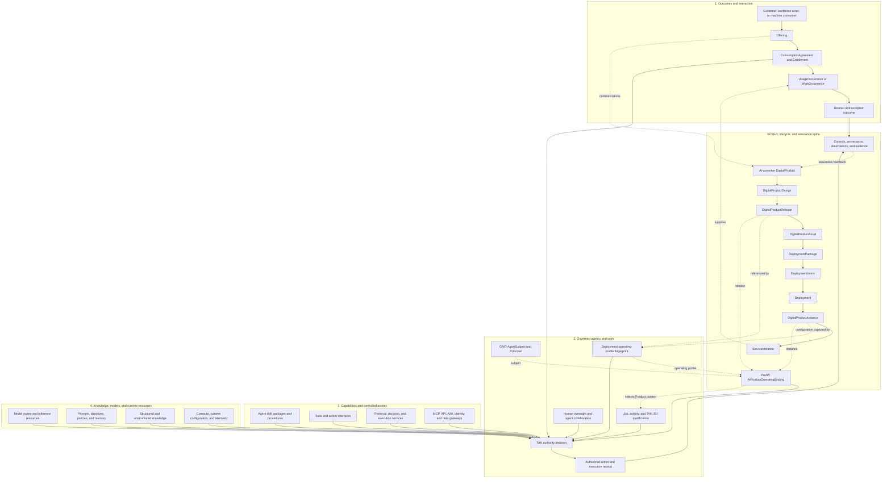
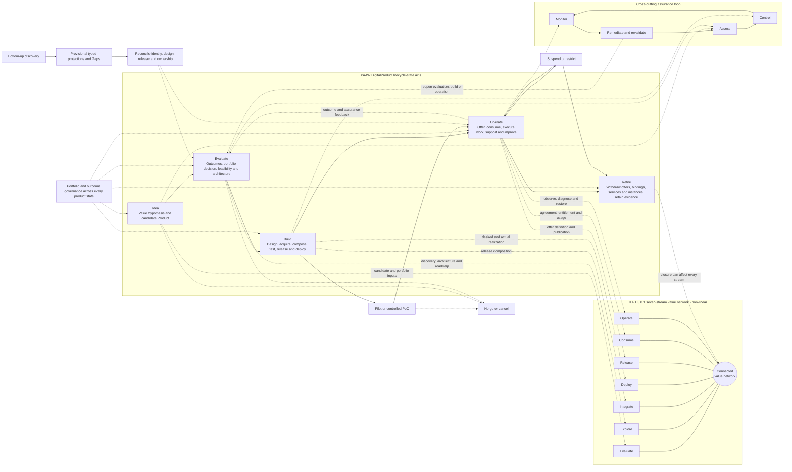
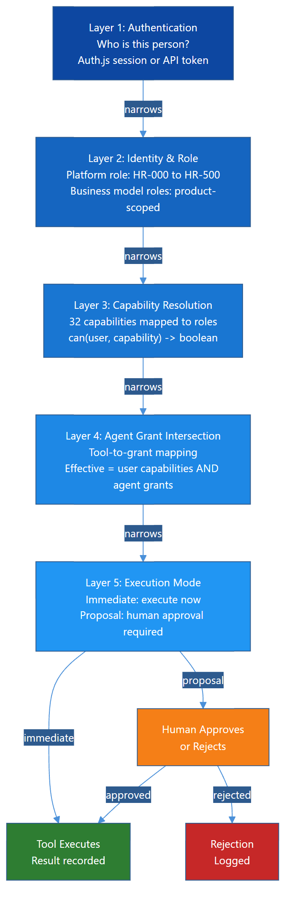
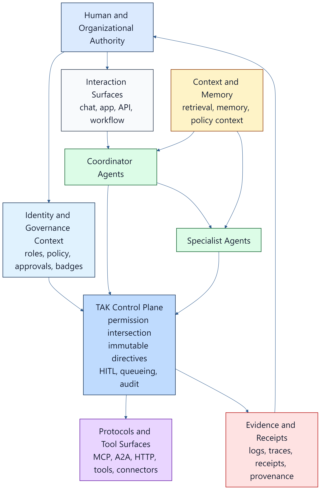
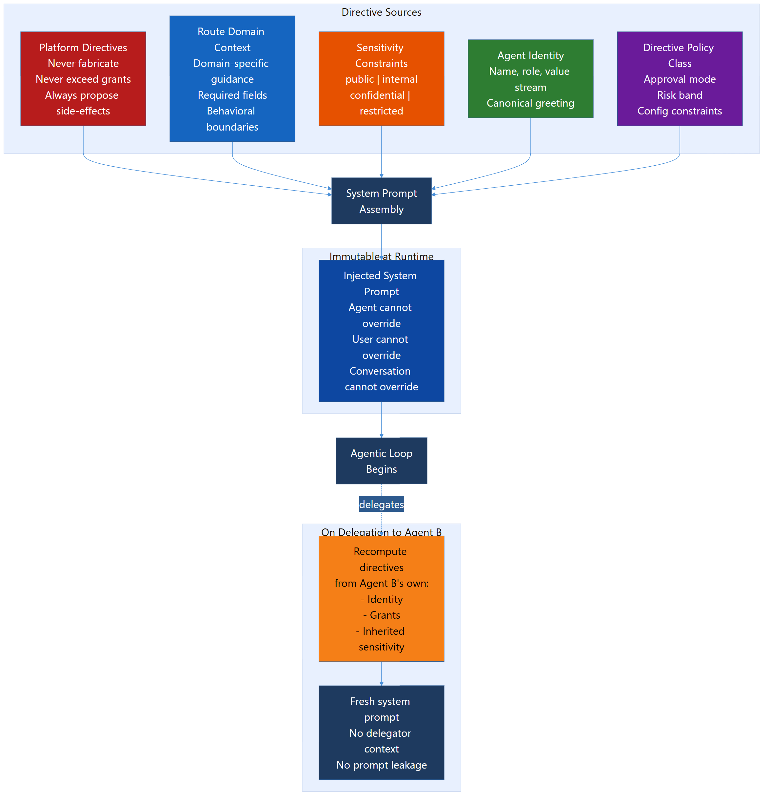
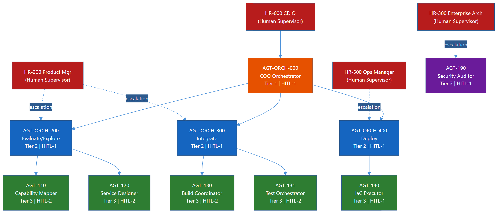
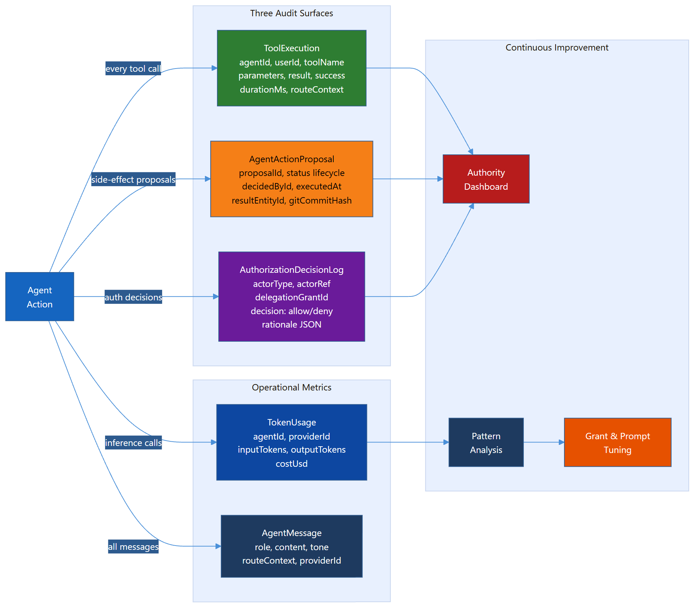

# Trusted AI Kernel (TAK)

## Abstract

The Trusted AI Kernel (`TAK`) is a normative agent-harness and runtime-governance standard for trustworthy AI agent operation. It defines the minimum harness contract and control model needed when AI agents act on behalf of human principals inside enterprise, public-sector, or cross-organizational systems.

The problem `TAK` addresses is broader than runtime mediation alone: model capability does not create trustworthy agency, and ad hoc agent wrappers do not create a consistent basis for governed deployment. Trustworthy agency requires a standard harness that defines how authority, instructions, tool invocation, provider use, data sensitivity, memory, oversight, and evidence are assembled and enforced at runtime. `TAK` defines that harness contract.

`TAK` is intentionally concerned with runtime governance and harness consistency. It does not attempt to solve global agent naming or public badging; those concerns belong to the companion `GAID` standard. It does not define whether an operating profile is qualified for a particular job; that concern belongs to the `TAK-JSI` qualification profile. `TAK` defines what a trustworthy agent harness and runtime `MUST`, `SHOULD`, and `MAY` do once an identified, appropriately qualified agent is allowed to operate.

## 1. Scope

This standard specifies requirements for:

- a consistent, vendor-neutral agent harness contract
- authority mediation between humans, agents, tools, and data
- runtime policy enforcement
- immutable directive handling
- tool execution gating
- provider rate budgeting, backpressure, queueing, and failover handling
- human-in-the-loop (`HITL`) controls
- qualification-aware autonomy ceilings and regression
- proactivity controls that cannot widen authority or qualification
- delegation and escalation
- memory and context-window governance
- audit, evidence, and non-repudiation records
- runtime transparency
- defenses against fabrication, unsafe narration, and prompt-driven misuse
- minimum evaluation and conformance expectations

This standard applies to:

- single-agent systems
- orchestrator and specialist agent systems
- conversational coworker systems
- tool-using coding, administrative, analytical, and workflow agents
- enterprise-private and public-facing agent runtimes

This standard does not define:

- global namespace governance for public agent identifiers
- public issuer accreditation models
- external identity and badging formats
- job definitions, qualification schemes, and job-specific competence assertions

Those concerns are addressed by `GAID` and the companion [Job-Specific Intelligence (`TAK-JSI`) profile](job-specific-intelligence.md).

### 1.1 AI-coworker operating reference architecture

The following implementation-neutral view places the TAK runtime boundary inside the wider
AI-coworker operating system. It is independently derived from DPF's TAK, GAID, TAK-JSI,
DigitalProduct, and work-allocation semantics in response to the bounded operator direction recorded
as `OP-CSDM-02` in the
[PAAW source register](four-portfolio-archetype-ai-workforce-operating-standard.md#20-research-and-source-register).
ServiceNow's current [Common Service Data Model (CSDM) shapes](https://www.servicenow.com/docs/r/application-portfolio-management/eaw-modeling-csdm-shapes.html)
page, identified by `SCIT-SNOW-AICT-GUIDANCE`, is a `reference-only` implementation target for the
source-validated [PAAW Section 13.4 bridge](four-portfolio-archetype-ai-workforce-operating-standard.md#134-source-validated-csdm-5-and-aict-bridge);
its figure, terminology, and vendor data model were not copied into this view. A concrete ServiceNow
adapter still requires release/plugin/dictionary and relationship fingerprints.


```mermaid
flowchart TB
    subgraph L1["1. Outcomes and interaction"]
        CON["Customer, workforce actor, or machine consumer"]
        OUT["Desired and accepted outcome"]
        OFF["Offering"]
        AGR["ConsumptionAgreement and Entitlement"]
        USE["UsageOccurrence or WorkOccurrence"]
        CON --> OFF --> AGR --> USE --> OUT
    end

    subgraph L2["2. Governed agency and work"]
        ID["GAID AgentSubject and Principal"]
        OPF["Deployment operating-profile fingerprint"]
        JOB["Job, activity, and TAK-JSI qualification"]
        TEAM["Human oversight and agent collaboration"]
        AUTH["TAK authority decision"]
        ACT["Authorized action and execution receipt"]
        JOB --> AUTH
        TEAM --> AUTH
        AUTH --> ACT
    end

    subgraph L3["3. Capabilities and controlled access"]
        SK["Agent skill packages and procedures"]
        TL["Tools and action interfaces"]
        SV["Retrieval, decision, and execution services"]
        GW["MCP, API, A2A, identity, and data gateways"]
        SK --> AUTH
        TL --> AUTH
        SV --> AUTH
        GW --> AUTH
    end

    subgraph L4["4. Knowledge, models, and runtime resources"]
        MOD["Model routes and inference resources"]
        DIR["Prompts, directives, policies, and memory"]
        DAT["Structured and unstructured knowledge"]
        RUN["Compute, runtime configuration, and telemetry"]
        MOD --> AUTH
        DIR --> AUTH
        DAT --> AUTH
        RUN --> AUTH
    end

    subgraph SPINE["Product, lifecycle, and assurance spine"]
        DP["AI-coworker DigitalProduct"]
        DES["DigitalProductDesign"]
        REL["DigitalProductRelease"]
        AST["DigitalProductAsset"]
        PKG["DeploymentPackage"]
        DIN["DeploymentIntent"]
        DEP["Deployment"]
        INS["DigitalProductInstance"]
        SVI["ServiceInstance"]
        BND["PAAW AIProductOperatingBinding"]
        EVD["Controls, provenance, observations, and evidence"]
        DP --> DES --> REL --> AST --> PKG --> DIN --> DEP --> INS --> SVI
        REL -. "referenced by" .-> OPF
        INS -. "configuration captured by" .-> OPF
        REL -. "release" .-> BND
        INS -. "instance" .-> BND
        OPF -. "operating profile" .-> BND
    end

    AGR --> AUTH
    ID -. "subject" .-> BND
    BND --> AUTH
    OPF --> AUTH
    ACT --> EVD
    OUT --> EVD
    OFF -. "commercializes" .-> DP
    SVI -. "supplies" .-> USE
    BND -. "selects Product context" .-> JOB
    EVD -. "assurance feedback" .-> DP
```

The fan-in is intentional: identity, operating profile, qualification, oversight, skills, tools,
services, gateways, models, directives, data, and runtime state are independent control inputs to
`AUTH`, not a linear transformation chain. The consequential-action path crosses `AUTH` and produces attributable evidence. TAK owns the
authority decision, runtime gate, delegation, and execution-receipt semantics. GAID owns the
AgentSubject and operating-profile identity; TAK-JSI owns job/activity qualification; the
[Portfolio Aligned Agent and Workforce Operating
Standard](four-portfolio-archetype-ai-workforce-operating-standard.md) owns the Product, service,
work, and lifecycle bridge. Offering, accepted agreement, entitlement, usage, asset, package,
deployment, product instance, and service instance remain separate identities. Context nodes in this
view do not transfer that ownership to TAK.

### 1.2 AI-coworker lifecycle and architecture view

The operator direction in `OP-CSDM-02` also calls for an implementation-neutral lifecycle picture.
The view below is DPF's own expression. It separates the PAAW DigitalProduct lifecycle-state axis from
the IT4IT 3.0.1 seven-stream value network, architecture scope, and governed-entity maturity. The five
product states are not aliases for IT4IT streams, and the seven streams are not a mandatory sequence.
This is the lifecycle companion to the runtime stack above, not a vendor data model or a claim that
every state or stream is executed by TAK.


```mermaid
flowchart LR
    subgraph LIFE["PAAW DigitalProduct lifecycle-state axis"]
        IDEA["Idea<br/>Value hypothesis and candidate Product"]
        EVAL["Evaluate<br/>Outcomes, portfolio decision, feasibility and architecture"]
        BUILD["Build<br/>Design, acquire, compose, test, release and deploy"]
        LIVE["Operate<br/>Offer, consume, execute work, support and improve"]
        RETIRE["Retire<br/>Withdraw offers, bindings, services and instances; retain evidence"]
        IDEA --> EVAL --> BUILD --> LIVE --> RETIRE
        LIVE -. "outcome and assurance feedback" .-> EVAL
    end

    subgraph ITNET["IT4IT 3.0.1 seven-stream value network - non-linear"]
        HUB(("Connected<br/>value network"))
        IEV["Evaluate"] --- HUB
        IEX["Explore"] --- HUB
        IIN["Integrate"] --- HUB
        IDE["Deploy"] --- HUB
        IRE["Release"] --- HUB
        ICO["Consume"] --- HUB
        IOP["Operate"] --- HUB
    end

    IDEA -. "candidate and portfolio inputs" .-> IEV
    EVAL -. "discovery, architecture and roadmap" .-> IEX
    BUILD -. "release composition" .-> IIN
    BUILD -. "desired and actual realization" .-> IDE
    LIVE -. "offer definition and publication" .-> IRE
    LIVE -. "agreement, entitlement and usage" .-> ICO
    LIVE -. "observe, diagnose and restore" .-> IOP
    RETIRE -. "closure can affect every stream" .-> HUB

    PORT["Portfolio and outcome governance across every product state"]
    PORT -.-> IDEA
    PORT -.-> EVAL
    PORT -.-> BUILD
    PORT -.-> LIVE
    PORT -.-> RETIRE

    PILOT["Pilot or controlled PoC"]
    CANCEL["No-go or cancel"]
    SUSPEND["Suspend or restrict"]
    BUILD --> PILOT --> LIVE
    IDEA -.-> CANCEL
    EVAL -.-> CANCEL
    PILOT -.-> CANCEL
    LIVE --> SUSPEND
    SUSPEND --> LIVE
    SUSPEND --> RETIRE

    subgraph ASSURE["Cross-cutting assurance loop"]
        ASSESS["Assess"] --> CONTROL["Control"] --> MONITOR["Monitor"] --> REMEDIATE["Remediate and revalidate"] --> ASSESS
    end
    IDEA -.-> ASSESS
    EVAL -.-> ASSESS
    BUILD -.-> CONTROL
    LIVE -.-> MONITOR
    REMEDIATE -. "reopen evaluation, build or operation" .-> EVAL

    DISC["Bottom-up discovery"] --> PROV["Provisional typed projections and Gaps"] --> REC["Reconcile identity, design, release and ownership"]
    REC -.-> EVAL
    REC -.-> LIVE
```

The solid five-state path governs Product lifecycle. The hub-and-spoke network preserves all seven
IT4IT streams without inventing a process order; dotted state-to-stream edges identify common
touchpoints, not exclusive ownership or mandatory sequencing. Architecture bands overlap both axes:

| Architecture band | PAAW product-lifecycle coverage | Typical IT4IT network touchpoints |
|---|---|---|
| strategy and business model | Idea through Retire; stakeholder value, Outcomes, and four-portfolio decisions | Evaluate, Explore, plus Consume/Operate feedback |
| business operational architecture | Evaluate through Operate, with retirement impact analysis | Explore, Consume, Operate |
| solution architecture | Evaluate through Operate; design, releases, assets, packages, dependencies, security, and deployment topology | Explore, Integrate, Deploy, Operate |
| service, engagement, sales, and support model | Build through Retire; ServiceDefinitions, Offerings, agreements, entitlements, service instances, support, and usage | Deploy, Release, Consume, Operate |
| foundation | every state; Organization/Principal/GAID identity, TAK-JSI qualification, vocabulary, data, controls, provenance, and evidence | all seven streams as applicable |

Within the Idea/Evaluate/Build/Operate/Retire state axis, Product lifecycle state **MUST** separately
represent pilot, promotion, suspension, end-of-support, retirement, and decommissioning where
applicable; `AIProductOperatingBinding.bindingState` does not substitute for Product, release, asset,
deployment, instance, service, or Offering state. An IT4IT stream position does not substitute for a
Product state. A discovered
operational record creates provisional typed projections and Gaps only; discovery **MUST NOT**
synthesize a Product definition, release, or GAID subject identity.

PAAW owns the Product, portfolio, work, service, and
AIProductOperatingBinding semantics; GAID owns the enduring subject; TAK-JSI owns qualification; TAK
owns the action-time authority, delegation, execution, and receipt boundary in Consume/Operate. An AI
Agent record, design, release, asset, package, deployment, product instance, service instance,
AgentSubject, Offering, agreement, entitlement, usage, and WorkAssignment are therefore related but
never interchangeable.

## 2. Conformance

An implementation conforms to this standard only if it satisfies all requirements identified as `MUST` for its claimed conformance profile.

This standard defines three conformance profiles:

- `TAK-Basic`
- `TAK-Managed`
- `TAK-Assured`

An implementation:

- `MUST` declare the highest conformance profile it claims
- `MUST NOT` claim a higher profile if any mandatory control for that profile is absent
- `SHOULD` publish an implementation statement showing how each control is met
- `MAY` implement controls beyond those required by its claimed profile

### 2.1 Standard Versioning, Lifecycle, and Conformance Assertions

This standard `SHOULD` be versioned using a semantic-style scheme:

- major versions for normative incompatibilities
- minor versions for additive normative requirements or profile extensions
- patch versions for clarifications, errata, or non-substantive corrections

Implementations claiming conformance `SHOULD` declare:

- the `TAK` version supported
- the claimed conformance profile
- any profile extensions or deployment-specific constraints

Each normative `MUST` statement in this standard `SHOULD` map to one or more explicit conformance assertions in a companion test suite or implementation statement. This document does not require a single central test harness, but it does require that conformance claims be testable rather than rhetorical.

A suggested companion assertion rubric for this revision is published in `tak-conformance-tests.md`.

The intended lifecycle of `TAK` is open standards progression through multistakeholder implementation and liaison rather than indefinite treatment as an internal white paper.

The preferred near-term disposition is publication as an open industry specification with liaison into `NIST`, the `Agentic AI Foundation`, `OASIS` / `CoSAI`, and relevant `IETF` OAuth and `GNAP` work, with later venue-specific profiles or submissions preserving the same core runtime semantics.

## 3. References

### 3.1 Normative References

The following companion standards are indispensable to applying this document:

| Reference | Normative relationship |
|---|---|
| [GAID](GAID.md) | Defines the identified agent subject, operating-profile binding, assurance claims, and receipts consumed by `TAK` |
| [Job-Specific Intelligence (`TAK-JSI`)](job-specific-intelligence.md) | Defines the job qualification and evidence-supported autonomy ceiling enforced by `TAK` |

### 3.2 Informative External References

The following references are relevant to this standard and informed its design. Publication in
this table does not imply that every reference is normatively incorporated in full. The exact
relationship—adoption, profiling, augmentation, mapping, or adjacency—is maintained in the
informative [External Standards Alignment](agent-standards-external-alignment.md) companion.

| Reference | Relevance |
|-----------|-----------|
| [ISO/IEC 42001:2023](https://www.iso.org/standard/42001) | Organization-level AI management systems |
| [ISO/IEC 17024:2026](https://www.iso.org/standard/17024) | Competence-scheme, assessment, surveillance, and reassessment prior art profiled by `TAK-JSI` |
| [ISO/IEC 25059:2023](https://www.iso.org/standard/80655.html) | AI-system quality characteristics for specification and evaluation |
| [ISO/IEC 5259-5:2025](https://www.iso.org/standard/84150.html) | Data-quality governance and stewardship relevant to qualified agent work |
| [ISO/IEC TS 42119-2:2025](https://www.iso.org/standard/84127.html) | Risk-based AI-system testing practices that `TAK` runtime and qualification evaluation can exercise |
| [ISO/IEC 42119-3](https://www.iso.org/standard/85072.html) | Verification and validation analysis across the AI-system lifecycle; active work augmented by operating-profile and revalidation semantics |
| [ISO/IEC FDIS 42105](https://www.iso.org/standard/86902.html) | Human oversight guidance under development, complemented by enforceable oversight floors, proactivity clamping, and autonomy regression |
| [ISO/IEC JTC 1/SC 42](https://www.iso.org/committee/6794475.html) | Horizontal AI standards program, including trustworthiness, data, systems engineering, and AI conformity-assessment work |
| [NIST AI RMF 1.0](https://doi.org/10.6028/NIST.AI.100-1) | Risk management framing for AI systems |
| [NIST AI Agent Standards Initiative](https://www.nist.gov/artificial-intelligence/ai-agent-standards-initiative) | Current U.S. public-sector standards activity for agent security, identity, interoperability, and evaluation |
| [NCCoE concept paper: software and AI agent identity and authorization](https://csrc.nist.gov/pubs/other/2026/02/05/accelerating-the-adoption-of-software-and-ai-agent/ipd) | Identity, authorization, auditing, and non-repudiation concerns for agents |
| [NIST AI 800-2 benchmark evaluation draft](https://www.nist.gov/news-events/news/2026/01/towards-best-practices-automated-benchmark-evaluations) | Evaluation transparency and benchmark discipline |
| [IEEE P3709](https://standards.ieee.org/ieee/3709/12159) | Active agentic-AI framework project to which `TAK` runtime-control and conformance requirements can contribute |
| [IEEE P3833](https://standards.ieee.org/ieee/3833/11922/) | Active proactive-agent project complemented by `TAK` separation of proactivity, authority, qualification, and autonomy |
| [Model Context Protocol specification](https://modelcontextprotocol.io/specification/2025-11-25/basic) | Tool and context interoperability |
| [Model Context Protocol authorization specification](https://modelcontextprotocol.io/specification/2025-11-25/basic/authorization) | HTTP transport authorization profile for MCP servers and clients |
| [Anthropic: Introducing the Model Context Protocol](https://www.anthropic.com/news/model-context-protocol) | Background on MCP as an open protocol |
| [Linux Foundation: Agentic AI Foundation announcement](https://www.linuxfoundation.org/press/linux-foundation-announces-the-formation-of-the-agentic-ai-foundation?hs_amp=true) | Neutral governance venue for MCP and `AGENTS.md` stewardship |
| [AGENTS.md](https://agents.md/) | Open declarative instruction format used across coding-agent ecosystems |
| [RFC 9728 OAuth 2.0 Protected Resource Metadata](https://www.rfc-editor.org/rfc/rfc9728) | Discovery and metadata for protected resource authorization surfaces |
| [RFC 9635 Grant Negotiation and Authorization Protocol (GNAP)](https://www.rfc-editor.org/rfc/rfc9635) | Negotiated delegated authorization model for dynamic access decisions |
| [RFC 9767 GNAP Resource Server Connections](https://www.rfc-editor.org/rfc/rfc9767) | Resource-server-side GNAP discovery and access-right connection model |
| [RFC 9449 OAuth 2.0 Demonstrating Proof of Possession (DPoP)](https://www.rfc-editor.org/rfc/rfc9449) | Sender-constrained token binding for high-assurance agent calls |
| [IETF WIMSE working group](https://datatracker.ietf.org/group/wimse/) | Workload identity, credentials, and authentication substrate for multi-system and agent deployments |
| [AI Agent Authentication and Authorization](https://datatracker.ietf.org/doc/draft-klrc-aiagent-auth/02/) | Active IETF draft for agent identity and delegated authorization; protocol substrate rather than a substitute for `TAK` runtime policy |
| [Signed Authorization-Evidence Records for AI Agent Actions](https://www.ietf.org/archive/id/draft-munoz-wimse-authorization-evidence-00.html) | Active IETF draft aligned with attributable authorization and action evidence |
| [OpenAI Preparedness Framework](https://openai.com/index/updating-our-preparedness-framework/) | Frontier-model safety governance prior art, useful for scoping what `TAK` does and does not standardize |
| [Anthropic Responsible Scaling Policy](https://www.anthropic.com/responsible-scaling-policy) | Frontier-model safety and deployment governance prior art, complementary rather than substitutive to runtime kernel controls |
| [Google DeepMind Frontier Safety Framework](https://deepmind.google/discover/blog/strengthening-our-frontier-safety-framework/) | Model-level severe-risk framework used to distinguish model governance from runtime governance |
| [CoSAI: Agentic Identity and Access Management](https://www.coalitionforsecureai.org/wp-content/uploads/2026/04/agentic-identity-and-access-control.pdf) | Agentic IAM control framing aligned to enterprise runtime operation |
| [OWASP Top 10 for Agentic Applications](https://genai.owasp.org/2025/12/09/owasp-top-10-for-agentic-applications-the-benchmark-for-agentic-security-in-the-age-of-autonomous-ai/) | Concrete agentic risk taxonomy and mitigation guidance |
| [W3C Trace Context](https://www.w3.org/TR/trace-context/) | Cross-system trace propagation |
| [RFC 9421 HTTP Message Signatures](https://www.rfc-editor.org/info/rfc9421) | Message-level signatures for integrity and non-repudiation |
| [in-toto Attestation Framework Specification](https://github.com/in-toto/attestation/blob/main/spec/README.md) | Practical attestation statement and envelope model for signed evidence |
| [Sigstore Documentation](https://docs.sigstore.dev/) | Operational signing, transparency, and verification substrate for attestations and release evidence |
| [CSA MAESTRO](https://labs.cloudsecurityalliance.org/maestro/) | Agentic AI threat-modeling framework |
| [MITRE ATLAS](https://atlas.mitre.org/) | Adversarial tactics and techniques knowledge base for AI systems |
| [IMDA Model AI Governance Framework for Agentic AI](https://www.imda.gov.sg/resources/press-releases-factsheets-and-speeches/press-releases/2026/new-model-ai-governance-framework-for-agentic-ai) | National governance framework for agentic AI deployment |
| [ISO/IEC 12792:2025](https://www.iso.org/standard/84111.html) | Transparency taxonomy for AI systems |
| [ISO/IEC DIS 42102](https://www.iso.org/standard/86898.html) | Framework for characterizing AI system methods and capabilities |

### 3.3 Reuse and Profiling Rule

`TAK` is intended to compose adjacent standards, not replace them.

Accordingly:

- `TAK` `MUST` adopt an existing standard directly where that standard already defines the relevant control surface well
- `TAK` `SHOULD` define a profile when an existing standard is useful but needs agent-runtime-specific constraints
- `TAK` `MUST NOT` redefine transport, directory, credential, or trace standards merely because they are used by AI agents
- `TAK` `MAY` define new runtime semantics only where the agent-governance problem is not already solved elsewhere

In practice this means:

- `MCP` and `A2A` are protocol-profile targets, not substitutes for runtime governance
- `MCP` authorization and discovery mechanisms define transport-facing auth behavior; `TAK` defines the runtime policy and evidence semantics layered behind them
- `W3C Trace Context` is the default correlation carrier for cross-system execution traces
- `RFC 9421` is the preferred message-signing basis where `TAK` evidence crosses HTTP trust boundaries
- declarative instruction artifacts such as `AGENTS.md` may complement runtime governance, but they do not replace kernel-governed control metadata
- `LDAP`, `SCIM`, `VC`, and other adjacent standards remain companion carriers or claim envelopes rather than being redefined by `TAK`

### 3.4 External Augmentation Boundary

`TAK` augments adjacent work specifically where a conforming runtime must connect broad policy,
identity, qualification, and protocol authorization to the action being attempted.

In particular:

- ISO/IEC 42001, ISO/IEC 23894, ISO/IEC 42005, and the NIST AI RMF remain the authorities for
  organization-level management, risk, and impact processes; `TAK` converts applicable outcomes
  into enforceable runtime constraints
- IEEE P3709 remains the broader agentic-AI framework project; `TAK` contributes concrete harness,
  authority, evidence, proactivity, and autonomy requirements
- ISO/IEC 42105 remains the human-oversight guidance layer; `TAK` adds runtime tiers, ceilings,
  escalation, and regression behavior
- IETF WIMSE, OAuth, GNAP, and SPIFFE remain identity, credential, and authorization transports;
  `TAK` independently decides whether an authenticated and authorized protocol request is allowed
  under current qualification, data, workflow, and oversight constraints
- `TAK` does not infer job competence from successful authentication, protocol authorization, a
  model benchmark, or a declared capability

## 4. Terms and Definitions

For the purposes of this standard:

| Term | Definition |
|------|------------|
| `agent` | A software system that can reason, decide, and perform actions with or without tool use on behalf of a principal or workflow |
| `principal` | The human or organizational authority under which an agent operates |
| `runtime` | The execution environment that implements the agent harness and mediates prompts, tools, memory, policies, and outputs |
| `agent harness` | The standard runtime structure that binds authority, instructions, model access, tools, memory, oversight, and evidence into one governed execution contract |
| `immutable directive` | A runtime-enforced instruction that the agent cannot change through conversation |
| `tool` | A callable capability that reads, writes, transforms, or acts on an internal or external system |
| `execution mode` | The enforcement class governing how a tool call is handled at runtime |
| `proposal` | A gated action that requires explicit human approval before execution |
| `immediate` | An action the runtime may execute without per-action approval because policy allows it |
| `delegation` | Transfer of a bounded task from one agent or orchestrator context to another |
| `escalation` | Routing of a decision or blocker to a higher-authority human or agent context |
| `memory` | Persisted or replayed context intended to influence subsequent agent behavior |
| `context window governance` | Controls that determine what prior information is preserved, summarized, truncated, or excluded |
| `provider budget` | The governed runtime view of rate, concurrency, token-throughput, quota, credit, funding-token, or contractual limits imposed by a model provider or inference service |
| `backpressure` | Runtime behavior that slows, queues, defers, or rejects new inference work so provider and policy limits are not exceeded |
| `inference queue` | A bounded, resumable runtime queue holding model invocations awaiting execution, retry, failover, or operator intervention |
| `capability tier` | A policy classification that defines the minimum acceptable model capability and the allowed substitution set for a task or workflow |
| `runtime transparency` | The ability for humans and auditors to inspect what the agent was allowed to do, attempted to do, and actually did |
| `fabrication` | A model output that claims work, change, or completion not supported by tool or runtime evidence |
| `operating profile` | The governed bundle of materially relevant runtime state for an identified agent, including model binding, instructions, tools, autonomy posture, and verification references |
| `profile fingerprint` | A digest or equivalent marker derived from the materially relevant operating profile state |
| `validation continuity` | Whether the currently running operating profile remains the same validated operational subject previously assessed or approved |
| `job qualification` | A versioned assertion that an identified operating profile satisfies a declared job/activity qualification scheme within stated data, risk, tool, and deployment constraints |
| `proactivity` | The requested degree of initiative an agent may take before involving a human; it does not create authority or competence |
| `earned autonomy` | Runtime action latitude justified by evidence and policy for a specific `(agent × activity × risk)` scope |
| `autonomy ceiling` | The highest oversight tier allowed after authority, qualification, data, regulatory, and risk constraints are intersected |

## 5. Core Principle

The core principle of `TAK` is:

> Humans hold authority. Agents hold capability. The kernel provides the standard harness on which trustworthy AI agents are built, operated, and evidenced.

The point is not merely to restrict the model or intercept model calls. The point is to establish a consistent and governable basis for how AI agents are built, invoked, supervised, and evidenced. Mediation is one function of that harness, but the larger purpose is to ensure that authority, capability, directives, execution, and evidence remain aligned throughout runtime operation.

## 6. Design Principles

An implementation of `TAK`:

- `MUST` provide a consistent harness contract for how governed agents are assembled, invoked, supervised, and evidenced
- `MUST` mediate all consequential agent action through an explicit control plane
- `MUST` treat mediation as one responsibility of a broader governed harness rather than as the entirety of the kernel
- `MUST` separate human authority from model capability
- `MUST` load only approved operating profile state for governed agents
- `MUST` treat tool invocation as governed execution, not model free-form behavior
- `MUST` treat provider rate, quota, budget, and availability constraints as kernel-governed runtime concerns rather than application-local exception handling
- `MUST` preserve an auditable chain from human authority to agent action
- `MUST` treat qualification as a ceiling on autonomy rather than as authorization
- `MUST` prevent proactivity preferences from widening authority, qualification, data eligibility, or mandatory oversight
- `MUST` make material runtime-state changes visible to policy and audit layers
- `SHOULD` minimize the tools and context exposed to an agent at any point in time
- `SHOULD` favor bounded specialists over unconstrained generalists for operational tasks
- `SHOULD` assume multi-provider operation may be necessary for resilience, policy fit, or capability coverage
- `MAY` increase autonomy only where evidence and policy justify doing so

## 7. Runtime Trust Model

### 7.1 Required Control Layers

A conforming implementation `MUST` apply runtime control in layers. At minimum, those layers `MUST` include:

1. authentication of the human or calling system
2. resolution of authority or role context
3. evaluation of allowed capabilities
4. agent-side grant or scope filtering
5. execution gating for side-effecting operations

The runtime `MUST NOT` allow a lower layer to widen permissions restricted by a higher layer.

### 7.2 Effective Permission Rule

For any `(principal, agent, tool)` combination, the runtime `MUST` compute effective permission as the intersection of:

- what the principal is allowed to do
- what the agent is allowed to do
- what the route, workflow, or context is allowed to expose

The runtime `MUST NOT` treat the model's request as sufficient evidence of authorization.

### 7.3 Domain and Route Scoping

The runtime `SHOULD` expose only the domain-relevant subset of tools and context for a given route, task, or workflow stage.

This is not only a usability optimization. It is a control. Smaller, better-bounded tool surfaces reduce:

- mis-selection of tools
- hallucinated capability claims
- prompt injection blast radius
- token waste



_Figure 1. Layered authority mediation is a required kernel behavior inside the broader `TAK` harness, not only a UI convenience._

### 7.4 Approved Operating Profiles

A conforming runtime `MUST` treat an agent's approved operating profile as a governed runtime artifact.

At minimum, the operating profile `SHOULD` include:

- model or provider binding
- immutable and governed instruction references
- enabled tool surface
- autonomy and oversight posture
- relevant verifier references
- current approved badge or authorization posture references

For governed agents, the runtime `MUST NOT` execute against undeclared or unapproved materially relevant profile state.

### 7.5 Runtime Identity Proof Posture

For an identified governed agent, the runtime `SHOULD` be able to support a stronger claim than:

- "the agent says it is X"

The stronger claim is:

- the subject identity is X
- the approved operating profile is Y
- the runtime is executing that profile under trusted kernel enforcement

`TAK` does not define the external identity namespace itself. That belongs to companion identity work such as `GAID`. `TAK` does, however, define the runtime conditions under which such identity claims can be trusted in operation.

### 7.6 Core Runtime Semantics Versus Protocol Carriers

`TAK` implementations `SHOULD` follow a stable-core and profile pattern similar to mature identity and directory standards.

In that pattern:

- the **core `TAK` model** defines approved operating profile semantics, runtime enforcement rules, validation continuity rules, and attestation expectations
- **runtime or deployment extensions** define additional environment-specific control fields without changing those core semantics
- **protocol carriers or profiles** define how `TAK` state is exposed through directories, APIs, event systems, or attestation envelopes

`TAK` therefore `MUST NOT` be treated as a replacement for `LDAP`, `SCIM`, HTTP, or message protocols. It defines what those carriers need to say about trusted runtime state, not the transport itself.

### 7.7 Material Change and Validation Continuity

The runtime `MUST` treat material change as a trust-relevant event.

Material change includes:

- changes to model or provider binding
- changes to immutable or governed instruction bundles
- changes to tool surface
- changes to autonomy or approval posture
- changes to the applicable job profile, qualification scheme, profession corpus, decision axes, or qualification evidence
- changes to data classification, permitted use, residency, or stewarded quality requirements
- changes to an approved routed-model substitution set or routing policy
- changes in runtime dependencies that materially alter practical capability or risk

The same enduring subject identity `MAY` remain valid while validation continuity is broken.

Therefore, the runtime `SHOULD` distinguish:

- identity continuity
- validation continuity

and `MUST NOT` silently assume they are equivalent.

### 7.8 Profile Fingerprints and Attestation

For governed agents, the runtime `SHOULD` support:

- a visible fingerprint or version marker for materially relevant operating profile state
- stronger protected attestation material sufficient to bind that profile state to trusted kernel execution

Acceptable higher-assurance attestation substrates `MAY` include hardware-rooted measurements such as `TPM`, `TDX`, or `SEV-SNP`, as well as software evidence stacks such as `DSSE`, `in-toto`, `Sigstore`, or `SCITT`-style statement publication, provided they let a verifier bind profile state to the governed runtime instance that actually executed the work.

This allows relying parties and auditors to distinguish between:

- the same enduring agent subject
- the same validated operational subject

### 7.9 Attestation and Projection Profiles

When `TAK` state is projected into external systems, the projection `SHOULD` preserve the distinction between:

- enduring subject identity
- current approved operating profile
- current validation status
- stronger attestation material that may not be appropriate to publish broadly

For example:

- `LDAP` projections `MAY` publish profile fingerprints, validation state, and verifier references needed for coarse trust decisions
- `SCIM` projections `MAY` carry selected operating-profile and validation metadata for lifecycle automation
- direct API or attestation carriers `SHOULD` carry the stronger signed or protected material needed to prove runtime state across trust boundaries

An implementation `SHOULD` document those profile mappings explicitly so external systems know which parts of `TAK` they can rely on and which parts remain internal kernel evidence.

### 7.10 Vendor-Neutral Reference Model

The following reference model is intentionally independent from any one product platform.

It shows the stable `TAK` control relationship between:

- human and organizational authority
- identity and governance context
- interaction surfaces
- coordinator and specialist agents
- the kernel control plane
- tools, protocols, and evidence



_Figure 2. `TAK` defines a vendor-neutral harness control plane that sits between authority, agents, tools, and evidence._

### 7.11 Qualification-Aware Runtime Enforcement

For job-scoped autonomous work, a conforming runtime `MUST` distinguish:

- declared capability
- tested capability
- job qualification
- present authorization
- evidence-earned autonomy

None is interchangeable with another.

A `GAID` capability or qualification badge `MUST NOT` be treated as live authorization. A
`TAK-JSI` qualification `MUST NOT` be treated as permission to perform every qualified action. At
execution time, the runtime `MUST` compute the effective action posture from the intersection of:

```text
principal authority
∩ agent grants
∩ route or workflow policy
∩ active job-qualification scope
∩ data, residency, and permitted-use constraints
∩ regulatory and contractual ceilings
∩ evidence-earned autonomy for (agent × activity × risk)
```

If the applicable qualification is absent, expired, suspended, revoked, outside scope, or pending
revalidation, the runtime `MUST` fail closed, narrow the action, reduce the oversight tier, or
escalate according to policy.

The runtime `MUST NOT` infer job qualification solely from:

- a model or provider name
- a model card or system card
- a generic benchmark
- a successful demonstration in another job
- a high proactivity setting
- a high-cost or high-quality execution posture

### 7.12 Proactivity, Earned Autonomy, and Assurance Posture

Proactivity, autonomy, and execution assurance are separate control axes:

- **proactivity** states how readily the agent should initiate, suggest, or continue work
- **earned autonomy** states how much of a scoped activity the runtime may permit without a
  pre-action human decision
- **assurance posture** states how much model, reasoning, review, verification, and retry resource
  the runtime should allocate

A conforming implementation:

- `MUST` enforce hard authority, qualification, data, and regulatory ceilings before applying any
  proactivity preference
- `MUST` scope autonomy evidence to an agent, activity, and risk class
- `MUST` support autonomy regression when evidence, qualification status, or operating conditions
  deteriorate
- `MUST NOT` allow a resourcing control such as the Golden Triangle to reduce a mandatory safety,
  data, qualification, or human-oversight floor
- `SHOULD` expose the reason when requested proactivity or autonomy is clamped
- `SHOULD` preserve evidence showing why an autonomy increase or regression occurred

An implementation `MAY` use progressive stages such as shadow, propose, bounded execution with
review, and bounded autonomous execution. The exact labels are implementation-specific; reversible,
evidence-based progression and enforcement are normative.

#### 7.12.1 Autonomy Is Bounded by Gate Coverage

An autonomy level is a statement about which controls stop applying. Progressive stages typically
work by removing constraints in order: at the most supervised level the runtime withholds
side-effecting tools entirely; at an intermediate level it diverts them to human proposal; at the
most autonomous level it executes them directly. At that final level the per-action human control is
gone by design, and the action gating of §8 is the only remaining control.

It follows that autonomy cannot safely exceed gate coverage. A conforming implementation:

- `MUST NOT` grant an agent an autonomy level at which side-effecting tools execute directly unless
  the consequential tools reachable by that agent's authority are classified and gated under §8.1
  and §8.4
- `MUST` evaluate that condition against the tools the agent can actually reach, not the platform
  tool surface as a whole
- `SHOULD` state the coverage bound as the reason when a requested autonomy level is clamped
- `SHOULD` re-evaluate the bound when an agent's authority widens, since a grant change can enlarge
  the reachable consequential surface without any autonomy change

This is the operational form of the §7.12 rule that hard ceilings apply before proactivity
preferences. Raising a proactivity or autonomy setting does not create the risk; it converts an
existing coverage gap from latent to live.

#### 7.12.2 Admission Criteria for Autonomous Operation

Before an agent operates at a level where side-effecting tools execute without per-action human
decision, a conforming implementation `MUST` establish that the agent:

- can consult the governing decision procedure before a consequential act
- has a declared escalation target
- has its reachable consequential tools classified and gated
- operates inside an activity shape with declared stop conditions and a review point (see §8.11)

and `SHOULD` establish that the agent has passed a behavioural evaluation that exercises a real
action of its own domain rather than a generic capability probe (see §16.1).

These criteria `SHOULD` be machine-evaluable. An admission rule that depends on human recollection
degrades silently as the tool surface and the agent roster grow.

## 8. Tool Execution and Action Gating

### 8.1 Tool Definitions

A conforming implementation `MUST` define tools with machine-readable metadata sufficient to enforce policy. At minimum, each tool definition `MUST` declare:

- identifier
- purpose
- parameter schema
- whether the tool is side-effecting
- its execution mode
- required authority or capability class
- its consequence class (see below)

The runtime `MUST NOT` rely solely on natural-language tool descriptions for governance decisions.

**Consequence class.** Implementation experience shows that a side-effect flag alone is not a sufficient governance discriminator: it separates tools that write from tools that read, but not tools whose effects are routinely reversible from tools that move money, reach a third party, change authority, or destroy state. A runtime that can only ask "does this write?" must either gate everything — which makes the gate unusable and invites operators to disable it — or gate a hand-picked subset, which is the failure mode §8.4 addresses.

Each side-effecting tool `MUST` therefore declare a consequence class sufficient to distinguish at least:

- **ordinary** — reversible within the system, effects contained, no external reach
- **consequential** — hard to reverse, externally visible, or authority-, money-, or identity-affecting

A runtime `MAY` define finer classes. An undeclared side-effecting tool `MUST` be treated as `consequential` until classified, never as `ordinary`.

Declarative instruction artifacts such as `AGENTS.md` `MAY` provide human- and agent-readable operating guidance for coding or workflow agents, but the runtime `MUST` still maintain machine-readable tool and control metadata independently of those documents.

### 8.2 Execution Modes

At minimum, the runtime `MUST` support two execution modes:

| Mode | Meaning |
|------|---------|
| `immediate` | Runtime may execute without per-action approval, subject to policy |
| `proposal` | Runtime must pause and request human approval before execution |

The runtime `MAY` define more granular subclasses, but it `MUST NOT` weaken the semantics of `proposal`.

### 8.3 Proposal Requirements

For `proposal` actions, the runtime `MUST` present:

- the tool or action requested
- the structured parameters
- the principal or authority context
- enough explanation for a human reviewer to make an informed decision

The runtime `MUST` record whether the proposal was:

- approved
- rejected
- expired
- superseded

### 8.4 Default Safety Rule

If a tool:

- modifies state
- affects production systems
- changes identity or authorization
- creates or deletes records
- publishes or deploys
- reaches across an organizational boundary with consequences

then the runtime `MUST` default that tool to `proposal` unless a higher-assurance policy explicitly permits immediate execution.

#### 8.4.1 Derived Classification, Not an Enumerated Allowlist

The default in §8.4 is only real if the runtime can determine, for an arbitrary tool, whether the rule applies. A conforming implementation:

- `MUST` derive the set of gated tools from the per-tool consequence class declared under §8.1
- `MUST NOT` implement the gated set as a hand-maintained enumeration of tool names
- `MUST` treat an undeclared side-effecting tool as consequential, so that omission fails closed
- `SHOULD` fail its own build or conformance run when a side-effecting tool carries no consequence class

**Normative anti-pattern.** A hand-maintained opt-in list of gated tools inverts §8.4: every tool not on the list is silently treated as ordinary, and the list does not grow as the tool surface grows. The resulting posture is indistinguishable, at runtime, from having no gate — the gate exists, is correctly implemented, is enforce-by-default, and governs almost nothing. This pattern is called out explicitly because it is a demonstrated real-implementation failure, not a theoretical one, and because it is invisible to every test that asks whether the gate works rather than what it covers.

#### 8.4.2 Gate Coverage Is a Governed Metric

Because the risk lives in the gate's reach rather than its correctness, a conforming implementation:

- `MUST` be able to report gate coverage — the proportion of side-effecting tools carrying a consequence class, and the proportion of consequential tools actually gated
- `SHOULD` report coverage per agent, over the tools that agent's authority can reach, since a platform-wide average conceals an individual agent with broad reach and no gating
- `SHOULD` surface coverage wherever autonomy is configured, so the operator raising an autonomy level can see what that level is bounded by

### 8.5 Provider Budgets and Backpressure

A conforming runtime `MUST` implement provider-aware rate budgeting and backpressure for any provider, model, or upstream inference service that can impose:

- request-rate limits
- concurrency limits
- token-throughput or context limits
- quota exhaustion
- usage-credit or funding-token exhaustion
- contractual or policy ceilings

These limits are runtime-governance signals, not merely application exceptions.

Predictive backpressure is often inferred rather than explicitly published by providers. A conforming runtime `MAY` derive predictive state from recent `429` behavior, `Retry-After` hints, token-usage headers, contract ceilings, or observed admission patterns where direct provider telemetry is incomplete.

The runtime `MUST`:

- maintain a governed representation of provider budget state
- apply backpressure before provider limits are violated where predictive signals are available
- surface blocking or degraded capacity in both machine-readable and human-consumable form
- avoid presenting provider-specific failures as unexplained or opaque application errors

### 8.6 Dependency Drift and Revalidation

The runtime `MUST` recognize that material drift can originate from dependencies as well as from deliberate local configuration edits.

Examples include:

- provider-side model behavior changes
- safety or moderation behavior changes
- undocumented capability changes under the same marketed model label
- runtime or harness dependency changes

Where such drift materially affects capability or risk posture, the runtime `SHOULD` trigger revalidation requirements or equivalent policy review rather than continuing to treat prior approval state as unquestionably current.

At minimum, the human-consumable runtime state `SHOULD` distinguish conditions such as:

- queued due to rate budget
- deferred until reset window
- rerouted to an approved alternate provider
- blocked pending approval or escalation
- blocked by provider auth, billing, contract, or policy status

### 8.7 Bounded and Resumable Inference Queues

A conforming runtime `MUST` support bounded, resumable inference queues rather than assuming every user request maps directly to an immediate model call.

The inference queue `MUST`:

- be bounded by declared policy or capacity
- preserve request identity and ordering semantics sufficient for safe resumption
- retain retry, deferral, and failover state
- support explicit expiry, cancellation, or operator intervention
- prevent unbounded replay of queued work

For consequential or side-effecting workflows, the runtime `MUST` ensure that queue resumption does not silently duplicate already-completed actions.

Queue entries `SHOULD` carry, at minimum:

- agent identity
- principal or workflow identity
- requested capability tier
- sensitivity class
- retry count
- next eligible execution time
- current provider or failover state

### 8.8 Policy-Based Failover and Scheduled Retry

A conforming runtime `SHOULD` support policy-based fallback to another approved model or provider when the originally selected path is unavailable, rate-limited, misconfigured, or otherwise unsuitable.

If failover is supported, the runtime:

- `MUST` evaluate failover eligibility against capability tier, sensitivity, contract, jurisdiction, and policy constraints
- `MUST NOT` fail over to a provider or model that is not approved for the relevant task class
- `MUST NOT` use failover to bypass `GAID` scope, badge, or operating-surface restrictions
- `MUST` record the policy basis for the substitution

When failover is not allowed or not useful, the runtime `MAY` schedule retry after a known reset window or budget-replenishment event.

If scheduled retry is used, the runtime `MUST`:

- preserve queue state across the deferral
- surface the deferred state and next retry condition to operators and users
- stop retrying when policy, expiry, or repeated failure thresholds require escalation instead

### 8.9 Illustrative Queue and Provider Pseudocode

The following pseudocode is informative, but it expresses the minimum runtime behavior the standard expects.

```text
function processInferenceRequest(request):
  prior = findCompletedInferenceByIdempotencyKey(request.idempotency_key)
  if prior is not null:
    emit("tak.inference.reused", request, prior)
    return prior

  profile = resolveApprovedOperatingProfile(request.agent_id)
  tier = resolveCapabilityTier(request.task_class, request.sensitivity_class)
  budget = getProviderBudget(profile.primary_provider, profile.model_binding)

  if not budget.canAdmit(request):
    emit("tak.provider.backpressure", request, budget)
    queue.defer(
      request,
      reason = "provider_budget",
      next_eligible_time = budget.nextResetWindow()
    )
    emit("tak.queue.deferred", request, budget)
    return deferredToUser(request, budget)

  queue.admit(request)
  emit("tak.queue.admitted", request, budget)

  result = tryPrimaryExecution(request, profile)
  lastResult = result
  if result.success:
    emit("tak.inference.completed", request, result)
    return result

  if policyAllowsFailover(request, profile, tier, result.failure_reason):
    alternate = selectApprovedAlternateProvider(request, profile, tier)
    emit("tak.provider.failover_selected", request, alternate)
    retry = executeWithProvider(request, alternate)
    lastResult = retry
    if retry.success:
      emit("tak.inference.completed", request, retry)
      return retry

  if lastResult.retry_after_window is not null:
    queue.defer(
      request,
      reason = "retry_after_window",
      next_eligible_time = lastResult.retry_after_window
    )
    emit("tak.queue.deferred", request, lastResult)
    return deferredToUser(request, lastResult)

  escalateToHuman(
    request,
    incident_class = classifyProviderIncident(lastResult),
    evidence = lastResult
  )
  emit("tak.hitl.escalated", request, lastResult)
  return escalationNotice(request, lastResult)
```

At minimum, this behavior demonstrates:

- idempotent resumption and duplicate-prevention behavior
- provider budget is checked before execution
- queueing is bounded and explicit
- failover is policy-controlled rather than opportunistic
- retry-after windows are first-class runtime state
- unresolved provider or governance incidents escalate to humans

### 8.10 Example Runtime Event Shapes

`TAK` implementations `SHOULD` make runtime state machine-readable even when the user-facing UI remains conversational.

Illustrative examples:

```json
{
  "event_type": "tak.queue.admitted",
  "agent_id": "AGT-ORCH-200",
  "principal_id": "HR-200",
  "request_id": "req-7d1a",
  "task_class": "architecture-review",
  "capability_tier": "reasoning-high",
  "provider": "anthropic",
  "model": "claude-opus-4-6",
  "queue_depth": 3,
  "created_at": "2026-05-11T14:06:12Z"
}
```

```json
{
  "event_type": "tak.provider.backpressure",
  "agent_id": "AGT-ORCH-200",
  "request_id": "req-7d1a",
  "provider": "anthropic",
  "reason": "token_throughput_limit",
  "retry_after_seconds": 45,
  "budget_state": {
    "daily_remaining": 142000,
    "burst_state": "exhausted"
  },
  "created_at": "2026-05-11T14:06:14Z"
}
```

```json
{
  "event_type": "tak.provider.failover_selected",
  "agent_id": "AGT-ORCH-200",
  "request_id": "req-7d1a",
  "primary_provider": "anthropic",
  "primary_model": "claude-opus-4-6",
  "alternate_provider": "openai",
  "alternate_model": "gpt-5.4",
  "policy_basis": [
    "capability_tier_match",
    "approved_for_internal_confidential"
  ],
  "created_at": "2026-05-11T14:06:16Z"
}
```

```json
{
  "event_type": "tak.hitl.escalated",
  "agent_id": "AGT-ORCH-200",
  "request_id": "req-7d1a",
  "incident_class": "provider_auth_or_contract_failure",
  "needs_human_action": true,
  "gaid_scope_violation_detected": false,
  "created_at": "2026-05-11T14:06:20Z"
}
```

### 8.11 Governed Activity Shapes and Triggers

Action gating governs a single tool call. It does not govern the standing activity that produces a
stream of such calls. Once an agent can initiate work — on a schedule, on an external signal, or on
a deadline — the governed unit is no longer the call but the **activity shape**: the reusable
structure describing what starts the work, what stages it moves through, what must be true to
advance, who answers for it, and what ends it.

An implementation that supports agent-initiated or recurring work `MUST` bind that work to a
declared activity shape. Each shape `MUST` declare:

- a stable identifier and version
- its **trigger set** — the conditions that start or advance it
- an **accountable principal** for each stage
- the **advance conditions** for each stage, and which advances require a governed decision under
  §8.4 rather than a status change
- **stop conditions**, including the failure exit and not only the successful one
- a **review point** at which the activity is examined regardless of whether it has progressed
- the **evidence** the activity is expected to leave behind

A conforming implementation `MUST NOT` allow recurring or agent-initiated work to run without stop
conditions and a review point. An activity that can start itself and cannot stop itself is an
unbounded grant of authority, however narrow each individual tool call may be.

#### 8.11.1 Trigger Classes

Triggers `SHOULD` be declared from an explicit vocabulary so that the runtime can reason about what
may start work. At minimum an implementation `SHOULD` distinguish:

| Trigger class | Starts work when |
|---------------|------------------|
| `claim` | A principal takes ownership of an identified unit of work |
| `cadence` | A schedule elapses, subject to the agent's proactivity setting |
| `deadline-horizon` | A recorded obligation, review, or expiry falls inside a look-ahead window |
| `authority-change` | An external source of record is observed to have changed |
| `estate-drift` | Observed state diverges from recorded state |
| `evidence-decay` | Evidence supporting a prior conclusion passes its freshness budget |
| `escalation` | Another activity escalates into this one |

A recorded intention that no trigger consumes — a stored cadence, review date, or expiry with no
reader — `SHOULD` be treated as a defect rather than as latent configuration. Such a field reads to
an operator as a control that is in force, and behaves as one that is not.

#### 8.11.2 Proactivity Does Not Widen a Shape

A proactivity or autonomy setting `MAY` change how often a shape is triggered and how much of it
proceeds without a human. It `MUST NOT` change the shape's stop conditions, its accountable
principal, its review point, or which advances require a governed decision. Those are properties of
the activity, not of the agent's eagerness.

Where an agent exposes a proactivity control but is bound to no shape and no cadence trigger, the
runtime `SHOULD` say so rather than presenting a setting that has no effect.

## 9. Human-in-the-Loop and Oversight Tiers

### 9.1 HITL Tiers

A conforming implementation `SHOULD` classify agents and actions by oversight tier. At minimum, the following conceptual levels `SHOULD` exist:

| Tier | Meaning |
|------|---------|
| `0` | blocked; no autonomous action permitted |
| `1` | approve-before-execution |
| `2` | review-after-execution |
| `3` | autonomous with mandatory logging |

### 9.2 Enforcement

The runtime `MUST` enforce the effective oversight tier at execution time. It is not sufficient to store a tier as metadata without affecting behavior.

The runtime `MUST NOT` allow the model to self-upgrade its oversight tier.

The effective tier `MUST` not exceed the lowest applicable ceiling established by authority,
qualification status, data policy, regulation, contract, and evidence-earned autonomy.

Increasing proactivity or execution effort `MUST NOT` increase that ceiling.

### 9.3 Supervisor Visibility

For `TAK-Managed` and above, the runtime `MUST` provide a human-supervisor-visible view of:

- current oversight tier
- available tools
- recent actions
- pending approvals
- escalations and failures

## 10. Immutable Directives and Hidden Instruction Governance

### 10.1 Directive Sources

A conforming implementation `MUST` distinguish between:

- user conversation content
- runtime directives
- system or domain instructions
- safety and sensitivity policies
- agent identity and role instructions

### 10.2 Immutability

If a directive is marked immutable, the runtime `MUST` ensure that:

- the runtime presents and enforces it on every relevant governed call
- contradictory user or downstream-agent instructions do not silently displace it
- downstream agents cannot silently remove it
- tool outputs cannot weaken it

### 10.3 Governance of Hidden Instructions

Because hidden instructions are a material governance surface, a `TAK-Managed` or `TAK-Assured` implementation `MUST` maintain a reviewable record of:

- directive class
- owning authority
- change control mechanism
- effective version
- deployment or activation date

The runtime `SHOULD NOT` expose raw hidden prompts to end users by default, but it `MUST` preserve enough metadata for authorized audit and governance review.



_Figure 3. Directives are not merely prompt text. They are a governed runtime control surface._

## 11. Delegation, Coordination, and Specialist Topology

### 11.1 Delegation Narrowing

When an agent delegates to another agent, the delegated agent:

- `MUST` receive only the authority and context needed for the delegated task
- `MUST NOT` inherit broader permissions than the delegating context
- `MUST` operate under a recomputed effective permission set

### 11.2 Specialist and Coordinator Patterns

An implementation `SHOULD` distinguish:

- coordinators or orchestrators, which decompose, route, and synthesize
- specialists, which operate within narrower domain or tool scopes

This distinction matters because the same agent shape should not be assumed to fit all work equally well.

### 11.3 Escalation

A conforming runtime `MUST` support escalation to a human or higher-authority control point when:

- the action exceeds allowed authority
- the confidence or evidence is inadequate
- policy requires review
- the agent encounters a repeated failure or unresolved blocker

### 11.4 Provider and Governance Incident Escalation

A conforming runtime `MUST` support `HITL` and human escalation for operational incidents that cannot be safely resolved through autonomous retry or failover alone.

At minimum, the escalation path `MUST` cover:

- provider authentication failures
- billing, funding-token, quota, or contract problems
- provider or platform policy denials
- persistent platform misconfiguration
- repeated rate-budget exhaustion or queue starvation
- detected `GAID` scope or operating-surface violations
- suspected cross-boundary leakage or other reportable governance incidents

The runtime `SHOULD` treat these conditions similarly to an employee reporting an observed security or data-handling incident: safe continuation pauses, the issue is surfaced clearly, and a human owner is brought into the loop.

When such an incident is detected, the runtime `MUST`:

- preserve enough context for a human to diagnose the issue
- prevent unsafe continuation of the affected workflow until policy permits it
- present a pragmatic reason and next-step state to the user or operator
- record the escalation outcome



_Figure 4. Delegation is valid only when authority narrows, not widens._

## 12. Memory and Context-Window Governance

### 12.1 Memory Is a Governed Surface

Persistent memory, retrieved memory, and prior conversation context `MUST` be treated as governed runtime inputs.

Memory is not a neutral convenience. It changes future behavior. Therefore, `TAK` requires explicit control over:

- what is retained
- how long it is retained
- who may retrieve it
- what confidence it carries
- when it must be re-validated

### 12.2 Retention Rules

A `TAK-Managed` or higher implementation `MUST` define policies for:

- transient conversation context
- durable preference or decision memory
- operational evidence and audit history
- sensitive data retention and expiry

The runtime `MUST NOT` expose memory derived from one principal, tenant, or authorization boundary to another principal, tenant, or authorization boundary without explicit policy permission.

### 12.3 Context Truncation and Summarization

When context windows are limited, the runtime `MUST` favor:

- durable decisions over transient chatter
- structured summaries over raw transcripts
- validated facts over speculative earlier drafts

The runtime `SHOULD` document summarization and truncation behavior so operators understand what information may have been omitted.

### 12.4 Memory Validation

For `TAK-Assured`, memory that materially affects consequential action `SHOULD` be treated as advisory until revalidated against a current source of truth.

## 13. Audit, Evidence, and Non-Repudiation

### 13.1 Minimum Audit Events

A conforming implementation `MUST` record, at minimum:

- tool execution attempts
- tool execution results
- proposals and approval decisions
- escalation events
- policy denials
- provider backpressure, rate-budget exhaustion, and queue admission or rejection events
- scheduled retries, failover decisions, and provider-selection changes
- provider auth, billing, contract, or policy failures that affect execution
- detected `GAID` scope or operating-surface violations
- model and provider attribution for consequential actions
- governed decisions taken before consequential actions, and the linkage between the decision and
  the action it authorized
- the observed outcome of an authorized consequential action

### 13.2 Evidence Fields

Audit records `SHOULD` include:

- agent identity
- acting principal
- route or workflow context
- action or tool name
- parameters or parameter digest
- result or result digest
- execution mode
- queue state and retry count where applicable
- provider budget or backpressure state where applicable
- selected provider and model, and substituted provider and model if failover occurred
- timestamp
- duration
- success or failure

### 13.3 Decision Records and the Review Loop

Audit under §13.1 establishes what happened. It does not by itself establish whether the governing
judgement was sound, or improve it. A runtime that gates consequential actions on a governed
decision `MUST` also preserve that decision as a record, and `SHOULD` close the loop from the record
back to the decision procedure.

A conforming implementation:

- `MUST` record, for each governed decision: the question, the options considered, the evidence and
  its sources, the recommendation, the outcome, and the risk class
- `MUST` bind the decision record to the action it authorized, so that an action can be traced to
  its authorization and an authorization to its effect
- `MUST` record the observed outcome of the authorized action — at minimum whether it succeeded,
  failed, or was subsequently reversed
- `SHOULD` protect decision records against retrospective alteration, for example by sealing them
  into an append-only structure
- `SHOULD` periodically re-evaluate whether the evidence a past decision relied on still holds
- `SHOULD` detect drift in the decision procedure itself, for example by re-scoring a frozen panel
  of canonical decisions against the current governing corpus and reporting changed outcomes

**Why outcome linkage is normative rather than advisory.** Where a human reviews or overrules each
action, the human's ruling is itself a corrective signal, and a runtime can improve from rulings
alone. Under autonomous operation that signal disappears: nobody overrules anything, so a system
that learns only from rulings stops learning at exactly the point where its judgement is least
supervised. Outcome linkage is the only corrective signal available in that mode, and an
implementation claiming autonomous operation without it has an open loop, not a closed one.

### 13.4 Non-Repudiation

For `TAK-Assured`, the runtime `SHOULD` support cryptographic binding or message-level evidence sufficient to prove:

- who requested or approved an action
- what action was attempted or completed
- what evidence supports that conclusion

`GAID` provides the companion identity and receipt model for this purpose.



_Figure 5. Audit is not a side effect of the runtime. It is part of the runtime._

## 14. Runtime Transparency

### 14.1 Required Transparency

A `TAK-Managed` implementation `MUST` provide operators with a way to inspect:

- effective permissions
- active tools
- oversight tier
- recent actions
- proposal state
- queue, retry, and deferral state
- provider budget, backpressure, and failover state
- failures and retries

### 14.2 Human-Facing Honesty

The runtime `MUST` prevent or correct outputs that falsely claim:

- completion without evidence
- deployment without deployment
- creation without creation
- testing without testing

This control is fundamental to trust.

## 15. Safety and Security Controls

### 15.1 Fabrication and Unsafe Narration

A conforming runtime `MUST` detect and mitigate situations where the model:

- claims completion without tool evidence
- narrates code or actions instead of performing governed tool use
- loops on unproductive retries

### 15.2 Injection Resistance

The runtime `SHOULD` implement layered defenses against:

- prompt injection
- malicious tool output used as instructions
- unsafe skill or template injection
- cross-agent context contamination

### 15.3 Sensitivity Handling

The runtime `MUST` allow policy to vary by data sensitivity. At minimum, the implementation `SHOULD` distinguish sensitivity classes such as:

- public
- internal
- confidential
- restricted

The runtime `MUST NOT` silently route restricted data into lower-trust tools, providers, or delegated contexts that are not cleared for it.

### 15.4 Open-World Tooling

External network or cross-boundary tools `SHOULD` be treated as higher-risk surfaces. A `TAK-Managed` implementation `SHOULD` explicitly classify such tools rather than treating them as ordinary local operations.

### 15.5 Threat-Model Alignment

An implementation `SHOULD` maintain an explicit threat model for the agent runtime.

At minimum, that threat model `SHOULD` identify:

- protected assets such as authority context, tool credentials, memory, evidence, and provider bindings
- relevant attackers such as malicious users, compromised delegates, compromised tools, hostile providers, and prompt-injection sources
- trust boundaries across prompts, tools, memory, providers, and cross-agent delegation

Threat enumeration `SHOULD` align where useful to emerging public catalogs such as the `OWASP` Top 10 for Agentic Applications, `CSA MAESTRO`, and `MITRE ATLAS`.

A shared starter artifact for this work `MAY` be published as `agent-standards-threat-model.md`, provided implementations still adapt it to their real deployment boundaries.

## 16. Evaluation and Red Teaming

### 16.1 Minimum Evaluation Expectations

A conforming implementation `MUST` test the runtime, not only the model. At minimum, it `MUST` evaluate:

- authorization boundary behavior
- tool selection correctness
- fabrication resistance
- incomplete-information handling
- unsafe narration
- provider backpressure and rate-budget handling
- queueing, resumption, and duplicate-prevention behavior
- approval-gate compliance
- qualification-scope enforcement
- autonomy progression and regression behavior
- proactivity clamping against authority, data, and qualification ceilings
- model-routing eligibility under sensitivity, residency, and job-fit constraints

Fabrication resistance and related trust claims `MUST` be backed by a published evaluation methodology and baseline rates, either by profiling a recognized benchmark suite or by documenting an organization-specific evaluation pack with reproducible pass criteria.

For job-specific claims, generic benchmark evidence is insufficient by itself. The applicable
`TAK-JSI` scheme `MUST` evaluate the identified operating profile under representative job, tool,
data, workflow, and consequence conditions.

### 16.2 Advanced Evaluation

A `TAK-Assured` implementation `SHOULD` additionally evaluate:

- prompt injection resistance
- cross-agent handoff contamination
- sensitivity handling
- audit completeness
- failure-mode transparency
- failover-policy correctness across capability tiers
- repeatability across provider and model combinations

### 16.3 External Signals

The growing public focus on agent security, identity, evaluation, and interoperability is relevant here. `NIST`'s current work on agent standards and benchmark evaluation confirms that trustworthy agency is not only a model-quality problem, but a runtime governance problem as well.

### 16.4 Evaluation Cadence and Threat Catalog Coverage

Evaluation `MUST NOT` be treated as a one-time launch ritual.

At minimum, a conforming implementation `MUST` re-run the applicable evaluation set:

- on material runtime change
- on model or provider substitution
- on major instruction-bundle or tool-surface change
- on release into a new trust boundary or exposure state
- on a material job-profile, profession-corpus, decision-axis, routing-policy, or data-policy change
- when the applicable qualification expires, becomes restricted, or enters pending revalidation

`TAK-Assured` implementations `SHOULD` additionally map at least the most relevant scenarios to external threat catalogs such as `OWASP` Top 10 for Agentic Applications, `CSA MAESTRO`, and `MITRE ATLAS`, so evaluation coverage is legible outside one vendor stack.

## 17. Conformance Profiles

### 17.1 TAK-Basic

`TAK-Basic` requires:

- standardized runtime harness control-plane behavior
- layered authority mediation
- tool metadata with execution modes
- basic approval gating for consequential actions
- a declared consequence class on every side-effecting tool (§8.1)
- gating derived from tool metadata rather than an enumerated allowlist (§8.4.1)
- provider-aware rate budgeting and backpressure
- bounded, resumable inference queueing
- immutable directive support
- minimum audit logging
- fabrication mitigation

### 17.2 TAK-Managed

`TAK-Managed` requires everything in `TAK-Basic`, plus:

- reviewable oversight tiers
- runtime transparency views
- governed memory retention and truncation
- documented hidden-instruction governance
- delegation narrowing
- human-visible provider and governance incident escalation
- sensitivity-class-aware handling
- qualification-aware action ceilings
- explicit proactivity clamping and autonomy regression
- gate-coverage reporting over the tool surface and per agent (§8.4.2)
- autonomy bounded by gate coverage, with machine-evaluable admission criteria (§7.12.1-7.12.2)
- bounded activity shapes with declared triggers, stop conditions, and review points (§8.11)

### 17.3 TAK-Assured

`TAK-Assured` requires everything in `TAK-Managed`, plus:

- stronger non-repudiation support
- higher-assurance audit evidence
- advanced evaluation and red-team coverage
- governed failover and substitution traceability across approved provider sets
- stronger traceability across delegation and cross-system flows
- documented control ownership and change management
- evidence-backed, scoped autonomy progression with qualification and operational-surveillance links
- decision records bound to the actions they authorized, with observed outcomes (§13.3)
- outcome feedback into the decision procedure where autonomy operates without a human (§13.3)
- decision-procedure drift detection against a frozen canonical panel (§13.3)

Implementations claiming any `TAK` profile `SHOULD` publish an assertion mapping, evidence pack, or equivalent rubric such as the companion `tak-conformance-tests.md` document.

## 18. Security Considerations

This standard assumes:

- models are fallible
- tools increase both usefulness and risk
- memory can become an attack and error surface
- hidden instructions create real governance obligations
- interoperability without runtime governance is insufficient

The consequence is that a trustworthy agent runtime cannot be reduced to prompt design alone.

## 19. Informative Annex A: Relationship to GAID and TAK-JSI

`TAK`, `GAID`, and `TAK-JSI` are designed to work together.

- `GAID` identifies and attests the agent, its claims, and its public or cross-boundary posture.
- `TAK-JSI` defines whether a versioned operating profile is qualified for a declared job,
  activity, data, and risk scope.
- `TAK` governs the runtime in which that agent actually operates.

In practical terms:

- `GAID` answers "who is this agent and what claims does it carry?"
- `TAK-JSI` answers "what job is this operating profile qualified to perform, under which
  constraints, and what evidence keeps that claim current?"
- `TAK` answers "how is this agent actually constrained, supervised, and evidenced at runtime?"

The canonical family map is [agent-standards-family.md](agent-standards-family.md).

## 20. Informative Annex B: Relationship to DPF

`DPF` already demonstrates a number of `TAK` patterns in practice, including:

- layered permission intersection
- execution-mode gating
- immutable runtime instructions
- route-scoped tool exposure
- anti-fabrication controls
- audit logging
- orchestrator and specialist patterns
- proactivity controls separated from hard approval ceilings
- sensitivity-aware model/provider routing
- shadow-ledger and progressive-autonomy mechanisms

That makes `DPF` a useful proving ground for the first conformance assessment of this standard.

For the purposes of this standards family, `DPF` should be understood as an initial implementation prototype rather than as a claim of full conformance.

The prototype value is that `DPF` can concretely demonstrate:

- which `TAK` controls are already practical in a real enterprise-facing platform
- which controls require more explicit machine-readable surfaces
- what evidence and runtime-state publication patterns need to be added next

The most useful near-term `DPF` outcomes under this standard include:

- explicit queue and provider-budget state publication
- stronger runtime event typing for backpressure, failover, and escalation
- tighter linkage between runtime evidence and companion `GAID` receipts
- clearer supervisor-facing transparency for active runtime posture
- qualification-aware runtime enforcement and revalidation through the companion `TAK-JSI` profile

## 21. Revision History

| Revision | Change | Origin |
|---|---|---|
| 2026-08-20 | Added §7.12.1 (autonomy bounded by gate coverage), §7.12.2 (admission criteria), §8.1 consequence class, §8.4.1 (derived classification; enumerated-allowlist anti-pattern), §8.4.2 (gate coverage as a governed metric), §8.11 (governed activity shapes and triggers), §8.11.1 (trigger classes; dead-intent rule), §8.11.2 (proactivity does not widen a shape), §13.3 (decision records and the review loop). Profile requirements in §17 extended accordingly; assertions `TAK-020`–`TAK-028` added to the companion rubric. | Derived from operating a real implementation. Each addition addresses a failure observed in practice rather than an anticipated one: a correctly-implemented, enforce-by-default action gate that governed 2 of 169 side-effecting tools because its scope was an opt-in list; recurring agent-initiated activity with no declared stop condition; and a governance loop that could learn from human rulings but not from outcomes, leaving it open in precisely the autonomous mode it was built for. |

This revision is **additive**: it introduces new normative requirements without
weakening or contradicting existing ones, and is therefore a minor-version change
under §2.1. Implementations conforming to the prior revision remain conformant to
the requirements they already met, and will show gaps against the new assertions.

## 22. Summary

The key message of this standard is simple:

AI agents become trustworthy and repeatable in practice only when they run inside a standard kernel harness that governs authority, tools, memory, provider use, oversight, and evidence with discipline.

`TAK` provides that discipline. It is not a substitute for broader organizational governance. It is the runtime harness standard and control model that makes operational governance real.
