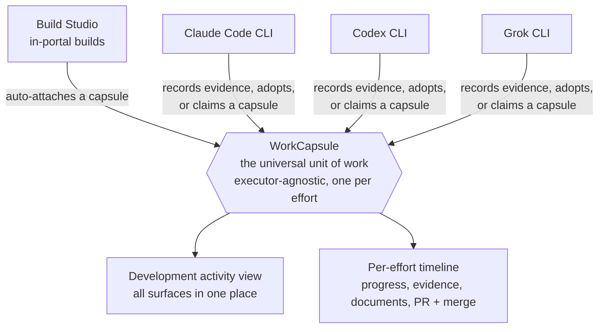

# Unified Development Activity Tracking

Every piece of development work in the platform — whether it is built by the in‑portal **Build Studio** or by an external AI coding agent (**Claude Code**, **Codex**, or **Grok**) — is tracked the same way. You see all of it, with its progress, evidence, documents, and pull requests, in one cross‑surface view.

This page explains how that works at a glance.

## The structure

The four surfaces are **peers, not a hierarchy** — none is privileged, and work never depends on any one of them being healthy. They all advance the same evidence‑gated lifecycle (`ideate → plan → build → review → ship`), right‑sized to the work.

## One unit of work: the Workroom

Every effort — a Build Studio build, a Claude Code session, a Codex or Grok run — is represented by a single **Workroom**. The workroom is *executor‑agnostic*: it does not matter which surface did the work. It holds the effort's identity — its branch, worktree, pull request, lifecycle status, scope claims, and a lease (so two agents do not collide on the same work).

Because the workroom is the shared unit, every surface's work lands in the same place.

## How each surface is captured

| Surface | How it becomes a tracked workroom |
| --- | --- |
| **Build Studio** | Auto‑attaches a workroom when a build starts. |
| **Claude Code / Codex / Grok** | Three ways, in order of least effort: (1) **auto‑capture** — recording development evidence, which agents are asked to do at phase boundaries, creates the workroom automatically; (2) **adopt** an existing branch/worktree; (3) **claim** a workroom explicitly at work‑start. |

Capture degrades gracefully: if the coordination plane is briefly unreachable, the agent still works and the workroom reconciles afterward — work never blocks on the tracker.

## What you see

- **Development activity view** — every surface's work in one list (the **All work** lens), each item showing its status, owner, branch, and PR. Completed work is marked **shipped**.
- **Per‑effort timeline** — for any single effort: its progress through the lifecycle, its evidence (tests, production build, runtime verification), its documents (brief, design, plan, phase handoffs), and its pull request and merge.

## Why this works

- **The coordination plane is MCP.** Work tracking, claims, and evidence live in one substrate. *If it is not in the plane, it did not happen.*
- **Governance approves evidence, not provenance.** A quality gate reads the required evidence and never branches on *which* surface produced it. That is exactly what makes the surfaces interchangeable — and what lets one agent start an effort and another finish it (start‑by‑one / finish‑by‑another).

## Where to look / learn more

- **In the portal:** the cross‑surface **Development activity** view (route `/platform/development/change-lanes`), opening on the **All work** lens.
- **The contract for agents:** [`AGENTS.md`](../../AGENTS.md) §17 — *Delivery Surfaces & Execution Alignment*.
- **The design:** [Unified Build Studio tracking across all surfaces](../superpowers/specs/2026-06-19-unified-build-studio-tracking-all-surfaces-design.md) and its [delivery‑visibility addendum](../superpowers/specs/2026-06-19-delivery-visibility-and-pr-capture-addendum.md).
