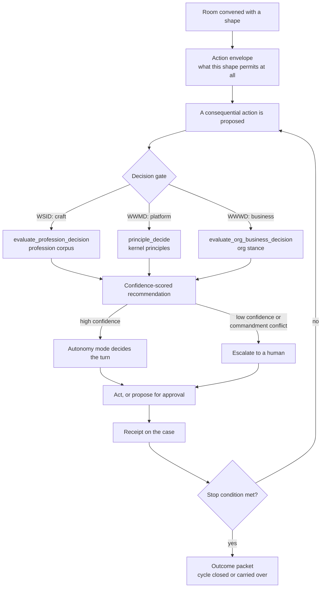

# Work shapes and the decision gate

**Backlog item:** `BI-C8C4031C`
**Epic:** `EP-WORK-CONVERGENCE`
**Status:** Current

A Workroom is not a generic container. It is convened with a **shape**, and that shape
is what bounds the actions available inside it. Within those bounds, the kernel decides
whether a coworker may proceed unattended. Two levels, in that order:

> **The room's work shape bounds what is permitted at all. `principle_decide` gates
> autonomy within that envelope.**

Neither level substitutes for the other. A shape that permits an action does not make it
autonomous; a high-confidence kernel recommendation does not widen the envelope the shape
set. This page states the shape vocabulary, where the decision gate sits, and what the
shape does next once a gate clears.

Vocabulary for the three layers (record → projection → view) is fixed in
[Workroom vocabulary boundary](workroom-vocabulary-boundary.md); this page starts where
that one deliberately stops.

## The flow

## Shape is four orthogonal choices, not one taxonomy

A common misreading is that "work shape" is a single enum. It is four independent axes,
each owned by a different part of the substrate. A room picks one value on each.

| Axis | Values | Owner |
| --- | --- | --- |
| **Activity kind** — what the work *is* | `delivery`, `support`, `improvement`, `governance`, `launch-readiness`, `craft-judgment`, `lifecycle`, `remediation` | `WORK_CAPSULE_SCOPE_ACTIVITY_KINDS` in `apps/web/lib/work-capsules.ts` |
| **Mode** — how long it lives | `finite` (one bounded decision or action), `standing` (ongoing activity) | `WorkroomMode` in `apps/web/lib/work-management/room-types.ts` |
| **Participant roles** — who is in it, as what | `accountable`, `coordinator`, `contributor`, `specialist`, `approver`, `reviewer`, `observer` | `WorkroomParticipantRole`, same file |
| **Collaboration shape** — how a gate inside it routes | `specialist-alignment`, `approval / sign-off`, `outward-review`, `change / consequential`, `escalation` | [governance-gate spec](../superpowers/specs/2026-08-13-wwwd-constitutional-alignment-gate.md) |

The first three are live code. The fourth is **designed and specified but not yet a
registry** — the shapes exist as a table in the spec, not as an enum any code reads.
Treat a claim that a room "has" a collaboration shape as intent, not as state you can
query today.

Finite and standing rooms are explained for end users in
[Work Rooms](../user-guide/workspace/work-rooms.md).

## The gate: which scope decides

Three decision surfaces, three corpora. They are siblings, not a hierarchy, and each
answers a different question. Routing a question to the wrong one is the failure mode the
`consult-scopes-before-asking` commandment exists to prevent.

| Scope | Tool | Question it answers | Corpus |
| --- | --- | --- | --- |
| **WSID** (profession) | `evaluate_profession_decision` | *How should I, in my craft, do this?* | the coworker's profession corpus — recorded techniques and standards |
| **WWMD** (platform) | `principle_decide` | *What should we do about the platform itself?* | kernel principles |
| **WWWD** (organization) | `evaluate_org_business_decision` | *Does this fit the company — mission, market, product, GTM?* | the org's authored stances |

**WSID is the specialist's gate.** Its handler is
`apps/web/lib/mcp/packs/profession-decision-pack.ts`. Three properties matter for how it
behaves as a gate:

- It is **scoped to the calling coworker**. A profession decision with no agent identity
  reaching the tool is refused outright — there is no anonymous craft judgment.
- **Stakes raise the bar.** Higher consequence tiers require more confidence before the
  tool will return a recommendation at all.
- It **falls back to platform defaults only as advisory** when the profession has no
  recorded guidance, and **escalates to a human on low confidence** rather than guessing.

That last property is the one to design around: an empty or thin profession corpus does
not produce a bad recommendation, it produces an escalation. Corpus coverage is therefore
an autonomy input, not a nice-to-have.

The composition rule from the [standards family](agent-standards-family.md) still governs
who may run the check: `GAID identity → JSI qualification → TAK intersection → GAID
receipt`. A qualification is not permission to act; the gate layers on top of it.

## What the gate does to the turn

A cleared gate does not mean "act". It means the autonomy envelope now decides whether
this coworker takes the turn or hands it to a human. That projection lives in
`apps/web/lib/work-management/autonomy-envelope.ts`:

| Decision mode | What happens |
| --- | --- |
| `shadow-only` | the action is recorded, never taken |
| `propose-for-approval` | a human turn is required |
| `supervised-action` | acts, with a supervising human in the loop |
| `autonomous-action` | **the sole mode that permits acting without a human turn** |

The trust level feeding this is already risk-capped before it arrives, and
`requiresCoworkerEnvelope` can demand an approved envelope either `always` or only
`when-supervised`, per the action descriptor in `action-registry.ts`. Denials come back
as named reasons from `policy-envelope.ts` — including `missing_decision_interaction`,
`missing_coworker_envelope`, and `stop_condition_tripped` — not as a generic refusal.

## What is actually enforced today

The seam is `apps/web/lib/tak/decision-routing-governance-hook.ts`. Read it before
assuming coverage, because the honest scope is narrow by design:

- **Tool coverage:** `CONSEQUENTIAL_DECISION_TOOLS` currently holds **two** tools —
  `triage_backlog_item` and `retire_backlog_item`.
- **Surface:** only `source: "agentic-loop"` (in-portal coworker and Build Studio).
  External CLI sessions are governed by the plane-1 `PreToolUse` hook instead; direct
  REST/JSON-RPC is operator traffic and out of scope.
- **Consultation window:** a `principle_decide` call clears the gate for
  `CONSULT_WINDOW_MS` — 30 minutes. The intended bypass is "consult first".
- **Mode:** `DPF_DECISION_GATE_MODE` = `enforce` (default) | `shadow` | `off`.
- **Fail-open:** any error allows. A governance guard must never wedge the loop.
- **Ledger:** the consultation map is per-process and in-memory, so it holds for a
  single-portal deployment and would need a durable store for multi-instance portals.

The gate was itself kernel-consulted (2026-07-04) and shipped deliberately narrow: the
consult recorded a genuine judgment call between enforcing narrowly and auditing in
shadow, so it does both — narrow enforcement plus a structured audit signal on every
unconsulted consequential decision.

**Do not read this seam as "consequential tool use is gated."** Two tools on one surface
are gated. The general pre-execution interceptor over all consequential tool calls — with
its four check families (alignment, authority and policy, consequence/HITL, and
precondition/ordering) — is the target architecture in the
[governance-gate spec](../superpowers/specs/2026-08-13-wwwd-constitutional-alignment-gate.md),
not the current state.

## The shape's next steps, after the gate

Clearing a gate advances the room; it does not finish it. The shape determines what
happens next, and each step leaves a durable record:

1. **Act or propose**, per the autonomy mode above.
2. **Receipt.** The action lands as a `ReceiptEnvelope` on the case
   (`receipt-envelope.ts`), carrying the acting identity, the policy refs consulted, and a
   `rawRef` back to the row it came from. A gate verdict is a `DecisionInteraction`
   receipt; a tool call is a tool-execution receipt.
3. **Stop conditions.** `stop-conditions.ts` decides whether the cycle continues.
   A tripped condition is itself a policy denial reason, so a room cannot quietly run past
   its own boundary.
4. **Verification**, where the shape calls for it — a verification activity on the case,
   not a claim in prose.
5. **Cycle close or carry-over.** A finite room produces its **outcome packet**
   (`outcome-packet.ts`) — decisions, artifacts, actions, receipts, evidence, plus
   explicitly unresolved work with a disposition. A standing room closes the cycle and
   carries the remainder forward (`cycle-opened`, `cycle-closed`, `cycle-carried-over` in
   the activity kinds).

The unresolved-work list is the load-bearing part of an outcome packet: a shape that ends
with silent remainders is how work escapes the room. Naming the remainder with a
disposition is what keeps the next cycle honest.

## Known gaps

Stated plainly so nobody plans against a capability that is not there:

- **Collaboration shapes are not a registry.** Five shapes are specified; no enum, no
  binding, nothing queryable. Binding them per gate pattern is `BI-51CCB81C`.
- **Gate coverage is two tools on one surface.** The interceptor over all consequential
  tool calls is specified, not built (EP-1C37C089).
- **The consultation ledger is in-memory and per-process.**
- **None of this is visible as a picture yet.** The room surface renders no graphic at
  all; the shape view that would draw these gates and their verdicts is `BI-C7E2E924`.

**Shape now also sets posture** ⟦runtime: added 2026-08-22, `BI-4F468192`⟧. The same four
axes feed the room's *posture* — how persistently the coworker follows up and how it trades
cost against quality against time — through `resolveWorkroomPosture`
(`apps/web/lib/work-management/room-posture.ts`), layered over the existing proactivity and
Golden Triangle engines. `WorkroomView.posture` carries the result and the reason for every
clamp. The load-bearing rule mirrors the two-level rule above: a derivation may TIGHTEN the
action boundary and may never widen it, so shape can restrict autonomy but never grant it.
Design: [Work Posture](../superpowers/specs/2026-08-22-workroom-work-posture-design.md).

## Related

- [Workroom vocabulary boundary](workroom-vocabulary-boundary.md) — what the word means at each layer
- [Trustworthy AI Agent Standards Family](agent-standards-family.md) — TAK, GAID, JSI and the composition rule
- [A Governance Gate on Consequential Tool Use](../superpowers/specs/2026-08-13-wwwd-constitutional-alignment-gate.md) — the target architecture
- [Work Rooms](../user-guide/workspace/work-rooms.md) — the end-user view
