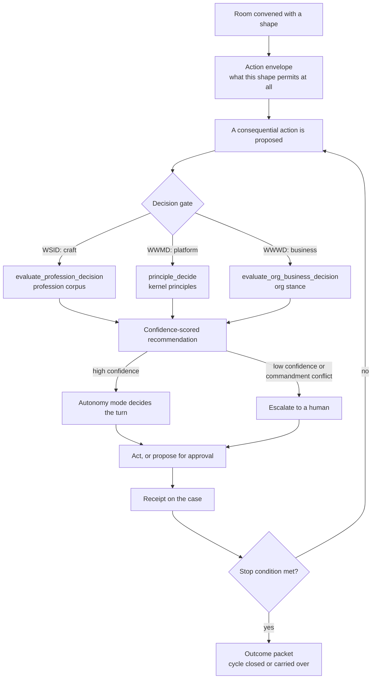

# Work shapes and the decision gate

**Scope:** canonical Workroom shape and decision-gate architecture
**Epic:** `EP-WORK-CONVERGENCE`
**Status:** Current

A Workroom is not a generic container. It is convened with a **shape**, and that shape
is what bounds the actions available inside it. Within those bounds, the kernel decides
whether a coworker may proceed unattended. Two levels, in that order:

> **The room's work shape bounds what is permitted at all. `principle_decide` gates
> autonomy within that envelope.**

Neither level substitutes for the other. A shape that permits an action does not make it
autonomous; a high-confidence kernel recommendation does not widen the envelope the shape
set. This page states the shape vocabulary, where the decision gate sits, and what the
shape does next once a gate clears.

Vocabulary for the three layers (record → projection → view) is fixed in
[Workroom vocabulary boundary](workroom-vocabulary-boundary.md); this page starts where
that one deliberately stops.

## The flow

## Shape is four orthogonal choices, not one taxonomy

A common misreading is that "work shape" is a single enum. It is four independent axes,
each owned by a different part of the substrate. A room picks one value on each.

| Axis | Values | Owner |
| --- | --- | --- |
| **Activity kind** — what the work *is* | `delivery`, `support`, `improvement`, `governance`, `launch-readiness`, `craft-judgment`, `lifecycle`, `remediation` | `WORK_CAPSULE_SCOPE_ACTIVITY_KINDS` in `apps/web/lib/work-capsules.ts` |
| **Mode** — how long it lives | `finite` (one bounded decision or action), `standing` (ongoing activity) | `WorkroomMode` in `apps/web/lib/work-management/room-types.ts` |
| **Participant roles** — who is in it, as what | `accountable`, `coordinator`, `contributor`, `specialist`, `approver`, `reviewer`, `observer` | `WorkroomParticipantRole`, same file |
| **Collaboration shape** — how a gate inside it routes | `specialist-alignment`, `approval-sign-off`, `outward-review`, `change-consequential`, `escalation`, `craft-stewardship` | `WORKROOM_SHAPE_KEYS` in `apps/web/lib/work-management/room-shapes.ts` |

The first three are live code. The fourth **is now a registry with a write path**
⟦runtime: 2026-08-23⟧: `WORKROOM_SHAPE_KEYS` in
`apps/web/lib/work-management/room-shapes.ts` is the enum, and a room is convened with a
shape by passing `workroomShape` to `create_workroom` or `adopt_worktree`. It persists as a
`scopeClaims` entry — no migration — and is read back by `readWorkroomShapeClaim`.

### The activity shape is a second, separate claim ⟦runtime: 2026-09-02, `BI-A967717A`⟧

Do not confuse the two shapes a room can carry. **`workroomShape`** (above) says *who must be
in the room* for one consequential act. **`workShape`** says *what makes the room act at all*:
which triggers wake it, which stages it moves through, who answers for each, and what stops it.

A standing room declares its activity shape by passing `workShape` to `create_workroom` as a
`key@version` reference — for example `dependency-advisory-watch@1.0.0`, from the registry in
`apps/web/lib/work-management/work-shapes.ts` and its standing set in
`standing-operations-shapes.ts`. Like the collaboration shape, it persists as a `scopeClaims`
entry with no migration, and is read back by `readWorkShapeClaim` / `resolveWorkShapeClaim`.

**This claim is what makes a room wake.** The standing-Workroom drive
(`apps/web/lib/queue/functions/workroom-drive.ts`, every 15 minutes) selects non-terminal,
unarchived rooms **that carry a work-shape claim**, ordered, and bounded by
`STANDING_ROOM_SCAN_LIMIT`.

That same standing drive performs a bounded, best-effort notification reconciliation for
Workroom-owned facts such as approval, review, lease expiry, and terminal state. Durable async
inference transitions do not wait for that cadence: the event-only Task Hub consumer re-reads the
canonical `(operationId, sequence)` transition, resolves its server-owned Workroom binding, writes
a deterministic activity to the existing Workroom ledger, and then wakes the list stream. The
event payload is never accepted as status, Workroom, recipient, or notification authority, and no
parallel task ledger or scheduler is introduced.

The filter is part of the query rather than a pass over the results, and the distinction is
load-bearing ⟦runtime: corrected 2026-09-02⟧. The first implementation capped
the row read at 200 and filtered for the claim afterwards in JavaScript, so the cap bounded
*every* room instead of the candidates. On an install with 276 non-terminal rooms and one
shaped room, the drive reported `scanned: 0` on every tick for seven hours: registered,
connected, executing in 47ms, and reading the wrong set of rows. Nothing errored, which is
why it took a direct row count to see. The ordering matters for the same reason — without it,
which rooms fall inside the cap is whatever the query planner returned, so a room could be
scanned on one tick and invisible on the next without changing at all. A room without it is inert
by construction, however assertive its posture. A malformed reference is refused at
normalization rather than stored, because a claim that can never resolve would leave the room
looking declared and behaving inert — the exact failure this contract exists to end.

The drive never executes a stage whose accountable principal is a `role:` or `person:`
reference, and never executes a `governed-decision` advance, at any posture. Those become
attention for the named principal. Sending outward, moving money, rotating a credential,
merging a change, and changing authority are declared that way in every standing shape.

A room that never declared one gets a **derived** shape from what it already is
(`derive-workroom-shape.ts`): a standing WSID room is craft stewardship by definition,
`launch-readiness` is an approval sign-off, `governance` and `remediation` are consequential
changes. The derivation deliberately returns **null** for `delivery`, `support`,
`improvement`, `lifecycle`, a bare `wwmd`/`wwwd` scope, or no signal — several shapes could
fit and the room has not said which, so it is reported unshaped rather than guessed.

Measured on the reference install at the time of writing: shape coverage went from **0% to
9.2%** (30 of 327 rooms), because the scope signals the derivation reads exist on only
~13% of rooms. The remainder closes as rooms are convened with a shape, not by backfill.
So a claim that a room "has" a collaboration shape is now queryable — but check whether it
was **declared or derived**, and expect most older rooms to have neither.

Finite and standing rooms are explained for end users in
[Work Rooms](../user-guide/workspace/work-rooms.md).

### The coordinator is the Workroom Process Overseer

Every collaboration shape includes `coordinator`. DPF does not need a second orchestrator-agent
type: the canonical coordinator is the human-facing **Process Overseer** for both finite and
standing rooms. The accountable participant owns the outcome; the coordinator owns conformance to
the room's declared shape. Executors do the work, reviewers or evaluators assess it, and approvers
authorize consequential transitions. Those responsibilities are not synonyms.

The runtime now carries this role as an executable conformance projection, not only as roster
vocabulary. `room-coordinator.ts` selects or derives a coordinator for the read model;
`workroom-shape-conformance.ts` compares declared shape, stage, evidence, role separation,
budgets, stop conditions, and coordinator eligibility with observed state. A derived coordinator
remains useful for legacy visibility, but it is marked compatibility-only and does not make a
shaped room execution-qualified. The enforced contract is:

#### Appointing one ⟦runtime: 2026-09-03, `BI-F63200A8`⟧

Requiring an explicit coordinator is only half a contract; something has to be able to name one.
Until this landed nothing could. `persistWorkroomParticipantAssignment` could always write the
roster row and had **zero callers**; `invite_room_participant` admits a participant but never sets
the `coordinator` role, and requires an acting coworker, so it could not have unstuck a room even
from inside. The consequence was observable rather than theoretical: a standing room on the
reference install woke every fifteen minutes and refused **100 consecutive times** with
`missing_explicit_coordinator`, and nothing surfaced it.

`appoint_room_coordinator` is that caller — `capsuleId` plus `principalRef`, deliberately callable
**without** an acting coworker so a stalled room can be given an owner by whoever notices it. It
carries `consequence: "authority"`, because who answers for a room is an authority fact.

Its refusals carry the contract:

- an unknown or inactive principal is refused, because persisting one leaves the room *looking*
  owned while it still refuses to execute — indistinguishable from having no owner at all;
- a second coordinator is refused unless a hand-over is explicit, because conformance treats
  `multiple_coordinators` as blocking, so silently adding one leaves the room **more** stuck than
  before the appointment;
- re-appointing the current owner is idempotent, not a second coordinator.

Appointment is layer 1 of the ownership ladder ratified in `DI-306B742EFD74`; deriving an owner
from the work shape, the archetype's portfolio specialist, or the value-stream orchestrator is
follow-on work, and an unresolvable room is reported unowned rather than assigned to a
plausible-looking coworker.

1. **Convene:** require exactly one explicit current coordinator and validate the collaboration
   shape, WorkShapeDefinition/version, persisted roster, posture, authority, trigger, measures,
   review point, budgets, and stop conditions.
2. **Before a transition:** compute a deterministic shape-conformance result. Refuse or pause work
   when the expected stage, required participant, prerequisite evidence, authority binding, budget,
   or review obligation is not satisfied.
3. **After a transition:** append the stage receipt, compare observed state with the declared
   transition, and route the next permitted stage, verification, repair, escalation, or close.
4. **Reconcile:** run the same idempotent projection on events for finite rooms and on a bounded
   delta cadence for standing rooms. Do not continuously poll every room.
5. **Close:** require the outcome packet to carry the last conformance result and dispositions for
   every unresolved deviation.

The controller must not silently invent an occupant, skip a gate, widen authority, or retry until a
proxy metric passes. A mismatch produces an attributable receipt and attention item for the
coordinator and accountable owner. The coordinator may be a person or an AI coworker. An AI
coordinator requires job-specific qualification for process oversight plus explicit TAK authority;
it cannot also serve as the independent evaluator or approver where the shape requires separation.

The same projection guards cycle opening, cycle completion, and carry-over persistence before any
mutation. Standing-room runs persist the full projection and its stable reconciliation key so the
next drive and the operator read the same evidence. Missing or unresolvable evidence pauses a
shaped room; the runtime does not infer conformance from the absence of an error. AI coordinators
must have eligible JSI qualification and TAK authority inputs, and an unknown input fails closed.

The Workroom surface makes this control legible in **Details → Process Overseer**: coordinator
identity, explicit versus derived assignment, conformance status, current and expected next stage,
unresolved deviations, last check, intervention reason, and reconciliation key. Presence remains
separate from membership. Unshaped legacy rooms are reported as not applicable rather than being
silently upgraded to executable oversight.

Definition and occurrence identity are not a fifth shape axis. The Work Case source
registry owns a stable, versioned room-definition projection. The Work Case owns the room
instance, with its primary source, current cycle, and active execution carriers forming
the occurrence trace. This keeps the same definition useful for business-only and
development rooms: repository, worktree, pull-request, token, and CI records are optional
execution evidence, never prerequisites for room identity.

## The gate: which scope decides

Three decision surfaces, three corpora. They are siblings, not a hierarchy, and each
answers a different question. Routing a question to the wrong one is the failure mode the
`consult-scopes-before-asking` commandment exists to prevent.

| Scope | Tool | Question it answers | Corpus |
| --- | --- | --- | --- |
| **WSID** (profession) | `evaluate_profession_decision` | *How should I, in my craft, do this?* | the coworker's profession corpus — recorded techniques and standards |
| **WWMD** (platform) | `principle_decide` | *What should we do about the platform itself?* | kernel principles |
| **WWWD** (organization) | `evaluate_org_business_decision` | *Does this fit the company — mission, market, product, GTM?* | the org's authored stances |

**WSID is the specialist's gate.** Its handler is
`apps/web/lib/mcp/packs/profession-decision-pack.ts`. Three properties matter for how it
behaves as a gate:

- It is **scoped to the calling coworker**. A profession decision with no agent identity
  reaching the tool is refused outright — there is no anonymous craft judgment.
- **Stakes raise the bar.** Higher consequence tiers require more confidence before the
  tool will return a recommendation at all.
- It **falls back to platform defaults only as advisory** when the profession has no
  recorded guidance, and **escalates to a human on low confidence** rather than guessing.

That last property is the one to design around: an empty or thin profession corpus does
not produce a bad recommendation, it produces an escalation. Corpus coverage is therefore
an autonomy input, not a nice-to-have.

The composition rule from the [standards family](agent-standards-family.md) still governs
who may run the check: `GAID identity → JSI qualification → TAK intersection → GAID
receipt`. A qualification is not permission to act; the gate layers on top of it.

## What the gate does to the turn

A cleared gate does not mean "act". It means the autonomy envelope now decides whether
this coworker takes the turn or hands it to a human. That projection lives in
`apps/web/lib/work-management/autonomy-envelope.ts`:

| Decision mode | What happens |
| --- | --- |
| `shadow-only` | the action is recorded, never taken |
| `propose-for-approval` | a human turn is required |
| `supervised-action` | acts, with a supervising human in the loop |
| `autonomous-action` | **the sole mode that permits acting without a human turn** |

**The two ladders are now one projection** ⟦runtime: 2026-08-23⟧.
The decision mode above and the proactivity `actionBoundary` (`advise` · `propose` ·
`preauthorized`) used to decide the same question separately and never meet, so a
`preauthorized` posture could imply autonomy the envelope would deny and vice versa.
`joinAutonomy` (`work-management/hitl-join.ts`) now returns the **stricter** of the two —
neither ladder may purchase autonomy the other withholds. `advise` maps to `shadow-only`,
not `propose-for-approval`: advising is saying what should happen, not putting an action
forward to be approved.

**Verification is load-bearing.** A consequential action at the kernel floor
(`RiskClass.outbound-or-floor` — outward, financial, irreversible, access-control) is denied
by name — `missing_verification_evidence` — unless verification evidence exists on the case.
A room's posture may ADD a verification requirement to work that would not otherwise carry
one; nothing can remove the floor's. Until this landed, `verificationDepth` was compiled,
rendered as a "Deep verification" chip and written to receipts while gating nothing.

The trust level feeding this is already risk-capped before it arrives, and
`requiresCoworkerEnvelope` can demand an approved envelope either `always` or only
`when-supervised`, per the action descriptor in `action-registry.ts`. Denials come back
as named reasons from `policy-envelope.ts` — including `missing_decision_interaction`,
`missing_coworker_envelope`, and `stop_condition_tripped` — not as a generic refusal.

### Where the declared shapes live ⟦runtime: 2026-09-02⟧

The shape registry spans three modules, merged into `ALL_SHAPES` at runtime:

| module | holds |
|---|---|
| `work-shapes.ts` | the contract — types, validation, cycle projection — and the anchor compliance shape |
| `standing-operations-shapes.ts` | the standing operations a BUSINESS runs |
| `coworker-standing-shapes.ts` | the standing work the platform's own coworkers run |
| `orchestration-shapes.ts` | one cycle per IT4IT value stream, for the value-stream orchestrators |

A static reader must consult all three. The capability measure read only the first
for a period and reported seven fully-bounded agents as having no declared work
shape at all — an unbounded coworker is what that reads as, so the under-report was
the more dangerous direction. `SHAPE_SOURCE_FILES` in
`scripts/measure-capability-completeness.mjs` is now the explicit list, guarded by a
test that fails when a work-management file names an accountable agent and is not on
it.

Every shape in the coworker module ends in a `governed-decision` taken by a human
`role:`, never by the coworker that prepared the work. A shape whose advances are
all `status-change` declares an unbounded coworker in the shape of a bounded one.

The same one-file assumption has now broken this scanner four times — shapes,
self-tasks, skills, and the coworker grants map. Each time a registry moved to a
second module and the static reader kept reading the first. Every source list it
depends on is therefore explicit and guarded: `SHAPE_SOURCE_FILES`,
`SELF_TASK_SOURCES`, `GRANTS_SOURCE_FILES`, and the skill-pack namespace. The
grants case was the worst-reading: a re-export carries no entries, so slicing the
seed file alone reported a live coworker as "holds no grants at all — no tool
surface is authorised".

## What is actually enforced today

The seam is `apps/web/lib/tak/decision-routing-governance-hook.ts`. Read it before
assuming coverage, because the honest scope is narrow by design:

- **Tool coverage:** `CONSEQUENTIAL_DECISION_TOOLS` currently holds **two** tools —
  `triage_backlog_item` and `retire_backlog_item`.
- **Surface:** only `source: "agentic-loop"` (in-portal coworker and Build Studio).
  External CLI sessions are governed by the plane-1 `PreToolUse` hook instead; direct
  REST/JSON-RPC is operator traffic and out of scope.
- **Consultation window:** a `principle_decide` call clears the gate for
  `CONSULT_WINDOW_MS` — 30 minutes. The intended bypass is "consult first".
- **Mode:** `DPF_DECISION_GATE_MODE` = `enforce` (default) | `shadow` | `off`.
- **Fail-open:** any error allows. A governance guard must never wedge the loop.
- **Ledger:** the consultation map is per-process and in-memory, so it holds for a
  single-portal deployment and would need a durable store for multi-instance portals.

The gate was itself kernel-consulted (2026-07-04) and shipped deliberately narrow: the
consult recorded a genuine judgment call between enforcing narrowly and auditing in
shadow, so it does both — narrow enforcement plus a structured audit signal on every
unconsulted consequential decision.

**Do not read this seam as "consequential tool use is gated."** Two tools on one surface
are gated. The general pre-execution interceptor over all consequential tool calls — with
its four check families (alignment, authority and policy, consequence/HITL, and
precondition/ordering) — is the target architecture in the
[governance-gate spec](../superpowers/specs/2026-08-13-wwwd-constitutional-alignment-gate.md),
not the current state.

## The shape's next steps, after the gate

Clearing a gate advances the room; it does not finish it. The shape determines what
happens next, and each step leaves a durable record:

1. **Act or propose**, per the autonomy mode above.
2. **Receipt.** The action lands as a `ReceiptEnvelope` on the case
   (`receipt-envelope.ts`), carrying the acting identity, the policy refs consulted, and a
   `rawRef` back to the row it came from. A gate verdict is a `DecisionInteraction`
   receipt; a tool call is a tool-execution receipt.
3. **Stop conditions.** `stop-conditions.ts` decides whether the cycle continues.
   A tripped condition is itself a policy denial reason, so a room cannot quietly run past
   its own boundary.
4. **Verification**, where the shape calls for it — a verification activity on the case,
   not a claim in prose.
5. **Cycle close or carry-over.** A finite room produces its **outcome packet**
   (`outcome-packet.ts`) — decisions, artifacts, actions, receipts, evidence, plus
   explicitly unresolved work with a disposition. A standing room closes the cycle and
   carries the remainder forward (`cycle-opened`, `cycle-closed`, `cycle-carried-over` in
   the activity kinds).

The unresolved-work list is the load-bearing part of an outcome packet: a shape that ends
with silent remainders is how work escapes the room. Naming the remainder with a
disposition is what keeps the next cycle honest.

## Setting the posture, and the default for rooms

⟦runtime: shipped 2026-08-23⟧ Both write paths are operator-facing, which they were not
when the posture first shipped: `WorkroomPosture.tsx` displayed a pace and priority with
zero interactive elements and no server action behind it, while every settable control was
per-coworker.

- **Per room** — shape, pace and action boundary, inside the room's existing collapsed
  section (`WorkroomPostureControl`, actions in `lib/actions/workroom-posture.ts`). The
  shape claim REPLACES any prior entry rather than appending, because
  `readWorkroomShapeClaim` returns the first valid declaration and a stale entry would win.
- **Decreed default for rooms** — `WorkroomDefaultControl` on the priority surface, stored
  migration-free under `autonomyPolicy.workroomPostureDefault`
  (`workroom-posture-defaults.ts`).

Ladder position for the default: **above** the coworker ladder, because it is specifically
about rooms and they are not; **below** derivation, because what the work actually is
outranks a blanket preference about rooms. Both paths run the action boundary through the
tighten-only clamp, so neither control can widen authority — and the UI states that, since
an invariant the operator cannot see is one they will be surprised by.

## Known gaps

Stated plainly so nobody plans against a capability that is not there:

- **The consultation ledger is in-memory and per-process.** A decision consulted in one
  process is not visible to another; only the receipt it writes survives the turn.
- **Coordinator is not yet an executable conformance controller.** The role and selection helper
  exist, and every collaboration shape includes it, but a persisted explicit assignment and a
  transition-level conformance result are not yet enforced across every convene, dispatch, receipt,
  review, and close path. `BI-3913EB49` owns that implementation; `BI-4CB2EF76` and
  `BI-EFFD97B4` provide the persisted roster and definition contracts it consumes.
- **The decision-gate stage cannot be attributed to a coworker.** The decision record does
  not identify which coworker acted, so the shape view leaves that stage empty rather than
  attributing another coworker's decision on a guess.
- **Interceptor coverage is classification-wide, enforcement-narrow.**
  `classifyConsequentialTool` runs on the governed execution path, so every governed tool
  call is classified. The workroom-shape hook
  (`lib/governance/workroom-shape-governance-hook.ts`) governs consequential calls bound to
  a room, and its computed decision mode actually decides the turn
  rather than only being recorded in the shadow verdict. The full interceptor over every
  consequential call, room-bound or not, remains the platform-wide decision gate.

Three gaps listed here previously have closed; they are recorded so a reader returning to
this page does not plan against a stale limitation:

- **Collaboration shape is a registry** ⟦runtime: 2026-08-23⟧ —
  `WORKROOM_SHAPE_KEYS` is the enum, `bindWorkroomShape` is the binding, and a room's shape
  is queryable through `readWorkroomShapeClaim`. Six shapes, not five: `craft-stewardship`
  joined the five originally specified.
- **Classification is no longer a hand-listed pair** — the legacy name-keyed list survives
  only for tools that predate the declared `ToolDefinition.consequence` axis, and a
  conformance test now asserts every name in it resolves to a real tool.
- **The shape view is rendered** — `WorkroomShapeSection` on the
  room and `CoworkerShapePanel` on the coworker record draw the same picture. The room now
  presents that picture in the default **Overview** and defers cycles, activity, evidence,
  receipts, and technical references to **Details**.

**Shape now also sets posture** ⟦runtime: added 2026-08-22⟧. The same four
axes feed the room's *posture* — how persistently the coworker follows up and how it trades
cost against quality against time — through `resolveWorkroomPosture`
(`apps/web/lib/work-management/room-posture.ts`), layered over the existing proactivity and
Golden Triangle engines. `WorkroomView.posture` carries the result and the reason for every
clamp. The load-bearing rule mirrors the two-level rule above: a derivation may TIGHTEN the
action boundary and may never widen it, so shape can restrict autonomy but never grant it.
Design: [Work Posture](../superpowers/specs/2026-08-22-workroom-work-posture-design.md).

## Encoding and visualization

The activity definition is typed TypeScript in `WorkShapeDefinition`; the room
stores a `key@version` reference in `scopeClaims`. The collaboration shape has its
own `workroomShape` entry. Occurrence state and receipts live in the existing
Workroom/cycle/task records. These are DPF contracts, not BPMN XML or SysML text.

| View | Purpose | Current implementation boundary |
| --- | --- | --- |
| Workroom Overview/Details | Explain current progress, evidence and what holds the work | `shape-projection.ts` builds the five-stage DPF graph rendered by `WorkroomShape`; it is not a BPMN editor or a full rendering of every activity definition |
| BPMN | Process tasks, gateways, waits, recovery paths and ownership lanes | `process-extract.ts` and `reconcile-process.ts` project selected state machines; WorkShape recovery extraction needs explicit coverage |
| SysML v2 | Requirements, interfaces, allocation to components and verification evidence | Existing EA notation and Parity Engine; use stable source keys rather than a separately maintained model |

The [SysML reference](../Reference/sysml-v2.md) owns notation selection; ArchiMate
remains the enterprise view and C4 the lightweight software explanation. Current
views derive from registered definitions, transition rules and canonical receipts.
Target-state sketches must be labeled as such until implemented and verified.

The [reviewer recovery amendment](../superpowers/specs/2026-09-03-local-first-agentic-delivery-throughput-design.md#81-reviewer-recovery-and-receipt-settlement)
defines the planned extension of `pull-request-flow-watch@1.0.0`, its version
compatibility requirements and the operator display. A declared shape never proves
that automatic replacement or gate advancement is running.

**Existing-room binding gap, observed 2026-09-05:** `adopt_worktree` accepted a
shape update for `WC-4D4BB6EC` but returned unchanged empty `scopeClaims`. The
adoption handler drops `workShape`, and the store does not update scope on reuse.
Readback, not tool success text, determines whether a shape is active. The recovery
amendment assigns repair and round-trip verification to `BI-06AE6833`; do not create
a duplicate room or edit the database to make a diagram look configured.

## Related references

- [Workroom vocabulary boundary](workroom-vocabulary-boundary.md) — what the word means at each layer
- [Trustworthy AI Agent Standards Family](agent-standards-family.md) — TAK, GAID, JSI and the composition rule
- [A Governance Gate on Consequential Tool Use](../superpowers/specs/2026-08-13-wwwd-constitutional-alignment-gate.md) — the target architecture
- [Work Rooms](../user-guide/workspace/work-rooms.md) — the end-user view
