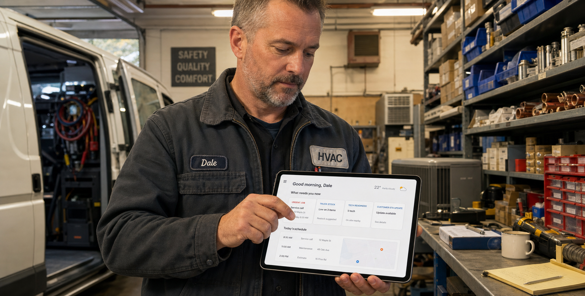
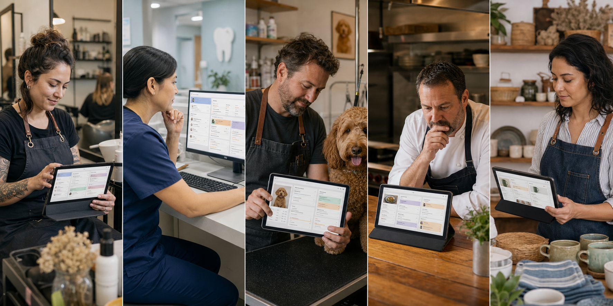
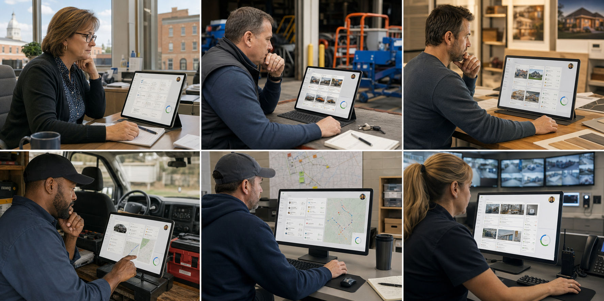
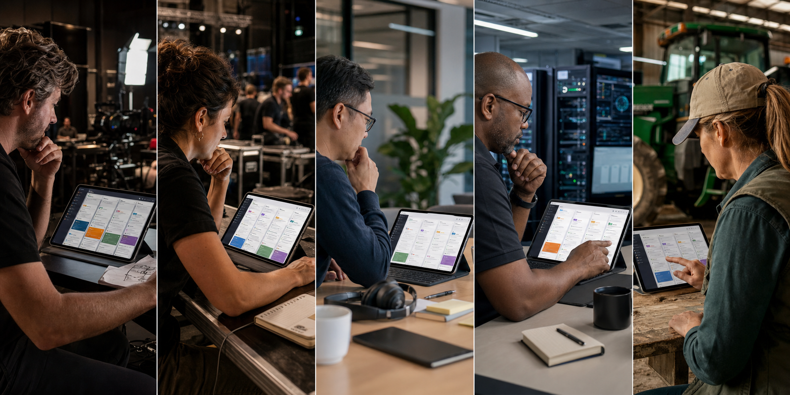

# Archetype Visual Asset Pack

**Status:** Draft preview assets - 2026-07-18  
**Scope:** AI-generated visual previews for owner-facing DPF archetype marketing. These assets are synthetic draft collateral, not customer-approved case studies.  
**Related:** [Archetype Owner Quick Guide](archetype-owner-quick-guide.md), [Archetype Persona Creative Narratives](archetype-persona-creative-narratives.md), [Archetype Owner Positioning](../architecture/archetype-owner-positioning.md)

## Usage Rule

Use these images for internal positioning reviews, sales narrative exploration, deck mockups, and test-priority conversations. Do not present them as real customer screenshots, customer case studies, or proof that every depicted vertical workflow is fully shipped.

Every asset should carry the same claim boundary as the creative narratives:

- **Current-state safe claim:** DPF can shape an archetype-aware portal, workspace, vocabulary, and governed coworker story around this business type.
- **Planned-state creative claim:** the depicted vertical coworker actions are the target experience where the supporting fields, states, approvals, refusals, and audit evidence have been verified.

## Persona Hero Images

| Asset | Preview | Intended use |
| --- | --- | --- |
| Dale - HVAC owner |  | Trades and maintenance hero: dispatch, truck stock, technician readiness, urgent jobs, and customer ETA updates. |
| Linda - dental scheduler |  | Healthcare readiness hero: missing forms, failed reminders, no-show risk, practitioner load, and safe follow-up. |
| Marisol - retail merchandiser |  | Retail operations hero: pickup orders, low stock, receiving, returns, and transfer suggestions. |

## Category Contact Sheets

| Asset | Preview | Categories covered |
| --- | --- | --- |
| Beauty, healthcare, pet, food, retail |  | Beauty and personal care; healthcare and wellness; pet services; food and hospitality; retail and goods. |
| Fitness, education, professional, nonprofit, HOA, banking |  | Fitness and recreation; education and training; professional services; nonprofit and community; HOA and property management; banking and financial services. |
| Public sector, rental, construction, automotive, logistics, security |  | Public sector and civic; asset rental; real estate and construction; automotive services; moving and logistics; security services. |
| Media, live events, software platform, MSP, cooperative shared assets |  | Media production; live events and venues; software platform; IT managed services spotlight; agricultural/cooperative shared assets. |

## Visual Guardrails

- Keep the owner or key employee visually central.
- Show AI coworkers through the DPF-style work surface: owner attention cards, readiness queues, drafts, routed tasks, or decision prompts.
- Avoid robot mascots, generic AI glow, abstract dashboards, and claims of autonomous publishing.
- Avoid private patient, financial, legal, public-safety, or customer details.
- Pair each image with a test emphasis from [Archetype Owner Positioning](../architecture/archetype-owner-positioning.md) before using it externally.

## Next Production Pass

The contact sheets are review assets. For customer-facing collateral, generate or art-direct individual final hero images per priority category, starting with:

1. Dale / trades and maintenance.
2. Linda / healthcare and wellness.
3. Marisol / retail and goods.
4. IT managed services spotlight.
5. Asset rental.
6. Live events and venues.
