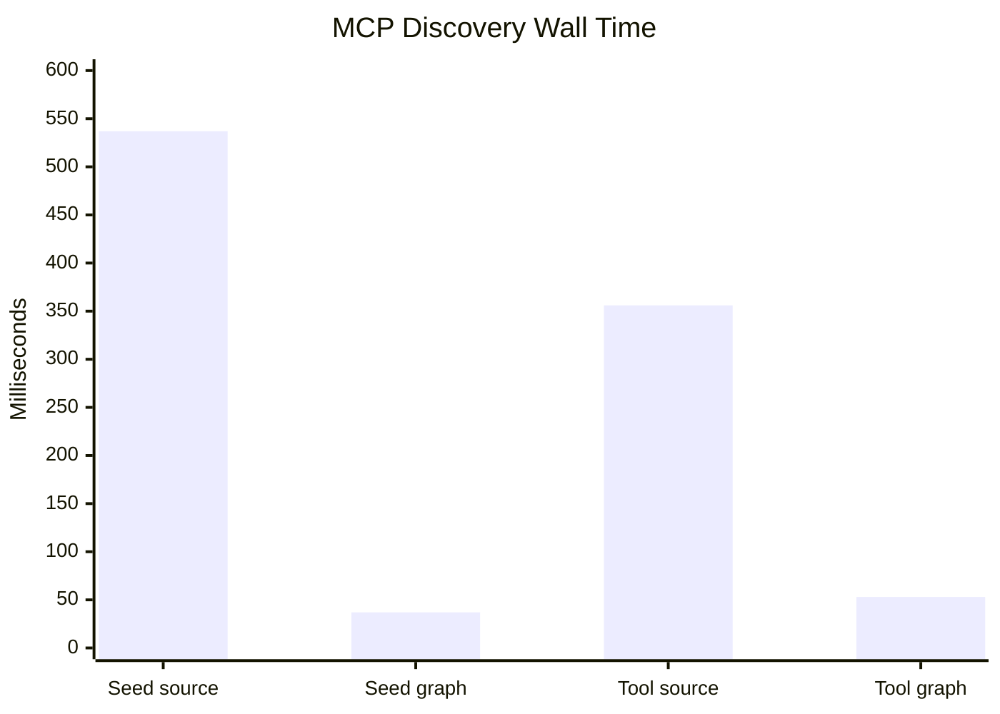
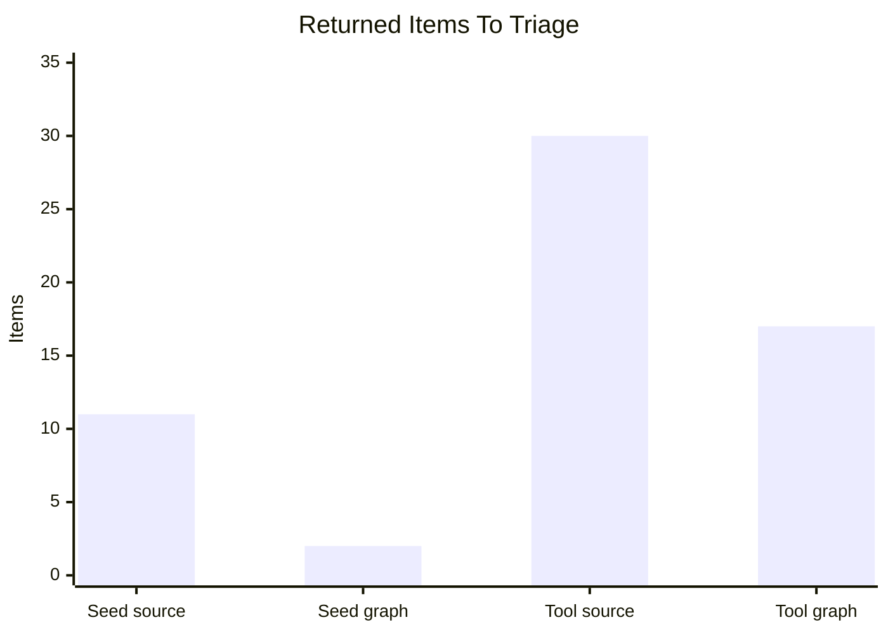
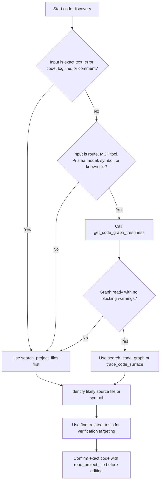

# Code Intelligence Benchmark Report

**Date:** 2026-05-13
**Branch:** `codex/code-intelligence-benchmark-fixes`
**Branch commit:** `730b49c1`
**Runtime graph snapshot:** `/workspace` branch `my-changes`, commit `7744f731b78dbf9f8ac67f2cef2d6a92e7c1bdf1`
**Status:** Live MCP smoke and focused verification complete.

## Executive Summary

The code graph is now useful, but it should be treated as a second lane beside source search rather than a replacement for it.

For exact strings and runtime errors, source search still wins as the first move. For known symbols, tools, routes, models, and test targeting, graph-assisted discovery is faster, less noisy, and better at producing a verification set.

The biggest remaining concern is not query usefulness. It is full-index performance: the latest full graph rebuild indexed 2,804 files in about 364 seconds. That is acceptable for a manual recovery run, but too slow for the target architecture's routine full-reindex goal.

## Runtime Evidence

Live MCP and graph state after the fixes:

| Check | Result |
| --- | --- |
| MCP tools listed | 58 |
| Code tools available | `get_code_graph_freshness`, `inspect_build_code_impact`, `search_code_graph`, `trace_code_surface`, `find_related_tests`, `search_project_files` |
| Graph status | `ready` |
| Indexed files | 2,804 |
| Workspace dirty | `false` |
| Warnings | none |
| `DEFINES` | 4,764 |
| `IMPORTS` | 6,936 |
| `IMPLEMENTS_ROUTE` | 425 |
| `EXPOSES_TOOL` | 165 |
| `TESTED_BY` | 970 |

Verification already run:

| Gate | Result |
| --- | --- |
| Focused Vitest suite | 9 files, 75 tests passed |
| `pnpm --filter web typecheck` | passed |
| `docker-entrypoint.sh` syntax check | passed |
| Docker build for `portal` and `portal-init` | passed with existing Turbopack/NFT warnings |
| Portal runtime | healthy |
| Full live graph rebuild | passed, 2,804 files |

## What Was Compared

Two discovery lanes were compared through MCP against the Docker-served portal:

| Lane | Tools used | Best fit |
| --- | --- | --- |
| Source-only | `search_project_files` | Exact strings, error text, comments, broad lexical discovery |
| Graph-assisted | `get_code_graph_freshness`, `search_code_graph`, `trace_code_surface`, `find_related_tests` | Known symbols/tools/routes/models, surface tracing, related test targeting |

The comparison can be rerun with:

```powershell
powershell -NoProfile -ExecutionPolicy Bypass -File scripts\code-intelligence-benchmark.ps1 -ConfigPath D:\DPF\.mcp.json
```

## Benchmark Results

Client-observed timings are from the MCP caller on 2026-05-13. They should be read as smoke-level measurements, not statistically stable performance numbers.

### Target 1: Seed/P2002 Investigation

Task shape: find the implementation and test surface for the geographic seed P2002 issue.

| Lane | Calls | Wall time | Output quality |
| --- | ---: | ---: | --- |
| Source-only | 2 | 537 ms | Found P2002 references quickly, but the broad P2002 search returned unrelated areas before the seed source. A more specific source search found the seed regression test. |
| Graph-assisted | 2 | 37 ms | `search_code_graph("seedCityOnce")` found `packages/db/src/seed-geographic-data.ts`; `find_related_tests` found `packages/db/src/seed-geographic-data.test.ts` with exact confidence. |

Interpretation: if the only input is "P2002", start with source search. Once the relevant symbol or file is known, the graph is much better at jumping to the owning source and test.

### Target 2: MCP Tool Surface

Task shape: understand the implementation and tests for `get_code_graph_freshness`.

| Lane | Calls | Wall time | Output quality |
| --- | ---: | ---: | --- |
| Source-only | 2 | 356 ms | Found useful lines, but returned mixed prompt guidance, tests, route context, grants, adapters, definitions, and handlers. Requires manual triage. |
| Graph-assisted | 3 | 53 ms | Confirmed freshness, found the `CodeTool` node at `apps/web/lib/mcp-tools.ts:840`, then traced one implementation file and 15 related tests. |

Interpretation: for named MCP tools and structural surfaces, the graph is clearly better as the first move.

## Timing Chart



## Triage Load Chart

This compares how many returned items an operator or agent had to triage before forming the file/test set.



The graph still returns a broad related-test set for `apps/web/lib/mcp-tools.ts` because many MCP tests import the central tool module. That is not wrong, but it is not yet precise enough to run only a tiny test subset for large shared files.

## Recommended Agent Routing



## Recommendations

1. Keep both lanes. Source search should remain the default for exact strings and raw runtime symptoms. The graph should become the default for structural questions once a route, tool, model, symbol, or file is known.

2. Update Build Studio and external-agent prompts to use this rule: `get_code_graph_freshness` at the start of plan/review/ship, then choose source search or graph based on the input shape.

3. Treat graph readiness as a gate, not trivia. If the graph is missing, failed, stale, dirty, or updating, agents should say that and fall back to source search.

4. Optimize full reindex next. The current full rebuild time, about 364 seconds for 2,804 files, misses the design target. The next technical slice should batch Neo4j writes and use a two-phase projection so relationships are order-independent without relying on slow per-file writes.

5. Improve ranking for `search_project_files`. Regression-test fixtures can pollute exact-source searches. Add a mode or ranking rule that can prefer implementation files over test files when the agent is looking for source, while still allowing test-first discovery.

6. Make test targeting more precise for large shared files. `trace_code_surface` correctly found related tests for `get_code_graph_freshness`, but `apps/web/lib/mcp-tools.ts` is a large shared file, so the related-test set is broad. Add tool-handler-level or case-branch-level relationships before using graph output to narrow CI too aggressively.

7. Add a repeatable benchmark harness. The ad hoc PowerShell benchmark should become a checked-in script or MCP-backed evaluation fixture that records timings, results, graph state, and ToolExecution IDs after every graph change.

## Decision

Adopt graph-assisted discovery as the recommended second step after exact source search, and as the first step for known structural surfaces. Do not position the graph as a source-search replacement.

The next smallest high-value implementation slice is:

1. Add a repeatable benchmark harness.
2. Batch graph projection writes to reduce full rebuild time.
3. Add ranking controls for source search.
4. Refine related-test relationships for central files such as `apps/web/lib/mcp-tools.ts`.

## Raw Benchmark Calls

| ID | Tool | Duration | Summary |
| ---: | --- | ---: | --- |
| 101 | `search_project_files` | 360 ms | `P2002` returned 10 broad matches, including unrelated action/release code and the seed regression test. |
| 102 | `search_project_files` | 177 ms | `contract under test is seedCityOnce` returned the seed regression test. |
| 103 | `search_code_graph` | 26 ms | `seedCityOnce` returned `CodeSymbol` in `packages/db/src/seed-geographic-data.ts:151`. |
| 104 | `find_related_tests` | 11 ms | Found `packages/db/src/seed-geographic-data.test.ts`. |
| 201 | `search_project_files` | 164 ms | `get_code_graph_freshness` returned 16 mixed source/test/prompt/grant/adapter matches. |
| 202 | `search_project_files` | 192 ms | `getCodeGraphFreshness` returned 14 implementation/test/query matches. |
| 203 | `get_code_graph_freshness` | 18 ms | Graph ready for 2,804 files, no warnings. |
| 204 | `search_code_graph` | 22 ms | Found `CodeTool` `get_code_graph_freshness` in `apps/web/lib/mcp-tools.ts:840`. |
| 205 | `trace_code_surface` | 13 ms | Found one implementation file and 15 related tests. |
