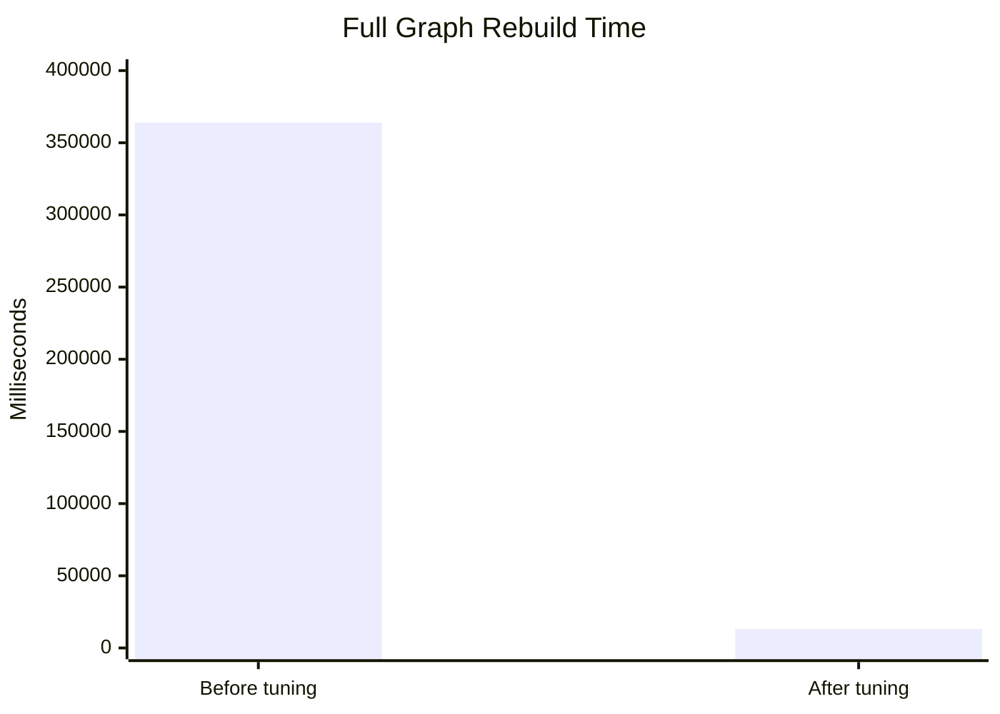
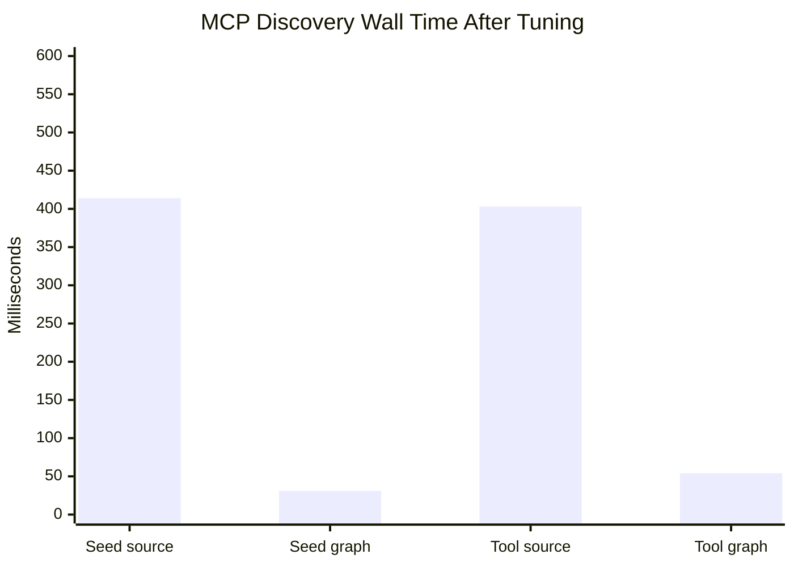
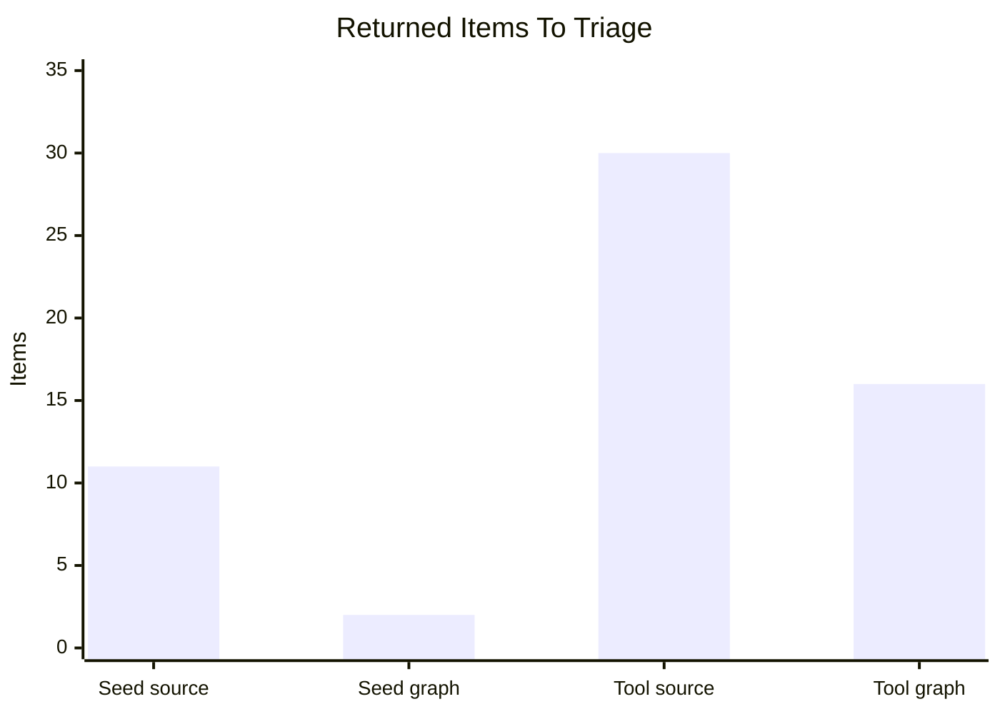
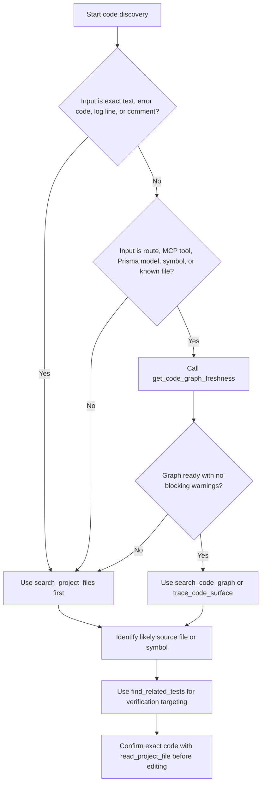

# Code Intelligence Benchmark Report

**Date:** 2026-05-13
**Branch:** `codex/code-intelligence-benchmark-rerun`
**Previous PR:** #558
**Runtime graph snapshot:** `/workspace` branch `my-changes`, commit `4bb9faf640563bb70cdf984058adcb3d05f582fb`
**Status:** Live MCP benchmark rerun after conservative graph projection tuning and the MCP limit compatibility fix.

## Executive Summary

The code graph is useful now, and the tuning pass changed the main conclusion about feasibility.

Before tuning, the graph was valuable for structural discovery but too slow to rebuild routinely: the full live rebuild took about 364 seconds for 2,804 files. After tuning, the latest full rebuild completed in 13.1 seconds for 2,805 files, with 10,570 nodes and 13,266 relationships ready in Neo4j.

The right operating model is still two-lane discovery:

- Use source search first for exact strings, raw errors, logs, and comments.
- Use the graph first for known routes, MCP tools, Prisma models, symbols, files, and verification targeting.

The graph should not replace source search. It should become the default structural navigation layer once the agent has a route, tool, model, symbol, or file to reason about.

## Runtime Evidence

Live MCP and graph state after the tuning pass:

| Check | Result |
| --- | --- |
| MCP tools listed | 58 |
| Code tools available | `get_code_graph_freshness`, `inspect_build_code_impact`, `search_code_graph`, `trace_code_surface`, `find_related_tests`, `search_project_files` |
| Graph status | `ready` |
| Indexed files | 2,805 |
| Nodes | 10,570 |
| Relationships | 13,266 |
| Workspace dirty | `false` |
| Warnings | none |
| `DEFINES` | 4,766 |
| `IMPORTS` | 6,940 |
| `IMPLEMENTS_ROUTE` | 425 |
| `EXPOSES_TOOL` | 165 |
| `TESTED_BY` | 970 |

Verification run during this pass:

| Gate | Result |
| --- | --- |
| Focused graph Vitest suite | 5 files, 33 tests passed |
| `pnpm --filter web typecheck` | passed |
| `git diff --check` | passed |
| `docker-entrypoint.sh` syntax check | passed |
| Docker build for `portal` and `portal-init` | passed with existing Turbopack/NFT warnings |
| Portal runtime | healthy |
| Full live graph rebuild | passed, 2,805 files, 13,123 ms |
| MCP benchmark harness | exposed and then passed after fixing Neo4j `LIMIT` compatibility |

Existing runtime noise observed but not caused by this change:

- `portal-init` still emits non-fatal geographic duplicate and model-profile seed warnings.
- `portal-init` still reports the missing founder-kernel manifest as a non-fatal seed warning.
- The benchmark redo initially hit one invalid MCP run while the portal was restarting; the rerun was clean.

## MCP Client Compatibility Finding

The redo found one more practical issue before the final numbers were collected: graph read tools initially failed when the PowerShell MCP benchmark sent `limit = 10`. The value reached Neo4j as `10.0`, and the `LIMIT` clause rejected it as a non-integer.

The fix keeps the public MCP contract unchanged and normalizes the limit at the graph-query boundary. `search_code_graph` and `find_related_tests` now render a bounded integer literal after validation instead of passing `LIMIT` as a Neo4j parameter. This matters because realistic external clients will not all preserve integer typing the same way.

## Projection Tuning

The full rebuild path was changed from per-file writes to conservative graph-level batches:

| Area | Previous behavior | Tuned behavior |
| --- | --- | --- |
| Code file nodes | One Neo4j write per file | Batched `UNWIND $files` writes |
| File hash rows | One Prisma `upsert` per file | Batched `createMany` after full hash clear |
| Structural nodes | One Neo4j write per fact | Batched by node label |
| Structural relationships | Dynamic endpoint lookup by scanning node keys | Batched by relationship kind and typed endpoint labels/key fields |
| Full rebuild file clear | Global graph clear plus per-file structural clear | Global graph clear only |

Two unsafe intermediate implementations are worth keeping in the learning record:

- Batching relationships while retaining `WHERE any(key IN keys(node))` caused Neo4j to close the connection and the JVM to restart.
- Larger typed batches reached a 12.1 second rebuild on one run, but a later rebased runtime exposed another Neo4j/JVM reset during projection.

The final implementation uses smaller batches, resolves endpoints from graph key prefixes, and writes relationships through indexed key properties such as `CodeFile.codeFileKey`, `CodeSymbol.codeSymbolKey`, and `ExternalModule.externalModuleKey`.

## Full Rebuild Timing

| Run | Result |
| --- | ---: |
| Baseline full rebuild before tuning | ~364,000 ms |
| Naive batched relationship attempt | failed after ~246,500 ms; Neo4j JVM restarted |
| Aggressive typed batches | 12,114 ms once, then unstable on rebased rerun |
| Final conservative typed batches | 13,123 ms latest clean-base run; 13,841 ms and 19,963 ms earlier stable runs |



## What Was Compared

Two discovery lanes were compared through MCP against the Docker-served portal:

| Lane | Tools used | Best fit |
| --- | --- | --- |
| Source-only | `search_project_files` | Exact strings, error text, comments, broad lexical discovery |
| Graph-assisted | `get_code_graph_freshness`, `search_code_graph`, `trace_code_surface`, `find_related_tests` | Known symbols/tools/routes/models, surface tracing, related test targeting |

The comparison can be rerun with:

```powershell
powershell -NoProfile -ExecutionPolicy Bypass -File scripts\code-intelligence-benchmark.ps1 -ConfigPath D:\DPF\.mcp.json
```

## Benchmark Results

Client-observed timings are from the MCP caller on 2026-05-13 after the tuned graph rebuild. They should still be read as smoke-level measurements, not statistically stable performance numbers.

### Target 1: Seed/P2002 Investigation

Task shape: find the implementation and test surface for the geographic seed P2002 issue.

| Lane | Calls | Wall time | Output quality |
| --- | ---: | ---: | --- |
| Source-only | 2 | 414 ms | Found P2002 references quickly, but the broad P2002 search returned unrelated areas before the seed source. A more specific source search found the seed regression test. |
| Graph-assisted | 2 | 31 ms warm; 109 ms first clean post-rebuild run | `search_code_graph("seedCityOnce")` found the source symbol; `find_related_tests` found `packages/db/src/seed-geographic-data.test.ts` with exact confidence. |

Interpretation: if the only input is "P2002", start with source search. Once the relevant symbol or file is known, the graph is better at jumping to the owning source and test.

### Target 2: MCP Tool Surface

Task shape: understand the implementation and tests for `get_code_graph_freshness`.

| Lane | Calls | Wall time | Output quality |
| --- | ---: | ---: | --- |
| Source-only | 2 | 403 ms | Found useful lines, but returned mixed prompt guidance, tests, route context, grants, adapters, definitions, and handlers. Requires manual triage. |
| Graph-assisted | 3 | 54 ms | Confirmed freshness, found the `CodeTool` node at `apps/web/lib/mcp-tools.ts:840`, then traced one implementation file and 15 related tests. |

Interpretation: for named MCP tools and structural surfaces, the graph is clearly better as the first move.

## Timing Chart



## Triage Load Chart

This compares how many returned items an operator or agent had to triage before forming the file/test set.



The graph still returns a broad related-test set for `apps/web/lib/mcp-tools.ts` because many MCP tests import the central tool module. That is correct enough for safe verification, but not precise enough to run only a tiny test subset for large shared files.

## Recommended Agent Routing



## Recommendations

1. Keep both lanes. Source search should remain the default for exact strings and raw runtime symptoms. The graph should become the default for structural questions once a route, tool, model, symbol, or file is known.

2. Update Build Studio and external-agent prompts to use this rule: call `get_code_graph_freshness` at the start of plan, review, and ready-to-ship; then choose source search or graph based on the input shape.

3. Treat graph readiness as a gate. If the graph is missing, failed, stale, dirty, or updating, agents should say that and fall back to source search.

4. Keep the conservative tuned projection architecture. Full rebuild is now fast enough for routine recovery at current repo scale, but we should add a regression budget so future extractors cannot quietly push it back into minutes or trigger Neo4j instability.

5. Improve ranking for `search_project_files`. Regression-test fixtures can pollute exact-source searches. Add a mode or ranking rule that can prefer implementation files over test files when the agent is looking for source, while still allowing test-first discovery.

6. Make test targeting more precise for large shared files. `trace_code_surface` correctly found related tests for `get_code_graph_freshness`, but `apps/web/lib/mcp-tools.ts` is a large shared file. Add tool-handler-level or case-branch-level relationships before using graph output to narrow CI too aggressively.

7. Keep MCP graph tools tolerant of real JSON clients. The `LIMIT 10.0` failure was small but revealing: tool contracts should normalize numeric inputs before they touch storage-specific query syntax.

8. Add a checked-in performance benchmark. The PowerShell harness now works through the MCP token, but projection time should also be measured in CI or a scheduled local job with graph node/relationship counts and duration history.

## Decision

Adopt graph-assisted discovery as the recommended structural lane for agents. Do not position the graph as a source-search replacement.

The next smallest high-value implementation slices are:

1. Add graph projection performance regression coverage.
2. Add ranking controls for `search_project_files`.
3. Refine related-test relationships for central files such as `apps/web/lib/mcp-tools.ts`.
4. Add tool-handler-level graph nodes for MCP tool cases.
5. Add MCP client-contract coverage for graph tool numeric arguments.

## Raw Benchmark Calls

| ID | Tool | Duration | Summary |
| ---: | --- | ---: | --- |
| 101 | `search_project_files` | 232 ms | `P2002` returned 10 broad matches, including unrelated action/release code and the seed regression test. |
| 102 | `search_project_files` | 182 ms | `contract under test is seedCityOnce` returned the seed regression test. |
| 103 | `search_code_graph` | 21 ms | `seedCityOnce` returned one code graph result. |
| 104 | `find_related_tests` | 10 ms | Found `packages/db/src/seed-geographic-data.test.ts`. |
| 201 | `search_project_files` | 214 ms | `get_code_graph_freshness` returned 16 mixed source/test/prompt/grant/adapter matches. |
| 202 | `search_project_files` | 189 ms | `getCodeGraphFreshness` returned 14 implementation/test/query matches. |
| 203 | `get_code_graph_freshness` | 17 ms | Graph ready for 2,805 files, no warnings. |
| 204 | `search_code_graph` | 24 ms | Found `CodeTool` `get_code_graph_freshness` in `apps/web/lib/mcp-tools.ts:840`. |
| 205 | `trace_code_surface` | 13 ms | Found one implementation file and 15 related tests. |
