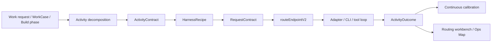

# Activity-Level AI Routing Harness Implementation Plan

> **For agentic workers:** REQUIRED: Use superpowers:subagent-driven-development (if subagents available) or superpowers:executing-plans to implement this plan. Steps use checkbox (`- [ ]`) syntax for tracking.

**Goal:** Evolve DPF from model-call routing to activity-level routing with model-specific harnesses, continuous evaluation, and operator-visible routing evidence.

**Architecture:** Add an Activity Package compiler above the existing router. Each package carries an `ActivityContract`, `HarnessRecipe`, compiled `RequestContract`, outcome evidence, and Workbench projection while `routeEndpointV2()` remains the only endpoint selector.

**Tech Stack:** Next.js 16, TypeScript, pnpm workspaces, Prisma/PostgreSQL route evidence, existing routing modules under `apps/web/lib/routing`, AI Operations Map projections/components, DPF MCP evidence tools.

---

| Field | Value |
| --- | --- |
| Backlog item | BI-BC0A0EB2 |
| Status | Draft implementation plan |
| Date | 2026-06-28 |
| Objective | Evolve DPF from model-call routing to activity-level routing with model-specific harnesses, continuous evaluation, and operator-visible routing evidence. |
| Design spec | [2026-06-28-activity-level-ai-routing-harness-design.md](../specs/2026-06-28-activity-level-ai-routing-harness-design.md) |

## 1. Executive Summary

The GLM/task-routing transcript changes the routing question from "which model is cheapest for this call?" to "which model plus harness is the right execution system for this activity?" DPF already has a strong call router: `RequestContract`, `TaskRequirement`, `ModelProfile`, `ExecutionRecipe`, cost-per-success ranking, fallback chains, `RouteDecisionLog`, and the AI Operations Map. The missing layer is an activity-level contract that decomposes larger work into smaller activities and binds each activity to the right harness recipe, context policy, token policy, and evaluation loop.

Recommended direction:



This is additive, not another router rewrite. The existing router remains the model-selection engine. The new layer decides the activity shape and harness before the existing router selects a model.

## 2. Why This Matters

The transcript's strategic point is that cheap capable models do not create savings by themselves. Savings come when the organization owns the last-mile harness: task decomposition, context assembly, prompt style, tool format, token budget, memory policy, and evaluation. Frontier providers are building sticky team harnesses because context ownership is the moat. DPF should make the company brain portable by making routing, context, and evidence first-class platform substrate.

For DPF, the payoff is especially high because the platform already has:

- A dynamic routing spine documented in `docs/superpowers/specs/2026-04-20-routing-architecture-current.md`.
- `RequestContract` posture overrides in `apps/web/lib/routing/request-contract.ts`.
- `ExecutionRecipe` and champion/challenger hooks in `apps/web/lib/routing/`.
- Runtime visibility through `RouteDecisionLog`, `AdapterRunTelemetry`, `TaskRun`, and AI Operations Map projection code.
- Work-pattern and work-case substrate that is already activity-aware enough to attach future routing behavior.

The next attempt should therefore avoid reworking the ranking math first. It should introduce the missing abstraction above it.

## 3. Parallel Activity Impact

### 3.1 Z.ai GLM Provider Integration

The Z.ai / GLM-5.2 work is no longer speculative. After integrating this branch with `origin/main`, the provider design, registry entries, known model profiles, Z.ai adapter registration, and OpenCode dispatch support are present in the shared source tree. Live GLM verification is still blocked by missing operator Z.ai API key / GLM Coding entitlement.

Routing implication:

- GLM-5.2 should not be treated as "frontier everywhere" just because provider setup and catalog metadata landed.
- The new activity router should let GLM win center-of-distribution activities such as summarization, extraction, first-pass UI copy, common coding patterns, doc synthesis, and routine code edits.
- Frontier or premium CLI models should still win edge activities: ambiguous architecture decisions, high-risk refactors, novel debugging, security-sensitive code review, and authority/escalation decisions.
- The first GLM routing proof should be an activity-harness fixture and later a live activity outcome, not a broad provider score bump.

Concrete dependency from the GLM line now on `origin/main`:

- Use provider ids `zai` and `zai-coding` as provider capabilities.
- Keep GLM harness confidence `provisional` until live activity samples exist.
- Treat account/key/entitlement absence as provider readiness state, not as activity-routing failure.
- Let `HarnessRecipe` decide when remote OpenCode GLM is appropriate; do not hand-pin Build Studio to GLM globally.

### 3.2 Governed Adaptive Playbooks / Work Case Line

The governed adaptive playbooks and Work Case line is now on `origin/main`, including trust-and-work-pattern review, case staging/resolution, receipt coverage, approve/defer/reject semantics, and portal drilldown.

Routing implication:

- A work pattern can become the source of an activity plan: repeated work gets decomposed the same way each time, then tuned.
- Shadow evaluation and trust graduation should include "which model + harness served this activity and how did it perform?"
- Work-case views should not expose raw router internals, but they should show a useful explanation when routing matters: local vs cloud, cheap vs frontier, why a step escalated, and what evidence changed the route.

Concrete dependency for the playbook/Work Case line:

- Use `TaskRun.routeContext`, work-pattern metadata, and activity outcome events as the bridge. Avoid adding a parallel workflow table unless the activity history cannot be expressed through existing `TaskRun`/`TaskNode`/telemetry rows.

### 3.3 Cross-Thread Contract

These two parallel lines should compose through Activity Packages:

| Producer/consumer | Must provide | Must not do |
| --- | --- | --- |
| Z.ai / GLM provider | Provider ids, model ids, account readiness state, OpenCode target capability, and live outcome blockers. | Promote GLM as the default model for all routing, or hide account entitlement failures inside generic route failures. |
| Activity router | Activity contracts, provisional GLM harness recipes, outcome join keys, and confidence override hooks. | Add a second endpoint router or duplicate provider capability truth. |
| Governed playbooks / Work Cases | Work-pattern identity, Work Case step ids, receipts, approval/defer/reject outcomes, and human acceptance signals. | Create a parallel activity history that cannot join to route decisions or adapter telemetry. |
| Operations Map Workbench | Activity sequence, decision explanation, outcome evidence, tuning state, and empty state when evidence has not arrived. | Present only provider topology and expect operators to infer task-level routing behavior. |

## 4. Current Gaps

| Gap | Current state | Consequence |
| --- | --- | --- |
| Activity taxonomy | `TaskRequirement` has broad task types such as `reasoning`, `code-gen`, `tool-action`; some email-specific types exist. | The router cannot distinguish "summarize transcript" from "derive architecture implications" inside one larger request. |
| Harness ownership | `ExecutionRecipe` configures provider settings, tool policy, and response policy. | Prompt/memory/context/tool-loop variants are not yet first-class per activity. |
| Visibility | AI Operations Map has routing topology and route decision markers; runtime health resolves Build Studio phases. | Operators see provider traffic, not the activity plan, harness choice, or "why this model for this step." |
| Evaluation loop | Model scoring convergence is moving toward `ModelProfile`; route logs and adapter telemetry exist. | Outcome feedback is not yet tied to activity class + harness recipe + model combination. |
| Token policy | `estimatedInputTokens`, context windows, and budget class exist. | No activity-level token envelope or model-specific context packing strategy. |

## 5. Architecture Decision

Add two first-class concepts above the existing router.

The practical technical unit is an **Activity Package**. It is assembled from the concepts below and audited through existing evidence rows:

```ts
type ActivityPackage = {
  activity: ActivityContract;
  harness: HarnessRecipe | null;
  requestContract: RequestContract;
  outcome?: ActivityOutcome;
};
```

Phase 1 keeps this as a typed boundary, not a new table. Persist only the durable evidence DPF already needs: route decision trace, adapter telemetry, Work Case receipts, and governed action proposals. Promote to storage later only if Work Case/activity query pressure proves the table is necessary.

### 5.1 ActivityContract

An `ActivityContract` describes one unit of work within a larger task:

```ts
type ActivityContract = {
  activityId: string;
  activityClass:
    | "classify"
    | "summarize"
    | "extract"
    | "synthesize"
    | "critique"
    | "plan"
    | "code-edit"
    | "tool-act"
    | "verify"
    | "handoff";
  distributionShape: "center" | "mixed" | "edge";
  riskClass: "low" | "medium" | "high" | "critical";
  successShape: "text" | "json" | "patch" | "decision" | "tool-result" | "evidence";
  contextPolicy: "minimal" | "retrieval" | "full-thread" | "work-case-packet";
  tokenEnvelope: {
    maxInputTokens: number;
    maxOutputTokens: number;
    compression: "none" | "summarize" | "cite-sources" | "strict-packet";
  };
  requestContractHints: Partial<RequestContract>;
};
```

It compiles into the existing `RequestContract` rather than replacing it.

### 5.2 HarnessRecipe

A `HarnessRecipe` describes how to run an activity for a provider/model family:

```ts
type HarnessRecipe = {
  activityClass: string;
  providerFamily?: string;
  modelFamily?: string;
  promptStrategy: string;
  memoryPolicy: string;
  toolPolicy: RoutedExecutionPlan["toolPolicy"];
  responsePolicy: RoutedExecutionPlan["responsePolicy"];
  contextAssembler: string;
  evaluator: string;
  activityConfidence: "provisional" | "calibrating" | "trusted" | "degraded";
};
```

Initial implementation should store this as structured JSON attached to `ExecutionRecipe.providerSettings` or a companion field if schema review proves that cleaner. Do not add a table in Phase 1 unless the existing recipe substrate cannot carry it.

### 5.3 ActivityOutcome

Every routed activity emits an outcome record that can be projected from existing telemetry:

- `TaskRun` / `TaskNode` identity when part of a larger workflow.
- `RouteDecisionLog` for endpoint choice.
- `AdapterRunTelemetry` for token, latency, adapter, and provider response.
- Optional evaluator result for schema validity, tool success, human correction, acceptance, or regression.

Phase 1 can model this as a derived read model. Persist a new table only if derived joins are too slow or cannot support retention.

## 6. Technical Approach

### 6.1 Compiler, Not Classifier

Build an `activity-router` module that compiles known workflow context into activity contracts:

- Build Studio phases: ideate, plan, design review, plan review, build, verify.
- Work case / work pattern activity: repeated operational playbooks.
- Coworker chat: fallback decomposer for compound requests.
- Provider onboarding/evaluation: model-test activities.

Prefer deterministic compilation first. Use an LLM decomposer only when the user gives an unstructured large request and the activity plan is ambiguous.

Deterministic compiler priorities:

1. Known workflow phases and Work Case steps.
2. Work-pattern replay from `TaskRun.a2aMetadata` / `repeatedPatternKey`.
3. Provider evaluation packs.
4. Compound user requests with obvious activities.
5. LLM-assisted decomposition only when no deterministic rule can produce a safe activity plan.

### 6.2 Keep `routeEndpointV2` as the Model Selector

Each `ActivityContract` becomes a `RouteAndCallOptions` / `RequestContract` input:

- Center-distribution + low risk -> `minimumTier: adequate|strong`, `budgetClass: minimize_cost|balanced`.
- Edge + high risk -> `minimumTier: frontier`, `budgetClass: quality_first`.
- Structured extraction -> `requiresStrictSchema`, structured-output floors.
- Tool action -> `requireTools`, tool-fidelity floors.
- Local/private -> `residencyPolicy: local_only` where the org or activity requires it.

### 6.3 Continuous Evaluation

Add an evaluation loop at `(activityClass, harnessRecipe, providerId, modelId)` granularity:

- Start with curated priors from model profiles and provider docs.
- Collect outcome signals: schema valid, tool success, user accepted, reviewer passed, task retried, human override, cost, latency, token compression rate.
- Promote or demote harness recipes using the existing champion/challenger pattern.
- Feed model capability deltas into `ModelProfile`, not provider-level score columns, consistent with the provider/model scoring convergence design.

### 6.4 Visibility Surface

The current routing topology map should become a "Routing Workbench" in layers:

1. **Activity Plan:** show the decomposed steps for a task or work case.
2. **Harness Choice:** show prompt/context/tool policy in operator language.
3. **Model Route:** show selected provider/model, alternatives, and exclusions.
4. **Outcome Evidence:** show tokens, cost, latency, success signal, and whether the result affected future routing.
5. **Continuous Tuning:** show activity confidence and active challengers.

This can extend the AI Operations Map rather than inventing a new standalone route. The map remains topology; the workbench adds an inspectable activity strip and decision drawer.

Visibility acceptance criteria:

- The Workbench renders even when no activity evidence exists yet.
- An operator can see the decomposed activity sequence before opening raw logs.
- Every activity shows selected provider/model, harness recipe, confidence, and why alternatives were excluded.
- Every observed activity shows cost/tokens/latency/success signal when evidence exists, and a clear "route-only" explanation when it does not.
- Every promotion/degradation recommendation is approval-backed, not silently applied.
- The Work Case rail can link or summarize the same evidence in product language.

## 7. Phased Implementation Plan

### Phase 0: Plan and Spec Hardening

Deliverables:

- This plan linked to `BI-BC0A0EB2`.
- Follow-on design spec: `docs/superpowers/specs/2026-06-28-activity-level-ai-routing-harness-design.md`.
- Architecture review pass against current routing, AI Operations Map, work-pattern, and GLM provider work.

Verification:

- Spec references existing files and rejects any duplicated router/table.
- GLM and governed-playbook branch owners can identify how their work should compose with this plan.

### Phase 1: Activity Contract Compiler

Deliverables:

- `apps/web/lib/routing/activity-contract.ts`
- `apps/web/lib/routing/activity-compiler.ts`
- Tests for Build Studio phase decomposition and a compound coworker request.
- No DB migration.

First slice status:

- Added pure `ActivityContract` and activity compiler modules for Build Studio phase decomposition.
- Added deterministic compound-request decomposition for transcript/review/refinement tasks, producing summarize -> critique -> plan -> code-edit -> verify -> handoff activity contracts when the request requires implementation.
- Added `routeContextFromActivity()` so activity posture compiles into the existing router demand-side hints.
- Refactored `phase-model-resolution.ts` so routed Build Studio phase previews now receive activity-derived route context before calling `previewRoute()`.
- Exported the activity API from `apps/web/lib/routing/index.ts`.
- Remaining in this phase: fuller removal of duplicated call-site samples/options where activity contracts can safely replace them without changing live dispatch semantics.

Refactoring allocation:

- Spend roughly 20% of this phase extracting duplicated Build Studio phase routing hints from `phase-model-resolution.ts` into a shared route-context compiler consumed by both the preview surface and activity compiler.

Verification:

- `pnpm --filter web exec vitest run apps/web/lib/routing/activity-contract.test.ts apps/web/lib/inference/phase-model-resolution.test.ts`
- Activity compiler output is deterministic for known phases.
- Existing `previewRoute()` behavior is unchanged.

### Phase 2: Harness Recipe Binding

Deliverables:

- Extend `RoutedExecutionPlan` construction to accept activity-derived harness metadata.
- Add recipe fixtures for center-distribution summarization/extraction and high-risk code-edit/review.
- Add provisional GLM harness recipes once `zai` / `zai-coding` lands.

First slice status:

- Added `apps/web/lib/routing/harness-recipe.ts` with typed `HarnessRecipe` definitions and `bindHarnessRecipeForActivity()`.
- Added center-distribution cheap structured recipes, high-risk frontier code-edit recipes, and provisional GLM/Z.ai activity recipes.
- Projected harness recipe key and confidence into `OperationsMapActivityStep`, and surfaced both in the Workbench panel.
- Extended `RoutedExecutionPlan` with `harness` metadata and added `attachHarnessRecipeToPlan()`.
- Updated `routeEndpointV2()` to bind an activity harness recipe onto the selected execution plan when callers supply an `ActivityContract`, using the winning provider/model as the binding hint.
- Threaded typed `activityContract` through `RouteAndCallOptions` so live route decisions can carry activity-level harness metadata.
- Added `activity-harness-audit.ts` and serialized selected harness metadata into the selected `RouteDecisionLog.candidateTrace` entry, avoiding a schema migration while preserving durable route evidence.
- Updated the routing topology projection so decision markers surface activity harness context in the visual routing tool.
- Remaining in this phase: connect persisted harness evidence to activity outcome evaluation and recipe trust graduation.

Refactoring allocation:

- Spend roughly 20% of this phase separating provider adapter selection from harness/prompt policy so `ExecutionRecipe` is not overloaded with unrelated concerns.

Verification:

- Existing execution-plan and champion/challenger tests pass.
- GLM recipe can be selected in dry-run when its provider/model profile satisfies the activity contract.
- No raw provider pin is introduced.

### Phase 3: Activity Outcome Read Model

Deliverables:

- Derived `ActivityOutcome` assembler from `TaskRun`, `RouteDecisionLog`, `AdapterRunTelemetry`, `RouteOutcome`, and evaluator results.
- Outcome DTOs for Ops Map / Routing Workbench.
- Model-profile calibration hook designed around `(activityClass, providerId, modelId)`.

Implementation note:

- Parse selected harness evidence from `RouteDecisionLog.candidateTrace` with `parseActivityHarnessAudit()` and join it with token usage / adapter telemetry before considering a dedicated table.

First slice status:

- Added `apps/web/lib/ai-operations-map/project-activity-outcomes.ts` as a pure derived read model over `RouteDecisionLog`, `TokenUsage`, and `RouteOutcome` source rows.
- Activity outcomes are emitted only when a route decision carries persisted harness evidence; the projection does not fabricate activity records from ordinary model calls.
- Token/cost and success fields use conservative best-effort joins and mark evidence as `linked` only when usage or route outcome evidence is present; otherwise the outcome remains `route-only`.
- Added a generic `evaluationSignals` input so review, evaluator, or human-acceptance sources can upgrade an outcome to `review-passed` / `accepted` and attach `qualitySignal` without coupling the router to one table.
- Wired derived outcomes into `projectBuildStudioActivityRouting()` so matching workbench steps show observed `routeDecisionId`, token total, cost, and success signal.
- Added `apps/web/lib/routing/activity-harness-calibration.ts`, a pure calibrator that groups outcomes by `(activityClass, harnessRecipeKey, providerId, modelId)` and recommends `observe`, `keep`, `promote`, or `degrade`.
- Calibration now treats evaluator quality as a trust floor, so high success counts with weak quality scores do not promote a provisional harness.
- Activity Workbench steps now surface calibration recommendation and rationale when enough observed outcomes exist.
- Added `apps/web/lib/routing/activity-harness-governance.ts`, a pure proposal builder that turns `promote` / `degrade` recommendations into approval-required action proposals.
- Activity Workbench steps now surface proposal summaries so operators can see when a harness change is recommended but not yet applied.
- Added an approved-action reducer that converts approved proposals into scoped confidence overrides for `(activityClass, harnessRecipeKey, providerId, modelId)`.
- Activity Workbench projections can apply approved confidence overrides and show the approval id beside the affected activity.
- Live `routeEndpointV2()` execution plans can now apply approved confidence overrides when the caller supplies them, so governed trust changes can affect the selected activity harness without a new router.
- Added `activity-harness-approval-source.ts`, a no-migration adapter from approved `AgentActionProposal` rows into activity harness confidence overrides.
- `loadOperationsMapData()` now loads approved activity-harness proposals and applies them to the Activity Workbench projection, making governed trust changes durable and visible.
- Live `routeAndCall()` now loads the same approved override source when an `ActivityContract` is present, while `previewRoute()` stays deterministic and does not query approvals.
- Added `proposeActivityHarnessOverrideAction()` so the Activity Workbench can queue deterministic `AgentActionProposal` rows through the existing governed action queue without a schema migration or a parallel approval path.
- Added shared `action-proposal-presentation.ts` formatting so attention items, Agent Cards, and the governance approvals API describe activity-harness proposals as routing-tuning decisions with activity, harness, provider, model, and target confidence labels.
- Added an `executeTool("activity_harness_confidence_override")` acknowledgement path so approvals from coworker-thread proposal controls complete successfully and remain consumable by the approved-override loader.
- Remaining in this phase: add canonical-runtime UX evidence for the full queue -> approve -> route override loop.

Refactoring allocation:

- Spend roughly 20% of this phase unifying route-decision and adapter-telemetry joins that are currently repeated across route logs, operation map projection, and coworker regression diagnostics.

Verification:

- Unit tests for outcome assembly with missing/partial telemetry.
- A route without `agentMessageId` still projects with a clear "router audit only" explanation.
- No calibration writes to dead provider score fields.

### Phase 4: Routing Workbench UI

Deliverables:

- Extend `apps/web/lib/ai-operations-map/` projection with activity-routing DTOs.
- Extend `AiOperationsMap` with an activity strip and decision drawer.
- Add a "Why this model?" inspection view for each activity.
- Use theme tokens, icons, symbol+label status grammar, and dense operational layout.

Refactoring allocation:

- Spend roughly 20% of this phase simplifying existing routing-topology rendering into smaller projection and view helpers before adding new UI.

Early visibility slice status:

- Added `OperationsMapActivityRouting` / `OperationsMapActivityStep` DTOs to the Operations Map data contract.
- Added `projectBuildStudioActivityRouting()` as a pure projection from Build Studio phase resolutions into activity steps.
- Wired `loadOperationsMapData()` to resolve Build Studio phase model selection and attach `routingTopology.activityRouting`.
- Added a compact `ActivityRoutingWorkbench` panel in `AiOperationsMap` that shows activity class, distribution/risk, selected provider/model, status, and "Why this model?" rationale.
- Added an activity flow rail ahead of the detail cards so operators can scan the decomposed model path, confidence, risk, provider, model, and harness before drilling into each activity.
- Added a selected activity decision drawer driven by the flow rail, concentrating decision rationale, outcome evidence, route ids, harness state, confidence, tuning, and excluded alternatives into one diagnostic panel.
- Extracted the workbench into `components/platform/ActivityRoutingWorkbench.tsx` so the activity-level routing UI and approval action are isolated from the broader provider/A2A topology map.
- Added an approval-queue button for calibration proposals, showing proposed confidence and local queue status while preserving the existing approval workflow as the control plane.

Verification:

- `pnpm --filter web exec vitest run apps/web/lib/ai-operations-map apps/web/components/platform/AiOperationsMap.test.tsx`
- Browser verification at `/platform/ai/operations-map` and `/platform/ai/runtime-health`.
- Desktop and mobile screenshots confirm no overlap and no raw router jargon in the default view.

### Phase 5: Continuous Evaluation and Tuning Loop

Deliverables:

- Activity-level evaluator contracts.
- Champion/challenger promotion criteria for harness recipes.
- Admin/operator controls for marking a recipe as trusted, degraded, or disabled.
- GLM-5.2 evaluation pack: center-distribution UI/code/doc tasks, edge tasks, tool-call tasks, and OpenCode tasks.

Refactoring allocation:

- Spend roughly 20% of this phase converging existing recipe performance, model-profile scoring, and route-outcome telemetry into one evaluation path.

Verification:

- Golden tests prove cheap/open models win safe center-distribution activities and frontier models win high-risk/edge activities.
- Live or shared local-CI evidence records at least one activity where an evaluated result changes future routing.
- Production build passes.

### Phase 6: Cross-Thread Pilot

Deliverables:

- GLM pilot pack with at least one center-distribution activity where `zai` or `zai-coding` is eligible as provisional challenger once credentials exist.
- Work Case pilot pack with at least one governed playbook step projected as an Activity Package and tied to receipt/acceptance evidence.
- Operations Map Workbench link or summary that can show both pilot classes side by side.
- Evidence record describing whether each activity was center/mixed/edge, what model/harness won, and why.

Refactoring allocation:

- Spend roughly 20% of this phase removing any pilot-only glue that duplicates Activity Package projection logic. Both pilots must use the same compiler/projection surface.

Verification:

- Source tests prove both pilots create Activity Packages through the shared compiler.
- GLM pilot remains skipped/blocked with a precise account-readiness message until Z.ai credentials exist.
- Governed playbook pilot joins Work Case receipt/acceptance evidence without new route tables.
- Browser verification shows the Workbench and Work Case-facing summary explain routing decisions without raw jargon in the default view.

First slice status:

- Added `apps/web/lib/routing/activity-package.ts` as the shared Activity Package boundary for cross-thread pilots.
- Added `buildGlmActivityPilotPackage()` for a center-distribution GLM summary pilot that binds a provisional Z.ai/GLM harness and carries `providerReadiness: "credential-gated"` until credentials/entitlement exist.
- Added `buildWorkCaseActivityPilotPackage()` for governed Work Case resolution, pulling `taskRunId`, `workCaseRef`, pattern key, transition key, and receipt policy from `WorkPatternMetadata`.
- Exported the package builders from `apps/web/lib/routing/index.ts`.
- Added `apps/web/lib/routing/activity-package.test.ts` to prove both pilots use the same activity + harness + route-context shape instead of one-off routing logic.
- Added `projectActivityPackagesRouting()` in `apps/web/lib/ai-operations-map/project-activity-routing.ts` so GLM and Work Case pilot packages project into the existing Activity Workbench DTO, including credential-gated exclusions and receipt-backed decision summaries.
- Wired `loadOperationsMapData()` to create live pilot packages from installed `zai`/`zai-coding` provider rows and parsed `TaskRun.a2aMetadata.workPattern` Work Case metadata. When Build Studio phase routing exists, package rows are appended to the same Activity Workbench route; otherwise package rows populate the Workbench directly.

## 8. Acceptance Criteria

- A compound work request can be decomposed into activity contracts and routed step-by-step.
- GLM-5.2 can be evaluated per activity once the provider branch lands, without hand-pinning the model globally.
- Work-case/playbook activities can reuse the same activity contract and outcome evidence model.
- Operators can inspect why a model was selected for an activity, what alternatives were excluded, and what the outcome cost/quality was.
- Continuous evaluation tunes activity+harness+model choices over time.
- No duplicate routing engine is introduced; `routeEndpointV2` remains the model selector.
- No provider-level capability scoring source is reintroduced.
- The visual routing tool is considered useful only when it explains the task/activity sequence, selected harness, excluded alternatives, outcome evidence, and future tuning effect.
- The two active parallel lines have explicit contracts: GLM supplies provisional provider capability and account-readiness state; governed Work Cases supply repeated activity and receipt/acceptance evidence.

## 9. Risks and Mitigations

| Risk | Mitigation |
| --- | --- |
| Another router rewrite | Keep `routeEndpointV2` as the only model selector; add a compiler above it. |
| Activity taxonomy fragments too quickly | Start with 10 activity classes and require evidence before adding more. |
| GLM is over-promoted from hype | Mark GLM activity confidence provisional until outcome samples exist. |
| UI becomes too technical | Default to activity-step language; keep raw route traces in an expandable operator drawer. |
| Evaluation loop writes the wrong source | Route model capability updates to `ModelProfile`; treat provider rollups as derived. |
| Token policy hides quality regressions | Every minimize-cost activity needs a success metric and challenger budget. |

## 10. Standards and External Grounding

- A2A frames agent collaboration around stateful tasks with lifecycle and artifacts, matching DPF's `TaskRun` direction: <https://a2a-protocol.org/latest/topics/life-of-a-task/>
- OpenTelemetry now keeps GenAI semantic conventions in a dedicated repository for GenAI spans, metrics, events, MCP, and provider-specific telemetry. DPF should align activity outcome telemetry with this naming direction rather than inventing opaque fields: <https://github.com/open-telemetry/semantic-conventions-genai>
- NIST AI RMF Core organizes trustworthy AI work around govern, map, measure, and manage. This plan maps routing policy to Govern, activity classification to Map, evaluator/outcome telemetry to Measure, and recipe promotion/demotion to Manage: <https://airc.nist.gov/airmf-resources/airmf/5-sec-core/>

## 11. Open Questions

1. Should `HarnessRecipe` live inside `ExecutionRecipe` JSON for Phase 1, or should a small companion table be introduced after schema audit?
2. Which work-case/playbook activity should be the first pilot: Build Studio feature build, issue triage, or governed playbook execution?
3. What is the minimum activity outcome signal before a recipe can move from provisional to calibrating?
4. Should the Routing Workbench live under AI Operations Map, Runtime Health, or a new tab that links both?
5. How much GLM live-account testing is required before GLM can win any production activity automatically?
