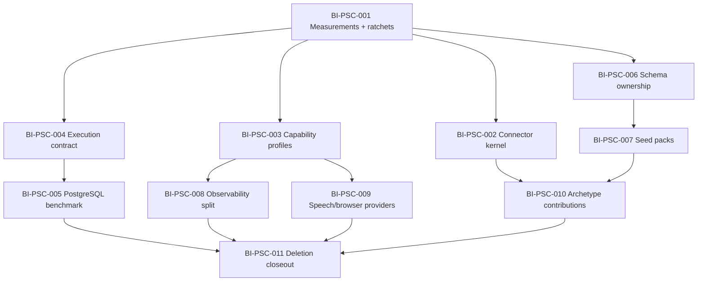

# Platform Substrate Convergence Implementation Roadmap

> **For agentic workers:** REQUIRED: Use superpowers:subagent-driven-development (if subagents available) or superpowers:executing-plans to implement this plan. Steps use checkbox (`- [ ]`) syntax for tracking.

**Goal:** Execute EP-PLATFORM-SUBSTRATE-CONVERGENCE as eleven independently testable, reviewable, and reversible backlog slices.

**Architecture:** PostgreSQL is the canonical platform data plane. Universal runtime stays minimal; specialist engines activate through capabilities and remain behind provider/executor contracts. This roadmap deliberately uses a separate detailed plan per subsystem so one PR never mixes unrelated runtime, connector, schema, UI, and deletion concerns.

**Tech Stack:** Next.js 16, TypeScript, Node.js, PostgreSQL 16 + pgvector, Prisma 7, Docker Compose, Vitest, Node test runner, Inngest/Redis during migration.

---

## Dependency map

## Delivery rules

- [ ] One backlog item, branch concern, and ready-for-review PR at a time.
- [ ] Write a detailed implementation plan for each BI before production edits.
- [ ] Use TDD for behavior, refactoring, guards, and scripts.
- [ ] Reserve at least 20% of each slice for boundary-strengthening refactoring directly serving the slice.
- [ ] Use source-local tests in the worktree and the leased `local-integration-ci` sandbox for runtime-bound gates.
- [ ] Record canonical execution evidence before closing each BI.
- [ ] Do not remove a runtime until BI-PSC-011 and the removal gates in the design spec are satisfied.

## Chunk 1: Evidence foundation

### BI-PSC-001 — Baseline topology and complexity budgets

Detailed plan: `docs/superpowers/plans/2026-07-17-platform-substrate-measurement-ratchets.md`

- [ ] Add a canonical substrate classification manifest.
- [ ] Add deterministic static measurements and ratchet comparison.
- [ ] Add test fixtures for regression, improvement, and classification failures.
- [ ] Add package commands and architecture documentation.
- [ ] Capture baseline; run source-local verification; route runtime measurements separately.
- [ ] Commit and push; open a ready PR after gates; pass `pnpm pr:health` and merge-queue review; capture the merged SHA and canonical evidence; only then close BI-PSC-001.

## Chunk 2: Platform seams

### BI-PSC-002 — Unified connector lifecycle

- [ ] Inventory current credential/auth/callback/health/audit/sync/setup paths.
- [ ] Write the connector-kernel detailed plan and primary-source standards review.
- [ ] Define pure manifest types and validation tests.
- [ ] Implement shared lifecycle services using existing IntegrationCredential and IntegrationToolCallLog authority.
- [ ] Migrate two contrasting providers: one OAuth authorization-code provider and one client-credential/API-key provider.
- [ ] Build shared setup-state and connection-health projection UI with theme tokens.
- [ ] Add a duplication ratchet preventing new provider-local lifecycle plumbing.
- [ ] Verify provider connect, refresh, audit, degraded, and disconnect paths.

### BI-PSC-003 — Capability-driven runtime profiles

- [ ] Inventory installer, Compose, health, backup, self-upgrade, and diagnostics service lists.
- [ ] Write the capability-profile detailed plan including platform-support watchlist impacts.
- [ ] Define one capability-to-service requirement manifest.
- [ ] Make Compose profiles, installer activation, health, and diagnostics consume the manifest or generated projections.
- [ ] Add Required, Optional inactive, Optional degraded, and External UI states.
- [ ] Verify default, build-enabled, speech-enabled, deep-observability, and recovery profiles.

## Chunk 3: Durable execution

### BI-PSC-004 — Executor containment

- [ ] Inventory all direct Inngest imports and classify domain versus composition-root use.
- [ ] Write the execution-contract detailed plan with parity matrix.
- [ ] Define contract tests for publish, schedule, idempotency, lease, retry, cancellation, progress, receipt, recovery, and quiescence.
- [ ] Add the Inngest adapter behind the contract.
- [ ] Migrate domain publishers and functions incrementally.
- [ ] Add a guard forbidding direct executor imports outside approved adapters/composition roots.
- [ ] Verify existing scheduled and event-driven workflows in the leased runtime.

### BI-PSC-005 — PostgreSQL runner benchmark

- [ ] Write a detailed benchmark/implementation plan based on BI-PSC-004 contract evidence.
- [ ] Model attempts, leases, schedules, and dead letters only after schema audit.
- [ ] Implement a PostgreSQL adapter behind the same contract.
- [ ] Prove crash recovery, concurrent claims, schedule accuracy, retries, cancellation, quiescence, and idempotency.
- [ ] Compare resource use and operational burden with Inngest+Redis and hybrid execution.
- [ ] Record a keep/replace/hybrid architecture decision; do not delete infrastructure here.

## Chunk 4: Data substrate

### BI-PSC-006 — Bounded-context Prisma ownership

- [ ] Audit all 494 models, shared kernels, relation fan-in, and migration tooling.
- [ ] Verify current Prisma multi-file schema behavior using official documentation and a throwaway validation branch/test fixture.
- [ ] Publish a model ownership registry and cross-domain relation rules.
- [ ] Split schema files mechanically without changing generated SQL.
- [ ] Prove migration checksum/history stability and generated-client parity.
- [ ] Add ownership and undocumented-cross-boundary guards.

### BI-PSC-007 — Seed packs

- [ ] Inventory seed modules, ordering, data volume, idempotency, and capability/archetype applicability.
- [ ] Write a detailed seed-pack plan before editing install paths.
- [ ] Define pack metadata, dependency ordering, checksums, and execution receipts.
- [ ] Separate invariants, reference catalogs, archetypes, demos, and optional corpora.
- [ ] Migrate packs incrementally while keeping the source seed entrypoint thin.
- [ ] Verify clean install, upgrade/reseed, archetype swap, optional capability, and no-wipe behavior.

## Chunk 5: Specialist engines

### BI-PSC-008 — Core/deep observability split

- [ ] Inventory portal health/alerts/receipts versus Prometheus/Loki/Alloy/exporter responsibilities.
- [ ] Define explicit core-health and deep-telemetry contracts.
- [ ] Move deep telemetry to an optional profile without changing core operator truth.
- [ ] Ensure PostgreSQL is not used for high-cardinality raw telemetry.
- [ ] Verify core-only and deep-observability installations and upgrade/backup behavior.

### BI-PSC-009 — Speech/browser provider contracts

- [ ] Inventory local, cloud, and browser execution call paths and readiness semantics.
- [ ] Define provider contracts for capability, health, activation, invocation, receipts, fallback, and resource cost.
- [ ] Adapt current local containers without changing behavior.
- [ ] Add lazy activation and capability-aware health.
- [ ] Verify absent, disabled, degraded, local, and external-provider paths.

## Chunk 6: Contributions and deletion

### BI-PSC-010 — Archetype contribution registry

- [ ] Inventory finance/storefront templates, activation, seed, navigation, applicability, and acceptance-test ownership.
- [ ] Define a narrow typed contribution contract; reject a general plugin framework.
- [ ] Migrate one archetype end to end.
- [ ] Extend parity tests and migrate remaining contributions.
- [ ] Merge or retain packages based on independent-distribution evidence.

### BI-PSC-011 — Evidence-approved closeout

- [ ] Re-run all BI-PSC-001 measurements and compare with the approved baseline.
- [ ] Apply only removal decisions approved by the execution and capability evidence.
- [ ] Verify migration, rollback, backup, restore, self-upgrade, health, and cross-platform contracts.
- [ ] Update deployment doctrine, install docs, platform-support watchlist, diagrams, and operator UX.
- [ ] Record execution evidence, close all completed/deferred BIs with rationale, and close the epic.

## Completion gate

- [ ] Every BI has a reviewed detailed plan, implementation PR, canonical evidence, and final backlog disposition.
- [ ] Universal default services and optional services are manifest-driven.
- [ ] No direct source-provider or executor plumbing remains outside approved adapters.
- [ ] One PostgreSQL authority remains; no substitute datastore is introduced.
- [ ] Before/after measurements prove net complexity reduction.
- [ ] All removal gates in the design spec pass.
