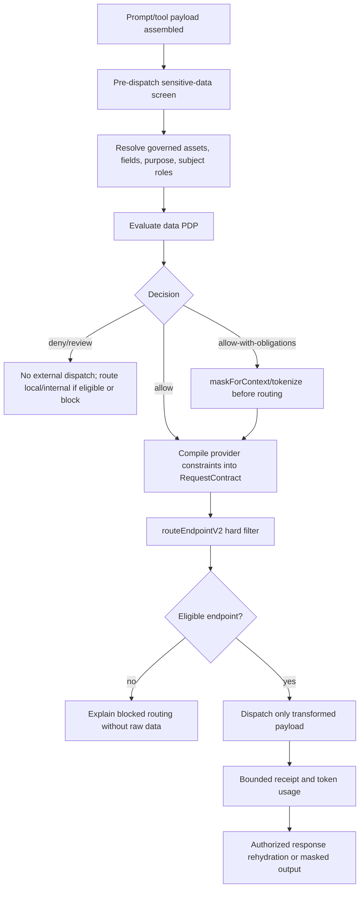

# Pre-Dispatch Sensitive LLM Routing Implementation Plan

> **For agentic workers:** REQUIRED: Use the DPF-native `dpf-tdd`, `dpf-local-merge-ci-before-push`, and `dpf-pr-with-dco` skills plus the per-BI completion gate. Steps use checkbox (`- [ ]`) syntax for tracking.

**Goal:** Prevent sensitive, confidential, regulated, employee, customer, financial, secret, or unknown governed data from leaving the install through an LLM call unless the data-governance PDP authorizes the purpose, the selected provider is eligible, and every required masking/tokenization obligation has been enforced before dispatch.

**Primary BI:** `BI-3D210AF8` - Pre-dispatch sensitive-data classifier for LLM routing and public-provider safe use

**Epic:** `EP-DATA-GOVERNANCE`

**Decision:** WWMD `DI-6CCA6320365F` selected the `dg-pep-mask-before-context` approach. The platform should add a governed inference PEP that screens and masks payloads before provider routing/dispatch, rather than relying on static provider trust setup or a local-only default.

**Tech Stack:** Next.js 16, TypeScript, Prisma 7/PostgreSQL, Vitest, existing DPF data-governance PDP/PEP modules, provider suitability compiler, `RequestContract`, `routeEndpointV2`, and OpenAI-compatible chat completions.

## Backlog Coverage

- Decision: `decomposed`
- Plan anchor: `BI-3D210AF8`
- Delivery graph:
  - `classifier-contract` -> `BI-3D210AF8`
  - `inference-pep` -> `BI-DG-012`, depends on `classifier-contract`
  - `mask-before-dispatch` -> `BI-DG-009`, depends on `classifier-contract` and `inference-pep`
  - `routing-binding` -> `BI-3D210AF8`, depends on `inference-pep` and `mask-before-dispatch`
  - `response-rehydration-authz` -> `BI-6A8B3910`, depends on `inference-pep`, `mask-before-dispatch`, and `BI-749EB750`
  - `employee-surface-authorization` -> `BI-62BFAA95`, depends on `inference-pep` and `mask-before-dispatch`
  - `vertical-policy-packs` -> `BI-F6018DB3`, depends on `classifier-contract` and `inference-pep`
  - `provider-onboarding-ux` -> `BI-ECBD6924`, depends on `classifier-contract` and `inference-pep`
- Receipt: `cms1za88b03pu01lheg0rg3ii`

## Grounding

This plan extends existing platform work rather than creating another router, PDP, or provider taxonomy:

| Existing substrate | Reuse decision |
| --- | --- |
| `apps/web/lib/govern/data/policy-decision.ts` | Use the pure PDP. An LLM call that sends governed prompt content to a cloud, router, CLI, or subscription-backed endpoint is evaluated as `DataAction="export"` to `DestinationClass="external-service"` unless the endpoint is local/in-process. |
| `apps/web/lib/govern/data/policy-enforcement.ts` | Add an inference dispatch PEP capability entry instead of encoding policy in provider UI copy. |
| `docs/superpowers/plans/2026-07-17-data-management-governance-plan.md` (`BI-DG-009`, `BI-DG-012`) | Reuse mask-before-context and PDP/PEP adapter contracts. This plan tightens their scope to include external LLM dispatch. |
| `docs/superpowers/specs/2026-07-19-ai-provider-suitability-routing-design.md` | Preserve the ownership ledger: data identity/classification/purpose/residency remain data-governance concerns; provider suitability compiles obligations into hard route constraints; `routeEndpointV2` remains the endpoint selector. |
| `apps/web/lib/routing/request-contract.ts` | Bind sensitivity, allowed providers, denied providers, residency, and provider obligations into the existing request contract. |
| `apps/web/lib/routing/pipeline-v2.ts` | Keep route filtering centralized in `getExclusionReasonV2()` / `routeEndpointV2`. Cost, latency, and Golden Triangle posture may optimize only inside the allowed set. |
| `apps/web/lib/inference/routed-inference.ts` | Insert the governed pre-dispatch screen in `prepareRoute()` / `routeAndCall()` before endpoint dispatch, with preview and live paths sharing the same evidence. |
| `apps/web/lib/routing/fallback.ts` and `apps/web/lib/routing/task-dispatcher.ts` | Treat fallback as part of the same governed dispatch. A fallback candidate cannot receive a payload unless it satisfies the same policy-derived contract. |

## Product Shape

The operator should not have to understand "regular account vs enterprise account" as a legal/compliance questionnaire before using the platform. Provider setup should capture facts the operator can answer and mark unknowns honestly; routing should then enforce the correct outcome per task:

- Low-risk public/internal work can use low-cost public or subscription-backed providers when provider facts permit it.
- Sensitive work can use an external provider only when the PDP authorizes the purpose and the provider account/contract/evidence satisfies the obligations.
- If sensitive details are not material to the answer, the platform can tokenize or mask them before dispatch and rehydrate only in an authorized surface.
- If exact sensitive details are material, masking is not a safe workaround; route to an eligible internal/local/enterprise endpoint or block with a useful explanation.
- HR and employee-record work must respect both LLM egress policy and viewer/action authorization. The model response must not rehydrate details for a person who could not see those details directly.

## Non-Goals

- Do not create a second data-classification model, provider suitability taxonomy, or route selector.
- Do not claim legal compliance. The UI can say allowed, blocked, needs evidence, or needs review.
- Do not solve provider contract procurement. The platform records evidence and enforces facts; it does not substitute for qualified review.
- Do not mask data when the sensitive value is necessary for correctness. For example, exact compensation, disciplinary facts, patient identifiers, account numbers, or secrets cannot be casually replaced and rehydrated if the task depends on the real value.
- Do not send raw prompts to route logs, receipts, vector memory, model previews, or exception messages.

## Architecture

### Dispatch Flow



### New Core Contract

Create a small in-process inference screen module, not a new router:

```ts
type InferenceDataScreenInput = {
  organizationId: string | null;
  taskType: string;
  messages: ChatMessage[];
  systemPrompt: string;
  tools?: Array<Record<string, unknown>>;
  activityContract?: ActivityContract;
  routeContext: {
    sensitivity: RouteSensitivity;
    allowedProviders?: string[];
    deniedProviders?: string[];
    residencyPolicy?: RequestContract["residencyPolicy"];
  };
  actor: {
    agentId?: string | null;
    userId?: string | null;
    roleIds?: string[];
  };
};

type InferenceDataScreenResult = {
  effect: "allow" | "allow-with-obligations" | "review" | "deny";
  transformedMessages: ChatMessage[];
  transformedSystemPrompt: string;
  transformedTools?: Array<Record<string, unknown>>;
  routeContext: {
    sensitivity: RouteSensitivity;
    allowedProviders?: string[];
    deniedProviders?: string[];
    residencyPolicy?: RequestContract["residencyPolicy"];
  };
  receipt: {
    screenId: string;
    decisionId: string;
    inputHash: string;
    classifiedDataClasses: string[];
    obligations: string[];
    transformation: "none" | "masked" | "tokenized" | "blocked";
    // Declared-vs-measured, so an over-broad route label is distinguishable
    // from a genuine payload finding. Levels only, never values.
    measuredSensitivity?: SensitivityLevel;
    declaredSensitivity?: SensitivityLevel;
    sensitivityFloorApplied?: boolean;
    rawPayloadStored: false;
  };
  rehydrationHandle?: string;
};
```

#### Reading the declared-vs-measured fields back (BI-CF3049E7)

Recording both levels only helps if something reconciles them. `apps/web/lib/inference/sensitivity-drift-rollup.ts` rolls receipts up into the groups whose declared label sits **above** what their payload measured, worst over-declaration first; `getSensitivityDriftRollup()` in `apps/web/lib/actions/route-decision-logs.ts` is the DB-backed accessor. Three properties are deliberate:

- **Drift is one-directional.** A payload measuring *above* its declared label is the screen working as intended (the floor only raises), so it is never reported as drift — reporting it would invite someone to lower a correct label.
- **Receipts predating these fields are held in their own bucket**, not counted as aligned. Treating unmeasured receipts as agreeing would report a clean estate that was never checked.
- **Levels only.** No payload text passes through the rollup, so it is as safe to surface as the receipts it reads.

Attribution is per **route**: `RouteDecisionLog.routeContext` records the route whose static context declared the level (migration `20260804120000_add_route_decision_log_route_context`), threaded from `agent-coworker` → the agentic loop's route options → `persistRouteDecision`. It is nullable — scheduled jobs and system tasks genuinely have no route, and rows predating the column cannot be backfilled because the route was never captured. Those group under `null` and are reported unattributed rather than dropped, since dropping them would understate drift. Route-first keying matters because one agent can serve several routes and only one may over-declare; merging them would average a real finding away. The measured case that motivated this: `/customer/marketing` declares `confidential` at `route-context-map.ts:351` while every assembled context tier measures `internal` with zero governed data classes, which left exactly one eligible endpoint (BI-8058697C).

The screen runs before `inferContract()` when possible so route previews match live dispatch, and it must also guard the final dispatch seam so no alternate caller can bypass it. The default insertion points are:

- `apps/web/lib/inference/routed-inference.ts`: screen before `inferContract()` / `prepareRoute()` output and attach the receipt to route evidence.
- `apps/web/lib/routing/fallback.ts`: require a screened payload or screen receipt when walking fallback candidates.
- `apps/web/lib/routing/task-dispatcher.ts`: align the older task dispatcher with the same receipt requirement or deprecate it behind the routed inference path.
- `apps/web/lib/inference/ai-inference.ts`: keep `callProvider()` as an adapter-level primitive, but do not make it the policy owner.

### Classification Inputs

The classifier combines deterministic detection and governed context. Deterministic detection catches obvious risk even when data assets have not been cataloged; governed context remains authoritative when present.

Initial data classes:

- `secrets-credentials`: API keys, bearer tokens, private keys, OAuth tokens, database URLs, MCP tokens, cloud credentials.
- `customer-records`: customer names, emails, phones, addresses, orders, support history, account identifiers.
- `employee-records`: employee identifiers, compensation, benefits, discipline, performance, leave, manager-only facts.
- `payments-finance`: bank/routing/account/card fragments, invoices, payroll, financial statements, tax identifiers.
- `health-phi`, `student-records`, `legal-privileged`, `public-sector-records`, `security-logs`, `regulated-decisioning`, `source-code`.
- `unknown-governed-data`: payloads connected to a governed asset/field where classification is missing, stale, or contradicted.

Detection should emit field spans and reasons, not raw values, into receipts.

### Decision Rules

- Unknown high-risk classification plus `external-service` remains `review` or `deny`.
- Restricted data cannot leave to an external service unless a policy explicitly authorizes it and every obligation is enforceable by the inference PEP.
- Provider suitability cannot loosen a PDP outcome. It can only narrow allowed providers, deny providers, require local-only routing, or add evidence/receipt obligations.
- Golden Triangle cost/quality/time posture applies after policy filtering.
- Fallback providers inherit the same transformed payload and constraints. Runtime failure cannot fall back to a cheaper but ineligible provider.
- Tool schemas and tool results are part of the prompt boundary. Tool arguments/results must be screened before they are passed to an external model or written to prompt/debug evidence.

### Masking And Rehydration

Use `maskForContext` from `BI-DG-009` as the canonical transform. The inference screen selects one of six transforms per field:

| Transform | Use when |
| --- | --- |
| `omit` | The field is not necessary for the task. |
| `redact` | The model only needs to know that sensitive data exists. |
| `partial` | A bounded non-sensitive fragment is enough, such as last four digits if authorized. |
| `tokenize` | The model needs a stable placeholder across the turn, and exact value rehydration is authorized later. |
| `aggregate` | The model needs patterns, counts, ranges, or cohorts rather than individual records. |
| `pass-through` | PDP authorizes the field, provider constraints are satisfied, and no safer transform preserves correctness. |

Token maps are sensitive derived data. Store them only in a short-lived, scoped, encrypted runtime artifact. Rehydrate responses only if:

- the original PDP decision is still fresh;
- the response is returning to the same authorized actor/surface/action;
- the token value maps to a field the actor could read directly;
- the response context has not crossed into a public/shared/employee-ineligible surface.

When those checks fail, keep the token or masked label in the answer and surface a plain-language blocked explanation.

## Delivery Plan

### Chunk 1: BI-3D210AF8 - Contract And Pre-Dispatch Classifier

**Files:**

- Create: `apps/web/lib/inference/data-screening/types.ts`
- Create: `apps/web/lib/inference/data-screening/classify-payload.ts`
- Create: `apps/web/lib/inference/data-screening/classify-payload.test.ts`
- Modify: `apps/web/lib/govern/data/taxonomy.ts`
- Modify: `apps/web/lib/govern/data/taxonomy.test.ts`
- Modify: `docs/user-guide/ai-workforce/model-routing-lifecycle.md`

- [x] Write failing tests for secrets, customer records, employee records, finance, source-code, mixed tool payloads, and unknown governed data.
- [x] Add an `inference-dispatch` `DataPepKind` if the architecture review confirms the closed enum should expand rather than reuse `coworker-context`.
- [x] Model the pre-dispatch receipt shape with hashes, data classes, and transformation status. Do not include raw values.
- [x] Add deterministic fixtures for common leaked-data shapes, including copied API keys, HR notes, finance fields, support transcripts, and source code with embedded credentials.
- [x] Update model-routing lifecycle docs so operators understand that provider setup facts guide routing, while the actual task payload is screened at dispatch time.

**Slice 1 progress:** `feat/sensitive-llm-data-screen` adds the pure classifier, safe receipt contract, and `inference-dispatch` PEP-kind taxonomy entry. PHI/student/public-sector/legal/security fixtures, PDP/PEP binding, and user-facing routing docs remain for the next slices.

**Verification:**

```powershell
pnpm --filter web exec vitest run lib/inference/data-screening/classify-payload.test.ts lib/govern/data/taxonomy.test.ts
git diff --check
```

### Chunk 2: BI-DG-012 - Inference PEP Adapter

**Files:**

- Modify: `apps/web/lib/govern/data/policy-enforcement.ts`
- Modify: `apps/web/lib/govern/data/policy-enforcement.test.ts`
- Create: `apps/web/lib/inference/data-screening/evaluate-inference-policy.ts`
- Create: `apps/web/lib/inference/data-screening/evaluate-inference-policy.test.ts`
- Modify: `apps/web/lib/govern/data/policy-decision.test.ts`

- [x] Add an inference dispatch PEP capability matrix that can enforce `mask`, `destination`, `log-use`, and `human-approval` only when a human-in-loop surface exists.
- [x] Evaluate screened prompt/tool payloads as `DataAction="export"` and `DestinationClass="external-service"` for cloud/router/subscription endpoints; local in-process endpoints stay `in-process`.
- [x] Fail closed when classification, purpose, authority, or provider destination is unknown for high-risk work.
- [x] Persist only decision IDs, hashes, versions, explanation codes, and obligations.
- [x] Add TOCTOU freshness checks before every provider dispatch attempt.
- [ ] Add TOCTOU freshness checks before response rehydration.

**Slice 2 progress:** `evaluateInferenceDispatchPolicy` now provides the pure inference PEP adapter over the existing PDP. It treats no-detected-governed-data payloads as eligible for normal routing, evaluates governed/sensitive external dispatch as `export` to `external-service`, denies restricted or unknown-governed external payloads by default, and refuses policies whose obligations exceed the `inference-dispatch` PEP matrix. RouteDecisionLog now persists the safe `inference-data-screen/v1` receipt beside the existing provider-suitability receipt, storing only receipt ids, hashes, classes, effects, explanation codes, obligations, destination, transformation status, and `rawPayloadStored=false`. TOCTOU revalidation remains next.

**Verification:**

```powershell
pnpm --filter web exec vitest run lib/govern/data/policy-enforcement.test.ts lib/govern/data/policy-decision.test.ts lib/inference/data-screening/evaluate-inference-policy.test.ts
git diff --check
```

### Chunk 3: BI-DG-009 - Mask-Before-Dispatch Transform

**Files:**

- Create/modify: `apps/web/lib/govern/data/mask-for-context.ts`
- Create/modify: `apps/web/lib/govern/data/mask-for-context.test.ts`
- Create: `apps/web/lib/inference/data-screening/screen-inference-payload.ts`
- Create: `apps/web/lib/inference/data-screening/screen-inference-payload.test.ts`
- Modify: `apps/web/lib/tak/tool-result-budget.ts`
- Modify: `apps/web/lib/inference/semantic-memory.ts`

- [x] Apply `omit`, `redact`, `partial`, `tokenize`, `aggregate`, and `pass-through` to nested messages, tool schemas, tool arguments, tool results, prompt blocks, and system prompt text.
- [x] Refuse masking when the exact sensitive detail is material to the task and no eligible endpoint exists.
- [x] Keep token maps out of route logs, memory, prompt previews, vector storage, and exception text.
- [x] Ensure output classification inherits from input classification and transformation state.
- [x] Add canary tests proving raw sensitive fixtures never reach prompt serialization, vector memory, tool-result return, or dispatch mocks.

**Slice 6 progress:** The canonical PDP now selects all six context transformations, and `maskForContext` recursively applies them before route inference or provider dispatch. Automatic masking is limited to replaceable detail; material or unknown exact-detail use fails closed. Token values live only in a bounded, five-minute in-memory vault and callers receive an opaque rehydration handle, so token maps never enter receipts, previews, logs, memory, vector storage, or exception text. The final screen preserves the source data classes and decision/version evidence alongside the applied transformation while routing on the transformed payload. Canary tests cover routed prompts, fallback dispatch, semantic/vector memory, and tool-result serialization. Rehydration remains blocked behind the actor, purpose, and surface authorization boundary in Chunk 5.

#### Design grounding

- Existing specs/plans reviewed: this plan and `docs/superpowers/plans/2026-07-17-data-management-governance-plan.md`.
- Current code substrate reviewed: `apps/web/lib/govern/data/policy-decision.ts`, `apps/web/lib/inference/data-screening/`, `apps/web/lib/tak/tool-result-budget.ts`, and `apps/web/lib/inference/semantic-memory.ts`.
- Source of truth: governance PDP decisions and the canonical `maskForContext` transform own masking authority; routing and provider adapters consume the screened contract.
- Decision: extend the existing PDP/PEP and model-facing serialization seams without adding policy logic to provider adapters, routing UI, or ad hoc redaction helpers.

**Verification:**

```powershell
pnpm --filter web exec vitest run lib/govern/data/mask-for-context.test.ts lib/inference/data-screening/screen-inference-payload.test.ts lib/tak/tool-result-budget.test.ts lib/inference/semantic-memory.test.ts
git diff --check
```

### Chunk 4: BI-3D210AF8 - Routing Binding And Fallback Enforcement

**Files:**

- Modify: `apps/web/lib/inference/routed-inference.ts`
- Modify: `apps/web/lib/inference/routed-inference.activity-overrides.test.ts`
- Modify: `apps/web/lib/routing/fallback.ts`
- Modify: `apps/web/lib/routing/fallback.test.ts`
- Modify: `apps/web/lib/routing/task-dispatcher.ts`
- Modify: `apps/web/lib/routing/task-dispatcher.test.ts`
- Modify: `apps/web/lib/routing/pipeline-v2.provider-policy.test.ts`

- [x] Run the screen before `inferContract()` so sensitivity, allowed/denied providers, and residency are compiled into the route preview and live route.
- [x] Re-run or validate the screen immediately before provider dispatch so direct fallback execution cannot bypass the PEP.
- [x] Intersect allowed providers and union denied providers with any provider suitability policy already compiled from the activity contract.
- [x] Prove `routeEndpointV2` excludes public/non-enterprise providers when the transformed payload still carries restricted data.
- [x] Prove fallback never sends a transformed payload to a provider that was not eligible for the original decision.
- [x] Surface blocked routing as a short, actionable explanation: what class of data blocked the route, what safer route is needed, and whether masking is possible.

**Slice 3 progress:** `screenInferencePayload` now builds a privacy-safe `inference-data-screen/v1` receipt from the classifier/PDP result and narrows preview/live `RequestContract` inputs before `inferContract()`. When external dispatch is denied or needs review and masking/tokenization is not yet available, the screen escalates sensitivity and applies `residencyPolicy="local_only"` so `routeEndpointV2` owns provider exclusion and fallback inherits the eligible candidate set. The receipt is attached to the in-memory `RouteDecision` and contains only hashes, classes, decision IDs, effect codes, obligation kinds, destination class, and transformation status. Remaining work: durable receipt persistence, final pre-dispatch TOCTOU validation, mask/token transform, direct fallback/legacy dispatcher receipt enforcement, and blocked-route UX copy.

**Slice 4 progress:** `fallback.ts` and the legacy `task-dispatcher.ts` now require an `inference-data-screen/v1` receipt for governed/sensitive dispatch and refuse to walk excluded fallback candidates when the screen applies. Local-only screen results tighten existing provider allowlists to locally routable provider ids before provider-suitability policy is applied, so allowlists intersect, denials union, and residency cannot loosen across the combined screen/suitability contract. Screen-blocked no-endpoint failures now produce a concise explanation from the safe receipt only: blocked data class, safer route, masking/tokenization status, and router detail without raw payload values. This closes the direct fallback bypass while keeping raw prompts, tool payloads, and detected values out of receipts. Remaining work: full hash/freshness TOCTOU validation and mask/token transform.

**Slice 5 progress:** The route-time receipt now carries only the PDP decision id plus its asset, classification, and authority versions. Routed inference retains the original screening input only in memory and re-screens the actual messages, system prompt, and tools immediately before every provider attempt. Any payload hash, policy outcome, obligation, destination, or decision-version drift fails closed and requires a new route. Tool-stripping reroutes create a new receipt for the transformed payload instead of replaying the original receipt. Response rehydration freshness remains coupled to the short-lived token-map and actor/surface authorization boundary in Chunk 5; there is no rehydration seam to guard before that slice exists.

**Verification:**

```powershell
pnpm --filter web exec vitest run lib/inference/routed-inference.activity-overrides.test.ts lib/routing/fallback.test.ts lib/routing/task-dispatcher.test.ts lib/routing/pipeline-v2.provider-policy.test.ts
git diff --check
```

### Chunk 5: BI-6A8B3910 / BI-749EB750 / BI-62BFAA95 - Human And Employee Visibility

**Files:**

- Modify: `apps/web/lib/actions/agent-coworker.ts`
- Modify: `apps/web/lib/actions/agent-coworker.test.ts`
- Modify: `apps/web/lib/tak/prompt-assembler.ts`
- Modify: `apps/web/lib/tak/prompt-assembler.test.ts`
- Modify: relevant employee/role authorization modules identified by `BI-749EB750` and `BI-62BFAA95`

- [ ] Bind rehydration to actor, role, manager/team relation, purpose, and surface.
- [ ] Add tests where a manager can receive a rehydrated employee detail and a peer/shared surface cannot.
- [ ] Add human-in-the-loop output states for `review` decisions raised inside sub-agent or tertiary-agent workflows.
- [ ] Ensure the human decision returns to the originating work item/call chain without broadening context for sibling agents.
- [ ] Keep AI coworker explanations concise and non-legalistic; they should state the decision and next action, not dump policy evidence.

**BI-749EB750 substrate progress:** The request auth context now has one
identity-owned loader for canonical principal/alias identity, public-only
fail-closed sensitivity clearance, direct and transitive indirect reports,
teams, customer/partner account scope, explicit authentication evidence, and
applicable delegation identifiers. Bearer and session requests consume the
same normalized contract, and manager authorization recognizes indirect
reports without granting peer or shared-team access. This enables the
rehydration PEP to make actor/relationship/surface decisions; it does not itself
rehydrate responses. The two rehydration tasks above and the separate
`BI-62BFAA95` HITL/call-chain tasks remain open.

**Verification:**

```powershell
pnpm --filter web exec vitest run lib/actions/agent-coworker.test.ts lib/tak/prompt-assembler.test.ts
git diff --check
```

### Chunk 6A: BI-F6018DB3 - Vertical Sensitive-Data Policy Packs

**Files:**

- Create/modify: vertical data-governance policy-pack modules identified by `BI-F6018DB3`
- Create/modify: executable allow, deny, review, and masking test vectors for each supported vertical
- Modify: policy-pack registry and governed setup documentation

- [ ] Encode healthcare, legal, financial-services, public-sector, and other regulated boundaries as versioned policy packs over the shared classifier/PDP/PEP substrate.
- [ ] Keep vertical vocabulary and obligations out of provider adapters and routing UI components.
- [ ] Cover allow, deny, review, unknown-context, precedence, and exception-expiry behavior for every pack.
- [ ] Document the evidence required before an external provider can satisfy each regulated boundary.

**Verification:**

```powershell
pnpm --filter web exec vitest run <affected-policy-pack-tests>
git diff --check
```

### Chunk 6B: BI-ECBD6924 - Setup, Onboarding, And Public Explanation

**Files:**

- Modify: `apps/web/app/admin/ai/providers/page.tsx` or successor provider setup route
- Modify: provider setup components identified by `BI-ECBD6924`
- Modify: `docs/user-guide/ai-workforce/model-routing-lifecycle.md`
- Modify: public/onboarding copy for the platform approach, if this plan touches those routes

- [ ] Reduce provider setup cognitive load by grouping questions into plain-language outcomes: "safe for public work", "safe for normal business work", "safe for sensitive work with evidence", "local/private only", "unknown".
- [ ] Replace the long "ask my coworker" explanation with a short policy outcome, reason chips, and a next action.
- [ ] Explain that account facts are not a one-time universal approval: task payloads are still screened dynamically.
- [ ] Show low-cost provider value without implying that cheap public models are safe for every task.
- [ ] Add public/onboarding explanation of DPF's approach: right model, right task, right data boundary, right human checkpoint.

**Verification:**

```powershell
pnpm --filter web exec vitest run <affected-provider-setup-tests>
pnpm --filter web build
git diff --check
```

## Refactoring Budget: 20%

Reserve approximately 20% of delivery capacity for targeted cleanup that reduces future regressions:

| Refactor | Budget |
| --- | ---: |
| Consolidate inference entry points so routed preview, routed dispatch, task dispatcher, and provider fallback share the same pre-dispatch screen contract. | 6% |
| Remove duplicate sensitive-data label logic encountered in provider setup or vertical overlays; route labels through data-governance taxonomy. | 4% |
| Standardize safe receipt projection across route logs, provider suitability receipts, tool evidence, and coworker explanations. | 4% |
| Tighten tests around no-raw-payload persistence and fallback eligibility so future agents cannot regress into static provider trust checks. | 4% |
| Simplify provider setup explanation components while preserving the enforcement facts the router needs. | 2% |

## Verification Gate

The implementation is not complete until:

- Targeted Vitest suites pass for classifier, PDP/PEP, masking, routed inference, fallback, task dispatcher, provider setup, and employee authorization.
- `pnpm --filter web build` passes for any UI/runtime change.
- `git diff --check` passes.
- UX verification covers provider setup, a low-risk public-provider route, a sensitive blocked route, a maskable sensitive route, and an HR authorization route.
- Route/evidence inspection confirms no raw prompt, token map, secret, customer detail, employee detail, or finance value is persisted in route logs, receipts, memory, vector storage, or exception text.
- If a schema change is required for receipts/token maps, its migration applies cleanly against existing data and includes the migration-safety rationale or backfill inline.

## Risks And Guardrails

- **False confidence from setup:** Provider account facts are facts, not approvals. Dynamic payload screening is mandatory.
- **Masking can harm correctness:** The system must block rather than anonymize when exact detail is material.
- **Fallback leaks:** Fallback must inherit transformed payload and policy constraints.
- **Token map leakage:** Rehydration maps are sensitive derived data and must never be logged or stored in ordinary artifacts.
- **Human-in-loop routing:** Review decisions inside sub-agent/call-chain work need a durable return path to the originating work item without dumping context into every agent.
- **UI overload:** Operators should see the policy outcome and next action first; detailed evidence belongs behind progressive disclosure.

## Open Questions For Build

- Should `inference-dispatch` be added to `DataPepKind`, or should `coworker-context` remain the PEP kind with an `external-service` destination? The plan prefers a new PEP kind because dispatch has different enforceable obligations than prompt assembly.
- Should token maps use an existing encrypted artifact store or require a narrow new model/table? Verify existing protected-data substrate before proposing schema.
- Which human-in-loop surface should own review decisions that originate in nested agent call chains: work item activity, coworker chat, queue branch, or all three via a common decision envelope?
- Which provider setup route is canonical after the cognitive-load cleanup? Verify current route ownership before editing UI.

## Amendment, 2026-08-23 — instruction provenance (BI-463BE12A, `DI-BF2FEDA18D81`)

The screener classified the assembled **system prompt** as payload, so a coworker
whose job description names payroll, invoices or salaries was routed at
`restricted` on every turn — which hard-denies every external provider. Measured
over seven days on the live install: coo 36/36, market-research-analyst 50/50,
admin-assistant 38/38, hr-specialist 33/33 and finance-agent 7/7, against 0/45
for platform-engineer. Five coworkers had never once reached a cloud provider.

Four independent channels turned out to clamp such a turn to local-only —
sensitivity clearance, the per-class export decision, the vertical policy packs,
and a mask obligation that clamps `residencyPolicy`. Narrowing the sensitivity
rule alone closes one of them.

The fix declares instruction provenance at the source: the prompt assembler and
the calling surface name the exact spans that are platform- or operator-authored
instruction, and **everything unlabelled is data**. Sensitivity, the PDP
summoning rule, the policy contexts and the vertical packs all key off the
data-evidenced set; the receipt continues to report every detected class.

Full design, the four-channel analysis, and the measured before/after:
[`2026-08-23-prompt-provenance-in-inference-screening.md`](2026-08-23-prompt-provenance-in-inference-screening.md).

`DI-0A58373E26D0` (2026-07-31) is not reopened. It rejected granting an external
provider `restricted` clearance, which remains rejected for the same two
commandments — "Outbound and irreversible actions require explicit go" and "Least
privilege, deny by default". Only the provenance question was revisited, on live
measurement that decision did not have.
