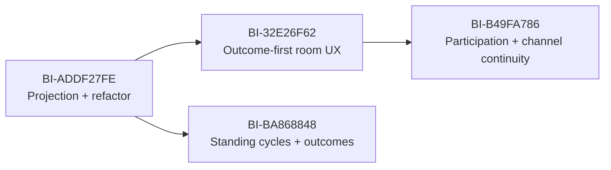

# Work Rooms Collaboration Implementation Plan

Date: 2026-07-26

Status: Review-hardened; ready for backlog-sequenced implementation

Umbrella backlog item: BI-29BF297B

Epic: EP-2984B02B

Design: `docs/superpowers/specs/2026-07-26-work-rooms-collaboration-design.md`

Work Capsule for design/plan: WC-7FA22391

> **For agentic workers:** execute this plan one independently reviewable backlog item at a time — one BI, one branch, one PR. Use `dpf-tdd` for red-green implementation, `dpf-local-merge-ci-before-push` plus the plan's completion gate before any success claim, and `dpf-pr-with-dco` for handoff.

## 1. Outcome

Converge the existing Workspace Work Case detail experience into an outcome-first Work Room where authorized people and AI coworkers collaborate within an explicit boundary, continuous activity is divided into bounded cycles, and each finite room or cycle produces a structured Outcome Packet.

Work Room remains a presentation/application projection. Work Case and its existing source records remain canonical.

## 2. Backlog coverage

Coverage decision: `decomposed`

Coverage receipt: `cms2qr10i0gfu01qq9vvc2x3e`

| Key | Backlog item | Deliverable | Depends on |
| --- | --- | --- | --- |
| projection-contract | BI-ADDF27FE | Work Room projection contract and Work Case convergence | — |
| workspace-room-ux | BI-32E26F62 | Outcome-first Work Room experience on Workspace Work Case detail | projection-contract |
| standing-cycles | BI-BA868848 | Standing Work Room cycles and structured Outcome Packets | projection-contract |
| participation-channels | BI-B49FA786 | Governed Work Room participation, access, and channel continuity | projection-contract, workspace-room-ux |

The four rows are independently reviewable and shippable. Documentation, tests, accessibility, and evidence belong inside each BI; they are not separate cleanup work.

BI-F309BB95 remains the cross-coworker scenario exercise. It is validation context, not a substitute for any implementation BI.

## 3. Sequence

The live coverage receipt records `participation-channels` as dependent on the projection and UX slices. Before implementing BI-B49FA786, revalidate whether standing-cycle outcome fields are also consumed; if yes, amend coverage to add that dependency rather than relying on the diagram alone.

## 4. Shared implementation rules

1. Start each BI from a freshly fetched `origin/main` in its own `D:/DPF-worktrees/<topic>` worktree.
2. Revalidate the plan coverage receipt before production source edits:

   - umbrella: `BI-29BF297B`
   - plan: `docs/superpowers/plans/2026-07-26-work-rooms-collaboration.md`
   - receipt: `cms2qr10i0gfu01qq9vvc2x3e`

3. Claim or create a Work Capsule anchored to the active BI and adopt the branch/worktree.
4. Run `dpf-tdd`: characterization/red test first, minimal implementation, then refactor.
5. Query the schema and current main before proposing any migration. A new persistent record requires a concrete invariant that projection cannot enforce.
6. Keep the route canonical at `/workspace/cases/[caseKey]`.
7. Use existing `--dpf-*` theme variables and report-kit/domain primitives.
8. Treat coworker-starting actions as governed actions with preview and confirmation.
9. Record docs impact in every PR. Update operator docs when the feature becomes user-visible.
10. Reserve at least 20 percent of effort in every slice for convergence/refactoring and name the removed duplication in the PR.
11. Keep `roomKey === caseKey`; do not introduce a second room keyspace or route family.
12. Keep `/portal/cases/[caseKey]` a customer-safe case digest. Internal participants, coworker collaboration, A2A diagnostics, and employee actions remain Workspace-only.
13. Phase 1 uses server loads, action-triggered revalidation, existing presence heartbeat, and optional soft refresh. A new realtime transport is not a prerequisite.

## 5. BI-ADDF27FE — Projection contract and Work Case convergence

### Deliverable

A tested `WorkRoomView` projection that provides presentation-ready room data from existing Work Case sources, while preserving current Work Case behavior.

### Expected files

- `apps/web/lib/work-management/case-types.ts`
- `apps/web/lib/work-management/case-read-model.ts`
- `apps/web/lib/work-management/workspace-case-loader.ts`
- new focused files under `apps/web/lib/work-management/`, likely:
  - `room-types.ts`
  - `room-read-model.ts`
  - `room-boundary.ts`
  - `room-activity.ts`
- corresponding `*.test.ts` files
- `apps/web/lib/canonical-primitives.ts` only if the new public presentation primitives must be registered

Do not create a separate `apps/web/lib/work-rooms/` stack unless the existing work-management folder is proven incoherent; the intended result is convergence.

### Red tests

- finite Work Case projects to a room with purpose, outcome, boundary, next action, and source attribution;
- `roomKey` equals the existing encoded `caseKey`;
- standing source projects to `mode: "standing"` from typed source-registry policy without a new DB enum;
- unknown sources default finite with lowered projection confidence; mode is never guessed from age, messages, or participant count;
- missing purpose/outcome/scope/participants/accountable owner/authority/sensitivity/context/measures/time/closure produces explicit boundary gaps;
- participant roles, current work state, and presence remain separate axes;
- every participant/activity/outcome field has a source reference;
- activity `eventId` remains stable through reprojection and duplicate source delivery;
- raw messages do not become decisions, artifacts, or outcome facts;
- closed cases remain terminal and sealed;
- existing Work Case summary/state tests remain unchanged or intentionally adapted.

### Implementation

1. Characterize current `buildWorkCaseDetail`, `loadWorkspaceWorkCaseDetail`, case-key encoding, attention, and source reference behavior.
2. Define pure room types. Keep mode, participant roles, activity kinds, and outcome states as projection unions.
3. Extend the source-registry projection contract with typed room-mode and packet-completeness policy; default unknown sources to finite with explicit low confidence.
4. Build boundary projection from source registry, WorkItem, policy envelope, accountability, and context references.
5. Add activity normalization for messages, capsules, TaskRuns, decisions, evidence, and receipts with stable source-derived event ids.
6. Produce presentation-ready labels separately from canonical statuses.
7. Extend the Workspace loader through composable query adapters; do not format raw Prisma rows in React.
8. Refactor duplicate source/status/evidence formatting discovered during steps 1-7.

### Verification

- focused Vitest for all affected `work-management` files;
- TypeScript typecheck for `web`;
- `git diff --check`;
- no Prisma migration;
- snapshot or exact-object assertions prove source attribution and boundary gaps.

### Refactoring budget

Target 25-30 percent:

- separate query/loading from projection;
- centralize source attribution and presentation metadata;
- preserve one Work Case/Room detail contract instead of parallel loaders.

### Rollback

Revert the room projection exports and keep the characterized Work Case loader. No data rollback is required.

### Implementation record (2026-07-27)

PR #3659 implements this slice through the existing `apps/web/lib/work-management/` substrate:

- `WorkRoomView` remains a typed projection over the canonical Work Case; its `roomKey` is the existing encoded `caseKey`;
- the existing source registry owns finite/standing mode and required Outcome Packet categories;
- boundary gaps, participant role/work/presence axes, explicit outcome facts, stable activity ids, source attribution, and terminal state are projected without new persistence or routes;
- the Workspace loader exposes the room projection while retaining its transitional Work Case detail adapter for the following UX slice;
- raw messages remain quiet activity and cannot become decisions, evidence, artifacts, or outcome facts by inference.

Evidence:

- TDD red: `cms3aw28j00mb01p5y0wnvfex`;
- canonical local-CI: `cms3blqtv01m901p58ul9cnbi` at `1691447c764bad7c28d8f4af572810e4be4f1a9e`;
- 2,266 test files and 19,653 tests passed, followed by web typecheck and the production Docker build;
- no schema, migration, route, provider, or dependency change was required.

## 6. BI-32E26F62 — Outcome-first Workspace Work Room UX

### Deliverable

The existing Work Case detail route becomes a Work Room experience that is understandable in the first viewport and remains usable across desktop and narrow layouts.

### Expected files

- `apps/web/components/workspace/WorkCaseDetailView.tsx` or its renamed/converged replacement
- focused components under `apps/web/components/workspace/work-room/`
- `apps/web/components/workspace/WorkItemCommentBox.tsx`
- `apps/web/app/(shell)/workspace/cases/[caseKey]/page.tsx`
- existing route/component tests
- `docs/user-guide/` page that owns Workspace/My Work terminology

### Red tests

- heading and back navigation use Work Room/My Work language;
- attention-lens entry copy uses "Open room" while preserving the existing case URL;
- first viewport exposes outcome, attention, accountability, participants, and next action;
- A2A status and raw source IDs are not primary-header content;
- empty room, incomplete boundary, unavailable source, and permission-denied states have honest outcomes;
- informational panel controls never send prompts;
- any coworker-starting action requires preview plus confirmation;
- consequential confirmation uses `confirmDialog` outside React transitions; native browser dialogs are absent;
- activity kinds render with distinct accessible labels.

### Implementation

1. Preserve the route and replace case-inspector composition with outcome-first composition.
2. Extract a compact `WorkRoomHeader` and boundary summary from the current monolithic detail view.
3. Add local page regions for Activity, Work, Context, Decisions, and Outcome using accessible disclosure or tabs only when the content warrants them.
4. Add a quiet participant summary that expands only for multi-participant work, handoff, pending ask, or access issue.
5. Move diagnostic source refs and A2A status behind disclosure.
6. Integrate the existing comment composer into the activity grammar rather than presenting it as an unrelated final card.
7. Implement all empty/failure/permission states from the design.
8. Update user-facing documentation and route terminology.
9. Use action-triggered revalidation and optional soft refresh; do not add SSE/WebSocket infrastructure in this slice.

### UX guardrails

- Owning area: Workspace.
- Route family: `/workspace/my-queue`, `/workspace/cases/[caseKey]`.
- Navigation change: local only.
- No new dashboard, global rail item, section tab family, or `/workspace/rooms` route.
- No hardcoded color; use theme variables.
- Compose report-kit for generic status/data display.
- Keep touch targets at least 44px where practical and preserve visible focus.

### UX fit review

- Decision: `fits-with-guardrails`.
- Governed comparison: `DI-3D4DAE04956D` recommended `outcome-first-existing-route` with usable, high-confidence signal and a 2.920 margin over the next option.
- Primary persona: founder, operator, or employee coordinating a bounded company outcome with people and AI coworkers.
- Navigation layer: local page navigation and contextual actions only; the canonical detail URL remains `/workspace/cases/[caseKey]`.
- Reuse and convergence: retain the Workspace Work Case loader and route, compose report-kit status and notice primitives, and extract focused room components from the existing monolithic detail view.
- Source truth: `WorkspaceWorkCaseDetailView.room` is the visible collaboration contract. The legacy summary remains compatibility data, not a second room model.
- First viewport: name the outcome, attention reason, accountable participant, participant group, and next action before activity or diagnostics.
- Empty/failure behavior: distinguish an incomplete boundary from an unavailable source. Each state explains what is known and gives one safe next action; permission denial remains a non-disclosing route-level not-found response.
- AI boundary: informational disclosure controls do not send prompts. This slice adds no coworker-starting action; any future launcher must preview context and require explicit confirmation.
- Mental model: use **My Work**, **Work Room**, **Activity**, **Outcome**, and **Room details** in user-facing copy. Preserve **Work Case** only in implementation and technical documentation where the underlying governed record matters.
- Evidence before merge: focused component tests, source-unavailable and incomplete-boundary fixtures, permission non-disclosure regression, theme scan, production build, and desktop/narrow keyboard-accessible browser exercise.
- Captured in: this implementation plan, BI-32E26F62.

### Verification

- focused route/component Vitest;
- web typecheck and production build;
- live route exercise using the governed nonproduction lease;
- desktop and narrow viewport evidence;
- keyboard-only traversal and screen-reader name/landmark check;
- no horizontal overflow or overlap;
- permission-denied fixture proves no metadata leak;
- unavailable-source and unavailable-coworker fixtures show one next action;
- `/portal/cases/[caseKey]` regression proves no internal Work Room chrome appears;
- `rg`/lint scan for hardcoded colors in changed UI.

### Refactoring budget

Target 20-25 percent:

- split the monolithic detail component by responsibility;
- remove duplicated card/status/source formatting;
- converge comment/activity presentation.

### Rollback

The route continues to use the same loader. Revert the component composition to the prior `WorkCaseDetailView`; no data migration or route redirect rollback is required.

### Design grounding

- **Existing specs and plans reviewed:** this plan and its companion Work Rooms collaboration design, the Work Management architecture design, and the Work Case Wave 3 operator-surfaces plan.
- **Current code substrate reviewed:** `workspace-case-loader`, `WorkCaseDetailView`, `WorkCaseAttentionLens`, `WorkItemCommentBox`, and report-kit status/empty-state primitives.
- **Source of truth:** `WorkRoomView` remains a typed projection over the governed Work Case and its existing policy, activity, participant, action, and receipt seams.
- **Decision:** keep `/workspace/cases/[caseKey]` as the canonical route, replace inspector composition with outcome-first room composition, reuse report-kit and theme tokens, keep diagnostics behind disclosure, and introduce neither a second work model nor a new navigation family.

### Implementation record (updated 2026-08-01)

- Preserved `/workspace/cases/[caseKey]` and composed the existing room projection into an outcome-first `WorkRoomHeader` and `WorkRoomBody`.
- Put outcome, attention, accountability, participant summary, and next action ahead of activity; moved A2A/source diagnostics under **Room details**.
- Integrated the existing update composer into Activity and kept informational disclosure controls prompt-free.
- Added honest incomplete-boundary, unavailable-source, missing-projection, permission non-disclosure, customer-portal segregation, and unavailable-AI-coworker states. A coworker availability issue opens the participant disclosure and gives one safe continuation path.
- Refactoring accounted for at least 25 percent of the slice: the monolithic detail component was split by responsibility, repeated room status intent moved into report-kit, and comment/activity presentation converged.
- Current source evidence: 7 affected test files / 40 tests pass; scoped route generation, web typecheck, secret scan, and DCO hooks pass.
- Final exact merged-tree evidence `cmsa2vs0701hx01qqc4vq7ygb` covers the complete candidate at `e3cec3ef8618eb32a2f7a0fd8c024ddd02f444ed` against accepted base `af398e985a30f9a7507d3ab7802fbe7d7f97c5c8`: migrations, documentation guards, typecheck, the full Vitest suite, and the production Docker/Next build passed.
- Governed UX evidence `cms9zqzjx0doq01r2mknr75li` and `cms9vep3v00bs01r2e0vno56z` covers authenticated desktop and 390px narrow layouts, first-viewport outcome priority, no horizontal overflow, long-purpose disclosure, and the Activity/Context/details interactions. Interactive disclosures use native `details`/`summary`; browser focusability and component semantics are verified, while the harness's synthetic Enter/Space limitation is explicitly recorded rather than presented as a product failure.

## 7. BI-BA868848 — Standing cycles and Outcome Packets

### Deliverable

Finite and standing Work Rooms share one contract, standing work has explicit bounded cycles, and every completed room/cycle produces a reconstructable structured Outcome Packet.

### Expected files

- new pure helpers under `apps/web/lib/work-management/`, likely:
  - `room-cycle.ts`
  - `outcome-packet.ts`
- `apps/web/lib/work-management/action-registry.ts`
- `apps/web/lib/work-management/policy-envelope.ts`
- `apps/web/lib/work-management/receipt-envelope.ts`
- source registry adapters and tests
- Workspace room outcome/cycle components
- Prisma schema/migration only if the invariant gate in this section passes

### Invariant gate before persistence

Projection remains the default. Before adding a table or column, document which of these cannot be guaranteed:

- one active cycle per standing room;
- terminal sealing;
- deterministic ordering;
- immutable completion packet;
- retention independent of source records;
- cross-source reconstruction within the required latency.

If an invariant fails:

1. prefer an existing canonical artifact/activity/evidence seam;
2. otherwise write an architecture decision and fleet-safe expand/backfill/contract plan;
3. run schema audit and migration safety review;
4. add the minimum typed persistence needed for the failed invariant only.

### Red tests

- finite room can complete without a recurring cycle;
- standing room cannot be "active" without a current cycle or explicit healthy-idle state;
- cycle requires trigger, objective, accountable principal, stop condition, measure, and scoped context;
- completing a cycle emits an Outcome Packet;
- source-registry packet policy determines required categories; non-required categories may remain empty;
- unresolved work requires carry-over, new case, defer, or accepted disposition;
- renewal, split, and archive are governed receipt-emitting actions;
- closed cycles reject consequential writes;
- raw chat cannot satisfy packet decision/artifact/evidence fields.

### Implementation

1. Define cycle and outcome projection types.
2. Add source-registry rules that select child WorkItem, WorkCapsule, or TaskRun as the cycle carrier.
3. Record and test a per-source precedence table for cases where multiple carrier types exist.
4. Add boundary validation for standing charter and current cycle.
5. Normalize decisions, artifacts, actions, evidence, and receipts into the packet.
6. Register cycle/renew/split/archive behavior through the existing governed action path.
7. Render current-cycle status and completed packets in the room.
8. Add carry-over creation/attachment behavior with idempotency.
9. Run the persistence invariant gate and record its result in the PR.

### Verification

- focused Vitest for lifecycle, policy denial, receipt, idempotency, and packet reconstruction;
- web typecheck and production build;
- if migration exists: fleet-safe migration guard plus clean/dirty data apply evidence;
- live finite-room close exercise;
- live standing-room cycle open → work → verify → close → carry-over/renew exercise;
- reload proves the packet reconstructs identically.

### Refactoring budget

Target at least 20 percent:

- converge action and receipt mappings;
- remove any duplicate terminal-state or evidence-normalization logic;
- keep cycle behavior source-adapter-driven.

### Rollback

If projection-only, revert action/projection/UI changes. If persistence is introduced, use an expand-first nullable shape so code can stop writing it without destructive rollback.

## 8. BI-B49FA786 — Participation, access, and channel continuity

### Deliverable

The room shows governed human and AI participation, enforces discovery/content/action boundaries, and maintains one canonical context across DPF and external communication channels.

### Expected files

- `apps/web/lib/tak/conversation-participants-core.ts`
- `apps/web/lib/tak/conversation-participants.ts`
- `apps/web/lib/actions/conversation-participants-action.ts`
- Work Room participant adapters under `apps/web/lib/work-management/`
- `apps/web/lib/communications/` adapter/session/dispatcher files
- `apps/web/lib/portal-context/` resolver/presenter files where room anchoring belongs
- Workspace participant/activity components
- authorization and route tests
- employee communication documentation where contract behavior changes

### Red tests

- unauthorized principal receives not-found/non-discoverable behavior;
- discover-only policy returns only explicitly allowed redacted metadata;
- presence never expands authority;
- AI participant includes identity, sponsor, reason, current work, and authority summary;
- secondary coworker activity appears automatically from thread/TaskRun lineage; no human summon picker;
- inbound channel event resolves PrincipalAlias and canonical room context;
- unresolved identity is quarantined;
- duplicate webhook/event delivery reuses the stable event/delivery id and does not duplicate room activity or action;
- sensitive action enters auth-required/step-up and cannot complete from a delivery receipt;
- provider unsupported/degraded state leaves the DPF room usable.

### Implementation

1. Extend the participant projection to accept WorkItem assignment/presence and room policy context.
2. Resolve participant identity through Principal/PrincipalAlias and AI sponsorship through `sponsorPrincipalId`.
3. Add server-side discover/content/action authorization before room loading.
4. Add participant rail/panel presentation with quiet defaults and accessible states.
5. Add canonical Work Case/room references to communication-session projection using existing fields/structured metadata before proposing schema.
6. Normalize inbound/outbound channel events into room activity and receipts.
7. Add DPF deep links and concise channel-safe summaries.
8. Enforce sensitivity, capability flags, step-up, idempotency, and provider degradation.
9. Keep Teams/Slack provider feature work out of this BI; file or reuse Employee Communication Fabric items for adapter-specific expansion.
10. Preserve `/portal/cases/[caseKey]` as a constrained external digest; participant and channel-continuity UI remains on the Workspace room.

### Verification

- focused participant, authority, communication-adapter, and route tests;
- web typecheck and production build;
- live two-human plus two-coworker room exercise;
- principal with no access cannot discover the room;
- presence timeout changes active state without changing access;
- simulated inbound channel event attaches once to the correct room;
- degraded adapter and auth-required flows show honest recovery;
- desktop/narrow/keyboard/accessibility evidence for participant disclosure.

### Refactoring budget

Target 20-25 percent:

- converge WorkItem presence and conversation participant projections;
- centralize room/channel attachment and activity normalization;
- avoid provider-specific participant or authorization code.

### Rollback

Disable room participant/channel projection while retaining existing WorkItem presence and communication fabric behavior. Provider adapters remain independently operational.

## 9. Cross-slice completion gate

The umbrella is not complete until:

1. All four mapped BIs are done through separate PRs.
2. Coverage receipt revalidation succeeds.
3. All affected focused tests pass.
4. `pnpm --filter web build` passes on merged code in the governed shared sandbox.
5. No migration is present, or every migration has fleet-safe apply evidence.
6. Live UX exercises cover:

   - finite room;
   - standing room with two cycles;
   - two humans and multiple AI coworkers;
   - pending decision and auth-required pause;
   - denied participant;
   - unavailable source/coworker/channel;
   - desktop and narrow viewport;
   - keyboard navigation.

7. The Outcome Packet survives reload and is reconstructable from canonical sources.
8. External channel interaction attaches to one room and remains idempotent.
9. Changed user, architecture, and operator documentation is current.
10. Each PR records its refactor percentage and the duplication or leaky abstraction removed; aggregate refactor effort is at least 20 percent.
11. `pnpm pr:health <number>` reports terminal passing checks, no conflicts, and no unresolved review threads for every PR.
12. `roomKey === caseKey`, portal case routes remain customer-safe digests, and phase 1 passes without a new realtime transport.

## 10. Risks

| Risk | Early signal | Response |
| --- | --- | --- |
| Projection query becomes too broad | route latency/query count increases | add bounded query adapters, pagination, typed partial-state signals |
| Room types duplicate Work Case types | identical fields/status maps appear twice | make room types compose Work Case types and central presenters |
| Standing cycle needs persistence | reconstruction cannot enforce one active cycle or terminal sealing | execute the invariant gate; add minimum expand-first persistence only |
| Participant panel leaks identity | denied fixture reveals title/count/name | authorize before load and test non-discoverability |
| External adapter scope expands | Teams/Slack provider code appears in room PR | stop and route provider capability to EP-COMM-FABRIC |
| UX becomes dashboard-like | first viewport accumulates cards/KPIs | return to four first-viewport questions; move diagnostics behind disclosure |
| Conversation is mistaken for outcome | close action succeeds without packet | make packet completeness a governed completion precondition |

## 11. Documentation impact

- Design and plan: this branch.
- User guide: update with the first visible Work Room UI slice.
- Architecture docs: update Work Case/communication diagrams when room projection and channel attachment ship.
- Public pre-install positioning: only if Work Rooms become a marketed capability.
- AGENTS.md/kernel: no change required by this design; it follows existing one-model, principal-convergence, research, and structured-handoff principles.

## 12. Handoff

Start with BI-ADDF27FE. Do not implement the visual shell against the current thin detail loader first; the projection/refactor slice is the contract that prevents the UI from inventing state. After that slice merges, BI-32E26F62 and BI-BA868848 may proceed in parallel worktrees. BI-B49FA786 follows the merged room shell and revalidates whether the standing-cycle contract is also a hard dependency.
