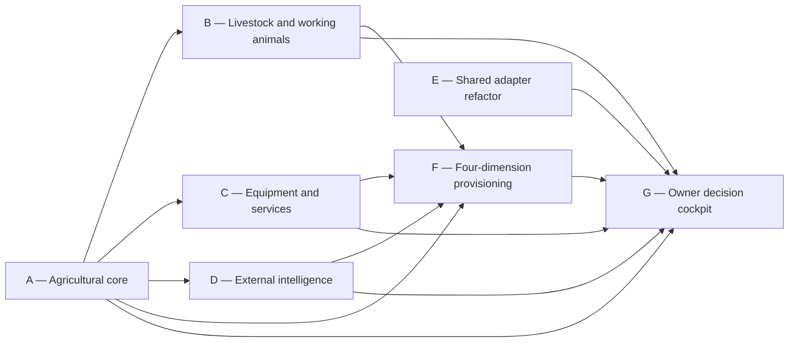

# Agriculture and Ranching Archetype — Implementation Plan

**Status:** proposed
**Date:** 2026-08-01
**Epic:** `EP-7015CB99`
**Umbrella:** `BI-1A2F61F9`
**Branch:** `doc/agriculture-ranching-archetype`
**Spec:** `docs/superpowers/specs/2026-08-01-agriculture-ranching-archetype-design.md`
**Decision:** `DI-2DC225DEF0FF`
**Backlog coverage receipt:** `cmsakhc6907ae01qkmxuosfg7` — decomposed; seven live mappings validated

## Outcome

Deliver a complete `agriculture-ranching` category whose first three leaves help mixed-farm, crop/hay, and cattle-ranch owners operate land, plants, animals, equipment, supplies, vendors, services, compliance, weather, and market attention from one source-attributed, map-led decision cockpit.

This is a decomposition plan for an xlarge umbrella. No implementation begins from the umbrella item. Each independently shippable phase has its own live backlog item.

## Delivery graph

| Key | Backlog item | Deliverable | Depends on |
| --- | --- | --- | --- |
| A | `BI-5813396F` | typed agricultural land, crop, and work-record substrate | — |
| B | `BI-D10BF162` | livestock and working-animal operations | A |
| C | `BI-7550A14E` | equipment, implements, materials, dealer, and outside-service operations | A |
| D | `BI-04021919` | source-attributed weather, market, and regulatory intelligence | A |
| E | `BI-4EDDA6B5` | common scene and operational read-model adapter refactor | — |
| F | `BI-78C5A164` | category, leaves, WSID corpus, coworker, and starter skills | A, B, C, D |
| G | `BI-0077303A` | map-led owner decision cockpit and acceptance fixtures | A, B, C, D, E, F |

Phases B, C, D, and E may proceed in parallel after A's stable contracts are merged. F validates the category against real capabilities instead of seeding a shallow label. G is the integrated release proof.

## Phase A — typed agricultural core (`BI-5813396F`)

1. Audit the latest Prisma schema and committed work since this design, including shared resource/capacity and spatial-scene changes.
2. Write a schema impact note naming the canonical owner for every proposed field and relation.
3. Design strongly typed land-unit, production-plan/stand, agricultural-activity, participant, observation, location, and evidence contracts. Use enums for every closed axis.
4. Map DPF terms to ADAPT concepts in an adapter/reference module; do not make ADAPT the transactional schema.
5. Add forward-only migration SQL with inline backfill/default handling for any required organization links.
6. Implement repositories/actions scoped by organization and real authorization. Reuse `WorkItem`, `CalendarEvent`, evidence, and field-operations primitives.
7. Add representative mixed-farm fixtures, including multiple properties/fields/pastures and a hay/crop plan with planned and actual activities.
8. Add unit, repository, authorization, migration, and organization-isolation tests.

Exit: one typed agricultural operating-record spine exists without a universal JSON asset blob or duplicate task/calendar system.

## Phase B — livestock and working animals (`BI-D10BF162`)

1. Add typed animal, managed-group, group-membership/movement, health/care, breeding, treatment, vaccination, withdrawal/hold, and work/availability contracts.
2. Preserve dated history for movement and group membership.
3. Model a working horse as an animal under care with workload/availability, never as a person or machine.
4. Link veterinarian/farrier/service providers through `Supplier`; schedule required humans through shared work/staffing primitives.
5. Put veterinary and treatment proposals behind the regulatory autonomy ceiling and explicit approval envelopes.
6. Add cattle-herd, individual-cow, and working-horse fixtures and tests for individual/group transitions, due care, provider appointments, and human-helper conflicts.

Exit: cattle and working horses are operationally useful, historically correct, and safely distinct from shelter animals, employees, and equipment.

## Phase C — equipment, materials, vendors, and services (`BI-7550A14E`)

1. Add typed operational records for equipment, implements/attachments, compatibility, location, meter readings, maintenance plans/events, readiness, and downtime.
2. Add agricultural material/lot and stock-signal contracts only after verifying the existing inventory/procurement substrate; do not reuse IT `InventoryEntity`.
3. Link finance through optional `FixedAsset` references and purchasing/service parties through `Supplier`, contracts, purchase orders, and invoices.
4. Implement outside-service coordination for hay cutting, pest services, veterinary/farrier work, and dealer maintenance: request/draft, prerequisites, quote/terms, scheduled presence, completion evidence, and reconciliation.
5. Define ADAPT/ISO 11783 provider ports and fixtures while deferring machine command and deep telemetry.
6. Test meter-based and calendar-based maintenance, implement compatibility, low-stock attention, external-service misses, and cross-organization isolation.

Exit: the operator can see whether the right machine, implement, material, dealer, and contractor are ready for planned work.

## Phase D — external intelligence (`BI-04021919`)

1. Run the external-tool evaluation pipeline for each provider before adoption.
2. Define a common source envelope: provider, source URL/id, jurisdiction, published/observed/as-of time, horizon, confidence/limitation, freshness, and affected operation records.
3. Add replaceable ports and recorded fixtures for NWS, NOAA CPC, USDA NASS, USDA AMS, EPA, and APHIS. Tests must not depend on live external availability.
4. Normalize weather observations/forecasts/alerts/outlooks, market observations/outlooks, and regulatory/applicability evidence into distinct typed signal kinds.
5. Route regulations into existing `Regulation`/`Obligation`/`Control`/licensing owners; do not create an agriculture-only compliance engine.
6. Add stale, unavailable, ambiguous-jurisdiction, conflicting-source, and stricter-local-rule states.
7. Prove that no adapter output becomes an autonomous pesticide, veterinary, legal, or sell decision.

Exit: planning can consume honest official evidence with visible provenance and uncertainty.

## Phase E — shared adapter refactor (`BI-4EDDA6B5`)

This phase is the deliberate approximately 20% refactoring allocation.

1. Characterize current `scene-entity-resolver` behavior for `care-resource`, `rentable-unit`, `customer-site`, `infra-ci`, and `table`.
2. Replace the closed loader branch with a typed descriptor/loader registry that refuses duplicate registrations, enforces organization scope, and returns unsupported/degraded explicitly.
3. Extend the typed capacity/operations mirror adapter seam for agricultural authorities; do not create an agriculture-only projection layer.
4. Keep `OperationalSceneLayout` as geometry/placement owner and `TERRITORY` as the geographic template. Add a `farm-operation` variant only.
5. Add regression, duplicate-registration, organization-scope, watermark/freshness, and degraded-source tests before registering agriculture adapters.

Exit: agriculture extends two stable registries while all existing scene and capacity consumers retain behavior.

## Phase F — four-dimension provisioning (`BI-78C5A164`)

1. Add `agriculture-ranching` to the closed `ArchetypeCategory` union and category registry.
2. Add `mixed-farm-ranch`, `crop-hay-farm`, and `cattle-ranch` definitions with finance defaults, value streams, applicability, scheduling/dispatch, launch primitives, and `TERRITORY/farm-operation` twin configuration.
3. Create category-shared WSID professions and the smallest justified leaf overlays. Every source carries review date, confidence, jurisdiction, and safety boundaries.
4. Use the governed coworker-establishment workflow to create one `Farm & Ranch Steward`; declare collaboration with existing compliance/licensing, finance, procurement, and research capabilities.
5. Author DPF-native starter skills for seasonal review, land/crop work, livestock/working-animal care, equipment readiness, outside-service coordination, and regulatory evidence review.
6. Register only tools backed by typed data and safe provider contracts; consequential writes use proposal/approval envelopes.
7. Add archetype registry, launch-readiness, generated corpus, coworker declaration, and skill/tool coverage tests.

Exit: the category passes all four archetype completeness dimensions and is not a label-only leaf.

## Phase G — owner cockpit and release proof (`BI-0077303A`)

1. Conduct the DPF UX-fit review before route or component work. Reuse `/workspace`, twin-kit, report-kit, attention, table/list, form, save-state, and action-envelope primitives.
2. Build a map-led `TERRITORY` view for land, herds/groups, working animals, equipment, structures, and visible exceptions. Provide a fully equivalent semantic list/text view.
3. Put `Now / Next / Season` attention in the first viewport with due crop/hay work, care/breeding, maintenance, materials, vendors, and cited weather/market/regulatory signals.
4. Make every external signal show source and as-of time; expand for jurisdiction, horizon, confidence, and limitation.
5. Provide approval-gated drafts for provider/dealer contact, service windows, purchase/procurement, and compliance preparation. No silent send or commitment.
6. Exercise mixed-farm, crop/hay, and cattle-ranch fixtures in desktop and mobile layouts, light and dark themes, keyboard and screen-reader paths, map density/zoom, and empty/stale/degraded/error states.
7. Run the archetype business-value test: an owner can identify the next consequential decision and its evidence without navigating separate modules.
8. Update user, route, architecture/ERD, coworker, skill, integration, and safety documentation.

Exit: the whole-operation cockpit is understandable, trustworthy, theme-aware, accessible, and materially useful to an owner.

## Architecture constraints

- `Organization` is the identity and tenancy root.
- Closed axes use Prisma enums and generated TypeScript unions.
- Land/crop, animal, and equipment bounded contexts own operational truth; scene and mirror records are projections.
- Existing shared scheduling, work, staffing, supplier, procurement, finance, evidence, licensing, and compliance owners remain canonical.
- `AdoptableAnimal`, IT `InventoryEntity`, finance `FixedAsset`, and cooperative machinery are not substituted for agricultural records.
- Provider evidence is never silently converted into legal, veterinary, agronomic, pesticide, market, or safety-critical fact.
- UI uses shared primitives and `--dpf-*` tokens with no hardcoded colors.
- Every migration applies against arbitrary existing data and includes inline backfill where needed.
- Animals, land units, and equipment are business-domain entities, not authenticating actors; do not create `Principal` or `PrincipalAlias` rows for them. People, coworkers, devices, and service accounts continue through the canonical principal model.
- Provider adapters wrap the canonical deployment contracts and remain free of host paths, fixed ports, shell assumptions, and provider-specific behavior outside their adapter edge.

## Architecture review (advisory)

- **Alignment summary:** well aligned after review. The plan creates a bounded context only for facts with no current owner, preserves `Organization` tenancy, extends typed scene/capacity registries, and keeps work, scheduling, supplier, finance, compliance, and identity authority in their canonical models.
- **Data-model finding resolved:** agricultural records must not become a universal JSON asset store. Phase A now requires a model-by-model schema impact note and typed decomposition before migration.
- **Identity finding resolved:** animals and machines are not principals; people, coworkers, devices, and service accounts retain the `Principal`/`PrincipalAlias` path.
- **Deployment finding resolved:** all external evidence sources sit behind portable provider contracts; no source may introduce a host-coupled URL, path, service, or runtime assumption.
- **Blast radius:** category/type registries and generated archetype corpus; Prisma schema and ERD; agriculture repositories/actions; scene and capacity adapter registries; `/workspace` operational projections; coworker/skill/tool declarations; provider adapters; fixtures, migration, docs, and build/UX gates.
- **Standards adopted:** ADAPT 2.0 as an exchange vocabulary and ISO 11783 as an equipment interoperability boundary. Neither becomes DPF's transactional schema or authorizes machine control.
- **Escalated decision:** category versus reuse/composition was decided by `DI-2DC225DEF0FF`; no unresolved architecture trade-off remains in this planning pass.

## UX fit review — farm and ranch owner decision cockpit

- **Decision:** fits-with-guardrails.
- **Owning area:** Workspace / Operations.
- **Route family:** `/workspace` is canonical. No new global navigation item or parallel farm dashboard; contextual shortcuts may deep-link into existing domain detail surfaces.
- **Primary persona:** a farm/ranch owner-operator deciding what needs attention now, next, and this season without remembering which module owns each fact.
- **Navigation layer touched:** local page controls and contextual actions only.
- **Reuse/convergence:** compose workspace-home attention patterns, twin-kit `TERRITORY`, Cartesian/geographic scene contracts, report-kit status/table/filter components, shared form/save-state primitives, and action envelopes. A new visual primitive is permitted only when these cannot express a tested agricultural need and it converges a repeated pattern.
- **Source truth:** agricultural domain repositories own land/crop, animal, and equipment state; common work/calendar/staffing, supplier/procurement, finance, compliance/licensing, provider-signal, capacity mirror, and `OperationalSceneLayout` owners supply their named projections.
- **Empty/failure behavior:** fresh installs get a guided next action rather than zero-filled metrics; missing permission explains the owner needed; unavailable/stale providers retain last-known facts with visible freshness and recovery; a map failure falls back to the equivalent grouped list; conflicting sources remain visible.
- **AI boundary:** informational cards, filters, map selection, and metric drill-through do not send prompts. Coworker-starting or external actions show context, expected result, consequences, and an explicit preview/confirmation.
- **Required guardrails:** mark one first-viewport owner action; put dense detail behind progressive disclosure without burying that action; pair every color with text/icon semantics; preserve map/list parity; use mobile-first layout without horizontal scroll; use canonical status metadata and `--dpf-*` tokens; show local pending/saved/failed/retry state for every persisted preference or layout change.
- **Evidence before merge:** route assertions, source-truth tests, exact UI-file UX-fit manifest, served-DOM UX budget sweep, ARIA snapshot/axe, light/dark themes, narrow/wide viewports, keyboard/screen-reader path, map/list parity, degraded provider and permission fixtures, and canonical-runtime owner exercise.
- **Captured in:** this section and Phase G. The implementation PR, not this documentation-only branch, creates `docs/ux-fit/<date>-<slug>.ux-fit.json` with measured `sweep-measurement` or governed `propose-n-pick` evidence.

## Verification matrix

| Area | Required evidence |
| --- | --- |
| Domain contracts | enum/codegen tests, repository tests, org isolation, history and source provenance |
| Existing-substrate reuse | characterization tests and architecture boundary checks showing no parallel scheduling/compliance/scene system |
| Migration | schema validation and clean deploy against representative populated state |
| Provider adapters | recorded fixtures, provenance/freshness, degraded and jurisdiction-ambiguous states, no live-network test dependency |
| Coworker/skills | four-dimension completeness, declaration, grants, source/safety tests, proposal/approval boundary |
| Cockpit UX | real browser path on canonical runtime; responsive, light/dark, keyboard, screen reader, map/list parity, stale/error states |
| Build gate | affected unit tests, `pnpm --filter web build`, migration gate when applicable, exact merged-code local CI before push/PR |
| Documentation | archetype, user workflow, architecture/ERD, integrations, coworker/skills, safety/autonomy surfaces updated or justified |

## Rollout and observability

1. Ship schema and read contracts dark, with seeded fixtures and no route exposure.
2. Add provider adapters behind organization/archetype gates and surface degraded states before enabling recommendations.
3. Provision the category and coworker for test organizations.
4. Enable the cockpit for mixed-farm fixtures, then crop/hay and cattle fixtures.
5. Measure attention usefulness, false/stale signal rate, draft acceptance, overdue care/maintenance, outside-service misses, and time-to-next-decision. Do not optimize engagement as a proxy for owner value.
6. Open additional leaves only after real gaps cannot be expressed through the category substrate and first three leaves.

## Non-goals and deferrals

- dairy, poultry, specialty crop, feedlot, breeding stable, and equine-facility leaves;
- full accounting, insurance, genetics/herdbook, grazing optimization, or precision-ag replacement;
- autonomous pesticide/veterinary/market/legal decisions;
- real-time telematics or machine control;
- direct dealer/OEM integration without a proven provider and tool evaluation.

## Documentation impact

This plan and its design spec are the planning artifacts. Each implementation BI owns the documentation exposed by its code. Phase G performs the final cross-surface freshness review; no category is considered ready while the archetype index, operator workflow, coworker/skills, ERD, integration sources, or safety guidance are stale.
