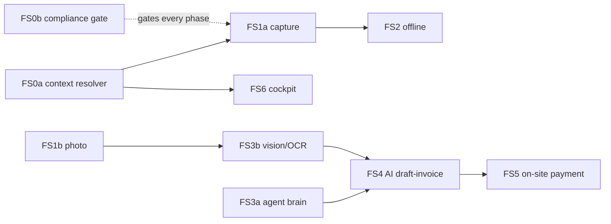

# Plan — Field-Service Employee Mobile Head (Implementation)

**Date:** 2026-08-06
**Umbrella BI:** BI-5D74D55D — Field-service employee mobile head (xlarge)
**Epic:** EP-MOBILE-IOS-APP
**Design:** [`2026-08-06-field-employee-mobile-ai-automation-design.md`](../specs/2026-08-06-field-employee-mobile-ai-automation-design.md) (merged, #4081)
**Governance gate:** [`2026-08-06-field-service-privacy-governance-gate.md`](../specs/2026-08-06-field-service-privacy-governance-gate.md) (merged, #4577) · BI-AE8C769D · policy DOC-30D1EAAF
**Status:** Draft — for operator review

> **For agentic workers:** execute this plan one independently reviewable backlog item at a time — one BI, one branch, one PR. Use `dpf-tdd` for red-green implementation, `dpf-local-merge-ci-before-push` plus the plan's completion gate before any success claim, and `dpf-pr-with-dco` for handoff.

## 1. What this builds and how

The **employee/field-service head** of the mobile app — operator ruled it leads. Kernel-decided approach (WWMD, `principle_decide`): **A-wire-existing** (composite 4.97, margin 1.52, high confidence) — connect the rich-but-disconnected backend rather than rebuild the field-ops domain. The reference vertical is HVAC field-dispatch; it generalizes to any dispatched field work.

**Every phase is gated by the privacy/compliance requirements gate (BI-AE8C769D).** Each BI carries a Privacy & Compliance Requirements section the compliance coworker reviews before build. The confirmed posture — **coarse, on-duty-only location; propose-for-weighty automation** — is a standing constraint, not a per-phase re-decision.

## 2. Grounded substrate (research 2026-08-06)

- **Jobs flow is real and wired** — `apps/mobile/app/(tabs)/jobs/*` (list → detail with status action map → complete/capture → draft invoice → collect payment) against real `/api/v1/work-items` + `/api/v1/finance/*` endpoints. `WorkItem` (`schema.prisma:13591`, `evidence Json?`, no location/account FK; account resolved at read-time via `work-item-account-resolution.ts`).
- **Capture is stubbed** — `stubCapture` returns a 1×1 PNG (`imageSource.ts`); `CameraField`/`SignatureField`/`LocationField` are placeholders; **no voice field**.
- **Payment is manual-only** — cash/cheque/card-manual, no processor (App Store 3.1.3(e) owner-action P0).
- **Offline queue never fed**; **agent endpoints are stubs**; **no employee cockpit/home** (only the persona-gated `jobs` tab).
- Field service = derived **Field Dispatch** capability (`field-dispatch.ts`), not an archetype.

## 3. Deliverable graph

| Key | Deliverable | BI | New? | Depends on |
|---|---|---|---|---|
| FS0a | Context resolver (on-duty gating: work vs patron vs on-the-job) | BI-4AC5F583 | — | — |
| FS0b | Privacy/compliance gate (per-phase review) | BI-AE8C769D | — | — |
| FS1a | Real coarse/on-duty capture — dynamic-form camera/signature/location | BI-97C69412 | — | FS0a |
| FS1b | Job-evidence photo capture (expo-image-picker) | BI-B24753FC | — | — |
| FS1c | Signature capture | BI-8FE69AB2 | — | — |
| FS1d | Voice-note capture | BI-5EB95B96 | — | — |
| FS2 | Offline durability — feed the mutation queue | BI-66A7D4A4 | — | FS1a |
| FS3a | Wire mobile → coworker brain | BI-05EDC704 | — | — |
| FS3b | Vision/OCR — photos → structured data | BI-F438934C | — | FS1b |
| FS4 | AI draft-invoice-from-completed-job (propose/confirm) | BI-3CBE7C55 | ✔ | FS3a, FS3b |
| FS5 | Field on-site payment capture (org processor) | BI-0EE9A74F | ✔ | FS4 |
| FS6 | Field-tech cockpit / employee home | BI-24150E16 | — | FS0a |

## 4. Phased sequence

Each phase = one BI = one branch = one PR, and each **passes the BI-AE8C769D compliance review before build**.

### Phase FS-0 — Foundations (BI-4AC5F583, BI-AE8C769D)
- **FS0a context resolver:** on-duty-vs-off + work-vs-patron prominence (generalizes the shipped `resolveAuthRedirect`/`resolveVisibleTabs`). It is the **enforcement point** for coarse/on-duty location gating.
- **FS0b compliance gate:** the six WWWD stances (DOC-30D1EAAF) promoted into the overlay; each subsequent BI reviewed against them.
- **Compliance:** establishes the gate itself. **Verify:** on-duty → location-eligible; off-shift → location suppressed; unit tests over the resolver.

### Phase FS-1 — Real capture, coarse + on-duty (BI-97C69412, BI-B24753FC, BI-8FE69AB2, BI-5EB95B96)
- Swap the stubs for real `expo-*` primitives; **`LocationField` is coarse and only fires when FS0a says on-the-job**; photo/signature/voice attach to `WorkItem.evidence`.
- **Compliance:** location coarse + on-duty-only (P1); evidence PII-minimized/access-scoped (P5). **Verify:** capture a real coarse geotag only while on an active job; photo/signature/voice persist to evidence; off-shift capture is refused.

### Phase FS-2 — Offline durability (BI-66A7D4A4)
- Route job-status, evidence, and invoice mutations through the offline queue so field work survives no-signal sites.
- **Compliance:** queued location obeys the same on-duty rule; no background collection. **Verify:** offline job actions queue durably and replay idempotently on reconnect.

### Phase FS-3 — AI-assist wiring (BI-05EDC704, BI-F438934C)
- Point the mobile agent endpoints at the real coworker brain; add the vision/OCR handler (nameplate/receipt/parts photo → structured data).
- **Compliance:** automation obeys propose/act/never (P4); vision keeps derived data, discards raw when derivation is the purpose (P5). **Verify:** a real coworker reply in the panel; a photo yields structured fields with confidence.

### Phase FS-4 — AI draft-invoice-from-job (BI-3CBE7C55)
- On job completion, the coworker drafts the invoice from the job + evidence photos and surfaces it as an **AgentActionProposal** the tech confirms — never auto-sent.
- **Compliance:** draft-invoice is propose-and-confirm (P4). **Verify:** completed job + photos → proposed draft with evidence-derived lines; nothing sends without confirmation; server authoritative for totals.

### Phase FS-5 — On-site payment capture (BI-0EE9A74F) — gated, last
- Tech collects card/wallet on-site against the **org's own processor** (Stripe Connect); writes Payment + allocates to the invoice. Behind a per-org "payments enabled" capability.
- **Compliance:** payment-data handling reviewed; IAP-exempt physical service. **Verify:** on-site charge against a test connected account; Payment + allocation written; manual-collect still works when disabled. **Rollback:** disable the capability flag → manual payment (today's behavior).

### Phase FS-6 — Field-tech cockpit / home (BI-24150E16)
- The "tether to company" employee home: today's jobs + schedule + earnings + the agent — the operational home a field tech lands on.
- **Compliance:** surfaces only on-duty/work-context data (FS0a). **Verify:** cockpit aggregates jobs/schedule/earnings for the signed-in tech; on-sim walkthrough.

## 5. Backlog coverage

- **Decision:** `decomposed` — every deliverable maps to a live BacklogItem (below).
- **Umbrella:** BI-5D74D55D.
- **Formal receipt:** NOT yet recorded — `record_plan_backlog_coverage` returned `gate-not-authorized` from this external session (the same token-scope limitation as the WWWD-overlay write; `DPF_MCP_BEARER_TOKEN` lacks the governance/coverage grant). The receipt must be recorded by a coverage-authorized token or in-portal against commit `ed2b4c67` / this plan path. This table is the mapping, not a substitute for the receipt.

| Deliverable | BI | New | Depends on |
|---|---|---|---|
| FS0a Context resolver | BI-4AC5F583 | — | — |
| FS0b Compliance gate | BI-AE8C769D | — | — |
| FS1a Coarse/on-duty capture | BI-97C69412 | — | FS0a |
| FS1b Photo capture | BI-B24753FC | — | — |
| FS1c Signature capture | BI-8FE69AB2 | — | — |
| FS1d Voice-note capture | BI-5EB95B96 | — | — |
| FS2 Offline durability | BI-66A7D4A4 | — | FS1a |
| FS3a Agent brain wire | BI-05EDC704 | — | — |
| FS3b Vision/OCR | BI-F438934C | — | FS1b |
| FS4 AI draft-invoice | BI-3CBE7C55 | ✔ | FS3a, FS3b |
| FS5 On-site payment | BI-0EE9A74F | ✔ | FS4 |
| FS6 Field-tech cockpit | BI-24150E16 | — | FS0a |

## 6. Risks & rollback

- **Payment (FS-5) is the blast-radius risk** — greenfield processor + PCI surface. Mitigation: sequence last, per-org capability gate, keep manual-collect working. Rollback: disable the flag.
- **Location privacy (FS-1)** — the coarse/on-duty rule is load-bearing; a regression that collects off-shift or precise location is a compliance breach. Mitigation: FS0a is the single enforcement point, the compliance gate reviews it, and the default is *suppressed* when context is unknown.
- **AI-assist trust (FS-3/FS-4)** — a wrong auto-action erodes trust. Mitigation: propose-and-confirm for anything weighty (P4); the proposal gate is the safety.
- **Capture native regressions** — `expo-*` capture can break the build. Mitigation: `dpf-tdd` per field; the native build is now green (BI-3C588501).

## 7. Verification gate (whole plan)

Per BI: `dpf-local-merge-ci-before-push` green + the BI's functional verification (endpoint/component tests + on-simulator walkthrough) **and** the BI-AE8C769D compliance review, before any success claim. A structural pass is not verification.
