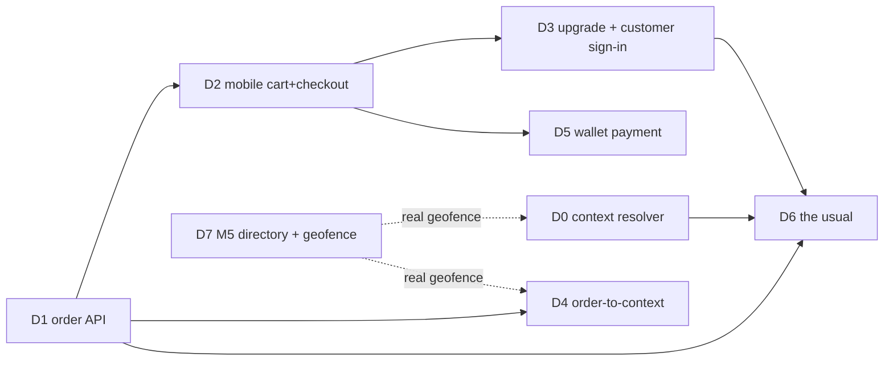

# Plan — Order-Before-You-Sit (Walk-Up Front Door, Phase 2)

**Date:** 2026-08-06
**Umbrella BI:** [BI-9FEB61B8](https://github.com/OpenDigitalProductFactory/opendigitalproductfactory) — Viral walk-up consumer front door (xlarge)
**Epic:** EP-MOBILE-IOS-APP
**Spec:** [`docs/superpowers/specs/2026-08-05-viral-walkup-consumer-front-door-design.md`](2026-08-05-viral-walkup-consumer-front-door-design.md)
**Predecessor plan (Phase 1, merged):** [`2026-08-05-walkup-front-door-first-cut.md`](2026-08-05-walkup-front-door-first-cut.md)
**Status:** Draft — for operator review

> **For agentic workers:** execute this plan one independently reviewable backlog item at a time — one BI, one branch, one PR. Use `dpf-tdd` for red-green implementation, `dpf-local-merge-ci-before-push` plus the plan's completion gate before any success claim, and `dpf-pr-with-dco` for handoff.

---

## 1. What's merged, what phase 2 builds

**Phase 1 (merged):** geo-reverse discovery (`/api/storefront/nearby`) + public menu (`/api/storefront/[slug]/menu`), the anonymous `visitor` persona, and the geo-surfaced "Right here" menu-first home. An unauthenticated app-open now lands on Nearby, not a login gate (BI-A9E21384), verified on the iOS Simulator (once BI-3C588501 unblocked the native build).

**Phase 2 = "order-before-you-sit":** turn the browse-only front door into a guest order flow, add the identity tiers that make it *recognize* a returning patron without forcing an account, and — new from operator direction 2026-08-06 — arbitrate the **two faces of the app** (patron vs. employer) by location and dispatch.

## 2. Grounded substrate (from the 2026-08-06 substrate map)

**Exists / reuse:**
- `StorefrontOrder` (`schema.prisma:11515`, **nullable `customerContactId`** → guest-capable) + `StorefrontOrderLineItem`; `submitOrder()` (`apps/web/lib/release/storefront-actions.ts:452`) creates order+lines+`ProductSold`+auto-`Invoice`.
- Menu source of truth = `StorefrontItem` (`schema.prisma:10544`), rendered by `getPublicStorefront` → `groupMenu` (`apps/web/lib/storefront/menu.ts`). Not a `MenuItem` table.
- Identity: `Principal`/`PrincipalAlias` (`schema.prisma:324`/`396`) — the anticipated guest→account hook; `CustomerContact` (`133`)/`CustomerAccount` (`3916`).
- Mobile: visitor store (`apps/mobile/src/features/visitor/visitor.store.ts`, read-only), Nearby screens (`app/(tabs)/nearby/*`, `[slug].tsx` carries the "Ordering comes soon" placeholder), `useGeolocation`, `apiClient` → `getServerUrl()`.
- Persona/routing already shipped: `src/lib/navigation.ts` `resolveVisibleTabs`, `app/_layout.tsx` `resolveAuthRedirect` (handle only unauthenticated→visitor).
- WorkItem substrate + `WorkItem→CustomerAccount` resolver (BI-4B06837A) for the field-service half.

**Absent / greenfield (this is the phase-2 build surface):**
- **No `Cart` model** — cart is client-side only.
- **No public order-create endpoint** — `submitOrder` is a web server action; mobile has no order path (only `/api/storefront/orders/[id]/status`).
- **No anonymous/guest/device-token identity** — only `PrincipalAlias` as a hook.
- **No customer-facing payment capture** — `apps/web/lib/integrate/stripe/` is a read-only probe; the pay portal button is literally "Pay Now (Coming Soon)"; `Payment` rows are recorded manually employee-side.
- **No geofence model / federated directory table** — geo is loose JSON in `Organization.address`; publish is a boolean (`StorefrontConfig.isPublished`).

## 3. Decisions applied (operator, 2026-08-06)

- **§5-A Identity:** device-token cart pre-checkout; mint a guest `Principal` at order-submit; offer alias-strengthening after.
- **§5-B Geofence/privacy:** client-side coarse match against a publicly-published geofence; nothing shared with the business until the diner acts.
- **§5-C Discovery host:** extend the Town M5 directory (single federation surface) — BI-C2C693EE.
- **§5-D Payment:** guest wallet pay → each business's own processor; account optional; no central broker.
- **Returning-guest ID:** **one pseudonymous ID, client-held / on-device, carried across venues** (never a central broker) — BI-2D502A0C.
- **Two-faced context (new):** the same app serves patron + employer; **prominence is by location × employment × dispatch**, precedence **on-the-job > at-my-employer > patron** — BI-4AC5F583.

## 4. Deliverable graph

| Key | Deliverable | BI | Shippable | Depends on |
|---|---|---|---|---|
| D0 | Contextual persona-prominence resolver (work vs patron vs on-the-job) | BI-4AC5F583 | yes | — (soft: D7 for real geofence) |
| D1 | Guest order-create contract — public `POST /api/storefront/orders` | BI-81E8AA4C | yes | — |
| D2 | Mobile guest cart + checkout UI | BI-53EEEE79 | yes | D1 |
| D3 | Post-order guest→CustomerContact upgrade + customer sign-in | BI-83641E27 | yes | D1, D2 |
| D4 | Order-to-context binding (dine-in table / takeaway time) | BI-DEC0E9A2 | yes | D1 |
| D5 | Guest wallet payment capture (Stripe Connect on the org's account) | BI-45189351 | yes | D1, D2 |
| D6 | "The usual" — client-held pseudonymous ID + vendor-side predictive re-order | BI-2D502A0C | yes | D0, D1, D3 |
| D7 | M5 directory + address-geofence claim/verify | BI-C2C693EE | yes | — |

## 5. Phased sequence

Each phase = one BI = one branch = one PR. Independently shippable unless noted.

### Phase 2.0 — Context foundation (D0 · BI-4AC5F583)
- **Deliverable:** generalize the shipped persona/routing into a resolver that, for an authenticated user, picks the prominent face by geo × employment site geofence × active dispatch/WorkItem, precedence on-the-job > at-employer > patron; unauthenticated always → visitor.
- **Touches:** `apps/mobile/src/lib/navigation.ts`, `app/_layout.tsx` (`resolveAuthRedirect`), `src/lib/appConfig.ts`, a new pure resolver + tests; consumes employment/dispatch context (WorkItem location binding). Uses loose `Organization.address` geo until D7 lands a real geofence.
- **Verification:** unit tests over the resolver decision (at-employer→work, dispatched→job, else→patron, unauth→visitor); on-sim spot check. Ship with loose geo; tighten when D7 lands.
- **Shippable:** yes (falls back to patron/visitor when relationships unknown — never blocks browsing).

### Phase 2.1 — Order rails (D1 · BI-81E8AA4C)
- **Deliverable:** extract the price-validated order-create core from `submitOrder` into a shared lib; expose `POST /api/storefront/orders` (PublicApi/anonymous). Anonymous cart → server-side price validation → `StorefrontOrder` (null `customerContactId` + guest fields) → confirmation.
- **Touches:** `apps/web/app/api/storefront/orders/route.ts` (new), refactor `apps/web/lib/release/storefront-actions.ts:452`, `packages/api-client/src/endpoints/storefront.ts`.
- **Verification:** endpoint tests — anonymous create succeeds, price-tamper rejected, guest order + lines persisted, auto-invoice generated.

### Phase 2.2 — Mobile order UX (D2 · BI-53EEEE79, then D4 · BI-DEC0E9A2)
- **D2:** client-side cart on the menu screen, "Place order" → guest checkout (name/phone or table) → `POST /api/storefront/orders` → confirmation; replaces the "Ordering comes soon" placeholder. Touches `apps/mobile/app/(tabs)/nearby/[slug].tsx`, `src/features/visitor/visitor.store.ts`, new checkout screen, `packages/api-client` storefront endpoints. **Verify:** cart-math + submit component tests; on-sim cold-open → menu → add → place → confirmation.
- **D4:** extend the create contract with a fulfillment binding — dine-in table (QR/geofence + table pick) or takeaway time — surfaced in the owner cockpit via the restaurant capacity substrate. **Verify:** dine-in order carries a table binding visible to the owner; takeaway carries a pickup time.

### Phase 2.3 — Identity & recognition (D3 · BI-83641E27, then D6 · BI-2D502A0C)
- **D3:** define the **customer** sign-in (returning `CustomerContact` for the active space, distinct from the `/api/v1` employee login the shipped "Sign in" link currently hits); wire the post-order one-tap `CustomerContact` upgrade via `PrincipalAlias`. **Verify:** upgrade writes the alias; customer sign-in resolves to CustomerContact not employee persona; never required to order.
- **D6:** client-held cross-venue pseudonymous ID presented at order so a storefront recognizes a returning patron with no PII; per-storefront store of `pseudonymousId → order history` + vendor-side predictive re-order ("the usual"). Only fires in patron context (D0). **Verify:** returning patron surfaces "your usual"; no PII leaves the device until tier-3 opt-in; predictions are per-storefront.

### Phase 2.4 — Payment (D5 · BI-45189351) — LAST, gated
- **Deliverable:** device wallet (Apple/Google Pay) → PaymentIntent/charge on the **org's Stripe Connect account** (no central broker); write `Payment` + allocate to the auto-Invoice; physical-service IAP-exempt. Gate behind a per-org "payments enabled" capability so browse/order work without it.
- **Verify:** guest wallet charge succeeds against a test connected account; `Payment` + Invoice allocation written; order-only path works when payments disabled.

### Adjacent / parallel — D7 · BI-C2C693EE (Town M5 directory + geofence)
Extends discovery from "slug→URL phonebook" to geo→storefront and lands a real **address-geofence claim/verify** (spec §5-B, anti-spoofing). Its own xlarge track; feeds real geofences into D0 and D4 but browse/order proceed on loose geo until then.

## 6. Backlog coverage

- **Decision:** `decomposed` — every independently shippable deliverable maps to a live BacklogItem.
- **Coverage receipt:** `cmshny6hw106e01pl5ucl9md5` (written to umbrella BI-9FEB61B8; revalidate with `check_plan_backlog_coverage`).
- **Umbrella:** BI-9FEB61B8

| Deliverable | BI | Depends on |
|---|---|---|
| D0 Context resolver | BI-4AC5F583 | — |
| D1 Guest order-create API | BI-81E8AA4C | — |
| D2 Mobile cart + checkout | BI-53EEEE79 | D1 |
| D3 Upgrade + customer sign-in | BI-83641E27 | D1, D2 |
| D4 Order-to-context binding | BI-DEC0E9A2 | D1 |
| D5 Guest wallet payment | BI-45189351 | D1, D2 |
| D6 "The usual" (pseudonymous ID + predictive) | BI-2D502A0C | D0, D1, D3 |
| D7 M5 directory + geofence | BI-C2C693EE | — |

## 7. Risks & rollback

- **D5 payment is the blast-radius risk** — greenfield Stripe Connect on-behalf-of charges, wallet setup, PCI surface. Mitigation: sequence last, gate behind a per-org capability, keep order/browse fully functional without it. Rollback: disable the capability flag; orders revert to order-only + manual employee-side payment (today's behavior).
- **D0 context resolver mis-classification** — wrongly showing an on-the-job worker a patron menu, or vice versa. Mitigation: safe default is **patron/visitor** when relationships/dispatch are unknown, and the resolver never *blocks* a surface, only reorders prominence. Rollback: the resolver degrades to the shipped unauthenticated→visitor rule.
- **Guest identity / privacy (D3/D6)** — the cross-venue pseudonymous ID must stay client-held; a leak would create a cross-venue tracking vector. Mitigation: on-device only, presented to a storefront only on the patron's action, no central store; reconcile with the no-central-broker principle in design review.
- **D1 refactor regressions** — extracting `submitOrder`'s core could disturb the existing web order flow. Mitigation: `dpf-tdd` around the extracted lib; the web server action becomes a thin caller with its tests intact.
- **Geo accuracy** — loose `Organization.address` JSON geo is coarse; D0/D4 correctness improves only when D7 lands real geofences. Interim behavior is documented as coarse.

## 8. Verification gate (whole plan)

Per BI: `dpf-local-merge-ci-before-push` green + the BI's own functional verification (endpoint/component tests + on-simulator walk-through, now unblocked by BI-3C588501) before any success claim. No phase is "done" on a structural pass alone.
