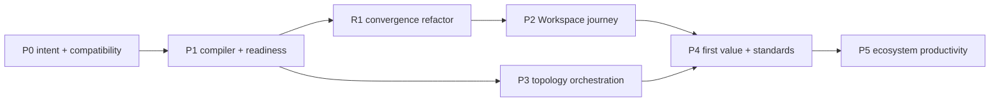

# Purpose-Aware Installation to Ecosystem Productivity — Implementation Plan

> **Superseded (2026-09-01).** This 2026-08-08 umbrella plan was formally
> decomposed ("seven live mappings", per the coverage receipt below) into the
> more specific, currently-authoritative specs it spawned — the
> installation-identity, installation-estate-identity, external-agent-operating-contract,
> consumer-install-rulebook, and zero-touch-federation designs under
> `docs/superpowers/`. Consult those for current design. Its coordination
> anchors (`EP-1FABA22D` and its BIs) are no longer in the live backlog;
> recovery is tracked by `BI-99250643`. Kept for history — original wording
> below is unchanged.

- **Date:** 2026-08-08
- **Status:** planned; implementation not started
- **Epic:** `EP-1FABA22D`
- **Umbrella BI:** `BI-34667080`
- **Design:** `docs/superpowers/specs/2026-08-08-purpose-aware-installation-ecosystem-productivity-design.md`
- **WWMD decision:** `DI-8707CE39FDD2`
- **Coverage receipt:** `cmskn1vrn006e01qpg9g877cn` (`decomposed`, seven live mappings)

> **For agentic workers:** execute this plan one independently reviewable backlog item at a time — one BI, one branch, one PR. Use `dpf-tdd` for red-green implementation, `dpf-local-merge-ci-before-push` plus the plan's completion gate before any success claim, and `dpf-pr-with-dco` for handoff.

## 1. Outcome

Replace the universal eleven-route setup tour with a purpose-aware, evidence-driven journey from installation bootstrap to productive ecosystem participation.

The implementation will:

- capture host environment class and semantic operating intent in their correct canonical stores;
- extend the existing workspace-home activation orchestrator into the single journey compiler;
- recommend and confirm what the installation will do before role-dependent setup;
- compile milestones from canonical business, capability, federation, coworker, and Hive evidence;
- prove profile-specific first value before declaring the installation productive;
- preserve existing trust, authority, identity, qualification, and contribution boundaries;
- reserve an independently reviewable refactor stream representing roughly 20% of delivery capacity.

Implementation ends when each child BI has shipped through its own PR and the umbrella acceptance audit is satisfied. This plan does not authorize coding all phases on one branch.

## 2. Current substrate and implementation boundary

### Reuse as-is or extend

| Substrate | Current source | Plan use |
|---|---|---|
| Static setup route tour | `apps/web/lib/actions/setup-constants.ts`, `setup-progress.ts`, `components/setup/*`, shell layout | Converge into adapters and a milestone projection; retain owning actions/routes |
| Workspace activation orchestrator | `apps/web/lib/workspace-home/activation-orchestrator/` | **Implementation home** for the broader journey compiler and evidence orchestration |
| Workspace home | `apps/web/app/(shell)/workspace/page.tsx`, `components/workspace-home/*` | Canonical authenticated home for journey companion; no new nav area |
| Setup state | Prisma `PlatformSetupProgress` | Resumable derived plan/progress only |
| Install lifecycle state | `scripts/installer/install-state*.schema.json`, `scripts/installer/lib/state.ps1`, `.sh` | Canonical environment class and optional pre-DB intent envelope |
| Install-local semantic config | Prisma `PlatformConfig` and existing repository patterns | Versioned operating-intent record; no new table |
| Organization/business truth | `Organization`, `BusinessContext`, onboarding derivation | Compiler inputs; never copied into intent |
| Capability activation | `OrganizationCapabilityActivation` and capability registry | Explicit capability evidence; inference cannot activate |
| Federation | `packages/db/src/federation-link-types.ts`, trust lifecycle, federation actions/UI, and `BI-BE0E14E0` | Relationship planning and readiness; existing actions establish trust; the A2A slice owns device/issuer/card/task verification |
| Agent standards | A2A card, GAID/AIDoc resolver, TAK agent-card/authority, AI readiness | Honest evidence resolvers over local and link-scoped assurance; no second registry/task/authority path |
| Hive | contribution actions, integrate readiness/review/egress | Existing contribution/absorption path |
| Presentation | report-kit, shared form primitives, `JourneyHealthCard` pattern | Status, notice, empty/failure, and evidence disclosure |

### Explicitly do not add

- a Prisma installation-profile table;
- another activation/setup orchestrator outside `workspace-home/activation-orchestrator`;
- a federation role, trust, token, approval, projection, or identity model;
- an A2A task bus or agent registry;
- a synthetic JSI qualification record;
- a Hive service or local contribution ledger;
- a setup dashboard, global-nav item, or section-nav item.

## 3. Backlog coverage

The governed `record_plan_backlog_coverage` call validated every independent deliverable against live PostgreSQL state.

- Parent: `BI-34667080`
- Plan: `docs/superpowers/plans/2026-08-08-purpose-aware-installation-ecosystem-productivity.md`
- Decision: `decomposed`
- Receipt: `cmskn1vrn006e01qpg9g877cn`

| Key | Backlog item | Independent deliverable | Depends on |
|---|---|---|---|
| `p0` | `BI-A9F60372` | Typed operating-intent contract and compatibility path | — |
| `p1` | `BI-91EF130B` | Deterministic journey compiler and productivity projection | `p0` |
| `r1` | `BI-4FCBA4B2` | Static setup and readiness convergence refactor | `p0`, `p1` |
| `p2` | `BI-1E91D091` | Purpose recommendation and milestone journey companion | `p0`, `p1`, `r1` |
| `p3` | `BI-AE128860` | Profile-shaped topology/federation orchestration | `p0`, `p1` |
| `p4` | `BI-3E99ACFA` | Profile first-value and A2A/GAID/TAK/JSI readiness | `p1`, `p2`, `p3` |
| `p5` | `BI-669D2B04` | Hive participation, drift repair, and profile metrics | `p4` |

Capability-owner dependencies are not re-filed:

- onboarding derivation: `BI-0610AD49`;
- same-org A2A/GAID and federated identity: `BI-BE0E14E0`, `BI-E2398997`;
- customer-install provisioning and setup-time activation: `BI-9A0B8B70`, `BI-66CF1AA4`;
- their owning epics plus `EP-A2A`, `EP-TAK-3F9A21`, `EP-LEARNING-COMMONS`, and `EP-ECOSYSTEM-ABSORPTION-ARCH`.

Before starting a child BI, call `check_plan_backlog_coverage` with this receipt and re-query each named dependency. A changed or missing receipt stops implementation.

For `BI-BE0E14E0`, the controlling architecture and sequence are [`docs/superpowers/specs/2026-08-08-federated-a2a-gaid-coordination-design.md`](../specs/2026-08-08-federated-a2a-gaid-coordination-design.md) and [`docs/superpowers/plans/2026-08-08-federated-a2a-gaid-coordination.md`](2026-08-08-federated-a2a-gaid-coordination.md). P3/P4 may add read-only journey adapters only after re-querying that BI's delivered contract; they must not implement its device fields, issuer binding, Agent Card mirrors, federation ingress, task convergence, receipts, or link-detail controls.

## 4. Delivery graph

`P2` and `P3` can proceed in parallel after their prerequisites. All other edges are hard ordering constraints.

## 5. P0 — typed intent contract and compatibility (`BI-A9F60372`)

### Deliverable

One versioned semantic-intent repository plus Contract 12-compliant environment-class capture/projection. Existing installs derive a suggestion but gain no authority or capability.

### TDD sequence

1. Add failing table-driven tests for the closed purpose values, imported production/development/test environment values, duplicate/unknown secondary purposes, invalid relationship presets, evidence-reference redaction, and version rejection. Do not define a second environment registry; consume the current federation registry and its generated successor when `BI-BE0E14E0` lands.
2. Add the shared types/decoder, tentatively at `packages/db/src/installation-operating-intent.ts`, and export from `packages/db/src/index.ts`. Keep it pure and database-agnostic.
3. Add failing repository tests for missing, valid, corrupt, and legacy `PlatformConfig` values.
4. Add `apps/web/lib/installation-journey/operating-intent.ts` as the guarded repository/action boundary around key `installation.operating-intent.v1`.
5. Add failing installer-schema tests for absent legacy field, valid environment class, invalid free-form environment, versioned bootstrap intent, unknown keys, and idempotent absorption.
6. Update the canonical v2 installer schema and its registry/mirror path:
   - `scripts/installer/install-state.v2.schema.json`;
   - `scripts/installer/install-state.schema.json` only if the registry confirms it is the active v2 mirror;
   - `scripts/installer/install-state-schema-registry.mjs`;
   - `scripts/installer/lib/state.ps1` and `state.sh` through the shared contract, with substrate syntax only.
7. Add runtime ingestion that projects environment for portal reads and absorbs semantic bootstrap intent into `PlatformConfig`. Record `absorbedAt` only after a successful, validated write.
8. Add confirmation/change actions using existing platform-management authorization and audit patterns. A change returns an impact-preview input; it does not mutate links, grants, or capability activations.
9. Add existing-install derivation: output `suggested`, confidence, and privacy-safe evidence references; never auto-confirm.
10. Update the EA/SysML seed/mirror with the intent block, Contract 12 interface, canonical-authority allocation, and `PIL-R1`–`PIL-R8` traces.

### Verification

- targeted unit tests for types, repository, ingestion, PowerShell/shell state parity, and derivation;
- schema fixtures validate v1/legacy and v2 states;
- invariant test snapshots `FederationLink` approval fields, capability activations, and grants before/after confirmation;
- source scan proves no raw secret/document/business-value field is accepted;
- production build;
- migration gate: none expected because `PlatformConfig` already exists; if a migration becomes necessary, stop for schema audit.

### Rollback

Disable ingestion and intent reads, remove the additive environment/bootstrap fields from future writes while retaining backward-compatible schema reads, and ignore the `PlatformConfig` row. Do not delete profile evidence during rollback.

## 6. P1 — compiler and productivity projection (`BI-91EF130B`)

### Deliverable

Generalize the existing activation orchestrator into the single deterministic journey compiler, with profile-specific first-value mission descriptors and evidence-backed readiness.

### TDD sequence

1. Extend `apps/web/lib/workspace-home/activation-orchestrator/types.ts` with stable milestone, evidence descriptor, blocker, first-value mission, and installation journey plan types. Preserve `ActivationPlan` compatibility.
2. Add failing fixtures for five primary purposes crossed with three environment classes and allowed/forbidden relationship intents.
3. Add `journey-compiler.ts` in the same package. Inputs are canonical snapshots; outputs are pure projections. Embed/reference the archetype `ActivationPlan` rather than copying its counts/signals.
4. Add a versioned registry of milestone descriptors and owning adapters. Every descriptor names its source resolver, route/action, applicability, human-decision requirement, and staleness rule.
5. Add evidence resolvers for intent, organization/business context, capability activation, install/runtime health, federation summary, coworker summary, first-value receipt, and Hive posture. Resolvers return `satisfied | attention | blocked | deferred | not-applicable` plus evidence/time/explanation/remediation.
6. Add deterministic fingerprinting over canonical versions/references. Exclude wall-clock timestamps, display copy, secret material, and unordered array variance.
7. Refactor `apps/web/lib/actions/setup-progress.ts` behind one projection service that reads/writes the compiled plan version and milestone statuses in existing JSON columns. Keep legacy step reads until R1.
8. Add first-value mission descriptors for business production, development companion, managed-services hub, channel hub, and community peer; do not implement their domain adapters yet.
9. Add aggregate `Productive` and `Ecosystem productive` rules with profile criticality and optional/not-applicable handling.

### Verification

- compiler matrix tests, determinism/property tests, and incompatible-axis rejection;
- evidence resolver tests for satisfied, stale, denied, missing, and corrupt source states;
- existing activation-plan compatibility tests stay green;
- legacy completed steps pre-satisfy matching milestones without writes;
- no `Productive` result without the profile's first-value receipt;
- production build.

### Rollback

The compiler is read-only and additive. Disable its consumer and retain the legacy step projection; no canonical domain data changes.

## 7. R1 — convergence refactor (`BI-4FCBA4B2`)

### Capacity contract

This independently reviewable BI represents roughly 20% of the epic's implementation capacity. It removes duplicated orchestration before the UI migration; it is not a broad rewrite.

### Deliverable

One activation/journey package, one setup-progress service, one environment vocabulary, and adapters over existing domain actions.

### TDD/refactor sequence

1. Characterize current `SETUP_STEPS`, `STEP_ROUTES`, advance/skip/pause behavior, overlay triggers, and integration order with regression tests.
2. Replace list-index sequencing with compiler milestone order and stable route/action adapters. Keep a legacy adapter for rollback; stop exporting the static list to new consumers.
3. Move component-local `PlatformSetupProgress.steps/context` decoding into the P1 projection service; update shell and setup components to consume typed output.
4. Converge environment parsing in installer, intent compiler, and `setFederationLinkEnvironmentAction` onto the P0 shared union/guard.
5. Generalize the activation-orchestrator barrel and registries; do not add a sibling `installation-journey-orchestrator` implementation.
6. Converge readiness/evidence presentation intent with report-kit `statusColors` where semantics are shared. Keep business-journey health semantics distinct when they are not identical.
7. Remove dead setup-specific helpers only after reference and test sweeps prove no consumer.

### Verification

- all current setup progress/overlay/integration tests stay green or are intentionally rewritten against equivalent milestone behavior;
- dependency scan finds no new route-local status map, environment union, or activation registry;
- old install fixtures resume correctly;
- diff audit shows deletions/convergence, not only added wrappers;
- production build.

### Rollback

Re-enable the legacy adapter and static ordering under the rollout flag. Canonical intent and evidence remain intact.

## 8. P2 — Workspace purpose and journey experience (`BI-1E91D091`)

### Deliverable

The authenticated Workspace becomes the canonical home for purpose confirmation and milestone progress. No new navigation area or dashboard is added.

### TDD sequence

1. Add UX budget and component tests for the fresh, recommended, low-confidence, returning, blocked, permission-denied, and profile-change states.
2. Add `PurposeConfirmation` using shared form primitives. Show at most four primary choices, one recommendation, its reason, and a correction path. Selecting a choice writes intent only and sends no coworker prompt.
3. Evolve `SetupProgressBar` into a milestone progress primitive or replace it while deleting the old visual duplicate.
4. Evolve `SetupOverlay` into a compact `JourneyCompanion` that follows contextual routes without blocking the shell. Technical evidence uses a native disclosure patterned after `JourneyHealthCard`.
5. Update `apps/web/app/(shell)/workspace/page.tsx` to place the companion in the owner-first band without competing with the single `OperatorCockpit` attention surface.
6. Change `NEXT_SETUP_ROUTE` only after route tests prove the first authenticated destination is Workspace and the legacy path remains recoverable under rollback.
7. Update shell layout to load the typed journey projection rather than casting JSON. Do not add AppRail or section-nav entries.
8. Add explicit optional COO launch with context preview, expected next step, and confirmation; no automatic prompt on card selection or navigation.
9. Add honest action states with `SubmitButton`, `FormStatus`, `Notice`, and `EmptyState`; no zero-filled dashboard.
10. Produce the measured UX-fit manifest covering exactly the changed UI files.

### UX evidence

- real browser path: account bootstrap → Workspace recommendation → confirm → next milestone → pause/resume;
- profile correction and consequence preview;
- missing permission, unavailable provider, bad destination, and write failure recovery;
- keyboard order, focus restoration, accessible names/status, axe, and reduced motion;
- desktop and narrow viewport, light/dark and organization branding;
- route-budget comparison for default-visible words, lead band, primary actions, visible fields, choices, buried action, sub-legible text, and violations;
- selecting purpose produces no coworker transcript/task.

### Rollback

Rollout flag restores the legacy overlay/order. Workspace hides the companion; all canonical intent and completion evidence remain.

## 9. P3 — topology and federation orchestration (`BI-AE128860`)

### Deliverable

Journey adapters compile the appropriate development, managed-service, channel, and community relationship plan, while existing federation/partner domains remain the only writers.

### TDD sequence

1. Add pure topology recommendation tests for business production, development companion, managed estate, sovereign service-provider peer, channel hub, and community peer.
2. Add journey adapters in the activation-orchestrator package that map relationship intents to existing `FederationRelationshipPreset` and directional role pairs.
3. Reuse `FederationLinksAdminClient` and federation action routes through contextual links/actions; do not implement link enrollment inside setup components.
4. Add development-companion pairing evidence: production counterpart reference, worktree/runtime distinction, evidence/promotion route, and explicit no-direct-production-mutation assertion.
5. Add managed-estate versus sovereign-peer choice using the existing MSP design; capability/account evidence determines applicability, not a raw archetype check.
6. Add channel/regional plan using existing partner account/agreement/entitlement and channel-upstream/downstream link evidence.
7. Treat discovery/pairing as a candidate milestone. Satisfied/trusted requires the existing identity, dual approvals, projection contract, and authority evidence.
8. Add first safe exchange verification descriptor without duplicating transport or envelope code.
9. Keep A2A readiness distinct from generic trusted-link or demand-exchange readiness. Resolve it only from `BI-BE0E14E0`'s link/device/issuer/card capability evidence; when that slice is absent or disabled, return `deferred` or `not-applicable` according to profile rather than synthesizing readiness.

### Verification

- profile confirmation changes no link approval, token, grant, contract, or authority field;
- discovered candidate remains untrusted;
- every relationship pair uses shared helpers and inverse roles;
- development companion cannot call a production mutation adapter;
- revocation/quarantine changes readiness on the next resolve;
- functional live verification follows the existing federation preflight/lease workflow and covers at least same-org, service-provider, and channel shapes;
- production build.

### Rollback

Hide relationship milestones and leave existing federation links/accounts untouched. Existing federation surfaces remain fully usable.

## 10. P4 — first value and agent standards (`BI-3E99ACFA`)

### Deliverable

Each profile can prove its first real outcome, with honest separation between local A2A readiness, link-scoped same-organization A2A readiness, GAID/AIDoc assurance, TAK, and actual TAK-JSI evidence.

### TDD sequence

1. Define one first-value evidence adapter interface under the activation-orchestrator package. It reads a canonical domain outcome and governance receipt; it does not write the domain record.
2. Implement a bounded adapter per profile using existing work/task/domain records. Fixtures remain red until both the outcome and required governance evidence exist.
3. Reuse the local Agent Card/coworker service-catalog contracts to report **local** task/artifact readiness only. For cross-install readiness, consume the canonical `BI-BE0E14E0` outputs: A2A-ready `FederationLink`, pinned device, approved issuer binding, current link-scoped Agent Card/AIDoc mirror, link-owned `TaskRun`, and verification receipt. Do not inspect or recreate its protocol path inside the journey.
4. Reuse `identity/aidoc-resolver.ts` and GAID authority helpers. The private/local state can pass only local assurance; the bounded same-organization federated state can pass only after its capability-owner evidence is implemented and verified.
5. Reuse TAK agent-card/authority/receipt summaries. Missing authority context or receipt remains fail-closed.
6. Add a TAK-JSI resolver with explicit `not-required | defined | assessed | qualified | required-unavailable` results based on actual records. Until qualification lifecycle exists, never synthesize `qualified`.
7. Connect each resolver to the P1 evidence descriptors and Workspace remediation copy.
8. Add a supervised fallback mission for `required-unavailable`; human supervision does not masquerade as qualification or widen the coworker's authority.

### Verification

- five profile first-value fixtures remain not productive without their domain evidence;
- public GAID and general cross-organization validation remain unavailable; bounded same-organization link-scoped assurance is green only from `BI-BE0E14E0` evidence;
- setup completion alone never produces assessed/qualified;
- proactivity changes never widen TAK/JSI ceilings;
- local A2A projection references existing tasks/artifacts/receipts, while federated A2A references the link-owned canonical task and immutable verification receipt from `BI-BE0E14E0`;
- live happy-path exercises for each profile that current substrate can support; unsupported gaps are recorded, not greenwashed;
- production build.

### Rollback

Hide standards/first-value aggregation; no agent identity, authority, qualification, or task data is deleted or rewritten.

## 11. P5 — ecosystem productivity and continuous readiness (`BI-669D2B04`)

### Deliverable

After first value, the installation proves an appropriate learning/participation loop, detects readiness drift, and measures time-to-value by confirmed profile.

### TDD sequence

1. Add learning-classification descriptors for WWMD, WWWD/wiki, WSID/skill, code/architecture, and install-local outcomes.
2. Reuse contribution review, egress, dispatch, result-store, and Hive actions. The journey can stage/recommend; publication retains its existing review/approval boundary.
3. Add explicit local-only evidence for secrets, paths, machine resources, customer-confidential data, or non-generalizable configuration.
4. Extend the existing activation reconciliation path/queue pattern so readiness evidence re-resolves on source changes and a bounded cadence. Do not reset onboarding or rewrite canonical state.
5. Add targeted repair tasks/attention entries through the existing actionable-work substrate selected by the activation orchestrator; no new notification table.
6. Extend `workspace-home/telemetry.ts` with profile/version dimensions and events for recommendation, confirmation/correction, first-value, drift, repair, contribution/absorption, and local-only classification.
7. Add aggregate product metrics without a universal readiness score. Preserve the underlying facet statuses and profile criticality.

### Verification

- reviewed contribution reaches existing git/ledger path with provenance;
- rejected/unsafe contribution does not publish;
- local-only fixture remains local and counts as an honest classified outcome where appropriate;
- deleting/invalidating one evidence source changes only affected milestones and emits one actionable repair;
- metrics contain no secrets, raw business values, or peer tokens;
- long-running reconciliation uses the canonical runtime/queue and is bounded/idempotent;
- production build.

### Rollback

Disable reconciliation/telemetry consumers and hide ecosystem milestones. Existing Hive contributions and canonical evidence remain unchanged.

## 12. Cross-cutting verification gate

Every child PR must run the gates proportional to its scope; no PR claims the umbrella complete.

| Gate | Required evidence |
|---|---|
| Unit | affected Vitest files from the child BI, including negative authority/trust cases |
| Build | `pnpm --filter web build` with zero errors for any web/runtime change |
| Installer parity | PowerShell + shell schema/state fixtures for P0 |
| Migration | clean apply only if a migration is introduced; expected design is no migration |
| UX | shared nonprod environment lease, real browser path, measured UX-fit manifest for P2 and later UI edits |
| Federation | canonical live preflight and approved test pair for P3; no ad-hoc worktree runtime |
| Security | secret/PII scans, no implicit trust/authority, audit evidence, fail-closed negative cases |
| EA/SysML | requirements/interfaces/allocations/verification/data-authority conformance in P0 and final audit |
| Docs | update operator/install/setup/architecture docs in the owning child PR; record a concrete no-docs-needed reason otherwise |
| Publication | independent semantic review of stable commit, local merged-code CI, DCO, push, ready non-draft PR, merge queue |

Final umbrella verification additionally proves:

1. fresh production-oriented install to first business outcome;
2. development companion to governed promotion boundary;
3. managed-service or sovereign-peer first service loop;
4. channel hub provision/pair/support loop;
5. community contribution or explicit local-only loop;
6. existing-install migration without re-entry or new authority;
7. purpose correction and readiness drift repair;
8. A2A/GAID/TAK/JSI evidence truthfulness;
9. Hive provenance/egress boundaries;
10. `Productive` and `Ecosystem productive` match the design definitions.

## 13. Risks and mitigations

| Risk | Blast radius | Mitigation |
|---|---|---|
| Existing activation orchestrator is bypassed | two setup engines diverge | P1/R1 implement inside its package; code review rejects sibling engine/registries |
| Environment becomes dual-authoritative | installer and DB drift | Contract 12 precedence, read-only projection, reconciliation from install-state |
| Purpose becomes privilege | cross-org or production control | invariant tests snapshot grants/link approvals; all writes stay with owning actions |
| Static setup migration strands users | every existing install | legacy adapter, evidence-aware backfill, rollout flag, no destructive reset |
| Workspace becomes another dashboard | owner cognitive load | contextual companion, one primary action, no new nav/KPIs, UX budgets and fit manifest |
| Federation dependencies are incomplete | profile journey blocks | show owning BI/remediation; do not implement substitute transport/trust |
| Standards are overclaimed | false safety/market claims | conformance-backed resolver and explicit unavailable states |
| First-value adapters fork domain logic | maintenance and false completion | read canonical outcomes/receipts; adapters perform no domain writes |
| Hive leaks private data | customer/org harm | existing egress review/provenance plus local-only classification |
| Reconciliation becomes noisy | operator fatigue and queue load | source-change triggers, bounded cadence, idempotent dedupe, one targeted action |
| Refactor grows beyond 20% intent | schedule/blast radius | R1 bounded to touched seams; no model rewrite; deletions/convergence measured in its PR |

## 14. Rollout and rollback strategy

1. P0 lands dark and backward-compatible.
2. P1 lands read-only and can compare compiled plans with legacy progress in telemetry/tests.
3. R1 introduces a legacy adapter behind the rollout flag.
4. P2 enables the Workspace companion for fresh/test installs first, then existing installs after evidence reuse is proven.
5. P3–P5 enable milestone families only when owning capability evidence resolvers are available.
6. Default-on requires the final umbrella verification matrix and canonical-runtime evidence.

Rollback at any point disables the new consumers and re-enables legacy presentation. It never deletes intent, business, federation, agent, or contribution records and never rewrites trust/authority state.

## 15. Documentation and decision impact

Child PRs update the appropriate authoritative surfaces:

- installer/operator setup and Contract 12 documentation for P0;
- architecture orientation, setup/onboarding contracts, and EA mirror for P0/P1;
- platform usability/setup guidance and UX-fit evidence for P2;
- federation/partner operator guidance for P3;
- agent conformance status only when implementation evidence changes it in P4;
- Hive/learning commons guidance and operations metrics for P5.

Do not copy the full design into those docs. Each authoritative surface owns its rule and points back to the design/BI where historical rationale is useful.

## 16. Completion audit

The umbrella can close only after a current-state audit maps every design acceptance criterion to:

- merged child PR and live BI status;
- code/source contract;
- passing gate output;
- canonical runtime/browser evidence where required;
- EA/SysML conformance evidence;
- current standards-conformance truth;
- documentation impact result.

A missing child, deferred external dependency, unverified profile, stale receipt, source-only test run, or merely plausible UX keeps the umbrella open.
