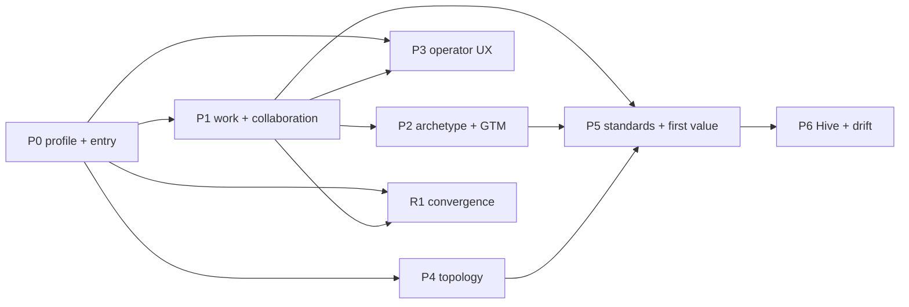

# External Agent Operating Contract Implementation Plan

**Date:** 2026-08-22

**Status:** Proposed

**Umbrella backlog item:** `BI-11D611B3`

**Epic:** `EP-1FABA22D`

**Design:** [`../specs/2026-08-22-external-agent-operating-contract-design.md`](../specs/2026-08-22-external-agent-operating-contract-design.md)

## 1. Delivery objective

Make a source-free DPF installation a complete governed host for any supported external AI agent. A client should discover a principal-bound operating profile, select and claim explicit business work, act through Authorized Surfaces and canonical domain boundaries, coordinate safely with other agents, and leave durable evidence and receipts. The same contract must work for local MCP clients, embedded coworkers, A2A peers, multiple installations, archetype operations, GTM work, and Hive contribution.

This is an umbrella plan. Each independently shippable phase has its own Backlog Item and PR. No implementation branch should attempt the whole program.

The delivery budget reserves one independent convergence stream, `R1`, and convergence work inside each phase. Together these should consume about 20% of program capacity. This is a target for removing touched duplication, not permission for a broad rewrite.

## 2. Current substrate and implementation boundary

### Reuse or extend

| Concern | Current implementation | Plan use |
|---|---|---|
| Installation purpose | `packages/db/src/installation-operating-intent.ts`, `PlatformConfig` | profile compiler input; no new installation table |
| Dual-principal authority | Headless Employee/session, MCP auth, `AuthorityBinding`, token tier/grants | one external session construction path |
| Semantic product access | `apps/web/lib/coworker/authorized-surface-*`, `@dpf/types` surface contracts | work-linked perception and governed action |
| Work projection | `apps/web/lib/work-management/case-*`, `work-unit.ts`, `work-shapes.ts`, source registry | Work Packet and collaboration projections |
| Policy and receipts | `policy-envelope.ts`, action/receipt registries, completion boundary | current-state enforcement and evidence |
| Durable work | TaskRun, Inngest/Durable Agentic Process, Workroom/WorkItem adapters | resumable execution and carrier adapters |
| External development capture | `apps/web/lib/work-capsules/external-session-capture.ts` | reuse provider/session visibility pattern; do not confuse contributor work with business work |
| Local protocol | MCP server, progressive tool disclosure, `.mcp.json` installer output | connect-time profile and work catalog |
| Peer protocol | A2A Agent Card/tasks and coordination proposal | compatibility advertisement and packet exchange |
| Cross-install trust | `apps/web/lib/federation/*`, GAID/AIDoc, link/device/issuer/token evidence | topology-specific policy and sovereign local apply |
| Business context | organization/business context, WWWD overlay/gates | safe summaries and decision references |
| Archetypes/GTM | archetype operating standard, value-stream projections, products/marketing/partner substrate | specialized Work Packet inputs and proof journeys |
| Hive | contribution review/egress, result intake/store | governed exchange and learning loop |
| Operator surfaces | Workspace, My Queue, Inbox, Case detail, platform/federation administration, coworker chat | no new global navigation or dashboard |

### Do not add

- a new agent registry, general agent mesh, agent memory database, or task bus;
- a second authorization, work-state, receipt, completion, or federation model;
- a per-archetype workflow engine;
- a static, hand-maintained production `AGENTS.md` containing doctrine or tools;
- a tool per business screen or a full tool catalog in the model's initial context;
- direct remote mutation of another installation's canonical records;
- a global “AI command center” route;
- a source-repository dependency for consumer or production operation.

## 3. Backlog coverage

The live backlog contains one umbrella and eight independently shippable deliverables. The governed coverage receipt will be recorded against the first committed plan blob before publication.

- Parent: `BI-11D611B3`
- Decision: `decomposed`
- Receipt: `PENDING-FIRST-COMMIT`

| Key | Backlog item | Deliverable | Depends on |
|---|---|---|---|
| `p0` | `BI-4B171FF0` | operating-profile compiler, MCP/A2A entry, generated pointer | installation-intent substrate |
| `p1` | `BI-D4C110BC` | Work Packet, leases, multi-agent collaboration, durable recovery | `p0`, Work Case/TaskRun completion substrate |
| `p2` | `BI-0A40E66A` | archetype and GTM executable work projections | `p0`, `p1`, purpose-aware journey compiler |
| `p3` | `BI-AF8A8173` | operator My Queue/Inbox/Case detail and connection UX | `p0`, `p1` |
| `p4` | `BI-AE128860` | profile-shaped topology and federation orchestration | `p0` |
| `p5` | `BI-3E99ACFA` | A2A/GAID/TAK/JSI and first-value proof | `p1`, `p2`, `p4` |
| `p6` | `BI-669D2B04` | Hive participation, drift repair, and productivity evidence | `p5` |
| `r1` | `BI-F509CC59` | converge ingress, session, carrier, and completion adapters | `p0`, `p1`; then continuous |

Capability-owner dependencies are not re-filed. Before work begins, re-query the current owning BIs for the purpose-aware journey compiler and Workspace companion (`BI-91EF130B`, `BI-1E91D091`), static setup convergence (`BI-4FCBA4B2`), governed TaskRun completion (`BI-441BECAC`), same-org A2A/federated identity (`BI-BE0E14E0`, `BI-E2398997`), and initiative readiness/completion program (`BI-CF5A1078`). A missing, deferred, or changed dependency updates the plan or blocks only the affected slice; it does not authorize a local substitute.

Before starting any child BI, call `check_plan_backlog_coverage` with the recorded receipt and re-query its dependencies.

## 4. Delivery graph and capacity

Indicative capacity by independently reviewed delivery:

| Stream | Relative capacity |
|---|---:|
| P0 entry/profile | 12% |
| P1 work/concurrency | 20% |
| P2 archetype/GTM | 15% |
| P3 operator UX | 12% |
| P4 topology/federation | 8% |
| P5 standards/first value | 8% |
| P6 Hive/drift | 5% |
| R1 convergence/refactor | 20% |

These percentages are planning guardrails, not effort estimates or funding approvals. Each child is sized and sequenced independently.

## 5. P0 — operating profile and source-free entry (`BI-4B171FF0`)

### Deliverable

One compiler produces the versioned, principal-bound `ExternalAgentOperatingProfile`; MCP and A2A expose it; supported installers generate a subordinate local pointer with the deployed digest and stop rule.

### Likely implementation seams

- shared contract types under `packages/types/src/`;
- profile compiler/resolver near existing coworker execution context and installation profile readers;
- MCP orientation resource/tool in the appropriate focused MCP pack;
- A2A Agent Card extension or capability metadata in `apps/web/lib/a2a/agent-card.ts`;
- installer templates/state code for PowerShell and shell parity;
- generated pointer verification and repair in installer/upgrade health paths;
- focused docs for operators and external-agent clients.

Exact paths must be confirmed by substrate search in the child Workroom before edits.

### TDD sequence

1. Add contract fixtures for production/consumer, development companion, managed services, channel, and community purposes.
2. Prove that observer, employee, development, and admin tiers project different work/surface entry references from the same compiler.
3. Add negative fixtures for missing sponsor, expired token, revoked authority, unsupported contract version, absent organization, and untrusted federation link.
4. Compose installation operating intent, organization/archetype summary, Headless Employee principal context, authority digest, policy/stop conditions, and compatibility references.
5. Expose `operating_profile_get` before broad tool disclosure; keep descriptions small and require refresh after authority/profile changes.
6. Add A2A public/private separation: public cards advertise versions/endpoints only; authenticated resolution projects private context.
7. Generate the install-local pointer atomically from deployed bytes. Assert no tokens, secrets, business records, contributor PR doctrine, or static tool list.
8. Add digest drift detection and a recoverable repair action. Served profile remains authoritative.
9. Verify Windows/Linux installer and upgrade parity, including an intentionally source-free directory.

### Verification

- schema compatibility and digest fixtures;
- principal/tier/topology authorization tests;
- MCP initialization/profile tests with progressive disclosure;
- Agent Card allow-list/privacy tests;
- PowerShell and shell installer fixtures;
- source-free install smoke test showing pointer → profile → work catalog;
- no authority or canonical record mutation during profile generation;
- production build and affected package tests.

### Rollback

Disable profile discovery and pointer generation while retaining existing MCP/A2A behavior. Removing a generated pointer is safe only when the target is the verified installer-owned file; never delete an operator-authored file.

## 6. P1 — Work Packets, leases, and collaboration (`BI-D4C110BC`)

### Deliverable

External and embedded agents discover and claim bounded Work Case scopes, receive portable Work Packets, coordinate through explicit leases/dependencies/proposals, resume durable execution, and complete only through governed receipts.

### Likely implementation seams

- `apps/web/lib/work-management/case-types.ts`, read model, policy and receipt envelopes;
- `work-unit.ts`, `work-shapes.ts`, source registry, action registry;
- existing Workroom/WorkItem/TaskRun adapters and completion boundary;
- A2A TaskRun mapping owned by the federated A2A design;
- attention/actionable-work projection for lease expiry and conflicts.

### TDD sequence

1. Define a portable Work Packet projection over a Work Case/WorkUnit fixture. It carries references, schemas, policy, evidence, dependencies, stop conditions, version, digest, and owning installation.
2. Prove a packet never widens current authority and becomes stale after relevant source or policy changes.
3. Define lease scopes for whole case, stage, action family, and resource set using existing carrier ownership where possible.
4. Test exclusive mutation conflicts, concurrent read/review/proposal leases, expiry, heartbeat, release, reassignment, and handoff.
5. Enforce reviewer separation for consequence classes that require independent approval.
6. Bind agent actions to Work Case policy, ASC expected revision, idempotency, and receipt requirements.
7. Project results back through canonical case state; never let a model write `completed` directly.
8. Bind TaskRun journal/resume to the packet and lease. Runtime restart or provider interruption returns a visible recoverable state.
9. Add cross-agent proposal and resolution fixtures. Conflicting outputs remain distinct until a governed action resolves them.
10. Add load tests for bounded catalogs, cursors, lease contention, and many independent cases.

### Verification

- WorkUnit/Case/Packet adapter conformance;
- negative authority, stale-state, duplicate-mutation, self-approval, and evidence-gap tests;
- deterministic lease concurrency tests;
- TaskRun interruption/resume and idempotency tests;
- A2A state mapping without a second task lifecycle;
- operator attention projection for every blocked/expired/conflict state;
- production build and targeted runtime tests.

### Rollback

Disable external claim/mutation while keeping read-only case discovery. Existing Work Cases, TaskRuns, receipts, and evidence remain canonical and recoverable.

## 7. P2 — archetype and GTM work projection (`BI-0A40E66A`)

### Deliverable

The operating profile and Work Packet compiler can specialize work using existing archetype value streams and GTM context. Production readiness is proved by real business records, actions, exceptions, evidence, and operator experience rather than vocabulary.

### TDD sequence

1. Define a read-only `OperatingWorkContext` adapter contract for archetype, value stream, stage, subject/resources, role allocation, measures, evidence, safety, and exceptions.
2. Map it to the existing WorkUnit formula and Work Packet fields; reject any package that introduces a carrier-specific lifecycle.
3. Define a GTM context adapter for offer, audience, channel, lifecycle stage, commercial constraints, decision evidence, and success measures.
4. Bind decisions to WWWD/org-business routing where organization judgment is required; keep `gtm_fit` for platform/product architecture judgment.
5. Build a conformance harness that fails vocabulary-only packages, missing canonical record refs, unmapped mutations, absent exception paths, or unverifiable outcomes.
6. Select one bounded end-to-end value stream per supported archetype family. Start with archetypes whose canonical records/actions already exist; file domain gaps instead of synthesizing records.
7. Verify one GTM work journey writes only owning marketing/sales/product/partner records and leaves receipts/evidence.
8. Feed first-value evidence into the purpose-aware journey compiler without adding another onboarding engine.

### Verification

- cross-archetype fixtures use one Work Packet/Case lifecycle;
- every action resolves to an existing domain action and Authorized Surface binding;
- safety/quality/exception evidence is visible and enforced;
- GTM fixtures preserve organization consent, pricing/offer authority, and channel ownership;
- first-value proof is false until the canonical outcome and required receipt exist;
- no schema/model clone per archetype;
- live UX verification for each implemented value stream.

### Rollback

Disable the affected package/adapters. Generic Work Case operation remains available; no business record is rewritten or deleted.

## 8. P3 — operator control and intervention UX (`BI-AF8A8173`)

### Deliverable

Existing Workspace, My Queue (`/workspace/my-queue`), Inbox (`/workspace/inbox`), Case detail (`/workspace/cases/[caseKey]`), and platform/federation administration surfaces show external-agent work, connections, leases, blockers, risk, evidence, and recovery. Chat becomes a contextual entrance and steering surface that links back to canonical state.

### UX contract

- No new global navigation item or command-center dashboard.
- First viewport: outcome, health/state, blocker/attention, sponsor/agents, and next consequence-aware action.
- Case detail: packet/stage, active leases, dependencies, policy mode, timeline, receipts, evidence, and recoverability.
- Connection detail: installation/client identity, sponsor, token tier, contract compatibility, authority digest age, topology/link trust, health, and revoke.
- Progressive disclosure hides protocol/model telemetry until it changes an operational decision.
- Empty states distinguish no work, no authority, incompatible client, offline agent, and missing business substrate.

### TDD and UX sequence

1. Extend existing read models; do not fetch a second agent-work view directly from tool logs.
2. Add accessible summary/status components using shared report/status/form primitives.
3. Add case actors/leases and connection compatibility as explicit relationships, not dense badges.
4. Add one primary action for each attention state: provide input, review, resolve conflict, reassign, refresh compatibility, or revoke.
5. Link coworker claims and summaries to case/surface/receipt provenance.
6. Add responsive and keyboard/screen-reader behavior, text alternatives, focus order, and semantic tables/lists.
7. Test long names, many agents, many dependencies, empty evidence, expired leases, partial failures, and narrow viewports.
8. Run the DPF UX-fit manifest and live shared-nonprod browser verification before handoff.

### Verification

- read-model tests prove canonical source and authority filtering;
- actionable failure and empty-state tests;
- no dead buttons, decorative status, or inaccessible disclosure;
- first-viewport and navigation fit on supported breakpoints;
- real browser happy paths for claim, attention, conflict resolution, handoff, and revoke;
- production build and route sweep required by impact contract.

### Rollback

Hide external-agent projections and actions while preserving Work/Case and existing connection administration. No runtime work or receipt is deleted.

## 9. P4 — topology and federation orchestration (`BI-AE128860`)

This phase remains owned by the existing purpose-aware installation plan. Extend it only with operating-profile and Work Packet adapters:

1. Project local, same-org, managed-estate, sovereign-peer, channel, and Hive topology into the operating profile.
2. Reuse existing federation presets, roles, trust lifecycle, link/device/issuer evidence, tokens, and approvals.
3. Advertise only compatible packet/surface versions and authorized task capabilities.
4. Keep remote work as proposal/task/artifact exchange. Each owning installation applies its own mutations.
5. Treat quarantine, revocation, degraded trust, incompatible version, and data-residency restriction as immediate profile/action changes.

Do not implement federation identity or transport in this program. If the owning BIs are incomplete, report the dependency state.

## 10. P5 — standards and first-value proof (`BI-3E99ACFA`)

Extend the existing first-value phase to prove the external-agent path:

1. Local MCP client completes one reversible supervised business outcome from profile discovery through receipt.
2. Authenticated A2A peer completes one task/artifact exchange against link-owned canonical task state.
3. GAID/AIDoc, TAK, and JSI results remain explicit and evidence-backed; unsupported qualification stays unavailable.
4. The same outcome is visible through the operator Case view and purpose-aware journey evidence.
5. Contract compatibility, authority, interruption/resume, and negative trust cases are part of readiness.

No setup completion, Agent Card presence, or successful chat turn may count as first value.

## 11. P6 — Hive, drift, and productivity (`BI-669D2B04`)

Extend the existing Hive/productivity phase:

1. Advertise contribution policy and compatibility in the operating profile only when applicable.
2. Convert a completed case learning into the existing classification/review/egress path.
3. Keep secrets, customer-confidential data, local paths/resources, and non-generalizable configuration local.
4. Receive reviewed results through the existing intake/result-store path with provenance.
5. Detect profile, authority, contract, archetype-package, and evidence drift; emit one targeted attention item.
6. Measure time-to-first-valid-profile, time-to-first-value, contention, recovery, receipt coverage, and contribution outcomes without a universal autonomy score.

## 12. R1 — convergence/refactor stream (`BI-F509CC59`)

### Boundary

R1 accounts for roughly 20% of delivery capacity and is independently reviewable. It removes duplicate seams proven unnecessary by P0/P1; it does not precede behavior with speculative cleanup.

### Refactor sequence

1. Converge MCP connection instructions, install pointer generation, and A2A capability metadata on the P0 schema/compiler.
2. Converge embedded, scheduled, background, mobile, and external session construction on one dual-principal execution context.
3. Route external development capture and business external-agent capture through the common WorkUnit/Case projection while preserving their different source types and policies.
4. Centralize lease, completion, receipt, and attention projection across Workroom, WorkItem, and TaskRun adapters.
5. Replace broad static tool orientation with profile/work/surface-driven progressive disclosure.
6. Remove legacy browser/chat shortcuts only after ASC and Work Case parity telemetry proves supported consumers migrated.
7. Record deletions, adapter count, duplicate instruction sources, and conformance coverage before and after each PR.

### Verification

- characterization tests are red/green before deletion;
- external contributor and business-agent source types remain distinct;
- no authority, audit, completion, or installer behavior regression;
- old and new projections are compared on the same fixtures before cutover;
- every removal has a rollback or compatibility window;
- production build and affected regression suites.

## 13. Cross-cutting security and privacy gate

Every child PR proves, as applicable:

- subject and actor identities are both recorded;
- sponsor, token, grant, authority, lease, and topology are checked at action time;
- discovery does not advertise unavailable actions or private work;
- profiles, pointers, cards, logs, metrics, and Hive artifacts contain no secrets;
- remote content is data and cannot alter trusted instructions;
- destructive, outbound, legal, financial, employment, welfare, privacy, and irreversible actions retain required gates;
- public/private Agent Card content is separated;
- federation scope and owning-install local apply are preserved;
- revocation and policy drift invalidate affected actions and leases promptly;
- evidence retention and customer consent follow the owning domain.

## 14. SysML architecture note

- **Scope:** external-agent authority and business-work execution across the installation runtime, MCP plane, Authorized Surface runtime, Work Case/TaskRun runtime, federation/A2A boundary, archetype allocation, Hive boundary, and existing operator surfaces.
- **Changed requirements/constraints:** a source-free install is a complete agent host; every operating session is dual-principal and purpose-limited; every mutation re-enters canonical policy/action/receipt boundaries; concurrent mutations require non-overlapping leases; remote installations cannot directly mutate sovereign records; completion requires canonical evidence.
- **Changed interfaces/ports:** version negotiation and `operating_profile_get` on MCP; operating-profile capability metadata on the A2A Agent Card; `work_catalog_list` plus the Work Packet projection; existing `surface_*` actions; federation task/proposal/artifact exchange; operator Case/Inbox/connection projections.
- **Allocations:** the profile compiler assembles installation intent, organization/archetype, principal/authority, work catalog, ASC, and topology facts; Work Case/WorkUnit owns work state; TaskRun owns durable execution; domain services own business state; federation owns trust/transport; Hive owns contribution review; Workspace/Case surfaces own operator visibility.
- **Verification cases:** P0 contract/tier/installer cases, P1 authority/concurrency/resume/completion cases, P2 archetype/GTM conformance journeys, P3 UX-fit/browser cases, P4 federation sovereignty cases, P5 standards/first-value proof, P6 Hive privacy/drift proof, and R1 old/new projection parity.
- **Data authority impact:** no new authority is introduced. The operating profile, Work Packet, lease/activity view, and architecture views are derived projections. Installation intent, Principal/AuthorityBinding, Work Case/WorkUnit, TaskRun, domain records, federation, and Hive remain authoritative in their scopes.
- **EA/current-state catch-up:** extend the existing AI Agent Authority and Deployment/Runtime Contract views with external-session, operating-profile, Work Packet, MCP/A2A, lease, and federation interfaces. Use the existing `/ea` surface and SysML v2 viewpoint; ordinary operators do not see SysML detail.
- **Parity/extractor impact:** P0 and P1 must register their profile/packet/action/lease definitions as machine-readable sources. Extend the Parity Engine extractor/projection for the AI-agent-authority slice and add conformance issues for orphaned endpoints, unbound actions, missing verification cases, or architecture source keys. Do not hand-maintain `.sysml` or a parallel model.
- **Open architecture risks:** the Work Case carrier may not yet expose an adequate lease fact; A2A extensions may face version interoperability limits; completion-boundary work may be incomplete; archetype packages may lack canonical records/actions; installer ownership of an existing pointer file must be proven before replacement.

## 15. Cross-cutting verification gate

| Gate | Required evidence |
|---|---|
| Unit | affected Vitest/package tests, including negative authority and stale-state cases |
| Type/build | package typecheck and `pnpm --filter web build` for runtime/web changes |
| Installer | Windows and shell fixtures plus source-free smoke test for P0 |
| Contract | schema/digest compatibility, old/new client behavior, progressive disclosure |
| Work | WorkUnit/Case/Packet parity, concurrency, idempotency, completion, receipts |
| Durable runtime | interruption, restart, resume, expiry, cancellation, recovery |
| Federation/A2A | owning design preflight, approved test topology, link/task/receipt evidence |
| UX | shared nonprod lease, real browser path, UX-fit manifest for P3 and UI-impacting slices |
| Archetype/GTM | canonical value-stream outcomes, exception paths, evidence, operator surface |
| Hive/privacy | review/egress/intake provenance and local-only negative cases |
| Architecture | no shadow authority/work/task/store; data-authority and interface review |
| Publication | stable commit, independent semantic review, local merged-code CI, DCO, ready PR |

CI is authoritative. A source-only environment can write and review plans but cannot claim runtime tests passed.

## 16. Rollout and migration

1. P0 lands dark and read-only, with schema/version telemetry.
2. Test and fresh consumer installs receive the generated pointer; existing files are never overwritten unless installer ownership is proven.
3. Profile-driven work discovery runs beside current tool discovery for comparison.
4. P1 enables read/propose, then supervised reversible mutation, then policy-approved autonomy by consequence class.
5. P3 exposes intervention UX before unattended execution expands.
6. P4–P6 enable only when their owning federation, first-value, and Hive evidence is current.
7. R1 removes compatibility paths after measured migration and rollback rehearsal.

No migration rewrites canonical business, case, TaskRun, federation, or Hive records. New projections must be reconstructible from their owning sources.

## 17. Program completion audit

The umbrella remains open until a current-state audit maps every design acceptance criterion to:

- merged child PR and live BI state;
- source contract and canonical data owner;
- passing test/build/security evidence;
- installer or live-runtime evidence where required;
- operator UX evidence for intervention paths;
- current A2A/federation/TAK/JSI truth;
- archetype and GTM end-to-end outcome proof;
- Hive provenance and privacy evidence;
- refactor/deletion measurements close to the 20% capacity target;
- updated authoritative documentation and release compatibility guidance.

A successful demo, chat transcript, Agent Card, source-only test, stale coverage receipt, unverified archetype, or plausible-but-unrun recovery path does not close the program.
