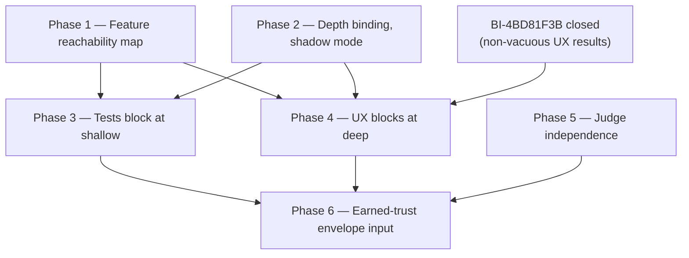

# Plan — Verification-First Workroom Gates

- **Date:** 2026-08-28
- **Design:** [`2026-08-28-verification-first-workroom-gates-design.md`](../specs/2026-08-28-verification-first-workroom-gates-design.md)
- **Status:** Proposed. **Blocked on backlog coverage** — see §0.

---

## 0. Blocking precondition

This plan must not start until two things are true:

1. **Epic-overlap check against live state.** The DPF MCP server was unreachable for the authoring session, so no live epic or backlog query ran. `EP-WORK-CONVERGENCE`, `EP-1C37C089` (gate binding), `EP-QUALITY-RIGHTSIZING` and `EP-COWORKER-LIFECYCLE` are plausible existing owners of parts of this work. If one already covers a phase, that phase becomes an extension of it rather than new work.
2. **`BI-4BD81F3B` status confirmed.** Its existence is cited from a code comment in `build-process-matrix.ts`. Phase 4 depends on it being closed; if it is already closed, Phase 4 moves earlier.

Both are single queries once MCP is reachable. Neither is a design question.

## 1. Sequencing rationale

The order is forced by one rule: **never make a check blocking before it is trustworthy.** A gate that fires on a check people do not believe does not raise quality — it trains people to route around gates, and the credibility loss is shared by every gate beside it.

That puts the feature map first (it is what makes UX verification trustworthy), shadow mode second (it is what tells us the true blast radius), and the two blocking changes only after their respective preconditions.

## 2. Phase 1 — Feature reachability map

**Goal:** a verifying agent can navigate to any user-visible feature without guessing.

| Step | Work | Done when |
| --- | --- | --- |
| 1.1 | Define the reachability record: `feature`, `routes[]`, `entryPoints[]`, `selectors[]`, `preconditions` (seeded persona + state). | Type lands in the same package as the route manifest; no new package. |
| 1.2 | Derive what is derivable — routes from `route-manifest.json`, nav edges from the existing navigation configuration, selectors from existing test ids. | Generator produces a first map with zero hand-authoring. |
| 1.3 | Curate the gaps. Only features the generator cannot reach get hand-written entries. | Coverage report names every user-visible route with no reachability path. |
| 1.4 | Freshness guard, `--check` mode, wired into CI exactly as `doc-impact.generated.json` and the route manifest already are. | A route added without a map entry fails CI. |

**Gate for this phase:** `pnpm --filter web build`, targeted unit tests on the generator, and a manual spot check that three curated features resolve to a working navigation path on the canonical runtime.

**Risk:** a stale map is worse than no map, because it produces confident wrong navigation. Mitigated by 1.4 — freshness is enforced, not requested.

## 3. Phase 2 — Depth binding in shadow mode

**Goal:** learn the true blast radius of §4.1 before any verdict changes.

| Step | Work | Done when |
| --- | --- | --- |
| 2.1 | Add `verification-depth-satisfied` to `GATE_REQUIREMENTS` and implement its `checkRequirement` case per the design's depth table. | Unit tests cover all three declared depths against present/absent/failed evidence. |
| 2.2 | Thread the resolved `verificationDepth` onto gate evidence. It is already computed in `work-posture/resolve.ts`; this is plumbing to the gate's evidence bag, matching how `qualityFirst` and `deliverableSensitivity` already reach it via `rightsizingOptsFromEvidence`. | Gate receives the declared depth; no policy lists the requirement yet. |
| 2.3 | **Shadow mode.** Evaluate the requirement on every transition, record what it *would* have decided, change no verdict. | A report enumerates every transition that would newly block, by kind, size and depth. |
| 2.4 | Read the report. Decide per cell whether the block is correct or the declaration is wrong. | Written decision per affected cell. |

**Do not skip 2.3.** The back-compat invariant in `build-process-matrix.ts` is explicit that the default cell must stay byte-identical; shadow mode is how that is proven rather than asserted.

**Gate:** unit tests + `pnpm --filter web build`. No runtime behaviour changes in this phase, which is the point.

### Phase 2 execution record — 2026-08-29

The first replay was empty because build-linked rooms carried no declared or
derivable shape. Live evidence showed that the newer build plans already carry
the missing stakes signal through the existing rightsizing fields, so the
upstream dependency was repaired in `work-posture/derive.ts`: absent/low stays
inert, quality-first or elevated resolves `shallow`, and high sensitivity
resolves `deep`. The gate remains shadow-only and no lifecycle policy lists the
requirement.

Replaying the 25 recorded successful `phase:advance` transitions produced this
report (a recorded advance is the authoritative evidence that the transition
was allowed at the time):

| Kind | Size | Declared depth | Transitions | Would newly block |
| --- | --- | --- | ---: | ---: |
| feature | small | none | 8 | 0 |
| feature | medium | none | 7 | 0 |
| doc | large | none | 4 | 0 |
| fix | small | none | 4 | 0 |
| feature | medium | deep | 2 | 2 |

The affected transitions were `FB-259E67BD` (`ideate -> plan`) and
`FB-2D3B7516` (`build -> review`), both for missing typecheck evidence. The
former is not a valid future binding point because implementation has not yet
happened; the latter is the intended shape of a future depth-bound refusal.
Two of 25 (`8%`) is neither empty nor enormous, so Phase 2 is calibrated enough
to deliver while Phases 3–6 remain separate backlog work.

## 4. Phase 3 — Tests block at `shallow`

**Goal:** close finding 1 — failing tests stop advancing work.

| Step | Work | Done when |
| --- | --- | --- |
| 3.1 | Read `verificationOut.testsFailed` in the depth check at `shallow` and above. | One-line logic change, tests cover `0`, `>0`, `undefined`. |
| 3.2 | Burn down whatever Phase 2's report showed. Pre-existing failures are fixed or explicitly recorded — never silently deferred (AGENTS.md §4). | Report clean, or every exception documented with an owner. |
| 3.3 | Add the requirement to the policy cells that declare `shallow` or deeper. | Matrix updated; cells not declaring depth untouched. |

**Rollback:** remove the requirement from the affected policy cells. The requirement's implementation can stay — an unused entry in the requirement list changes nothing, so rollback is one edit to the policy table rather than a code revert.

## 5. Phase 4 — UX verification blocks at `deep`

**Preconditions, both hard:** Phase 1 shipped, and `BI-4BD81F3B` closed.

| Step | Work | Done when |
| --- | --- | --- |
| 4.1 | Define "non-vacuous" mechanically — a result that names the feature reached, the assertion evaluated, and the observed outcome. A pass with no navigation evidence is vacuous and counts as not-run. | Predicate implemented and unit tested against recorded real results, including known-vacuous ones. |
| 4.2 | At `deep`, require `complete` + non-vacuous. Leave `shallow` on today's advisory behaviour. | `uxVerification-not-blocking` retained verbatim for `shallow`; the depth check owns the `deep` tier. |
| 4.3 | Re-read the 2026-06-07 operator decision against the new behaviour and confirm the CLI-serving-build path still ships on CLI evidence. | Written confirmation, or the decision is re-put to the operator before landing. |

Step 4.3 is not ceremony. The design claims this respects the operator's decision; that claim needs checking against the code path rather than against the design's own summary of it.

## 6. Phase 5 — Judge independence

Not implementation-first. This is a governance rule and must be set at the right altitude.

| Step | Work |
| --- | --- |
| 5.1 | `dpf-capture-kernel-gap` — the kernel cannot currently answer "may the author grade its own work?" |
| 5.2 | `principle_decide` on the rule as stated in the design's P4, including the single-family fallback. |
| 5.3 | `dpf-record-decision-outcome` either way. A recorded rejection is a good outcome and stops the next agent re-litigating it. |
| 5.4 | Only if adopted: enforce at the gate, and record the judging family on the receipt so a single-family receipt is distinguishable from a cross-family one. |

**Do not implement 5.4 before 5.2.** Inventing a governance rule in a plan is the altitude error the design explicitly avoids.

## 7. Phase 6 — Earned-trust envelope input

Last, because it consumes the record the earlier phases produce. A reliability signal computed over an empty history is noise wearing the costume of evidence.

| Step | Work |
| --- | --- |
| 6.1 | Define the reliability signal over existing certification verdicts — per coworker, per work class, over a window. |
| 6.2 | Asymmetric movement: sustained green widens slowly, a fabrication finding narrows at once. |
| 6.3 | Hand the signal to the posture design's §9 decomposition, which owns the ladder join. Do **not** build a second join here. |

## 8. Doctrine work, landed alongside

| Change | Where |
| --- | --- |
| Kernel principle — enforcement layers are ranked; a rule enforced only by a skill is a wish | `docs/founder-kernel/wiki/principles/` |
| Kernel principle — a repeated human correction is a missing gate | `docs/founder-kernel/wiki/principles/` |
| AGENTS.md §4 — give "exercise the affected path" a defined evidence shape tied to the depth ladder | `AGENTS.md` |
| `dpf-route-learning-to-commons` — twice-is-a-pattern trigger | `packages/dpf-skill-pack/skills/` |

Each rides the PR of the phase that makes it true, not a separate documentation PR — the Spec/Plan/Doc gate is satisfied by the phase PR itself.

## 9. Verification per phase

Every phase is source-local except where noted, so the tiered gate applies: typecheck, lint, affected unit tests locally; the heavy build runs once in the cloud merge queue.

- Phases 2, 3, 5: pure source logic. Unit tests + `pnpm --filter web build`.
- Phase 1: generator unit tests, plus **runtime-bound** spot checks against the canonical runtime or a governed shared nonprod lease — never a hand-built image.
- Phase 4: runtime-bound. Needs recorded real UX results, including known-vacuous ones, to test the predicate against.
- Phase 6: source logic over recorded verdicts; no runtime dependency.

## 10. What would make this plan wrong

Stated so it can be falsified rather than defended:

- **If Phase 2's shadow report is empty**, then no live work declares `shallow` or `deep`, the posture layer's depth derivation is not reaching real transitions, and the first fix is upstream in `work-posture/derive.ts` — not at the gate. The plan would restart from there.
- **If the report is enormous**, the depth derivation is over-declaring and needs calibration before any binding. Either way, Phase 2 is the measurement that decides, which is why it cannot be skipped.
- **If `BI-4BD81F3B` turns out to be unfixable** with the current browser-use approach, Phase 4 does not proceed by lowering the bar. The correct response is to replace the UX verification mechanism, and that is a different design.
