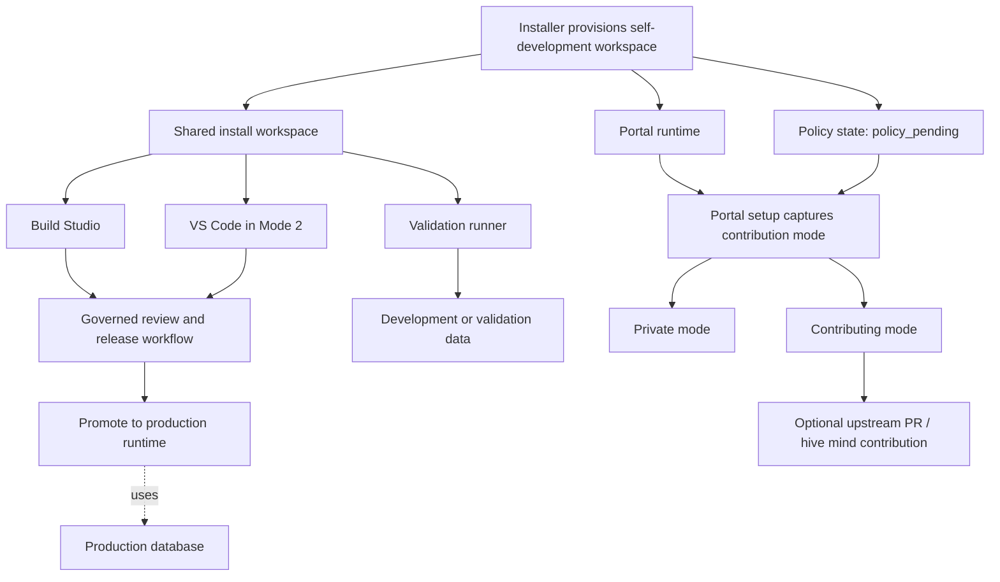

# Shared Workspace Mode Design

**Date:** 2026-04-05  
**Status:** Draft  
**Scope:** install modes, shared development workspace, Build Studio and VS Code alignment, deferred contribution onboarding, and governed promotion flow  
**Related specs:**  
- [2026-03-22-production-install-design.md](/d:/DPF/docs/superpowers/specs/2026-03-22-production-install-design.md)  
- [2026-03-27-build-studio-source-lifecycle-design.md](/d:/DPF/docs/superpowers/specs/2026-03-27-build-studio-source-lifecycle-design.md)  
- [2026-04-01-contribution-mode-git-integration-design.md](/d:/DPF/docs/superpowers/specs/2026-04-01-contribution-mode-git-integration-design.md)  
- [2026-03-19-sandbox-execution-db-isolation-design.md](/d:/DPF/docs/superpowers/specs/2026-03-19-sandbox-execution-db-isolation-design.md)

## Overview

The platform currently has the right building blocks for self-development, but the user experience still implies disconnected worlds:

- Build Studio behaves like a separate sandbox lifecycle
- VS Code behaves like a separate developer workflow
- contribution mode appears tied too closely to install decisions
- production-like debugging data, validation runs, and release governance are not yet explained as one operating model

The intended future is not two different development systems. It is one development system with two interfaces:

- **Build Studio** for guided, governed, non-developer-friendly work
- **VS Code** for advanced developer workflows

Both must operate against the **same shared codebase** for a given installation. Governance, release, and hive-mind contribution then layer on top of that shared workspace instead of creating separate authoring environments.

## Problem Statement

The current disconnect creates several failures:

1. Build Studio and VS Code can drift because they are treated as different work surfaces instead of two interfaces over one workspace.
2. Users cannot easily understand how install mode, contribution mode, source lifecycle, and promotion governance fit together.
3. Build Studio sandboxes are optimized for isolation and safe execution, but that isolation has also been interpreted as a separate authoring model.
4. Mode 2 users still need VS Code because Build Studio tools are not yet broad enough, but the workflow lacks a clear contract for how both tools coexist.
5. Contribution mode is important, but asking for Git credentials and remote configuration during install adds friction before the portal is even running.
6. Production-like debugging needs realistic data without exposing the production database to corruption.

## Goals

1. Define one shared development workspace per install.
2. Make Build Studio and VS Code operate on the same codebase and branch in Mode 2.
3. Keep Mode 1 and Mode 2 aligned under the same underlying source model.
4. Defer contribution configuration until the portal is running, while still introducing the concept during install.
5. Ensure production promotion always flows through portal governance.
6. Keep production data separated from development and validation data.
7. Align VS Code utilities and documentation with the shared-workspace model.
8. Support future hive-mind contribution cleanly across many installs without branch sprawl.

## Non-Goals

1. Making the production runtime container the primary coding workspace.
2. Creating separate long-lived authoring codebases for Build Studio and VS Code.
3. Requiring Git tokens or upstream contribution configuration during installer flow.
4. Forcing per-feature long-lived branches for everyday development.
5. Replacing Build Studio governance with raw IDE workflows.

## Research & Benchmarking

### Current DPF patterns

The current platform already contains three relevant patterns:

- a persistent source volume and bootstrapped workspace for containerized installs
- isolated sandbox execution for Build Studio
- a VS Code dev container for a full developer workflow

The weakness is not lack of infrastructure. It is lack of one unified operating model explaining how these pieces fit together.

### VS Code Dev Containers guidance

VS Code Dev Containers distinguishes between:

- a full development environment opened in a container
- attaching to a running container for inspection or debugging

That matches the platform's needs: the live runtime container should not be treated as the main coding workspace, while a dedicated shared development workspace can support containerized development cleanly.  
Source: [VS Code Dev Containers docs](https://code.visualstudio.com/docs/devcontainers/containers)

### Pattern adopted

Adopt a **shared authoring workspace plus governed portal release** model:

- one shared codebase per install
- Build Studio and VS Code as two interfaces over that workspace
- portal-governed promotion and contribution
- transient validation runners for safe verification

### Patterns rejected

- separate Build Studio and VS Code source trees
- direct development in the live production portal container
- asking for contribution credentials during install
- many long-lived feature branches per install
- treating isolated sandbox execution as the canonical authoring source

## Design Summary

For self-developing installs, the platform should always provision:

1. a **production runtime**
2. a **shared install workspace**
3. a **transient validation runner**

Install modes then differ only by interface access:

- **Mode 1**: Build Studio uses the shared workspace; VS Code is not exposed as part of the supported install surface
- **Mode 2**: Build Studio and VS Code both use the same shared workspace

Contribution mode is not decided during install. Instead:

- the installer introduces the concept
- the install begins in `policy_pending`
- the portal later captures whether the install is `private` or `contributing`

Release and contribution are always gated by the portal.

## Core Operating Model

### One shared codebase per install

Every self-developing install uses one durable source workspace. There is no separate "Build Studio codebase" and no separate "VS Code codebase."

That workspace is:

- the source of truth for local modifications on that install
- the workspace Build Studio reads and writes
- the workspace VS Code reads and writes in Mode 2
- the source used to create validation runs and contribution exports

### Environment model

#### 1. Production runtime

The live application and live database used by the running install.

- serves end users
- remains isolated from day-to-day development changes
- is never the primary coding workspace

#### 2. Shared install workspace

The durable authoring environment for that installation.

- one source tree
- one durable install branch
- shared by Build Studio in both modes
- also used by VS Code in Mode 2

#### 3. Validation runner

A transient environment used for preview, build, migration rehearsal, tests, and destructive verification.

- not treated as a second persistent authoring workspace
- may reset or be recreated freely
- exists to validate work, not to own the canonical source

## Install Modes

### Mode 1: Portal-guided development

Mode 1 is for users who want the platform's self-development capabilities without a direct IDE workflow.

Characteristics:

- shared workspace still exists
- Build Studio is the supported authoring surface
- VS Code is not part of the expected user workflow
- contribution mode is still introduced during install and configured later in the portal

### Mode 2: Portal + VS Code development

Mode 2 is for power users who want direct source access in addition to Build Studio.

Characteristics:

- same shared workspace as Mode 1
- Build Studio and VS Code both author against the same files and git state
- Build Studio remains the governed release and contribution path
- VS Code provides broader tooling until Build Studio reaches parity

### Important distinction

The difference between Mode 1 and Mode 2 is **not** contribution policy. Both modes can be private or contributing. The difference is whether VS Code is part of the supported development surface.

## Contribution Mode Lifecycle

### Deferred configuration

Contribution mode should be introduced during install but not configured there.

Reasons:

- first-time install already takes significant time
- users should not be blocked on GitHub tokens, forks, or remote setup before understanding the portal
- contribution policy belongs to platform governance, not raw installer plumbing

### Install-time introduction

The installer should show a short "while you wait" explanation for both Mode 1 and Mode 2:

- this install can later remain private or contribute improvements through the hive mind
- that choice will be presented during portal setup
- no Git token or repository setup is required yet
- frontier-capable models provide the strongest AI-assisted development experience

Recommended installer copy:

> Digital Product Factory can be used privately on this install or configured later to contribute improvements back through the hive mind workflow. That choice will be presented during portal setup, so you do not need a GitHub token or repository setup yet. If you plan to build features with AI assistance, a frontier-capable model will provide the strongest development experience. While setup finishes, this is a good time to think about whether your organization is likely to keep changes local or contribute improvements upstream.

## Policy States

Every self-developing install starts in `policy_pending`.

### `policy_pending`

Allowed:

- Build Studio authoring
- Mode 2 VS Code authoring
- testing and validation
- documentation and spec/plan generation

Blocked:

- production promotion
- hive-mind / upstream contribution

### `private`

Allowed:

- governed promotion to the local production portal

Blocked:

- upstream contribution

### `contributing`

Allowed:

- governed promotion to the local production portal
- governed upstream contribution through the portal workflow

### Governing principle

**Shared authoring is allowed before policy is set. Shipping and sharing are not.**

## Workspace and Branch Strategy

### Durable install branch

Each install should use one durable branch, for example:

- `install/<install-slug>`

This branch is the normal home for all local work on that installation.

### Export branches

Short-lived export branches are created only when contributing upstream, for example:

- `export/<backlog-item-or-feature-id>-<slug>`

These exist only to support clean PRs to the common repository and should be deleted after merge or closure.

### Why this model

This avoids:

- orphaned local feature branches
- divergence between Build Studio and VS Code
- needless branch overhead for small installs

It also supports scale cleanly because many installs can each maintain one durable local branch while still contributing selected work upstream.

## Data Boundaries

Code sharing and data isolation must be treated separately.

### Production database

- used only by the live runtime
- never used as the mutable development or test database

### Shared development database

- holds production-like data for realistic debugging
- should be sanitized or safely cloned
- supports both Build Studio and Mode 2 VS Code workflows

### Validation/test database

- transient clone or resettable environment
- used for migration rehearsal, destructive verification, and isolated tests

### Principle

**One shared codebase does not imply one shared mutable database.**

## Build Studio and VS Code Responsibility Split

### Shared responsibilities

Both Build Studio and VS Code can:

- create and modify code in the shared workspace
- inspect specs and plans
- run tests and debug behavior

### Build Studio owns

- guided workflow for non-developers
- review gates and approval process
- release evidence and traceability
- portal-governed production promotion
- portal-governed upstream contribution

### VS Code owns

- broad editing and debugging tools
- developer productivity workflows
- advanced local investigation where Build Studio still lacks capability

### Key rule

VS Code extends authoring capability, but Build Studio remains the governed delivery interface.

## Validation Runner Contract

The validation runner exists to support safe execution, not parallel authorship.

It should:

- start from the shared install workspace
- run builds, previews, tests, and migration rehearsal
- use non-production data
- be disposable and reproducible

It should not:

- become the long-lived canonical source of edits
- hide file changes from the shared workspace
- create a separate day-to-day development lifecycle

## VS Code Utility Alignment

The VS Code project utilities should reflect the shared-workspace model instead of implying a separate developer universe.

### Required adjustments

- task names should distinguish workspace actions from production actions
- release-oriented tasks should not imply bypass of portal governance
- sandbox or validation tasks should be clearly labeled as transient verification environments
- VS Code should not default to attaching directly to the validation sandbox as if it were the primary workspace

### Documentation expectation

The repo's `.vscode` tasks and launch configuration should align with:

- shared install workspace
- separate production runtime
- transient validation runner
- portal-governed ship and contribution flow

## Documentation Package

This design should be documented in three layers.

### 1. Install-time guidance

Short explanation during install to introduce later contribution choice and frontier-model recommendation.

### 2. Doc-site operating guide

A canonical user-facing guide explaining:

- Mode 1 versus Mode 2
- one shared codebase per install
- contribution mode states
- production, development, and validation boundaries
- Build Studio and VS Code roles
- governed promotion and contribution flow

Recommended primary doc targets:

- `docs/user-guide/build-studio/index.md`
- `docs/user-guide/build-studio/sandbox.md`
- a new install/development operating guide under `docs/user-guide/`

### 3. README summary

A concise explanation in the README that points readers to the fuller doc-site guidance.

Recommended README touchpoints:

- install mode comparison table
- developer setup / dev container setup summary
- Build Studio overview summary

## Diagram

The doc-site guide should include a Mermaid diagram showing shared authoring and governed promotion.

## Implementation Implications

This design implies the following downstream work areas:

1. clarify installer messaging for both modes
2. formalize `policy_pending`, `private`, and `contributing`
3. align shared workspace provisioning across Mode 1 and Mode 2
4. realign Build Studio language away from "separate authoring sandbox"
5. update VS Code tasks and launch configuration to match the governed model
6. add user-facing documentation and diagrams to the doc site and README

These should be planned separately from this design document.

## Risks

- leaving Build Studio and VS Code semantics ambiguous, which preserves drift
- allowing production promotion outside the portal, weakening regulated process
- keeping validation runners positioned as a second coding workspace
- delaying documentation, which would leave users guessing how Mode 1 and Mode 2 differ
- overcomplicating branch strategy per install

## Success Criteria

This design is successful when:

- Mode 1 and Mode 2 share the same underlying source model
- Build Studio and Mode 2 VS Code users see the same code changes in the same workspace
- production promotion always goes through portal governance
- contribution mode is introduced early but configured later in the portal
- users can debug against realistic data without corrupting production
- the doc site explains the model clearly enough that users understand it without reverse-engineering the compose stack

## Recommended Direction

Adopt a **shared-workspace, portal-governed development model**:

- one shared codebase per install
- one durable install branch per install
- Mode 1 uses Build Studio over that workspace
- Mode 2 uses Build Studio and VS Code over that same workspace
- contribution policy is introduced during install but configured later in the portal
- production promotion and upstream contribution always flow through portal governance
- validation runners remain disposable verification environments, not separate authoring homes
