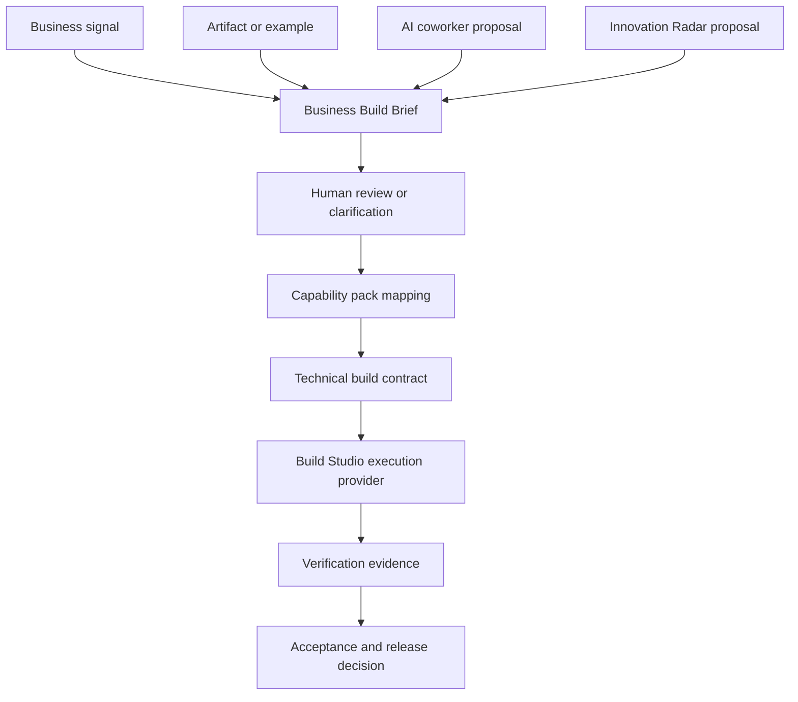

# Build Studio Business Intake and Innovation Radar Design

**Date:** 2026-05-10
**Status:** Draft approved for implementation planning
**Owner:** Build Studio / AI Workforce
**Related specs:** [Build Studio Redesign](2026-04-25-build-studio-redesign-design.md), [Build Specialist Operator Contract](2026-04-30-build-specialist-operator-contract.md), [Build Execution Provider Architecture](2026-05-09-build-execution-provider-design.md), [AI Coworker Operator Pattern](2026-04-30-ai-coworker-operator-pattern.md)

## 1. Purpose

Build Studio should not ask non-developers to describe code. It should help them describe a business change, attach or reference evidence, compare against something that already works, and let the platform translate that into governed build work.

This design adds two upstream layers before technical execution:

1. **Business Build Brief** - a business-readable artifact that captures outcome, affected workflow, source evidence, examples, risks, success signals, and open questions.
2. **Proactive Innovation Radar** - a recurring market and product-learning loop where AI coworkers research leaders, extract DPF-relevant patterns, and propose governed improvements.

The output of these layers feeds the existing Build Studio execution path. Claude Code, Codex, and the internal agentic loop remain execution providers downstream; they should receive a precise technical build contract only after DPF has interpreted the business intent.

## 2. Problem

The current Build Studio path still assumes the user can participate in a developer-shaped process. That breaks down for install owners, operations leaders, finance leads, customer support managers, sales teams, and other non-developer users. These users usually know:

- what workflow is painful,
- who is affected,
- what document or example shows the desired outcome,
- what business risk matters,
- what outcome would count as success.

They often do not know:

- which schema model should change,
- which route or component owns the surface,
- how to phrase acceptance criteria as tests,
- how to map the idea into Claude Code or Codex instructions.

Separately, AI product capabilities change daily. DPF needs a governed way to learn from leaders such as Claude Design, Claude plugins/skills, Codex, Cursor, Devin, Replit, Lovable, v0, Salesforce, ServiceNow, Microsoft, HubSpot, and Shopify without copying features blindly. The platform should extract capability patterns, decide whether they fit DPF, and file proposed improvements with evidence and attribution.

## 3. Goals

1. Let non-developers initiate Build Studio work with business context, documents, screenshots, spreadsheets, examples, or coworker-submitted problems.
2. Convert fuzzy or evidence-heavy input into a structured Business Build Brief before any technical execution.
3. Treat "make it work like this" as a first-class intake pattern, including examples from existing DPF workflows, external tools, documents, or artifacts.
4. Let AI coworkers submit backlog/build proposals with attribution, evidence, confidence, and impacted personas.
5. Add a proactive market-learning loop that researches leaders, identifies DPF-relevant capability patterns, and proposes governed improvements.
6. Keep technical execution downstream and auditable: Build Studio generates a technical build contract only after the business brief is accepted.
7. Preserve DPF's governance model: tool grants, human review, backlog attribution, evidence records, and implementation verification remain mandatory.

## 4. Non-Goals

- This does not replace the existing Build Studio v2 shell. It defines the upstream intake and proposal model that the shell should surface.
- This does not make DPF a clone of Claude Design, Codex, or any external product.
- This does not allow AI coworkers to ship market-inspired changes without human review.
- This does not require a new coding agent runtime in the first slice. Native Claude Code and Codex parity belongs after the business brief layer.
- This does not make market research a generic web-scraping firehose. The radar is scoped to specific leaders, product categories, and DPF capability areas.

## 5. Research and Benchmarking

### Claude Design

Claude Design shows the value of letting users move from rough context to polished visual artifacts without forcing an implementation-first prompt. The DPF pattern to adopt is not a standalone design toy; it is artifact-based interpretation. Build Studio should accept sketches, screenshots, documents, and "make it like this" examples, then turn them into a business brief and implementation-ready acceptance model.

Adopt:

- conversational artifact creation,
- reviewable visual/business outputs before code,
- handoff from design/artifact to implementation.

Reject:

- treating visual polish as sufficient delivery evidence,
- bypassing DPF's data model, workflow, compliance, and verification gates.

### Claude Skills and Plugins

Claude plugins bundle skills, connectors, and subagents for domains such as sales, finance, legal, marketing, HR, design, operations, engineering, and data analysis. The DPF pattern to adopt is a governed capability pack: a reusable bundle of business vocabulary, intake prompts, evidence expectations, connected systems, coworker roles, and build verification norms.

Adopt:

- domain-specific skills and work instructions,
- connector-aware intake,
- subagent/coworker specialization by business capability.

Reject:

- unreviewed external tool adoption,
- domain packs that only relabel the UI without real workflows, data, and verification.

### Codex

Codex emphasizes durable repo guidance (`AGENTS.md`), MCP tool context, skills, subagents, hooks, approvals, and repeatable automation. The DPF pattern to adopt is that execution agents work best when the platform provides durable instructions, configured tools, and a clear definition of done.

Adopt:

- durable guidance over repeated prompt stuffing,
- MCP-backed context and tools,
- explicit approval/sandbox profiles,
- review and verification loops before accepting work.

Reject:

- giving raw fuzzy business input directly to coding agents,
- treating successful code generation as equivalent to business acceptance.

### AI Work Platforms

Products such as Cursor, Devin, Replit, Lovable, v0, Salesforce, ServiceNow, Microsoft, HubSpot, and Shopify are relevant as pattern sources. DPF should watch for workflow capabilities: business-user intake, artifact transformation, autonomous review, operational copilots, customer support workflows, sales/CRM actions, finance controls, and marketplace extensions.

Adopt:

- leader-pattern watchlists,
- capability-pattern extraction,
- business impact framing,
- proposed backlog slices with evidence.

Reject:

- copying surface-level UI motifs without a DPF operating-model reason,
- bypassing the Tool Evaluation Pipeline for external tools.

## 6. Core Concept: Business Build Brief

The Business Build Brief is the canonical upstream work product for Build Studio. It is business-readable first and technical only in a generated interpretation section.

### Fields

Required:

- `businessOutcome` - the operational result the user wants.
- `affectedPeople` - roles, teams, customers, or coworkers affected.
- `affectedWorkflow` - the current business process or surface.
- `sourceEvidence` - documents, screenshots, spreadsheets, examples, emails, coworker reports, market references, or existing DPF surfaces.
- `successSignals` - how a business user will know the change worked.
- `constraints` - policy, compliance, customer impact, budget, timing, or "must not break" constraints.
- `intakeSource` - `user_conversation`, `artifact_reference`, `existing_example`, `coworker_proposal`, or `innovation_radar`.

Generated by DPF:

- `businessInterpretation` - plain-English summary of what DPF believes the user wants.
- `capabilityPackMapping` - relevant domain pack such as operations, customer support, finance, sales, marketing, design, platform governance, or Build Studio itself.
- `riskProfile` - customer-facing, compliance-sensitive, revenue-impacting, data-model-impacting, operational-risk, or low-risk.
- `technicalInterpretation` - likely data, UI, workflow, integration, permission, and verification implications.
- `openQuestions` - only questions blocking responsible interpretation.
- `confidence` - high, medium, or low, with reasons.

### Business-Language Acceptance Criteria

The first acceptance criteria should be stated in business language, for example:

- "A support manager can see unresolved customer issues by site before the morning standup."
- "A finance lead can compare invoice totals against the source spreadsheet without opening the raw import."
- "A customer can complete the intake form without knowing internal service categories."

Build Studio later translates those into technical checks, tests, and UX verification steps.

## 7. Intake Paths

### 7.1 Business Conversation

The user describes the change in ordinary business terms. Build Studio asks a short sequence of focused questions about outcome, affected workflow, examples, risk, and success. It should not ask for model names, route names, tables, components, or test files unless the user volunteers them.

### 7.2 Referenced Artifact

The user attaches or references a document, spreadsheet, screenshot, email, vendor guide, SOP, prior proposal, or design artifact. Build Studio extracts:

- what the artifact proves,
- what pattern should be reused,
- what should be adapted,
- what should be avoided,
- what assumptions need confirmation.

### 7.3 Existing Working Example

The user references something that already works in DPF or another system. Build Studio compares the target change against the example and generates a brief using "copy / adapt / avoid" language.

Examples:

- "Make customer onboarding work like the employee setup flow."
- "Use the finance approval pattern, but for service tickets."
- "This spreadsheet is how we do it today; make the portal support the same business review."

### 7.4 AI Coworker-Originated Need

A coworker detects a recurring issue, missing capability, market opportunity, or process gap. It submits an intake proposal with:

- submitting coworker id and role,
- evidence,
- impacted workflow,
- suggested business outcome,
- confidence,
- whether it is a problem, improvement, or new feature,
- backlog relationship if one exists.

This preserves attribution and makes coworker submissions governed platform work, not chat residue.

### 7.5 Innovation Radar Signal

The radar identifies a market or leader pattern and proposes a DPF-relevant improvement. The proposal must state:

- what changed in the market,
- which leader or product demonstrates the pattern,
- why it matters to DPF,
- which DPF capability pack is affected,
- whether DPF should adopt, adapt, monitor, or reject the pattern,
- suggested backlog/build slices.

## 8. Capability Packs

Capability packs are DPF's governed counterpart to external skill/plugin bundles. They are not only labels. Each pack defines:

- business vocabulary,
- intake prompts,
- evidence expectations,
- common workflows,
- relevant coworkers,
- likely connectors,
- risk rules,
- standard acceptance criteria,
- verification norms,
- backlog taxonomy hints.

Initial packs:

- Operations
- Customer Support
- Finance
- Sales
- Marketing
- Design / UX
- Platform Governance
- Build Studio / Self-Development

Capability packs should reuse existing DPF skills and prompts where possible. New skills live under `skills/<category>/<name>.skill.md` and belong to coworkers, not routes.

## 9. Proactive Innovation Radar

The Innovation Radar is a recurring research loop, not a one-time spec exercise.

### Inputs

- official product docs and release notes,
- trusted leader blogs and changelogs,
- open-source repositories and data models,
- commercial product announcements,
- DPF coworker observations,
- user feedback and repeated Build Studio failure modes.

### Output

An `InnovationProposal` work product:

- title,
- source links and retrieval date,
- leader/product observed,
- pattern extracted,
- DPF capability area,
- user/business impact,
- adopt/adapt/monitor/reject recommendation,
- proposed backlog items,
- confidence and uncertainty,
- submittedBy agent/user,
- review status.

### Governance

Radar proposals do not directly become implementation work. They move through:

1. proposal creation,
2. human or delegated review,
3. backlog item creation or rejection,
4. Business Build Brief generation,
5. Build Studio execution.

## 10. Data Model Direction

First implementation should prefer extending existing Build Studio and backlog models where possible. If new persistence is needed, use additive models rather than overloading JSON fields beyond reviewability.

Candidate models:

```prisma
model BusinessBuildBrief {
  id                     String   @id @default(cuid())
  briefId                String   @unique
  featureBuildId         String?
  backlogItemId          String?
  intakeSource           String
  businessOutcome        String
  affectedPeople         String[]
  affectedWorkflow       String?
  sourceEvidence         Json     @default("[]")
  successSignals         String[]
  constraints            String[]
  businessInterpretation String
  capabilityPackMapping  String?
  riskProfile            Json     @default("{}")
  technicalInterpretation Json    @default("{}")
  openQuestions          String[]
  confidence             String
  submittedByAgentId     String?
  submittedByUserId      String?
  createdAt              DateTime @default(now())
  updatedAt              DateTime @updatedAt
}

model InnovationProposal {
  id                    String   @id @default(cuid())
  proposalId            String   @unique
  title                 String
  leaderProduct         String
  sourceLinks           Json     @default("[]")
  observedAt            DateTime
  patternExtracted      String
  dpfCapabilityArea     String
  recommendation        String
  proposedBacklog       Json     @default("[]")
  confidence            String
  reviewStatus          String
  submittedByAgentId    String?
  submittedByUserId     String?
  createdAt             DateTime @default(now())
  updatedAt             DateTime @updatedAt
}
```

Open design decision: whether `BusinessBuildBrief` should be a new model immediately or first be stored in existing `FeatureBuild.brief` as a typed JSON contract. The first implementation plan should inspect current `FeatureBuild.brief` usage and choose the least disruptive path.

## 11. UI Design

Build Studio should present intake as a business conversation with evidence panels, not a developer form.

### First Screen

Primary choices:

- Describe a business change
- Use a document or artifact
- Start from something that already works
- Review coworker proposal
- Review market radar proposal

### Brief Builder

The brief builder shows:

- business outcome,
- affected workflow,
- people impacted,
- evidence attached,
- success signals,
- risks and constraints,
- DPF interpretation,
- open questions.

Technical interpretation is collapsed by default and labeled as "How DPF will likely build this."

### Radar Review

Radar proposals should appear as short review cards:

- "What changed"
- "Why it matters"
- "DPF fit"
- "Suggested next slice"
- actions: adopt into backlog, request more research, monitor, reject.

### Visual Standards

Follow DPF theme-aware styling:

- use `var(--dpf-*)` tokens,
- avoid hardcoded colors,
- use progressive disclosure,
- use compact operational panels rather than marketing hero layouts,
- make the business brief scannable for non-technical users.

## 12. Execution Flow



The technical build contract should include:

- data/model implications,
- UI surfaces,
- workflow steps,
- permission and governance implications,
- acceptance tests,
- UX verification path,
- execution provider fit (`agentic`, `claude-code`, `codex`).

## 13. Implementation Slices

### Slice 1 - Business Build Brief Contract

- Define typed `BusinessBuildBrief` contract.
- Add converter from existing `FeatureBuild.brief` / backlog item / coworker proposal into the contract.
- Add tests for business-language intake and generated technical interpretation shape.
- Add UI read surface in Build Studio v2 using static/demo data or existing build data.

### Slice 2 - Referenced Artifact and Existing Example Intake

- Add source evidence typing for docs, screenshots, spreadsheets, URLs, existing DPF routes, and backlog items.
- Add "copy / adapt / avoid" interpretation.
- Add UI controls for selecting or attaching evidence.

### Slice 3 - Coworker-Originated Proposal Intake

- Let coworkers submit structured Business Build Brief candidates with attribution.
- Link proposals to backlog items and Build Studio builds.
- Preserve submitter attribution in backlog-facing workflows.

### Slice 4 - Innovation Radar Proposal Model

- Add `InnovationProposal` persistence or a typed interim JSON contract.
- Add reviewed proposal cards.
- Add MCP/backlog action to convert approved proposals into backlog items.

### Slice 5 - Native Execution Provider Parity

- Add `BuildAgentRuntimeContract` for `agentic`, `claude-code`, and `codex`.
- Ensure coding agents receive native runtime instructions rather than internal DPF tool lists.
- Surface execution-provider capability truth in Build Studio.

## 14. Acceptance Criteria

- A non-developer can start a Build Studio request without naming code files, routes, schema models, or tests.
- Build Studio can produce a business-readable brief from a conversation, an artifact/reference, an existing example, or a coworker proposal.
- Every generated technical build contract links back to business outcome and evidence.
- AI coworker-originated proposals preserve submitting coworker attribution.
- Innovation Radar proposals are reviewable and cannot directly create implementation work without approval.
- The UI keeps technical detail available but secondary.
- The implementation preserves DPF theme tokens and existing Build Studio governance.

## 15. Risks and Mitigations

| Risk | Mitigation |
| - | - |
| Business intake becomes vague prose | Require success signals, affected workflow, evidence, and confidence before technical execution. |
| Radar becomes noisy | Use watchlists, capability areas, confidence, and review status; default to monitor/reject when DPF fit is unclear. |
| Coworkers flood backlog | Require proposal review and attribution before backlog conversion. |
| Technical agents receive fuzzy input | Generate and review the technical build contract after the business brief is accepted. |
| Capability packs become labels only | Require workflows, evidence expectations, verification norms, and coworker/tool mappings. |
| External-product copying creates drift | Extract patterns, not features; every proposal must state DPF fit and rejected aspects. |

## 16. Open Questions

1. Should `BusinessBuildBrief` land as a first-class Prisma model in Slice 1, or should Slice 1 type and normalize the existing `FeatureBuild.brief` JSON first?
2. Which capability pack should be implemented first for live use: Operations, Customer Support, Finance, Sales, or Build Studio itself?
3. Should Innovation Radar run as a scheduled coworker task, a manual research command, or both?
4. Which external leaders belong in the default watchlist for the first radar slice?
5. How should artifact extraction handle sensitive documents and customer data in local installs?
