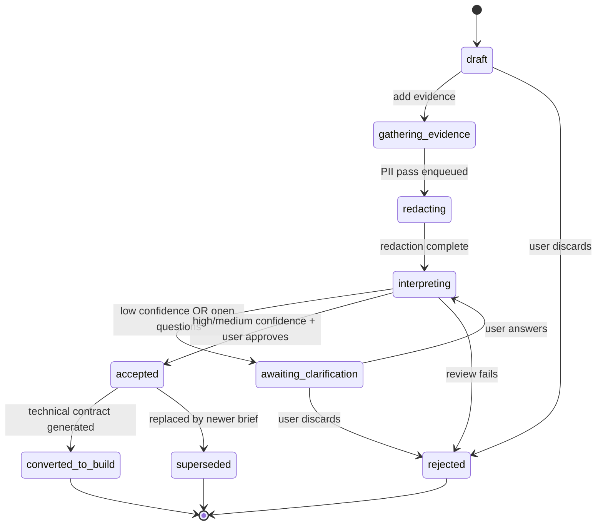
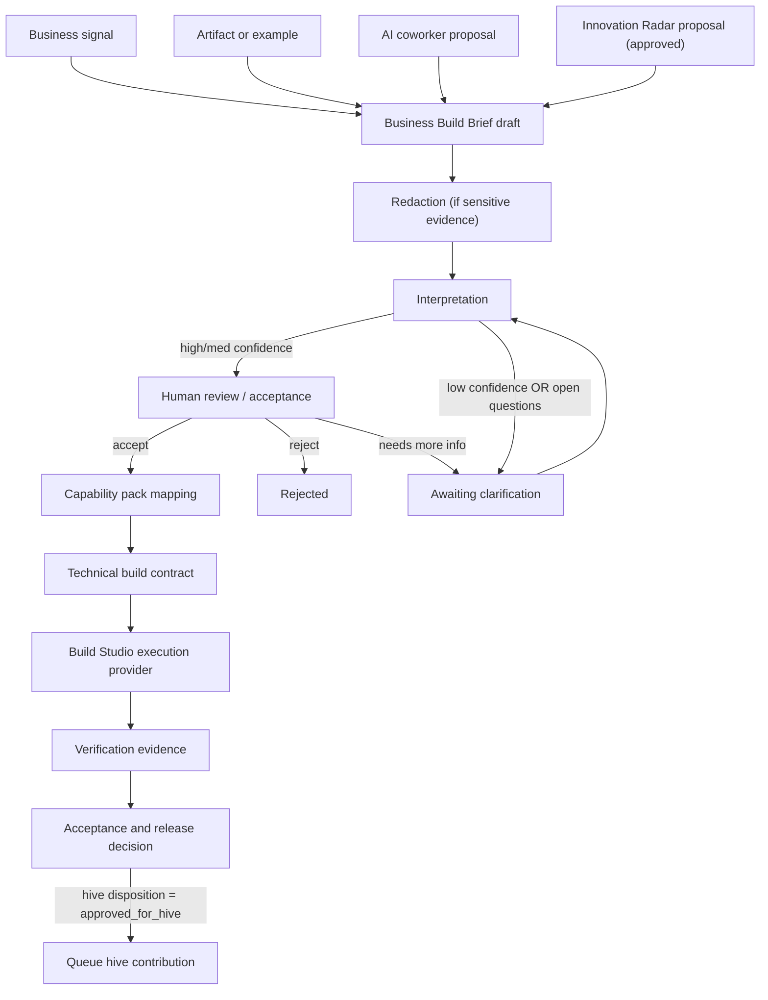

# Build Studio Business Intake and Innovation Radar Design

**Date:** 2026-05-10
**Status:** Draft, revised 2026-05-10 after Chief Architect / COO review — open questions resolved in §17 Decisions
**Owner:** TBD — single accountable person required before plan-writing (per AGENTS.md §4 PR ownership). Suggested: Build Studio tech lead.
**Related specs:**
- [Build Studio Redesign](2026-04-25-build-studio-redesign-design.md)
- [Build Specialist Operator Contract](2026-04-30-build-specialist-operator-contract.md)
- [Build Execution Provider Architecture](2026-05-09-build-execution-provider-design.md)
- [AI Coworker Operator Pattern](2026-04-30-ai-coworker-operator-pattern.md)
- [Capability Pack Foundation](2026-05-10-capability-pack-foundation-design.md) *(sibling spec — extracted from §8 of this document; required dependency for Slice 1)*
- [Tool Evaluation Pipeline](2026-03-25-tool-evaluation-pipeline-design.md)
- [Deployment Contracts](2026-05-09-deployment-contracts.md)

## 1. Purpose

Build Studio should not ask non-developers to describe code. It should help them describe a business change, attach or reference evidence, compare against something that already works, and let the platform translate that into governed build work.

This design adds two upstream layers before technical execution:

1. **Business Build Brief** — a business-readable artifact that captures outcome, affected workflow, source evidence, examples, risks, success signals, and open questions.
2. **Proactive Innovation Radar** — a recurring market and product-learning loop where AI coworkers research leaders, extract DPF-relevant patterns, and propose governed improvements.

The output of these layers feeds the existing Build Studio execution path. Claude Code, Codex, and the internal agentic loop remain execution providers downstream; they should receive a precise technical build contract only after DPF has interpreted the business intent.

## 1.5 IT4IT Alignment

Per [project_it4it_foundation.md] every feature aligns to an IT4IT v3.0.1 value stream. This work spans two:

| Value stream | This spec's contribution |
| - | - |
| **Strategy to Portfolio (S2P)** | Business Build Brief intake (§7.1–7.4); Innovation Radar proposal lifecycle (§9); Capability Pack mapping (§8) |
| **Requirement to Deploy (R2D)** | Brief → technical build contract handoff (§12); execution-provider routing (delegated to [Build Execution Provider Architecture](2026-05-09-build-execution-provider-design.md)) |

The brief layer is the **boundary artifact** between S2P and R2D. Anything happening before the brief is portfolio reasoning; anything after is delivery execution. This boundary is load-bearing — implementation must not blur it.

## 2. Problem

The current Build Studio path still assumes the user can participate in a developer-shaped process. That breaks down for install owners, operations leaders, finance leads, customer support managers, sales teams, and other non-developer users. These users usually know:

- what workflow is painful,
- who is affected,
- what document or example shows the desired outcome,
- what business risk matters,
- what outcome would count as success.

They often do not know:

- which schema model should change,
- which route or component owns the surface,
- how to phrase acceptance criteria as tests,
- how to map the idea into Claude Code or Codex instructions.

Today's measured baseline (per [project_build_studio_intake_improvements.md]): design-review failure rate is **~55% on first pass** when intake skips the Scout phase. The Scout-first variant lowered it to **~20%**. The brief layer formalizes Scout-first as the default path and targets the same 20% (or better) on first-pass design review.

Separately, AI product capabilities change daily. DPF needs a governed way to learn from leaders such as Claude Design, Claude plugins/skills, Codex, Cursor, Devin, Replit, Lovable, v0, Salesforce, ServiceNow, Microsoft, HubSpot, and Shopify without copying features blindly. The platform should extract capability patterns, decide whether they fit DPF, and file proposed improvements with evidence and attribution.

## 3. Goals

1. Let non-developers initiate Build Studio work with business context, documents, screenshots, spreadsheets, examples, or coworker-submitted problems.
2. Convert fuzzy or evidence-heavy input into a structured Business Build Brief before any technical execution.
3. Treat "make it work like this" as a first-class intake pattern, including examples from existing DPF workflows, external tools, documents, or artifacts.
4. Let AI coworkers submit backlog/build proposals with stable-pseudonym attribution (per [feedback_obfuscated_not_anonymous.md]), evidence, confidence, and impacted personas.
5. Add a proactive market-learning loop that researches leaders, identifies DPF-relevant capability patterns, and proposes governed improvements — without enrolling DPF as a partner of any watched product (per [feedback_dpf_as_integration_conduit.md]).
6. Keep technical execution downstream and auditable: Build Studio generates a technical build contract only after the business brief is accepted.
7. Preserve DPF's governance model: tool grants, human review, backlog attribution, evidence records, and implementation verification remain mandatory.
8. Cut first-pass design-review failure from 55% to ≤20% within one quarter of Slice 1 GA (success metric, see §18).

## 4. Non-Goals

- This does not replace the existing Build Studio v2 shell. It defines the upstream intake and proposal model that the shell should surface.
- This does not make DPF a clone of Claude Design, Codex, or any external product.
- This does not allow AI coworkers to ship market-inspired changes without human review.
- This does not require a new coding agent runtime. Native Claude Code / Codex parity is owned by [Build Execution Provider Architecture](2026-05-09-build-execution-provider-design.md) and is **out of scope here**.
- This does not make market research a generic web-scraping firehose. The radar is scoped to declared watchlists, capability areas, and DPF-relevant patterns.
- This does not enroll DPF in any external product's partner / API program. Watched-leader research is limited to publicly available, TOS-permitted material (§9.5).
- This does not introduce multi-tenant constructs — DPF remains single-org per install (per [project_single_org_per_install.md]).

## 5. Research and Benchmarking

### Claude Design

Claude Design shows the value of letting users move from rough context to polished visual artifacts without forcing an implementation-first prompt. The DPF pattern to adopt is not a standalone design toy; it is artifact-based interpretation. Build Studio should accept sketches, screenshots, documents, and "make it like this" examples, then turn them into a business brief and implementation-ready acceptance model.

Adopt:

- conversational artifact creation,
- reviewable visual/business outputs before code,
- handoff from design/artifact to implementation.

Reject:

- treating visual polish as sufficient delivery evidence,
- bypassing DPF's data model, workflow, compliance, and verification gates.

### Claude Skills and Plugins

Claude plugins bundle skills, connectors, and subagents for domains such as sales, finance, legal, marketing, HR, design, operations, engineering, and data analysis. The DPF pattern to adopt is a governed capability pack: a reusable bundle of business vocabulary, intake prompts, evidence expectations, connected systems, coworker roles, and build verification norms.

Adopt:

- domain-specific skills and work instructions,
- connector-aware intake,
- subagent/coworker specialization by business capability.

Reject:

- unreviewed external tool adoption (must route through [Tool Evaluation Pipeline](2026-03-25-tool-evaluation-pipeline-design.md)),
- domain packs that only relabel the UI without real workflows, data, and verification.

### Codex

Codex emphasizes durable repo guidance (`AGENTS.md`), MCP tool context, skills, subagents, hooks, approvals, and repeatable automation. The DPF pattern to adopt is that execution agents work best when the platform provides durable instructions, configured tools, and a clear definition of done.

Adopt:

- durable guidance over repeated prompt stuffing,
- MCP-backed context and tools,
- explicit approval/sandbox profiles,
- review and verification loops before accepting work.

Reject:

- giving raw fuzzy business input directly to coding agents,
- treating successful code generation as equivalent to business acceptance.

### AI Work Platforms

Products such as Cursor, Devin, Replit, Lovable, v0, Salesforce, ServiceNow, Microsoft, HubSpot, and Shopify are relevant as pattern sources. DPF should watch for workflow capabilities: business-user intake, artifact transformation, autonomous review, operational copilots, customer support workflows, sales/CRM actions, finance controls, and marketplace extensions.

Adopt:

- leader-pattern watchlists,
- capability-pattern extraction,
- business impact framing,
- proposed backlog slices with evidence.

Reject:

- copying surface-level UI motifs without a DPF operating-model reason,
- bypassing the Tool Evaluation Pipeline for external tools,
- ingesting any source that requires authentication, partner enrolment, or violates TOS.

## 6. Core Concept: Business Build Brief

The Business Build Brief is the canonical upstream work product for Build Studio. It is business-readable first and technical only in a generated interpretation section.

### 6.1 Required fields (user-supplied or platform-derived from evidence)

- `businessOutcome` — the operational result the user wants.
- `affectedPeople` — `PrincipalRef[]` (resolved to `Principal` per AGENTS.md §11 principal-convergence rule when known) **or** free-text persona for external personas. Discriminated: `{ kind: "principal", principalId } | { kind: "persona", label }`.
- `affectedWorkflow` — the current business process or surface (route ref, workflow id, or free text).
- `sourceEvidence` — typed `EvidenceItem[]` (see §6.2). Empty array forbidden — every brief must cite at least one piece of evidence (`coworker_observation` qualifies for radar-originated briefs).
- `successSignals` — how a business user will know the change worked (one or more, plain language).
- `constraints` — policy, compliance, customer impact, budget, timing, or "must not break" constraints.
- `intakeSource` — typed enum (§6.4).

### 6.2 `EvidenceItem` discriminated union

`sourceEvidence: Json` is rejected as a JSON-bag anti-pattern. Each evidence item has a `kind` and per-kind required fields:

```typescript
type EvidenceItem =
  | { kind: "document"; storageRef: string; mimeType: string; redactedAt?: string; pageRange?: string; note?: string }
  | { kind: "screenshot"; storageRef: string; capturedAt: string; surfaceContext?: string; note?: string }
  | { kind: "spreadsheet"; storageRef: string; mimeType: string; sheetRefs?: string[]; note?: string }
  | { kind: "url"; href: string; retrievedAt: string; tosCheck: "ok" | "restricted" | "unknown"; note?: string }
  | { kind: "existing_route"; routePath: string; note?: string }
  | { kind: "backlog_item"; backlogItemId: string; note?: string }
  | { kind: "feature_build"; featureBuildId: string; note?: string }
  | { kind: "email"; storageRef: string; redactedAt?: string; note?: string }
  | { kind: "coworker_observation"; agentPseudonym: string; observationRef: string; note?: string }
  | { kind: "market_link"; href: string; leaderProduct: string; retrievedAt: string; tosCheck: "ok" | "restricted" | "unknown"; note?: string };
```

Privacy note: `document`, `screenshot`, `spreadsheet`, `email` MUST go through PII redaction (§19) before any LLM call; `redactedAt` is set when redaction completes. Brief interpretation is blocked until redaction is complete on those evidence kinds.

### 6.3 Generated by DPF (interpretation section — collapsed by default in UI)

- `businessInterpretation` — plain-English summary of what DPF believes the user wants.
- `capabilityPackId` — references a Capability Pack (see [Capability Pack Foundation](2026-05-10-capability-pack-foundation-design.md)).
- `riskProfile` — typed (§6.5).
- `technicalInterpretation` — likely data, UI, workflow, integration, permission, and verification implications. **Cites which `EvidenceItem`s informed each clause** (per [feedback_evidence_before_diagnosis.md] — interpretation must be traceable to evidence).
- `openQuestions` — only questions blocking responsible interpretation.
- `confidence` — typed enum (§6.4) with reasons.
- `hiveReadiness` — typed (§6.6).

### 6.4 Strongly-typed enums (per AGENTS.md §3, mandatory)

```typescript
type IntakeSource =
  | "user_conversation"
  | "artifact_reference"
  | "existing_example"
  | "coworker_proposal"
  | "innovation_radar";

type BriefConfidence = "high" | "medium" | "low";

type BriefStatus =
  | "draft"
  | "gathering_evidence"
  | "redacting"
  | "interpreting"
  | "awaiting_clarification"
  | "accepted"
  | "converted_to_build"
  | "rejected"
  | "superseded";

type RiskKind =
  | "customer_facing"
  | "compliance_sensitive"
  | "revenue_impacting"
  | "data_model_impacting"
  | "operational_risk"
  | "low_risk";

type RadarRecommendation = "adopt" | "adapt" | "monitor" | "reject";

type RadarReviewStatus = "proposed" | "in_review" | "approved" | "rejected" | "deferred";

type HiveContributionDisposition =
  | "local_only"           // install-specific, not generalizable
  | "candidate"            // looks generalizable, awaiting human confirm
  | "approved_for_hive"    // queued for hive contribution after build ships
  | "contributed";         // landed in hive
```

These MUST be declared as Prisma string enums (the project's existing pattern per AGENTS.md §3) and as TypeScript types in the same module. No magic strings.

### 6.5 `riskProfile` shape

```typescript
type RiskProfile = {
  kinds: RiskKind[];                     // can be multi-tag
  blastRadius: "single_user" | "team" | "org" | "customer_visible" | "platform";
  reversibility: "trivial" | "manual_revert" | "data_migration" | "irreversible";
  rationale: string;                     // why this risk profile
};
```

### 6.6 `hiveReadiness` shape

Per [project_reusability_by_design.md] and [feedback_obfuscated_not_anonymous.md], every brief asks whether the change should flow to hive:

```typescript
type HiveReadiness = {
  disposition: HiveContributionDisposition;
  generalizationNotes?: string;          // what would need to be parameterized
  domainConceptsToParameterize?: string[];
  proposedContributorPseudonym?: string; // only if originating coworker — stable across installs
};
```

The disposition is set during interpretation (default `local_only`), revisable before acceptance, and is the input that drives the post-ship hive contribution flow.

### 6.7 Business-language acceptance criteria

The first acceptance criteria are stated in business language, for example:

- "A support manager can see unresolved customer issues by site before the morning standup."
- "A finance lead can compare invoice totals against the source spreadsheet without opening the raw import."
- "A customer can complete the intake form without knowing internal service categories."

Build Studio later translates those into technical checks, tests, and UX verification steps inside the technical build contract (§12).

## 7. Intake Paths

### 7.1 Business Conversation

The user describes the change in ordinary business terms. Build Studio asks a short sequence of focused questions about outcome, affected workflow, examples, risk, and success. It does not ask for model names, route names, tables, components, or test files unless the user volunteers them.

### 7.2 Referenced Artifact

The user attaches or references a document, spreadsheet, screenshot, email, vendor guide, SOP, prior proposal, or design artifact. After PII redaction (§19), Build Studio extracts:

- what the artifact proves,
- what pattern should be reused,
- what should be adapted,
- what should be avoided,
- what assumptions need confirmation.

### 7.3 Existing Working Example

The user references something that already works in DPF or another system. Build Studio compares the target change against the example and generates a brief using "copy / adapt / avoid" language.

Examples:

- "Make customer onboarding work like the employee setup flow."
- "Use the finance approval pattern, but for service tickets."
- "This spreadsheet is how we do it today; make the portal support the same business review."

### 7.4 AI Coworker-Originated Need

A coworker detects a recurring issue, missing capability, market opportunity, or process gap. It submits an intake proposal with:

- submitting coworker's **stable pseudonym** (per [feedback_obfuscated_not_anonymous.md] — not the literal `dpf-agent` name; each install's coworker has a distinguishable identity that survives across hive contributions),
- internal `agentId` (kept local; never written to hive),
- evidence (typed `EvidenceItem[]`),
- impacted workflow,
- suggested business outcome,
- confidence,
- whether it is a problem, improvement, or new feature,
- backlog relationship if one exists.

This preserves attribution and makes coworker submissions governed platform work, not chat residue.

### 7.5 Innovation Radar Signal

The radar identifies a market or leader pattern and proposes a DPF-relevant improvement. The proposal must state:

- what changed in the market,
- which leader or product demonstrates the pattern,
- source links **with TOS check status** (§9.5),
- why it matters to DPF,
- which Capability Pack is affected,
- whether DPF should adopt, adapt, monitor, or reject the pattern,
- suggested backlog/build slices.

## 8. Capability Packs (relationship)

The Capability Pack concept is **extracted into its own spec**: [Capability Pack Foundation](2026-05-10-capability-pack-foundation-design.md). It is a platform primitive that this spec depends on but does not define.

A Capability Pack defines: business vocabulary, intake prompts (DB-seeded per [project_prompts_in_db.md] — editable via Admin > Prompts), evidence expectations, common workflows, relevant coworkers (by pseudonym), likely connectors (TEP-vetted), risk rules, standard acceptance criteria, verification norms, and backlog taxonomy hints.

This spec uses Capability Packs in two places: (a) `BusinessBuildBrief.capabilityPackId` — references the pack used for interpretation; (b) `InnovationProposal.dpfCapabilityArea` — references which pack a market pattern would extend. No pack content is defined here.

**Slice 1 launch pack** (decision §17.D2): `build_studio_self_development`. Dogfooding — the platform improves itself first.

## 9. Proactive Innovation Radar

The Innovation Radar is a recurring research loop, not a one-time spec exercise.

### 9.1 Inputs

- official product docs and release notes,
- trusted leader blogs and changelogs,
- open-source repositories and data models,
- commercial product announcements,
- DPF coworker observations,
- user feedback and repeated Build Studio failure modes.

### 9.2 Output: `InnovationProposal`

- title,
- source links and retrieval date (each with TOS check status),
- leader/product observed,
- pattern extracted,
- DPF Capability Pack affected,
- user/business impact,
- adopt/adapt/monitor/reject recommendation,
- proposed backlog items,
- confidence and uncertainty,
- submitting coworker pseudonym + internal agentId (or submitting user),
- review status.

### 9.3 Governance

Radar proposals do not directly become implementation work. They move through:

1. proposal creation,
2. human or delegated review,
3. backlog item creation or rejection,
4. Business Build Brief generation,
5. Build Studio execution.

### 9.4 Execution model

Per [feedback_background_eval_probes.md] and [feedback_no_mass_bash.md], radar runs as a **background async job** — never UI-blocking, never auto-launched on first install.

Slice 4a ships **manual research command only**, gated behind admin grant. Slice 4b adds scheduled execution after telemetry confirms cost stays within the §18 ceiling.

### 9.5 Source governance (release-blocker rule)

Per [feedback_dpf_as_integration_conduit.md], the radar must NOT:

- enrol DPF in any external product's partner / developer / affiliate program,
- ingest content behind authentication walls or paywalls,
- scrape sources whose TOS forbids automated retrieval,
- store full copies of third-party content beyond what fair-use citation requires,
- present radar findings as if originating from DPF (every proposal cites its leader/product source).

Each `EvidenceItem` of kind `url` or `market_link` carries `tosCheck: "ok" | "restricted" | "unknown"`. Items with `restricted` are rejected at ingestion; items with `unknown` are queued for human review before being passed to the LLM.

### 9.6 Watchlist governance

Watchlist edits (add/remove leader, change capability-area scope) are **admin-only** and audited via `ToolExecution`. Default watchlist is empty until an admin populates it. No leaders are seeded.

## 10. Data Model

**Decision (resolves prior Open Question 1):** `BusinessBuildBrief` lands as a **first-class Prisma model in Slice 1**, with a converter from existing `FeatureBuild.brief` JSON. Rationale per [feedback_proper_fix_over_quick_fix.md] and [project_silent_seed_skips_audit.md]: typed schema prevents JSON-bag drift; downstream validation gates are unimplementable without a schema.

```prisma
enum IntakeSource {
  user_conversation
  artifact_reference
  existing_example
  coworker_proposal
  innovation_radar
}

enum BriefConfidence {
  high
  medium
  low
}

enum BriefStatus {
  draft
  gathering_evidence
  redacting
  interpreting
  awaiting_clarification
  accepted
  converted_to_build
  rejected
  superseded
}

enum RadarRecommendation {
  adopt
  adapt
  monitor
  reject
}

enum RadarReviewStatus {
  proposed
  in_review
  approved
  rejected
  deferred
}

enum HiveContributionDisposition {
  local_only
  candidate
  approved_for_hive
  contributed
}

model BusinessBuildBrief {
  id                       String                       @id @default(cuid())
  briefId                  String                       @unique          // semantic ID, e.g. "BBB-7F3C2A"
  orgId                    String                                        // single-org install, but required for hive scoping
  status                   BriefStatus
  intakeSource             IntakeSource
  capabilityPackId         String?
  featureBuildId           String?                      @unique
  backlogItemId            String?

  // Required (user/evidence supplied)
  businessOutcome          String
  affectedPeople           Json     @default("[]")      // PrincipalRef[] discriminated union
  affectedWorkflow         String?
  sourceEvidence           Json     @default("[]")      // EvidenceItem[] — typed, never untyped
  successSignals           String[]
  constraints              String[]

  // Generated (interpretation)
  businessInterpretation   String?
  technicalInterpretation  Json     @default("{}")
  riskProfile              Json     @default("{}")      // RiskProfile shape (§6.5)
  hiveReadiness            Json     @default("{}")      // HiveReadiness shape (§6.6)
  openQuestions            String[]
  confidence               BriefConfidence?
  confidenceRationale      String?

  // Attribution
  submittedByAgentId       String?                                       // local-only
  submittedByPseudonym     String?                                       // hive-safe stable pseudonym
  submittedByUserId        String?
  acceptedByUserId         String?
  acceptedAt               DateTime?

  createdAt                DateTime @default(now())
  updatedAt                DateTime @updatedAt

  @@index([orgId, status])
  @@index([orgId, capabilityPackId])
  @@index([featureBuildId])
}

model InnovationProposal {
  id                    String                @id @default(cuid())
  proposalId            String                @unique                   // semantic ID, e.g. "INP-A1B2C3"
  orgId                 String
  title                 String
  leaderProduct         String
  sourceLinks           Json     @default("[]")                          // EvidenceItem[] (url | market_link only)
  observedAt            DateTime
  patternExtracted      String
  dpfCapabilityPackId   String?
  recommendation        RadarRecommendation
  proposedBacklog       Json     @default("[]")                          // typed proposed-slice shape
  confidence            BriefConfidence
  reviewStatus          RadarReviewStatus
  submittedByAgentId    String?
  submittedByPseudonym  String?
  submittedByUserId     String?
  reviewedByUserId      String?
  reviewedAt            DateTime?
  convertedBriefId      String?                                          // BusinessBuildBrief.briefId after conversion
  createdAt             DateTime @default(now())
  updatedAt             DateTime @updatedAt

  @@index([orgId, reviewStatus])
  @@index([orgId, dpfCapabilityPackId])
}
```

### 10.1 Brief lifecycle state machine



Illegal transitions are rejected at the API boundary, not silently coerced. Confidence `low` blocks the `interpreting → accepted` edge — it must route through `awaiting_clarification` first (per §18 fallback rule).

### 10.2 Deduplication

Briefs created within the same `orgId` and `capabilityPackId` are checked for semantic duplication against open briefs (status ∉ {`rejected`, `superseded`, `converted_to_build`}) before being written. Near-duplicates surface a "merge or link" UI before save; suppressing the check requires explicit user override and writes a `ToolExecution` audit row.

## 11. UI Design

Build Studio presents intake as a business conversation with evidence panels, not a developer form.

### 11.1 First Screen — Intake only

Primary choices:

- Describe a business change
- Use a document or artifact
- Start from something that already works
- Compose from a coworker's proposal *(only shown when ≥1 coworker proposal is in inbox)*

Innovation Radar review is **not** on the first screen. It lives at `/build/inbox` (see §11.4).

### 11.2 Brief Builder

The brief builder shows:

- business outcome,
- affected workflow,
- people impacted (resolves `Principal` chips when known, persona text otherwise),
- evidence attached (per-kind icons, redaction status visible),
- success signals,
- risks and constraints,
- DPF interpretation (with **citations linking each interpretation clause back to the EvidenceItem(s) that informed it**),
- open questions,
- hive readiness (collapsed; surfaces during accept).

Technical interpretation is collapsed by default and labeled "How DPF will likely build this."

### 11.3 Radar Review Cards (at `/build/inbox`)

Radar proposals appear as short review cards:

- "What changed"
- "Why it matters"
- "DPF fit (which Capability Pack, what tier of risk)"
- "Suggested next slice"
- Source attribution + TOS-check pill
- actions: adopt into backlog, request more research, monitor, reject.

### 11.4 Inbox surface

A new `/build/inbox` route aggregates: pending coworker proposals, pending radar proposals, low-confidence briefs awaiting clarification, briefs awaiting acceptance. It is the single review queue for the brief layer.

### 11.5 Visual standards

Per [project_review_panel_ux_feedback.md] and AGENTS.md §12:

- use `var(--dpf-*)` tokens — no hardcoded colors,
- progressive disclosure (technical detail collapsed by default),
- compact operational panels (not marketing hero layouts),
- format design-doc sections so they are scannable for non-technical users,
- explain verification failures in plain English,
- show file lists (not raw diffs) at the brief level.

## 12. Execution Flow



The technical build contract includes:

- data/model implications,
- UI surfaces,
- workflow steps,
- permission and governance implications,
- acceptance tests,
- UX verification path,
- execution provider fit (`agentic`, `claude-code`, `codex` — selection delegated to [Build Execution Provider Architecture](2026-05-09-build-execution-provider-design.md)),
- linkback to `BusinessBuildBrief.briefId` and citation map.

### 12.1 Composition with Build Specialist Operator Contract

Per [Build Specialist Operator Contract §2.2](2026-04-30-build-specialist-operator-contract.md), the Ideate→Plan transition requires `FeatureBuild.designDoc` saved. After this spec ships:

- `BusinessBuildBrief.briefId` is required on `FeatureBuild` at Ideate phase entry.
- `designDoc` is **derived from** `BusinessBuildBrief.businessInterpretation` + `technicalInterpretation`. The build-specialist's operator contract clause 2.2 is unchanged in form, but the content is now traceable to the brief.

## 13. Implementation Slices

Each slice is end-to-end and shippable on its own. **Slice 1 reframed** per COO review: smallest end-to-end vertical, not infrastructure-only.

### Slice 1 — Brief Foundation: one pack, one path, end to end

Goal: a non-developer can describe a Build-Studio-self-improvement need in plain English, attach evidence, and watch DPF generate an accepted brief that hands off to the existing build flow.

- Add `BusinessBuildBrief` Prisma model + enums (§10).
- Implement the Capability Pack `build_studio_self_development` (per sibling spec).
- Wire intake path 7.1 (business conversation) only.
- Implement interpretation pipeline (no LLM-call fanout — single deterministic call w/ structured output).
- Implement lifecycle state machine (§10.1) at API boundary.
- Add brief builder UI (§11.2) wired to real data — no demo/mock.
- Add converter from existing `FeatureBuild.brief` to `BusinessBuildBrief` for backfill of in-flight builds.
- Tests: schema invariant tests, lifecycle illegal-transition tests, interpretation contract test on three fixtures (high/medium/low confidence), one Playwright e2e per [project_playwright_testing.md].

### Slice 2 — Evidence-rich intake (paths 7.2 + 7.3)

- Add typed `EvidenceItem` ingestion for documents, screenshots, spreadsheets, URLs.
- Add PII redaction pass (§19) gating LLM calls.
- Add "copy / adapt / avoid" interpretation prompt for existing-example path.
- Add UI evidence-attachment controls.
- Add citation map in interpretation output.

### Slice 3 — Coworker-originated intake (path 7.4)

- Coworker pseudonym attribution end-to-end (local agentId vs hive-safe pseudonym).
- Coworker brief submission MCP tool (proposal-mode with autoApproveWhen predicate per [project_proposal_trap_silent_failure.md]).
- Inbox surface (§11.4) with proposal review cards.

### Slice 4a — Innovation Radar manual command

- `InnovationProposal` Prisma model.
- Manual research command (admin-grant gated, no scheduling).
- Source TOS-check enforcement (§9.5).
- Empty default watchlist; admin populates.
- Convert-approved-proposal-to-brief flow.

### Slice 4b — Innovation Radar scheduled execution

- Add scheduled background job (per [feedback_background_eval_probes.md]).
- Cost telemetry + kill-switch (§18 budgets).
- **Gate:** cannot ship until 4a has produced ≥10 reviewed proposals and observed cost is within budget.

### Slice 5 *(removed)*

Native Execution Provider parity is **owned by [Build Execution Provider Architecture](2026-05-09-build-execution-provider-design.md)**. Out of scope here. Only the brief-to-contract handoff (§12) is in scope; the contract's downstream execution is the other spec's responsibility.

## 14. Acceptance Criteria

Measurable thresholds replace prior binary criteria. Each is verifiable via the telemetry defined in §18.

| # | Criterion | Threshold / Evidence |
| - | - | - |
| 1 | Non-developer can submit a brief without naming code files, routes, schema models, or tests | UI flow covers this with no developer-only fields; verified by usability test (5 non-dev users) |
| 2 | Brief is producible from each of the four supported intake paths (7.1–7.4) | One e2e test per path, all green in CI |
| 3 | Every generated technical build contract links back to `briefId` and at least one `EvidenceItem` per non-trivial clause | Schema-enforced (FK + non-empty citation array), tested with negative case |
| 4 | Coworker-originated briefs preserve stable pseudonym in hive contributions | E2E test: brief → build → hive contribution PR shows pseudonym, not local agentId |
| 5 | Radar proposals cannot create implementation work without approval | Negative test: proposal in `proposed` status is blocked from converting to brief |
| 6 | UI keeps technical detail available but secondary | Visual review checklist + a11y audit per [feedback_fix_all_warnings.md] |
| 7 | Implementation preserves DPF theme tokens and Build Studio governance | Lint rule for hardcoded colors; no new `unauthorized-tool` audit rows in Slice 1 verification |
| 8 | First-pass design-review failure rate drops to ≤20% within 1 quarter of Slice 1 GA | Telemetry §18.1; baseline 55% per [project_build_studio_intake_improvements.md] |
| 9 | Low-confidence briefs are never silently passed to coding agents | Negative test on lifecycle state machine (`interpreting`→`accepted` blocked when confidence=low) |
| 10 | All evidence of kinds `document`/`screenshot`/`spreadsheet`/`email` carries non-null `redactedAt` before LLM call | Audit query returns zero unredacted-at-llm-call rows in any week |

## 15. Risks and Mitigations

| Risk | Mitigation |
| - | - |
| Business intake becomes vague prose | Require success signals, affected workflow, ≥1 evidence item, and confidence before technical execution. Lifecycle state machine enforces. |
| Radar becomes noisy | Watchlist starts empty; admin opt-in; capability-area scoping; review queue with default-monitor. |
| Coworkers flood backlog | Proposal review and pseudonym attribution required before backlog conversion; rate-limit per coworker per 24h. |
| Technical agents receive fuzzy input | Lifecycle state machine forbids `accepted` when confidence=low; technical contract generation requires `accepted` brief. |
| Capability packs become labels only | Pack contract requires workflows, evidence expectations, verification norms, coworker/tool mappings — enforced in [Capability Pack Foundation](2026-05-10-capability-pack-foundation-design.md). |
| External-product copying creates drift | Extract patterns, not features; every proposal states DPF fit and rejected aspects; TOS-check enforced. |
| PII leaks via evidence to LLM | Redaction is a lifecycle state — `interpreting` cannot be entered until `redacting` completes for sensitive kinds. |
| Concurrent-session conflicts on the brief | Brief versioning via `updatedAt` + optimistic concurrency token at API; UI shows "another session updated this" toast. |
| Radar cost spirals | Per-day token ceiling (§18); auto-pause when exceeded; kill-switch surfaced in admin UI. |
| Coworker pseudonym collision across installs | Pseudonym derives from a hash including a per-install salt; collision risk modeled and asserted in test. |

## 16. Dependencies

- [Capability Pack Foundation](2026-05-10-capability-pack-foundation-design.md) — required for Slice 1.
- [Build Execution Provider Architecture](2026-05-09-build-execution-provider-design.md) — owns provider routing for the technical contract.
- [Tool Evaluation Pipeline](2026-03-25-tool-evaluation-pipeline-design.md) — gates any new connector a Capability Pack proposes.
- Build Specialist Operator Contract clauses 2.2, 2.4 — unchanged in form, refed via brief.

## 17. Decisions (resolves prior Open Questions)

| ID | Question | Decision | Rationale |
| - | - | - | - |
| D1 | Should `BusinessBuildBrief` be a Prisma model or live in `FeatureBuild.brief` JSON? | **First-class Prisma model** in Slice 1, with one-shot converter from existing `FeatureBuild.brief`. | Per [feedback_proper_fix_over_quick_fix.md] and [project_silent_seed_skips_audit.md] — JSON bags cause silent drift; lifecycle invariants require a schema. |
| D2 | Which Capability Pack ships first? | **`build_studio_self_development`** — dogfooding. | Lowest external-customer risk; immediately validates the brief layer against real builds; team owns the pack content. |
| D3 | Should Innovation Radar run as scheduled, manual, or both? | **Manual first (Slice 4a), scheduled later (Slice 4b)**, with explicit cost gate between. | Per [feedback_no_mass_bash.md] and [feedback_background_eval_probes.md] — never auto-run heavy jobs without proven budget. |
| D4 | Default watchlist contents? | **Empty.** Admin populates after Slice 4a ships. | Per [feedback_dpf_as_integration_conduit.md] — DPF does not curate a default vendor list. |
| D5 | Sensitive-document handling in local installs? | **PII redaction is a lifecycle state**; no LLM call until `redactedAt` set on sensitive evidence kinds. Redaction service local-first; cloud-fallback opt-in only. | Privacy by default; aligns with single-org install model. |
| D6 | Single owner? | **Required before plan-writing.** Spec cannot enter `executing-plans` until owner assigned. | Per AGENTS.md §4. |

## 18. Metrics, SLAs, and Cost

### 18.1 Success metrics (telemetry-tracked)

| Metric | Target | Source |
| - | - | - |
| First-pass design-review failure rate | ≤20% (down from 55% baseline) | `BuildReview.outcome` over 30-day rolling window |
| Time to brief acceptance (p50) | ≤10 min from intake start | `BusinessBuildBrief.createdAt → acceptedAt` |
| Time to brief acceptance (p95) | ≤45 min | same |
| Brief confidence distribution | ≥70% high or medium at first interpretation | `BusinessBuildBrief.confidence` histogram |
| Briefs reaching `converted_to_build` | ≥80% of `accepted` briefs convert within 24h | lifecycle event log |
| Radar proposal accept rate | 30–60% (window — too low = noise; too high = monitoring blind spots) | `InnovationProposal.reviewStatus` |
| Hive contribution rate | ≥10% of shipped builds with `hiveReadiness.disposition = approved_for_hive` | brief lifecycle + hive PR log |

### 18.2 Cost ceilings

| Component | Daily ceiling | Monthly ceiling | Kill-switch |
| - | - | - | - |
| Brief interpretation (per brief) | n/a (per-brief budget: 50k tokens) | n/a | hard cap per brief; over-budget interpretation marked low-confidence |
| Innovation Radar (Slice 4a manual) | 200k tokens | 4M tokens | admin alert at 80%; refuse new runs at 100% |
| Innovation Radar (Slice 4b scheduled) | 500k tokens | 10M tokens | auto-pause schedule at 100%; admin re-enable required |

Telemetry rows persist `tokensIn`, `tokensOut`, `latencyMs`, `provider`, `model` per brief and per radar run.

### 18.3 Capacity

- Brief interpretation queue: target throughput 60 briefs/hour/install at p95 ≤45 min.
- Radar background job: max 1 concurrent run per install.
- Brief inbox auto-archive at 90 days in terminal state.

### 18.4 Failure-mode fallbacks

| Failure | Fallback |
| - | - |
| Interpretation returns malformed structured output | Retry once with stricter prompt; on second failure mark `confidence=low`, route to `awaiting_clarification`. Never silently coerce. |
| Evidence redaction fails | Brief stuck in `redacting`; admin notification after 5 min; user can remove the evidence item to unblock. |
| Radar source returns 404 / 429 | Per-source backoff; proposal not created; admin telemetry counter increments. |
| LLM provider rate-limited | Lifecycle stays in `interpreting`; retry per CLI/API rate-limit policy ([project_cli_vs_api_rate_limits.md]); user notified after 60s. |
| Coworker submits malformed proposal | Proposal rejected at schema gate; agent receives structured error; no silent skip per [project_silent_seed_skips_audit.md]. |
| Confidence is `low` | Brief routes to `awaiting_clarification`; cannot advance to `accepted` until user resolves open questions or upgrades confidence rationale. |

## 19. Privacy & Source-Artifact Handling

(Resolves prior Open Question 5.)

1. Documents, screenshots, spreadsheets, and emails are stored locally per install (single-org model). No cross-install transfer.
2. Before any LLM call, content passes through a redaction pass that masks PII per a configurable policy (default: emails, phone numbers, SSN/national-id patterns, credit-card patterns, customer names matching `Customer` directory).
3. The redaction pass writes `EvidenceItem.redactedAt` on success. The lifecycle state machine forbids `interpreting` until `redactedAt` is set on all sensitive-kind items.
4. Hive contribution flow sends ONLY: brief structure (no evidence storageRefs), business interpretation (post-redaction), capability pack id, hive readiness disposition, and pseudonymous attribution. Raw evidence never leaves the install.
5. Admin can purge evidence storage refs without invalidating the brief — `EvidenceItem.storageRef` becomes a tombstone; the citation in interpretation persists.

## 20. Acceptance and review checklist

Before this spec enters `writing-plans`:

- [ ] Single owner assigned (D6).
- [ ] Capability Pack Foundation sibling spec (extracted from §8) exists at minimum draft status.
- [ ] All `String` fields representing enums (`IntakeSource`, `BriefConfidence`, `BriefStatus`, `RiskKind`, `RadarRecommendation`, `RadarReviewStatus`, `HiveContributionDisposition`) declared as Prisma enums.
- [ ] Mark approves slice ordering and Slice 1 vertical scope.
- [ ] Build Specialist Operator Contract maintainer confirms §12.1 composition.
- [ ] Privacy/redaction approach (§19) confirmed against any in-flight compliance work.
