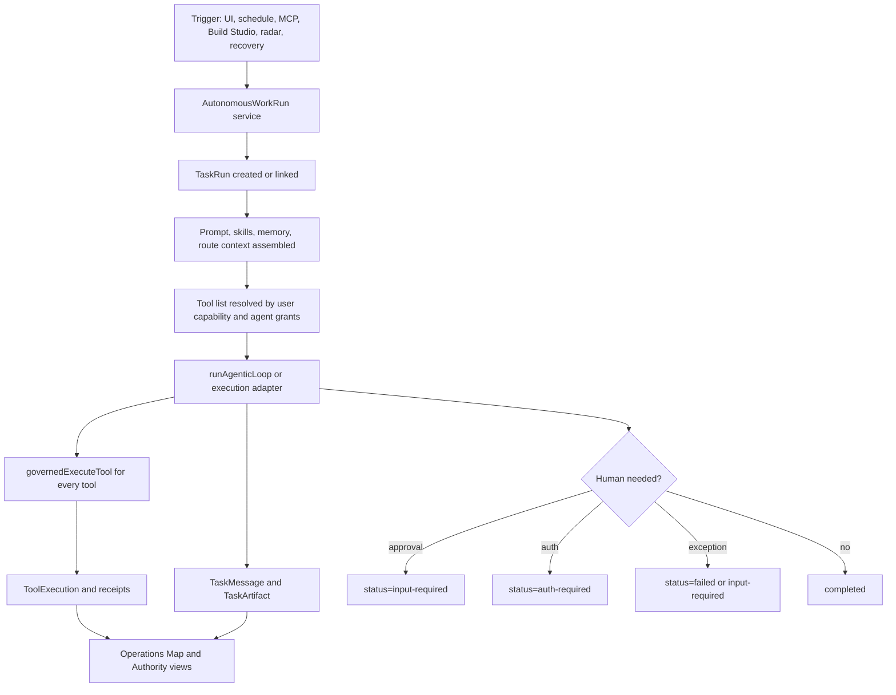

# Autonomous AI Coworker Runtime and Cognitive Load Transfer Design

| Field | Value |
| --- | --- |
| Date | 2026-05-11 |
| Status | Draft for review |
| Related epics | EP-TAK-3F9A21, EP-CTRL-5E21A4 |
| Related repo areas | `apps/web/lib/actions/agent-coworker.ts`, `apps/web/lib/actions/agent-task-scheduler.ts`, `apps/web/lib/tak/agentic-loop.ts`, `apps/web/lib/mcp-governed-execute.ts`, `apps/web/app/api/mcp/v1/route.ts`, `apps/web/lib/queue/functions/agent-task-dispatch.ts`, `apps/web/lib/tak/task-records.ts`, `apps/web/lib/ai-operations-map/*`, `packages/db/prisma/schema.prisma` |
| Related DPF standards | `docs/architecture/trusted-ai-kernel.md`, `docs/architecture/GAID.md`, `docs/architecture/agent-standards-dpf-conformance.md`, `docs/architecture/ai-coworker-development-principles.md` |
| Related specs | `2026-03-23-task-graph-orchestration-design.md`, `2026-03-23-task-governance-control-plane-design.md`, `2026-04-23-a2a-aligned-coworker-runtime-design.md`, `2026-04-29-coworker-execution-adapter-substrate-design.md`, `2026-04-29-orchestration-primitives-design.md`, `2026-04-30-ai-coworker-operator-pattern.md`, `2026-05-10-ai-coworker-visual-control-surface-design.md`, `2026-05-10-build-studio-business-intake-innovation-radar-design.md` |

## 1. Purpose

DPF already has many AI coworkers, specialist agents, scheduled jobs, tool grants, MCP tools, task records, and audit records. The current problem is not that the platform lacks agentic pieces. The problem is that autonomous coworker work is still split across several adjacent execution paths:

1. interactive coworker chat,
2. scheduled coworker tasks,
3. external MCP tool calls,
4. Build Studio execution,
5. deliberation runs,
6. operations-map projections,
7. self-assessment and capability-need records.

This spec defines a single architectural direction for autonomous AI coworker work: every meaningful coworker run should become a governed, resumable task run with bounded authority, evidence, human-overload reduction, and a path toward proceduralization.

The design principle at the center is:

> Move repeatable cognitive load from humans to AI agents, then move stabilized agent behavior into procedural code.

This is not a slogan. It is the product strategy. Humans should spend attention on intent, judgment, exception handling, and governance. AI coworkers should absorb ambiguous, high-context, cross-system cognitive work. Once the pattern stabilizes, the platform should capture the repeated behavior as deterministic workflow, typed schema, policy, tests, or procedural code so future humans and future agents do not have to rediscover it.

## 2. Current State, Verified 2026-05-11

### 2.1 Live runtime facts

Live Postgres inspection during this investigation showed:

| Model | Count | Meaning |
| --- | ---: | --- |
| `Agent` | 78 | Route coworkers, orchestrators, specialists, workspace specialists, and onboarding agents are seeded as durable runtime actors. |
| `ScheduledAgentTask` | 1 | Only one first-class scheduled coworker task is currently active. |
| `ScheduledJob` | 8 | General background scheduling exists, including discovery, code graph, model discovery, provider reconciliation, and the scheduled coworker task projection. |
| `ToolExecution` | 371 | Tool audit is real and already records local and external tool execution. |
| `AgentThread` | 175 | Conversation persistence is active and route/context keyed. |
| `TaskRun` | 12 | A2A-shaped task substrate exists but is not yet the universal parent for every autonomous coworker run. |
| `SkillDefinition` | 54 | Skills are persisted as governed capability definitions. |
| `SkillAssignment` | 133 | Coworkers already have many assigned skills. |
| `CoworkerSelfAssessment` | 0 | The self-assessment persistence foundation exists, but no live assessments have been captured. |
| `CoworkerCapabilityNeed` | 0 | Capability needs are modeled, but not yet flowing from coworker work into review/backlog. |

The one active scheduled coworker task is:

| Field | Value |
| --- | --- |
| `taskId` | `discovery-taxonomy-gap-triage-daily` |
| `agentId` | `inventory-specialist` |
| `title` | `Discovery Taxonomy Gap Triage` |
| `routeContext` | `/platform/tools/discovery` |
| `schedule` | `0 8 * * *` |
| `timezone` | `UTC` |
| `lastStatus` | `ok` |

### 2.2 Interactive coworker execution

The interactive route starts at `apps/web/app/api/agent/send/route.ts`. It returns immediately, runs `sendMessage()` in the background, and streams progress through the agent event bus.

`apps/web/lib/actions/agent-coworker.ts` resolves the route coworker, loads DB-backed prompts and skills, builds prompt context, filters tools by route, build phase, user capability, and agent grants, then calls `runAgenticLoop()`.

`apps/web/lib/tak/agentic-loop.ts` is the current center of agent behavior. It routes inference, handles tool calls, prevents repetition loops, detects fabricated progress, nudges models that narrate instead of acting, enforces proposal-mode pauses, and delegates tool execution to `governedExecuteTool()`.

### 2.3 Scheduled coworker execution

`apps/web/lib/actions/agent-task-scheduler.ts` creates `ScheduledAgentTask` rows and a matching `ScheduledJob` projection. `apps/web/lib/queue/functions/agent-task-dispatch.ts` polls every five minutes and executes due tasks.

The execution path:

1. loads the `ScheduledAgentTask`,
2. gets or creates an `AgentThread` with `contextKey = scheduled:<taskId>`,
3. writes the scheduled prompt as an `AgentMessage`,
4. resolves the route agent prompt,
5. loads the last 20 messages,
6. gets available tools for `task.agentId`,
7. calls `runAgenticLoop()`,
8. writes the assistant response,
9. updates `ScheduledAgentTask` and `ScheduledJob`.

This path is real, but it is not yet a first-class `TaskRun`. That means scheduled coworker work is visible as thread messages and tool executions, but it is not uniformly represented in the A2A-shaped task substrate.

### 2.4 External MCP execution

`apps/web/app/api/mcp/v1/route.ts` is the external JSON-RPC MCP surface. It validates transport and origin, authenticates bearer tokens, checks token scopes and read/write capability, then calls `governedExecuteTool()` with `source: "external-jsonrpc"` and the token id. This is the right direction: external clients and in-product coworkers should converge on the same governed execution function.

However, the current remote surface invokes tools, not full coworker task runs. `/api/v1/agent/message` persists an agent message but does not run the coworker. Therefore DPF has remote tool invocation today, but not yet a complete remote autonomous coworker invocation contract.

### 2.5 Governance center

`apps/web/lib/mcp-governed-execute.ts` is the strongest reusable primitive. It enforces:

- known tool lookup,
- user capability check,
- agent grant check,
- lifecycle pre-tool hooks,
- actual tool execution,
- lifecycle post-tool hooks,
- `ToolExecution` audit writes,
- receipt creation for receipt-bearing tools.

This should remain the choke point for all tool execution, including scheduled tasks, remote clients, interactive coworkers, Build Studio execution providers, and future desktop-control adapters.

### 2.6 Existing DPF principles already pointing this way

DPF has already documented most of the foundation:

- `trusted-ai-kernel.md` says trustworthy agency requires runtime mediation between human authority, agent capability, tool invocation, data sensitivity, memory, and oversight.
- `GAID.md` separates public/private agent identity from runtime control.
- `agent-standards-dpf-conformance.md` identifies gaps around unified HITL enforcement, memory policy, supervisor visibility, signed receipts, and chain-of-custody.
- `ai-coworker-development-principles.md` already states that humans should approve phase transitions rather than every tool call, and that specialists should have small, context-specific tool surfaces.
- `2026-03-23-task-graph-orchestration-design.md` and `2026-04-23-a2a-aligned-coworker-runtime-design.md` establish the `TaskRun` direction.
- `2026-05-10-ai-coworker-visual-control-surface-design.md` establishes the operations-map projection layer over `AgentEvent`, `ToolExecution`, `ToolExecutionReceipt`, `BacklogItemActivity`, `ExternalEvidenceRecord`, and `TaskRun`.
- `2026-05-10-build-studio-business-intake-innovation-radar-design.md` establishes coworker-originated proposals with stable attribution and evidence, not chat residue.

This spec does not replace those documents. It binds them into one autonomous coworker runtime direction.

## 3. Research and Benchmarking

### 3.1 Cognitive load and cognitive offloading

John Sweller's cognitive load theory identifies working-memory limits as a primary constraint on problem solving and learning. The relevant product implication is that an operator who must repeatedly inspect state, remember prior decisions, interpret logs, and choose the next procedural step is spending scarce cognitive capacity on orchestration rather than judgment. See Sweller's foundational "Cognitive load during problem solving" and later cognitive-load literature summarized by instructional-design references such as [Cognitive Load Theory](https://www.instructionaldesign.org/theories/cognitive-load/).

Research on cognitive offloading frames offloading as using an external aid to reduce information-processing demand. PLOS One's study on offloading under cognitive load describes cognitive offloading as changing the information-processing requirements of a task to reduce cognitive demand, and observes that people are willing to offload parts of attention-demanding tasks to algorithms under load. See [Offloading under cognitive load](https://journals.plos.org/plosone/article?id=10.1371%2Fjournal.pone.0286102).

Information Systems research on human-AI collaboration and productive delegation highlights that delegation to AI is not merely automation; humans need calibrated understanding of when to delegate, when to supervise, and when to intervene. See [Cognitive Challenges in Human-Artificial Intelligence Collaboration](https://pubsonline.informs.org/doi/abs/10.1287/isre.2021.1079).

DPF should adopt cognitive offloading deliberately, but not blindly. The aim is not to remove human judgment. The aim is to move repetitive cognitive burden out of the human's working memory and into governed runtime structures.

### 3.2 Human-centered automation precedent

Human factors research repeatedly warns that automation can reduce direct workload while increasing monitoring, surprise, and recovery burden if humans are left as passive supervisors. Bainbridge's "[Ironies of Automation](https://doi.org/10.1016/0005-1098(83)90046-8)" is the classic caution: the more reliable automation becomes, the less practiced humans are when they must intervene. DPF should treat this as a design constraint: autonomy must come with live state, evidence, replay, clear escalation, and practiceable control surfaces.

This supports DPF's phase-boundary and exception-boundary model: humans should not approve every small action, but they must see enough structured state to recover, steer, or convert repeated exceptions into better procedures.

### 3.3 NIST AI RMF

NIST AI RMF 1.0 is a voluntary, use-case-agnostic framework for trustworthy AI risk management. Its core functions are Govern, Map, Measure, and Manage, with emphasis on validity, reliability, safety, security, accountability, transparency, explainability, privacy, and fairness. See [NIST AI RMF 1.0](https://www.nist.gov/publications/artificial-intelligence-risk-management-framework-ai-rmf-10) and the [NIST AI RMF Playbook](https://www.nist.gov/itl/ai-risk-management-framework/nist-ai-rmf-playbook).

DPF adopts the pattern by treating autonomous coworker work as governed runtime operations, not as hidden chat behavior. Each run must have identity, authority, status, evidence, and risk posture.

### 3.4 OWASP AI Agent and MCP security

OWASP's AI Agent Security Cheat Sheet emphasizes least privilege, input validation, memory/context isolation, HITL for high-risk actions, monitoring, structured outputs, and secure multi-agent communication. See [OWASP AI Agent Security Cheat Sheet](https://cheatsheetseries.owasp.org/cheatsheets/AI_Agent_Security_Cheat_Sheet.html).

OWASP's MCP Security Cheat Sheet highlights least privilege, schema integrity, MCP server isolation, HITL for sensitive actions, authentication, transport security, logging, auditing, and prompt-injection risks from tool results. See [OWASP MCP Security Cheat Sheet](https://cheatsheetseries.owasp.org/cheatsheets/MCP_Security_Cheat_Sheet.html).

DPF already aligns through `AgentToolGrant`, `TOOL_TO_GRANTS`, `governedExecuteTool()`, and `ToolExecution`. The gap is consistency: every run type must use those controls and project its state to the same supervisor surface.

### 3.5 MCP and A2A

The Model Context Protocol standardizes how AI applications connect to external tools and data. MCP's specification treats tools as model-invocable capabilities with schema and result structures, and emphasizes user awareness and authorization around tool use. See the [current MCP specification](https://modelcontextprotocol.io/specification/) and [Anthropic's MCP announcement](https://www.anthropic.com/news/model-context-protocol).

Agent2Agent defines a stateful `Task` with `status`, `history`, `artifacts`, messages, authentication, authorization, and streaming. See the [A2A specification](https://a2a-protocol.org/latest/specification/).

DPF should keep MCP as the tool/context carrier and A2A-shaped `TaskRun` as the work carrier:

- MCP answers "what can be called and under what tool contract?"
- A2A-shaped task records answer "what work is being done, by whom, under what status, with what outputs?"
- TAK answers "is this authorized, observable, and governed?"
- GAID answers "who is this agent across boundaries?"

### 3.6 OpenAI and Microsoft agent patterns

OpenAI's practical agent guidance emphasizes explicit workflows, tool selection, guardrails, safe handoff back to the user for high-risk actions, and human oversight for sensitive or irreversible actions. See [A practical guide to building agents](https://openai.com/business/guides-and-resources/a-practical-guide-to-building-ai-agents/) and [OpenAI Agents SDK HITL guidance](https://openai.github.io/openai-agents-python/human_in_the_loop/).

Microsoft's Azure Architecture Center describes sequential, concurrent, group-chat, handoff, and magentic orchestration patterns. It calls out that HITL points must be explicit: whether input is optional or mandatory, and whether the response approves, refines, or redirects the workflow. See [AI agent orchestration patterns](https://learn.microsoft.com/azure/architecture/ai-ml/guide/ai-agent-design-patterns).

DPF's direction should be a hybrid:

- sequential workflows for stable procedural paths,
- orchestrator-worker patterns for Build Studio and complex operational work,
- deliberation patterns for review/debate,
- handoff patterns for coworker specialization,
- explicit HITL states for approval, auth, and exception handling.

The in-process control-flow primitives that realize these patterns inside DPF are owned by `2026-04-29-orchestration-primitives-design.md` (Sequential / Parallel / Loop / Branch with typed outcomes and governance-derived budgets). This spec consumes those primitives at the runtime layer; it does not re-derive them.

### 3.7 Observability precedent

The AI Operations Map spec already benchmarked OpenAI tracing, LangSmith, Langfuse, and Helicone. The adopted DPF pattern is not to clone any one tracing product. Instead, DPF projects canonical runtime records onto a business-flow control surface. That remains the right direction here:

- `ToolExecution` is audit truth,
- `AgentEvent` is liveness,
- `ToolExecutionReceipt` is verifiable evidence,
- `TaskRun` is work identity,
- `BacklogItemActivity` is backlog-anchored evidence,
- the Operations Map is the operator-facing projection.

## 4. Core Doctrine: Cognitive Load Transfer Ladder

DPF must make "cognitive load transfer" a platform invariant.

### 4.1 The ladder

Every repeated operational burden should move through this ladder:

1. **Human cognition**
   A human sees a recurring ambiguity, exception, judgment path, or coordination burden.

2. **Coworker-assisted cognition**
   A coworker helps gather context, compare evidence, summarize options, and propose next action.

3. **Agent-run procedure**
   The coworker begins running the pattern under a bounded task contract with evidence, approval gates, and monitoring.

4. **Procedural code**
   Stable steps become deterministic workflows, typed schema, validation rules, schedulers, tests, policy checks, or MCP tools.

5. **Runtime invariant**
   The platform enforces the pattern automatically. Humans only see exceptions, audits, policy changes, or strategic improvement opportunities.

### 4.2 Design rule

Any autonomous coworker feature must answer:

1. What cognitive burden is being moved off the human?
2. What remains human judgment and why?
3. What part is safe for an AI coworker to perform now?
4. What evidence proves the coworker did real work?
5. What repeated part should eventually become procedural code?
6. What signal tells us it is ready to proceduralize?

### 4.3 Anti-patterns

The following are rejected:

- "AI as another inbox" where the human still has to inspect every step.
- "Autonomy as hidden chat" where an agent acts without durable task identity.
- "Dashboard as decoration" where runtime state is visualized but not actionable.
- "Prompt-only process" where repeated work stays in instructions instead of becoming schema, tools, tests, or workflow code.
- "Human-in-the-loop everywhere" where per-call approval preserves the appearance of safety while creating approval fatigue.
- "Human-out-of-the-loop by accident" where scheduled or remote runs continue without recoverable evidence and escalation.

## 5. Target Architecture

### 5.1 Canonical primitive: `AutonomousWorkRun`

`AutonomousWorkRun` is a **service facade name**, not a parallel entity. The persistent work identity is `TaskRun`. This spec does not introduce a second ID space, a second status machine, or a second projection model. The `AutonomousWorkRun` service is the single function that every trigger calls to create or link a `TaskRun`, assemble context, resolve tools, and hand off to the agentic loop. The shape below is the service input contract, not a table:

```ts
type AutonomousWorkTrigger =
  | "interactive"
  | "scheduled"
  | "external-mcp"
  | "build"
  | "deliberation"
  | "radar"
  | "system-recovery";

type AutonomousWorkRunInput = {
  trigger: AutonomousWorkTrigger;
  userId: string;
  agentId: string;
  routeContext: string;
  title: string;
  objective: string;
  prompt: string;
  threadId?: string;
  parentTaskRunId?: string;
  authorityScope?: string[];
  sourceRef?: {
    kind: "scheduled-task" | "mcp-token" | "feature-build" | "backlog-item" | "manual-thread" | "deliberation-run";
    id: string;
  };
};
```

The service creates or links:

- `TaskRun`,
- `AgentThread`,
- `AgentMessage`,
- `ToolExecution`,
- `ToolExecutionReceipt`,
- `TaskMessage`,
- `TaskArtifact`,
- `BacklogItemActivity` when backlog evidence is recorded.

The first implementation does not introduce a new table. `TaskRun.a2aMetadata` + the two nullable `taskRunId` columns identified in §6.2 are sufficient. A new table is justified only if cross-source lookup, retention, or policy needs cannot be expressed cleanly through `TaskRun`. If a future slice proves that need, it must propose a `Run`-aliased projection table, not a parallel work-identity table.

The service must create the `TaskRun` **before** the first tool call, not after. Authority scoping, repetition detection, and audit linkage depend on the run existing before tools execute; a retroactively-stamped `TaskRun` cannot scope authority for calls that have already happened.

### 5.2 TaskRun as the work spine

Every meaningful autonomous coworker run must have a `TaskRun` unless it is a trivial read-only UI chat response.

Required fields:

| `TaskRun` field | Rule |
| --- | --- |
| `taskRunId` | Public stable id used in events and UI links. |
| `userId` | Human or service principal authority owner. |
| `threadId` | Linked when the run has chat-visible context. |
| `contextId` | A2A-aligned continuity id. |
| `initiatingAgentId` | Agent that accepted the work. |
| `currentAgentId` | Agent currently responsible. |
| `source` | `coworker`, `build`, `skill`, `proactive`, or extended enum if needed. |
| `status` | A2A-shaped state: submitted, working, input-required, auth-required, completed, failed, canceled, rejected, archived. |
| `authorityScope` | Narrowed scope for this run. |
| `a2aMetadata` | Trigger, source ref, schedule id, MCP token id, route context, operating profile fingerprint. |
| `progressPayload` | Latest liveness state for SSE replay and map projection. |

### 5.3 Invocation convergence

All run types should converge on:



### 5.4 HITL model

DPF should preserve the current strong principle: humans approve meaningful boundaries, not every small tool call.

HITL states:

| State | Meaning | Human role |
| --- | --- | --- |
| `input-required` | Agent needs judgment, missing context, or approval. | Decide, clarify, approve, reject, or redirect. |
| `auth-required` | Agent needs credentials, delegated authority, or external access. | Authorize through governed UI or connector flow. |
| `proposal` tool pause | A specific side-effecting action needs approval. | Approve/reject the action card. |
| `exception` | Runtime cannot safely continue. | Resolve blocker or convert repeated blocker into backlog/procedure. |

The human review card must show:

- what work was requested,
- who/what initiated it,
- which agent is acting,
- what authority scope applies,
- what evidence exists,
- what will happen if approved,
- what part will become procedural if this pattern repeats.

### 5.5 Cognitive load telemetry

Every autonomous run should record cognitive-load transfer signals:

| Signal | Source | Use |
| --- | --- | --- |
| `humanTouches` | approvals, clarifications, manual retries | Measures whether automation reduced or shifted burden. |
| `agentSteps` | tool calls, task messages, artifacts | Shows cognitive work absorbed by coworker. |
| `repetitionPatternKey` | `TaskRun.repeatedPatternKey` | Groups repeated cognitive burdens. |
| `proceduralizationCandidate` | task metadata or backlog item | Marks patterns ready for deterministic code. |
| `exceptionClass` | failed tool, auth, missing data, policy, model, schema | Shows what to fix next. |
| `evidenceCompleteness` | receipts, artifacts, backlog evidence | Avoids "AI did something" claims without proof. |

### 5.6 Proceduralization path

When a repeated autonomous pattern appears, DPF should file or update a backlog item with:

- repeated pattern,
- affected route/workflow,
- observed human touches,
- current coworker workaround,
- proposed procedural code target,
- acceptance criteria,
- evidence from `TaskRun`, `ToolExecution`, and receipts.

Examples:

| Pattern | Current agent work | Procedural target |
| --- | --- | --- |
| Discovery triage repeatedly fails on FK | Coworker retries, reports issue, files backlog | Typed validation before write and invariant test |
| User asks same Build Studio readiness question | Coworker inspects build state | Deterministic readiness selector and UI state |
| Coworker repeatedly summarizes missing grants | Agent explains limitation | Authority view and grant recommendation workflow |
| Remote MCP client invokes same safe read sequence | Agent/tool calls run manually | Composite read workflow tool |
| Scheduled radar identifies recurring capability gap | Coworker files proposals | Capability-pack rule and scheduled typed extractor |

## 6. Data Model Direction

### 6.1 Reuse before adding

Do not create a parallel autonomous-run ledger until existing primitives fail.

Use:

- `TaskRun` for work identity,
- `TaskNode` / `TaskNodeEdge` for decomposition,
- `TaskMessage` for task-native messages,
- `TaskArtifact` for outputs,
- `AgentThread` / `AgentMessage` for chat projection,
- `ToolExecution` for tool audit,
- `ToolExecutionReceipt` for verifiable action receipts,
- `ScheduledAgentTask` for schedule ownership and cron metadata,
- `ScheduledJob` for calendar/job projection,
- `CoworkerSelfAssessment` for self-evaluation,
- `CoworkerCapabilityNeed` for agent-submitted needs,
- `BacklogItemActivity` for backlog evidence.

### 6.2 Likely schema changes

Minimal first-slice changes (verified against `packages/db/prisma/schema.prisma` 2026-05-11):

1. Add `taskRunId String?` to `ScheduledAgentTask` (currently absent — see schema lines 4281–4305) with an index on `(taskRunId)`.
2. Add `taskRunId String?` to `ToolExecution` (currently absent — see schema lines 3007–3036) with an index on `(taskRunId, createdAt)`. `AgentMessage.taskRunId` (line 2886) and `AgentActionProposal.taskRunId` (line 2935) already exist and are the pattern to follow; code paths that pass `taskRunId` into `ToolExecution.create()` today are silently dropping it on the floor and must be reconciled in the same migration.
3. Place `sourceRef`, `cognitiveLoad`, and `triggerKind` inside `TaskRun.a2aMetadata` rather than as new columns at first. Promote to columns only after Slice 5 metrics stabilize (§13 open decision 3).

Potential later changes:

1. `AutonomousWorkPattern` for repeated proceduralization candidates.
2. `HumanTouchpoint` if approval/clarification metrics outgrow `TaskMessage` and `AgentActionProposal`.
3. `ProceduralizationCandidate` if backlog linkage alone is not enough.

### 6.3 Status model

Prefer the A2A-aligned `TaskRun.status` vocabulary for autonomous work:

- `submitted`
- `working`
- `input-required`
- `auth-required`
- `completed`
- `failed`
- `canceled`
- `rejected`
- `archived`

Do not invent a second scheduled-task status machine beyond `ScheduledAgentTask.lastStatus`. `ScheduledAgentTask` status is schedule health; `TaskRun.status` is work health.

`archived` is not a normal completion state. It is reserved for runs intentionally removed from active operational views after retention, supersession, or operator review. Slice 4 owns the first archival policy because self-assessment and capability-need runs are the first expected source of long-lived review queues. Until that policy lands, implementation slices must not emit `archived`; they should use `completed`, `failed`, `canceled`, or `rejected`.

## 7. Runtime Flow Requirements

### 7.1 Interactive coworker

When `sendMessage()` detects non-trivial work, it must create or link a `TaskRun` **before invoking the agentic loop**.

The decision is a typed predicate, not a keyword sniff, so the rule is reviewable and testable. `requiresTaskRun(intent, resolvedTools, routeContext, agent)` returns true when **any** of the following is true:

1. Resolved tool set contains at least one tool whose `TOOL_TO_GRANTS` mapping includes a side-effecting grant (write, integrate, deploy, etc.). Read-only tool surfaces stay thread-only.
2. `routeContext` belongs to a phase-gated workflow (Build Studio, deliberation, radar, integration setup).
3. Caller passed an explicit `objective` or `parentTaskRunId` on the request.
4. The agent's operator contract (per `2026-04-30-ai-coworker-operator-pattern.md`) declares the agent produces persistent work products (e.g., proposals, plans, drafts).
5. Proposal-mode is engaged for any candidate tool call in the first turn.

Keyword heuristics on user intent ("handle", "investigate", etc.) are explicitly rejected — they were the previous design and they drift. Simple Q&A — read tools only, no phase gate, no work-product agent — remains thread-only.

### 7.2 Scheduled coworker

`executeScheduledAgentTask()` must:

1. create a `TaskRun` with `source="proactive"` **before** the first tool call,
2. set `initiatingAgentId` and `currentAgentId` to `task.agentId`,
3. link the run via the new typed `ScheduledAgentTask.taskRunId` column (§6.2). Do not store the link in unstructured metadata — that creates a second lookup path and we lose FK integrity,
4. write the scheduled prompt as both `AgentMessage` and `TaskMessage`,
5. pass `taskRunId` into `runAgenticLoop()`,
6. write tool executions with task linkage (now possible after the `ToolExecution.taskRunId` migration in §6.2),
7. end in `completed`, `input-required`, `auth-required`, or `failed`.

The scheduler's `timezone` must be honored by the cron computation or removed until supported. Keeping a field that looks authoritative but is ignored is a runtime-trust defect.

### 7.3 External MCP

The external MCP route should keep `governedExecuteTool()` as the tool-call path.

Add a separate future method for full coworker work, for example:

- `coworker/run`
- `tasks/submit`
- or an A2A-compatible task endpoint.

This endpoint should not bypass the tool layer. It should create a `TaskRun`, then execute the same coworker runtime as the UI path under token/user authority.

### 7.4 Build Studio

Build Studio already has phase gates, evidence fields, sandbox work, and provider execution. It should be treated as a specialized autonomous-work run with richer build artifacts, not as a separate philosophical category.

Build Studio can keep its feature-build tables. The mapping rule is:

- one `FeatureBuild` ↔ one parent `TaskRun` (`source="build"`),
- each non-trivial phase ↔ one `TaskNode` child of that `TaskRun`,
- phase events project from `TaskNode` to the Operations Map.

Do **not** create one `TaskRun` per phase. A build can span hours or days across many phases; per-phase `TaskRun`s would explode the work-spine cardinality, break cross-phase status, and lose the "one build = one promotion candidate" identity that downstream registry, hive, and PR tooling assumes.

### 7.5 Deliberation

Deliberation already uses `TaskRun` and `TaskNode`. It is the closest current implementation to the target architecture. Future autonomous coworker execution should learn from its parent/branch topology rather than creating a second branch model.

### 7.6 Self-assessment and capability needs

Coworker self-assessment should become a scheduled and event-triggered autonomous run:

- scheduled periodic self-assessment,
- after repeated tool failures,
- after denied grants,
- after model downgrade,
- after unresolved user correction,
- after repeated manual human touchpoints.

The output should be:

1. `CoworkerSelfAssessment`,
2. zero or more `CoworkerCapabilityNeed`,
3. optional backlog proposal with submitter attribution,
4. evidence links to the run and tool executions.

This closes the loop from runtime observation to governed backlog improvement.

## 8. UI and Operator Experience

The UI principle is:

> Show the work chain, not the implementation guts first.

### 8.1 Required surfaces

The AI Operations experience should expose:

| Surface | Purpose |
| --- | --- |
| Operations Map | Business-flow view of where coworkers are acting. |
| Active Runs | Current `TaskRun`s, blocked states, approvals, auth needs. |
| Scheduled Work | `ScheduledAgentTask` and recurring autonomous work. |
| Remote Invocations | MCP token/tool-run activity and future remote task submissions. |
| Capability Needs | Coworker-submitted needs and human review decisions. |
| Receipts and Evidence | Tool receipts, backlog evidence, external evidence, build artifacts. |
| Proceduralization Candidates | Repeated cognitive-load patterns ready to become code/workflow/policy. |

### 8.2 UI design rules

All UI must follow DPF theme-token rules. This surface is operational software, not a marketing dashboard:

- dense but calm information layout,
- no decorative cards inside cards,
- clear tables and split panes,
- status chips tied to real enum values,
- icons for run type, schedule, approval, auth, receipt, and exception,
- inspector panels for detail,
- direct links to source evidence,
- keyboard-accessible controls,
- no hardcoded colors.

### 8.3 Approval UX

Approval cards must reduce reviewer load. They should not dump raw logs.

Each approval card should include:

- requested action,
- agent and source trigger,
- risk class,
- authority basis,
- evidence summary,
- expected side effect,
- rollback or cancel path,
- "make this procedural next time" option when repeated.

## 9. Security, Governance, and Policy

### 9.1 Least privilege

The existing `TOOL_TO_GRANTS` and `AgentToolGrant` model remains mandatory. Tools without grant mappings must remain denied by default.

### 9.2 Human authority

The model never owns authority. The runtime carries authority from:

- human user,
- service principal,
- MCP token,
- scheduled task owner,
- explicit delegation grant,
- build/run policy.

Every run must preserve the chain from authority owner to agent action.

**Principal convergence (AGENTS.md §11, `2026-04-22-enterprise-auth-directory-federation-design.md` addendum 2026-05-09).** Authorization decisions resolve on a single `Principal`, not on the surface that authenticated the request. MCP tokens, scheduled-task owners, service accounts, agents acting under delegation, and human users all surface to the runtime as `PrincipalAlias` rows linked to a `Principal`. `TaskRun.userId` must carry the resolved `Principal` id; the alias kind (the surface the call entered through) belongs in `a2aMetadata.sourceRef.kind`. No `AutonomousWorkRun` trigger may introduce a new identity-bearing entity outside the `Principal` model.

### 9.3 Memory and context

Autonomous work must not become a hidden memory leak.

Rules:

- Context must be scoped by route, task, sensitivity, and agent.
- Memory retrieval must be freshness-aware for consequential work.
- Tool results from untrusted external sources must be treated as prompt-injection surfaces.
- Task summaries should become `TaskArtifact`s, not unbounded chat history.

### 9.4 External clients

External MCP/API callers must not get a stronger capability surface than in-product coworkers.

Rules:

- token scope intersects with user capability and agent grant,
- read tokens cannot call side-effecting tools,
- remote task submission must use `TaskRun`,
- all calls write `ToolExecution`,
- high-risk actions pause as `input-required` or `auth-required`.

### 9.5 Proceduralization governance

Moving agent behavior into procedural code is a promotion step. It requires:

- evidence of repeated pattern,
- successful agent-run examples,
- known exception classes,
- tests,
- owner,
- rollback or disable path,
- audit entry.

This prevents "the agent did it twice, so hardcode it" from becoming a new shortcut class.

## 10. Implementation Slices

### Slice 1: Scheduled coworker as TaskRun

Goal: make the one existing scheduled coworker task a first-class autonomous work run.

Scope:

- migration: add nullable `ScheduledAgentTask.taskRunId` and `ToolExecution.taskRunId` (§6.2),
- create the `TaskRun` in `executeScheduledAgentTask()` **before** the first tool call,
- pass `taskRunId` into `runAgenticLoop()` and through `governedExecuteTool()` so every `ToolExecution` row written during the run carries it,
- write `TaskMessage` for scheduled prompt and final summary,
- project blocked/failure/completed state into `progressPayload`,
- preserve existing `ScheduledAgentTask` and `ScheduledJob` behavior,
- verify the daily discovery triage task still runs.

Slice 1 is the first consumer of the shared seam that Slice 2 will extract. Implement the new code as a self-contained function on day one so Slice 2's extraction is a move, not a rewrite.

Acceptance:

- a scheduled run creates exactly one `TaskRun` and creates it before any tool call,
- 100% of `ToolExecution` rows from the run carry the `taskRunId` FK (verified by a migration-blocking invariant test),
- the run appears in the internal task endpoint output and the Operations Map,
- failure marks the `TaskRun` failed and keeps next schedule intact,
- timezone behavior is either implemented or clearly marked unsupported in UI (no silent ignore — that is a runtime-trust defect),
- build gate (AGENTS.md §5) passes: vitest, `apps/web` next build, migration applies cleanly, UX exercised against the running install.

### Slice 2: AutonomousWorkRun service extraction

Goal: reduce duplication between interactive and scheduled coworker paths.

Scope:

- introduce service wrapper around prompt/tool/run setup,
- preserve existing `sendMessage()` behavior,
- reuse for scheduled execution,
- centralize `TaskRun` creation/linking,
- add tests for interactive and scheduled callers.

Acceptance:

- no behavior regression in `/api/agent/send`,
- scheduled and interactive paths use shared context/tool resolution,
- existing agentic-loop tests still pass,
- service can be called without Next route objects.

### Slice 3: Remote coworker task submission

Goal: add remote invocation for full coworker work, not only tool calls.

Scope:

- define JSON-RPC method or A2A-compatible endpoint,
- authenticate with MCP token,
- define `idempotencyKey` semantics for retry-safe remote submission,
- define `riskClass` semantics for human-in-the-loop gating and tool approval defaults,
- create `TaskRun`,
- start coworker run asynchronously,
- return task id and status,
- stream or poll status.

Acceptance:

- read-only token can submit read-only task only,
- write-capable token can submit bounded write task subject to grants,
- proposal-mode tools pause rather than silently failing,
- retry behavior is keyed by `idempotencyKey`, not by prompt text,
- `riskClass` drives approval requirements before side-effecting tools run,
- `ToolExecution.apiTokenId` and `TaskRun.a2aMetadata.sourceRef` link to token.

### Slice 4: Capability-needs flywheel

Goal: make coworker self-assessment operational.

Scope:

- schedule or trigger self-assessment runs,
- persist `CoworkerSelfAssessment`,
- persist `CoworkerCapabilityNeed`,
- review/link needs to backlog,
- preserve submitting coworker attribution.

Acceptance:

- repeated denied grants or repeated tool failures produce reviewable needs,
- humans can discard, duplicate, defer, or link to backlog,
- backlog items preserve submitter attribution,
- no raw chat-only capability requests remain after review.

### Slice 5: Proceduralization candidates

Goal: turn repeated cognitive load into code/workflow/policy candidates.

Scope:

- capture a one-week baseline before applying decline targets,
- compute repeated pattern candidates from `TaskRun.repeatedPatternKey`, tool failures, approvals, and manual touches,
- show candidates in AI Operations,
- file governed backlog proposals,
- link back to evidence.

Acceptance:

- operator can see top repeated cognitive burdens,
- first report separates baseline observation from post-proceduralization movement,
- each candidate links to source runs and evidence,
- candidate can create a backlog item through governed MCP/backlog workflow,
- no candidate is auto-implemented without human review.

### Immediate candidate fit: Hive Scout

Hive Scout is a strong near-term proving ground for this doctrine. Its deterministic core already exists as a scheduled external-catalog ingest, but its higher-order judgments remain human-heavy: novelty, archetype fit, value-stream alignment, and proposal quality. That makes it a good match for the ladder in §4:

1. deterministic fetch/parse/dedupe stays procedural,
2. ambiguous novelty and fit move to a bounded coworker run,
3. repeated review corrections become filters/mappings/rules,
4. the resulting run becomes visible in the Operations Map as proactive work rather than hidden cron behavior.

Because Hive Scout is low-risk, asynchronous, and reviewable, it is also a good candidate for background execution when provider policy indicates lagging prepaid subscription quota. A dedicated design note for this application lives in `2026-05-11-hive-scout-autonomous-coworker-design.md`.

## 11. Metrics

### 11.1 Outcome metrics

Slice 5 must capture a one-week baseline before interpreting decline targets. Until that baseline exists, the targets below are directional design goals rather than release gates.

| Metric | Target |
| --- | --- |
| Human touches per repeated workflow | Declines after proceduralization. |
| Time from trigger to completed run | Declines without increased failure rate. |
| Unlinked scheduled work | Zero meaningful scheduled runs without `TaskRun`. |
| Unattributed tool execution | Zero non-system tool executions with unknown agent/user. |
| Repeated exception classes | Decline after backlog/procedural fixes. |
| Capability needs reviewed | 90 percent reviewed within defined SLA. |
| Approval fatigue | Fewer low-risk per-call approvals; more phase/exception approvals. |

### 11.2 Safety metrics

| Metric | Target |
| --- | --- |
| Side-effecting call without audit | Zero. |
| External write with read token | Zero. |
| Proposal-mode action executed without approval or preauthorization | Zero. |
| Scheduled task failure without next-run update | Zero. |
| Prompt-only repeated process without proceduralization candidate | Declines over time. |

## 12. Risks and Mitigations

| Risk | Mitigation |
| --- | --- |
| Agents create more work for humans | Measure human touches and promote repeated patterns into procedural code. |
| Proceduralization locks in bad behavior | Require evidence, review, tests, and rollback path before promotion. |
| Scheduled tasks act under wrong authority | Resolve owner role/capabilities correctly and persist authority scope on `TaskRun`. |
| MCP remote work bypasses UI governance | Route remote task submission through the same `AutonomousWorkRun` and `governedExecuteTool()` paths. |
| TaskRun becomes a dumping ground | Define required metadata and projection rules; keep source-specific details in source models. |
| Operations Map shows stale or duplicate state | Treat `ToolExecution` as audit truth and `AgentEvent` as liveness, per the visual control surface spec. |
| Human skill atrophies | Keep exception review, replay, evidence, and "why this was proceduralized" visible. |
| Cognitive offloading becomes cognitive surrender | Keep humans responsible for intent, policy, high-impact approvals, and procedural promotion decisions. |

## 13. Open Decisions

1. Should `ScheduledAgentTask` store only the latest `taskRunId`, or should there be a `ScheduledAgentTaskRun` history table?
   Recommendation: latest id plus `TaskRun.a2aMetadata.sourceRef` is enough for Slice 1. Add a history table only if query complexity demands it.

2. ~~Should full remote coworker task submission be MCP JSON-RPC, A2A HTTP, or both?~~ **Decided.** Extend the existing MCP JSON-RPC surface at `/api/mcp/v1` (AGENTS.md §8) with a `tasks/submit` method whose payload shape is A2A-aligned. Do not stand up a parallel A2A HTTP endpoint in Slice 3. Reasons: (a) one external auth/audit path, (b) MCP token scopes already intersect with user capability and agent grants, (c) DPF's external contract per AGENTS.md is the MCP endpoint — splitting it doubles the governance surface. An A2A HTTP profile may be exposed later as a thin adapter over the same JSON-RPC handler when a partner explicitly needs it.

3. Should cognitive-load metrics be first-class columns?
   Recommendation: start in `TaskRun.a2aMetadata`; promote only stable metrics to columns after Slice 5.

4. Should every interactive chat create a `TaskRun`?
   Recommendation: no. Only non-trivial work should create a task. Simple Q&A remains thread-only.

## 14. Definition of Done

The autonomous coworker runtime is considered coherent when:

1. every scheduled coworker run has `TaskRun` identity (zero scheduled runs without `taskRunId` over a rolling 7-day window),
2. every external tool call and future remote task submission is governed through the same authority path (zero `ToolExecution` rows with `apiTokenId` set and `taskRunId` null when the call originated from `tasks/submit`),
3. interactive, scheduled, remote, Build Studio, and deliberation work appear in one Operations Map projection,
4. capability needs flow from runtime evidence to review/backlog with submitter attribution (zero open `CoworkerCapabilityNeed` older than the defined review SLA),
5. repeated cognitive burdens are visible as proceduralization candidates,
6. humans approve meaningful boundaries and exceptions, not routine internal steps,
7. at least three proceduralization candidates have been promoted to procedural code, deterministic workflow, typed schema, or policy with linked evidence; the promotion record (§9.5) is the measurable artifact, not a vibes-level claim that "the agent learned."

## 15. Recommendation

Proceed with Slice 1 first: scheduled coworker as `TaskRun`.

It is the smallest slice that proves the architecture:

- one active live scheduled coworker exists,
- current code path is narrow,
- schema already has `ScheduledAgentTask` and `TaskRun`,
- `runAgenticLoop()` already accepts task context,
- `governedExecuteTool()` already centralizes audit and grants,
- the AI Operations Map can consume the resulting records.

This slice turns autonomous coworker work from "a scheduled chat message that happens to call tools" into "a governed, observable, resumable work run." That is the right foundation for remote invocation, self-assessment, capability needs, and proceduralization.
