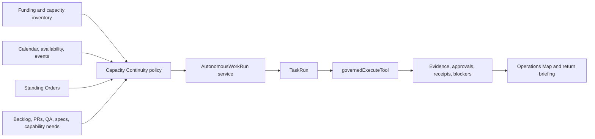

# AI Capacity Continuity and Responsible Utilization Design

| Field | Value |
| --- | --- |
| Date | 2026-05-12 |
| Status | Draft for review |
| Related epics | EP-TAK-3F9A21 |
| Related repo areas | `AGENTS.md`, `docs/architecture/ai-coworker-development-principles.md`, `apps/web/app/(shell)/platform/ai/*`, `apps/web/components/platform/platform-nav.ts`, `apps/web/lib/actions/agent-task-scheduler.ts`, `apps/web/lib/queue/functions/agent-task-dispatch.ts`, `apps/web/lib/mcp-governed-execute.ts`, `packages/db/prisma/schema.prisma` |
| Related specs | `2026-05-11-autonomous-coworker-runtime-design.md`, `2026-05-10-ai-coworker-visual-control-surface-design.md`, `2026-04-30-ai-coworker-operator-pattern.md`, `2026-04-29-orchestration-primitives-design.md` |

## 1. Purpose

DPF pays for AI capacity as an operating asset. When that capacity is fixed-price, subscription-based, or otherwise already paid for, unused capacity is not harmless. It is lost operating leverage.

The platform should not depend on one human being at the keyboard to turn available AI capacity into value. If the owner goes on a trip for a week, if an employee takes a month-long vacation, if the business is closed for a holiday, or if the team is focused on a trade show, DPF should still use authorized AI capacity to produce governed, reviewable progress.

This spec defines **AI Capacity Continuity**: the doctrine, runtime model, UX home, and first implementation slices needed to ensure that paid AI capacity becomes useful work instead of vanished opportunity.

The shorthand principle is:

> **Use it or lose it.**

The formal platform principle is:

> **Responsible AI Capacity Utilization.** DPF treats paid AI capacity as an operating asset. AI coworkers and coding agents are expected to use available capacity to create governed value: reduce human cognitive load, inspect stale state, improve quality, produce durable work products, capture evidence, advance backlog work, identify capability gaps, and convert repeated effort into procedures. Idle capacity is waste when valuable authorized work exists. Token spending without durable value, evidence, or learning is also waste.

This is pressure toward useful work, not pressure toward activity.

## 2. Current State

DPF already has pieces of the required architecture:

- `ScheduledAgentTask` and `ScheduledJob` can run recurring work.
- `ToolExecution` records tool calls and supports audit.
- `TaskRun` is the intended durable work identity for autonomous work.
- AI Operations already has routes for overview, Operations Map, assignments, prompts, skills, capability needs, providers, and Build Runtime.
- `apps/web/components/platform/platform-nav.ts` is the canonical platform navigation source.
- The autonomous coworker runtime spec already defines governed work runs, cognitive-load transfer, and proceduralization candidates.
- The coworker visual control surface spec already gives AI Operations a map and inspector model.

The missing pieces are:

1. no explicit principle that paid AI capacity should be used responsibly instead of idling,
2. no capacity-continuity policy model for vacations, holidays, business events, store hours, and inactivity,
3. no standing-orders system that tells agents what safe work to do when humans are away,
4. no UX entry for operators to configure or inspect this behavior,
5. no return briefing that shows what happened while attention was elsewhere,
6. no metric that distinguishes useful capacity use from empty token spend.

## 3. Scope

This design applies to:

- in-platform AI coworkers,
- scheduled and event-triggered agents,
- Build Studio agents,
- external coding agents such as Codex and Claude when working on DPF,
- future MCP or desktop-control workforce nodes,
- any provider/model capacity that is paid for or contractually available.

This design does not authorize agents to bypass human authority, skip verification, spend money, deploy, publish, or change high-risk systems without existing approval gates.

## 4. Research and Benchmarking

### 4.1 NIST AI RMF

NIST AI RMF frames trustworthy AI risk management around Govern, Map, Measure, and Manage. Capacity continuity should follow the same pattern:

- govern what agents are allowed to do,
- map available capacity to authorized work queues,
- measure useful work and residual idle capacity,
- manage escalation, risk, and policy changes.

Reference: [NIST AI Risk Management Framework](https://www.nist.gov/itl/ai-risk-management-framework).

### 4.2 OpenAI Agents SDK

OpenAI Agents SDK guidance supports human-in-the-loop approval for sensitive tool calls and tracing for agent runs. DPF should adopt the same shape: capacity runners may proceed through low-risk work, but sensitive actions pause for human approval and every run remains traceable.

References:

- [OpenAI Agents SDK human-in-the-loop](https://openai.github.io/openai-agents-python/human_in_the_loop/)
- [OpenAI Agents SDK tracing](https://openai.github.io/openai-agents-python/tracing/)

### 4.3 Microsoft Agent Orchestration Patterns

Microsoft's agent orchestration guidance distinguishes sequential, concurrent, group-chat, and handoff patterns, with explicit human-in-the-loop points. Capacity continuity should use orchestrated work queues rather than one giant autonomous prompt.

Reference: [Microsoft AI agent orchestration patterns](https://learn.microsoft.com/azure/architecture/ai-ml/guide/ai-agent-design-patterns).

### 4.4 Model Context Protocol

MCP's authorization model reinforces that external tool and agent access should operate through explicit bearer-token and resource-owner authority rather than hidden local assumptions. DPF should treat Codex, Claude, and other external workforce nodes as governed clients with scoped standing orders, not as informal chat sessions.

Reference: [MCP authorization specification](https://modelcontextprotocol.io/specification/2025-03-26/basic/authorization).

### 4.5 Workforce scheduling precedent

Human workforce systems distinguish working hours, holidays, leave, events, and on-call coverage. DPF should apply the same operating calendar concept to AI workforce planning. The goal is not to mimic HR software; the goal is to let AI capacity continue useful work when human attention is unavailable, reduced, or redirected.

## 5. Core Doctrine

### 5.1 Use capacity for governed value

AI capacity should be consumed when it can produce one of these durable outcomes:

- backlog movement,
- draft PRs or commits,
- test and build evidence,
- UX verification evidence,
- spec or plan review,
- documentation/runtime drift detection,
- stale PR or CI repair,
- self-assessment and capability-need capture,
- refactoring proposals or small approved refactors,
- proceduralization candidates,
- operational monitoring and return briefings.

### 5.2 Do not confuse activity with value

The platform must reject:

- decorative analysis,
- repeated summaries with no new evidence,
- token burning to appear busy,
- unbounded research with no decision artifact,
- speculative changes outside authority,
- autonomous work that cannot be reviewed or traced.

### 5.3 Idle capacity is a signal

If capacity is available and no work runs, the platform should record why:

- no approved work queue,
- no safe authority scope,
- human approval required,
- provider unavailable,
- tools missing,
- repository/worktree unavailable,
- calendar state explicitly paused,
- policy disallows work in the current window.

Unused capacity should become either evidence or a capability need.

## 6. Capacity Continuity States

Capacity behavior should derive from business and workforce context, not only user presence.

| State | Meaning | Default AI posture |
| --- | --- | --- |
| `normal` | Humans are generally available. | Assist, accelerate, and prepare decisions. |
| `low-attention` | Humans are busy or intermittently available. | Continue safe work; batch interruptions. |
| `away` | Planned absence such as vacation, travel, or leave. | Pull from approved queues; escalate only meaningful blockers. |
| `holiday` | Organization or region is closed or reduced. | Prefer quiet internal maintenance and monitoring. |
| `event` | Trade show, launch, audit, migration, sales push, or other business event. | Shift priorities to event support, monitoring, briefing, and follow-up prep. |
| `after-hours` | Outside configured working or store hours. | Run background work that does not create noisy human interruptions. |
| `emergency` | Incident or policy override. | Prioritize response and escalation over ordinary capacity use. |
| `paused` | Explicit stop. | Do not start new autonomous capacity work. |

Inputs include:

- store or business hours,
- employee work schedules,
- vacations and leave,
- holidays by region,
- scheduled platform activity,
- business events,
- owner inactivity,
- explicit operator overrides.

## 7. Standing Orders

Standing Orders are durable instructions for what AI coworkers and external agents should do when capacity is available.

Examples:

- review stale specs and propose corrections,
- repair failing CI on active PRs,
- run affected QA phases and record evidence,
- pick approved backlog items labeled safe-for-autonomy,
- inspect capability needs after repeated denied tools,
- prepare return briefings during owner absence,
- identify repeated manual work that should become procedural code.

Standing Orders must include:

- scope,
- allowed agents or agent classes,
- allowed work queues,
- disallowed action classes,
- required evidence,
- approval boundaries,
- maximum runtime or capacity budget,
- escalation destination,
- return-briefing format.

## 8. Work Queue Ranking

The capacity scheduler should rank work by value and safety:

1. blocked or failing work with clear reproduction and low-risk fix path,
2. active PR repair and verification,
3. approved backlog items with bounded scope,
4. QA and UX evidence collection,
5. stale spec/doc/runtime drift checks,
6. coworker self-assessment and capability-needs review,
7. refactoring candidates with local tests,
8. proceduralization candidate analysis,
9. research only when it produces a linked decision artifact.

The scheduler should not select work that lacks an owner, authority basis, repository isolation plan, verification path, or review destination.

## 9. External Coding Agents

Codex, Claude, and similar tools should be modeled as external AI workforce nodes when they work on DPF.

They should receive:

- the canonical `AGENTS.md` rulebook,
- a scoped task or standing order,
- a branch/worktree isolation rule,
- MCP backlog access when available,
- verification requirements,
- output and evidence expectations,
- review and PR requirements.

The platform should not assume these agents are always interactive. A future capacity runner should be able to assign safe work to them, collect results, and record evidence back into DPF.

## 10. UX and Navigation

Capacity continuity must be visible, configurable, and reviewable.

Canonical UX home:

- global family: `Platform`
- section: `AI Operations`
- page: `Capacity Continuity`
- route: `/platform/ai/capacity-continuity`

Required AI Operations navigation siblings:

- Overview
- Operations Map
- Capacity Continuity
- Assignments
- Prompts
- Skills
- Capability Needs
- Providers & Routing
- Build Runtime

The page should provide:

- current capacity-continuity state,
- upcoming calendar drivers,
- standing orders,
- safe work queues,
- capacity use versus idle capacity,
- active and recent capacity runs,
- blocked capacity with reason codes,
- return briefings,
- approval and escalation queue,
- links into Operations Map, Capability Needs, PRs, backlog, and evidence.

`My Workspace` should show the personal view:

- current/next availability state,
- return briefing after absence,
- AI work waiting for review,
- blocked decisions that need the user.

The Operations Map should show active capacity runs as real AI work. They must not be hidden as background jobs.

## 11. Runtime Architecture

Capacity Continuity is **not** a second autonomous-agent runtime.

It is the scheduling, funding, prioritization, and operating-tempo layer that decides when available AI capacity should become governed work. The actual work execution belongs to the autonomous coworker runtime defined in `2026-05-11-autonomous-coworker-runtime-design.md`.

The interface is:



Capacity Continuity owns:

- provider and subscription capacity inventory,
- standing-order selection,
- calendar and operating-tempo interpretation,
- work queue ranking,
- idle reason accounting,
- return briefing assembly,
- funding/utilization metrics.

The autonomous runtime owns:

- `TaskRun` identity,
- context assembly,
- prompt and skill loading,
- agent/tool resolution,
- approval pauses,
- tool execution through `governedExecuteTool()`,
- task state transitions,
- evidence and audit linkage.

This boundary prevents the capacity feature from becoming a parallel scheduler, a parallel task model, or a hidden automation path.

### 11.0a Principal convergence

Capacity-triggered runs use the same `Principal` model as every other autonomous run (autonomous runtime spec §9.2; `2026-04-22-enterprise-auth-directory-federation-design.md` addendum 2026-05-09). The `TaskRun.userId` of a capacity-triggered run resolves to the **standing-order owner's `Principal`**, never to a synthetic "capacity-system" account. The `a2aMetadata.sourceRef.kind` becomes `"standing-order"` (or `"capacity-window"` for ad-hoc windows) and `sourceRef.id` is the standing-order id; this preserves the chain from human authority to agent action.

A standing order without a resolvable `Principal` owner is invalid and the policy layer must reject it before any candidate selection.

### 11.0b Status "paused" belongs to the policy, not to runs

Capacity Continuity state `paused` (§6) is a property of the **policy/window**, not of `TaskRun`. An individual `TaskRun` keeps the A2A-aligned status vocabulary (`submitted`/`working`/`input-required`/`auth-required`/`completed`/`failed`/`canceled`/`rejected`/`archived`) defined in the autonomous runtime spec §6.3. When a window enters `paused`, the policy stops *starting* new runs; in-flight runs continue under their existing run-level status or are canceled with `canceled` if the pause is explicit and immediate.

### 11.1 Capacity scheduler

Introduce a scheduler service that:

1. resolves current capacity-continuity state,
2. calculates available provider and agent capacity,
3. loads standing orders,
4. ranks authorized work queues,
5. starts governed `TaskRun`s,
6. records evidence and idle reasons,
7. produces return briefings.

### 11.2 TaskRun as work identity

Capacity work should use the autonomous coworker runtime direction:

- every meaningful run gets `TaskRun` identity,
- every tool call goes through `governedExecuteTool()`,
- every side-effecting or high-risk action follows existing proposal/approval rules,
- every external coding-agent assignment records its source and evidence.

### 11.3 Calendar integration

The scheduler should consume calendar and availability signals through a normalized policy layer rather than hardcoding one calendar provider.

Calendar sources should eventually include:

- workspace calendar,
- store/business hours,
- employee leave,
- holiday calendars,
- business events,
- release windows,
- manual overrides.

### 11.4 Capacity accounting

The platform should classify each capacity window:

- `used-for-work`,
- `blocked-by-policy`,
- `blocked-by-approval`,
- `blocked-by-missing-tool`,
- `blocked-by-provider`,
- `blocked-by-worktree`,
- `no-approved-work`,
- `paused`.

This turns unused capacity into a diagnosable operating signal.

### 11.5 Funding optimization loop

Funding optimization should tune Capacity Continuity's selection policy. It must not change execution authority and must not pin providers or models.

The loop is:

1. inventory paid capacity by provider, model, subscription, quota, reset window, marginal cost, fixed cost, and tool/runtime fit,
2. classify work by required capability, risk, expected duration, evidence type, and approval posture,
3. emit a **routing hint** (capability tier + cost class) onto the candidate; the existing dynamic router decides the concrete provider/model,
4. prefer hints toward fixed-cost or already-paid capacity for safe backlog/spec/QA/refactor work first,
5. reserve scarce frontier-tier hints for work that demonstrably needs it,
6. allow lower-tier hints for review, triage, summarization, documentation drift, and low-risk verification where quality is acceptable,
7. measure useful output, idle reasons, failures, and rework,
8. update standing-order priorities based on evidence.

**No provider pinning.** Candidate `capacityFit.providerClass` and `modelTier` are *hints* — inputs to dynamic routing keyed on capability tier and task type. They never bypass the router and never write to `AgentModelConfig` overrides. A standing order that hard-pins a provider is invalid and must be rejected by the policy layer.

Initial implementation status: the pure finance/routing planner lives at `apps/web/lib/capacity-continuity/finance-routing.ts`, with live signal normalization in `apps/web/lib/capacity-continuity/finance-signals.ts`. It consumes finance signals such as provider class, utilization percent, projected unused value, and overage risk, then emits `routingHints` (`budgetClass`, `interactionMode`, `modelTierHint`, provider-class preference/avoidance, reason codes) and `financeTracking` metadata. Provider ids are recorded only as audit evidence for which finance signals were observed; they are not routing directives.

The platform must optimize for **useful governed output (§13.1) per paid capacity window**, not raw token volume.

## 12. Data Model Direction

Start with minimal schema expansion after validating existing models.

Likely new concepts (introduced only when the metadata-first approach proves insufficient — see slice gating below):

- `CapacityContinuityPolicy` — calendar/availability-driven state machine and overrides.
- `StandingOrder` — durable instruction owned by a `Principal` (§11.6).
- `CapacityWindow` — observed/blocked/used time slice with reason code (§11.4).
- `CapacityIdleReason` — enum row referenced by windows and metrics.
- `ReturnBriefing` — see schema sketch below.

Reuse rules:

- `TaskRun` carries run identity for every capacity-triggered execution (no `CapacityRun` parallel ID space).
- `ToolExecution` carries tool audit (no capacity-specific tool log).
- `BacklogItemActivity` carries backlog evidence.
- `CoworkerCapabilityNeed` carries missing-ability signals.
- `ScheduledAgentTask` carries recurring agent work.

Do not create a parallel execution substrate.

### 12.1 ReturnBriefing schema sketch

A return briefing summarizes governed activity that happened during a capacity window — typically while the briefing's audience was unavailable. It is projection, not authoring: every claim must cite an underlying `TaskRun`, `ToolExecution`, `BacklogItemActivity`, or evidence record.

```ts
type ReturnBriefing = {
  id: string;
  principalId: string;             // audience — owner returning to attention, per §9.2 Principal convergence
  capacityWindowStart: Date;
  capacityWindowEnd: Date;
  generatedAt: Date;
  generatedByAgentId: string;      // coworker that assembled the briefing (itself a governed TaskRun)
  generationTaskRunId: string;     // FK to the TaskRun that produced this briefing
  sourceTaskRunIds: string[];      // every TaskRun summarized
  sections: {
    completed: BriefingEntry[];    // taskRunId + one-line outcome + artifact links
    blocked: BriefingEntry[];      // taskRunId + idle/blocker reason code
    awaitingApproval: BriefingEntry[]; // proposals or input-required pauses
    capabilityNeedsRaised: string[]; // CoworkerCapabilityNeed ids
    proceduralizationCandidates: string[]; // pattern keys ready for §5 promotion
  };
  evidenceCompleteness: number;    // 0–1 score: % of summarized runs with at least one durable artifact/receipt
  status: "draft" | "delivered" | "acknowledged";
};

type BriefingEntry = {
  taskRunId: string;
  title: string;
  outcomeSummary: string;          // single sentence
  artifacts: string[];             // TaskArtifact ids, PR urls, receipt ids
};
```

The briefing is itself produced by a governed `TaskRun` (Slice 4) so its assembly is auditable. A briefing without an associated `generationTaskRunId` is invalid.

## 13. Metrics

### 13.1 Defining "useful work"

A capacity-triggered `TaskRun` counts as **useful** when it ends in `completed`, `input-required`, or `auth-required` AND produces at least one of:

- a `TaskArtifact`,
- a `ToolExecutionReceipt` (verifiable side effect),
- a `BacklogItemActivity` row attributing observable backlog movement,
- an `ExternalEvidenceRecord`,
- a `CoworkerCapabilityNeed` with reviewable detail,
- a `ProceduralizationCandidate` (or backlog item proposing one) with linked evidence,
- a PR opened or repaired (recorded via the integration's evidence path),
- a return-briefing entry that cites at least one of the above.

A run that ends `completed` but produces none of the above is **not** useful — it is token spend dressed as activity. The "useful work per capacity window" metric is computed against this definition, not against run count or token volume.

### 13.2 Outcome metrics

- percentage of paid capacity windows used for governed work,
- useful work produced per capacity window (per §13.1),
- token-and-cost spend per useful artifact (provider-reported usage, normalized; tracked per `TaskRun.a2aMetadata.cognitiveLoad.spend`),
- idle capacity by reason code,
- backlog items advanced,
- PRs opened, repaired, or verified,
- evidence records produced,
- capability needs filed and reviewed,
- human touches avoided,
- return briefing completeness (`ReturnBriefing.evidenceCompleteness`).

Safety metrics:

- side-effecting action without approval where approval was required: target zero,
- capacity run without `TaskRun`: target zero for meaningful work,
- tool execution without agent/user attribution: target zero,
- token spend without linked evidence or work artifact: declining trend,
- repeated idle reason older than SLA without backlog/capability follow-up: target zero.

## 14. Risks and Mitigations

| Risk | Mitigation |
| --- | --- |
| Agents burn tokens to look busy. | Require durable artifact, evidence, or idle reason for every capacity run. |
| Agents work outside human intent. | Standing Orders are scoped, reviewable, and approval-gated. |
| Away Mode creates noisy interruptions. | Capacity states define interruption posture and briefing cadence. |
| Vacations and holidays differ by region. | Use calendar/provider abstractions and regional holiday sources, not hardcoded assumptions. |
| External coding agents collide in git. | One thread/agent/worktree/branch per concern; reuse AGENTS.md branch hygiene. |
| Capacity work becomes invisible background automation. | Surface runs in Capacity Continuity and Operations Map. |
| Refactoring becomes unbounded. | Limit autonomous refactoring to approved scope, tests, and reviewable PRs. |

## 15. Implementation Slices

### Slice 1: Doctrine and UX entry

Goal: make the principle visible and discoverable.

Scope:

- add the principle to `AGENTS.md`,
- add the principle to `docs/architecture/ai-coworker-development-principles.md`,
- add `Capacity Continuity` to AI Operations navigation,
- create a read-only placeholder route explaining the policy and current gaps,
- update AI Operations user guide.

Acceptance:

- `Platform > AI Operations > Capacity Continuity` appears in navigation,
- the page states current implementation status truthfully,
- Codex/Claude inherit the principle through `AGENTS.md`,
- no hardcoded UI colors,
- affected tests pass.

### Slice 2: Standing Orders model

Goal: define durable work policies without launching autonomous execution yet.

Scope:

- model standing orders,
- associate orders with agents, queues, risk classes, and evidence requirements,
- expose CRUD in Capacity Continuity,
- add validation for approval boundaries.

Acceptance:

- an operator can define safe work for planned absence,
- orders can be disabled without deleting history,
- policy violations are rejected before scheduling.

### Slice 3: AutonomousWorkRun attachment

Goal: connect Capacity Continuity to the autonomous runtime without creating a second execution model.

Status: started. The shared `AutonomousWorkRun` service, the first pure capacity-candidate mapper/rejection seam, the finance/routing hint planner, live finance signal adapter, backlog safe-queue selector, and governed backlog-review runner exist in `apps/web/lib/tak/autonomous-work-run.ts`, `apps/web/lib/capacity-continuity/candidates.ts`, `apps/web/lib/capacity-continuity/finance-routing.ts`, `apps/web/lib/capacity-continuity/finance-signals.ts`, `apps/web/lib/capacity-continuity/backlog-selector.ts`, and `apps/web/lib/capacity-continuity/runner.ts`. The remaining work is operator-triggered action wiring, broader idle/blocker persistence, and Operations Map projection.

Scope:

- define the `CapacityContinuityCandidate` selection shape,
- map selected candidates into `AutonomousWorkRunInput`,
- derive finance-aware routing hints from AI-provider finance snapshots without provider/model pins,
- select read-only backlog review candidates from existing open backlog items as the first safe queue,
- start accepted backlog-review work only by creating `TaskRun`s through `AutonomousWorkRun`,
- record rejected backlog candidates as entity-scoped `BacklogItemActivity` evidence,
- store capacity metadata in `TaskRun.a2aMetadata`,
- link idle/blocker reasons to capability needs or backlog proposals,
- ensure every selected capacity run appears in Operations Map.

Acceptance:

- every capacity-started work item creates or links a `TaskRun`,
- capacity policy never invokes tools directly,
- `governedExecuteTool()` remains the tool execution choke point,
- Operations Map can distinguish capacity-triggered work from interactive, scheduled, remote, build, and deliberation work.

### Slice 4: Return briefing and idle accounting

Goal: make absence outcomes visible.

Scope:

- compute capacity windows,
- record used/idle/blocked reason codes,
- generate a return briefing from existing evidence and runs,
- show blocked capacity in the UI.

Acceptance:

- after a simulated week away, the page can explain what ran, what was blocked, and why,
- repeated idle reasons can become capability needs or backlog proposals.

### Slice 5: Safe capacity runner

Goal: start low-risk governed work from approved queues.

Scope:

- start `TaskRun`s from Standing Orders,
- select only safe read/review/verification/refactor tasks,
- run through `governedExecuteTool()`,
- stop at approval boundaries,
- record evidence and return briefing entries.

Acceptance:

- no side-effecting action bypasses approval,
- every run has `TaskRun` identity,
- Operations Map shows active/recent capacity runs,
- failures produce evidence and blocker notes.

### Slice 6: Funding optimization research and policy tuning

Goal: maximize value from paid AI subscriptions and provider capacity without creating fake work.

Scope:

- inventory fixed-cost, quota-based, token-priced, and local capacity,
- classify work types by provider fit and required model tier,
- define selection heuristics for off-hours, vacations, holidays, and low-attention windows,
- define metrics for useful output per paid capacity window,
- identify where Codex, Claude, OpenAI, local models, and future providers should be used.

Acceptance:

- the platform can explain why a capacity window used one provider or left capacity idle,
- fixed-cost capacity is preferred for safe backlog/spec/QA/refactor work when available,
- frontier capacity is reserved for tasks that need it,
- token-priced capacity is not consumed merely to improve utilization percentages,
- funding gaps produce backlog or capability-need proposals.

### Slice 7: External coding-agent workforce node

Goal: allocate safe work to Codex/Claude-style agents.

Scope:

- represent external coding agents as workforce nodes resolving to a `Principal` (typically the standing-order owner; the alias kind records the agent surface),
- assign scoped backlog/spec/QA/refactor work,
- enforce one-concern-per-worktree isolation (each external session runs in its own `git worktree add ../DPF-<topic>` — branches alone are insufficient when sessions run concurrently),
- inherit the AGENTS.md PR workflow: short-lived topic branch, PR against `main`, no direct pushes to `main`,
- require DCO sign-off on every commit (`git commit -s`); the workforce-node integration must surface a `Signed-off-by:` trailer in every patch it ingests,
- collect patch/PR/evidence output through governed integrations (never via raw filesystem writes from the workforce node),
- record results back into DPF as `TaskRun` evidence + `ToolExecutionReceipt` + `BacklogItemActivity`.

Per Open Question 3 (§16), launch authority follows a gating rule, not a one-off recommendation: this slice begins with human-triggered assignment (operator opens the Codex/Claude session, DPF ingests results) and only progresses to DPF-launched sessions after authority resolution, sandboxing, and result ingestion have been demonstrated in production for at least 30 days.

Acceptance:

- a planned absence can produce draft PRs or review artifacts attributed to a real `Principal`,
- every commit ingested carries DCO sign-off; commits without sign-off are rejected before evidence is recorded,
- branches and worktrees remain isolated (no two concurrent external sessions share a working directory),
- verification results and blockers are recorded as `TaskRun` evidence and visible in Operations Map.

## 16. Open Questions

1. Should capacity windows be first-class rows from slice 1, or computed from jobs and evidence until slice 3?
   Recommendation: compute first; persist once the reason-code vocabulary stabilizes.

2. Should vacations and holidays live in HR/employee records or a shared organization calendar?
   Recommendation: use a shared availability abstraction that can read HR, workspace calendar, and business events.

3. ~~Should external coding-agent capacity be launched by DPF directly or by prompting a human to open a Codex/Claude session?~~ **Decided.** Begin with human-triggered assignment and DPF-side evidence ingestion (Slice 7 acceptance). Automated launch is gated on 30 days of production evidence that authority resolution, sandboxing, and result ingestion are working — see Slice 7 gating rule.

4. What is the minimum useful return briefing?
   Recommendation: changed artifacts, PRs, evidence, blockers, idle reasons, approvals needed, and next recommended decisions.

5. Should funding optimization land before the safe capacity runner?
   Recommendation: no. Implement the attachment seam first, then use funding research to improve ranking. The first safe runner can use conservative defaults; funding optimization should tune, not block, the architecture.

## 17. Definition of Done

Capacity continuity is coherent when:

1. operators can see and configure capacity behavior at `/platform/ai/capacity-continuity`,
2. planned human absence produces governed work or explicit idle reasons,
3. return briefings summarize what happened while attention was away,
4. capacity runs appear in Operations Map and audit surfaces,
5. missing tools or blocked authority become capability needs,
6. external coding agents follow the same DPF rulebook and evidence expectations,
7. useful work is measured separately from token spend.

## 18. Reusability and hive contribution

Capacity Continuity is a generic operating pattern, not a DPF-specific one. Any installation running paid AI capacity has the same idle-asset problem. Per the platform's reusability-by-design principle and the recursive-self-improvement loop, the Capacity Continuity policy model, standing-order schema, idle reason vocabulary, and return briefing format should be designed for hive-mind contribution from the first slice: domain-specific concepts (sales-push events, store hours, holiday calendars) are parameterized, not hardcoded, so other installations can adopt the pattern without forking.

The candidate hive contribution surface includes the `StandingOrder` schema, the `CapacityContinuityCandidate` shape, and the idle-reason enum — all of which are policy artifacts, not execution artifacts.

## 19. Recommendation

Proceed with Slice 1, then finish Slice 3.

Slice 1 turns the principle from a chat decision into visible platform doctrine and gives the product a navigable UX home. Slice 3 is the architectural join: Capacity Continuity selects work, the `AutonomousWorkRun` service (autonomous runtime spec Slice 2) executes it, `TaskRun` carries identity, `governedExecuteTool()` enforces authority, and Operations Map/return briefings make the result visible. The first mapper/rejection portion of Slice 3 is implemented; the next slice should wire real safe queues into that seam.

**Sequencing dependency.** Slice 3 depends on autonomous runtime Slice 2 (`AutonomousWorkRun` service extraction) being merged first. Slice 1 of this spec can ship independently. Continue Slice 3 only through the shared runtime seam; do not add a separate capacity execution path.

Do funding optimization as Slice 6, after the attachment seam exists. Otherwise the platform risks over-researching capacity economics before it has a safe place to put the work.
