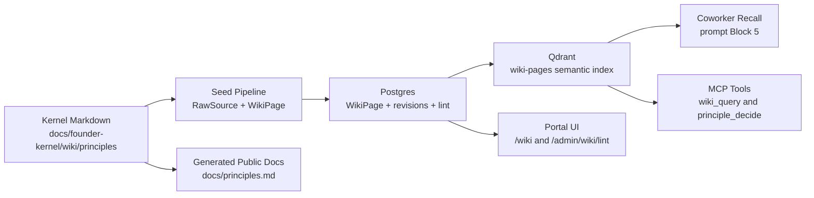

# Principles as a Wiki Kind - Design

> **Amended 2026-07-23** by [`2026-07-23-decision-tier-rebalance-and-vector-epistemology-design.md`](2026-07-23-decision-tier-rebalance-and-vector-epistemology-design.md).
> `principleConsumerArchetype: route-domain-specific` was intended as a routing hint but has become the de-facto migration label (50 of 95 kernel principles carry it, 39 of them software-engineering). Recommend renaming or splitting the tag once migration completes.

| Field | Value |
|-------|-------|
| **Date** | 2026-05-12 (re-baselined 2026-05-15) |
| **Status** | Draft — re-baselined after chief-architect review against actual worktree state |
| **Author** | Claude (design partner) for Mark Bodman |
| **Purpose** | Make DPF's durable operating principles a first-class, citable wiki kind, retrievable by in-platform coworkers and external coding agents, with inspectable advisory decision support. |

## 0. Chief Architect Review Summary

The direction is right: DPF needs a durable principle layer that is richer than `AGENTS.md`, more governed than local memory, and more retrievable than scattered specs. The 2026-05-15 chief-architect review against the live worktree found that **most of the foundation is already shipped** and the spec/plan baseline was materially stale. This revision narrows the scope to the remaining work:

1. **What's done, on the implementation base of this branch.**
   - `WikiPage.pageKind="principle"` is the eighth supported kind.
   - `WikiPage` already carries `principleTier`, `principleDirection`, `principleWeight`, `principleWeightRationale`, `principleDimensionVector`, `principleDimensions`, `principleAppliesTo`, `principlePublic`, `principlePublicRationale`, plus indexes on `principleTier` and `principlePublic` — applied via migration `20260513000000_add_principle_fields_to_wikipage`.
   - `packages/db/src/wiki-taxonomy.ts` is the single source of truth for `WIKI_PAGE_KINDS`, `WIKI_PAGE_STATUSES`, `PRINCIPLE_TIERS`, `PRINCIPLE_APPLIES_TO`, `PRINCIPLE_DIMENSIONS`, `PRINCIPLE_TIER_DEFAULT_WEIGHT`, `PRINCIPLE_TIER_CAPS`, and `PRINCIPLE_DECIDE_DEFAULTS`, with `isWikiPageKind` / `isPrincipleTier` / `isPrincipleAppliesTo` / `isPrincipleDimension` predicates. `wiki-store.ts` imports and re-exports the types.
   - `docs/founder-kernel/_templates/principle.template.md` exists. `docs/founder-kernel/wiki/principles/` already contains 41 published principle pages — three founder-kernel seed commandments (PR #565), the AI-coworker eight including Principle 9 / Responsible Capacity Utilization (PRs #566, #570), eight commandment-tier promotions from AGENTS.md (PR #579) plus two additional binding commandments (PR #590), fourteen core-tier promotions from AGENTS.md (PR #589), and six contextual-tier promotions from AGENTS.md (PR #592).
   - `docs/founder-kernel/manifest.json` is on `schemaVersion: 0.2.0`, `kernelVersion: 0.2.1`, `pageCount: 62`, `sourceCount: 11`, with the description naming the principle kind explicitly.
   - The AI-coworker principles markdown contains Principles 1–9.
2. **What this spec now owns.** The remaining net-new work is the **consumer-archetype axis** (§8A), the **back-fill of the 41 existing principle pages**, decision support (`principle_decide`), retrieval integration that respects consumer archetype, lint detectors for the new axis plus public safety and coherence, tier-first UI grouping with consumer-archetype filter chips, and Jekyll public-docs generation. The kernel-slug uniqueness gap originally carved out as Phase B is **already shipped** in the prior principle migration — see §9.3 for the verification.
3. **Decision math is advisory, not authority.** Principles do not "resolve mathematically" in the sense of replacing architecture judgment. The tool produces a scored recommendation with a contribution ledger, missing-data warnings, tie handling, and human override path. The `Principles as vectors` memory commitment is preserved as a *contribution-aggregation* model, not an authority model.
4. **Structured scoring does not parse prose.** Polarity is carried by an explicit signed `principleDimensionVector`. Prose `principleDirection` is the human-readable statement.
5. **Public principles are generated from the kernel source, not live DB rows.** The public site under `docs/` is built statically by Jekyll. The kernel markdown is the single source of truth; runtime `WikiPage` rows are seeded projections; the public site is a generated artifact from the same kernel source.
6. **The UI surface is part of the architecture.** Principles need a compact governance browser, detail pages, public rendering, admin lint, and decision breakdown views. The browser defaults to **tier-first** ordering (commandments above core above contextual) with consumer-archetype filter chips — tier is what determines weight, lint severity, retrieval injection, and cap enforcement, while consumer archetype is a filter dimension on top of that.

## 1. Inputs and Current Repo Truth

This design extends:

- [EP-WIKI-001 - Platform Kernel Wiki + Per-Org Overlay](2026-05-09-platform-kernel-wiki-design.md)
- [Wiki bi-temporal revisions](2026-05-09-wiki-bi-temporal-revisions-design.md), [importance/reflection](2026-05-09-wiki-importance-and-reflection-design.md), [PPR retrieval](2026-05-09-wiki-ppr-retrieval-design.md), and [visual navigation](2026-05-09-wiki-visual-navigation-design.md)
- [`docs/founder-kernel/SCHEMA.md`](../../founder-kernel/SCHEMA.md) and [`docs/founder-kernel/AUTHORING.md`](../../founder-kernel/AUTHORING.md)
- [`docs/architecture/ai-coworker-development-principles.md`](../../architecture/ai-coworker-development-principles.md)
- [`AGENTS.md`](../../../AGENTS.md)
- Live MCP planning context checked on 2026-05-12

### 1.1 Verified Current State (re-baselined 2026-05-15)

| Area | Current repo truth | Why it matters |
|------|--------------------|----------------|
| Wiki page kind union | `packages/db/src/wiki-taxonomy.ts` exports `WIKI_PAGE_KINDS` including `principle`. `wiki-store.ts` re-exports the type. The `WikiPage.pageKind` schema comment lists `entity | summary | decision | runbook | index | stance | heuristic | principle`. | The kind is a shipped fact. Net-new code must extend rather than introduce it. |
| Schema fields | `packages/db/prisma/schema.prisma` `WikiPage` model (lines ~7075–7117) already carries `principleTier`, `principleDirection`, `principleWeight`, `principleWeightRationale`, `principleDimensionVector`, `principleDimensions`, `principleAppliesTo`, `principlePublic`, `principlePublicRationale`, with `@@index([principleTier])` and `@@index([principlePublic])`. Migration `20260513000000_add_principle_fields_to_wikipage` shipped these. | The schema work is done **except for the consumer-archetype axis** (§8A). The remaining migration adds two columns and one index. |
| Knowledge model migration | `KnowledgeArticle` remains live beside `WikiPage` per EP-WIKI-001 Phase 1a; absorption is owned by a later EP-WIKI migration PR. | Principle work is additive on top of `WikiPage` and does not touch `KnowledgeArticle`. |
| Taxonomy constants | `wiki-taxonomy.ts` exports `WIKI_PAGE_KINDS`, `WIKI_PAGE_STATUSES`, `PRINCIPLE_TIERS`, `PRINCIPLE_APPLIES_TO`, `PRINCIPLE_DIMENSIONS`, `PRINCIPLE_TIER_DEFAULT_WEIGHT`, `PRINCIPLE_TIER_CAPS`, `PRINCIPLE_DECIDE_DEFAULTS`, plus `isWikiPageKind` / `isWikiPageStatus` / `isPrincipleTier` / `isPrincipleAppliesTo` / `isPrincipleDimension`. | The remaining constants work is `PRINCIPLE_CONSUMER_ARCHETYPES`, `PRINCIPLE_CONSUMER_CONTEXT_EXAMPLES`, and the matching `isPrincipleConsumerArchetype` / `isPrincipleConsumerContextSlug` predicates. |
| Qdrant wiki search | `searchWikiPages` supports `query`, `organizationId`, optional `pageKind`, `limit`, and `scoreThreshold`. Filters published rows and does overlay-aware two-pass retrieval. | Principle-aware filters (`principleTier`, `principleAppliesTo`, `principleConsumerArchetype`, `principleConsumerContext`, `principlePublic`) are not yet wired. Commandments still need a Postgres-first prepass for "always include" semantics. |
| Passive recall | `recallWikiContext` performs a single `searchWikiPages` call and formats the result. | A principle-aware `recallPrincipleContext` (Postgres-first commandments + Qdrant relevance for core/contextual, filtered by consumer archetype before tier weighting) is still net-new. |
| In-portal MCP tool | `wiki_query` exists in `PLATFORM_TOOLS` with `query`, `pageKind`, and `limit` filters. | `tier`, `appliesTo`, `consumerArchetype`, `consumerContext`, `publicOnly`, and principle-specific output are still net-new. |
| Tool execution modes | `ToolDefinition.executionMode` is `"proposal" | "immediate"`. | `principle_decide` must use `executionMode: "immediate"`, `sideEffect: false`, advisory description. `"advisory"` is not a valid execution mode. |
| External MCP | `/api/mcp/v1` exposes platform tools through JSON-RPC, gates them by token scope, and default-denies tools without grant mappings. `wiki_query` maps to `registry_read`. | `principle_decide` provisionally maps to `registry_read`; see §11.5 on the future case for a tighter advisory-grant. |
| Founder kernel schema and authoring | `SCHEMA.md` documents the eight page kinds including `principle`. `AUTHORING.md` documents the principle authoring contract and the `wiki/principles/` folder convention. The principle template exists at `docs/founder-kernel/_templates/principle.template.md`. | Schema and authoring docs are shipped. Updates needed: add consumer-archetype frontmatter shape, coherence rule (§8A), and back-fill guidance. |
| Founder kernel content | `docs/founder-kernel/manifest.json` is on `kernelVersion: 0.2.1`, `schemaVersion: 0.2.0`, `pageCount: 62`, `sourceCount: 11`. `docs/founder-kernel/wiki/principles/` contains 41 published principle pages: founder-kernel seed commandments (PR #565); AI-coworker Principles 1–9 (PRs #566, #570); ten commandment-tier promotions from AGENTS.md (PRs #579, #590); fourteen core-tier promotions from AGENTS.md (PR #589); six contextual-tier promotions from AGENTS.md (PR #592). | Phases that used to seed these pages from scratch are obsolete. The remaining content work is **back-fill** of consumer archetype + contexts onto the 41 existing pages, plus separately-scoped future memory promotions (Batch 5) and public-docs generation (Batch 6) which have **not** shipped on main. |
| AI principles document | `docs/architecture/ai-coworker-development-principles.md` contains Principles 1–9 including `## Principle 9: Responsible Capacity Utilization`. The capacity-continuity spec `2026-05-12-ai-capacity-continuity-design.md` is present alongside this spec. | Earlier phase plans that branched on "is Principle 9 here?" are obsolete. The pre-check is redundant; the answer is yes. |
| Public docs site | `docs/_config.yml` is a Jekyll/GitHub Pages config, excludes `superpowers`, and applies default layout to Markdown pages. | `/principles` on the public site is still a generated `docs/principles.md` artifact, not a Next.js route querying runtime Postgres. Public docs generation is still net-new. |
| Kernel slug uniqueness | `WikiPage` carries `@@unique([organizationId, slug])`, which does not protect kernel rows where `organizationId IS NULL`. | Two kernel rows can currently collide on `slug`. Closing this is a small refactor-budget PR that does not depend on principle work and should ship independently. |
| Live planning state | The spec links to a backlog item/epic via `Backlog linkage` in §1.2. Implementation PRs MUST cite that ID rather than treating this work as orphan. | Per the *Verify substrate before proposing new substrate* and *Continuous overlap sweep* feedback, this work must be tied to live planning state before any PR opens. |

### 1.2 Backlog Linkage and Discoverability

Established practice on this substrate is that principle PRs ship via PR alone — the shipped batches (#531, #538, #542/#564, #565, #566, #570, #579, #589, #590, #592) cite no `BI-*` IDs and rely on the PR title + body for discoverability. This spec respects that pattern: a `BI-*` ID is recommended but not strictly required.

What IS required:

1. Before opening the PR, run `mcp__dpf__search_specs_and_plans` for "principles wiki kind consumer archetype" and `mcp__dpf__list_epics` for open epics — record matches in the PR body.
2. If an existing epic fits (likely `EP-TAK-3F9A21` for governed memory + MCP grants, or `EP-DOCS-6B9F2A` for the public-docs Jekyll piece), attach the PR to it via the PR body. If no epic fits cleanly, the PR body must include a self-contained "Why this exists" paragraph so the work is discoverable from PR search alone.
3. The PR title MUST name the substantive change (e.g., `feat(principles): consumer archetypes, advisory decision support, retrieval, lint, UI, public docs`) — never a generic `feat(wiki): updates`.

This loosens the earlier "MUST create or attach a backlog item" framing because the actual practice across the shipped batches shows the PR + merge history is the source of truth for principle work, not the backlog table.

## 2. Research and Benchmarking

DPF's design should borrow proven knowledge-base patterns without copying their operating model wholesale.

| Product / project | Data-model pattern | Adopt | Reject |
|-------------------|-------------------|-------|--------|
| [MediaWiki](https://www.mediawiki.org/wiki/Manual:Database_layout) | Durable page and revision tables, with content separated from page metadata in modern schemas. | Keep page/revision separation and immutable revision history. | Do not adopt free-form wiki categories as governance taxonomy; DPF needs typed principle fields and lint. |
| [Docusaurus](https://docusaurus.io/docs/sidebar) | Markdown files produce static docs navigation from filesystem structure. | Generate public principles from repo kernel markdown so public docs are reviewable and static. | Do not make public docs the runtime source of truth; runtime must be seeded from the kernel. |
| [Logseq](https://github.com/logseq/docs) / file-based graph tools | Local Markdown graph with pages, blocks, links, and graph navigation. | Preserve portable Markdown and wikilinks for founder-kernel content. | Do not use block-level principles as the canonical runtime model; principle governance needs stable page-level source citations and review. |
| [Notion blocks](https://developers.notion.com/reference/block) | Content is composed from typed blocks and child block trees. | Use structured metadata around prose rather than relying only on document text. | Do not move DPF kernel content into opaque block trees; Git review and plain Markdown matter more. |
| [Confluence Cloud](https://developer.atlassian.com/cloud/confluence/rest/) | Spaces, content, labels, versions, and APIs for page history. | Keep labels/tags as secondary discovery aids and versions as auditable history. | Do not make "space" the governance boundary; DPF already has kernel/org overlay as the boundary. |
| [Guru verification](https://help.getguru.com/docs/verifying-and-unverifying-cards) | Cards carry trust/verification status, owners, and verification intervals. | Adopt explicit verification/freshness indicators for public and agent-facing principles. | Do not let automatic verification publish or unpublish kernel principles without human review. |
| [Obsidian](https://obsidian.md/help/data-storage) | Notes are Markdown files in local vaults, with local-first portability. | Keep founder principles portable and versioned in the repo. | Do not treat a personal vault/memory corpus as deployable product content without review, privacy filtering, and source rewrite. |

**Benchmarked conclusion:** DPF should use a hybrid model: markdown-first kernel content like Docusaurus/Obsidian, page/revision/source records like MediaWiki/Confluence, verification/freshness signals like Guru, and typed metadata beyond what general-purpose note tools provide.

## 3. Problem Statement

DPF's governance is directionally correct but scattered across surfaces with different authority levels:

| Surface | Content | Current issue |
|---------|---------|---------------|
| `AGENTS.md` | Canonical coding-agent rulebook plus operational commands | Mixes durable principles with worktree, command, and verification mechanics. It must stay readable to agents, so it cannot simply be replaced by a wiki. |
| `docs/architecture/ai-coworker-development-principles.md` | Eight branch-local AI coworker principles | No tiering, no applies-to scope, no public rendering, no runtime retrieval as principles. |
| Founder kernel wiki | Schema, seed, retrieval, viewer, lint plumbing | Current page kinds support stance/heuristic judgment but not tiered governance principles with machine-readable decision dimensions. |
| Local memory | Strong accumulated preferences and project lessons | Local, not deployable, not reviewable by PR, and not safe to bulk publish. |
| Specs and plans | Repeated principle-shaped claims | Buried in dated artifacts and only rediscovered by manual reading. |

The platform consequence is not only duplication. It is inconsistent judgment under pressure. Agents can see "architecture over shortcuts" in one surface, "use it or lose it" in another, and current route/tool instructions somewhere else. Without a governed retrieval and conflict-inspection surface, they either overfit the latest prompt or invent precedence.

## 4. Strategic Position

Principles should become a **governed judgment layer**, not another documentation category.

The canonical flow is:



Key architectural decisions:

- **`principle` is a page kind, not a separate `Principle` model.** It inherits kernel/org overlay, source citations, revisions, links, lint, and semantic retrieval.
- **Principle metadata lives on `WikiPage`.** The small set of principle-only fields is justified because filtering, linting, and display all need them. No parallel governance table.
- **The source of truth is kernel markdown.** Runtime DB and Qdrant are projections. Public docs are generated from the same kernel source.
- **The decision tool is an explainer.** It helps an agent understand which principles pull which way. It does not grant authority, bypass TAK/HITL, or replace human approval.
- **AGENTS.md remains operationally authoritative for coding agents.** Durable principle prose can point to the wiki, but command, verification, branch, and local QA rules stay inline enough to be usable before an agent has queried anything.

## 5. Goals

1. Add `principle` as a first-class `WikiPage.pageKind` with authoring schema, seed support, viewer support, MCP filters, and lint.
2. Establish a tiered principle taxonomy: `commandment`, `core`, and `contextual`.
3. Make principles retrievable in three ways: passive coworker recall, in-portal `wiki_query`, and external MCP `wiki_query` for agents with `registry_read`.
4. Provide `principle_decide` as an immediate, read-only, advisory MCP tool that returns scored options plus a per-principle contribution ledger.
5. Render public-safe principles on the public docs site from generated static Markdown.
6. Promote durable governance from the existing principles doc, selected `AGENTS.md` sections, and reviewed memory candidates without importing private operational memory wholesale.
7. Keep UX excellent: principles must be readable, inspectable, filterable, theme-aware, and useful to humans as well as agents.

## 6. Non-Goals

- Replacing `AGENTS.md`. Coding agents still need local operational rules before any wiki lookup.
- Retiring `KnowledgeArticle`. This spec depends on EP-WIKI but does not complete the `KnowledgeArticle` to `WikiPage` migration.
- Publishing Mark's local memory corpus directly. Memory candidates require review, redaction, source rewriting, and public/internal classification.
- Letting math make production decisions. TAK, permissions, proposal mode, HITL gates, and tool grants remain authoritative.
- Building a new vector store, graph DB projection, or separate governance engine.
- Solving full principle ontology governance forever. V1 ships a narrow dimension registry and learns from real use.

## 7. Principle Page Contract

### 7.1 Page Kind

Add `principle` to:

- `packages/db/src/wiki-store.ts` `WikiPageKind`
- `docs/founder-kernel/SCHEMA.md`
- `docs/founder-kernel/AUTHORING.md`
- `docs/founder-kernel/_templates/principle.template.md`
- `docs/founder-kernel/wiki/principles/`
- `apps/web/components/wiki/WikiPageKindBadge.tsx`
- `apps/web/components/wiki/WikiPageList.tsx` ordering
- `apps/web/lib/wiki/embeddings.ts` payload conventions
- `apps/web/lib/mcp-tools.ts` `wiki_query` input enum
- tests for seeding, query, lint, badge/list rendering, and MCP tool schemas

### 7.2 Required Sections

A principle page body must use this structure:

```markdown
## Rule

One declarative sentence.

## Why

The strategic rationale.

## Applies To

Population and context boundaries.

## How To Apply

Concrete operating guidance.

## Decision Dimensions

Human-readable explanation of the signed dimension vector.

## Examples

At least one positive example and one non-example.

## Sources

Rendered from WikiPageSource; not manually duplicated in body.
```

### 7.3 Relationship to Existing Kinds

| Kind | Question answered | Example |
|------|-------------------|---------|
| `stance` | "What is Mark's position on X?" | "Founder view on customer-owned integrations." |
| `heuristic` | "When X happens, what rule of thumb helps?" | "Split a feature when it crosses two bounded contexts." |
| `principle` | "What governs decisions across all matching contexts?" | "Architecture over shortcuts." |

Principles may link to stances and heuristics, but they are more durable and carry machine-readable scope, tier, weight, and decision dimensions.

## 8. Tier Taxonomy

| Tier | Default weight | Cap | Lint gate | Intended use |
|------|----------------|-----|-----------|--------------|
| `commandment` | `1.0` | 10 published kernel principles | Error if cap exceeded; direction and vector required | Non-negotiable operating doctrine that should shape every relevant decision. |
| `core` | `0.4` | 30 published kernel principles | Warn if direction missing; vector recommended | Strong defaults that guide most platform decisions. |
| `contextual` | `0.1` | No hard cap | Applies-to scope required | Narrow operational rules that matter only in a bounded situation. |

Tier inflation is the primary governance failure mode. A commandment requires:

- `principleWeightRationale`
- at least one source
- explicit `principleDimensionVector`
- commandment-cap lint pass
- human review in the PR

`situational` is intentionally not a wiki tier. Situational notes stay in memory, backlog comments, execution evidence, or dated specs.

## 8A. Consumer Archetype Taxonomy

Tier answers "how strongly should this govern a decision?" It does not answer "who is expected to consume this?" The portal and retrieval paths need a second axis so humans reviewing the wiki and AI coworkers retrieving context do not see Build Studio-specific, specialist-specific, or route-bound material mixed into universal guidance.

Add a principle consumer archetype:

| Consumer archetype | Meaning | Default portal placement | Runtime retrieval posture |
|--------------------|---------|--------------------------|---------------------------|
| `universal` | Applies to humans and AI anywhere in DPF. | Universal | Always eligible when `principleAppliesTo` matches the caller. |
| `ai-coworker-universal` | Applies to all in-platform AI coworkers, regardless of route. | AI Coworker Universal | Eligible for all AI coworker recall; visible to humans reviewing AI governance. |
| `generalist` | Applies to generalist/orchestrator coworkers such as the COO, especially when coordinating or escalating work. | Generalist / COO | Eligible for generalist agents and coordinator routes; not injected into specialist-only recall by default. |
| `specialist` | Applies to specialist coworkers as a class. | Specialists | Eligible for specialist agents before route-specific rules are considered. |
| `route-domain-specific` | Applies only inside a named product surface, route, domain, or workflow. Build Studio principles live here unless they truly apply everywhere. | Route / Domain Specific, grouped by context such as Build Studio | Eligible only when the caller's route/domain context matches, or when the query explicitly asks for that context. |

Use `principleConsumerContexts` for the specific route/domain labels behind `route-domain-specific`, such as `build-studio`, `marketing`, `compliance`, `discovery`, `finance`, `storefront`, or `portfolio`. These are governed slug strings, not a closed enum; route-facing lint can compare them against `apps/web/lib/tak/route-context-map.ts` where a route context exists. A route-specific principle without at least one context is a lint error. Context labels are for consumption routing and human review; they do not create new wiki pages.

### 8A.1 Coherence Matrix (consumer archetype × applies-to)

The two axes are independent in the schema but not in semantics. The coherence rule below is enforced by `principle-incoherent-archetype-applies-to` lint (§14):

| Consumer archetype \ `principleAppliesTo` | `in_platform_coworker` | `external_coding_agent` | `human` |
|---|---|---|---|
| `universal` | required (with at least one of external or human) | required (with at least one of in-platform or human) | required (with at least one of in-platform or external) |
| `ai-coworker-universal` | ✅ valid | ✅ valid | ❌ incoherent — humans are not AI coworkers |
| `generalist` | ✅ valid | ✅ valid (treats Claude Code, Codex CLI, and similar broad agents as generalists) | ❌ incoherent — "generalist" denotes a generalist agent, not a human role |
| `specialist` | ✅ valid | ⚠️ rare but valid only when the principle scopes a specialist external agent (e.g., a single-purpose CI bot); lint warns and asks for `principleWeightRationale` | ❌ incoherent |
| `route-domain-specific` | ✅ valid (most Build Studio coworker rules live here) | ✅ valid (route-specific external-agent rules) | ✅ valid (humans operating inside a specific product surface — e.g., a Storefront-specific human policy) |

Rules:

- `universal` requires at least two `principleAppliesTo` populations. Otherwise it is not universal and should be tightened to `ai-coworker-universal`, `generalist`, `specialist`, or `route-domain-specific`.
- `ai-coworker-universal`, `generalist`, and `specialist` MUST NOT include `human` in `principleAppliesTo`. These archetypes describe agent classes.
- `route-domain-specific` MAY include `human`, since route/domain governance often binds humans operating inside that route.
- `specialist` + `external_coding_agent` is rare (most external agents are generalists). Lint downgrades this to a `warn` and requires `principleWeightRationale` to explain the specialist scope.

Back-fill of the 41 existing principle pages MUST apply this matrix. Lint blocks publish on incoherent combinations.

## 9. Schema Extension

### 9.1 What is already in the schema

The first principle migration (`20260513000000_add_principle_fields_to_wikipage`) is already applied on this branch. The following fields are live on `WikiPage`:

```prisma
  principleTier            String?   // commandment | core | contextual
  principleDirection       String?   @db.Text
  principleWeight          Float?
  principleWeightRationale String?   @db.Text
  principleDimensionVector Json?     // Record<dimension, signed weight -1..1>
  principleDimensions      String[]  @default([])
  principleAppliesTo       String[]  @default([])
  principlePublic          Boolean   @default(false)
  principlePublicRationale String?   @db.Text

  @@index([principleTier])
  @@index([principlePublic])
```

### 9.2 What this spec still adds (the only remaining schema delta)

Two columns and one index for the consumer-archetype axis:

```prisma
  principleConsumerArchetype String?  // universal | ai-coworker-universal | generalist | specialist | route-domain-specific
  principleConsumerContexts  String[] @default([]) // route/domain labels such as build-studio

  @@index([principleConsumerArchetype])
```

Notes:

- The two new fields default to nullable / empty array so the migration applies cleanly to the 41 existing principle rows. Back-fill happens via kernel-markdown frontmatter edits + re-seed, not via DML in the migration.
- `principleDimensionVector` remains JSON because Prisma cannot express a typed sparse vector map in the schema. Its keys are validated against `PRINCIPLE_DIMENSIONS` by seed parsing and lint.
- No Prisma GIN index on array containment in V1. If `principleAppliesTo` or `principleConsumerContexts` filtering becomes hot, add a hand-written Postgres GIN index in a later migration with metrics evidence.
- Canonical consumer-archetype string values live in `packages/db/src/wiki-taxonomy.ts` (added by this spec) and are imported by seed, lint, MCP schemas, retrieval, and UI. Consumer contexts use a shared slug-normalization helper rather than a closed enum.

### 9.3 Adjacent refactor — kernel slug uniqueness gap (ALREADY SHIPPED)

Status: **closed**. Verified post-merge on 2026-05-15.

The earlier chief-architect-review draft of this spec carved this gap out as Phase B, a separate small PR. Subsequent inspection of the migration history shows the partial unique index was already shipped in the **same migration that added the original principle fields**: `20260513000000_add_principle_fields_to_wikipage` lines under `-- Kernel slug uniqueness guard (Prisma-invisible — managed only here)`. The migration includes:

```sql
CREATE UNIQUE INDEX "WikiPage_kernel_slug_key"
    ON "WikiPage"("slug")
    WHERE "organizationId" IS NULL;
```

Background (kept for context only — no work required): `WikiPage` carries `@@unique([organizationId, slug])`, and Postgres treats `NULL` values as distinct under composite unique constraints, so without the partial index two kernel rows could share a slug. The partial index closes the gap at the database layer regardless of which code path performs the write. `wiki-store.ts upsertWikiPage` documents the same constraint at the helper layer.

Prisma cannot model partial indexes in the schema language, so the index lives only in the migration SQL and is intentionally exempt from `prisma migrate dev` drift detection. Do not let a future migration "remove" it.

No follow-up PR is required for this gap.

## 10. Dimension Registry

V1 ships a small registry, not open-ended free text.

```typescript
export const PRINCIPLE_DIMENSIONS = [
  "long_term_maintainability",
  "blast_radius",
  "reusability",
  "evidence_density",
  "human_cognitive_load",
  "capacity_utilization",
  "governance_compliance",
  "public_safety",
  "speed_to_value",
  "schema_grounding",
] as const;
```

Each principle stores a signed vector over those dimensions:

```json
{
  "long_term_maintainability": 1.0,
  "schema_grounding": 0.8,
  "speed_to_value": -0.4
}
```

The prose `principleDirection` explains the vector to humans; the vector drives structured scoring. Never parse prose to infer polarity.

Starter examples:

| Principle | Direction | Dimension vector |
|-----------|-----------|------------------|
| Architecture over shortcuts | Prefer long-term maintainability over short-term speed. | `{ "long_term_maintainability": 1, "schema_grounding": 0.8, "speed_to_value": -0.4 }` |
| Evidence before diagnosis | Prefer queried state and evidence density over inferred causes. | `{ "evidence_density": 1, "blast_radius": 0.3 }` |
| Use idle capacity for governed work | Prefer converting idle capacity into approved backlog progress. | `{ "capacity_utilization": 1, "governance_compliance": 0.7, "human_cognitive_load": -0.2 }` |
| DPF is a conduit, not a broker | Prefer customer-owned integrations over platform-brokered obligations. | `{ "public_safety": 0.8, "governance_compliance": 1, "blast_radius": 0.6 }` |

## 11. Decision Support

### 11.1 Tool Contract

Add `principle_decide` to `PLATFORM_TOOLS`:

```typescript
input: {
  context: string;
  options: Array<{
    id: string;
    description: string;
    features?: Record<string, number>; // dimension scores normalized 0..1
  }>;
  callingPopulation: "in_platform_coworker" | "external_coding_agent" | "human";
  maxPrinciples?: number; // default 20
  tieMargin?: number;     // default 0.2
}
```

Tool metadata:

- `executionMode: "immediate"`
- `sideEffect: false`
- annotations: `readOnlyHint: true`, `destructiveHint: false`, `idempotentHint: true`
- grant: `registry_read` (provisional — see §11.5)
- response semantics: advisory only

### 11.5 Grant-mapping is provisional

Mapping `principle_decide` to `registry_read` is the right starting point — it inherits an existing scope, requires no new TAK governance surface, and matches the read-only behavior of the tool. But `principle_decide` is decision support, not registry read. A future TAK/GAID refresh (already tracked under the TAK epic referenced by §1.2) may introduce a tighter scope such as `principle_advisory_read` to distinguish "see the principle catalog" from "score options against the catalog." When that refinement lands, `principle_decide` migrates to the tighter scope. Until then, the read-only and side-effect-free annotations are load-bearing.

### 11.6 Org overlay contract

Mark's `Single org per install (no multi-tenancy)` posture means overlay risk is low in practice today, but the underlying data model is multi-tenant via `WikiPage.kernelPageId`. The contract:

- **Retrieval.** `recallPrincipleContext` for a caller in org `X` returns:
  1. Overlay principles published by org `X` that match scope (always, when `principleTier="commandment"`; subject to Qdrant ranking otherwise).
  2. Kernel principles NOT shadowed by an org-`X` overlay (matched by `kernelPageId` reference).
  3. For other orgs, only the kernel set is returned. Overlay rows are org-scoped.
- **Cap.** The kernel commandment cap of 10 is global to the kernel. Each org carries its own cap (default 10) over its own overlay commandments. Lint enforces both.
- **Ledger.** `principle_decide` contribution ledger rows include `source: "kernel"` or `source: "overlay:<orgId>"` and, when the row is an overlay, `overrides: "<kernel-slug>"` if applicable. Reviewers can see exactly which principle voted.
- **Public docs.** `docs/principles.md` is generated from kernel principles only. Overlay principles are never written to the public site.

### 11.2 Retrieval Procedure

1. **Load commandments by DB query.** Select published `pageKind="principle"` rows where `principleTier="commandment"` and `principleAppliesTo` includes the calling population.
2. **Load relevant core/contextual principles by Qdrant.** Extend `searchWikiPages` or add `searchPrinciples` with `pageKind`, `tier`, `appliesTo`, and threshold filtering.
3. **Merge and dedupe.** Commandments always remain included; core/contextual results are relevance-ranked up to `maxPrinciples`.
4. **Compute structured alignment when possible.** If an option supplies features for dimensions in the principle vector:

```text
alignment = dot(optionFeatures, principleDimensionVector) / sum(abs(principleDimensionVector values))
```

5. **Fallback to semantic alignment only when structured data is missing.** Embed option description against `principleDirection`; mark the contribution as semantic so the caller can see lower confidence.
6. **Composite score.**

```text
optionScore = sum(principleWeight * alignment)
```

7. **Return a contribution ledger.** Include every principle, tier, weight, relevance score, alignment by option, contribution by option, whether scoring was structured or semantic, and any missing dimensions.

### 11.3 Guardrails

- If `margin < tieMargin`, return `confidence="low"` and require human review in the reasoning.
- If a commandment has a strong negative contribution against the top option, flag `commandmentConflict=true`.
- If more than 40 percent of contributions are semantic fallback, flag `structuredCoverage="weak"`.
- If no principles apply, return no recommendation and `confidence="low"`.
- Do not auto-execute follow-up tools from this result. Callers must use their normal approval and TAK gates.

### 11.4 Example

Decision context: "Bug in middleware. Option A: three-line patch. Option B: refactor module boundary."

```text
Option A features:
  long_term_maintainability=0.1
  schema_grounding=0.3
  speed_to_value=0.9
  evidence_density=0.5

Option B features:
  long_term_maintainability=0.9
  schema_grounding=0.8
  speed_to_value=0.3
  evidence_density=0.8

Architecture over shortcuts vector:
  long_term_maintainability=1.0
  schema_grounding=0.8
  speed_to_value=-0.4

Alignment A = ((0.1*1.0) + (0.3*0.8) + (0.9*-0.4)) / 2.2 = -0.009
Alignment B = ((0.9*1.0) + (0.8*0.8) + (0.3*-0.4)) / 2.2 = 0.645
```

The output should explain that Option B wins because the strongest commandments and evidence-density guidance favor it; capacity/speed may favor Option A, but not enough to override the higher-tier principles.

## 12. Retrieval Integration

### 12.1 Passive Recall

Add a principle-aware recall helper rather than overloading the current single-search `recallWikiContext`. Lint detectors that depend on Qdrant similarity (`principle-duplicate`, `principle-contradiction-review`) run **after** seed completes; on a cold start without Qdrant content they degrade to no-op and emit an `info`-level finding rather than failing the orchestrator. Lint must remain usable before any embedding exists.

```typescript
recallPrincipleContext({
  query,
  organizationId,
  callingPopulation,
  consumerArchetype,
  consumerContext,
  limit,
})
```

It should:

- inject all in-scope commandments, capped at 10
- add top relevant core principles, default 5
- add contextual principles only above a higher threshold, default 0.75
- filter by consumer archetype before tier weighting: universal first, then caller-specific archetypes, then matching route/domain contexts
- exclude `route-domain-specific` principles unless `consumerContext` matches or the query explicitly asks for that route/domain
- format principles separately from ordinary wiki context so system prompts can distinguish governance from background knowledge
- silently degrade like existing wiki recall if Qdrant is down, but still include commandments from Postgres when DB is available

### 12.2 `wiki_query`

Extend both in-portal and external MCP tool schema:

```typescript
{
  query: string;
  pageKind?: "entity" | "summary" | "decision" | "runbook" | "index" | "stance" | "heuristic" | "principle";
  tier?: "commandment" | "core" | "contextual";
  appliesTo?: "in_platform_coworker" | "external_coding_agent" | "human";
  consumerArchetype?: "universal" | "ai-coworker-universal" | "generalist" | "specialist" | "route-domain-specific";
  consumerContext?: string;
  publicOnly?: boolean;
  limit?: number;
}
```

When `pageKind="principle"`, the response should include principle metadata, not only slug/kind/title. The metadata includes tier, applies-to, consumer archetype, consumer contexts, public/internal state, and direction. For external MCP, verify the tool appears in `/api/mcp/v1` `tools/list` for tokens with `registry_read`.

### 12.3 AGENTS.md Discovery

Update `AGENTS.md` only after the external MCP/tooling slice lands:

- Keep local operational rules inline.
- Add a short pointer near the top: "For durable DPF governance principles, query `wiki_query` with `pageKind='principle'` when the MCP connector is available."
- Do not make compliance with core rules depend on a live wiki lookup.

## 13. Public and Portal UX

### 13.1 Portal Principle Browser

The existing `/wiki` list is a good base, but principle pages need a governance-first organization. Do not create duplicate wiki pages to solve this; organize the same pages.

- The default grouping for `/wiki?kind=principle` is **tier-first**: Commandments → Core → Contextual. Tier is what determines weight, lint severity, retrieval injection, and cap enforcement, so tier is the load-bearing view of governance hierarchy.
- Consumer archetype is a **filter-chip group** above the list: Universal, AI Coworker Universal, Generalist / COO, Specialists, Route / Domain Specific. Multi-select; default is all-selected. A secondary sort toggle lets a user flip the grouping to **CA-first** when they want a route/domain audit (e.g., "show me everything Build Studio coworkers see").
- Route / Domain Specific rows show their `principleConsumerContexts` as chips. When the CA filter narrows to Route / Domain Specific, rows further sub-group by context (Build Studio, Marketing, Compliance, …).
- Compact rows (not large cards): tier badge, title, direction, applies-to chips, consumer archetype chip, route/domain context chips, public/internal state, source count, last reviewed date.
- `pageKind` is a secondary filter (and a small badge per row). It must not be the primary human-review organization when the user is already inside the principle browser.
- Use DPF tokens only: `text-[var(--dpf-text)]`, `text-[var(--dpf-muted)]`, `bg-[var(--dpf-surface-1)]`, `bg-[var(--dpf-surface-2)]`, `border-[var(--dpf-border)]`, `text-[var(--dpf-accent)]`. No hardcoded colors.
- Add a dimension mini-strip using labels and accessible text. Do not rely on color alone.
- Keep row heights stable; badges and long principle names must wrap without resizing adjacent controls.

### 13.2 Principle Detail Page

Extend `WikiPageViewer` for `pageKind="principle"`:

- Header: title, tier, applies-to chips, public/internal badge, weight, source count.
- Direction panel: human-readable `principleDirection`.
- Application panel: "When this applies" and "When this does not apply."
- Decision dimensions: signed vector shown as a readable table.
- Related stances and heuristics via existing wiki links.
- Sources at bottom using `WikiSourceCitations`.

### 13.3 Decision Breakdown View

For `principle_decide` results surfaced in Build Studio, coworker chat, or admin tooling:

- Present the recommendation first, then a compact contribution table.
- Use a horizontal contribution bar per option, with positive and negative segments and text labels.
- Make commandment conflicts visually obvious using tokenized alert styling, not hardcoded red.
- Include "semantic fallback" warnings when option features are missing.
- Offer no one-click "execute recommended action" from the breakdown. The user or agent must continue through the normal workflow.

### 13.4 Public Site

The public docs site is static Jekyll under `docs/`. Therefore:

- Generate `docs/principles.md` from `docs/founder-kernel/wiki/principles/*.md`.
- Include only kernel principles with `principlePublic=true`.
- Keep source links to public-safe `RawSource` locators.
- Add a link from `docs/index.html` and `docs/README.md`.
- The generated page should be sober and product-facing: tiered sections, concise descriptions, no internal memory or local-agent details.

## 14. Lint Extensions

Use existing `WikiLintFinding.findingKind` and severity values (`info`, `warn`, `error`).

| Finding kind | Severity | Blocks publish | Detection |
|--------------|----------|----------------|-----------|
| `principle-missing-tier` | error | yes | `pageKind="principle"` and `principleTier IS NULL` |
| `principle-missing-direction` | error | yes | Commandment/core principle without `principleDirection` |
| `principle-missing-vector` | error for commandment, warn for core | commandment only | Missing or empty `principleDimensionVector` |
| `principle-unknown-dimension` | error | yes | Vector or dimensions include a key outside registry |
| `principle-vector-dimension-mismatch` | warn | no | `principleDimensions` does not match vector keys |
| `principle-missing-applies-to` | error | yes | Empty `principleAppliesTo` |
| `principle-missing-consumer-archetype` | error | yes | Empty or unknown `principleConsumerArchetype` |
| `principle-route-context-missing` | error | yes | `route-domain-specific` without at least one `principleConsumerContexts` entry |
| `principle-incoherent-archetype-applies-to` | error / warn | yes for error rows | Violates §8A.1 coherence matrix: `human` paired with `ai-coworker-universal` / `generalist` / `specialist` = `error`; `specialist` + `external_coding_agent` without `principleWeightRationale` = `warn` with required rationale; `universal` with fewer than two `principleAppliesTo` populations = `error` |
| `principle-tier-weight-mismatch` | warn | no | Weight differs from tier default without rationale |
| ~~`principle-commandment-cap-exceeded`~~ | — | — | **Removed 2026-05-22.** Commandments are no longer capped — see plan `docs/superpowers/plans/2026-05-22-principle-scope-refactor.md`. Tier governs conflict-resolution priority, not scarcity. Detector and tests deleted; finding-kind enum reduced from 12 to 11. |
| `principle-public-missing-rationale` | warn | no | `principlePublic=true` without `principlePublicRationale` |
| `principle-public-unsafe-marker` | error | yes | Public principle body references local memory paths, private tokens, local user paths, unreleased PR claims, or internal-only agent instructions |
| `principle-duplicate` | warn | no | Near-duplicate of another principle by embedding similarity and title/body overlap |
| `principle-contradiction-review` | warn | no | Opposing vectors on the same dimensions with high semantic similarity |

The contradiction lint does not auto-resolve. Contradictions can be legitimate; the job is to force an explicit review note.

## 15. Migration and Delivery Plan

Earlier revisions of this spec described seven sequential batches starting from scratch. After the 2026-05-15 re-baseline, most of that work is already shipped. The remaining delivery is **one focused phase** (consumer-archetype axis + back-fill + decision support + retrieval + lint + UI + public-docs generator). The kernel-slug uniqueness fix originally proposed as Phase B is already shipped (§9.3); the `principle_decide` advisory tool may split into its own PR if it does not fit cleanly in the main one.

The detailed implementation plan lives in [`2026-05-12-principles-as-wiki-kind.md`](../plans/2026-05-12-principles-as-wiki-kind.md). The summary below is intentionally short — read the plan for tasks, files, and verification commands.

### Phase A — Consumer-archetype axis and back-fill (main PR)

- **Schema.** Add `principleConsumerArchetype String?` and `principleConsumerContexts String[] @default([])` to `WikiPage`. Add `@@index([principleConsumerArchetype])`. New migration `<timestamp>_add_principle_consumer_archetype_to_wikipage`.
- **Taxonomy constants.** Extend `wiki-taxonomy.ts` with `PRINCIPLE_CONSUMER_ARCHETYPES`, `PRINCIPLE_CONSUMER_CONTEXT_EXAMPLES`, `isPrincipleConsumerArchetype`, `isPrincipleConsumerContextSlug`. Existing constants stay.
- **Seed parsing.** Extend `seed-wiki-kernel.ts` to parse `principleConsumerArchetype` and `principleConsumerContexts` from frontmatter. Validate via the new predicates; reject `route-domain-specific` without at least one context.
- **Back-fill.** Edit the 41 existing principle pages under `docs/founder-kernel/wiki/principles/` to add `principleConsumerArchetype` and (where applicable) `principleConsumerContexts` frontmatter. Defaults per §8A.1 coherence matrix; Build Studio principles use `route-domain-specific` + `[build-studio]`. Re-seed verifies the back-fill.
- **Qdrant payload.** Extend the wiki-page payload write helper so principle pages also carry `principleConsumerArchetype` and `principleConsumerContexts`. Non-principle pages are unchanged.
- **Retrieval.** Add `recallPrincipleContext` (Postgres-first commandments + Qdrant relevance for core/contextual) with consumer-archetype filtering ahead of tier weighting. Wire it into `recallWikiContext`. Pass route/domain context through.
- **MCP.** Extend `wiki_query` schema with `tier`, `appliesTo`, `consumerArchetype`, `consumerContext`, `publicOnly`. Update the handler to forward to `searchWikiPages`. Add `principle_decide` (executionMode: immediate, sideEffect: false, advisory). Map to `registry_read` (see §11.5).
- **Lint.** Add the principle detectors per §14 (tier/direction/vector/applies-to/consumer-archetype/route-context/incoherent-archetype-applies-to/tier-weight-mismatch/commandment-cap/public-rationale/public-unsafe/duplicate/contradiction). Detectors that depend on Qdrant degrade to no-op + info finding on cold start (§12.1).
- **UI.** Principle browser at `/wiki?kind=principle`: tier-first default grouping, CA filter chips, contextual sub-grouping for Route / Domain Specific (§13.1). Principle detail page metadata panel (§13.2). Decision breakdown view for `principle_decide` results (§13.3).
- **AGENTS.md pointer.** Add the short `wiki_query pageKind='principle'` discovery line after external MCP visibility is verified.
- **Visual-nav spec.** Update [`2026-05-09-wiki-visual-navigation-design.md`](2026-05-09-wiki-visual-navigation-design.md) for principle awareness in Tier 1 (sidebar), Tier 2 (mini-graph node shape), Tier 3 (atlas grouping), §6.1 (shape), §6.3 (state outlines).
- **Public docs generation.** `scripts/generate-public-principles.mjs` reads kernel principle markdown with `principlePublic: true`, generates `docs/principles.md` grouped by tier, with snapshot-drift test. Link from `docs/index.html` and `docs/README.md`.

### Phase B — Retired

Originally proposed as an independent refactor PR closing the kernel-slug uniqueness gap. Verified post-merge to be **already shipped** in `20260513000000_add_principle_fields_to_wikipage` — see §9.3. No follow-up PR is required.

### Phase C — Future durable-promotion follow-ups (out of scope here)

The 41 existing principle pages cover most of the AI-coworker, AGENTS.md, and first-slice memory promotions. Any further memory promotions are out of scope for this spec; they ship through normal kernel authoring PRs against the existing `principle` kind, with the same lint and review discipline.

### Phase D — Future grant-mapping refinement (tracked under TAK epic)

When TAK/GAID adds a tighter advisory scope (e.g., `principle_advisory_read`), migrate `principle_decide` from `registry_read`. Owned by the TAK epic referenced in §1.2, not by this spec.

## 16. Verification Plan

Run affected tests per batch. Use pinned workspace commands:

```powershell
pnpm --filter @dpf/db exec vitest run src/wiki-store.test.ts src/seed-wiki-kernel.test.ts
pnpm --filter web exec vitest run lib/wiki/embeddings.test.ts lib/wiki/recall.test.ts lib/wiki/lint-detectors.test.ts
pnpm --filter web exec vitest run lib/mcp-tools-wiki-query.test.ts
pnpm --filter web typecheck
pnpm --filter web build
```

For UI changes:

- Verify `/wiki`, `/wiki?kind=principle`, a principle detail page, and `/admin/wiki/lint` against the rebuilt Docker-served portal.
- Verify `/wiki?kind=principle` groups by consumer archetype first and tier second, with Build Studio material isolated under Route / Domain Specific > Build Studio.
- Verify theme tokens in light and dark mode.
- Verify long principle names, long dimension labels, and empty-state copy do not overflow.
- Verify public `docs/principles.md` renders under the Jekyll layout.

For MCP:

- Use `/api/mcp/v1` `tools/list` with a `registry_read` token and confirm `wiki_query` filters and `principle_decide` are visible.
- Call `wiki_query` for `pageKind="principle"` and verify metadata in structured content.
- Call `principle_decide` on at least three real DPF decisions and inspect contribution ledgers.

## 17. Risks and Mitigations

| Risk | Severity | Mitigation |
|------|----------|------------|
| Principle inflation | High | Hard cap on commandments; lint gate; PR review for tier changes. |
| Math is trusted as authority | High | Tool is read-only/immediate/advisory; output includes warnings; no execute button; TAK/HITL remains authoritative. |
| Back-fill produces incoherent archetype/applies-to combos on the 41 existing pages | High | §8A.1 coherence matrix + `principle-incoherent-archetype-applies-to` lint runs against every back-filled page before the migration PR opens. |
| Prose/vector drift | Medium | Lint checks that dimension keys and prose direction are present; reviewer must approve vector changes. |
| Public docs drift from runtime | Medium | Generate public docs from kernel markdown, then seed runtime from the same source; snapshot-drift test gates CI. |
| Local memory leaks into product docs | High | No raw memory import; review/redact/rewrite; public-safety lint blocks local paths and private markers. |
| External agents cannot see principles | High | Extend external MCP `tools/list`; add `AGENTS.md` pointer only after visibility is verified; keep core operational rules inline. |
| `principle_decide` grant is too broad | Medium | `registry_read` is provisional per §11.5; tighter advisory scope tracked under TAK epic; tool stays read-only, sideEffect:false. |
| Org overlay overrides a kernel commandment in surprising ways | Low today (single-org-per-install) / Medium long-term | §11.6 documents the contract: overlay commandments are scoped to the org, do not count toward the kernel cap of 10, override by `kernelPageId` reference; ledger labels overlay-sourced contributions as such. |
| Lint blocked on cold start because Qdrant has no embeddings yet | Medium | `principle-duplicate` and `principle-contradiction-review` degrade to no-op + info finding when Qdrant returns empty; per §12.1, lint must work before seed completes. |
| `KnowledgeArticle` migration collision | Medium | Principle work is additive; do not alter `KnowledgeArticle` unless EP-WIKI migration PR owns it. |
| Query performance for applies-to / consumer-contexts arrays | Low in V1 | Start without GIN index; add hand-written index if metrics show need. |
| UI becomes decorative instead of operational | Medium | Compact rows, contribution ledger, filters, source count, and last-reviewed signals are required acceptance criteria. |
| Concurrent worktrees ship overlapping principle changes | Medium | Per `Continuous overlap sweep` feedback, Phase A preflight includes a recent-main `git log` + `gh pr list --state open` sweep before push; re-sweep before every push, not just at session start. |

## 18. Open Questions with Recommendations

1. **Should `principle` be separate from `stance` and `heuristic`?**  
   Recommendation: yes, because tier, applies-to scope, public state, and decision vectors make principles operationally different.

2. **Who owns the dimension registry?**  
   Recommendation: kernel maintainers via PR. No runtime ad-hoc dimension creation in V1.

3. **Should public principles include founder-specific language?**  
   Recommendation: public pages should speak as DPF doctrine. Internal pages can reference Mark/local-agent details; public pages should not.

4. **Should org overlays have their own principles?**  
   Resolved: yes inside the portal, using the existing overlay mechanism (`WikiPage.kernelPageId`). Mark's `Single org per install (no multi-tenancy)` posture means this is low-risk in practice today, but the data model is multi-tenant and the contract needs to be explicit:
   - Overlay principles are scoped to the org and DO NOT count toward the kernel commandment cap of 10. Each org may carry its own commandment set up to its own cap (default 10; per-org overrides via configuration).
   - When an overlay overrides a kernel principle, `recallPrincipleContext` returns the overlay row only for callers in that org; the kernel row is returned for everyone else.
   - The `principle_decide` contribution ledger labels overlay-sourced contributions with their org and the kernel page they override (if any), so reviewers can see exactly which principle voted.
   - Public docs (`docs/principles.md`) remain kernel-only. Overlay principles are never published to the public site.

5. **Should commandment recall bypass Qdrant?**  
   Recommendation: yes. Use Postgres for in-scope commandments, then Qdrant for relevance-ranked core/contextual principles. See §12.1 for the cold-start contract.

6. **Should `principle_decide` record evidence?**  
   Recommendation: not in V1. Tool execution logging already captures calls. Add explicit evidence recording only when a downstream workflow consumes decisions as artifacts.

7. **Should the `/wiki?kind=principle` browser default to tier-first or consumer-archetype-first ordering?**  
   Resolved (re-baseline 2026-05-15): tier-first by default. Tier is what determines weight, lint severity, retrieval injection, and cap enforcement, so the load-bearing governance axis comes first. CA is exposed as a filter-chip group above the list with a sort toggle for CA-first viewing. See §13.1.

## 19. Success Criteria

- `principle` is accepted by seed, DB, UI, Qdrant payloads, lint, `wiki_query`, and passive recall.
- Commandment principles are always injected for matching populations.
- `wiki_query` can filter by `pageKind="principle"`, `tier`, `appliesTo`, `consumerArchetype`, and `consumerContext`.
- `principle_decide` returns structured contribution ledgers, tie warnings, commandment-conflict flags, and semantic-fallback warnings.
- `/wiki?kind=principle` and principle detail pages are polished, dense, token-themed, accessible, and organized by consumer archetype for human review.
- `docs/principles.md` is generated from public kernel principles and linked from the public docs.
- No durable principle-shaped rule remains duplicated across the AI principles doc, promoted `AGENTS.md` sections, and founder-kernel principles without an intentional pointer.
- `AGENTS.md` remains usable when MCP/wiki is unavailable.
- No implementation PR claims PR #489/capacity principles are local until the branch is rebased or the content is present.

## Appendix A - Initial Promotion Inventory

| Source | Branch-local count | Promotion stance |
|--------|--------------------|------------------|
| `docs/architecture/ai-coworker-development-principles.md` | 8 principles | Batch 3 seed source in this branch. Rebase may raise this to 9. |
| `AGENTS.md` durable governance | About 10-16 candidates | Batch 4, selective. Operational mechanics stay inline. |
| Founder-kernel current content | 0 principle pages | New content required. |
| Local memory | Unknown until reviewed | Batch 5, reviewed and rewritten only. |
| Existing wiki specs | Several stance/heuristic-shaped claims | Link as sources or create stances/heuristics first; promote only if durable. |

## Appendix B - MCDM Positioning

The `principle_decide` tool uses a simple weighted-sum multi-criteria decision model. This is intentionally less elaborate than AHP, TOPSIS, PROMETHEE, or ELECTRE:

- We need inspectability more than theoretical optimality.
- Reviewers should understand every contribution without reading a decision-science paper.
- The tool advises agents; it does not award contracts, rank vendors, or make final policy decisions.
- More advanced methods can be added later if real decisions show linear scoring is too weak.

V1 succeeds when the tool makes principle tension visible. It does not need to make the tension disappear.
