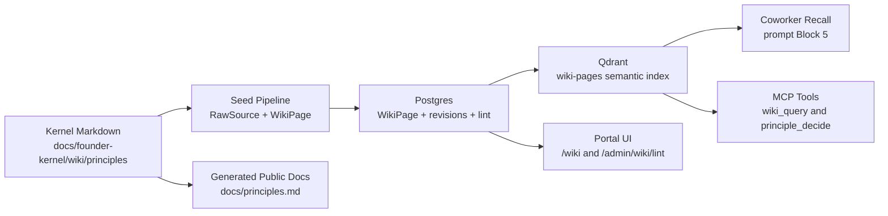

# Principles as a Wiki Kind - Design

| Field | Value |
|-------|-------|
| **Date** | 2026-05-12 |
| **Status** | Draft (chief-architect review applied) |
| **Author** | Claude (design partner) for Mark Bodman |
| **Purpose** | Make DPF's durable operating principles a first-class, citable wiki kind, retrievable by in-platform coworkers and external coding agents, with inspectable advisory decision support. |

## 0. Chief Architect Review Summary

The direction is right: DPF needs a durable principle layer that is richer than `AGENTS.md`, more governed than local memory, and more retrievable than scattered specs. The original draft also overreached in three places. This pass corrects those before implementation:

1. **Current truth and future contract are now separated.** In this branch, `KnowledgeArticle` is still live beside `WikiPage`; `WikiPageKind` does not include `principle`; `wiki_query` only filters by `pageKind`; passive recall performs one vector search; and the public docs site is Jekyll/static, not a runtime DB consumer.
2. **Decision math is advisory, not authority.** Principles do not "resolve mathematically" in the sense of replacing architecture judgment. The tool produces a scored recommendation with a contribution ledger, missing-data warnings, tie handling, and human override path.
3. **Structured scoring no longer parses prose.** The previous design inferred dimension polarity from `principleDirection` text. That is brittle. This version adds an explicit signed `principleDimensionVector` and treats prose direction as the human-readable statement.
4. **Public principles are generated from the kernel source, not live DB rows.** The public site under `docs/` is built statically. The single source of truth is the founder-kernel markdown; runtime `WikiPage` rows are seeded projections.
5. **The UI surface is part of the architecture.** Principles need a compact governance browser, detail pages, public rendering, admin lint, and decision breakdown views. Otherwise they become hidden metadata that agents may or may not use.

## 1. Inputs and Current Repo Truth

This design extends:

- [EP-WIKI-001 - Platform Kernel Wiki + Per-Org Overlay](2026-05-09-platform-kernel-wiki-design.md)
- [Wiki bi-temporal revisions](2026-05-09-wiki-bi-temporal-revisions-design.md), [importance/reflection](2026-05-09-wiki-importance-and-reflection-design.md), [PPR retrieval](2026-05-09-wiki-ppr-retrieval-design.md), and [visual navigation](2026-05-09-wiki-visual-navigation-design.md)
- [`docs/founder-kernel/SCHEMA.md`](../../founder-kernel/SCHEMA.md) and [`docs/founder-kernel/AUTHORING.md`](../../founder-kernel/AUTHORING.md)
- [`docs/architecture/ai-coworker-development-principles.md`](../../architecture/ai-coworker-development-principles.md)
- [`AGENTS.md`](../../../AGENTS.md)
- Live MCP planning context checked on 2026-05-12

### 1.1 Verified Current State

| Area | Current repo truth | Why it matters |
|------|--------------------|----------------|
| Knowledge model migration | `KnowledgeArticle` remains live (`packages/db/prisma/schema.prisma:6402`) and EP-WIKI Phase 1a explicitly says `KnowledgeArticle` stays beside new wiki models until a later PR (`schema.prisma:6469`). | This spec must not assume `KnowledgeArticle` has already been absorbed into `WikiPage`. Principle work is additive unless the wiki migration lands first. |
| Wiki model | `WikiPage` exists with `pageKind` as a string convention: `entity | summary | decision | runbook | index | stance | heuristic` (`schema.prisma:6500`, `schema.prisma:6505`). | Adding `principle` requires schema docs, TS union, UI labels, seed parsing, query filters, and lint updates. |
| Wiki type union | `packages/db/src/wiki-store.ts:43` defines `WikiPageKind`; it does not include `principle`. | The type union is the practical enum for authoring and seeding, even though the DB column is a string. |
| Qdrant wiki search | `searchWikiPages` supports `query`, `organizationId`, optional `pageKind`, `limit`, and `scoreThreshold` (`apps/web/lib/wiki/embeddings.ts:56`). It filters published rows and does overlay-aware two-pass retrieval (`embeddings.ts:139`). | Tier and applies-to filtering are new work. Commandments cannot be "always included" by the current helper without a DB prepass or a dedicated principle recall helper. |
| Passive recall | `recallWikiContext` performs a single `searchWikiPages` call and formats the result (`apps/web/lib/wiki/recall.ts:70`). | Principle recall needs a new tier-aware assembler, not only a different query string. |
| In-portal MCP tool | `wiki_query` exists in `PLATFORM_TOOLS` with only `query`, `pageKind`, and `limit` filters (`apps/web/lib/mcp-tools.ts:1971`). Its handler forwards only those fields (`mcp-tools.ts:8431`). | `tier`, `appliesTo`, `principleOnly`, and principle-specific output are new work. |
| Tool execution modes | `ToolDefinition.executionMode` is only `"proposal" | "immediate"` (`apps/web/lib/mcp-tools.ts:83`). | `principle_decide` must use `executionMode: "immediate"`, `sideEffect: false`, and advisory semantics in the description. `"advisory"` is not a valid execution mode. |
| External MCP | `/api/mcp/v1` exposes platform tools through JSON-RPC, gates them by token scope, and default-denies tools without grant mappings (`apps/web/app/api/mcp/v1/route.ts:167`). `wiki_query` maps to `registry_read` (`apps/web/lib/tak/agent-grants.ts:67`). | External agents only see principle tools when the tools are in `PLATFORM_TOOLS`, grant-mapped, and the token has the right scope. The spec cannot assume every external session already has them. |
| Founder kernel schema | `SCHEMA.md` defines seven current page kinds and no `principle` (`docs/founder-kernel/SCHEMA.md:13`). `AUTHORING.md` says the seed walker only scans `raw-sources/` and `wiki/` (`AUTHORING.md:41`). | Principle pages need new schema, templates, folder convention, authoring rules, and seed support. |
| Founder kernel content | `docs/founder-kernel/manifest.json` currently has `pageCount: 0`, `sourceCount: 0`; `wiki/index.md` says the index is the first kernel page. | The first content-promotion batch is real seeding, not migration of an existing populated kernel. |
| Public docs site | `docs/_config.yml` is a Jekyll/GitHub Pages config, excludes `superpowers`, and applies default layout to Markdown pages. | `/principles` on the public site should be a generated `docs/principles.md` artifact, not a Next.js route querying runtime Postgres. |
| AI principles document | In this branch, `ai-coworker-development-principles.md` contains Principles 1-8 and an Application section. PR #489 exists in other branch history, but its capacity-continuity spec and Principle 9 are not present in this branch's HEAD. | Batch 3 must either promote the eight branch-local principles first or explicitly rebase onto PR #489 before claiming nine principles. |
| Live planning state | MCP `search_specs_and_plans` returned no live matches for this exact principles/wiki spec. Open epic `EP-TAK-3F9A21` covers TAK/GAID refresh with open memory/MCP/observability items (`BI-MEM-5A41C7`, `BI-MCP-7E53D1`, `BI-OBS-4B63F2`). | This work should align with TAK/GAID governed memory and MCP surfaces rather than create an orphan feature epic. |

## 2. Research and Benchmarking

DPF's design should borrow proven knowledge-base patterns without copying their operating model wholesale.

| Product / project | Data-model pattern | Adopt | Reject |
|-------------------|-------------------|-------|--------|
| [MediaWiki](https://www.mediawiki.org/wiki/Manual:Database_layout) | Durable page and revision tables, with content separated from page metadata in modern schemas. | Keep page/revision separation and immutable revision history. | Do not adopt free-form wiki categories as governance taxonomy; DPF needs typed principle fields and lint. |
| [Docusaurus](https://docusaurus.io/docs/sidebar) | Markdown files produce static docs navigation from filesystem structure. | Generate public principles from repo kernel markdown so public docs are reviewable and static. | Do not make public docs the runtime source of truth; runtime must be seeded from the kernel. |
| [Logseq](https://github.com/logseq/docs) / file-based graph tools | Local Markdown graph with pages, blocks, links, and graph navigation. | Preserve portable Markdown and wikilinks for founder-kernel content. | Do not use block-level principles as the canonical runtime model; principle governance needs stable page-level source citations and review. |
| [Notion blocks](https://developers.notion.com/reference/block) | Content is composed from typed blocks and child block trees. | Use structured metadata around prose rather than relying only on document text. | Do not move DPF kernel content into opaque block trees; Git review and plain Markdown matter more. |
| [Confluence Cloud](https://developer.atlassian.com/cloud/confluence/rest/) | Spaces, content, labels, versions, and APIs for page history. | Keep labels/tags as secondary discovery aids and versions as auditable history. | Do not make "space" the governance boundary; DPF already has kernel/org overlay as the boundary. |
| [Guru verification](https://help.getguru.com/docs/verifying-and-unverifying-cards) | Cards carry trust/verification status, owners, and verification intervals. | Adopt explicit verification/freshness indicators for public and agent-facing principles. | Do not let automatic verification publish or unpublish kernel principles without human review. |
| [Obsidian](https://obsidian.md/help/data-storage) | Notes are Markdown files in local vaults, with local-first portability. | Keep founder principles portable and versioned in the repo. | Do not treat a personal vault/memory corpus as deployable product content without review, privacy filtering, and source rewrite. |

**Benchmarked conclusion:** DPF should use a hybrid model: markdown-first kernel content like Docusaurus/Obsidian, page/revision/source records like MediaWiki/Confluence, verification/freshness signals like Guru, and typed metadata beyond what general-purpose note tools provide.

## 3. Problem Statement

DPF's governance is directionally correct but scattered across surfaces with different authority levels:

| Surface | Content | Current issue |
|---------|---------|---------------|
| `AGENTS.md` | Canonical coding-agent rulebook plus operational commands | Mixes durable principles with worktree, command, and verification mechanics. It must stay readable to agents, so it cannot simply be replaced by a wiki. |
| `docs/architecture/ai-coworker-development-principles.md` | Eight branch-local AI coworker principles | No tiering, no applies-to scope, no public rendering, no runtime retrieval as principles. |
| Founder kernel wiki | Schema, seed, retrieval, viewer, lint plumbing | Current page kinds support stance/heuristic judgment but not tiered governance principles with machine-readable decision dimensions. |
| Local memory | Strong accumulated preferences and project lessons | Local, not deployable, not reviewable by PR, and not safe to bulk publish. |
| Specs and plans | Repeated principle-shaped claims | Buried in dated artifacts and only rediscovered by manual reading. |

The platform consequence is not only duplication. It is inconsistent judgment under pressure. Agents can see "architecture over shortcuts" in one surface, "use it or lose it" in another, and current route/tool instructions somewhere else. Without a governed retrieval and conflict-inspection surface, they either overfit the latest prompt or invent precedence.

## 4. Strategic Position

Principles should become a **governed judgment layer**, not another documentation category.

The canonical flow is:



Key architectural decisions:

- **`principle` is a page kind, not a separate `Principle` model.** It inherits kernel/org overlay, source citations, revisions, links, lint, and semantic retrieval.
- **Principle metadata lives on `WikiPage`.** The small set of principle-only fields is justified because filtering, linting, and display all need them. No parallel governance table.
- **The source of truth is kernel markdown.** Runtime DB and Qdrant are projections. Public docs are generated from the same kernel source.
- **The decision tool is an explainer.** It helps an agent understand which principles pull which way. It does not grant authority, bypass TAK/HITL, or replace human approval.
- **AGENTS.md remains operationally authoritative for coding agents.** Durable principle prose can point to the wiki, but command, verification, branch, and local QA rules stay inline enough to be usable before an agent has queried anything.

## 5. Goals

1. Add `principle` as a first-class `WikiPage.pageKind` with authoring schema, seed support, viewer support, MCP filters, and lint.
2. Establish a tiered principle taxonomy: `commandment`, `core`, and `contextual`.
3. Make principles retrievable in three ways: passive coworker recall, in-portal `wiki_query`, and external MCP `wiki_query` for agents with `registry_read`.
4. Provide `principle_decide` as an immediate, read-only, advisory MCP tool that returns scored options plus a per-principle contribution ledger.
5. Render public-safe principles on the public docs site from generated static Markdown.
6. Promote durable governance from the existing principles doc, selected `AGENTS.md` sections, and reviewed memory candidates without importing private operational memory wholesale.
7. Keep UX excellent: principles must be readable, inspectable, filterable, theme-aware, and useful to humans as well as agents.

## 6. Non-Goals

- Replacing `AGENTS.md`. Coding agents still need local operational rules before any wiki lookup.
- Retiring `KnowledgeArticle`. This spec depends on EP-WIKI but does not complete the `KnowledgeArticle` to `WikiPage` migration.
- Publishing Mark's local memory corpus directly. Memory candidates require review, redaction, source rewriting, and public/internal classification.
- Letting math make production decisions. TAK, permissions, proposal mode, HITL gates, and tool grants remain authoritative.
- Building a new vector store, graph DB projection, or separate governance engine.
- Solving full principle ontology governance forever. V1 ships a narrow dimension registry and learns from real use.

## 7. Principle Page Contract

### 7.1 Page Kind

Add `principle` to:

- `packages/db/src/wiki-store.ts` `WikiPageKind`
- `docs/founder-kernel/SCHEMA.md`
- `docs/founder-kernel/AUTHORING.md`
- `docs/founder-kernel/_templates/principle.template.md`
- `docs/founder-kernel/wiki/principles/`
- `apps/web/components/wiki/WikiPageKindBadge.tsx`
- `apps/web/components/wiki/WikiPageList.tsx` ordering
- `apps/web/lib/wiki/embeddings.ts` payload conventions
- `apps/web/lib/mcp-tools.ts` `wiki_query` input enum
- tests for seeding, query, lint, badge/list rendering, and MCP tool schemas

### 7.2 Required Sections

A principle page body must use this structure:

```markdown
## Rule

One declarative sentence.

## Why

The strategic rationale.

## Applies To

Population and context boundaries.

## How To Apply

Concrete operating guidance.

## Decision Dimensions

Human-readable explanation of the signed dimension vector.

## Examples

At least one positive example and one non-example.

## Sources

Rendered from WikiPageSource; not manually duplicated in body.
```

### 7.3 Relationship to Existing Kinds

| Kind | Question answered | Example |
|------|-------------------|---------|
| `stance` | "What is Mark's position on X?" | "Founder view on customer-owned integrations." |
| `heuristic` | "When X happens, what rule of thumb helps?" | "Split a feature when it crosses two bounded contexts." |
| `principle` | "What governs decisions across all matching contexts?" | "Architecture over shortcuts." |

Principles may link to stances and heuristics, but they are more durable and carry machine-readable scope, tier, weight, and decision dimensions.

## 8. Tier Taxonomy

| Tier | Default weight | Cap | Lint gate | Intended use |
|------|----------------|-----|-----------|--------------|
| `commandment` | `1.0` | 10 published kernel principles | Error if cap exceeded; direction and vector required | Non-negotiable operating doctrine that should shape every relevant decision. |
| `core` | `0.4` | 30 published kernel principles | Warn if direction missing; vector recommended | Strong defaults that guide most platform decisions. |
| `contextual` | `0.1` | No hard cap | Applies-to scope required | Narrow operational rules that matter only in a bounded situation. |

Tier inflation is the primary governance failure mode. A commandment requires:

- `principleWeightRationale`
- at least one source
- explicit `principleDimensionVector`
- commandment-cap lint pass
- human review in the PR

`situational` is intentionally not a wiki tier. Situational notes stay in memory, backlog comments, execution evidence, or dated specs.

## 9. Schema Extension

Add principle-only fields to `WikiPage`. These are nullable or defaulted so existing page kinds are unaffected.

```prisma
model WikiPage {
  // existing fields...

  principleTier             String?   // commandment | core | contextual
  principleDirection        String?   @db.Text
  principleWeight           Float?
  principleWeightRationale  String?   @db.Text
  principleDimensionVector  Json?     // Record<dimension, signed weight -1..1>
  principleDimensions       String[]  @default([]) // derived keys for query/filter/display
  principleAppliesTo        String[]  @default([]) // in_platform_coworker | external_coding_agent | human
  principlePublic           Boolean   @default(false)
  principlePublicRationale  String?   @db.Text

  @@index([principleTier])
  @@index([principlePublic])
}
```

Notes:

- `principleDimensions` and `principleAppliesTo` default to empty arrays so the migration applies cleanly to existing rows.
- `principleDimensionVector` is JSON because Prisma cannot express a typed sparse vector map in the schema. Its keys must be validated against the registry.
- Do not add a normal Prisma index on array containment in V1. If applies-to filtering becomes hot, add a hand-written Postgres GIN index in a later migration.
- `principlePublic=false` by default. Public exposure is a deliberate promotion decision, not a tier default.
- Canonical string values live in a small typed module, for example `packages/db/src/wiki-principles.ts`, and are imported by seed, lint, MCP schemas, and UI.

## 10. Dimension Registry

V1 ships a small registry, not open-ended free text.

```typescript
export const PRINCIPLE_DIMENSIONS = [
  "long_term_maintainability",
  "blast_radius",
  "reusability",
  "evidence_density",
  "human_cognitive_load",
  "capacity_utilization",
  "governance_compliance",
  "public_safety",
  "speed_to_value",
  "schema_grounding",
] as const;
```

Each principle stores a signed vector over those dimensions:

```json
{
  "long_term_maintainability": 1.0,
  "schema_grounding": 0.8,
  "speed_to_value": -0.4
}
```

The prose `principleDirection` explains the vector to humans; the vector drives structured scoring. Never parse prose to infer polarity.

Starter examples:

| Principle | Direction | Dimension vector |
|-----------|-----------|------------------|
| Architecture over shortcuts | Prefer long-term maintainability over short-term speed. | `{ "long_term_maintainability": 1, "schema_grounding": 0.8, "speed_to_value": -0.4 }` |
| Evidence before diagnosis | Prefer queried state and evidence density over inferred causes. | `{ "evidence_density": 1, "blast_radius": 0.3 }` |
| Use idle capacity for governed work | Prefer converting idle capacity into approved backlog progress. | `{ "capacity_utilization": 1, "governance_compliance": 0.7, "human_cognitive_load": -0.2 }` |
| DPF is a conduit, not a broker | Prefer customer-owned integrations over platform-brokered obligations. | `{ "public_safety": 0.8, "governance_compliance": 1, "blast_radius": 0.6 }` |

## 11. Decision Support

### 11.1 Tool Contract

Add `principle_decide` to `PLATFORM_TOOLS`:

```typescript
input: {
  context: string;
  options: Array<{
    id: string;
    description: string;
    features?: Record<string, number>; // dimension scores normalized 0..1
  }>;
  callingPopulation: "in_platform_coworker" | "external_coding_agent" | "human";
  maxPrinciples?: number; // default 20
  tieMargin?: number;     // default 0.2
}
```

Tool metadata:

- `executionMode: "immediate"`
- `sideEffect: false`
- annotations: `readOnlyHint: true`, `destructiveHint: false`, `idempotentHint: true`
- grant: `registry_read`
- response semantics: advisory only

### 11.2 Retrieval Procedure

1. **Load commandments by DB query.** Select published `pageKind="principle"` rows where `principleTier="commandment"` and `principleAppliesTo` includes the calling population.
2. **Load relevant core/contextual principles by Qdrant.** Extend `searchWikiPages` or add `searchPrinciples` with `pageKind`, `tier`, `appliesTo`, and threshold filtering.
3. **Merge and dedupe.** Commandments always remain included; core/contextual results are relevance-ranked up to `maxPrinciples`.
4. **Compute structured alignment when possible.** If an option supplies features for dimensions in the principle vector:

```text
alignment = dot(optionFeatures, principleDimensionVector) / sum(abs(principleDimensionVector values))
```

5. **Fallback to semantic alignment only when structured data is missing.** Embed option description against `principleDirection`; mark the contribution as semantic so the caller can see lower confidence.
6. **Composite score.**

```text
optionScore = sum(principleWeight * alignment)
```

7. **Return a contribution ledger.** Include every principle, tier, weight, relevance score, alignment by option, contribution by option, whether scoring was structured or semantic, and any missing dimensions.

### 11.3 Guardrails

- If `margin < tieMargin`, return `confidence="low"` and require human review in the reasoning.
- If a commandment has a strong negative contribution against the top option, flag `commandmentConflict=true`.
- If more than 40 percent of contributions are semantic fallback, flag `structuredCoverage="weak"`.
- If no principles apply, return no recommendation and `confidence="low"`.
- Do not auto-execute follow-up tools from this result. Callers must use their normal approval and TAK gates.

### 11.4 Example

Decision context: "Bug in middleware. Option A: three-line patch. Option B: refactor module boundary."

```text
Option A features:
  long_term_maintainability=0.1
  schema_grounding=0.3
  speed_to_value=0.9
  evidence_density=0.5

Option B features:
  long_term_maintainability=0.9
  schema_grounding=0.8
  speed_to_value=0.3
  evidence_density=0.8

Architecture over shortcuts vector:
  long_term_maintainability=1.0
  schema_grounding=0.8
  speed_to_value=-0.4

Alignment A = ((0.1*1.0) + (0.3*0.8) + (0.9*-0.4)) / 2.2 = -0.009
Alignment B = ((0.9*1.0) + (0.8*0.8) + (0.3*-0.4)) / 2.2 = 0.645
```

The output should explain that Option B wins because the strongest commandments and evidence-density guidance favor it; capacity/speed may favor Option A, but not enough to override the higher-tier principles.

## 12. Retrieval Integration

### 12.1 Passive Recall

Add a principle-aware recall helper rather than overloading the current single-search `recallWikiContext`:

```typescript
recallPrincipleContext({
  query,
  organizationId,
  callingPopulation,
  limit,
})
```

It should:

- inject all in-scope commandments, capped at 10
- add top relevant core principles, default 5
- add contextual principles only above a higher threshold, default 0.75
- format principles separately from ordinary wiki context so system prompts can distinguish governance from background knowledge
- silently degrade like existing wiki recall if Qdrant is down, but still include commandments from Postgres when DB is available

### 12.2 `wiki_query`

Extend both in-portal and external MCP tool schema:

```typescript
{
  query: string;
  pageKind?: "entity" | "summary" | "decision" | "runbook" | "index" | "stance" | "heuristic" | "principle";
  tier?: "commandment" | "core" | "contextual";
  appliesTo?: "in_platform_coworker" | "external_coding_agent" | "human";
  publicOnly?: boolean;
  limit?: number;
}
```

When `pageKind="principle"`, the response should include principle metadata, not only slug/kind/title. For external MCP, verify the tool appears in `/api/mcp/v1` `tools/list` for tokens with `registry_read`.

### 12.3 AGENTS.md Discovery

Update `AGENTS.md` only after the external MCP/tooling slice lands:

- Keep local operational rules inline.
- Add a short pointer near the top: "For durable DPF governance principles, query `wiki_query` with `pageKind='principle'` when the MCP connector is available."
- Do not make compliance with core rules depend on a live wiki lookup.

## 13. Public and Portal UX

### 13.1 Portal Principle Browser

The existing `/wiki` list is a good base, but principle pages need richer scan behavior:

- Add a `Principles` tab or `/wiki?kind=principle` filter that groups by tier: Commandments, Core, Contextual.
- Show compact rows, not large cards: tier badge, title, direction, applies-to chips, public/internal state, source count, last reviewed date.
- Use DPF tokens only: `text-[var(--dpf-text)]`, `text-[var(--dpf-muted)]`, `bg-[var(--dpf-surface-1)]`, `bg-[var(--dpf-surface-2)]`, `border-[var(--dpf-border)]`, `text-[var(--dpf-accent)]`.
- Add a dimension mini-strip using labels and accessible text. Do not rely on color alone.
- Keep row heights stable; badges and long principle names must wrap without resizing adjacent controls.

### 13.2 Principle Detail Page

Extend `WikiPageViewer` for `pageKind="principle"`:

- Header: title, tier, applies-to chips, public/internal badge, weight, source count.
- Direction panel: human-readable `principleDirection`.
- Application panel: "When this applies" and "When this does not apply."
- Decision dimensions: signed vector shown as a readable table.
- Related stances and heuristics via existing wiki links.
- Sources at bottom using `WikiSourceCitations`.

### 13.3 Decision Breakdown View

For `principle_decide` results surfaced in Build Studio, coworker chat, or admin tooling:

- Present the recommendation first, then a compact contribution table.
- Use a horizontal contribution bar per option, with positive and negative segments and text labels.
- Make commandment conflicts visually obvious using tokenized alert styling, not hardcoded red.
- Include "semantic fallback" warnings when option features are missing.
- Offer no one-click "execute recommended action" from the breakdown. The user or agent must continue through the normal workflow.

### 13.4 Public Site

The public docs site is static Jekyll under `docs/`. Therefore:

- Generate `docs/principles.md` from `docs/founder-kernel/wiki/principles/*.md`.
- Include only kernel principles with `principlePublic=true`.
- Keep source links to public-safe `RawSource` locators.
- Add a link from `docs/index.html` and `docs/README.md`.
- The generated page should be sober and product-facing: tiered sections, concise descriptions, no internal memory or local-agent details.

## 14. Lint Extensions

Use existing `WikiLintFinding.findingKind` and severity values (`info`, `warn`, `error`).

| Finding kind | Severity | Blocks publish | Detection |
|--------------|----------|----------------|-----------|
| `principle-missing-tier` | error | yes | `pageKind="principle"` and `principleTier IS NULL` |
| `principle-missing-direction` | error | yes | Commandment/core principle without `principleDirection` |
| `principle-missing-vector` | error for commandment, warn for core | commandment only | Missing or empty `principleDimensionVector` |
| `principle-unknown-dimension` | error | yes | Vector or dimensions include a key outside registry |
| `principle-vector-dimension-mismatch` | warn | no | `principleDimensions` does not match vector keys |
| `principle-missing-applies-to` | error | yes | Empty `principleAppliesTo` |
| `principle-tier-weight-mismatch` | warn | no | Weight differs from tier default without rationale |
| `principle-commandment-cap-exceeded` | error | yes | More than 10 published kernel commandments |
| `principle-public-missing-rationale` | warn | no | `principlePublic=true` without `principlePublicRationale` |
| `principle-public-unsafe-marker` | error | yes | Public principle body references local memory paths, private tokens, local user paths, unreleased PR claims, or internal-only agent instructions |
| `principle-duplicate` | warn | no | Near-duplicate of another principle by embedding similarity and title/body overlap |
| `principle-contradiction-review` | warn | no | Opposing vectors on the same dimensions with high semantic similarity |

The contradiction lint does not auto-resolve. Contradictions can be legitimate; the job is to force an explicit review note.

## 15. Migration and Delivery Plan

Each batch should be a separate PR. Branch from current `main` and rebase this spec branch before implementation because the capacity-continuity PR exists outside this branch's HEAD.

### Batch 0 - Schema, Constants, and Authoring Contract

- Add principle fields to `WikiPage`.
- Add `principle` to `WikiPageKind`.
- Add canonical constants for tiers, applies-to values, dimensions, and defaults.
- Update `SCHEMA.md`, `AUTHORING.md`, templates, seed frontmatter parsing, and manifest schema version.
- Update `WikiPageKindBadge`, `WikiPageList`, `WikiPageViewer` to render principle metadata.
- Tests: `packages/db/src/wiki-store.test.ts`, `packages/db/src/seed-wiki-kernel.test.ts`, wiki component tests where present.

### Batch 1 - Principle Lint and Public Safety

- Add principle lint detectors and tests.
- Add public-safety detection for local/private/internal markers.
- Extend `/admin/wiki/lint` filters so principle findings are easy to isolate.
- Add fixture pages for valid/invalid principle cases.

### Batch 2 - Retrieval and MCP Tools

- Add `recallPrincipleContext`.
- Extend `searchWikiPages` or add `searchPrinciples`.
- Extend `wiki_query` filters and results.
- Add `principle_decide`.
- Ensure `/api/mcp/v1` tools/list exposes the new/extended tools for `registry_read` tokens.
- Tests: `apps/web/lib/wiki/recall.test.ts`, `apps/web/lib/wiki/embeddings.test.ts`, `apps/web/lib/mcp-tools-wiki-query.test.ts`, new `mcp-tools-principle-decide.test.ts`, and `/api/mcp/v1` route tests if the tool visibility contract changes.

### Batch 3 - Seed the First Principle Set

Scope depends on branch base:

- If PR #489/capacity continuity is present after rebase: promote Principles 1-9 plus the approved capacity principle.
- If not: promote the eight branch-local AI coworker principles first and leave capacity/proactivity as follow-up content.

For each principle:

- author a kernel markdown page under `docs/founder-kernel/wiki/principles/`
- create or cite public-safe raw sources
- assign tier, direction, vector, applies-to, public flag, and public rationale
- run seed and lint

Do not bulk move `AGENTS.md` in this batch.

### Batch 4 - AGENTS.md Governance Pointers

- Identify durable principle prose in `AGENTS.md`.
- Promote only durable governance, not local operational mechanics.
- Replace duplicated prose with short pointers where safe.
- Keep command, branch, verification, worktree, MCP-token, and local QA instructions inline.
- Add the `wiki_query pageKind='principle'` pointer after MCP tooling is verified.

### Batch 5 - Reviewed Memory Promotion

- Inventory candidate memory-derived principles.
- Classify as commandment/core/contextual/situational.
- Promote only reviewed, durable, product-safe principles.
- Rewrite private memory as authored principles with sources and rationale; do not cite local memory paths in public content.
- Leave episodic, runtime, branch, and stale-state notes in memory.

### Batch 6 - Public Docs Generation

- Add a script to generate `docs/principles.md` from public kernel principle pages.
- Add public docs navigation links.
- Add a doc-generation test or snapshot check to catch drift.

## 16. Verification Plan

Run affected tests per batch. Use pinned workspace commands:

```powershell
pnpm --filter @dpf/db exec vitest run src/wiki-store.test.ts src/seed-wiki-kernel.test.ts
pnpm --filter web exec vitest run lib/wiki/embeddings.test.ts lib/wiki/recall.test.ts lib/wiki/lint-detectors.test.ts
pnpm --filter web exec vitest run lib/mcp-tools-wiki-query.test.ts
pnpm --filter web typecheck
pnpm --filter web build
```

For UI changes:

- Verify `/wiki`, `/wiki?kind=principle`, a principle detail page, and `/admin/wiki/lint` against the rebuilt Docker-served portal.
- Verify theme tokens in light and dark mode.
- Verify long principle names, long dimension labels, and empty-state copy do not overflow.
- Verify public `docs/principles.md` renders under the Jekyll layout.

For MCP:

- Use `/api/mcp/v1` `tools/list` with a `registry_read` token and confirm `wiki_query` filters and `principle_decide` are visible.
- Call `wiki_query` for `pageKind="principle"` and verify metadata in structured content.
- Call `principle_decide` on at least three real DPF decisions and inspect contribution ledgers.

## 17. Risks and Mitigations

| Risk | Severity | Mitigation |
|------|----------|------------|
| Principle inflation | High | Hard cap on commandments; lint gate; PR review for tier changes. |
| Math is trusted as authority | High | Tool is read-only/immediate/advisory; output includes warnings; no execute button; TAK/HITL remains authoritative. |
| Prose/vector drift | Medium | Lint checks that dimension keys and prose direction are present; reviewer must approve vector changes. |
| Public docs drift from runtime | Medium | Generate public docs from kernel markdown, then seed runtime from the same source. |
| Local memory leaks into product docs | High | No raw memory import; review/redact/rewrite; public-safety lint blocks local paths and private markers. |
| External agents cannot see principles | High | Extend external MCP `tools/list`; add `AGENTS.md` pointer only after verified; keep core operational rules inline. |
| Current branch lacks PR #489 content | Medium | Rebase before implementation or scope Batch 3 to eight branch-local principles. |
| `KnowledgeArticle` migration collision | Medium | Principle work is additive; do not alter `KnowledgeArticle` unless EP-WIKI migration PR owns it. |
| Query performance for applies-to arrays | Low in V1 | Start without GIN index; add hand-written index if metrics show need. |
| UI becomes decorative instead of operational | Medium | Compact rows, contribution ledger, filters, source count, and last-reviewed signals are required acceptance criteria. |

## 18. Open Questions with Recommendations

1. **Should `principle` be separate from `stance` and `heuristic`?**  
   Recommendation: yes, because tier, applies-to scope, public state, and decision vectors make principles operationally different.

2. **Who owns the dimension registry?**  
   Recommendation: kernel maintainers via PR. No runtime ad-hoc dimension creation in V1.

3. **Should public principles include founder-specific language?**  
   Recommendation: public pages should speak as DPF doctrine. Internal pages can reference Mark/local-agent details; public pages should not.

4. **Should org overlays have their own principles?**  
   Recommendation: yes inside the portal, using the existing overlay mechanism. Public docs remain kernel-only.

5. **Should commandment recall bypass Qdrant?**  
   Recommendation: yes. Use Postgres for in-scope commandments, then Qdrant for relevance-ranked core/contextual principles.

6. **Should `principle_decide` record evidence?**  
   Recommendation: not in V1. Tool execution logging already captures calls. Add explicit evidence recording only when a downstream workflow consumes decisions as artifacts.

## 19. Success Criteria

- `principle` is accepted by seed, DB, UI, Qdrant payloads, lint, `wiki_query`, and passive recall.
- Commandment principles are always injected for matching populations.
- `wiki_query` can filter by `pageKind="principle"`, `tier`, and `appliesTo`.
- `principle_decide` returns structured contribution ledgers, tie warnings, commandment-conflict flags, and semantic-fallback warnings.
- `/wiki?kind=principle` and principle detail pages are polished, dense, token-themed, and accessible.
- `docs/principles.md` is generated from public kernel principles and linked from the public docs.
- No durable principle-shaped rule remains duplicated across the AI principles doc, promoted `AGENTS.md` sections, and founder-kernel principles without an intentional pointer.
- `AGENTS.md` remains usable when MCP/wiki is unavailable.
- No implementation PR claims PR #489/capacity principles are local until the branch is rebased or the content is present.

## Appendix A - Initial Promotion Inventory

| Source | Branch-local count | Promotion stance |
|--------|--------------------|------------------|
| `docs/architecture/ai-coworker-development-principles.md` | 8 principles | Batch 3 seed source in this branch. Rebase may raise this to 9. |
| `AGENTS.md` durable governance | About 10-16 candidates | Batch 4, selective. Operational mechanics stay inline. |
| Founder-kernel current content | 0 principle pages | New content required. |
| Local memory | Unknown until reviewed | Batch 5, reviewed and rewritten only. |
| Existing wiki specs | Several stance/heuristic-shaped claims | Link as sources or create stances/heuristics first; promote only if durable. |

## Appendix B - MCDM Positioning

The `principle_decide` tool uses a simple weighted-sum multi-criteria decision model. This is intentionally less elaborate than AHP, TOPSIS, PROMETHEE, or ELECTRE:

- We need inspectability more than theoretical optimality.
- Reviewers should understand every contribution without reading a decision-science paper.
- The tool advises agents; it does not award contracts, rank vendors, or make final policy decisions.
- More advanced methods can be added later if real decisions show linear scoring is too weak.

V1 succeeds when the tool makes principle tension visible. It does not need to make the tension disappear.
