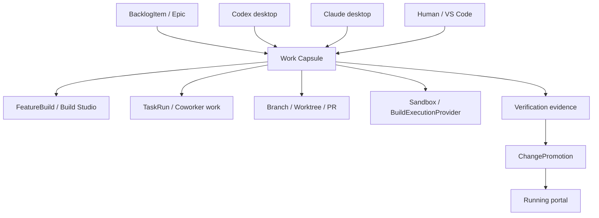

# Portal Work Capsule Control Harness Design

| Field | Value |
|---|---|
| Date | 2026-05-14 |
| Status | Draft for review |
| Author | Codex + Mark Bodman |
| Scope | Portal-coordinated work capsules for Build Studio, external Claude/Codex desktop sessions, manual worktrees, sandbox promotion, and portal self-update governance |
| Depends On | `2026-04-05-db-github-delivery-sync-design.md`, `2026-04-20-ship-phase-fork-redesign-design.md`, `2026-04-21-backlog-triage-build-studio-design.md`, `2026-04-23-build-studio-governed-backlog-delivery-design.md`, `2026-05-09-build-execution-provider-design.md`, `2026-05-09-deployment-contracts.md` |

## 1. Problem Statement

DPF now has several valid ways to produce work:

1. Build Studio inside the portal.
2. Codex desktop sessions operating in local worktrees.
3. Claude desktop sessions operating in local worktrees.
4. Human/manual edits in VS Code.
5. Git-triggered sandbox verification after upstream changes.

Each path is useful. The problem is that they are not coordinated by one durable control object. The result is predictable sprawl:

- dirty root clone state
- branches without a clear backlog owner
- worktrees that outlive their purpose
- multiple agents touching overlapping files without visibility
- Build Studio runs that are better governed than external desktop work
- provider and OAuth setup repeated by hand during portal rebaselines
- uncertainty about which sandbox or PR should be trusted for promotion

The portal already owns the backlog, Build Studio, sandbox execution, promotion records, and provider configuration. It should therefore become the control harness for work, but not the only executor of work.

The core design decision is:

**All work should be coordinated by the portal, but execution may still happen inside Build Studio, Codex desktop, Claude desktop, or a human worktree.**

## 2. Current State Snapshot

This design is grounded in the live DPF planning surface and current repo state on 2026-05-14.

Live MCP checks showed:

- no existing spec that directly defines "portal as work-control harness"
- open Build Studio and integration-adjacent epics remain active
- in-progress backlog items include Build Studio graph/cycle work and release-decision work

Repo review showed existing primitives that should be reused:

- `BacklogItem` is the business source of truth for work intake.
- `FeatureBuild` records Build Studio execution and sandbox state.
- `TaskRun` records governed coworker task execution.
- `GitPromotionCandidate` records git-triggered sandbox verification candidates.
- `ChangePromotion` records production-visible promotion decisions.
- `SandboxSlot` records local sandbox capacity.
- `ToolExecution` and `BacklogItemActivity` record audit/evidence trails.
- Build execution provider and agent runner seams already exist under `apps/web/lib/integrate/sandbox`.

Current local git state also exposed the operational failure mode this spec addresses:

- root clone `D:\DPF` was still on `main`, dirty, ahead of and behind `origin/main`
- multiple Codex and Claude worktrees existed at once
- some active work was visible only through branch/worktree names, not through a shared portal lifecycle

Design consequence:

DPF does not need a second Build Studio. It needs a small, durable **Work Capsule** layer above backlog, Build Studio, git, worktrees, sandboxes, and promotions.

## 3. Goals

1. Make the portal the authoritative coordinator for all platform work.
2. Preserve Build Studio as the native in-portal executor.
3. Allow Codex desktop, Claude desktop, and humans to remain useful external executors.
4. Ensure every non-trivial work unit has one durable Work Capsule.
5. Attach branches, worktrees, PRs, sandboxes, builds, verification evidence, and promotion records to that capsule.
6. Support adoption of existing messy work without losing it.
7. Prevent new collisions through visible scope claims and stale-state warnings.
8. Preserve the root clone as a release/merge-only worktree.
9. Coordinate portal self-update through sandbox verification, backups, and explicit approval.
10. Reduce manual provider/OAuth rebaseline work without exposing secrets to code agents.

## 4. Non-Goals

1. Replacing Build Studio.
2. Forcing all coding to happen inside the portal UI.
3. Building a fully autonomous deployment system in v1.
4. Letting a sandbox directly mutate or replace production.
5. Moving provider secrets, OAuth tokens, or API keys into git.
6. Replacing GitHub PR review or branch protection.
7. Solving every stale historical worktree in the first implementation slice.
8. Changing the existing `BacklogItem.status` or `FeatureBuild.phase` vocabulary in this spec.

## 5. Research and Benchmarking

### 5.1 Open Source Systems Reviewed

- [Argo Workflows DAG templates](https://argo-workflows.readthedocs.io/en/latest/walk-through/dag/) model explicit task dependencies and nested workflows. Adopt: visible dependency graph and terminal state per node. Reject: arbitrary DAG authoring as the primary v1 user model.
- [Temporal documentation](https://docs.temporal.io/) emphasizes durable execution that survives failures and resumes from persisted state. Adopt: durable workflow identity and event history. Reject: adding Temporal as a new runtime dependency.
- [GitLab deployment approvals](https://docs.gitlab.com/ci/environments/deployment_approvals/) and [deployment safety](https://docs.gitlab.com/ci/environments/deployment_safety/) separate build completion from production deployment. Adopt: protected promotion gate and single production deployment control. Reject: treating CI/CD pipeline status as sufficient business approval.

### 5.2 Commercial Systems Reviewed

- [GitHub pull request issue linking](https://docs.github.com/articles/closing-issues-via-commit-messages) makes issue, branch, PR, and merge state traceable. Adopt: work item to PR linkage. Reject: GitHub issue as the DPF business source of truth.
- [GitHub Codespaces source control docs](https://docs.github.com/en/codespaces/developing-in-codespaces/using-source-control-in-your-codespace) normalize isolated cloud workspaces that still use normal branches and PRs. Adopt: isolated workspace per work unit. Reject: moving DPF's local/offline install dependency to hosted workspaces.
- [Linear triage](https://linear.app/docs/triage) keeps incoming work in a reviewable inbox before it joins a team workflow. Adopt: capsule adoption/recovery as an intake stage. Reject: assuming every incoming item is ready for execution.
- [Cursor Background Agents](https://docs.cursor.com/en/background-agents) provide account-level visibility into background coding agents. Adopt: external agent work should be visible and resumable. Reject: agent account dashboard as the authoritative work record.

### 5.3 Patterns Adopted

1. Durable work identity separate from execution substrate.
2. Work item first, workspace second.
3. Explicit branch/worktree/PR linkage.
4. Sandbox verification before production-visible promotion.
5. Human approval for protected environments.
6. Reconciliation jobs that repair drift instead of assuming every event arrives cleanly.

### 5.4 Patterns Rejected

1. Portal-only execution.
2. External desktop clients operating as untracked work systems.
3. GitHub-only backlog truth.
4. Production deployment based only on a green build.
5. Secret copying as a convenience mechanism.

## 6. Core Concept: Work Capsule

A Work Capsule is the durable coordination record for exactly one concern.

It is not the backlog item, because not all execution details belong in the backlog. It is not the Build Studio `FeatureBuild`, because external Codex/Claude work may not start inside Build Studio. It is not a `TaskRun`, because a capsule may contain several task runs, manual commits, PRs, sandboxes, and promotions over time.

A Work Capsule answers:

- What is the objective?
- What business record owns it?
- Which executor is working it?
- Which branch/worktree/sandbox/PR contains the changes?
- What scope is claimed?
- What evidence exists?
- What is stale, blocked, or conflicting?
- Is it safe to merge, promote, archive, or rebase?

### 6.1 Capsule Status Values

If persisted as strings, these values become strongly typed enums in `apps/web/lib/work-capsules.ts` and the MCP tool definitions:

| Status | Meaning |
|---|---|
| `draft` | Captured but not ready for work |
| `ready` | Ready to start or assign |
| `working` | Actively being changed by an executor |
| `blocked` | Needs user input, provider setup, merge decision, or dependency |
| `verifying` | Changes exist and checks are running |
| `ready-for-review` | Ready for PR or human review |
| `ready-for-promotion` | Sandbox evidence supports production promotion |
| `complete` | Work merged, promoted, or intentionally finished |
| `abandoned` | Work stopped but preserved for audit/recovery |
| `archived` | Historical/no-action record |

Hyphenated values are mandatory. Any enum additions must update the library constants and MCP `enum:` arrays in the same commit.

### 6.2 Capsule Sources

| Source | Meaning |
|---|---|
| `backlog` | Created from a backlog item |
| `build-studio` | Created by Build Studio |
| `external-adoption` | Adopted from an existing branch/worktree/PR |
| `git-promotion` | Created from a git-triggered sandbox candidate |
| `manual` | Created by a human before backlog linkage is known |
| `scheduled-steward` | Created by daily hygiene automation |

### 6.3 Executor Kinds

| Executor | Meaning |
|---|---|
| `build-studio` | Native portal Build Studio execution |
| `codex-desktop` | Codex desktop session in a governed worktree |
| `claude-desktop` | Claude desktop session in a governed worktree |
| `human` | Manual local development |
| `git-webhook` | Git update event awaiting sandbox verification |
| `dpf-native` | Future portal-side agent runner |

## 7. Architecture

The portal becomes the coordinator. Executors become participants.



### 7.1 Authority Boundaries

| Surface | Authority |
|---|---|
| Platform DB | backlog, capsules, evidence, promotion decisions, provider references |
| Git | source changes, branches, commits, PR review |
| Build Studio | native sandbox execution and build-phase evidence |
| External clients | implementation execution only |
| Promotion runner | host/container swap after approval |
| Secret store | provider keys, OAuth tokens, runtime credentials |

External clients can write code, tests, docs, and PRs. They do not own lifecycle truth. They update or attach evidence to a capsule.

### 7.2 Why This Is Not Just TaskRun

`TaskRun` is the right model for a governed coworker task. Work Capsules are broader:

- one capsule can contain several task runs
- a capsule can begin as an adopted branch with no coworker task
- a capsule can hold a Build Studio build, GitHub PR, sandbox, and promotion candidate together
- a capsule remains useful after task execution ends

`TaskRun` should link to Work Capsule, not replace it.

### 7.3 Why This Is Not Just FeatureBuild

`FeatureBuild` is the right model for Build Studio execution. Work Capsules coordinate more paths:

- Codex desktop work
- Claude desktop work
- manual worktree recovery
- git-triggered promotion candidates
- docs-only branch work
- portal self-update safety

`FeatureBuild` should link to Work Capsule, not expand into a catch-all delivery model.

## 8. Data Model Stewardship

### 8.1 Existing Models Reused

| Existing model | Reuse |
|---|---|
| `BacklogItem` | business origin and lifecycle anchor |
| `Epic` | portfolio/work grouping |
| `FeatureBuild` | Build Studio execution record |
| `TaskRun` | coworker task execution |
| `GitPromotionCandidate` | git update sandbox candidate |
| `ChangePromotion` | production-visible promotion |
| `SandboxSlot` | local sandbox capacity |
| `ToolExecution` | cross-cutting tool audit |
| `BacklogItemActivity` | backlog-scoped timeline |

### 8.2 New Model: `WorkCapsule`

Recommended fields:

```prisma
model WorkCapsule {
  id                    String    @id @default(cuid())
  capsuleId             String    @unique
  title                 String
  objective             String    @db.Text
  status                String    @default("draft")
  source                String
  executorKind          String?
  executorRef           String?

  backlogItemId         String?
  epicId                String?
  featureBuildId        String?
  taskRunId             String?
  gitPromotionCandidateId String?
  changePromotionId     String?

  repositoryFullName    String?
  baseBranch            String?
  baseSha               String?
  headBranch            String?
  headSha               String?
  worktreePath          String?
  pullRequestUrl        String?
  pullRequestNumber     Int?

  sandboxProviderId     String?
  sandboxId             String?

  scopeClaims           Json      @default("[]")
  workspaceState        Json      @default("{}")
  verificationState     Json      @default("{}")
  providerRequirements  Json      @default("[]")
  promotionPolicy       Json      @default("{}")

  createdById           String?
  createdAt             DateTime  @default(now())
  updatedAt             DateTime  @updatedAt
  lastSyncedAt          DateTime?
  archivedAt            DateTime?
  activities            WorkCapsuleActivity[]

  @@index([status, updatedAt])
  @@index([backlogItemId])
  @@index([featureBuildId])
  @@index([headBranch])
  @@index([sandboxId])
}
```

The first slice may use string IDs rather than full Prisma relations for low-risk adoption. Later slices can add relations after the shape proves stable.

### 8.3 New Model: `WorkCapsuleActivity`

Recommended fields:

```prisma
model WorkCapsuleActivity {
  id                String   @id @default(cuid())
  workCapsuleId     String
  kind              String
  summary           String
  payload           Json     @default("{}")
  recordedAt        DateTime @default(now())
  recordedById      String?
  recordedByAgentId String?
  toolExecutionId   String?
  capsule           WorkCapsule @relation(fields: [workCapsuleId], references: [id], onDelete: Cascade)

  @@index([workCapsuleId, recordedAt(sort: Desc)])
  @@index([kind, recordedAt(sort: Desc)])
}
```

This mirrors `BacklogItemActivity` and keeps capsule history inspectable without overloading `ToolExecution`.

### 8.4 Refactor Budget

Reserve at least 20 percent of implementation capacity for refactoring existing Build Studio, backlog, and promotion seams touched by this work.

Allowed refactors:

- extracting enum constants to `apps/web/lib/work-capsules.ts`
- normalizing Build Studio links to reference the capsule where present
- reducing duplicated git/worktree state formatting
- centralizing "dirty/stale/behind origin" detection
- moving promotion-readiness derivation into a reusable helper

Disallowed refactors:

- redesigning Build Studio phases
- renaming existing backlog statuses
- replacing `FeatureBuild`
- replacing `TaskRun`
- broad route or shell layout rewrites

## 9. Primary Workflows

### 9.1 Adopt Existing Work

This is the most important first workflow because it rescues current sprawl.

1. User opens Work Control in the portal.
2. Portal scans known worktrees, branches, open PRs, active Build Studio builds, and git promotion candidates.
3. Portal shows untracked candidates.
4. User selects a candidate and chooses "Adopt".
5. Portal reads:
   - branch name
   - base branch
   - base SHA
   - head SHA
   - ahead/behind count
   - dirty files
   - untracked files
   - PR URL if present
   - possible backlog/spec references from branch, commit, PR body, or docs
6. User links the capsule to a backlog item, epic, spec, or plan.
7. Portal records scope claims from changed files and declared intent.
8. Portal recommends one action:
   - continue
   - rebase
   - split
   - supersede
   - archive
   - convert to Build Studio

V1 should not delete branches or worktrees. It records and recommends.

### 9.2 Create New Governed Work

1. User starts from a backlog item, spec, plan, or manual objective.
2. Portal creates a capsule.
3. Portal generates branch and worktree names.
4. Portal creates the worktree from `origin/main`.
5. Portal runs the repo MCP seed helper for the new worktree.
6. Portal assigns an executor:
   - Build Studio
   - Codex desktop
   - Claude desktop
   - human
7. Portal emits launch instructions or starts the native Build Studio flow.
8. Executor records progress and evidence back to the capsule.

Creation must refuse to use the root clone as an active worktree.

### 9.3 External Client Attachment

Codex and Claude desktop sessions attach through MCP.

Required MCP tools:

| Tool | Purpose |
|---|---|
| `list_work_capsules` | find assigned or open capsules |
| `get_work_capsule` | hydrate context before acting |
| `create_work_capsule` | create a governed work unit |
| `adopt_worktree` | attach an existing path/branch |
| `claim_capsule_scope` | declare intended files/modules |
| `record_capsule_evidence` | persist tests, builds, screenshots, notes |
| `update_work_capsule_status` | move status with validation |
| `release_capsule_scope` | clear claims when done/abandoned |

Grant categories:

- `work_capsule_read`
- `work_capsule_write`
- `work_capsule_adopt`
- `work_capsule_promote`

External clients should not receive `work_capsule_promote` by default.

### 9.4 Collision Detection

V1 uses soft leases, not hard git locks.

The portal warns when:

- two active capsules touch the same file
- two active capsules claim the same module
- a capsule is behind `origin/main` beyond a configured threshold
- the root clone is dirty
- a branch has local commits but no PR
- a worktree has untracked files older than a configured threshold
- a capsule has no linked backlog item/spec/plan

Soft leases keep work moving while making collisions visible early.

### 9.5 Daily Steward

The daily steward is a scheduled hygiene run. It prepares recommendations but does not delete or deploy in v1.

It checks:

- root clone branch, cleanliness, ahead/behind state
- all known worktrees
- untracked branches
- stale capsules
- capsules without evidence
- open PRs without matching capsules
- active Build Studio builds without matching capsules
- GitPromotionCandidates awaiting review
- provider/OAuth readiness required by active capsules
- promotion candidates without backup evidence

Outputs:

- "safe to continue"
- "needs rebase"
- "needs backlog link"
- "needs provider setup"
- "ready for PR"
- "ready for sandbox verification"
- "ready for promotion approval"
- "archive candidate"

## 10. Portal Self-Update and Replacement

The portal may coordinate its own replacement, but the sandbox must never replace production directly.

The safe path is:

1. Work Capsule reaches `ready-for-review`.
2. PR is opened and reviewed.
3. PR merges to `main`.
4. Git webhook records or updates a `GitPromotionCandidate`.
5. Build execution provider creates a fresh sandbox from the target SHA.
6. Sandbox verification runs:
   - install/build setup
   - typecheck
   - production build
   - migrations against cloned DB
   - smoke tests
   - login check
   - backlog count invariant
   - provider configuration presence check
   - promotion-readiness evidence capture
7. Portal creates or links a `ChangePromotion`.
8. Backup is captured:
   - Postgres
   - Neo4j
   - Qdrant
   - runtime config fingerprint
   - provider configuration fingerprint without secrets
9. Human approves promotion.
10. Promotion runner swaps the running portal.
11. Post-promotion health checks run.
12. Failure triggers rollback to previous image and backup.

### 10.1 Production Lock

Only one portal replacement promotion may be `in_progress` at a time.

Other capsules may continue work, but no second production-visible portal swap can start until the active promotion reaches a terminal state.

### 10.2 Emergency Recovery

If the portal is unavailable, a release worktree rescue script must be able to:

- list recent backups
- list latest promotion attempts
- restore the previous image/container
- restore database backups when explicitly confirmed

This rescue path is separate from the normal portal UI and should be documented alongside release scripts.

## 11. Provider and OAuth Policy

Provider configuration is runtime state. Capsules record requirements and evidence, not secrets.

### 11.1 What Capsules Store

Allowed:

- provider kind required by the work
- model capability class
- OAuth provider connection ID
- last verified timestamp
- redacted health status
- missing setup steps

Disallowed:

- API keys
- OAuth refresh tokens
- raw `.env` values
- CLI auth files
- copied provider config blobs

### 11.2 Rebaseline Flow

When a portal rebaseline is needed:

1. Portal captures a backup and provider configuration fingerprint.
2. Sandbox or new portal verifies required provider rows exist by ID/reference.
3. User re-authorizes missing providers through the portal UI.
4. Capsules blocked on providers move from `blocked` to `ready` only after health checks pass.

This removes manual guessing while avoiding secret leakage to coding agents.

## 12. UX Design

The Work Capsule UX should be a quiet operational cockpit, not a marketing page.

Primary surface:

- `/build/work` becomes the Work Control view for active build/development work.
- `/build/work/[capsuleId]` shows one capsule and its evidence.
- `/build` links to Work Control from the Build Studio header/chrome when active capsules exist.
- Operations > Promotions continues to own production promotion review.

Recommended navigation:

| View | Purpose |
|---|---|
| Intake | adopt existing work, create capsule, link backlog/spec |
| Active | see current capsules, executors, branches, dirty state |
| Review | PR readiness, verification evidence, scope conflicts |
| Promote | sandbox candidates and promotion prerequisites |
| Cleanup | stale worktrees, abandoned branches, archive recommendations |

### 12.1 Capsule List Row

Each row shows:

- title
- status
- linked backlog item or spec
- executor
- branch
- worktree health
- PR state
- verification state
- conflicts
- next recommended action

The row should be dense and scannable. It should not use cards inside cards.

### 12.2 Capsule Detail

Sections:

1. Objective and linked records.
2. Executor and workspace.
3. Scope claims and detected changed files.
4. Evidence.
5. PR and review state.
6. Sandbox and promotion readiness.
7. Timeline.
8. Actions.

Actions should be explicit:

- adopt
- sync state
- assign executor
- open worktree
- create PR
- run verification
- mark blocked
- archive
- prepare promotion

### 12.3 Theme and Accessibility

All UI must use DPF theme variables:

- `text-[var(--dpf-text)]`
- `text-[var(--dpf-muted)]`
- `bg-[var(--dpf-surface-1)]`
- `bg-[var(--dpf-surface-2)]`
- `border-[var(--dpf-border)]`
- `text-[var(--dpf-accent)]`

No hardcoded colors except `text-white` on accent buttons.

Use icons for compact actions where lucide icons exist. Use tooltips for unfamiliar icon-only controls.

## 13. Error Handling

| Failure | Handling |
|---|---|
| root clone dirty | block new work from root; show remediation |
| branch already exists | offer adopt or choose new branch |
| worktree path missing | mark workspace stale; keep capsule |
| worktree dirty with no capsule | offer adopt |
| capsule behind origin | recommend rebase |
| changed-file conflict | show overlapping capsule and owner |
| provider missing | mark blocked with setup link |
| sandbox verification failed | persist evidence and keep promotion disabled |
| migration failed on clone | block promotion |
| backup failed | block promotion |
| post-promotion health failed | trigger rollback path |
| MCP unavailable | allow read-only UI and show external-client attach blocked |

## 14. Security and Governance

1. `.mcp.json` and `.vscode/mcp.json` remain ignored credential files.
2. Capsules never store secrets.
3. External agents receive only grants appropriate to their role.
4. Promotion requires `work_capsule_promote` plus existing promotion authority.
5. Every MCP capsule mutation writes `ToolExecution`.
6. Every user-visible capsule event writes `WorkCapsuleActivity`.
7. Production portal replacement requires backup evidence and human approval in v1.
8. Scope claims are advisory in v1 but audit-visible.

## 15. Implementation Phases

### Phase 0: Spec and Plan

- land this design
- write implementation plan
- create backlog items/epic if needed

### Phase 1: Adoption-First Registry

- add `WorkCapsule` and `WorkCapsuleActivity`
- add enum constants and validation
- add MCP read/create/adopt/sync tools
- add scan helpers for branches/worktrees/PRs
- add read-only Work Control UI for active/adoptable work

### Phase 2: Governed Creation

- create worktree from `origin/main`
- seed MCP config
- generate branch/worktree names
- record initial scope
- block root clone active work

### Phase 3: Executor Attachment

- attach Build Studio builds to capsules
- attach Codex/Claude desktop sessions through MCP tools
- record external execution evidence
- expose collision warnings

### Phase 4: Daily Steward

- scheduled hygiene job
- recommendations for rebase/archive/link/provider setup
- operator review UI

### Phase 5: Portal Self-Update Gate

- link `GitPromotionCandidate` to capsules
- require sandbox verification evidence
- require backup evidence
- require human approval
- expose rollback/rescue instructions

### Phase 6: Automation Expansion

- allow policy-approved automatic sandbox verification
- consider policy-approved promotion for low-risk docs/runtime-only changes
- keep production portal replacement human-approved until evidence supports relaxing it

## 16. First Implementation Slice

The smallest useful slice is:

1. `WorkCapsule` and `WorkCapsuleActivity` schema.
2. `apps/web/lib/work-capsules.ts` enum constants and validators.
3. `adopt_worktree`, `list_work_capsules`, `get_work_capsule`, and `record_capsule_evidence` MCP tools.
4. Git/worktree scanner that returns:
   - branch
   - base/head SHA
   - ahead/behind count
   - dirty file count
   - untracked file count
   - possible PR URL
5. Work Control intake UI showing adoptable and active capsules.
6. Unit tests for status validation, adoption, and scanner parsing.

This slice does not create worktrees automatically and does not promote production.

## 17. Verification Plan

Implementation must verify:

1. Unit tests for capsule enum validation.
2. Unit tests for adopt-worktree parsing.
3. MCP tool tests for create/adopt/list/get/status/evidence paths.
4. UI tests for Work Control empty, active, conflict, blocked, and stale states.
5. Production build.
6. UX verification against the Docker-served portal.
7. Migration applies cleanly.

For the self-update phase, verification expands to:

1. sandbox clone/build verification
2. migration against cloned DB
3. backup creation
4. health check before and after swap
5. rollback rehearsal

## 18. Invariants

1. The root clone is never an active implementation workspace.
2. Every active Build Studio build should have or create a Work Capsule.
3. Every external desktop coding session should attach to a Work Capsule before making non-trivial changes.
4. Every capsule with production-visible intent must link to verification evidence.
5. Portal replacement cannot proceed without backup evidence.
6. Provider requirements are references and health checks, not copied secrets.
7. A capsule may be abandoned, but not silently deleted.
8. Production promotion requires an explicit terminal decision.

## 19. Resolved V1 Decisions

1. The first UI route is `/build/work`, with capsule detail at `/build/work/[capsuleId]`.
2. Branch names preserve the existing `feat/`, `fix/`, `doc/`, `chore/`, and `clean/` taxonomy. Capsule identity is stored in `WorkCapsule`, PR body metadata, and optional commit trailers rather than replacing branch taxonomy.
3. The daily steward produces recommendations only in v1. It does not delete worktrees, close PRs, or create cleanup backlog items automatically.
4. Scope claims are soft leases in v1. They warn and guide, but they do not block git operations.
5. Portal replacement remains human-approved in v1 even when sandbox verification is green.

## 20. Recommended Direction

Adopt the hybrid governed execution model:

- portal owns work coordination
- Build Studio remains native executor
- Codex and Claude desktop attach as external executors
- Work Capsules become the missing lifecycle record
- adoption of existing work comes before full automation
- portal self-update goes through sandbox, backup, approval, promotion, and rollback

This gives DPF the parallelism the user wants without letting each agent create a separate universe of truth.
