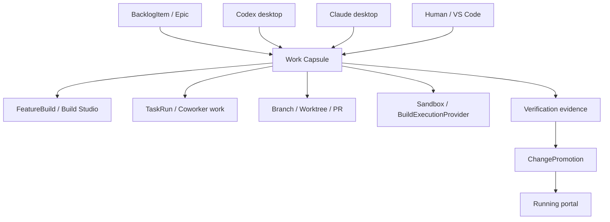

# Portal Work Capsule Control Harness Design

| Field | Value |
|---|---|
| Date | 2026-05-13 (initial); 2026-05-14 (chief-architect review applied); 2026-05-14 (second chief-architect pass after Phase 1 plan review); 2026-05-14 (branch/PR and scratch-install doctrine applied); 2026-05-16 (Phase 1 merged and verification refresh applied); 2026-05-16 (Phase 2 display-and-record scope applied); 2026-05-17 (Phase 2 merged and Phase 3 lease auto-renewal slice applied); 2026-05-17 (chief-architect review: §9.3 MCP table updated with `plan_capsule_worktree`, §9.5 auto-renewal allowlist corrected, §17.3 per-tool test names added); 2026-05-17 (Phase 3 Build Studio attachment slice applied) |
| Status | Phase 1 merged to `main` via PR #602; Phase 2 merged to `main` via PR #675; Phase 3 now implements lease auto-renewal for existing-capsule MCP writes and capsule attachment for newly created direct/backlog-promoted Build Studio builds; external desktop/CLI executor attachment remains open; PR opens only when ready to merge; Phase 2/3/5 doctrine tightened |
| Author | Codex + Mark Bodman; chief-architect review by Claude (Opus 4.7) |
| Scope | Portal-coordinated work capsules for Build Studio, external Claude/Codex desktop sessions, manual worktrees, sandbox promotion, and portal self-update governance |
| Depends On | `2026-04-05-db-github-delivery-sync-design.md`, `2026-04-20-ship-phase-fork-redesign-design.md`, `2026-04-21-backlog-triage-build-studio-design.md`, `2026-04-23-build-studio-governed-backlog-delivery-design.md`, `2026-05-09-build-execution-provider-design.md`, `2026-05-09-deployment-contracts.md` |
| Phase 1 Plan | `docs/superpowers/plans/2026-05-14-portal-work-capsule-control-harness-phase-1.md` |
| Phase 2 Plan | `docs/superpowers/plans/2026-05-16-portal-work-capsule-control-harness-phase-2.md` |
| Phase 3 Plan | `docs/superpowers/plans/2026-05-17-portal-work-capsule-control-harness-phase-3.md` |

## 1. Problem Statement

DPF now has several valid ways to produce work:

1. Build Studio inside the portal.
2. Codex desktop sessions operating in local worktrees.
3. Claude desktop sessions operating in local worktrees.
4. Human/manual edits in VS Code.
5. Git-triggered sandbox verification after upstream changes.

Each path is useful. The problem is that they are not coordinated by one durable control object. The result is predictable sprawl:

- dirty root clone state
- branches without a clear backlog owner
- worktrees that outlive their purpose
- multiple agents touching overlapping files without visibility
- Build Studio runs that are better governed than external desktop work
- provider and OAuth setup repeated by hand during portal rebaselines
- uncertainty about which sandbox or PR should be trusted for promotion

The portal already owns the backlog, Build Studio, sandbox execution, promotion records, and provider configuration. It should therefore become the control harness for work, but not the only executor of work.

The core design decision is:

**All work should be coordinated by the portal, but execution may still happen inside Build Studio, Codex desktop, Claude desktop, or a human worktree.**

## 2. Current State Snapshot

This design is grounded in the live DPF planning surface and current repo state on 2026-05-14. Per AGENTS.md section 1, "never fabricate", the implementation plan that follows this spec MUST re-query the live backlog/epic/build state at plan-write time and capture concrete counts and IDs alongside this snapshot, rather than reusing the qualitative observations below.

Live MCP checks at spec-draft time showed:

- no existing spec that directly defines "portal as work-control harness"
- open Build Studio and integration-adjacent epics remain active
- in-progress backlog items include Build Studio graph/cycle work and release-decision work

Repo review showed existing primitives that should be reused:

- `BacklogItem` is the business source of truth for work intake.
- `FeatureBuild` records Build Studio execution and sandbox state.
- `TaskRun` records governed coworker task execution.
- `GitPromotionCandidate` records git-triggered sandbox verification candidates.
- `ChangePromotion` records production-visible promotion decisions.
- `SandboxSlot` records local sandbox capacity.
- `ToolExecution` and `BacklogItemActivity` record audit/evidence trails.
- Build execution provider and agent runner seams already exist under `apps/web/lib/integrate/sandbox`.

Current local git state also exposed the operational failure mode this spec addresses:

- root clone `D:\DPF` was still on `main`, dirty, ahead of and behind `origin/main`
- multiple Codex and Claude worktrees existed at once
- some active work was visible only through branch/worktree names, not through a shared portal lifecycle

Design consequence:

DPF does not need a second Build Studio. It needs a small, durable **Work Capsule** layer above backlog, Build Studio, git, worktrees, sandboxes, and promotions.

## 3. Goals

1. Make the portal the authoritative coordinator for all platform work.
2. Preserve Build Studio as the native in-portal executor.
3. Allow Codex desktop, Claude desktop, and humans to remain useful external executors.
4. Ensure every non-trivial work unit has one durable Work Capsule.
5. Attach branches, worktrees, PRs, sandboxes, builds, verification evidence, and promotion records to that capsule.
6. Support adoption of existing messy work without losing it.
7. Prevent new collisions through visible scope claims and stale-state warnings.
8. Preserve the root clone as a release/merge-only worktree.
9. Coordinate portal self-update through sandbox verification, backups, and explicit approval (lands in **Phase 5**; Phase 1 only registers the surface a future promotion candidate will attach to).
10. Reduce manual provider/OAuth rebaseline work without exposing secrets to code agents.
11. Treat PR creation as a ready-to-merge signal, not an early-progress or draft-handoff mechanism.
12. Make a scratch-install rehearsal a required promotion input before portal self-update can be trusted after rapid change periods.

## 4. Non-Goals

1. Replacing Build Studio.
2. Forcing all coding to happen inside the portal UI.
3. Building a fully autonomous deployment system in v1  -  Goal 9 enables a *human-approved* portal self-update path, not unattended deployment.
4. Letting a sandbox directly mutate or replace production.
5. Moving provider secrets, OAuth tokens, or API keys into git.
6. Replacing GitHub PR review or branch protection.
7. Solving every stale historical worktree in Phase 1.
8. Changing the existing `BacklogItem.status` or `FeatureBuild.phase` vocabulary in this spec.
9. Opening PRs as an in-flight coordination mechanism. In-flight work uses pushed branches and Work Capsules; PR means merge-ready.

## 5. Research and Benchmarking

### 5.1 Open Source Systems Reviewed

- [Argo Workflows DAG templates](https://argo-workflows.readthedocs.io/en/latest/walk-through/dag/) model explicit task dependencies and nested workflows. Adopt: visible dependency graph and terminal state per node. Reject: arbitrary DAG authoring as the primary v1 user model.
- [Temporal documentation](https://docs.temporal.io/) emphasizes durable execution that survives failures and resumes from persisted state. Adopt: durable workflow identity and event history. Reject: adding Temporal as a new runtime dependency.
- [GitLab deployment approvals](https://docs.gitlab.com/ci/environments/deployment_approvals/) and [deployment safety](https://docs.gitlab.com/ci/environments/deployment_safety/) separate build completion from production deployment. Adopt: protected promotion gate and single production deployment control. Reject: treating CI/CD pipeline status as sufficient business approval.

### 5.2 Commercial Systems Reviewed

- [GitHub pull request issue linking](https://docs.github.com/articles/closing-issues-via-commit-messages) makes issue, branch, PR, and merge state traceable. Adopt: work item to PR linkage. Reject: GitHub issue as the DPF business source of truth.
- [GitHub Codespaces source control docs](https://docs.github.com/en/codespaces/developing-in-codespaces/using-source-control-in-your-codespace) normalize isolated cloud workspaces that still use normal branches and PRs. Adopt: isolated workspace per work unit. Reject: moving DPF's local/offline install dependency to hosted workspaces.
- [Linear triage](https://linear.app/docs/triage) keeps incoming work in a reviewable inbox before it joins a team workflow. Adopt: capsule adoption/recovery as an intake stage. Reject: assuming every incoming item is ready for execution.
- [Cursor Background Agents](https://docs.cursor.com/en/background-agents) provide account-level visibility into background coding agents. Adopt: external agent work should be visible and resumable. Reject: agent account dashboard as the authoritative work record.

### 5.3 Patterns Adopted

1. Durable work identity separate from execution substrate.
2. Work item first, workspace second.
3. Explicit branch/worktree/PR linkage.
4. Sandbox verification before production-visible promotion.
5. Human approval for protected environments.
6. Reconciliation jobs that repair drift instead of assuming every event arrives cleanly.

### 5.4 Patterns Rejected

1. Portal-only execution.
2. External desktop clients operating as untracked work systems.
3. GitHub-only backlog truth.
4. Production deployment based only on a green build.
5. Secret copying as a convenience mechanism.

## 6. Core Concept: Work Capsule

A Work Capsule is the durable coordination record for exactly one concern.

It is not the backlog item, because not all execution details belong in the backlog. It is not the Build Studio `FeatureBuild`, because external Codex/Claude work may not start inside Build Studio. It is not a `TaskRun`, because a capsule may contain several task runs, manual commits, PRs, sandboxes, and promotions over time.

A Work Capsule answers:

- What is the objective?
- What business record owns it?
- Which executor is working it?
- Which branch/worktree/sandbox/PR contains the changes?
- What scope is claimed?
- What evidence exists?
- What is stale, blocked, or conflicting?
- Is it safe to merge, promote, archive, or rebase?

### 6.1 Capsule Status Values

If persisted as strings, these values become strongly typed enums in `apps/web/lib/work-capsules.ts` and the MCP tool definitions:

| Status | Meaning |
|---|---|
| `draft` | Captured but not ready for work |
| `ready` | Ready to start or assign |
| `working` | Actively being changed by an executor |
| `blocked` | Needs user input, provider setup, merge decision, or dependency |
| `verifying` | Changes exist and checks are running |
| `ready-for-review` | Ready for PR or human review |
| `ready-for-promotion` | Sandbox evidence supports production promotion |
| `complete` | Work merged, promoted, or intentionally finished |
| `abandoned` | Work stopped but preserved for audit/recovery |
| `archived` | Historical/no-action record |

Hyphenated values are mandatory. Any enum additions must update the library constants and MCP `enum:` arrays in the same commit.

### 6.2 Capsule Sources

| Source | Meaning |
|---|---|
| `backlog` | Created from a backlog item |
| `build-studio` | Created by Build Studio |
| `external-adoption` | Adopted from an existing branch/worktree/PR |
| `git-promotion` | Created from a git-triggered sandbox candidate |
| `manual` | Created by a human before backlog linkage is known |
| `scheduled-steward` | Created by daily hygiene automation |

### 6.3 Executor Kinds

| Executor | Meaning | Maps to (BuildExecutionProvider, BuildAgentRunner) |
|---|---|---|
| `build-studio` | Native portal Build Studio execution | provider per substrate (`local-docker`, `k8s`, etc.) x runner per agent (`codex`, `claude`, `dpf-native`) |
| `codex-desktop` | Codex desktop session in a governed worktree | not applicable; runs outside the portal substrate and attaches via MCP |
| `claude-desktop` | Claude desktop session in a governed worktree | not applicable; runs outside the portal substrate and attaches via MCP |
| `human` | Manual local development | not applicable |
| `git-webhook` | Git update event awaiting sandbox verification (event source, not a long-running executor  -  capsule attaches to the future verification run) | provider per substrate x `dpf-native` runner for verification |
| `dpf-native` | Portal-side agent runner used by Build Studio | provider per substrate x `dpf-native` runner |

`source` is the *origin* of the capsule and is immutable once set. `executorKind` is *current* ownership and may change across handoffs (e.g., human starts a worktree, then a Codex desktop session adopts it, then Build Studio takes it over for sandbox verification). Every executor handoff writes a `WorkCapsuleActivity` of kind `executor-changed`.

For executors that map to `(BuildExecutionProvider, BuildAgentRunner)` per `2026-05-09-build-execution-provider-design.md`, the capsule records the specific pair in `workspaceState.executor.providerId` / `workspaceState.executor.agentRunnerId`. External desktop executors record session metadata under `workspaceState.executor.session` instead.

### 6.4 Status Projection

To prevent drift between three lifecycles (`BacklogItem.status`, `FeatureBuild.phase`, `WorkCapsule.status`), capsule status is **derived** where the underlying records exist. The reconciler (section 9.6 Daily Steward, plus on-demand sync on tool calls) projects status using the precedence:

| Capsule status | Triggering underlying state |
|---|---|
| `complete` | `ChangePromotion.status = deployed`, **or** linked `BacklogItem.status = done` with merged PR |
| `ready-for-promotion` | linked `GitPromotionCandidate` has all required verification evidence captured |
| `ready-for-review` | `FeatureBuild.phase = ship`, **or** capsule has an open PR with green required checks |
| `verifying` | sandbox verification active for the linked `FeatureBuild` or `GitPromotionCandidate` |
| `working` | a `TaskRun` is active, **or** the capsule has commits ahead of base within the last 24h |
| `blocked` | `providerRequirements` unmet, **or** sandbox verification failed, **or** explicit operator flag |
| `ready` | adopted/created but no execution recorded yet |
| `draft` | created without any executor assignment or branch |

Manual override is allowed but writes an activity of kind `status-override` with the operator principal and reason. A capsule's `status` field is therefore write-through with projection: the reconciler sets it on every sync, an operator may override, and the override persists until `workspaceState.statusOverride.until` or until the operator clears it.

**On override TTL expiry (section 21 decision 5, default 24h):** the projector resumes control on its next sync run. The override is *not* deleted  -  the `status-override` activity remains in the capsule timeline as the historical record of why the operator intervened. If the operator wants the override to last longer they extend `workspaceState.statusOverride.until`; if they want immediate handback they clear `workspaceState.statusOverride` and the next projection sets `status` to whatever the underlying state implies.

### 6.5 PR Readiness Contract

DPF treats a GitHub PR as the merge lane, not as the coordination scratchpad.

Before a Work Capsule may create or link a PR as merge-ready, it must carry:

- a pushed branch with all intended commits
- DCO sign-off on every commit
- `DPF-Capsule: <capsuleId>` evidence in commit trailers or PR body metadata
- focused tests for the touched surface
- production build evidence
- migration-apply evidence when schema changes exist
- UX smoke evidence for UI/workflow changes
- a capsule status of `ready-for-review` or later

Pushed branches are allowed and encouraged while work is in flight. PR creation is delayed until the branch can safely enter merge automation. If an external agent opens a PR early, the daily steward recommends closing the PR while preserving the branch and capsule.

## 7. Architecture

The portal becomes the coordinator. Executors become participants.



### 7.1 Authority Boundaries

| Surface | Authority |
|---|---|
| Platform DB | backlog, capsules, evidence, promotion decisions, provider references |
| Git | source changes, branches, commits, PR review |
| Build Studio | native sandbox execution and build-phase evidence |
| External clients | implementation execution only |
| Promotion runner | host/container swap after approval |
| Secret store | provider keys, OAuth tokens, runtime credentials |

External clients can write code, tests, docs, and PRs. They do not own lifecycle truth. They update or attach evidence to a capsule.

### 7.2 Why This Is Not Just TaskRun

`TaskRun` is the right model for a governed coworker task. Work Capsules are broader:

- one capsule can contain several task runs
- a capsule can begin as an adopted branch with no coworker task
- a capsule can hold a Build Studio build, GitHub PR, sandbox, and promotion candidate together
- a capsule remains useful after task execution ends

`TaskRun` should link to Work Capsule, not replace it.

### 7.3 Why This Is Not Just FeatureBuild

`FeatureBuild` is the right model for Build Studio execution. Work Capsules coordinate more paths:

- Codex desktop work
- Claude desktop work
- manual worktree recovery
- git-triggered promotion candidates
- docs-only branch work
- portal self-update safety

`FeatureBuild` should link to Work Capsule, not expand into a catch-all delivery model.

### 7.4 Source of Truth Discipline

Capsule fields that mirror external systems are **caches** with a reconciler, not authoritative records. The authority remains:

| Information | Authority | Capsule role |
|---|---|---|
| Branch name, base/head SHA, ahead/behind, dirty/untracked | git | cached in `headBranch`/`headSha`/`workspaceState.git`; refreshed by scanner |
| PR state, required-check results, review approvals | GitHub | cached in `pullRequestUrl`/`pullRequestNumber`/`workspaceState.pr`; refreshed by sync |
| Sandbox container/pod state | `BuildExecutionProvider` | cached in `sandboxId`/`workspaceState.sandbox`; refreshed by provider polling |
| Provider/OAuth health | `CredentialEntry`, `ModelProfile`, and provider reconciler | cached in `providerRequirements[].lastVerifiedAt`; never the keys themselves |
| Promotion outcome | `ChangePromotion` | linked via `changePromotionId`; capsule does not duplicate deployment timestamps or promoted SHA |

**Freshness witnesses.** `WorkCapsule.lastSyncedAt` records the *most recent* sync of *any* cached group; the UI's overall stale-cache indicator (`STALE_CACHE_MS`, default 30 minutes) is sourced from it. Per-group freshness lives next to each group inside `workspaceState`:

- `workspaceState.git.syncedAt`
- `workspaceState.pr.syncedAt`
- `workspaceState.sandbox.syncedAt`
- `providerRequirements[].lastVerifiedAt` (already per-row above)

Production-visible decisions (promotion approval, lease handover) MUST inspect the *per-group* witness, not the rollup `lastSyncedAt`. The rollup is a UI affordance; the per-group witness is the correctness guarantee.

## 8. Data Model Stewardship

### 8.1 Existing Models Reused

| Existing model | Reuse |
|---|---|
| `BacklogItem` | business origin and lifecycle anchor |
| `Epic` | portfolio/work grouping |
| `FeatureBuild` | Build Studio execution record |
| `TaskRun` | coworker task execution |
| `GitPromotionCandidate` | git update sandbox candidate |
| `ChangePromotion` | production-visible promotion |
| `SandboxSlot` | local sandbox capacity |
| `ToolExecution` | cross-cutting tool audit |
| `BacklogItemActivity` | backlog-scoped timeline |

### 8.2 New Model: `WorkCapsule`

Recommended fields:

```prisma
model WorkCapsule {
  id                    String    @id @default(cuid())
  capsuleId             String    @unique
  title                 String
  objective             String    @db.Text
  status                String    @default("draft")
  source                String
  executorKind          String?
  executorRef           String?

  backlogItemId         String?
  epicId                String?
  featureBuildId        String?
  taskRunId             String?
  gitPromotionCandidateId String?
  changePromotionId     String?

  repositoryFullName    String?
  baseBranch            String?
  baseSha               String?
  headBranch            String?
  headSha               String?
  worktreePath          String?
  pullRequestUrl        String?
  pullRequestNumber     Int?

  sandboxProviderId     String?
  sandboxId             String?

  scopeClaims           Json      @default("[]")
  workspaceState        Json      @default("{}")
  verificationState     Json      @default("{}")
  providerRequirements  Json      @default("[]")
  promotionPolicy       Json      @default("{}")

  contributionMode      String    @default("private")
  branchTaxonomy        String?
  idempotencyKey        String?   @unique
  leaseHolderPrincipalId String?
  leaseExpiresAt        DateTime?

  createdByPrincipalId  String?
  createdAt             DateTime  @default(now())
  updatedAt             DateTime  @updatedAt
  lastSyncedAt          DateTime?
  archivedAt            DateTime?
  activities            WorkCapsuleActivity[]

  @@index([status, updatedAt])
  @@index([backlogItemId])
  @@index([featureBuildId])
  @@index([headBranch])
  @@index([sandboxId])
  @@index([leaseExpiresAt])
}
```

Field notes:

- `createdByPrincipalId` and `leaseHolderPrincipalId` reference the canonical `Principal` per AGENTS.md section 11 (post-2026-05-09 convergence). External desktop sessions identify themselves via `PrincipalAlias` (kind `agent` or `service-account`) that resolves to a Principal.
- **Principal resolution at write time.** Implementations MUST resolve the writer to a Principal using the existing `apps/web/lib/identity/principal-linking.ts` primitives  -  `resolvePrincipalIdForUser(userId)` for human writers and `ensureAgentPrincipalIdentity(agentId)` for agent writers. If resolution fails (no alias yet, principal-linking outage), the column is written as `null` rather than fabricating a non-Principal FK. A null `*PrincipalId` is a known intermediate state; a User.id or Agent.id stuffed into a Principal column is a data-integrity defect that requires migration to undo.
- `contributionMode` is `private` (default; PR targets the install's own repo) or `hive-public` (PR targets the public hive fork; goes through `contribute_to_hive` plumbing). The two modes require different DCO/signing surfaces; capsule must declare its mode at creation so downstream tools route correctly.
- `branchTaxonomy` records the AGENTS.md section 4 prefix (`feat`, `fix`, `chore`, `doc`, `clean`). Capsule creation enforces this; adoption infers it from branch name and warns if absent.
- `idempotencyKey` allows safe retry of `create_work_capsule` and `adopt_worktree`. The branch natural key owns one durable capsule identity: a live compatible capsule is reused, an abandoned capsule is resumed only for the same BacklogItem, and an incompatible terminal or foreign binding returns `branch_occupied` without overwriting history or attempting an impossible duplicate insert.
- `leaseHolderPrincipalId` + `leaseExpiresAt` implement the external executor heartbeat in section 9.5. Build Studio capsules do not use the lease; they rely on `FeatureBuild` lifecycle directly.
- Cached git/PR/sandbox fields (`baseSha`, `headSha`, `pullRequestNumber`, `sandboxId`, etc.) follow section 7.4: refresh through the reconciler, never authoritative.

The first slice may use string IDs rather than full Prisma relations for low-risk adoption. Later slices can add relations after the shape proves stable.

### 8.3 New Model: `WorkCapsuleActivity`

Recommended fields:

```prisma
model WorkCapsuleActivity {
  id                String   @id @default(cuid())
  workCapsuleId     String
  kind              String
  summary           String
  payload           Json     @default("{}")
  recordedAt        DateTime @default(now())
  recordedById      String?
  recordedByAgentId String?
  toolExecutionId   String?
  capsule           WorkCapsule @relation(fields: [workCapsuleId], references: [id], onDelete: Cascade)

  @@index([workCapsuleId, recordedAt(sort: Desc)])
  @@index([kind, recordedAt(sort: Desc)])
}
```

This mirrors `BacklogItemActivity` and keeps capsule history inspectable without overloading `ToolExecution`.

Per AGENTS.md section 3, `kind` is a strongly-typed string enum sourced from `apps/web/lib/work-capsules.ts` and mirrored in MCP tool `enum:` arrays. Initial values:

`created`, `adopted`, `workspace-planned`, `status-changed`, `status-override`, `executor-changed`, `scope-claimed`, `scope-released`, `evidence-recorded`, `pr-linked`, `pr-merged`, `sandbox-attached`, `verification-passed`, `verification-failed`, `provider-blocked`, `provider-unblocked`, `lease-renewed`, `lease-expired`, `promotion-prepared`, `promotion-approved`, `promotion-rolled-back`, `archived`, `superseded`.

Adding a new kind requires updating `work-capsules.ts` and the MCP tool definition in the same commit, per AGENTS.md section 3.

### 8.4 Scope Claim Schema

`scopeClaims` is a typed JSON array, not a free-form blob. Each entry:

```ts
type ScopeClaim = {
  kind: "path" | "module" | "package" | "route" | "skill" | "prompt";
  value: string;            // glob for path; package name; route prefix; etc.
  intent: "edit" | "read";  // "edit" warns on collision; "read" does not
  recordedAt: string;       // ISO timestamp
  recordedByPrincipalId: string;
};
```

Collision detection (section 9.4) joins claims across active capsules where `intent = "edit"`. Read claims are advisory and used for change-impact UI only.

### 8.5 Refactor Budget

Reserve at least 20 percent of implementation capacity for refactoring existing Build Studio, backlog, and promotion seams touched by this work.

Allowed refactors:

- extracting enum constants to `apps/web/lib/work-capsules.ts`
- normalizing Build Studio links to reference the capsule where present
- reducing duplicated git/worktree state formatting
- centralizing "dirty/stale/behind origin" detection
- moving promotion-readiness derivation into a reusable helper

Disallowed refactors:

- redesigning Build Studio phases
- renaming existing backlog statuses
- replacing `FeatureBuild`
- replacing `TaskRun`
- broad route or shell layout rewrites

## 9. Primary Workflows

### 9.1 Adopt Existing Work

This is the most important first workflow because it rescues current sprawl.

1. User opens Work Control in the portal.
2. Portal scans known worktrees, branches, open PRs, active Build Studio builds, and git promotion candidates.
3. Portal shows untracked candidates.
4. User selects a candidate and chooses "Adopt".
5. Portal reads:
   - branch name
   - base branch
   - base SHA
   - head SHA
   - ahead/behind count
   - dirty files
   - untracked files
   - PR URL if present
   - possible backlog/spec references from branch, commit, PR body, or docs
6. User links the capsule to a backlog item, epic, spec, or plan.
7. Portal records scope claims from changed files and declared intent.
8. Portal recommends one action:
   - continue
   - rebase
   - split
   - supersede
   - archive
   - convert to Build Studio

V1 should not delete branches or worktrees. It records and recommends.

### 9.2 Create New Governed Work

1. User starts from a backlog item, spec, plan, or manual objective.
2. Portal creates a capsule.
3. Portal generates the deterministic branch name and canonical worktree path.
4. Portal persists `headBranch`, `worktreePath`, and `branchTaxonomy`, and records a `workspace-planned` activity.
5. Portal displays the exact `git worktree add ... origin/main` and repo MCP seed helper commands for the operator to run on the host.
6. Portal assigns an executor:
   - Build Studio
   - Codex desktop
   - Claude desktop
   - Codex CLI in a governed sandbox
   - Claude Code CLI in a governed sandbox
   - human
7. Active in-container worktree creation stays deferred to a sandbox-runner slice that owns substrate-mount behavior.
8. Executor records progress and evidence back to the capsule.

Creation must refuse to use the root clone as an active worktree. Production installs mount `dpf-source-code` as a named volume, so Phase 2 is intentionally display-and-record rather than portal-executed host mutation.

### 9.3 External Client Attachment

Codex and Claude desktop sessions attach through MCP.

Required MCP tools:

| Tool | Purpose | Idempotency |
|---|---|---|
| `list_work_capsules` | find assigned or open capsules | read-only |
| `get_work_capsule` | hydrate context before acting | read-only |
| `create_work_capsule` | create a governed work unit | `idempotencyKey` required; conflict returns existing capsule |
| `adopt_worktree` | attach an existing path/branch | natural key `(repositoryFullName, headBranch)` reuses a compatible live capsule, resumes an abandoned same-BI capsule, and refuses foreign history with `branch_occupied` |
| `plan_capsule_worktree` | generate deterministic branch name, worktree path, and taxonomy; display operator-paste launch commands | idempotent re-plan; collision with existing branch adds numeric suffix; issues initial lease on external-executor assignment |
| `claim_capsule_scope` | declare intended files/modules | merging set on `(capsuleId, kind, value)` |
| `record_capsule_evidence` | persist tests, builds, screenshots, notes | append-only |
| `heartbeat_capsule` | renew external executor lease | replaces `leaseExpiresAt` |
| `update_work_capsule_status` | move status with validation | last-write-wins with reason captured |
| `release_capsule_scope` | clear claims when done/abandoned | idempotent on removal |

Commit and PR contract for any executor writing to a capsule's branch:

- Every commit carries a DCO `Signed-off-by:` trailer (AGENTS.md section 4).
- Every commit on a capsule branch carries a `DPF-Capsule: <capsuleId>` trailer so reconcilers can link commits back to capsules even when the branch name was renamed.
- The PR body carries a machine-parseable `DPF-Capsule: <capsuleId>` line. Build Studio and external clients are both responsible for emitting this; the reconciler refuses to link a PR that does not carry it (with a one-click "Adopt this PR into capsule X" remediation in the UI).
- PR creation is allowed only after the capsule passes the readiness contract in section 6.5. Branch pushes remain the backup/handoff mechanism before that point.

Grant categories and authorization (AGENTS.md section 8):

Every capsule tool passes through **two independent gates** at runtime:

1. **Human capability gate**  -  the calling user's `platformRole` must satisfy the tool's `requiredCapability` (a `CapabilityKey` from `apps/web/lib/govern/permissions.ts`).
2. **Agent grant gate**  -  if an agent is making the call, the agent's `tool_grants` (from `packages/db/data/agent_registry.json`) must include at least one of the grants listed in `TOOL_TO_GRANTS[toolName]`.

Both must permit the call. The two layers are deliberately separate so a builder-role user can exercise a tool through the UI even if no agent grant exists, and a low-capability service account cannot escalate by holding a strong agent grant.

| Agent grant | `requiredCapability` (human gate) | Default agent holders | Notes |
|---|---|---|---|
| `work_capsule_read` | `view_platform` | platform users, Build Studio agent, external MCP tokens | read-only inspection |
| `work_capsule_write` | `manage_backlog` | Build Studio agent, Codex/Claude desktop agents | create / update-status / evidence / heartbeat / scope-claim / scope-release |
| `work_capsule_adopt` | `manage_backlog` | external desktop agents and humans | gated separately from `_write` because adoption mutates linkage to historical work |
| `work_capsule_promote` | `manage_platform` | nobody by default | required *in addition to* existing promotion authority; never grant to coding agents |

`view_platform` permits HR-000/200/300  -  the floor for any platform-authenticated user. `manage_backlog` is the existing builder-minimum gate already used by `promote_to_build_studio` and the backlog write surface. `manage_platform` is the existing release-operator gate; pairing it with `work_capsule_promote` produces the two-key requirement that no single principal can promote alone.

The `work_capsule_*` values are agent tool-grant keys, **not** human `CapabilityKey` values. Do not extend `PERMISSIONS` in `apps/web/lib/govern/permissions.ts` with tool-grant names unless a later slice introduces a separate human-facing capability. External clients should not receive `work_capsule_promote` by default.

### 9.4 Collision Detection

V1 uses soft leases, not hard git locks.

The portal warns when:

- two active capsules touch the same file
- two active capsules claim the same module
- a capsule is behind `origin/main` beyond a configured threshold
- the root clone is dirty
- a branch has local commits but no PR
- a worktree has untracked files older than a configured threshold
- a capsule has no linked backlog item/spec/plan

Soft leases keep work moving while making collisions visible early.

### 9.5 External Executor Lease and Heartbeat

External desktop executors (Codex, Claude, human) cannot be supervised by the portal directly. The capsule therefore models *liveness* with an explicit lease.

- On capsule attach (`create_work_capsule` or `adopt_worktree` with an external executor), the server issues a lease: `leaseHolderPrincipalId` is set and `leaseExpiresAt = now() + LEASE_TTL` (default 30 minutes; constant: `LEASE_TTL_MS` in `apps/web/lib/work-capsules.ts`).
- The executor must call `heartbeat_capsule` before expiry. From Phase 3, the MCP layer also auto-renews after successful **existing-capsule write** calls: `claim_capsule_scope`, `record_capsule_evidence`, `update_work_capsule_status`, and `release_capsule_scope`. Three tools are deliberately excluded from auto-renewal: `create_work_capsule` and `adopt_worktree` *issue* the initial lease at attach time rather than renewing it; `heartbeat_capsule` *is* the explicit single-renewal path and wrapping it in auto-renewal would emit duplicate `lease-renewed` activities. Auto-renewal MUST NOT trigger from read tools (`list_work_capsules`, `get_work_capsule`)  -  a reader checking on a stale capsule should not silently extend that capsule's lease, and read tools must remain idempotent in a way an MCP client can rely on. Phase 1 supports only the explicit `heartbeat_capsule` call; the auto-renewal layer ships with the first Phase 3 slice (2026-05-17, commit `268ea90a`).
- A capsule whose lease has expired surfaces as `lease-expired` in the daily steward and is eligible for reassignment or abandonment recommendations. Expiry does not change `status`; the work itself may still be sound on disk.
- Build Studio capsules do not consume the lease; their liveness comes from `FeatureBuild` execution state. The lease applies to `codex-desktop`, `claude-desktop`, `human`, and any future external executor kind.

The lease is advisory in v1. It generates warnings and recommendations, never silent reassignment.

### 9.6 Daily Steward

The daily steward is a scheduled hygiene run. It prepares recommendations but does not delete or deploy in v1.

**Scheduling substrate.** The steward runs as a queued job under the existing portal job surface (`apps/web/lib/queue/functions/`) on a daily cadence; the queue runner already exists for Build Studio verification jobs and is the canonical primitive. No new scheduler dependency is introduced. The job lands in **Phase 4** along with the operator review UI.

It checks:

- root clone branch, cleanliness, ahead/behind state
- all known worktrees
- untracked branches
- stale capsules
- capsules without evidence
- open PRs without matching capsules
- active Build Studio builds without matching capsules
- GitPromotionCandidates awaiting review
- provider/OAuth readiness required by active capsules
- promotion candidates without backup evidence

Outputs:

- "safe to continue"
- "needs rebase"
- "needs backlog link"
- "needs provider setup"
- "ready for PR"
- "ready for sandbox verification"
- "ready for promotion approval"
- "archive candidate"

### 9.7 Hive Mind and CLI Runner Coordination

Codex and Claude are first-class execution tools in two modes:

1. **External desktop mode.** The user runs Codex desktop or Claude desktop in an isolated worktree. The session attaches through MCP, claims scope, heartbeats, records evidence, and pushes the branch when useful.
2. **Sandbox CLI mode.** Build Studio or the Work Capsule runner starts Codex CLI and/or Claude Code CLI inside a governed sandbox. The CLIs run as implementation workers under a capsule lease and emit evidence back through the same MCP surface.

The "hive mind" is not a separate source of truth. It is a coordination pattern where several executors contribute to one capsule and one branch plan. The capsule owns:

- the objective
- executor assignment and handoff history
- scope claims for each worker
- evidence from each worker
- merge/promotion readiness

The CLI workers never receive production secrets directly. Their provider/OAuth state is either pre-authorized inside the sandbox runner's credential volume or marked as an unmet provider requirement. When Codex CLI and Claude Code CLI are both used, the Work Capsule records separate executor session entries under `workspaceState.executor.sessions[]`; a later reconciler can compare their evidence, flag disagreement, and preserve useful dissent instead of collapsing it into one agent output.

## 10. Portal Self-Update and Replacement

The portal may coordinate its own replacement, but the sandbox must never replace production directly.

The safe path is:

1. Work Capsule reaches `ready-for-review`.
2. Branch is pushed and the capsule readiness contract (section 6.5) is satisfied.
3. PR is opened and reviewed; opening the PR means the author believes merge automation may act on it.
4. PR merges to `main`.
5. Git webhook records or updates a `GitPromotionCandidate`.
6. Build execution provider creates a fresh sandbox from the target SHA.
7. Sandbox verification runs:
   - install/build setup
   - typecheck
   - production build
   - migrations against cloned DB
   - smoke tests
   - login check
   - backlog count invariant
   - provider configuration presence check
   - scratch-install/new-customer setup rehearsal when the change affects install, setup, provider auth, Build Studio, Work Capsules, promotion, or platform shell routing
   - promotion-readiness evidence capture
8. Portal creates or links a `ChangePromotion`.
9. Backup is captured:
   - Postgres
   - Neo4j
   - Qdrant
   - runtime config fingerprint
   - provider configuration fingerprint without secrets
10. Human approves promotion.
11. Promotion runner swaps the running portal.
12. Post-promotion health checks run.
13. Failure triggers rollback to previous image and backup.

### 10.1 Production Lock

Only one portal replacement promotion may be `in_progress` at a time. This is enforced as an architectural invariant, not a UI convention:

- The portal-self-update slice adds `ChangePromotion.kind String @default("feature")` and a migration-level Postgres **partial unique index** on `ChangePromotion (kind, status) WHERE status = 'in_progress' AND kind = 'portal-replacement'`. This makes a second concurrent in-progress portal promotion impossible at the DB layer.
- The promotion runner acquires a Postgres **advisory lock** (`pg_try_advisory_lock(hashtext('portal-promotion'))`) for the duration of the swap; a crashed runner releases the lock on connection drop, preventing zombie locks.
- A failed promotion leaves the row in `failed` with `rollbackReason` populated. The DB lock prevents concurrent in-progress swaps; the Operations UI and promotion runner also block starting a new portal-replacement promotion while the latest portal-replacement row is `failed` and lacks rollback evidence.

Other capsules may continue work, but no second production-visible portal swap can start until the active promotion reaches a terminal state.

### 10.2 Emergency Recovery

If the portal is unavailable, a release worktree rescue script must be able to:

- list recent backups
- list latest promotion attempts
- restore the previous image/container
- restore database backups when explicitly confirmed

This rescue path is separate from the normal portal UI and should be documented alongside release scripts.

## 11. Provider and OAuth Policy

Provider configuration is runtime state owned by the provider reconciler (`2026-04-05-provider-reconciliation-automation-design.md`). Capsules record requirements and health references, never secrets. The reconciler is the single authority that decides whether `CredentialEntry` and `ModelProfile` state is healthy; the capsule only consults that authority and reflects the result in `providerRequirements[].lastVerifiedAt` and `providerRequirements[].health`.

### 11.1 What Capsules Store

Allowed:

- provider kind required by the work
- model capability class
- OAuth provider connection ID
- last verified timestamp
- redacted health status
- missing setup steps

Disallowed:

- API keys
- OAuth refresh tokens
- raw `.env` values
- CLI auth files
- copied provider config blobs

### 11.2 Rebaseline Flow

When a portal rebaseline is needed:

1. Portal captures a backup and provider configuration fingerprint.
2. Sandbox or new portal verifies required provider rows exist by ID/reference.
3. User re-authorizes missing providers through the portal UI.
4. Capsules blocked on providers move from `blocked` to `ready` only after health checks pass.

This removes manual guessing while avoiding secret leakage to coding agents.

### 11.3 Scratch-Install Rehearsal

Rapid platform work is not considered promotion-ready until DPF has periodically proven the new-customer path from a clean install. The rehearsal uses a fresh database and empty runtime volumes, not the developer's warmed-up portal.

The Windows helper is `scripts/scratch-install-rehearsal.ps1`; the operator runbook is `docs/install/scratch-install-rehearsal.md`. The helper must remain non-destructive: it creates a separate git worktree, a separate Compose project, alternate host ports, and scratch-only generated secrets. When run with `-RunFirstRunWalkthrough`, it must also drive the new-customer browser path and record screenshots plus `first-run-walkthrough-result.json`.

Minimum evidence:

1. Install starts from the documented installer or compose entry point with no existing DPF volumes.
2. `/setup` creates the install organization and admin account, then keeps the new owner in the authenticated portal flow.
3. Backlog and epics are either restored from the approved backup path or explicitly preserved from the source install before destructive reset.
4. Provider rows seed correctly without secrets.
5. Required API-key/OAuth providers show actionable setup states on `/platform/ai/providers`.
6. The user can re-authorize or re-enter required provider credentials through the portal UI.
7. Build Studio can see Codex and Claude CLI availability as configured, or reports them as missing requirements without pretending they are usable.
8. `/build/work` is reachable after first login and can create/adopt a capsule after first run.
9. A small Build Studio or capsule-managed change reaches branch-pushed evidence without opening a PR prematurely.
10. Promotion remains blocked until sandbox verification, backup evidence, and human approval are present.

This rehearsal protects the "preserve backlog and epics, re-setup OAuth and other first-run elements" requirement. It does not move secrets between installs; it proves the setup and reauthorization paths are understandable from the new-customer perspective.

## 12. UX Design

The Work Capsule UX should be a quiet operational cockpit, not a marketing page.

Primary surface:

- `/build/work` becomes the Work Control view for active build/development work.
- `/build/work/[capsuleId]` shows one capsule and its evidence.
- `/build` links to Work Control from the Build Studio header/chrome **unconditionally**. The link is the entry point for adopting the first capsule on a fresh install, so a "show only when capsules exist" gate would defeat its primary purpose. (A later phase MAY hide the link once active capsule count drops to zero AND no adoptable worktrees exist; not in scope for Phase 1.)
- Operations > Promotions continues to own production promotion review.

Recommended navigation:

| View | Purpose |
|---|---|
| Intake | adopt existing work, create capsule, link backlog/spec |
| Active | see current capsules, executors, branches, dirty state |
| Review | PR readiness, verification evidence, scope conflicts |
| Promote | sandbox candidates and promotion prerequisites |
| Cleanup | stale worktrees, abandoned branches, archive recommendations |

### 12.1 Capsule List Row

Each row shows:

- title
- status
- linked backlog item or spec
- executor
- branch
- worktree health
- PR state
- verification state
- conflicts
- next recommended action

The row should be dense and scannable. It should not use cards inside cards.

### 12.2 Capsule Detail

Sections:

1. Objective and linked records.
2. Executor and workspace.
3. Scope claims and detected changed files.
4. Evidence.
5. PR and review state.
6. Sandbox and promotion readiness.
7. Timeline.
8. Actions.

Actions should be explicit:

- adopt
- sync state
- assign executor
- open worktree
- create PR
- run verification
- mark blocked
- archive
- prepare promotion

### 12.3 Theme and Accessibility

All UI must use DPF theme variables:

- `text-[var(--dpf-text)]`
- `text-[var(--dpf-muted)]`
- `bg-[var(--dpf-surface-1)]`
- `bg-[var(--dpf-surface-2)]`
- `border-[var(--dpf-border)]`
- `text-[var(--dpf-accent)]`

No hardcoded colors except `text-white` on accent buttons.

Use icons for compact actions where lucide icons exist. Use tooltips for unfamiliar icon-only controls.

## 13. Error Handling

**Capsule lifecycle errors:**

| Failure | Handling |
|---|---|
| root clone dirty | block new work from root; show remediation |
| branch already exists | offer adopt or choose new branch |
| worktree path missing | mark workspace stale; keep capsule |
| worktree dirty with no capsule | offer adopt |
| capsule behind origin | recommend rebase |
| changed-file conflict | show overlapping capsule and owner |
| provider missing | mark blocked with setup link |
| sandbox verification failed | persist evidence and keep promotion disabled |
| migration failed on clone | block promotion |
| backup failed | block promotion |
| post-promotion health failed | trigger rollback path |

**Platform health errors** (not capsule-state, but affect what the surface can do):

| Failure | Handling |
|---|---|
| MCP server unavailable | allow read-only UI; show external-client attach blocked banner; reads against the DB still serve the active/adoptable lists |
| `principal-linking` outage | capsule writes proceed with `null` `*PrincipalId` columns rather than failing the action; reconciler backfills when the service recovers |
| git scanner unavailable (no git, missing repo, permission denied) | adoptable-worktrees list shows empty with a "scanner unavailable" diagnostic; active capsules still render |

## 14. Security and Governance

This section lists the security-and-governance posture. The full architectural invariants list (durability, ordering, identity, etc.) lives in **section 18**  -  that is canonical; this section only highlights items reviewers tend to ask about.

1. `.mcp.json` and `.vscode/mcp.json` remain ignored credential files.
2. Capsules never store secrets.
3. External agents receive only grants appropriate to their role per the section 9.3 grant table.
4. Promotion requires the `work_capsule_promote` agent grant plus the existing `manage_platform` human capability  -  two-key by construction.
5. Every MCP capsule mutation writes `ToolExecution`.
6. Every user-visible capsule event writes `WorkCapsuleActivity` *atomically* with the capsule mutation that triggered it (enforced via `prisma.$transaction`).
7. Production portal replacement requires backup evidence and human approval in v1.
8. Scope claims are advisory in v1 but audit-visible.

## 15. Implementation Phases

### Phase 0: Spec and Plan

- land this design
- write implementation plan
- create backlog items/epic if needed

### Phase 1: Adoption-First Registry

Execute in this order so fresh installs and existing installs both land cleanly:

1. Prisma migration for `WorkCapsule` + `WorkCapsuleActivity` (with the lease index from section 8.2).
2. Enum constants and validators in `apps/web/lib/work-capsules.ts` (status, source, executor, activity-kind); same commit as the migration so the parity test passes.
3. MCP tool registrations in `apps/web/lib/mcp-tools.ts` with `enum:` arrays mirroring `work-capsules.ts`, plus a parity test.
4. Human `requiredCapability` choices plus `TOOL_TO_GRANTS` entries for the four grant categories in section 9.3.
5. Bundled-MCP active-by-default seed so admins do not have to register the capsule tools.
6. Scan helpers for branches/worktrees/PRs (read-only).
7. Read-only Work Control UI at `/build/work` for active and adoptable capsules.

### Phase 2: Governed Creation

- generate the deterministic `<prefix>/<capsule-slug>` branch and canonical worktree path; persist them on the capsule as `headBranch`, `worktreePath`, and `branchTaxonomy`
- display the exact `git worktree add ... origin/main` and seed-MCP commands; the operator runs them on the host because production installs mount `dpf-source-code` as a named volume, so in-container worktree creation is invisible to the host
- defer active in-container worktree creation to a sandbox-runner slice that owns the substrate-mount question
- record initial scope
- block root clone active work
- keep branch push as the in-flight handoff mechanism
- keep PR creation disabled until the readiness contract is satisfied

### Phase 3: Executor Attachment

- add handler-level lease auto-renewal for existing-capsule MCP write tools while preserving read-tool idempotence
- attach newly created Build Studio builds to capsules
- attach Codex/Claude desktop sessions through MCP tools
- attach Codex CLI and Claude Code CLI sandbox sessions as first-class capsule executors
- record external execution evidence
- expose collision warnings
- record hive-mind handoff/disagreement evidence without merging it into one opaque agent note

### Phase 4: Daily Steward

- scheduled hygiene job
- recommendations for rebase/archive/link/provider setup
- operator review UI

### Phase 5: Portal Self-Update Gate

- link `GitPromotionCandidate` to capsules
- require sandbox verification evidence
- require backup evidence
- require scratch-install/new-customer rehearsal evidence for install/setup/provider/auth/platform-shell changes
- require human approval
- expose rollback/rescue instructions

### Phase 6: Automation Expansion

- allow policy-approved automatic sandbox verification
- consider policy-approved promotion for low-risk docs/runtime-only changes
- keep production portal replacement human-approved until evidence supports relaxing it

## 16. First Implementation Slice

The first implementation slice **is Phase 1** as detailed in section 15 and the published Phase 1 plan (`docs/superpowers/plans/2026-05-14-portal-work-capsule-control-harness-phase-1.md`). For convenience the deliverables are:

1. Migration: `WorkCapsule` + `WorkCapsuleActivity` (with the partial unique index on `(repositoryFullName, headBranch) WHERE archivedAt IS NULL` from section 9.3 race-safety, and the indexes from section 8.2).
2. `apps/web/lib/work-capsules.ts`: enum constants (status / source / executor / activity-kind / evidence-kind), validators, and time constants (`LEASE_TTL_MS`, `STALE_CACHE_MS`, `STATUS_OVERRIDE_TTL_MS`).
3. MCP tool surface: `list_work_capsules`, `get_work_capsule`, `create_work_capsule`, `adopt_worktree`, `claim_capsule_scope`, `release_capsule_scope`, `record_capsule_evidence`, `heartbeat_capsule`, `update_work_capsule_status`  -  definition + handler + dispatch case lands together for each.
4. Read-only git/worktree scanner: branch, base/head SHA, dirty + untracked counts, PR URL extraction from text, worktree-list parsing.
5. Work Control intake UI at `/build/work` showing active capsules (joined to scanner output by branch) and adoptable worktrees (scanner output minus already-adopted branches, with `main` excluded because the root/release worktree is not adoptable implementation work).
6. Tests per the section 17 Phase 1 list, including the AGENTS.md section 3 enum-parity test.

Out of scope for Phase 1 (deferred to later phases per section 15): automatic worktree creation, production promotion, lease auto-renewal middleware, daily-steward job, any `ChangePromotion.kind` work.

## 17. Verification Plan

Every phase satisfies the canonical Build Gate (AGENTS.md section 5): unit tests, production build, UX verification, and migration applies cleanly. The capsule-specific verification list grows by phase  -  only the rows whose subject ships in that phase are testable in that phase.

### Phase 1 (Adoption-First Registry)

1. Unit tests for capsule status, source, executor, activity-kind, and evidence-kind enum validation (parity test against `mcp-tools.ts` `enum:` arrays per AGENTS.md section 3).
2. Unit tests for adopt-worktree parsing of branch name, PR URL inference, dirty/untracked counts, and worktree-list parsing.
3. MCP tool tests for create / adopt / list / get / heartbeat / evidence / scope-claim / scope-release / status-update paths, including idempotency-key conflict behavior and the `(repositoryFullName, headBranch)` partial-unique-index race fallback.
4. UI tests for Work Control: empty state, active capsule rows, adoptable rows, stale-cache and lease-expired health markers.
5. Authorization tests covering both the human capability gate and the agent grant gate from section 9.3.
6. UI/data-loader tests that prove `main` is not presented as adoptable work.
7. UX verification against the Docker-served portal at `AUTH_URL` / `APP_URL`, not `next dev`.

### Phase 2 (Governed Creation)

Adds:

1. Unit tests for deterministic capsule slug, branch-name, and worktree-path helpers.
2. Scanner tests for local branch-list parsing and collision detection inputs.
3. Store tests for `planCapsuleWorkspace`: idempotent re-plan, root-clone refusal, branch/worktree collision suffixes, and atomic `workspace-planned` activity creation.
4. MCP tool tests for `plan_capsule_worktree`, including taxonomy enum parity, human capability gating, and `work_capsule_write` grant gating.
5. UI tests for the governed-work form and launch panel.
6. UX verification against the Docker-served portal proving `/build/work` can create a planned capsule, `/build/work/[capsuleId]` renders the operator-paste commands, and already-planned work is not double-listed as adoptable.

### Phase 3 (Executor Attachment)

Adds:

1. Lease auto-renewal middleware tests — one test per tool, named explicitly: `claim_capsule_scope`, `record_capsule_evidence`, `update_work_capsule_status`, and `release_capsule_scope` each assert that `workCapsule.update` is called with `leaseHolderPrincipalId` + `leaseExpiresAt` and that a `lease-renewed` activity is written; `list_work_capsules` and `get_work_capsule` each assert that no update or activity write occurs; `heartbeat_capsule` asserts renewal fires exactly once. A single "proof-of-concept" test covering only one write tool is insufficient because the wrapper is applied per-handler and a misconfigured handler is only caught by its own assertion.
2. Build Studio attachment tests proving direct `createFeatureBuild` creates a `source = build-studio` capsule, backlog promotion creates the same capsule link, and backlog-linked promotion writes `BacklogItemActivity.kind = build-studio-capsule-attached`.
3. Collision-detection tests for overlapping `(kind, value)` scope claims across active capsules.
4. External executor handoff tests  -  `executor-changed` activity is written on every transition.
5. CLI hive tests proving Codex CLI and Claude Code CLI sessions attach as separate executor sessions, record separate evidence, and do not receive raw provider/OAuth secrets.

### Phase 4 (Daily Steward)

Adds:

1. Reconciler tests: status projection precedence per section 6.4, override-TTL handback, per-group freshness markers from section 7.4.
2. Daily-steward queue job tests  -  recommendation outputs match section 9.6 categories.

### Phase 5 (Portal Self-Update Gate)

Adds:

1. Sandbox clone/build verification against a clean substrate.
2. Migration against cloned DB.
3. Backup creation evidence.
4. Health check before and after swap.
5. Rollback rehearsal against a deliberately failed promotion.
6. Partial-unique-index test for `ChangePromotion(kind = 'portal-replacement', status = 'in_progress')` (one-at-a-time invariant from section 10.1).
7. Scratch-install rehearsal from empty runtime volumes through setup, provider setup states, Work Control access, and blocked-until-evidence promotion readiness.

## 18. Invariants

The "first enforced from" annotation tells implementers when each invariant becomes testable. Earlier-phase invariants stay in force in every later phase.

1. The root clone is never an active implementation workspace. *(Phase 2.)*
2. Every newly created direct/backlog-promoted Build Studio build should have or create a Work Capsule. Existing active builds are reconciler/backfill work. *(Phase 3.)*
3. Every external desktop coding session should attach to a Work Capsule before making non-trivial changes. *(Phase 3.)*
4. Every capsule with production-visible intent must link to verification evidence. *(Phase 5.)*
5. Portal replacement cannot proceed without backup evidence. *(Phase 5.)*
6. Provider requirements are references and health checks, not copied secrets. *(Phase 1.)*
7. A capsule may be abandoned, but not silently deleted. *(Phase 1.)*
8. Production promotion requires an explicit terminal decision. *(Phase 5.)*
9. Capsule status is *derived where possible*; any manual override writes a `status-override` activity with operator principal and reason. *(Phase 1 supports manual override; reconciler-driven derivation lands in Phase 4.)*
10. Git is authoritative for branches, SHAs, and dirty state; capsule fields mirroring git are caches with per-group `syncedAt` (see section 7.4) and must be refreshed by the reconciler before being used in a production-visible decision. *(Phase 4 reconciler; Phase 5 enforcement at promotion.)*
11. External executor capsules carry a lease; an expired lease never silently transfers ownership. It surfaces a recommendation. *(Phase 1 sets the lease; Phase 4 daily-steward surfaces expiry.)*
12. Every commit on a capsule branch carries a DCO sign-off and a `DPF-Capsule:` trailer; the PR body carries the same trailer. *(Phase 3  -  emitted by Build Studio + external clients then.)*
13. At most one `ChangePromotion` of kind `portal-replacement` may be `in_progress`, enforced by a partial unique index added in the portal-self-update slice. **(Enforced from Phase 5; not in effect in Phase 1.)**
14. PR creation is a ready-to-merge signal. In-flight work is represented by pushed branches, capsules, builds, and evidence; PRs are not used as draft parking places. *(Phase 2 UI/policy; Phase 5 enforcement for promotion.)*
15. Scratch-install rehearsal evidence is required before promoting changes that affect install, setup, provider auth, Build Studio, Work Capsules, promotion, or platform shell routing. *(Phase 5.)*

## 19. Resolved V1 Decisions

In this spec, **"v1" = Phases 1 through 5 inclusive**  -  the first end-to-end coordination loop from adoption through human-approved portal self-update. Phase 6 (Automation Expansion) is explicitly *post-v1* and may relax some of these decisions when evidence supports it.

1. The first UI route is `/build/work`, with capsule detail at `/build/work/[capsuleId]`.
2. Branch names preserve the existing `feat/`, `fix/`, `doc/`, `chore/`, and `clean/` taxonomy. Capsule identity is stored in `WorkCapsule`, PR body metadata, and optional commit trailers rather than replacing branch taxonomy.
3. The daily steward produces recommendations only in v1. It does not delete worktrees, close PRs, or create cleanup backlog items automatically.
4. Scope claims are soft leases in v1. They warn and guide, but they do not block git operations.
5. Portal replacement remains human-approved in v1 even when sandbox verification is green.
6. PRs are merge-ready artifacts. Pushed branches and capsules are the in-flight collaboration artifacts.
7. A clean scratch install is a required release rehearsal, not an optional QA curiosity, whenever the work could change first-run or promotion confidence.

## 20. Recommended Direction

Adopt the hybrid governed execution model:

- portal owns work coordination
- Build Studio remains native executor
- Codex and Claude desktop attach as external executors
- Codex CLI and Claude Code CLI can run inside the sandbox as governed executor sessions
- Work Capsules become the missing lifecycle record
- adoption of existing work comes before full automation
- portal self-update goes through scratch-install rehearsal, sandbox, backup, approval, promotion, and rollback

This gives DPF the parallelism the user wants without letting each agent create a separate universe of truth.

## 21. Locked Plan Decisions

These decisions close the chief-architect review questions so implementation planning can proceed without schema ambiguity.

1. **Lease TTL default.** External executor leases default to 30 minutes (`LEASE_TTL_MS`). Renewal model phases in over two slices:
   - **Phase 1:** `heartbeat_capsule` is the only renewal path. Clients are responsible for calling it before `leaseExpiresAt`.
   - **Phase 3:** MCP middleware adds auto-renewal on capsule-scoped *write* tool calls (see section 9.5 for the allowlist). The first delivered slice renews after successful existing-capsule writes; read tools never auto-renew.
2. **Capsule-to-PR cardinality.** V1 is 1:1: one capsule links to at most one active PR. Split-PR or stacked-PR work is deferred to a later slice after adoption and collision detection are reliable.
3. **GitPromotionCandidate ordering.** A git webhook first tries to find an existing capsule by `DPF-Capsule:` trailer, PR metadata, or `(repositoryFullName, headBranch)`. If no capsule exists, it creates a capsule with `source = git-promotion`. The deterministic idempotency key is `git-promotion:<repositoryFullName>:<afterSha>`.
4. **Branch-name allocation.** Portal-created capsules generate `<prefix>/<capsule-slug>` deterministically from branch taxonomy and title. Adopted branches keep their existing names; the portal infers taxonomy and warns when the name does not match AGENTS.md section 4.
5. **Status override TTL.** Manual status overrides last 24 hours by default and are stored in `workspaceState.statusOverride.until`. Operators may clear or extend an override explicitly.
6. **Bundled MCP service activation.** Work Capsule tools are built into the existing `apps/web/lib/mcp-tools.ts` MCP surface and require no separate admin MCP server registration. The implementation updates tool definitions, human `requiredCapability` values, `TOOL_TO_GRANTS`, grant catalog, and seeded agent grants in **one PR** (multiple commits within that PR are fine; cross-PR splits are not, because partial enablement leaves the bouncer in an inconsistent state).
7. **Historical adoption cutoff.** V1 surfaces: open PRs of any age, dirty worktrees of any age, branches with commits ahead of `origin/main` from the last 45 days, and any branch/worktree explicitly pasted by path or branch name. Older clean branches without PRs stay hidden until Phase 4 cleanup.
8. **PR timing.** Work Capsule tooling may push branches before merge readiness, but it must not create a PR until the capsule passes section 6.5. If a PR exists before readiness, the steward recommends closing the PR and preserving the branch.
9. **Scratch-install gate.** Portal replacement and release-candidate promotion require a clean-install rehearsal when the branch affects first-run setup, provider/OAuth state, Build Studio, Work Capsules, promotion, or platform shell routing. The rehearsal preserves backlog/epic data through backup/restore or explicit source-install export; it never copies raw secrets.
